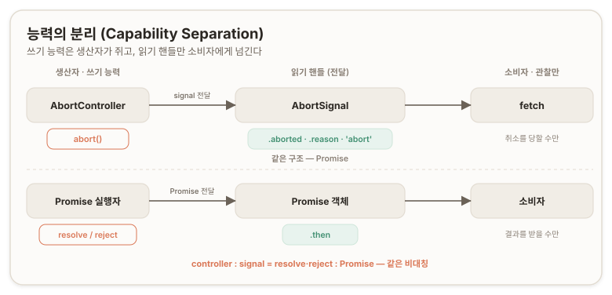
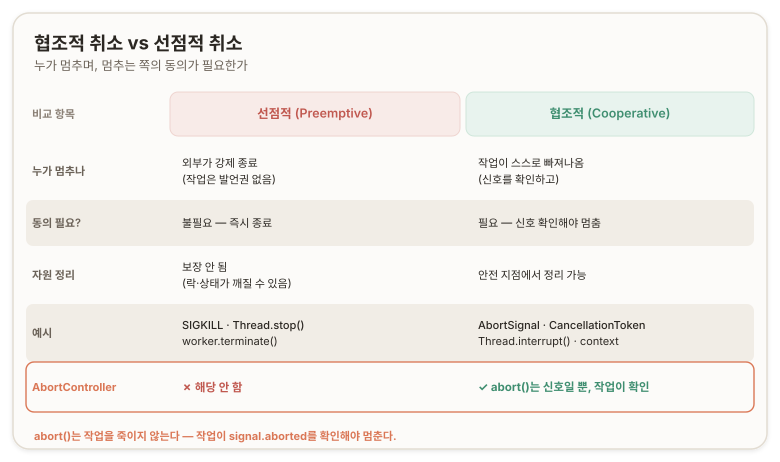
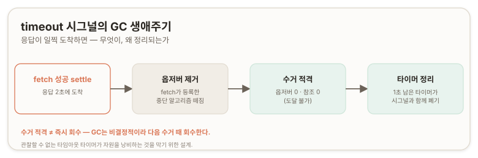

## 개요 ─ AbortController

비동기(asynchronous) 작업은 한 번 시작하면 완료와 실패 두 갈래로만 끝난다. 그 사이에 "더는 필요 없으니 멈춰라"를 끼워 넣는 표준 수단이 AbortController다. 비동기를 다룰 때 고려할 축은 취소(cancellation)·타임아웃(timeout)·경쟁 상태(race condition)·동시성(concurrency)·자원 정리(cleanup)·에러 처리(error handling) 여럿이며, AbortController는 그중 취소를 담당하면서 타임아웃·경쟁 상태·정리까지 하나의 메커니즘으로 묶어 비동기 생명주기 관리의 공용 손잡이가 된다.

이 문서는 그 손잡이의 코어다. 뒤따르는 다섯 축(수명·정리, EventTarget 기반, 합성·동시성, 스트림 취소, 프로덕션 전략)은 모두 이 코어에서 갈라진다.

> 이 시리즈는 취소를 기법의 모음으로 외우지 않고, 컨트롤러와 시그널이라는 한 쌍의 모델로 세운다. 모델을 쥐면 새 API의 취소 방식도 그 자리에 끼워 읽을 수 있다.

---

## 진단 질문

> **질문 1.**<br/>
> signal을 받는 abortable 함수에서, 함수 시작 시점에 `signal.aborted`를 왜 굳이 체크해야 하지? abort 이벤트 리스너만 걸면 안 되는 이유가 뭐야?

<none/>

> **질문 2.**<br/>
> `AbortSignal.any([userSignal, AbortSignal.timeout(5000)])`로 fetch를 걸었어. 5초 초과로 떨어졌는지 사용자가 취소했는지 catch에서 어떻게 구분할래?

<none/>

> **질문 3.**<br/>
> Proxmox API 폴링을 돌리는 코드에 AbortController를 끼운다면, "협조적 취소" 성질 때문에 폴링 루프를 어떻게 짜야 abort가 실제로 먹힐까?

<none/>

> **질문 4.**<br/>
> `AbortSignal.timeout(3000)`으로 fetch를 걸었는데 2초 만에 응답이 정상 도착했어. 이 경우 타이머는 어떻게 되고, 그 timeout 시그널과 거기 걸린 내부 리스너는 GC 관점에서 어떻게 정리될까?

<none/>

---

## A부 ─ 취소 메커니즘

## 01. 왜 AbortController인가 ─ 취소할 수 없는 Promise

Promise는 resolve와 reject 두 결말만 가지며, 진행 중인 Promise에 "그만"을 전달하는 표준 수단을 자체적으로 갖지 않는다. 한 번 출발한 네트워크 요청은 완료될 때까지 굴러가고, 그사이 사용자가 화면을 떠나거나 같은 요청을 다시 보내면 이전 요청이 서버 자원·대역폭·응답 처리 로직을 계속 점유한다.

취소 가능한 Promise를 표준화하려던 TC39(자바스크립트 표준 위원회) 제안은 철회되었고, 대신 Fetch를 중단하는 방법에 대한 WHATWG 논의에서 컨트롤러/시그널 모델이 나왔다. 그 결과가 "취소 신호를 비동기 작업에 별도로 전달하는 메커니즘"이며, 이름이 AbortController다. ([MDN: AbortController](https://developer.mozilla.org/en-US/docs/Web/API/AbortController), [WHATWG DOM 표준](https://dom.spec.whatwg.org/#interface-AbortSignal))

## 02. 컨트롤러와 시그널 ─ 능력의 분리

AbortController와 AbortSignal은 같은 취소 사건의 두 반쪽이다. AbortController는 `abort()`를 쥔 쓰기 쪽(취소를 일으키는 능력)이고, AbortSignal은 상태와 이벤트만 노출하는 읽기 쪽(취소를 관찰하는 핸들)이다. 시그널은 스스로 아무것도 취소하지 못하고 자신의 취소 상태를 전달만 한다. 이 분리를 능력 분리(capability separation)라 부른다 — 취소를 *트리거할 권한*과 취소에 *반응할 책임*을 서로 다른 객체로 나눈 것이다.

같은 구조가 Promise에도 있다. `new Promise((resolve, reject) => …)`에서 resolve·reject(쓰기 능력)는 생산자가 클로저에 쥐고, 소비자에게는 `.then`만 달린 Promise(읽기 핸들)를 넘긴다. AbortController : AbortSignal의 관계는 resolve·reject : Promise와 같은 비대칭이다. (이 대응은 학습용 비교이며, 명세는 동작만 규정한다 — 논리적 추론에 따른 정리.)



fetch에 컨트롤러 대신 시그널만 넘기는 것은 최소 권한을 따른 설계다. fetch는 "취소를 당할" 자격만 있으면 되고, "취소를 시킬" 권한(컨트롤러)은 호출자가 독점한다. 읽기 핸들만 흘려보냄으로써 취소 권한이 새는 것을 구조적으로 막는다.

시그널은 일회성(one-shot) 상태다. 한 번 취소되면 그 상태는 되돌릴 수 없고, 같은 시그널을 쓰는 fetch는 즉시 거부된다. 따라서 취소가 끝난 컨트롤러는 재사용하지 않고, 매 작업마다 새 컨트롤러를 만든다. `const { signal } = controller`로 시그널을 꺼내는 것은 `controller.signal`의 구조 분해(destructuring)다.

```js
const controller = new AbortController();
const { signal } = controller;   // controller.signal 의 구조 분해
controller.abort("이유");         // 기존 시그널을 취소시킴 (반환값 undefined)
signal.aborted;                  // true — 되돌릴 수 없음, 재사용 불가
```

## 03. signal은 전선, abort는 방아쇠

시그널을 요청에 넣는 것만으로는 취소가 일어나지 않는다. 시그널은 작업을 취소 채널에 연결하는 전선이고, 실제 취소는 그 시그널을 발화시키는 `abort()` 호출에서 일어난다.

```js
const controller = new AbortController();
await fetch(url, { signal: controller.signal });   // abort()를 부르지 않음
// → 결과는 fetch(url) 과 동일. 끝까지 진행된다. 자동 취소는 일어나지 않는다.
```

자동 취소처럼 보이는 경우(`AbortSignal.timeout` 등)도 발화 자체가 면제된 것이 아니라, 방아쇠를 타이머가 대신 당긴 것이다. 따라서 "언제 끊을지"(방아쇠)는 `abort()`가 정하고, "어떻게 끊을지"(연결 해체)는 fetch 구현이 처리한다는 두 국면을 분리해서 본다. (→ 04에서 후자를 다룬다.)

## 04. 협조적 취소와 선점적 취소

취소는 누가 작업을 멈추며 멈추는 쪽의 동의가 필요한가에 따라 둘로 갈린다. 선점적 취소(preemptive cancellation)는 외부 주체가 작업의 동의 없이 강제로 끝낸다. OS의 `SIGKILL`(`kill -9`), 폐기된 Java `Thread.stop()`, Web Worker의 `terminate()`가 여기 속한다. 협조적 취소(cooperative cancellation)는 외부가 신호만 보내고, 실제 중단은 작업이 그 신호를 직접 확인해 안전한 지점에서 빠져나오며 이뤄진다.

AbortController는 협조적 취소다. `abort()`는 신호일 뿐이며, 작업이 `signal.aborted`를 확인하거나 `'abort'` 이벤트에 반응하지 않으면 멈추지 않는다. 같은 모델이 다른 언어에도 있다 — Java의 `Thread.interrupt()`는 인터럽트 플래그를 세우고 스레드가 그것을 직접 확인하며, .NET의 `CancellationToken`은 `IsCancellationRequested`를, Go의 `context.Context`는 `ctx.Done()` 채널을 직접 감시한다. (이 대응은 학습용 비교이며 각 API의 세부는 공식 문서를 따른다.)



fetch가 자동으로 멈추는 것처럼 보이는 이유는, "취소를 확인하고 빠져나오는" 협조 로직을 브라우저가 내부에 구현해 두었기 때문이다. fetch는 시그널을 받아 그에 협조하도록 구현되어 있고, 취소 시 연결을 끊고 Promise를 `AbortError`로 거부한다. 직접 작성한 계산 루프에는 그런 내장 협조가 없으므로, `signal.aborted`를 직접 확인해야 취소가 성립한다. ([MDN: Using Fetch](https://developer.mozilla.org/en-US/docs/Web/API/Fetch_API/Using_Fetch))

```js
// 협조적 취소를 존중하는 폴링 — 세 곳에 협조 지점을 심는다
async function pollTask(upid, signal) {
  while (true) {
    signal.throwIfAborted();                          // ① 매 라운드 시작에서 확인
    const status = await fetchTaskStatus(upid, { signal }); // ② fetch에도 시그널 전달
    if (status.finished) return status;
    await wait(2000, signal);                         // ③ 폴 사이 대기도 취소 가능하게
  }
}
```

평범한 `setTimeout`으로 폴 사이를 재우면 `abort()`를 걸어도 그 잠든 시간은 끝까지 잔다. 신호를 확인하는 코드가 그 안에 없기 때문이다. 세 협조 지점을 모두 심어야 abort가 어느 타이밍에 떨어져도 즉시 빠져나온다.

> 진단 질문 3 ─ 오답과 해설
>
>> **Answer.** <br/>
>> (모르겠다고 답함) 폴링 루프를 어떻게 짜야 abort가 실제로 먹히는지 떠올리지 못했다.
>
>> **Review.** <br/>
>> 모른다고 솔직히 말한 건 인정. 답은 협조적 취소의 성질에서 나온다. 순진하게 while 루프에 fetch만 넣고 사이를 평범한 setTimeout으로 재우면, abort를 걸어도 그 잠든 시간은 끝까지 잔다 — 신호를 확인하는 코드가 그 안에 없으니까. 그래서 세 군데에 협조 지점을 심는다: 매 라운드 시작에 throwIfAborted()로 확인, fetch에도 signal 전달, 폴 사이 대기도 취소 가능한 wait로. 그래야 abort가 어느 타이밍에 떨어져도 즉시 빠져나온다.

## 05. fetch와의 결합 ─ RequestInit과 signal

fetch의 두 번째 인자는 요청을 구성하는 옵션 객체이며, 그 타입을 RequestInit이라 한다. `method`·`headers`·`body`·`mode`·`credentials`·`cache`·`redirect`·`signal`·`priority` 등이 들어가고, `signal`은 그중 취소 전용 필드다. `{ signal }`은 `{ signal: signal }`의 객체 속성 단축 표기(shorthand property)다. ([MDN: RequestInit](https://developer.mozilla.org/en-US/docs/Web/API/RequestInit))

취소 흐름은 컨트롤러를 만들고 그 시그널을 요청의 `signal`에 할당한 뒤, 취소 시 `abort()`를 부르면 fetch가 `AbortError`로 거부하는 것이다. 그 거부는 에러처럼 보이므로 `err.name === 'AbortError'`로 취소와 실제 장애를 구분한다. (→ 09에서 그 구분의 근거를 다룬다.)

```js
const controller = new AbortController();
fetch("/api/data", { signal: controller.signal })
  .then(res => res.json())
  .catch(err => {
    if (err.name === "AbortError") return;  // 취소 — 조용히 무시
    showError(err);                         // 진짜 네트워크/파싱 에러
  });
controller.abort();                         // 어딘가에서 취소

// 직전 요청을 취소하고 새로 보내는 패턴 (시그널이 일회성이므로 매번 새 컨트롤러)
let current = null;
async function search(term) {
  current?.abort();
  current = new AbortController();
  const res = await fetch(`/search?q=${term}`, { signal: current.signal });
  return res.json();
}
```

## 06. 직접 만드는 abortable 함수

표준 fetch만 시그널을 받는 것이 아니라, 사용자 함수도 시그널을 받아 취소 가능하게 설계할 수 있다. 패턴은 세 단계다 — 시작 시 `signal.aborted`를 확인해 이미 취소된 시그널을 즉시 거부하고, `'abort'` 이벤트에 리스너를 걸어 취소 시 진행 중 작업을 정리하고 거부하며, 정상 완료 시 그 리스너를 떼어 누수를 막는다. 표준 fetch와 같은 계약(시그널을 받는다)으로 설계하면 호출자는 표준이든 사용자 코드든 같은 방식으로 취소한다.

```js
function wait(ms, signal) {
  return new Promise((resolve, reject) => {
    if (signal.aborted) return reject(signal.reason);   // 이미 취소 → 이벤트 안 오니 즉시 처리
    const id = setTimeout(resolve, ms);
    signal.addEventListener("abort", () => {            // 대기 중 취소되면:
      clearTimeout(id);                                 //   타이머 정리하고
      reject(signal.reason);                            //   사유로 reject
    }, { once: true });                                 // 한 번 처리 후 리스너 자동 제거
  });
}
```

`'abort'` 이벤트는 취소가 발생하는 순간 한 번만 발화한다. 함수에 들어오기 전에 이미 취소된 시그널이라면 그 이벤트는 과거에 지나갔으므로, 시작 시점의 `signal.aborted` 확인이 없으면 리스너가 영원히 불리지 않아 Promise가 매달린다(pending). 시작 가드와 이벤트 리스너는 "이미 취소"와 "대기 중 취소"라는 서로 다른 시점을 각각 담당한다.

> 진단 질문 1 ─ 오답과 해설
>
>> **Answer.** <br/>
>> signal이 이미 취소되었는지 확인하기 위해서다. AbortSignal은 수정 불가능한 값이고, 이미 중단된 시점이라면 후속 로직을 넣을 필요가 없다고 보아, 'abort' 이벤트를 걸기 전에 불리언 값인 .aborted를 먼저 확인한다.
>
>> **Review.** <br/>
>> 절반만 맞았어. '확인한다'까지는 맞는데 *왜* 이벤트만으론 안 되는지를 놓쳤다. 'abort' 이벤트는 취소가 발생하는 순간 딱 한 번 발화한다. 시그널이 함수에 들어오기 전에 이미 취소돼 있었다면 그 이벤트는 과거에 지나가 버렸고, 지금 리스너를 걸어도 영원히 안 불린다. 그러면 Promise는 resolve도 reject도 안 된 채 매달린다. 그러니 .aborted 가드는 "후속 로직이 불필요해서"가 아니라 "안 하면 멈춰버려서" 거는 거다.

## 07. 정적 팩토리 ─ timeout · any · abort

AbortSignal에는 인스턴스 코어(생성자·`signal`·`abort()`·`aborted`·`'abort'` 이벤트·`reason`·`throwIfAborted()`) 외에, 반복되는 조립을 표준이 대신하는 정적 메서드 셋이 있다.

`AbortSignal.timeout(ms)`는 지정 시간 뒤 자동 취소되는 시그널을 만든다. 타임아웃으로 떨어지면 사유가 `TimeoutError`이므로 시간 초과와 사용자 취소(`AbortError`)를 구분할 수 있다. 이 타임아웃은 활성(active) 시간 기준이라, 워커가 정지하거나 문서가 백/포워드 캐시에 들어가면 일시정지된다. ([MDN: AbortSignal.timeout()](https://developer.mozilla.org/en-US/docs/Web/API/AbortSignal/timeout_static))

`AbortSignal.any([...])`는 여러 시그널을 합쳐, 그중 하나라도 취소되면 합본도 취소되고 사유는 먼저 터진 시그널의 것을 따른다. 사유 하나당 컨트롤러 하나를 만들어(사용자 취소·컴포넌트 언마운트·타임아웃) `any`로 합성하는 것이 용도별 구성의 기본이다. 단 합본만 보아서는 최종 취소가 어느 사유인지 구분되지 않으므로, `err.name`이나 `reason`으로 가른다. ([MDN: AbortSignal.any()](https://developer.mozilla.org/en-US/docs/Web/API/AbortSignal/any_static))

```js
const userController = new AbortController();
const signal = AbortSignal.any([
  userController.signal,        // 사용자 취소
  AbortSignal.timeout(5000),    // 시간 초과 (TimeoutError)
]);
try {
  const res = await fetch(url, { signal });
} catch (err) {
  if (err.name === "TimeoutError") notifyTimeout();   // 5초 초과
  else if (err.name === "AbortError") { /* 사용자 취소 */ }
  else throw err;
}
```

`AbortSignal.abort(reason)`는 이미 취소된 상태의 시그널을 만든다. 세 정적 메서드 중 쓰임이 가장 적으며, 조기 반환이나 테스트 스텁에 쓴다. ([MDN: AbortSignal.abort()](https://developer.mozilla.org/en-US/docs/Web/API/AbortSignal/abort_static))

`AbortSignal.abort()`(정적·팩토리)와 `controller.abort()`(인스턴스·트리거)는 이름이 같지만 하는 일이 반대다. 전자는 새 시그널을 반환하고 아무것도 취소하지 않으며, 후자는 반환값이 없고 기존 시그널을 취소시키며 `'abort'` 이벤트를 발화한다. ([MDN: AbortController.abort()](https://developer.mozilla.org/en-US/docs/Web/API/AbortController/abort))

> 진단 질문 2 ─ 오답과 해설
>
>> **Answer.** <br/>
>> 사용자가 취소했다면 그 에러는 AbortError이므로, catch가 잡은 에러로 구분할 수 있다.
>
>> **Review.** <br/>
>> 방향은 맞는데 한 칸 부족하다. any에 묶인 게 AbortSignal.timeout이었지. 타임아웃 쪽이 터지면 그건 AbortError가 아니라 TimeoutError로 떨어진다. 그래서 둘은 err.name으로 갈린다 — 사용자 취소는 'AbortError', 시간 초과는 'TimeoutError'. 잡은 에러로 구분한다는 발상은 옳았는데, "타임아웃은 다른 이름의 에러"라는 디테일을 알아야 실제 분기가 된다.

---

## B부 ─ 객체의 정체와 메모리

## 08. 시그널 멤버의 정체 ─ IDL 속성과 연산

웹 API의 모양은 Web IDL(Interface Definition Language, 인터페이스 정의 언어)로 정의된다. Web IDL은 멤버를 두 종류로 나눈다 — 속성(attribute)은 객체가 노출하는 상태를, 연산(operation)은 호출할 수 있는 행위를 기술한다. ([Web IDL 표준](https://webidl.spec.whatwg.org/))

이 기준에서 `.aborted`와 `.reason`은 상태이므로 속성이고, 둘 다 `readonly attribute`라 게터(getter)만 노출되어 대입이 막힌다. `.throwIfAborted()`는 행위이므로 연산(메서드)이며 속성이 아니다 — 괄호가 붙는 것이 그 표시다. 정적 메서드 `abort`·`timeout`·`any`는 인스턴스가 아니라 `AbortSignal` 생성자에 붙는 정적 연산이며, `new` 없이 호출한다. 속성과 연산을 가르는 기준은 "상태를 들고 있는가, 행위를 수행하는가"다.

## 09. Error와 DOMException ─ AbortError의 혈통

`new Error("…")`는 문자열이 아니라 객체다. `message`(문자열), `name`("Error"), `stack`(호출 스택, 비표준이나 모든 엔진이 제공), 그리고 ES2022부터 `cause`를 가진다. `TypeError`·`RangeError` 등은 `Error`의 서브클래스다. ([MDN: Error](https://developer.mozilla.org/en-US/docs/Web/JavaScript/Reference/Global_Objects/Error))

AbortError는 별도의 클래스가 아니다. 브라우저에서 AbortError는 `new DOMException('…', 'AbortError')`, 즉 `name`이 `'AbortError'`인 DOMException 인스턴스다. DOMException은 웹 API의 비정상 사건을 나타내는 독자 인터페이스로, `name`·`message`·`code`(레거시 숫자; ABORT_ERR는 20, TIMEOUT_ERR는 23)를 가지며 `structuredClone`·`postMessage`로 직렬화된다. DOMException은 Error의 실제 서브클래스로 명세되지 않았다 — Error 생성자가 DOMException 생성자의 프로토타입이 아니다. 따라서 `abortErr instanceof Error`는 `false`다. ([MDN: DOMException](https://developer.mozilla.org/en-US/docs/Web/API/DOMException))

그래서 취소를 구분하는 안정적 수단은 `err.name === 'AbortError'`다. `instanceof Error`는 DOMException이 Error 서브클래스가 아니라 막히고, `instanceof DOMException`은 환경에 따라 깨진다 — Node는 과거 DOMException이 없어 AbortError를 `name`만 세팅한 Error로 만들었다. `name` 문자열은 환경·렘(realm)을 가리지 않는 계약이며, 표준도 취소 시 `'AbortError'` DOMException으로 거부할 것을 권장한다. 종류 불문 "에러인가"만 묻는다면 `Error.isError()`가 크로스-렘에서 동작하고 DOMException에도 `true`를 반환하지만, "어떤 에러인가"는 여전히 `name`으로 가른다. ([MDN: Error.isError()](https://developer.mozilla.org/en-US/docs/Web/JavaScript/Reference/Global_Objects/Error/isError))

```js
const a = new DOMException("The operation was aborted", "AbortError");
a.name;                 // "AbortError"
a.code;                 // 20  (레거시 ABORT_ERR)
a instanceof DOMException; // true
a instanceof Error;        // false  ← 그래서 구분은 name으로
```

## 10. addEventListener는 왜 시그널에 걸리나 ─ EventTarget과 이미지 로더 해부

시그널에 `addEventListener`가 걸리는 이유는 AbortSignal이 EventTarget을 상속하기 때문이다. 버튼이 EventTarget을 상속해 `'click'`을 디스패치하듯, 시그널은 취소 시 `'abort'`를 디스패치한다. 같은 이벤트 기계를 DOM이 아닌 객체에 적용한 것이며, `signal.addEventListener('abort', cb)`는 `button.addEventListener('click', cb)`와 같은 종류의 호출이다. ([MDN: EventTarget](https://developer.mozilla.org/en-US/docs/Web/API/EventTarget))

이 상속을 활용한 정리 패턴이 취소 가능한 이미지 로더에 드러난다. 함수는 외부에서 받은 시그널(호출자의 취소 손잡이)과 함수 내부의 별도 컨트롤러(리스너 청소 전담)를 함께 쓴다. 이미지의 `'load'`·`'error'`와 외부 시그널의 `'abort'` 세 리스너를 모두 내부 컨트롤러의 시그널로 등록하면(`addEventListener`의 `signal` 옵션), 종료 시 내부 컨트롤러를 한 번 abort하는 것으로 세 리스너가 동시에 제거된다.

```js
const loadImage = (src, { signal } = {}) => {
  return new Promise((resolve, reject) => {
    signal?.throwIfAborted();                       // 이미 취소면 즉시 거부

    const img = new Image();
    const listenerController = new AbortController();   // 내부 청소부 (외부 비노출)
    const listenerSignal = listenerController.signal;

    const onLoad = () => { listenerController.abort(); resolve(img); };
    const onError = () => { listenerController.abort(); reject(new Error("load error")); };
    const onAbort = () => {
      listenerController.abort();
      img.src = "";                                 // 진행 중 다운로드 중단
      reject(signal?.reason ?? new DOMException("Aborted", "AbortError"));
    };

    // 세 리스너 모두 listenerSignal에 묶음 → abort 한 번으로 일괄 제거
    signal?.addEventListener("abort", onAbort, { signal: listenerSignal });
    img.addEventListener("load", onLoad, { signal: listenerSignal });
    img.addEventListener("error", onError, { signal: listenerSignal });
    img.src = src;
  });
};
```

세 종료 경로(로드 성공·실패·취소)는 각각 (1) 내부 컨트롤러를 abort해 리스너를 정리하고 (2) Promise를 settle하며, Promise는 한 번만 settle되므로 먼저 발생한 경로가 결과를 정한다. 취소 경로에서는 `img.src = ''`로 진행 중인 다운로드를 멈추고, 사유는 호출자가 준 `reason`이 있으면 그것을, 없으면 `new DOMException('Aborted', 'AbortError')`를 쓴다 — AbortError가 전용 클래스가 아니라 `name`이 박힌 DOMException임을 그대로 보여준다. `signal?.`는 시그널이 선택 인자(`{ signal } = {}`)이므로 모든 시그널 접근을 가드한 것이다. ([이벤트 리스너의 signal 옵션 동작](https://jakearchibald.com/2020/events-and-gc/))

## 11. 메모리와 GC ─ 도달 가능성과 옵저버

가비지 컬렉션(Garbage Collection, GC)이 객체를 수거하는 기준은 작업 완료가 아니라 도달 가능성(reachability)이다 — 루트(전역·콜스택)에서 그 객체로 가는 참조 경로가 남았는가. 요청마다 만드는 단명 컨트롤러는 작업이 끝나며 참조가 끊기면 수거 적격이 되고, 시그널에 건 리스너와 그것이 참조하는 것들은 `'abort'`가 발화될 수 있는 동안만 살아 있으면 되므로, 컨트롤러·시그널이 도달 불가가 되면 함께 수거된다. 따라서 per-request 컨트롤러를 매번 만드는 것은 누수가 아니다. ([Jake Archibald: 이벤트 리스너와 GC](https://jakearchibald.com/2020/events-and-gc/))

누수는 단명 컨트롤러가 아니라 장수(long-lived) 시그널에 떼지 않은 리스너·`any()`에서 난다. 시그널이 영원히 살아 있으면 `'abort'`가 여전히 발화 가능하므로 리스너를 수거할 수 없다. `AbortSignal.any()`는 넘긴 시그널 중 하나가 장수하며 붙들려 있으면 누수를 일으킨다. 표준은 파생 시그널을 약한 참조(weak reference)로 잡고, 타임아웃·파생 시그널을 "아직 취소 가능 + 옵저버 있음"일 때만 강한 참조로 유지하도록 설계한다. ([AbortSignal.any 메모리 관리 설명서](https://github.com/shaseley/abort-signal-any/blob/main/signal-memory-management.md))

타임아웃 시그널의 정리는 옵저버(observer)로 설명된다. fetch는 시그널을 받을 때 자신의 중단 알고리즘(abort algorithm)을 등록하며, 이것이 시그널의 옵저버다. 시그널에 중단 알고리즘을 등록한 객체는 그 알고리즘이 효과를 가질 수 있는 동안만 시그널을 살려두고, 효과가 사라지면 알고리즘을 제거한다 — fetch가 성공적으로 끝나면 그 알고리즘은 효과가 없으므로 제거해도 정확성에 문제가 없다. 따라서 응답이 일찍 도착해 fetch가 옵저버를 떼면, 옵저버 0이 된 timeout 시그널은 수거 적격이 되고 그와 함께 타이머도 정리된다. 이 설계는 관찰할 수 없는 타임아웃의 펜딩 타이머가 자원을 낭비하는 문제를 막기 위한 것이다. 수거 적격은 즉시 회수가 아니며, GC는 비결정적(non-deterministic)이라 적격이 된 객체를 다음 수거 때 치운다.



명세상 GC 가능과 런타임의 실제 GC는 별개다. Node에서 `AbortSignal.timeout` 관련 누수가 보고된 적이 있으므로, 장수 프로세스에서 timeout·any를 대량으로 쓰면 힙 스냅샷으로 실측한다. ([Node 이슈: timeout 누수 사례](https://github.com/nodejs/node/issues/48951))

> 진단 질문 4 ─ 오답과 해설
>
>> **Answer.** <br/>
>> fetch 작업 자체가 끝났으니 관련 인스턴스가 모두 정리되고, fetch가 들고 있던 RequestInit 객체와 그 안의 AbortSignal도 바로 GC 대상이 될 것이다.
>
>> **Review.** <br/>
>> 절반 점수. "정리된다, 누수 없다"는 결론은 맞는데 인과가 틀렸어. GC는 작업 완료를 보지 않는다 — 도달 가능성만 본다. 그리고 진짜 물은 타이머를 통째로 건너뛰었지. fetch가 2초에 성공 settle하면 시그널에 등록했던 자기 중단 알고리즘(옵저버)을 떼고, 옵저버 0 + 유저랜드 참조 0이 된 timeout 시그널은 그때 수거 적격이 되며, 그와 함께 1초 남은 타이머도 정리된다. "fetch가 끝나서"가 아니라 "도달 가능한 참조가 없어서"다. 그리고 적격 ≠ 즉시 회수 — GC는 비결정적이라 적격이 된 뒤 다음에 돌 때 치운다.

---

## 부록 A. 핵심 어휘 빠른 참조

| 용어 | 한 줄 정의 |
| --- | --- |
| **능력 분리(Capability separation)** | 취소를 트리거할 권한(컨트롤러)과 관찰할 책임(시그널)을 다른 객체로 나눈 설계. |
| **일회성(One-shot)** | 한 번 취소되면 되돌릴 수 없고 재사용 불가한 시그널의 상태 성질. |
| **협조적 취소(Cooperative cancellation)** | 외부는 신호만 보내고 작업이 직접 확인해 멈추는 취소. AbortController가 이 방식. |
| **선점적 취소(Preemptive cancellation)** | 작업의 동의 없이 외부가 강제 종료하는 취소(SIGKILL, Thread.stop 등). |
| **RequestInit** | fetch 두 번째 인자의 옵션 객체 타입. method·headers·body·signal 등을 담는다. |
| **단축 표기(Shorthand property)** | `{ signal }` = `{ signal: signal }`. 키와 변수명이 같을 때의 객체 리터럴 축약. |
| **AbortError** | 전용 클래스가 아니라 `name`이 `'AbortError'`인 DOMException 인스턴스. |
| **TimeoutError** | `AbortSignal.timeout` 만료 시의 사유. `name`이 `'TimeoutError'`인 DOMException. |
| **DOMException** | 웹 API의 비정상 사건을 나타내는 인터페이스. Error의 서브클래스가 아니다. |
| **IDL 속성(Attribute) / 연산(Operation)** | Web IDL에서 상태를 노출하면 속성, 행위를 수행하면 연산(메서드). |
| **EventTarget** | addEventListener를 제공하는 이벤트 대상의 상위 인터페이스. AbortSignal이 상속. |
| **도달 가능성(Reachability)** | GC가 수거 여부를 판정하는 기준. 루트에서 참조 경로가 남았는지. |
| **옵저버 / 중단 알고리즘(Abort algorithm)** | fetch가 시그널에 등록하는 콜백. 효과가 없어지면 제거되어 시그널 수거를 허용. |

---

## 부록 B. API 표면 빠른 참조

```js
// === AbortController (인스턴스) ===
const controller = new AbortController();
controller.signal;            // 짝꿍 AbortSignal (읽기 전용)
controller.abort(reason);     // 기존 시그널을 취소 (reason은 임의 값, 반환 undefined)

// === AbortSignal (인스턴스 멤버) ===
signal.aborted;               // boolean — 동기적으로 취소 여부 확인 (IDL 속성)
signal.reason;                // 취소 사유 (abort에 넘긴 값) (IDL 속성)
signal.throwIfAborted();      // 취소면 reason을 throw, 아니면 통과 (IDL 연산)
signal.addEventListener("abort", cb, { once: true }); // 'abort' 이벤트 (EventTarget 상속)
signal.onabort = cb;          // 동일한 이벤트의 핸들러 형태

// === AbortSignal (정적 팩토리) ===
AbortSignal.timeout(5000);    // 5초 뒤 자동 취소 (만료 시 TimeoutError)
AbortSignal.any([a, b]);      // 합성: 하나라도 취소되면 합본 취소 (사유는 먼저 터진 것)
AbortSignal.abort(reason);    // 이미 취소된 새 시그널 (controller.abort()와 정반대)

// === fetch 결합 ===
fetch(url, { signal });       // { signal } = { signal: controller.signal }
// 취소: controller.abort()  →  fetch가 AbortError로 거부
// 구분: catch (err) { if (err.name === "AbortError") … }   // instanceof 금지
```

---

## 개인 노트

### 미완·심화로 가는 길 (5축 — 이 문서는 그 허브)

이 문서는 다섯 축이 갈라지는 코어다. 의존 순서로 다음 학습이 이어진다.

- **축1 ─ 수명·정리** — `using`/`await using`·`Symbol.dispose`/`asyncDispose`(ES2023 명시적 자원 관리), `WeakRef`/`FinalizationRegistry`. 이 문서 11절(리스너 정리·GC)의 언어 차원 결말. ([TC39 Explicit Resource Management](https://github.com/tc39/proposal-explicit-resource-management))
- **축2 ─ EventTarget 기반** — EventTarget 상속·직접 구현, `CustomEvent`/`dispatchEvent`, 리스너 옵션 전체. 10절의 바닥암반.
- **축3 ─ 합성·동시성** — Promise 결합자 × 시그널, 동시성 제한, cancel-previous. 07절 `any`의 확장.
- **축4 ─ 스트림 취소** — async 이터레이터/제너레이터, Web Streams·백프레셔. 04절 협조적 취소의 연속 흐름 버전.
- **축5 ─ 프로덕션 전략** — 타임아웃 전략·재시도·멱등성·취소 테스트·누수 실측. 전체 재통합 캡스톤.

### 도식

세 도식이 본문에 임베드되어 있다 — ① 02절 능력 분리(`capability_separation.svg`), ② 04절 협조적 vs 선점적 취소(`cooperative_vs_preemptive.svg`), ③ 11절 timeout 시그널 GC 생애주기(`timeout_signal_gc_lifecycle.svg`). 셋 다 자립형(self-contained) SVG로 색·폰트를 내장하고 라이트 카드 배경을 둬, 다크 모드 페이지에서도 figure로 일관되게 읽힌다. 경로: `./_embeds/img/00-core/<name>.svg`.

### 자기 점검 ─ 진단 질문 재방문

1. **`.aborted` 시작 가드의 이유 (이미 취소면 이벤트가 안 와 매달림)** → 06
2. **timeout vs 사용자 취소 구분 (`TimeoutError` vs `AbortError`, `err.name`)** → 07 (근거는 09)
3. **협조적 폴링 (throwIfAborted + fetch에 signal + 취소 가능한 wait)** → 04
4. **timeout GC (도달 가능성 + 옵저버 제거 → 타이머 정리, 적격 ≠ 즉시 회수)** → 11

---

다음 [축1: 수명·정리](./01-lifecycle-cleanup)에서 `using`과 명시적 자원 관리로, 11절에서 손으로 떼던 리스너 정리를 언어 차원에서 강제하는 길로 이어진다.
