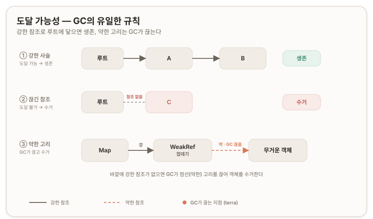
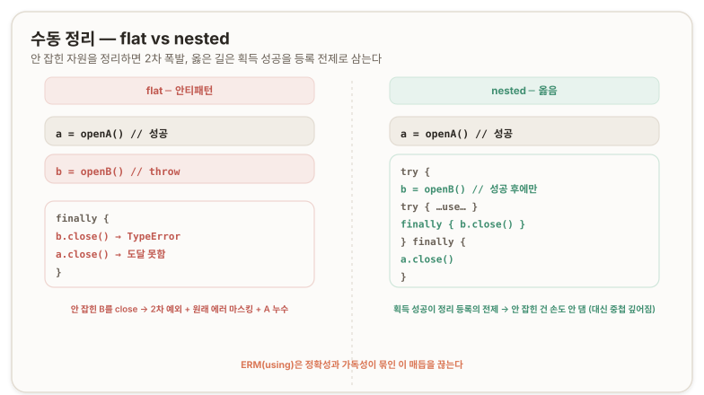
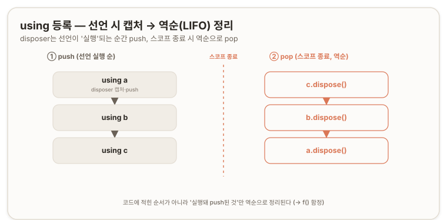
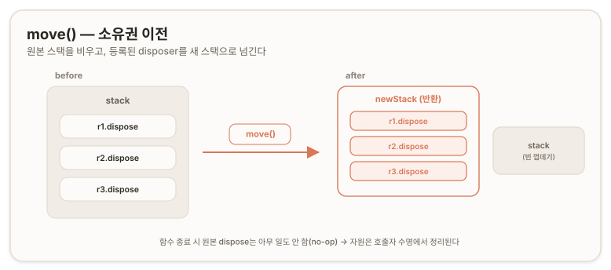
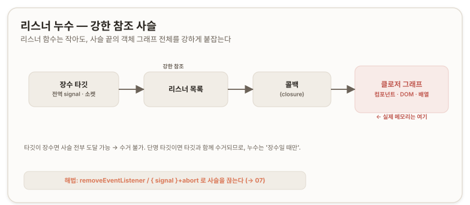
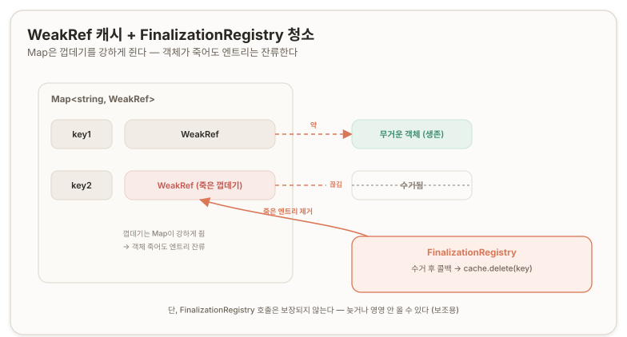
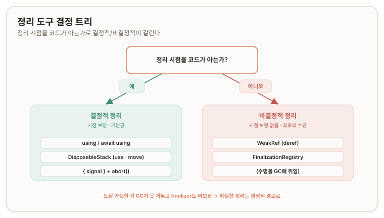

## 개요 ─ 수명·정리

비동기(asynchronous) 작업을 다룰 때 고려할 축은 취소·타임아웃·경쟁 상태·동시성·자원 정리(cleanup)·에러 처리 등 여럿이며, AbortController는 그중 취소를 담당했다. 이번에 다루는 것은 **자원 정리(cleanup)** 다 — **리스너·타이머·연결을 "까먹지 않고" 거두는 일을 *언어 차원에서 강제하는* 메커니즘.**

출발점은 이벤트 리스너와 GC. per-request 컨트롤러는 도달 불가가 되면 수거되지만, 전역·장수(long-lived) 시그널에 손으로 건 리스너는 손으로 떼야 했다. [(→ 11. 메모리와 GC \[AbortController ─ '취소' 컨트롤러\])](./00-core.md#memory-and-gc) `removeEventListener`·`{ once: true }`·`try/finally`로 하던 그 수동 정리를, 이 축에서는 언어 구문으로 옮긴다.

정리는 *언제 정리되는지를 코드가 아느냐* 로 두 갈래로 갈린다.

- **결정적 정리(deterministic cleanup)** — 정리 시점을 *코드가 안다.* 스코프 종료가 그 시점이다. `using`/`DisposableStack`, 그리고 `{ signal }`+`abort()`가 여기 속한다. (A·B부)
- **비결정적 정리(non-deterministic cleanup)** — 정리 시점을 가비지 컬렉터(Garbage Collector, GC)에 *위임한다.* 시점 보장이 없다. `WeakRef`/`FinalizationRegistry`가 여기 속한다. (C부)

이 두 갈래는 **도달 가능성(reachability)** 이라는 토대로부터 시작된다. 이 문서는 그 토대를 먼저 다지고, 결정적 정리(A·B부) → 비결정적 정리(C부) → 둘을 가르는 분기선 순으로 쌓는다.

> 정리를 **"기억해야 하는 규율"** 에서 **"언어가 보장하는 동작"** 으로 옮긴다.

---

## 진단 질문

> **질문 1. ─ 수동 정리의 한계**<br/>
> 리스너 정리를 `finally`로 하면 충분한가? 안 충분하면 "장황하다(verbose)" 말고 **구조적으로** 뭐가 부족한지 —
>
> (a) 자원이 1개가 아니라 N개로 늘면 `try/finally`는 어떤 꼴이 되나?
>
> (b) 자원 A를 잡고 B를 잡으려다 **B 획득 도중에** 예외가 터지면, 정확히 뭘 정리해야 하고 뭘 정리하면 **안 되나**? 순서는?
>
> (c) 애초에 `finally`를 **안 쓰는** 코드를 컴파일러나 런타임이 막아주나?

<none/>

> **질문 2. ─ ERM 의미론**<br/>
> (a) `using r = …`에서 dispose가 불리는 **정확한** 타이밍은? 블록 안에서 `return`/`throw`로 빠져나가도 불려? 같은 시점에 `const`/`let` 바인딩이 죽는 것과 **뭐가 다른가**?
>
> (b) dispose 대상이 되려면 객체가 뭘 만족해야 하나? 아무 객체나 꽂을 수 있나? 못 꽂는 걸 꽂으면 에러야 무시야? `null`/`undefined`는?
>
> (c) `using x = …; if (cond) return; using y = …` 에서 `cond`가 `true`라 `return`을 탄다면, 콘솔 출력은? (`y`가 어떻게 되는지가 포인트)

<none/>

> **질문 3. ─ 자원 합성·소유권**<br/>
> (a) (가) 열어야 할 파일 개수 N이 **런타임에** 정해진다(배열 길이만큼 루프). 다 쓰면 전부 닫아야 한다. plain `using`만으로 되나? (나) 자원 3개를 잡아 **호출자에게 통째로 돌려주는** 팩토리인데, 2번째를 잡다 실패하면 **이미 잡은 1번째는 닫고** 에러를 던지고, 셋 다 성공하면 **하나도 닫지 않고** 반환한다(닫는 책임은 호출자). plain `using`으로 되나?
>
> (b) `using stack = new DisposableStack(); stack.defer(() => console.log("cleanup")); const moved = stack.move(); return moved;` 를 `using result = f()`로 받고 `console.log("end")` 하면 출력은? `cleanup`은 언제·몇 번?

<none/>

> **질문 4. ─ 도달 가능성·강/약 참조**<br/>
> (a) `using`/`DisposableStack`으로 정리가 **안 되는**, 혹은 부적합한 상황은?
>
> (b) `cache.set(key, fresh)`와 `cache.set(key, new WeakRef(fresh))`는 **GC 입장에서** 정확히 뭐가 다른가?

<none/>

> **질문 5. ─ EventTarget 리스너 수명**<br/>
> (a) 장수 시그널에 리스너를 안 떼면 새는 게 **메모리상 정확히 뭐**인가? 그리고 그 시그널을 **약하게만** 참조하고 싶다면 일반 참조(`const x = signal`)로 그게 되나, 안 되나? 안 되면 왜?
>
> (b) 장수 소켓에 **익명 함수**로 리스너를 달면 왜 누수고, `{ signal }`을 쓰면 왜 안 새는가?

<none/>

> **질문 6. ─ 비결정적 정리**<br/>
> (a) 캐시의 죽은 엔트리를 치우려면 객체가 **수거된 순간**을 알아야 `delete` 할 수 있는데, `WeakRef`의 `deref()`만으로 그 시점을 **통보받을** 수단이 있나?
>
> (b) "이 객체가 수거되면 이 콜백을 실행해줘"라는 등록이 가능하다면 죽은 엔트리·소켓 래퍼를 청소할 수 있을 텐데 — 그 **수거 후 콜백**이 가능한지, 가능하다면 그 타이밍을 믿어도 되는지?

<none/>

---

## 토대 ─ 도달 가능성 (GC의 유일한 규칙) {#section-base}

가비지 컬렉터가 객체를 수거하는 기준은 작업 완료가 아니라 **도달 가능성(reachability)** 이다 — 루트(전역·콜스택·살아 있는 클로저)에서 그 객체로 가는 강한 참조 경로가 남았는가. 도달 가능한 객체는 수거되지 않고, 도달 불가능한 것만 수거된다.

여기서 **강한 참조(strong reference)** 는 특별한 것이 아니라 *보통의 모든 참조* 다 — `=` 대입, 객체 프로퍼티, 배열 원소, `Map`의 키와 값, 클로저가 캡처한 변수, 그리고 `EventTarget`이 들고 있는 리스너 목록까지. 이 중 하나라도 루트까지 이어지면 그 끝의 객체는 수거되지 않는다.

```markdown
[루트] ──강한──> A ──강한──> B      // A, B 모두 도달 가능 → 수거 불가
[루트]      ✗          C            // C로 가는 강한 참조 없음 → 수거 대상
```

이 규칙의 따름결론(corollary)이 이 문서 전체에서 반복해 쓰인다 —

> "GC가 알아서 치워주겠지"는 **대상이 도달 불가능할 때만** 참이다.

누군가 아직 강하게 쥐고 있으면 GC는 손을 대지 못한다. *아직 참조되는데 알아서 치워주는 GC는 없다.* (C부에서 소켓에 등록된 리스너 래퍼가 왜 GC로 안 사라지는지를 다룬다.)

GC의 동작 시점·여부를 코드에서 관찰 가능하게 만들지 않는 것은 언어 설계의 의도다. WeakRef 제안은 그 이유를 명시한다. ***"GC 동작이 코드에 드러나면 사람들이 그 동작에 의존하는 코드를 쓰게 되고, 엔진이 GC를 바꾸면 그 코드가 깨지기 때문이다.([TC39: proposal-weakrefs](https://github.com/tc39/proposal-weakrefs))"*** 이 설계 의도가 **약한 참조**와 **finalizer**를 "신중히, 최후의 수단으로" 써야 하는 근거가 된다.

요컨대 이 토대는 두 방향을 동시에 떠받친다 — A부에서는 "수동 정리가 왜 깨지고 왜 결정적 도구가 필요한가"의 바닥이고, C부에서는 "왜 *약한* 참조라는 별도 도구가 필요한가"의 바닥이다.



---

# A부 ─ 결정적 정리 (시점을 *아는* 정리)  {#section-a}

## 01. 왜 ERM인가 ─ 수동 정리의 취약성 {#why-erm}

코어가 남긴 수동 정리 도구는 셋이다 — `removeEventListener`, `{ once: true }`, `try/finally`. 이 중 `finally`가 가장 만능처럼 보인다. early return이 있어도 돌고, 예외가 터져도 돈다. 그러나 자원이 둘 이상으로 늘면 구조적 한계가 드러난다.

<br/>

**flat 패턴 — 다 잡고 다 정리하는 납작한 구조(Anti-pattern).**<br/>
자원 둘을 한 `try`에 잡고 한 `finally`에 정리하면 다음이 일어난다.

```js
let a, b;
try {
  a = openA();          // A 획득 성공
  b = openB();          // 💥 여기서 throw → b는 undefined인 채 finally로 점프
  // ...a, b 사용...
} finally {
  b.close();            // 💥 undefined.close() → 새 TypeError. 원래 openB 에러는 덮여 사라짐(에러 마스킹)
  a.close();            // 도달 못 함 → A가 샌다
}
```

`openB()`가 던지면 `b`는 `undefined`인 채 **finally**로 가고, 거기서 `b.close()`가 *없는 것을 닫으려다* 새 `TypeError`를 던진다. 그 바람에 원래 `openB`의 에러는 그 밑에 깔려 사라지고 *(에러 마스킹, error masking)*, `a.close()`는 도달조차 못 해 A가 샌다. **잡힌 적 없는 B는 정리 대상이 아닌데, flat 구조는 그것을 가려내지 못한다.** `if (b) b.close()` 같은 가드로 때울 수는 있으나, 그 가드를 *기억해서 적어야* 하고 `a.close()`가 다시 던지면 마스킹은 여전하다.

<br/>

**nested 패턴 — 구조적으로 옳은 수동 정리.**

```js
const a = openA();
try {
  const b = openB();    // 실패하면 바깥 finally로 직행, b 정리 시도 자체가 없음
  try {
    // ...a, b 사용...
  } finally {
    b.close();          // b의 try 안 → b를 성공적으로 잡은 뒤에만 진입
  }
} finally {
  a.close();            // a는 항상 정리
}
```

`b.close()`가 `b`의 **try** 안에 있어, `const b = openB()`가 성공한 뒤에야 그 블록에 진입한다. 그래서 **"획득 성공"이 "정리 등록"의 전제조건이 되고, 안 잡힌 자원은 정리 시도가 일어나지 않는다.** 대신 자원 2개에 들여쓰기 2단, 3개면 3단으로 중첩이 깊어진다 *(pyramid of doom)*. 정확하게 하려면 이 중첩을 피할 수 없으므로 정확성과 가독성에 타협이 뒤따른다.

명시적 자원 관리(Explicit Resource Management, ERM)는 그 매듭을 끊는다.

<br/>

**강제 부재 — 가장 본질적인 결함.**<br/>
**try/finally**는 관용(convention)일 뿐 보장(guarantee)이 아니다. 정리 구문을 안 적어도 컴파일러나 런타임이 막지 않는다. acquire와 release의 짝을 언어가 강제한 적이 없으므로, disposable을 만들어두고 등록을 빠뜨려도 잡히지 않는다. ERM은 정리를 *"기억해야 하는 규율"에서 "스코프에 묶인 언어 보장"으로* 옮긴다. 위원회도 이 강제를 더 끌어올리려는 후속 제안을 별도로 진행 중이며, `Symbol.enter`를 가진 자원에 엄격한 강제 의미를 부여하는 방향이다. ([TC39: proposal-using-enforcement](https://github.com/tc39/proposal-using-enforcement))



> 진단 질문 1 ─ 오답과 해설
>
>> **Answer.** <br/>
>> (a) 블록이 자원별로 병렬 나열되거나, 중첩에 중첩이 이어질 것 같다.
>>
>> (b) 자원 A→B로 잡으려던 작업을 통째로 정리해야 하고, 순서는 B부터 A로 역순이다.
>>
>> (c) 안 막아준다.
>
>> **Review.** <br/>
>> (a) 병렬 나열과 중첩은 동급이 아니야. "병렬 나열"(한 try에 다 잡고 한 finally에 다 정리)은 flat 패턴 — **틀린** 구조고, (b)에서 그대로 터진다. "중첩"만이 유일하게 옳은 수동 패턴이고, 그게 네가 말한 가독성 붕괴(pyramid)지. 정확하게 하려면 무조건 중첩, 중첩하면 무조건 못 읽는 코드 — 정확성과 가독성이 한 매듭이라는 게 핵심이고 ERM이 그걸 끊는다.
>>
>> (b) "통째로 정리"가 틀렸어. B를 **잡는 도중에** 터졌으면 B는 애초에 존재하지 않아. 잡힌 건 A뿐이다. 통째로 정리하려 들면 잡힌 적 없는 B를 close하려다 2차 예외가 나고 원래 에러는 마스킹된다. 역순 직감은 맞았어 — 둘 다 잡힌 뒤 몸통에서 터지면 B→A로 푸는 게 맞다.
>>
>> (c) 정답. 관용이지 보장이 아니라는 것까지 짚었으면 만점이었다.

## 02. using과 Symbol.dispose ─ 정의

`using`은 `const`와 **다른 개념이 아니라, `const` + "정리 등록" 한 줄**이다. 변수 바인딩 동작은 `const`와 동일하다 — 블록 스코프, 재할당 불가, 스코프 안에서 그냥 변수로 쓴다. `using`이 추가로 하는 일은 하나뿐이다: "이 스코프가 끝나면 그 객체의 `[Symbol.dispose]()`를 불러라"를 등록한다.

**"정리할 줄 아는 객체"** 는 프로토콜로 정의된다. 객체가 `[Symbol.dispose]()` 메서드를 가지면 그 객체는 disposable(정리 가능)이며 `using`의 대상이 된다. `Symbol.dispose`는 JS 내장 *well-known symbol* 로, 그 Key 자리에 함수를 두는 것이 곧 "내 정리 절차는 이것이다"라는 선언이다. ([MDN: Symbol.dispose](https://developer.mozilla.org/en-US/docs/Web/JavaScript/Reference/Global_Objects/Symbol/dispose))

```js
class FileHandle {
  constructor(name) { this.name = name; console.log(`open  ${name}`); }
  [Symbol.dispose]() { console.log(`close ${this.name}`); }  // ← 이 키 = "내 정리 절차"
}

function work() {
  using a = new FileHandle("A");   // ① const처럼 바인딩 ② "스코프 끝나면 a[Symbol.dispose]()" 등록
  using b = new FileHandle("B");
  console.log("...use...");
}                                  // 스코프 종료 → 선언 역순으로 dispose
work();
// open  A
// open  B
// ...use...
// close B   ← 역순(LIFO)
// close A
```

이 자동 정리는 **finally**와 같은 강도로 보장된다. 블록을 `return`으로 빠져나가든 `throw`로 터지든 무조건 실행된다([MDN: using](https://developer.mozilla.org/en-US/docs/Web/JavaScript/Reference/Statements/using)). **try/finally**를 직접 적지 않아도 언어가 그 자리에 깔아주는 셈이라, nested 피라미드가 통째로 사라진다. 자원 셋을 같은 블록에 평평하게 `using`으로 나열해도 정리는 알아서 역순으로 돈다.

ERM이 언어에 추가한 구성요소는 `using`/`await using` 선언, 정리 프로토콜용 `Symbol.dispose`/`Symbol.asyncDispose`, 다자원 컨테이너 `DisposableStack`/`AsyncDisposableStack`, 그리고 정리 중 발생한 에러를 집계하는 `SuppressedError`다. ([MDN: JavaScript resource management](https://developer.mozilla.org/en-US/docs/Web/JavaScript/Guide/Resource_management))



<br/>

### 선언 시점 disposer 캡처

정리 함수가 스택에 박히는 시점은 *선언이 실행되는 순간* 이지, 스코프가 끝나는 순간이 아니다. 변수가 선언되고 그 값이 non-nullish이면 바로 그때 객체에서 disposer를 꺼내 스코프에 저장해두고, 변수가 스코프를 벗어날 때 그 저장해둔 disposer를 호출한다([MDN: using](https://developer.mozilla.org/en-US/docs/Web/JavaScript/Reference/Statements/using)).

```js
const obj = { [Symbol.dispose]() { console.log("original"); } };
{
  using r = obj;                                       // 선언 실행 시점에 obj에서 dispose를 꺼내 저장
  obj[Symbol.dispose] = () => console.log("swapped");  // 선언 '후' 바꿔치기
}                                                      // 스코프 종료
// 출력: original   ← "swapped" 아님
```

`obj[Symbol.dispose]`를 나중에 갈아끼워도 출력은 `original`이다. disposer는 선언 실행 시 이미 떠져 스택에 들어갔기 때문이다. 이 "선언 시점 등록"이라는 성질은 [(→ 04)](#f)에서 등록이 *실행 기반* 이라는 논의로 이어진다.

### 자격 미달과 경계값

`using`에 꽂는 값이 `null`이나 `undefined`이면 그냥 건너뛴다(no-op). 옵셔널 자원에 안전하게 쓸 수 있다는 뜻이다. 반대로 `[Symbol.dispose]`가 함수가 아닌 객체를 꽂으면 `TypeError`가 난다 — "disposable인 척"은 통하지 않는다([MDN: using](https://developer.mozilla.org/en-US/docs/Web/JavaScript/Reference/Statements/using)). 또한 `using`/`await using`은 최상위(top-level)에서는 쓸 수 없고 중괄호 블록 안에서만 쓴다([V8: Explicit Resource Management](https://v8.dev/features/explicit-resource-management)).

### await using과 Symbol.asyncDispose

비동기 정리가 필요한 자원(FileHandle의 비동기 close 등)을 위해 `await using` 선언과 `Symbol.asyncDispose` 프로토콜이 있다. `using`이 `[Symbol.dispose]()`를 동기로 부른다면, `await using`은 `[Symbol.asyncDispose]()`를 부르고 그 결과를 `await`한다. 개념은 동기 버전과 동형이며, 실전 async 정리 예제는 부록 C에 언급만 해두었다.

## 03. 무엇이 disposable인가

`using`의 대상에는 고정된 목록이 없다. `[Symbol.dispose]()`를 가진 *모든* 객체가 대상이고, 안 가진 객체는 아니다. 따라서 익숙한 비동기 객체라도 자동으로 대상이 되지는 않는다.

`AbortSignal`은 대상이 **아니다.** 표준 `AbortSignal`에는 `[Symbol.dispose]`가 없다. 웹 API에 `Symbol.dispose`/`Symbol.asyncDispose`를 통합하는 것은 *미래의 일* 이라, 현재는 개발자가 수동 래퍼를 직접 써야 한다([V8: Explicit Resource Management](https://v8.dev/features/explicit-resource-management)). 그러므로 `using s = controller.signal`은 지금은 동작하지 않는다 — 정리할 것이 등록되지 않기 때문이다. `Promise` 역시 대상이 아니다. Promise는 *자원* 이 아니라 *값의 미래* 라, 정리할 핸들이라는 개념 자체가 없다.

그럼에도 "스코프 종료 시 자동 취소"를 원하면, non-disposable을 disposable로 감싸면 된다.

```javascript
function scopedAbort() {
  const ac = new AbortController();
  return {
    signal: ac.signal,
    [Symbol.dispose]() { ac.abort(); }   // 스코프 종료 = 자동 Cancellation
  };
}

function run() {
  using ctl = scopedAbort();
  fetch(url, { signal: ctl.signal });
}   // 정상/return/throw 무엇으로 빠지든 → ctl[Symbol.dispose]() → ac.abort()
```

이 패턴은 블록을 어떻게 벗어나든 `ac.abort()`가 자동 발화하고, abort가 터지면서 fetch는 자기 옵저버를 떼간다[(→ 11. 메모리와 GC \[AbortController ─ '취소' 컨트롤러\])](./00-core.md#memory-and-gc). 여러 리스너를 한 시그널에 묶어 일괄 해제하는 전체 패턴과 `{ signal }`+`using`의 시너지는 B부 리스너 정리 절에서 다룬다[(→ 07)](#listener-cleanup).

> 진단 질문 2 ─ 오답과 해설 (b. disposable 자격)
>
>> **Answer.** <br/>
>> 무슨 객체를 말하는 거야? AbortSignal? Promise?
>
>> **Review.** <br/>
>> 고정된 목록이 없다는 게 답이야. `[Symbol.dispose]()`를 가진 *모든* 객체가 대상이고, 안 가진 객체는 아니다. AbortSignal? 아니야 — 표준 AbortSignal엔 `[Symbol.dispose]`가 없어서 `using s = controller.signal`은 동작 안 해. Promise? 아니야 — Promise는 자원이 아니라 값의 미래라 정리할 핸들이라는 개념 자체가 없어. 그럼에도 스코프 종료 시 자동 취소를 원하면 위의 `scopedAbort`처럼 *disposable로 감싸면* 된다.

## 04. 등록은 실행 기반이다 ─ f() 함정 {#f}

`using`의 정리 대상은 코드에 *적힌*(렉시컬, lexical) 목록이 아니라 런타임에 *실제로 등록된* 목록이다. 스코프에 진입하면 빈 스택이 하나 생기고, `using` 선언이 *실행될 때마다* 그 자원이 스택에 push되며, 스코프가 끝나면 스택에 쌓인 것만 역순(LIFO)으로 dispose된다. 스펙상 각 스코프 환경에는 `[[DisposeCapability]]`가 있고, 그 안의 스택이 "이 스코프가 끝날 때 정리해야 할, `using`/`await using`으로 추적된 자원들"을 담는다([TC39: ERM 스펙](https://tc39.es/proposal-explicit-resource-management/)).

```javascript
function f() {
  using x = new FileHandle("X");
  if (cond) return;                // cond === true
  using y = new FileHandle("Y");
}
f();
// open  X
// close X
// → y의 using 줄은 return 뒤라 실행되지 않음 → push 안 됨 → dispose 대상 아님
```

`y`는 코드에 *적혀는* 있지만 그 `using` 줄이 **실행된 적이 없어서 push되지 않았다.** 스택에 없으니 dispose 대상이 아니다. **코드에 있다 ≠ 등록됐다** — 이 한 줄이 `using` 모델의 작동 방식이다.

이 규칙은 [(→ 01)](#why-erm)의 부분 획득과 같은 기계의 두 얼굴이다. `using b = openB()`에서 `openB()`가 던지면, push는 *초기화식이 성공한 뒤에* 일어나므로 push 지점에 도달하지 못하고, `b`는 스택에 오르지 않아 A만 정리된다. 따로 `if (b)` 가드를 적지 않아도 된다.

```js
function acquireTwo() {
  using a = openA();   // 성공 → 스택: [a]
  using b = openB();   // 💥 초기화식에서 throw → push 전 탈출 → 스택: [a] 그대로
  // ...
}                      // 스코프 종료 → [a]만 역순 dispose. b는 손도 안 댐.
```

flat `try/finally`가 죽던 자리(안 잡힌 자원을 close하려다 2차 폭발)를 `using`은 비껴간다 — 등록이 *실행* 에 묶여 있기 때문이다. `f()`의 `y`(return으로 미도달)와 `acquireTwo`의 `b`(throw로 미도달)는 같은 규칙의 두 사례다: *자원은 자기 `using` 선언이 런타임에 등록을 완료했을 때만, 오직 그때만 dispose된다.*

## 05. DisposableStack ─ 두 벽 + 메서드

여기까지 `using`은 자원을 스코프에 *정적·렉시컬하게* 묶는 도구다. 그 경직성이 두 상황에서 벽이 된다 — (가) 개수가 런타임에 정해지는 자원, (나) 정리 책임을 호출자에게 넘겨야 하는 자원. `DisposableStack`은 등록을 *문법*에서 *메서드 호출* 로 옮겨 두 벽을 연다. 등록 역순(LIFO) 정리와, 정리 중 다중 에러를 `SuppressedError`로 집계하는 성질은 `using`과 같다([MDN: DisposableStack](https://developer.mozilla.org/en-US/docs/Web/JavaScript/Reference/Global_Objects/DisposableStack)).

### 메서드 레퍼런스

여섯 메서드가 무엇이고 어떻게 쓰는지부터 정리한다.

- **`use(value)`** — `[Symbol.dispose]`를 *가진* 자원을 스택에 등록하고, 받은 값을 그대로 반환한다. 자원을 변수에 담는 한 줄에 그대로 감싼다: `const r = stack.use(open())`.
- **`adopt(value, onDispose)`** — `[Symbol.dispose]`가 *없는* 자원에, 정리 콜백 `onDispose(value)`를 직접 붙여 등록한다. 값을 그대로 반환한다. 표준 자원이 disposable 프로토콜을 구현하지 않을 때 쓴다.
- **`defer(onDispose)`** — 특정 자원에 *묶이지 않은* 정리 동작(로그 남기기, 락 해제 등)을 등록한다. Go의 `defer` 문과 같은 결.
- **`move()`** — 스택에 등록된 disposer 전부를 *새 `DisposableStack`* 으로 옮기고, 원래 스택은 *어떤 disposer도 호출하지 않은 채 dispose된 것으로 표시* 한다. 정리 책임을 현재 스코프 밖으로 이전하는 수단이며, 제어 흐름의 *맨 마지막 단계* 로 둔다([MDN: DisposableStack.move()](https://developer.mozilla.org/en-US/docs/Web/JavaScript/Reference/Global_Objects/DisposableStack/move)).
- **`dispose()`** — 등록 역순으로 전부 정리하는 동작을 *수동* 으로, 스코프 종료가 아닌 임의 시점에 트리거한다. 이미 dispose됐으면 아무것도 하지 않는다.
- **`[Symbol.dispose]()`** — `DisposableStack` 자신이 disposable이라, `using stack = new DisposableStack()`으로 묶으면 스코프 종료가 이 메서드를 자동 호출한다. `dispose()`와 같은 동작을 한다.

### 벽 (가) ─ 동적 N → use() / adopt()

파일 경로 배열을 받아 **전부 동시에 열어 합친 뒤** 닫는 작업을 plain `using`으로 짜면 깨진다.

```js
function mergeFiles(paths) {       // paths.length는 런타임에 정해짐
  for (const p of paths) {
    using f = open(p);             // f의 스코프 = 이 '루프 몸통 블록'
    process(f);
  }                                // ← 매 반복 끝마다 f가 dispose됨
}
// paths = ["a", "b"] → open a → close a → open b → close b
```

`using f`는 루프 몸통 블록에 속하므로 매 반복 끝마다 닫힌다. a는 b가 열리기 전에 이미 닫혀, 셋이 동시에 열린 순간이 없다. 루프 밖으로 빼지도 못한다.

`using`은 선언 시 반드시 초기화해야 하고 *(`using f;` 후 나중 대입 불가)* 재할당 불가에 식별자당 바인딩 하나라, 반복마다 다른 파일을 한 바인딩에 담을 수 없다. N을 손으로 `using a=…, using b=…`로 적으려 해도 N은 런타임 값이라 하드코딩할 수 없다. 정적·렉시컬한 `using` 문법으로는 "런타임에 정해지는 N개를 한 스코프 수명에 묶기"를 표현할 수단이 없다.

`use()`는 등록을 메서드 호출로 바꿔 이 벽을 허문다.

```js
function mergeFiles(paths) {
  using stack = new DisposableStack();               // 함수 스코프에 컨테이너 하나
  const files = paths.map(p => stack.use(open(p)));  // 런타임 N개를 동적으로 등록. use()는 받은 값 반환
  return mergeAll(files);                            // 셋 다 '동시에' 열려 있음
}                                                    // 함수 종료 → stack dispose → 등록 역순으로 전부 close
```

`open()`이 주는 객체가 `[Symbol.dispose]`를 갖지 않은 날것이면 `use()` 대신 `adopt()`로 정리 콜백을 직접 붙인다. 가이드의 예는 `URL.createObjectURL`처럼 별도 해제 함수가 필요한 자원이다:<br/>`const url = stack.adopt(URL.createObjectURL(blob), URL.revokeObjectURL)`([MDN: JavaScript resource management](https://developer.mozilla.org/en-US/docs/Web/JavaScript/Guide/Resource_management)).

### 벽 (나) ─ 소유권 이전 → move()

자원 3개를 잡아 호출자에게 통째로 넘기는 팩토리를 plain `using`으로 짜면, 성공 경로가 반환값을 죽인다.

```javascript
function makeBundle() {
  using r1 = open("1");
  using r2 = open("2");      // 실패 시 → 스택엔 r1만 등록 → r1만 닫고 throw  ✅ 실패 경로는 의도대로
  using r3 = open("3");
  return { r1, r2, r3 };     // ← return으로 빠져나가며 r3, r2, r1 전부 dispose
}
// 성공 시: open 1·2·3 → (return 길에) close 3·2·1 → 호출자는 '이미 닫힌' 핸들 3개를 받는다
```

plain `using`은 실패 경로의 롤백(r2 실패 시 r1 정리)은 공짜로 주지만, 성공 경로의 정리까지 강제한다. "정상 종료할 때는 정리하지 마라"라는 *조건부 비-정리* 를 표현할 스위치가 `using` 문법에 없기 때문이다.

`move()`가 그 스위치다.

```javascript
function makeBundle() {
  using stack = new DisposableStack();
  const r1 = stack.use(open("1"));
  const r2 = stack.use(open("2"));   // 실패 시 stack이 r1을 정리하고 throw  ✅ 롤백 유지
  const r3 = stack.use(open("3"));
  // 여기 도달했으면 셋 다 성공. 소유권을 호출자에게 넘긴다:
  return { resources: { r1, r2, r3 }, disposer: stack.move() };
}

const { resources, disposer } = makeBundle();
using d = disposer;   // 호출자가 인수 → '자기' 스코프 끝에서 정리
```

`move()` 후 원래 `stack`은 빈 껍데기라, 함수 끝에서 `stack`이 dispose돼도 아무것도 닫히지 않는다(no-op). 그래서 성공 경로에서 자원이 살아서 반환되고, 실패 경로(`move()` 도달 전 throw)에서는 `stack`이 여전히 자원을 쥐고 있어 정상적으로 롤백된다. 하나의 구조로 "실패=정리 / 성공=보존" 두 길을 동시에 표현한 것이다.

주의할 점은 `move()`가 제어 흐름의 *맨 마지막 단계* 여야 한다는 것이다 — 소유권을 놓은 시점과 호출자가 반환값을 받는 시점 사이에 코드가 끼면 그 사이엔 자원의 주인이 없어, 거기서 에러가 나면 샌다([MDN: DisposableStack.move()](https://developer.mozilla.org/en-US/docs/Web/JavaScript/Reference/Global_Objects/DisposableStack/move)).



### defer ─ 자원에 묶이지 않은 정리

특정 자원이 아니라 *동작* 을 정리 시점에 예약하고 싶을 때 `defer()`를 쓴다. 가이드의 예는 간단한 락을 함수 종료 시 해제하는 것이다.

```javascript
async function requestWithLock(url, options) {
  if (isLocked) return undefined;
  using disposer = new DisposableStack();
  isLocked = true;
  disposer.defer(() => (isLocked = false));   // 자원이 아니라 '락 해제 동작'을 등록
  return await fetch(url, options).then(res => res.json());
}                                             // 함수 종료(정상/예외 무관) → 락 자동 해제
```

`use`/`adopt`가 *자원* 의 정리를 등록한다면, `defer`는 *자원에 종속되지 않은 정리 동작* 을 등록한다([MDN: DisposableStack.defer()](https://developer.mozilla.org/en-US/docs/Web/JavaScript/Reference/Global_Objects/DisposableStack/defer)).

---

# B부 ─ EventTarget과 리스너 수명 {#section-b}

B부는 토대(도달 가능성)와 C부(비결정적 정리)를 잇는 다리다. A부의 정리가 자원을 *스코프* 에 묶는 일이었다면, 리스너는 *어디에 묶여 왜 새는지* 가 다르다.

`EventTarget`은 이벤트 모델 본체(전파·`dispatchEvent`·`CustomEvent`)를 다룰 때 다시 정리하며, 여기서는 'cleanup' 렌즈로만 — 리스너가 어떻게 메모리를 붙잡고 어떻게 거두는지 — 본다.

## 06. EventTarget이 리스너를 강하게 보관한다 {#eventtarget-holds-listener}

`EventTarget`은 이벤트를 받고 리스너를 등록할 수 있는 기반 인터페이스다. `AbortSignal`이 이것을 상속하므로, `signal.addEventListener('abort', cb)`는 버튼의 `button.addEventListener('click', cb)`와 같은 종류의 호출이다[(→ 10. addEventListener는 왜 Signal에 걸리나)](./00-core.md#eventtarget-and-image-loader). ([MDN: EventTarget](https://developer.mozilla.org/en-US/docs/Web/API/EventTarget))

리스너를 등록하면 그 타깃이 리스너를 **강하게 보관한다.** 시그널의 내부 리스너 목록이 콜백을 강하게 참조하고, 콜백은 클로저로 캡처한 모든 것을 강하게 참조한다.

그래서 참조 사슬은 이렇게 이어진다.

```javascript
const appSignal = appController.signal;          // 앱 수명 내내 사는 시그널
appSignal.addEventListener("abort", () => {      // 익명 → 나중에 뗄 수도 없음
  doSomething(hugeComponent);                    // hugeComponent가 콜백 클로저에 갇힘
});
// 사슬: appSignal → (리스너 목록) → 콜백 → hugeComponent(+그 하위 그래프)
// appSignal이 사는 한 위 전부 도달 가능 → 수거 불가
```

여기서 누수되는 것은 리스너 함수 자체가 아니다. 리스너 함수는 몇 바이트짜리 껍데기고, 실제 메모리는 그 사슬 끝에 매달린 **클로저가 붙잡은 객체 그래프 전체** 이다([V8: Weak references and finalizers](https://v8.dev/features/weak-references)). **힙 스냅샷에는 거대한 배열·문자열이 보이지만, 원인은 그것을 매단 작은 리스너다.**

그러므로 누수의 원인은 리스너의 *실행* 이 아니라 ***강한 참조 보관*** 이다. 리스너는 평소 한 번도 호출되지 않아도, 타깃의 리스너 목록에 등록된 채 강하게 참조되는 것만으로 자기 클로저 그래프를 살려둔다.

다만 이 누수는 **타깃이 장수일 때만** 발생한다. 토대의 규칙을 그대로 따르면 — 단명 타깃은 그 타깃이 도달 불가능해질 때 리스너도 (오직 타깃의 목록에서만 참조되므로) 함께 도달 불가가 되어 수거 대상이 된다(→ 토대). 누수가 남는 것은 `window`·`document`·전역 `AbortSignal`·소켓처럼 앱 수명 내내 사는 타깃에 리스너를 걸고 떼지 않을 때다. 그 리스너가 붙잡은 그래프가 앱이 죽을 때까지 메모리에 박힌다. 코어 11절이 *"장수 시그널에 떼지 않은 리스너"* 를 누수원으로 콕 집은 이유가 이것이다(→ 코어 11절).



> 진단 질문 5 ─ 오답과 해설 (a. 누수의 메모리 정체)
>
>> **Answer.** <br/>
>> Signal Observer를 말하는 건가? 전역 Signal이 `abort()` 발화 가능 상태일 땐 수거되지 않는다고 학습했지만, 메모리상 정확히 무엇이 새는지는 다룬 기억이 없다. 익명 리스너가 누수인 건 EventTarget이 리스너를 상시 *가동* 시키기 때문 아닐까.
>
>> **Review.** <br/>
>> 새는 건 리스너 함수 자체가 아니라 그게 붙잡은 *클로저 그래프 전체* 야. 바나나 쥐려다 정글을 든 꼴이지. 그리고 "가동(실행)" 때문이 아니라 "등록된 채 강하게 참조됨" 때문이다 — 리스너는 평소 한 번도 안 돌아도 타깃의 강한 참조가 그 그래프를 살려둬. 단, 타깃이 *장수* 일 때만이야. 단명 타깃이면 타깃이 도달 불가해질 때 리스너도 같이 수거된다. 그래서 코어가 '장수 시그널'이라고 콕 집은 거다. "메모리상 정확히 뭔지 기억 안 난다"고 솔직히 짚은 그 빈칸이 바로 이거고.

## 07. 리스너 정리 ─ 방법론과 {signal} + using {#listener-cleanup}

리스너를 떼는 표준 수단은 `removeEventListener`이며, **등록할 때와 같은 함수 참조** 를 넘겨야 작동한다. 그래서 익명 인라인 함수는 뗄 수 없다 — 넘길 참조 자체가 없기 때문이다. 매번 `this.onMessage.bind(this)`로 새 함수를 만들어 등록하면, 그때마다 다른 함수라 `removeEventListener`가 먹지 않는다. 떼야 하는 리스너는 이름 붙은 함수를 변수에 잡아 그 참조로 등록·해제한다. ([MDN: EventTarget.removeEventListener](https://developer.mozilla.org/en-US/docs/Web/API/EventTarget/removeEventListener))

`addEventListener`의 세 번째 인자(`options`)는 정리 관점에서 두 가지가 중요하다([MDN: EventTarget.addEventListener](https://developer.mozilla.org/en-US/docs/Web/API/EventTarget/addEventListener)).

- `{ once: true }` — 한 번 처리한 뒤 리스너를 자동 제거한다.
- `{ signal }` — `AbortSignal`을 넘기면, 그 시그널이 `abort`되는 순간 리스너가 자동 제거된다.
- `{ capture }`(전파 단계)·`{ passive }`(스크롤 성능)는 정리와 직접 관련이 적어 여기서는 곁가지로 둔다.

떼는 시점의 방법론은 토대의 장수 여부로 갈린다 — 단명 타깃에 건 리스너는 타깃이 도달 불가해질 때 함께 수거되므로 보통 신경 쓰지 않아도 되고, 장수 타깃(전역·`document`·소켓)에 건 리스너는 반드시 수동으로 떼야 한다.

`{ signal }`의 동작은 단순하다. 시그널을 넘기면, 그 시그널이 `abort`되는 순간 리스너가 자동으로 `removeEventListener`된다. 리스너가 시그널의 수명을 '따라가는' 것이 아니라, `abort`가 제거를 *대신 호출* 하는 것이다. 그래서 장수 시그널에 `abort`를 영영 쏘지 않으면 리스너는 그대로 남아 똑같이 샌다.

실익은 따로 있다: 이름 붙은 함수를 일일이 보관하지 않고도, 여러 리스너를 시그널 하나에 묶어 `abort()` 한 번으로 전부 떨군다.

```javascript
// 여러 리스너를 한 signal에 묶어 일괄 해제
const ac = new AbortController();
target.addEventListener("message", onMessage, { signal: ac.signal });
target.addEventListener("close",   onClose,   { signal: ac.signal });
// ...나중에, 이름 붙은 함수를 따로 들고 다닐 필요 없이 한 번에:
ac.abort();          // 두 리스너 모두 자동 removeEventListener
```

코어의 Abortable Image Loader가 이 방식이었다 — 이미지의 `'load'`·`'error'`와 외부 시그널의 `'abort'` 세 리스너를 내부 컨트롤러의 시그널에 묶어, 종료 시 그 컨트롤러를 한 번 abort하는 것으로 셋을 동시에 제거했다(→ 코어 10절).

마지막으로, §03의 `scopedAbort`를 리스너 정리로 완성한다. 컨트롤러를 disposable로 감싸면, 스코프 종료가 `abort()`를 대신 당겨 묶인 리스너를 자동 해제한다.

```javascript
function scoped() {
  const ac = new AbortController();
  using _ = { [Symbol.dispose]() { ac.abort(); } };   // 스코프 끝 → abort → 묶인 리스너 자동 해제
  target.addEventListener("message", onMessage, { signal: ac.signal });
  // ...작업...
}   // 정상/return/throw 무엇으로 빠지든 → ac.abort()
```

수동 `removeEventListener`가 코어가 던진 숙제였고, `{ signal }`로 묶어 `using`으로 자동 발화시키는 이 형태가 그 언어적 결말이다. 리스너 정리를 "기억해야 하는 규율"에서 "스코프에 묶인 자동 동작"으로 옮긴 것이며, 코어의 협조적 취소와 같은 결로 이어진다.

> 진단 질문 5 ─ 오답과 해설 (a. 약한 참조 / b. {signal})
>
>> **Answer.** <br/>
>> 시그널을 약하게 참조하려면 일반 참조만으로는 안 될 거고, Abort Algorithm을 Signal에 붙여야 한다. 그리고 `{ signal }`을 쓰면 그 Signal의 생명주기 규칙을 따라가기 때문에 안 샌다.
>
>> **Review.** <br/>
>> "일반 참조로는 안 된다"는 맞아. 근데 이유가 어긋났어 — 일반 참조가 곧 강한 참조고, 강한 참조의 일이 바로 대상을 메모리에 붙잡아두는 거다. 그러니 `const x = signal`로 들면 `x` 자신이 수거를 막는 장본인이 돼.
>>
>> Abort Algorithm은 **시그널을 *관찰* 하는 거지 *약하게 참조* 하는 게 아니야** — 둘을 섞었어. 그리고 `{ signal }`도 '생명주기를 따라가는' 게 아니라, 시그널이 abort되는 순간 abort가 `removeEventListener`를 **대신 호출** 하는 거다. 그래서 방아쇠지 자동 면역이 아니야 — 장수 시그널에 abort를 영영 안 쏘면 리스너는 그대로 샌다.

---

## C부 ─ 비결정적 정리 (시점을 GC에 *위임*)

A·B부의 정리는 모두 *결정적이었다* — ***정리 시점을 코드가 알고, 스코프 종료가 그 시점이었다.*** 그러나 어떤 자원은 올바른 수명이 *"이 스코프 끝"* 도, *"이 조건"* 도 아니라 **"바깥의 아무도 더는 참조하지 않을 때"** 이다. **도달 가능성**이 수명을 정하는 자원이며, *그 시점은 코드가 명명할 수 없으므로 정리를 GC에 위임한다.*

## 08. WeakRef ─ 왜→정의→사용→한계 {#weakref}

### 캐시 관리 방법론

캐시(cache)는 비싼 계산이나 IO 결과를 `key → value`로 저장해 재사용하는 장치다. 결과를 *참조로 붙잡아 두는 것* 이 캐시의 동작이고, 토대의 규칙에 따라 — 참조로 붙잡으면 GC가 거두지 못한다.

따라서 캐시는 의도된 메모리 점유이며, 관리하지 않으면 무한히 자라 누수가 된다. 캐시에 객체를 계속 쌓으면서 안 쓰는 것을 버리지 않고 크기 제한도 두지 않으면 캐시는 끝없이 커진다([MDN: causes of memory leaks 정리 — 캐시 무한 증가](https://developer.mozilla.org/en-US/docs/Web/JavaScript/Memory_management)).

```javascript
const cache = new Map();           // ← Map은 강한 참조
function getThumbnail(key) {
  if (!cache.has(key)) cache.set(key, expensiveDecode(key));
  return cache.get(key);
}                                  // 들어온 값은 Map이 사는 한 영원히 도달 가능 → 수거 불가
```

그래서 캐시에는 퇴거 정책(eviction policy)이 붙는다. 네 가지 결이 있다.

1. **수동 삭제** — 다 쓰면 `cache.delete(key)`. 명확하지만 *언제* 버릴지를 코드가 알아야 한다.
2. **크기 제한(LRU, Least Recently Used)** — N개를 넘으면 가장 오래 안 쓴 것부터 버린다. 메모리 상한을 보장한다.
3. **시간 제한(TTL, Time To Live)** — 넣고 일정 시간이 지나면 만료시킨다.
4. **약한 참조** — 퇴거 결정을 GC에 위임한다. "아무도 안 쓰면 알아서 사라지게."

1~3은 정책을 직접 정하고 값을 강하게 들고 관리한다. 4는 수명을 외부 도달성에 맡긴다. 위 썸네일 캐시처럼 "그 값을 마지막으로 쓰는 외부 코드가 언제 손을 떼는지" 모르는 경우 — 버릴 시점을 명명할 수 없는 캐시 — 가 4(약한 참조)의 자리다. 단, [4는 비결정적이라 *정확성* 이 필요한 곳에는 쓰지 못한다. (→ 08. WeakRef #한계)](#margin)

> 진단 질문 4 ─ 오답과 해설 (a. using/DisposableStack 부적합)
>
>> **Answer.** <br/>
>> 스코프를 벗어나면서 그 안에 선언된 객체는 GC가 처리해도 됐다 — 그 안에서만 유효한 작업이었으니까. 하지만 전천후 작업이 함수 하나에 묶이지 않고, `DisposableStack` 같은 객체를 상시 손에 쥐고 있다가 특정 조건에서 후처리하는 비즈니스 로직이라면 다를 것 같다.
>
>> **Review.** <br/>
>> 방향은 맞아 — 함수 스코프를 벗어난 장수 객체를 짚었으니까. 근데 핵심 성질을 놓쳤다. "조건이 만족되는 시점에 *내가* 정리"는 여전히 *결정적* 이야. 그건 그냥 수동 `dispose()` 호출이지 `WeakRef`의 영역이 아니다. `WeakRef`가 필요한 자리는 정반대 — 정리 시점을 *내가 못 정하는* 경우, 즉 수명이 *외부 도달성* 에 달린 자원이다. 정석이 캐시고. 네 답은 "장수 객체"까지 왔는데 "*시점을 못 정하는* 장수 객체"라는 한 칸을 더 가야 했어.

### WeakRef ─ 정의와 getThumbnail 해부

`WeakRef`는 대상이 GC에 수거되는 것을 막지 않으면서 그 대상을 참조하는 객체다. 일반(강한) 참조는 객체를 메모리에 살려두지만, 약한 참조는 그렇지 않다 — 대상이 오직 약한 참조로만 가리켜지고 다른 강한 참조가 없으면 GC가 거둬갈 수 있고, 거둬간 뒤에는 그 약한 참조로 더는 객체를 얻지 못한다([MDN: WeakRef](https://developer.mozilla.org/en-US/docs/Web/JavaScript/Reference/Global_Objects/WeakRef)). 도구는 둘뿐이다: `new WeakRef(obj)`(약한 래퍼 생성)와 `ref.deref()`(살아 있으면 대상, 수거됐으면 `undefined`).

```markdown
강한 참조:        [Map] ──강한──> [무거운 객체]
                  ↑ Map이 사는 한 객체 못 죽음 (누수)
약한 참조가 엮임: [Map] ──강한──> [WeakRef] ┄┄┄┄약한┄┄┄┄> [무거운 객체]
                                  ↑ 바깥에 다른 강한 참조 없으면 → GC가 객체 수거 가능
```

점선(약한) 화살표는 GC가 끊고 지나갈 수 있는 고리다. `WeakRef`는 참조 사슬 중간에 그 약한 고리 하나를 끼워, GC가 거기서 사슬을 끊고 대상을 거둘 수 있게 뚫어준다.

```javascript
const cache = new Map();              // key: 문자열, value: WeakRef(무거운 객체)

function getThumbnail(key) {
  const ref = cache.get(key);         // (1) 이 key의 WeakRef를 꺼냄 (없으면 undefined)
  const hit = ref?.deref();           // (2) WeakRef 있으면 deref: 살아있음 → 객체 / 수거됨 → undefined
  if (hit) return hit;                // (3) 살아있는 캐시 히트 → 재계산 안 함

  const fresh = expensiveDecode(key); // (4) 미스(처음이거나 수거됨) → 새로 계산
  cache.set(key, new WeakRef(fresh)); // (5) ★ '약하게' 보관 → Map은 fresh를 강하게 쥐지 않음
  return fresh;                       // (6) 호출자에게 반환
}
```

(5)가 전부다. `cache.set(key, fresh)`였다면 `Map`이 `fresh`를 강하게 쥐어 `fresh`는 영영 죽지 않는다(누수). `new WeakRef(fresh)`로 감싸면 `Map`이 강하게 쥐는 것은 *WeakRef 껍데기* 뿐이고 `fresh` 자체는 약하게만 가리켜진다.

(6) 이후 두 갈래로 갈린다 — *이 기법은 아무도 쓰지 않는 무거운 객체에 메모리를 계속 묶어두는 것을 피한다([MDN: WeakRef](https://developer.mozilla.org/en-US/docs/Web/JavaScript/Reference/Global_Objects/WeakRef)).*

- **호출자가 `fresh`를 계속 쓰면** 그쪽 강한 참조가 `fresh`를 살려두어 다음 호출의 (2)에서 객체가 반환되고(캐시 효과),
- **호출자가 손을 떼면** 강한 참조가 사라져 GC가 `fresh`를 수거하고 다음 호출의 (2)는 `undefined`를 반환해 (4)에서 재계산한다(메모리 절약).

이 구현 방식에도 고려해야 할 문제가 있다. **무거운 객체가 수거되고 나면 `Map`에는 *키 문자열 → 이미 죽은(`deref()`가 `undefined`인) WeakRef 껍데기* 가 계속 쌓인다.** 무거운 객체 자체는 풀렸지만 죽은 껍데기는 누가 치우는가. 이 물음이 [§09](#finalizationregistry)로 이어진다.



### WeakRef vs WeakMap

둘 다 "약하게" 잡지만, 잡는 그 *대상* 이 다르다.

- **`WeakRef`** — *값(객체) 하나* 를 약하게 *참조* 한다. 들고 다니며 `deref()`로 생사를 확인한다. "이 객체를 붙잡지 않으면서 가리키고 싶다"가 쓰임이다.
- **`WeakMap`** — *키* 를 약하게 잡는 Map이다. `new WeakMap()`, `.set(objKey, value)`, `.get(objKey)`. **키는 반드시 객체**이며, **그 키가 어디서도 강하게 참조되지 않으면 엔트리(키+값)가 *조용히* 사라진다.** *`.deref()`도 없고, 사라졌다는 콜백도 없고, 키 열거도 안 된다* ([MDN: WeakMap](https://developer.mozilla.org/en-US/docs/Web/JavaScript/Reference/Global_Objects/WeakMap)).

쓰임이 갈린다.

`WeakMap`은 "어떤 *객체에* 부가 데이터를 매달고 싶은데 그 데이터 때문에 객체 수명이 늘면 안 될 때"*(객체를 키로 쓸 수 있는 경우, e.g., DOM 노드 → 메타데이터)* 사용한다. 그러나 `WeakRef`는 "객체 자체를 *값으로* 약하게 들고 생사를 직접 확인해야 할 때" 쓴다. 위 캐시는 키가 *문자열*(수거 대상 아님)이고 *값* 인 무거운 객체를 약하게 잡아야 하므로 `WeakMap`이 불가능해 `WeakRef`를 쓴 것이다. 한 가지 공통점은 — 둘 다 *수거됐다는 통보* 가 없다는 것이며, 그것이 [§09](#finalizationregistry)가 필요한 이유다.

> 진단 질문 4 ─ 오답과 해설 (b. set(fresh) vs set(WeakRef))
>
>> **Answer.** <br/>
>> `cache.set(key, fresh)`는 Map이 GC되거나 그 key가 살아있는 동안 fresh를 메모리에 상주시킨다. fresh가 다른 스코프에서 선언되고 그 스코프가 끝나도 Map에 들어있는 동안 살아남는다. 반면 `new WeakRef(fresh)`는 fresh가 살아있는 동안만 Map 안에서 key와 매핑된다.
>
>> **Review.** <br/>
>> 앞 절반(강한 참조)은 완벽해 — Map이 fresh를 붙잡아 다른 스코프가 끝나도 안 죽는다, 정확하다. 뒤 절반이 미끄러졌어. "fresh가 죽으면 매핑도 사라진다"는 *틀렸다.* fresh가 죽어도 엔트리는 안 사라져 — Map이 강하게 쥐는 건 *WeakRef 껍데기* 고, 그 껍데기는 Map이 붙잡고 있으니 잔류한다. 바뀌는 건 그 껍데기의 `deref()`가 `undefined`를 돌려준다는 것뿐이야. 네가 말한 동작은 *WeakMap* — 키가 죽으면 엔트리가 조용히 사라지는 그것 — 을 `WeakRef`에 잘못 끌어온 거다. 여기 캐시는 키가 문자열이고 값이 WeakRef 껍데기라 자동 청소가 안 일어나, 그래서 §09가 필요해.

### 한계 {#margin}

`WeakRef`는 믿고 의존할 도구가 아니다.
<span style="color: #c4c4c4; font-style: italic;" title="검증하지 않은 문장 - 2davi">아무것도 대상을 강하게 붙잡지 않아도 `deref()`가 영영 `undefined`를 돌려주지 않을 수 있다 — GC가 그 객체를 수거하기로 *결정하지 않을 수도* 있기 때문이다.</span>

또한 방금 `deref()`로 꺼낸 대상은 현재 JavaScript job이 끝날 때까지는 수거되지 않으며, 수거는 이벤트 루프의 턴 *사이* 에서만 관찰된다([MDN: WeakRef](https://developer.mozilla.org/en-US/docs/Web/JavaScript/Reference/Global_Objects/WeakRef)). 그래서 GC 타이밍을 코드 흐름 안에서 관찰하려 해서는 안 되고, 올바른 사용은 신중한 사고를 요하며 가능하면 피하는 편이 낫다([TC39: proposal-weakrefs](https://github.com/tc39/proposal-weakrefs)).

## 09. FinalizationRegistry ─ 왜→정의→사용→한계 {#finalizationregistry}

[§08](#weakref)의 두 자리 — 캐시의 죽은 WeakRef 껍데기, 그리고 (아래에서 매듭지을) 소켓에 남은 리스너 래퍼 — 는 둘 다 마지막 cleanup을 하려면 객체가 *수거되는 순간* 을 알아야 한다. 그런데 `deref()`만으로는 그 순간을 *통보* 받지 못한다. 매번 폴링(polling)하며 `undefined`인지 훑지 않는 한 알 수 없다. **"이 객체가 수거되면 나에게 알려달라"는 수거-후 통보 장치**가 필요하고, 그것이 `FinalizationRegistry`다.

`FinalizationRegistry`는 **어떤 값이 GC로 수거된 *뒤에* 콜백(정리자, finalizer)을 호출해 달라고 요청하는 객체이다**([MDN: FinalizationRegistry](https://developer.mozilla.org/en-US/docs/Web/JavaScript/Reference/Global_Objects/FinalizationRegistry)).

```javascript
const registry = new FinalizationRegistry((heldValue) => {
  // 등록된 대상이 수거된 '후' 호출됨. heldValue로 '무엇을' 청소할지 안다.
});
registry.register(target, heldValue /*, unregisterToken */);
//                 ↑수거 감시 대상   ↑콜백에 넘길 '정리에 필요한 정보'
```

여기서 `heldValue`는 `target` 자신이면 안 된다. 레지스트리는 대상을 강하게 잡지 않는데(강하게 잡으면 영영 수거되지 않아 목적이 무너진다), `target`을 `heldValue`로 넘기면 그것이 강한 참조가 되어 수거를 막아버린다([MDN: FinalizationRegistry](https://developer.mozilla.org/en-US/docs/Web/JavaScript/Reference/Global_Objects/FinalizationRegistry)). 그래서 콜백에는 대상이 아니라 *대상을 청소하는 데 필요한 별도 정보*(키 문자열, `{ socket, wrapper }` 등)를 넘긴다.

이 장치가 [§08](#weakref)의 두 빈자리를 메운다. *첫째, 캐시의 죽은 엔트리를 청소한다.*

```javascript
const cache = new Map();

const registry = new FinalizationRegistry((key) => {
  cache.delete(key);             // fresh가 수거된 '후' → 그 key의 죽은 껍데기 제거
});

function getThumbnail(key) {
  const hit = cache.get(key)?.deref();
  if (hit) return hit;

  const fresh = expensiveDecode(key);
  cache.set(key, new WeakRef(fresh));
  registry.register(fresh, key); // ★ fresh 수거되면 key를 콜백으로 → cache.delete(key)
  return fresh;
}
```

*둘째, 소켓 래퍼를 청소한다* — B부 [§06](#eventtarget-holds-listener)에서 깔아놓은 misconception을 여기서 토대로 매듭짓는다.

장수 소켓에 리스너 래퍼를 등록했고, 안쪽 무거운 객체는 `WeakRef`로 감싸 수거되게 만들었다 해도, *래퍼 함수 자체* 는 `socket.addEventListener('message', wrapper)`로 등록돼 있어 *소켓이 `wrapper`를 강하게 쥔다.* 소켓은 장수이므로 `wrapper`는 도달 가능하고, 토대의 규칙에 따라 GC는 이것을 거두지 못한다. 그 래퍼를 떼는 것은 누군가 `removeEventListener`를 명시적으로 불러야 하며, **그 "수거된 뒤" 시점을 잡아 자동으로 호출하는 경로가 `FinalizationRegistry`다**([V8: Weak references and finalizers](https://v8.dev/features/weak-references)).

```javascript
// 안쪽 리스너를 WeakRef로 감싸 owner 수명에 묶고,
// 래퍼는 owner 수거 '후' FinalizationRegistry가 removeEventListener로 떼어낸다.
registry.register(owner, { socket, wrapper });
// owner 수거 → 콜백(heldValue) → socket.removeEventListener("message", wrapper)
```

### 한계

`FinalizationRegistry`는 메모리 cleanup을 *돕는* 보조 도구일 뿐, *믿을* 청소부가 아니다. 이 청소부가 수거 직후에 오지 않을 수도, 실제 수거 순서와 다르게 올 수도, 아예 오지 않을 수도 있다(브라우저 창이 닫히거나, 레지스트리 인스턴스 자체가 도달 불가능해지면). **스펙상 GC를 하는 구현조차 정리 콜백 호출이 의무가 아니므로, 중요한 로직을 정리자 경로에 두어서는 안 된다**([MDN: FinalizationRegistry](https://developer.mozilla.org/en-US/docs/Web/JavaScript/Reference/Global_Objects/FinalizationRegistry)). 애플리케이션이나 라이브러리가 GC의 WeakRef 정리나 finalizer 호출이 제때·예측 가능하게 일어나길 의존하면 실망할 가능성이 높다 — 한참 늦거나 영영 오지 않을 수 있다([TC39: proposal-weakrefs](https://github.com/tc39/proposal-weakrefs)). 따라서 위 캐시 청소도 래퍼 제거도 전부 최선 노력(best-effort)이며, **확실한 정리가 필요하면 결정적 경로로 직접 해야 한다.**

> 진단 질문 6 ─ 오답과 해설
>
>> **Answer.** <br/>
>> (a) 모르겠다.
>>
>>(b) "소켓에 등록된 래퍼 자체가 `removeEventListener` 안 하면 남는다"는 게 무슨 말인지 이해가 안 된다. 마지막 청소는 GC가 해주지 않나.
>
>> **Review.** <br/>
>> (a) 죽은 엔트리를 치우려면 객체가 수거된 *순간* 을 알아야 `delete` 하는데, `deref()`만으로는 그 순간을 *통보* 받지 못해 — 매번 폴링하며 훑지 않는 한 모른다. 그래서 수거-후 콜백 장치(`FinalizationRegistry`)가 필요한 거다.
>>
>>(b) "GC가 해주겠지"가 틀린 자리야. 소켓이 래퍼를 강하게 쥐고 소켓은 장수다 → 래퍼는 도달 가능 → 토대의 규칙에 의해 GC는 못 거둔다. *도달 가능한 건 GC가 못 건드린다.* 그 래퍼는 누군가 `removeEventListener`를 명시적으로 불러야 떨어지고, 그 호출을 "수거된 뒤"에 자동으로 걸어주는 게 finalizer다. 그마저도 호출이 보장되진 않으니, 믿을 건 결정적 경로뿐이야.

---

## 10. 결정적 vs 비결정적 정리 ─ 분기선

이 축에서 다룬 도구는 정리 시점을 *아느냐 모르느냐* 라는 한 축 위에 놓인다.

| 구분 | 결정적 정리 | 비결정적 정리 |
| --- | --- | --- |
| 정리 시점 | 스코프 종료 — 코드가 안다 | GC 수거 시점 — 알 수 없다 |
| 시점 보장 | 있음(`finally`급) | 없음(늦거나·안 옴) |
| 대표 도구 | `using`·`DisposableStack`·`{ signal }`+`abort()` | `WeakRef`·`FinalizationRegistry` |
| 수명 결정 주체 | 코드(스코프·트리거) | 외부 도달 가능성(GC) |
| 권장 위치 | 기본값 | 최후의 수단·보조 |

"GC가 해주겠지"의 최종 답이 이 표에서 닫힌다 — GC는 도달 가능한 것을 거두지 못하고(토대), 그것을 떼어줄 finalizer마저 호출이 보장되지 않는다. 그러므로 확실한 정리는 결정적 경로로 한다. 비결정적 도구는 수명을 GC에 위임해도 *되는*(정확성을 요구하지 않는) 곳에서만, 보조로 쓴다. JavaScript에는 Rust 같은 소유권 강제 장치가 없어서 `using` 없이 별칭을 만들거나 클로저에 자원을 가둘 수 있고, 이 기능들은 수동 정리보다 분명한 개선이지만 모든 자원 버그를 막아주지는 못한다([MDN: JavaScript resource management — 은탄환이 아님](https://developer.mozilla.org/en-US/docs/Web/JavaScript/Guide/Resource_management)).



---

## 부록 A. 핵심 어휘 빠른 참조

| 용어 | 한 줄 정의 |
| --- | --- |
| **명시적 자원 관리(Explicit Resource Management, ERM)** | `using`·`Symbol.dispose`·`DisposableStack` 등으로 자원 정리를 언어 차원에서 보장하는 기능군. |
| **`using` / `await using`** | `const`처럼 바인딩하면서 스코프 종료 시 `[Symbol.dispose]()`/`[Symbol.asyncDispose]()`를 자동 호출하는 선언. |
| **disposable 프로토콜** | 객체가 `[Symbol.dispose]()`(동기) 또는 `[Symbol.asyncDispose]()`(비동기)를 가지면 `using` 대상이 되는 규약. |
| **선언 시점 캡처** | disposer는 `using` 선언이 *실행되는 순간* 객체에서 떠져 저장되고, 스코프 종료 시 그 저장본이 불린다. |
| **등록은 실행 기반** | 정리 대상은 코드에 적힌 목록이 아니라 런타임에 실제 push된 목록이다. "코드에 있다 ≠ 등록됐다." |
| **`DisposableStack`** | 여러 자원을 동적으로 등록해 묶고 역순(LIFO)으로 정리하는 컨테이너. `using`으로 묶을 수 있다. |
| **`use` / `adopt` / `defer`** | 각각 disposable 자원 / 비-disposable+정리콜백 / 자원 비종속 정리동작을 스택에 등록. |
| **`move()`** | 등록 disposer를 새 스택으로 옮기고 원본을 빈 채 dispose 표시 → 정리 책임을 호출자에게 이전. |
| **`SuppressedError`** | 정리 중 발생한 에러를, 가장 최근 에러와 억제된 에러를 함께 담아 집계하는 에러 타입. |
| **도달 가능성(Reachability)** | GC 수거의 유일 기준. 루트에서 강한 참조 경로가 남았는지. |
| **강한 참조(Strong reference)** | 대상을 메모리에 살려두는 보통의 모든 참조(대입·프로퍼티·배열·Map·클로저·리스너 목록). |
| **약한 참조(Weak reference)** | 대상의 수거를 막지 않는 참조. GC가 사슬을 끊고 지나갈 수 있는 고리. |
| **`WeakRef` / `deref()`** | 객체를 약하게 참조하는 래퍼 / 살아있으면 대상, 수거됐으면 `undefined` 반환. |
| **`WeakMap`** | 키를 약하게 잡는 Map. 키가 수거되면 엔트리가 조용히 소멸(통보·열거 없음). |
| **`FinalizationRegistry`** | 등록한 값이 수거된 *뒤에* 콜백을 호출해 달라고 요청하는 객체. 호출은 보장되지 않는다. |
| **heldValue** | finalizer에 넘기는 정리용 정보. 대상 자신이면 안 된다(강한 참조가 되어 수거를 막음). |
| **결정적 정리(Deterministic)** | 정리 시점을 코드가 아는 정리. `using`·`DisposableStack`·`{ signal }`+`abort`. 기본값. |
| **비결정적 정리(Non-deterministic)** | 정리 시점을 GC에 위임하는 정리. `WeakRef`·`FinalizationRegistry`. 최후의 수단. |
| **`{ signal }` 옵션** | `addEventListener`에 `AbortSignal`을 넘기면 abort 시 리스너가 자동 제거된다. 방아쇠이지 면역이 아니다. |

---

## 부록 B. API 표면 빠른 참조

```js
// === using / await using ===
using r = getDisposable();             // 스코프 종료 시 r[Symbol.dispose]() 자동 호출
await using ar = getAsyncDisposable();  // 종료 시 ar[Symbol.asyncDispose]()를 await
// 둘 다 중괄호 블록 안에서만(top-level 금지), null/undefined는 no-op, 비함수면 TypeError

// === 프로토콜 ===
obj[Symbol.dispose] = () => { /* 동기 정리 */ };
obj[Symbol.asyncDispose] = async () => { /* 비동기 정리 */ };

// === DisposableStack (인스턴스) ===
const stack = new DisposableStack();
stack.use(resource);              // [Symbol.dispose] 가진 자원 등록, 값 그대로 반환
stack.adopt(resource, dispose);   // 비-disposable + 정리 콜백 등록, 값 반환
stack.defer(() => { /* ... */ }); // 자원에 종속되지 않은 정리 동작 등록
const moved = stack.move();       // 새 스택으로 소유권 이전, 원본 비움 → 새 스택 반환
stack.dispose();                  // 등록 역순 수동 정리 (이미 dispose면 no-op)
stack[Symbol.dispose]();          // dispose()와 동일 (using stack 시 자동 호출)
stack.disposed;                   // boolean

// === WeakRef ===
const ref = new WeakRef(obj);     // 약한 참조 생성
ref.deref();                      // 대상 살아있으면 객체, 수거됐으면 undefined

// === WeakMap ===
const wm = new WeakMap();         // 키는 객체, 키를 약하게 잡음
wm.set(objKey, value); wm.get(objKey); // 키 수거되면 엔트리 조용히 소멸

// === FinalizationRegistry ===
const reg = new FinalizationRegistry((held) => { /* 수거 후 청소 */ });
reg.register(target, heldValue, token); // target 수거되면 콜백(heldValue) — heldValue ≠ target
reg.unregister(token);            // 등록 해제

// === addEventListener 정리 옵션 ===
target.addEventListener("x", cb, { once: true });  // 한 번 처리 후 자동 제거
target.addEventListener("x", cb, { signal });      // signal abort 시 자동 제거
target.removeEventListener("x", cb);               // 등록할 때와 '같은 함수 참조' 필요
```

---

## 부록 C. 지원 현황·한계·추후 ⚠️

간략하게만 짚고 넘어간다. 정확한 최신 호환성은 MDN 브라우저 호환성 표를 본다.

- **표준화**: ERM(동기 `using`·`Symbol.dispose`·`DisposableStack`·`SuppressedError`)은 ES2026에 편입됐고 Stage 4에 도달했다. 비동기 부분(`await using`·`Symbol.asyncDispose`·`AsyncDisposableStack`)도 함께 다뤄진다.
- **런타임**: V8 계열(Chrome·Node·Deno)에는 실려 있고, Firefox는 플래그 뒤, Safari는 아직 진행 중인 것으로 알려져 있다. TypeScript는 5.2부터 문법을 지원한다. 정확한 버전·상태는 [MDN: `using` 호환성](https://developer.mozilla.org/en-US/docs/Web/JavaScript/Reference/Statements/using)과 [V8: ERM](https://v8.dev/features/explicit-resource-management)을 확인한다.
- **폴리필**: 미지원 구간은 `core-js` 등으로 보강하거나 트랜스파일러에 맡긴다. (손때 검증 대기)

미완으로 남겨 다음에 채울 항목:

- **`await using` + `AsyncDisposableStack` 실전** — 비동기 자원 close의 `await` 타이밍을 코드로 검증.
- **`SuppressedError` 심화** — 다중 dispose 에러 집계의 정확한 동작.
- **`using-enforcement`(`Symbol.enter`)** — "잊으면 안 된다"를 "잊는 게 불가능하다"로 끌어올리는 후속 제안.
- **`FinalizationRegistry.unregister`/토큰** — 수동 정리와 finalizer를 병행할 때 중복 청소를 막는 패턴.

---

## 개인 노트

### 손때(hands-on) 검증 대기

부록 C의 미완 항목들은 개념까지만 정리했고 실제 코드로 굴려보지 못했다. 검증 과제: ① Node 최신 LTS에서 `await using`으로 파일 핸들을 열고 `[Symbol.asyncDispose]`의 `await`가 함수 종료를 실제로 지연시키는지 확인, ② 두 자원의 dispose가 모두 throw할 때 `SuppressedError`의 `error`/`suppressed` 체이닝을 직접 출력, ③ 장수 프로세스에서 `WeakRef` 캐시 + `FinalizationRegistry`를 돌리고 힙 스냅샷으로 죽은 엔트리가 실제로 줄어드는지 실측(축5와 연결).

### 미완·심화로 가는 길

- **축2 ─ EventTarget 기반** — 이 문서 §06~07은 `EventTarget`을 *정리* 렌즈로만 봤다. 축2는 이를 이벤트 모델 본체로 파고든다 — 전파 단계(capture/target/bubble), `dispatchEvent`/`CustomEvent`, `EventTarget` 직접 상속·구현. "리스너 = 강한 참조"라는 사실은 축2 내내 전제로 깔린다. `{ signal }`의 내부 기계(abort algorithm이 리스너 제거를 트리거)도 축2에서 정밀화할 수 있다.
- **`SuppressedError`·`using-enforcement`·`AsyncDisposableStack`** — 부록 C 참조.

### 자기 점검 ─ 진단 질문 재방문

1. **범주 ① 수동 정리의 한계** (flat 2차 폭발·마스킹 / nested 게이팅 / 강제 부재) → 01
2. **범주 ② ERM 의미론** (선언 시점 캡처·`const` 차이 / disposable 자격·null·TypeError / `f()` 출력은 등록이 실행 기반이라 `y` 미등록) → 02·03·04
3. **범주 ③ 자원 합성·소유권** (동적 N → `use` / 소유권 이전 → `move` / `move` 출력은 `end` → `cleanup`, 소유권이 옮겨가면 정리 시점도 옮겨감) → 05
4. **범주 ④ 도달 가능성·강/약 참조** (`using`/Stack 부적합 = 시점 못 정하는 자원 / `set(WeakRef)`는 Map이 객체를 약하게만 쥠) → 토대·08
5. **범주 ⑤ EventTarget 리스너 수명** (누수는 강한 참조 보관·장수 타깃일 때만 / `{ signal }`은 abort가 제거를 대신 호출) → 06·07
6. **범주 ⑥ 비결정적 정리** (`deref`만으론 수거 통보 못 받음 / 소켓 래퍼는 도달 가능해 GC 못 거둠 → finalizer, 그마저 비보장) → 08·09

### 1인칭 메모 ─ 내가 헛디딘 것

대충 정리해서 — `using`을 `const`와 *완전히 다른 개념* 으로 착각했던 게 첫 헛디딤이었고(사실은 `const` + 한 줄), 제일 크게 깨진 건 "정리는 GC가 알아서 해주겠지"였다. GC는 도달 가능한 건 손도 못 댄다는 토대 한 줄이 안 박혀 있어서, 소켓에 남은 래퍼가 왜 안 사라지는지 한참 못 봤다. `WeakRef`와 `WeakMap`도 "약하다"는 단어 하나로 뭉쳐 보다가, 약하게 잡는 게 *참조 대상이냐 키냐* 에서 갈린다는 걸 놓쳤다. 결국 이 축 전체는 **정리 시점을 아느냐 모르느냐** 하나로 꿰였다 — 알면 결정적으로 박고, 모르면 GC에 맡기되 믿지는 않는다.

---

다음 [축2: EventTarget 기반](./02-eventtarget)에서, 이 문서 §06~07이 '정리' 렌즈로만 본 `EventTarget`을 이벤트 모델 본체로 파고든다 — 전파·`dispatchEvent`·`CustomEvent`, 그리고 `AbortSignal`이 그 위에 어떻게 얹히는지로.
