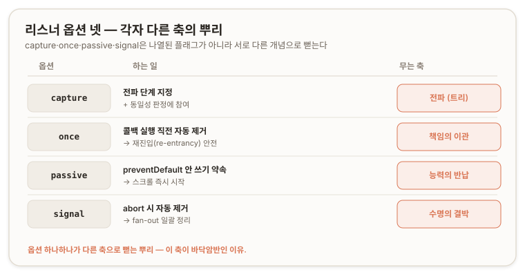
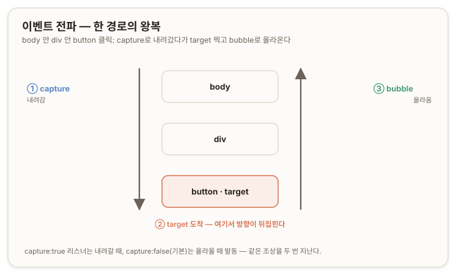
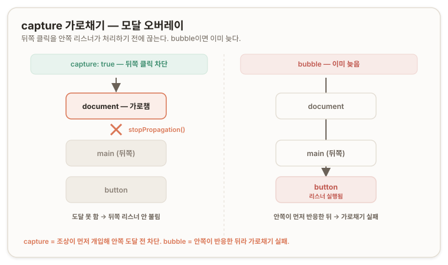
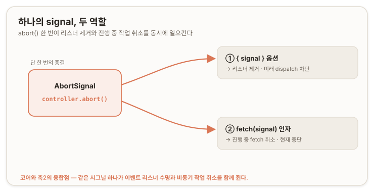

## 개요 ─ EventTarget

[수명·정리](./01-lifecycle-cleanup.md)에서 확인한 사실은 두 가지였다 — 이벤트 리스너는 대상을 강하게 참조(strong reference)하며, 그래서 수명이 긴 대상에 리스너를 남기면 메모리가 새어 나간다. 그것은 `EventTarget`을 바깥에서, 메모리 관점으로만 관찰한 결과다. 이번에는 그 관찰 대상이었던 `EventTarget` 자체를 파고들어, 리스너가 어떻게 등록·발동·제거되는지를 손에 쥔다.

**AbortController**에서 `signal.addEventListener('abort')`가 `button.addEventListener('click')`과 같은 기계라고 배웠다. 그 표현이 비유가 아니라 상속 관계 그 자체임을 구조적으로 확인한다. `AbortSignal`과 `button`이 같은 `addEventListener`를 물려받아 쓰기 때문에 시그널의 `'abort'`가 버튼의 `'click'`과 같은 방식으로 동작한다.

이 문서에서는 `EventTarget`을 두 층으로 나눠 서술한다. 하나는 모든 `EventTarget`이 가지는 **바닥층:** *리스너의 등록·발동·제거, 리스너 집합의 규칙이다.* 다른 하나는 DOM 트리에 꽂힌 노드만 가지는 **트리층:** *capture·bubble 전파다.* `AbortSignal`은 바닥층만 쓰고 트리층은 쓰지 않는다. 이 구분이 명확해지면 어떤 이벤트는 전파되고 어떤 이벤트는 전파되지 않는 이유가 하나로 풀린다.

---

## 진단 질문

> **질문 1.**<br/>
> `EventTarget`을 두고 세 각도로 답하라.
>
> (1) 정체 ─ `EventTarget`은 정확히 무엇인가? 클래스(class)인가, 인터페이스(interface)인가, 아니면 다른 무엇인가.
>
> (2) 공통 조상 ─ `button` 엘리먼트, `AbortSignal`, `ReadableStream` 이 셋이 "`EventTarget`을 공통 조상으로 둔다"는 것이 코드 레벨에서 무슨 뜻인가? 왜 셋 다 `addEventListener`를 갖는가.
>
> (3) 함정 ─ `element.onclick = fn`과 `el.addEventListener('click', fn)` 중 어느 쪽이 `EventTarget`이 주는 기능이고, 다른 쪽은 무엇인가? 둘은 같은가 다른가.

<none/>

> **질문 2.**<br/>
> 한 대상에 똑같은 함수 `fn`을, 똑같은 타입 `'click'`으로, 똑같은 옵션으로 `addEventListener`를 두 번 부르면 어떻게 되는가? 리스너가 둘 등록되어 클릭 한 번에 `fn`이 두 번 불리는가, 아니면 하나로 합쳐지는가? 그렇게 동작하는 것이 왜 합리적인지 '집합(set)'이라는 단어와 엮어 설명하라.

<none/>

> **질문 3.**<br/>
> `{ signal }`로 리스너를 떼는 방식은 `removeEventListener(type, fn, options)`를 직접 부르는 것과 비교해 무엇이 근본적으로 편한가? 특히 capture 값이 안 맞으면 remove가 실패하는 함정, 그리고 인라인 함수는 참조를 못 잡아 애초에 remove가 불가능한 함정과 엮어, `{ signal }`이 이 둘을 어떻게 우회하는지 설명하라.

<none/>

> **질문 4.**<br/>
> 콜백이 자기 자신을 떼는 self-removing 수동 패턴과 `once: true`는 똑같은가? `once`가 더 나은 지점이 있다면 무엇인가 ─ '책임의 이관'과 엮어 설명하라. 그리고 그 수동 코드에는 미묘한 버그 가능성이 있다. 무엇인가? (힌트: 핸들러가 불리는 시점과 remove 시점 사이.)

<none/>

> **질문 5.**<br/>
> 왜 한 번의 클릭이 '단계'를 갖는가? 버튼을 한 번 눌렀는데 왜 이벤트가 capture 단계와 bubble 단계로 나뉘어 같은 리스너를 두 번 부를 수 있는가? `<body>` 안에 `<div>` 안에 `<button>`이 중첩되어 있고 그 `button`을 클릭했다면, 이 클릭 이벤트는 세 엘리먼트를 어떤 순서로 훑는가? 그 순서가 왜 그래야 하는지 DOM이 트리(tree) 구조라는 것과 엮어 설명하라.

<none/>

> **질문 6.**<br/>
> (1) `preventDefault`라는 개념은 코어에서 배운 어떤 것과 닮았는가? (힌트: 신호를 보낼 뿐 강제로 멈추는 것이 아니라 대상이 협조해야 하는 성질.)
>
> (2) `preventDefault`를 부르려면 리스너가 실행되어야 하므로, 브라우저는 리스너를 다 실행해 보기 전에는 그 리스너가 `preventDefault`를 부를지 알 수 없다. 이 사실이 스크롤 성능에 왜 문제가 되는가?

<none/>

> **질문 7.**<br/>
> (1) 상태가 `pending → paid → shipped`로 바뀌는 `Order`를 `EventTarget`으로 만들려면 어떻게 시작하겠는가? (뼈대 전략만.) 상태가 바뀌었을 때 구독자에게 알리는 행위는 `EventTarget`의 세 메서드 중 무엇을 쓰겠는가?
>
> (2) 상태가 `paid`로 바뀌었음을 알릴 때 "얼마가 결제됐다"는 데이터도 실어 보내려면, 그냥 `Event`로는 부족하다. 이 데이터를 어디에 어떻게 실을 것인가?

<none/>

> **질문 8.**<br/>
> `Order`가 세 번 상태를 바꾸는 동안 구독자에게 세 번 알림을 보내고, 화면이 닫히면 구독을 한 번에 정리하려 한다.
>
> (1) 세 번의 상태 알림에는 `dispatchEvent`와 `abort` 중 무엇을 쓰는가?
>
> (2) 한 번의 구독 정리에는 무엇을 쓰는가? 왜 그렇게 갈리는지 한 줄로 설명하라.

<none/>

> **질문 9.**<br/>
> `file-added` 커스텀 이벤트에 async 함수를 리스너로 걸고 `dispatchEvent`로 그 이벤트를 쏘았다. `dispatchEvent`는 그 async 리스너가 끝날 때까지 기다리는가? `dispatchEvent`의 반환값은 Promise인가, 아니면 다른 무엇인가?

---

# A부 ─ EventTarget 본체

## 01. EventTarget의 정체 ─ 스펙 인터페이스이자 런타임 클래스 {#what-is-event-target}

`EventTarget`은 웹 플랫폼의 명세를 기술하는 언어인 WebIDL에서 인터페이스(interface)로 정의되고, 브라우저는 그 정의를 실제 클래스로 구현해 `new EventTarget()`이 가능하도록 노출한다([MDN: EventTarget](https://developer.mozilla.org/en-US/docs/Web/API/EventTarget) | [WHATWG DOM §2.7](https://dom.spec.whatwg.org/#interface-eventtarget)). "인터페이스"와 "클래스"라는 두 이름은 서로 다른 층위에서 같은 대상을 가리킨다. *명세를 쓴 언어의 관점에서는 **인터페이스**이고, 그 명세가 런타임에 착지한 형태로 보면 생성 가능한 **클래스**다.* `EventTarget`은 상속의 대상이기도 하다. `class X extends EventTarget`으로 커스텀 이벤트 발신자를 만들 수 있으며, 이것이 뒤에서 `Order` 발신자를 세우는 근거가 된다[(→ 08)](#class-order-extends-event-target).

*리스너와 대상의 관계* 는 감시(watch)가 아니라 **호출(call)** 이다. 리스너는 대상을 주기적으로 들여다보며 변화를 확인하는 폴링(polling) 방식이 아니라, **대상이 이벤트를 발화하면 그 자리에서 호출당하는 푸시(push) 방식**으로 동작한다. 이 push와 pull의 구분은 커스텀 이벤트에 데이터를 싣는 방식[(→ 08)](#class-order-extends-event-target), 그리고 비동기 리스너의 완료를 회수하지 못하는 한계[(→ 09)](#async-listener-and-fire-forget)에서 반복해 등장한다.

> 진단 질문 1 (정체) ─ 오답과 해설
>
>> **Answer.** <br/>
>> 리스너가 계속 감시할 객체를 가리키는 인터페이스다. 어떤 객체라도 `EventTarget`의 구현체로 선언되면 리스너의 참조를 받는다.
>
>> **Review.** <br/>
>> "인터페이스"라고 부른 건 스펙 관점에선 맞아. 근데 두 군데가 어긋났어.
>>
>> 하나, `EventTarget`은 뭔가를 **가리키는** 게 아니라 리스너가 **달라붙는 대상 그 자체**야.
>>
>> 둘, 리스너는 대상을 "감시"하지 않아 ─ polling이 아니라 대상이 발화하면 **호출당하는** push 쪽이다.
>>
>> 그리고 네가 "인터페이스"라는 단어에 갇혀서 놓친 게 있어: **`EventTarget`은 `new`도 되고 `extends`도 되는 구체 클래스**이기도 해. 그래야 네가 직접 이벤트 발신자를 만들 수 있어.

### 곁 ─ JavaScript에는 `implements`가 없다

Java에서는 `extends`(클래스 상속, 구현을 물려받음)와 `implements`(인터페이스 구현, 계약만 물려받고 몸통은 직접 채움)를 문법으로 가른다. JavaScript에는 `implements` 문법 자체가 없다. `class`가 가진 것은 `extends` 하나뿐이며, 그것은 프로토타입 체인(prototype chain)을 잇는 구현 상속이다([MDN: Classes](https://developer.mozilla.org/en-US/docs/Web/JavaScript/Reference/Classes), [MDN: extends](https://developer.mozilla.org/en-US/docs/Web/JavaScript/Reference/Classes/extends)). 계약만 물려받는 순수 인터페이스라는 개념은 언어 레벨에 존재하지 않는다.

그래서 앞서 "`EventTarget`은 인터페이스"라고 할 때의 인터페이스는 명세 언어(WebIDL)의 용어이지, Java의 `interface`(몸통 없는 계약)와 같은 뜻이 아니다. JavaScript에서 "인터페이스를 구현한다"에 해당하는 것은 두 관습으로 이뤄진다 ─ `extends`로 베이스 클래스를 상속하거나(Java의 추상 클래스에 가깝다), 필요한 메서드만 갖추면 그 역할로 취급하는 덕 타이핑(duck typing)이다. TypeScript는 여기에 `interface` 문법을 얹어 컴파일 시점 검사를 제공하지만, 그 검사는 런타임에 사라지므로 결국 구조적 타이핑(structural typing)으로 귀결된다([TypeScript Handbook: Object Types](https://www.typescriptlang.org/docs/handbook/2/objects.html)).

## 02. 공통 조상 ─ 프로토타입 체인과 상속 {#prototype-chain-and-extends}

`button`·`AbortSignal` 같은 서로 다른 객체가 "**EventTarget**을 공통 조상으로 둔다"는 것은 프로토타입 체인으로 엮여있다는 뜻이다. 각 객체의 프로토타입 사슬을 거슬러 올라가면 `EventTarget.prototype`이 놓여 있고, 그래서 `button instanceof EventTarget`과 `signal instanceof EventTarget`이 모두 `true`가 된다. 셋이 `addEventListener`를 각자 구현한 것이 아니라 한 번 정의된 그 메서드를 상속해 공유한다([MDN: EventTarget](https://developer.mozilla.org/en-US/docs/Web/API/EventTarget)). 이벤트가 필요한 여러 타입 ─ *DOM 노드, AbortSignal, WebSocket, XMLHttpRequest, FileReader, MessagePort, BroadcastChannel* ─ 은 모두 `EventTarget`을 상속받았고, 그래서 이들이 다 같은 이벤트 시스템을 쓴다.

`instanceof`가 여기서는 `true`를 주지만 **판별 수단으로 신뢰하지는 않는다.** [AbortController](./00-core.md)에서 **AbortError**를 판별할 때 `instanceof`를 금하고 `err.name === 'AbortError'`를 쓴 것과 같은 이유로, 서로 다른 realm(iframe이나 Node의 다른 컨텍스트)을 넘나들면 프로토타입 신원이 달라져 `instanceof`가 깨진다.

이벤트를 다루는 모든 것이 **EventTarget**인 것은 아니다. Web Streams의 `ReadableStream`은 **EventTarget**이 아니며 `addEventListener`를 갖지 않는다([MDN: ReadableStream](https://developer.mozilla.org/en-US/docs/Web/API/ReadableStream), [WHATWG Streams](https://streams.spec.whatwg.org/)). 스트림은 완료와 백프레셔(backpressure)를 이벤트가 아니라 Promise 기반으로 알린다. Node의 구형 스트림은 `EventEmitter`라 이벤트 기반이지만, 표준 Web Streams는 의도적으로 다른 길을 택했다. 왜 스트림이 이벤트 대신 Promise 길을 갔는지는 아래에서 다룬다[(→ 11)](#notification-and-coordination).

> 진단 질문 1 (공통 조상) ─ 오답과 해설
>
>> **Answer.** <br/>
>> 지엽적으로밖에 설명하지 못하겠다. DOM 이벤트 리스너의 참조를 받을 수 있다는 정도.
>
>> **Review.** <br/>
>> 모르는 걸 아는 척 안 한 건 좋아. 근데 "**DOM** 이벤트"라는 벽이 네 머리에 있어.
>>
>> `EventTarget`은 DOM 전용이 아니라 DOM보다 아래에 있는 플랫폼 원시 타입이야 ─ **`AbortSignal`은 DOM 노드가 아닌데도 이벤트를 다루잖아.** 그게 증거지. 그리고 코드 레벨의 답은 **프로토타입 체인**이야: 셋의 사슬을 올라가면 `EventTarget.prototype`이 박혀 있어서 `addEventListener`를 **하나 상속**해 공유하는 거야. 하나 더 ─ 질문에 `ReadableStream`을 일부러 끼워 넣었어. 스트림이라고 다 `EventTarget`은 아니야. Web Streams는 프로미스 길을 갔거든.

## 03. onclick에서 리스너 집합으로 ─ 왜 EventTarget인가

`element.onclick = fn`은 Element가 노출하는 이벤트 핸들러 속성(event handler attribute)이며, 핸들러를 담는 슬롯이 하나뿐이다([MDN: Event handlers](https://developer.mozilla.org/en-US/docs/Web/Events/Event_handlers)). 같은 속성에 다시 대입하면 앞선 핸들러를 덮어써서 마지막으로 대입한 하나만 살아남는다.

반면 `el.addEventListener('click', fn)`은 **EventTarget**이 제공하는 기능으로, 같은 `'click'`에 여러 리스너를 독립적으로 등록해 서로 지우지 않는다. 이 다중 등록이 서로 다른 모듈이 같은 이벤트를 각자 듣는 멀티플렉싱(multiplexing)을 가능하게 한다.

두 방식의 차이는 콜백 안 `this`가 아니다. 일반 함수 핸들러라면 `this`는 두 경우 모두 대상 엘리먼트를 가리킨다. 실제 차이는 두 가지다 ─ `onclick`은 슬롯이 하나라 덮어쓰기가 일어나지만 `addEventListener`는 여러 리스너를 순차적으로 담고, `onclick`은 옵션을 받지 못하지만 `addEventListener`는 `capture`·`once`·`passive`·`signal`을 받는다[(→ §05)](#prototypes-and-listener-options).

단일 슬롯 모델은 소유권 다툼을 낳는다. 라이브러리 A가 `window.onresize`를 잡은 뒤 라이브러리 B가 다시 대입하면 A의 핸들러가 조용히 사라진다. 옵션이 없어 *capture 단계 가로채기, 한 번만 듣고 자동 해제, 취소 시그널로 떼기* 같은 동작도 표현하지 못한다. 그래서 플랫폼은 이벤트를 단일 슬롯 속성에서 등록 가능한 리스너 집합으로 승격시켰고, 그 승격된 모델이 `EventTarget`이며, 그것이 노출하는 세 메서드가 `addEventListener`·`removeEventListener`·`dispatchEvent`다[(→ §05)](#prototypes-and-listener-options). 이 승격 덕분에 `'abort'`·`'click'`·직접 정의할 커스텀 이벤트가 모두 **EventTarget**이라는 한 기계의 변주가 되고, 외워야 할 이벤트 API가 여럿에서 하나로 줄어든다.

> 진단 질문 1 (함정) ─ 오답과 해설
>
>> **Answer.** <br/>
>> `el.addEventListener('click', fn)`이 `EventTarget`이 주는 기능이다. 둘의 차이는 콜백에서 `this`가 가리키는 스코프 차이인 것 같다.
>
>> **Review.** <br/>
>> `addEventListener`가 `EventTarget` 거라는 건 맞아. 근데 " `this` 스코프"는 차이가 아니야. 일반 함수 핸들러면 둘 다 `this`가 대상 엘리먼트를 가리켜 ─ 네가 짚은 건 차이가 아니라 오히려 공통점이야. 진짜 차이는 둘이다. 하나, 카디널리티(cardinality) ─ `onclick`은 슬롯 하나라 덮어쓰지만 `addEventListener`는 여러 개를 담아. 둘, 옵션 ─ `addEventListener`만 `{capture, once, passive, signal}`을 받아.

## 04. 리스너 집합의 멱등성 ─ (type, callback, capture) 동일성 {#idempotency-of-listener}

같은 대상에 *같은 타입·같은 함수 참조·같은 옵션* 으로 `addEventListener`를 두 번 불러도 리스너는 하나만 등록되고, 두 번째 호출은 오류 없이 조용히 무시된다. `EventTarget`이 리스너를 집합(set)처럼 다루기 때문이다 ─ 수학의 집합이 같은 원소를 두 번 넣어도 하나이듯, 같은 리스너를 두 번 등록해도 하나다. 스펙의 add an event listener 알고리즘은 등록 전에 기존 목록을 훑어, **`type`·`callback`·`capture` 세 값이 모두 같은 리스너**가 있으면 추가하지 않고 반환한다([WHATWG DOM: add an event listener](https://dom.spec.whatwg.org/#add-an-event-listener)).

원소의 **동일성(identity)** 을 판정하는 기준은 `(type, callback, capture)` 세 값이다. 셋이 모두 같아야 같은 리스너이고, *하나라도 다르면 다른 원소로 취급되어* 둘 다 등록된다. 이 규칙은 **멱등성(idempotency,** 같은 연산을 여러 번 해도 결과가 한 번 한 것과 같음)을 준다. <u>컴포넌트가 렌더될 때마다 방어 없이 같은 함수 참조로 리스너를 등록해도 리스너가 쌓이지 않으므로,</u> 프레임워크가 안심하고 재바인딩할 수 있다.

멱등성은 "같은 함수 참조"라는 전제 위에서만 성립한다. 이 전제가 깨지는 세 지점을 구분한다.

**첫째, 새 함수는 매번 다른 원소다.** 화살표 함수·`.bind()`·인라인 함수는 호출마다 새 객체를 만들므로, 소스 코드가 글자까지 같아도 참조가 달라 다른 리스너로 등록된다. 그래서 인라인 콜백을 반복 등록하면 리스너가 무한히 누적되고, 이때의 중복 발동은 멱등성의 예외가 아니라 서로 다른 리스너들의 누적이다. 이렇게 등록한 리스너는 remove의 둘째 인자에 넣을 참조가 어디에도 남지 않아 제거할 방법이 없다[(→ §05 removeEventListener)](#remove-event-listener).

**둘째, `once`와 `passive`는 동일성 판정에 참여하지 않는다.** `{ once: true }`로 등록한 뒤 같은 함수를 `{ capture: false }`로 다시 등록하면 capture가 둘 다 `false`라 같은 리스너로 취급되어 두 번째가 무시된다. 이때 먼저 등록된 `once: true`가 살아남아, 계속 듣고 싶었던 두 번째의 의도가 사라진다.

**셋째, `capture`는 동일성 판정 기준 중 하나라 다르면 별개다.** 같은 함수를 `capture` 없이(기본 `false`)와 `{ capture: true }`로 등록하면 서로 다른 리스너로 공존해, 클릭 한 번에 함수가 두 번 ─ capture 단계에서 한 번, bubble 단계에서 한 번 ─ 불린다(→ 06 전파). 이 리스너를 제거할 때는 등록 때와 같은 capture 값을 넘겨야 한다. `removeEventListener('click', fn)`은 `capture: false`짜리만 떼고 `capture: true`짜리는 떼지 못한다.

> 진단 질문 2 ─ 오답과 해설
>
>> **Answer.** <br/>
>> 클릭 한 번에 `fn`이 두 번 불릴 것 같다. SI 개발에서 모달 열기/닫기에 버튼 이벤트를 부여할 때 항상 `removeEventListener` 방편을 마련해 두었다.
>
>> **Review.** <br/>
>> 틀렸어. 같은 참조·같은 타입·같은 옵션이면 리스너는 **하나**고, 두 번째 등록은 조용히 무시돼. 집합이 중복을 허용하지 않으니까. 그리고 네 실무 감각은 방향은 맞는데 근거가 어긋나 있어 ─ 네가 방어한 건 "같은 리스너가 두 번 불릴까 봐"였지만 그건 스펙이 알아서 막아. 네가 실제로 겪은 누수는 아마 인라인이나 `bind`로 넘긴 콜백이 열 때마다 **다른 리스너**로 쌓인 거였을 거다. 네 remove는 유효했지만, 정확힌 "중복 호출"이 아니라 "서로 다른데 기능만 같은 리스너들의 누적"을 막은 거야.

## 05. EventTarget.prototype 3종과 리스너 옵션 넷 ─ 레이어·동작·조작 {#prototypes-and-listener-options}

`EventTarget`이 노출하는 인스턴스 메서드는 세 개뿐이며, 모두 `EventTarget.prototype`에 선언되어 있다. `button`·`AbortSignal`·직접 만든 인스턴스가 프로토타입 체인을 통해 이 하나의 정의를 공유한다[(→ §02)](#prototype-chain-and-extends).



### 05-1. addEventListener(type, callback, options) {#add-event-listener}

대상의 내부 리스너 목록에 리스너 하나를 등록한다. 선언 레이어는 `EventTarget.prototype`이고, 조작 대상은 대상마다 스펙 내부에 존재하는 event listener list(이벤트 리스너 목록)라는 구조다. 이 목록은 *JavaScript 코드로 직접 읽거나 열거할 수 없고* **오직 세 메서드로만 간접 조작된다**([WHATWG DOM: add an event listener](https://dom.spec.whatwg.org/#add-an-event-listener)).

`callback`은 두 형태를 받는다. 하나는 함수, 다른 하나는 `handleEvent` 메서드를 가진 객체다. 후자를 넘기면 이벤트 발생 시 `obj.handleEvent(event)`가 호출되며 콜백 내부 `this`는 그 객체가 된다([MDN: EventListener](https://developer.mozilla.org/en-US/docs/Web/API/EventListener)). 함수를 넘긴 일반적인 경우 콜백 안 `this`는 리스너가 붙은 대상을 가리킨다.

`options`는 불리언 또는 사전(dictionary) 객체다. 불리언은 레거시 형태로 `capture` 값 하나만 의미한다. 사전 형태는 `capture`·`once`·`passive`·`signal` 네 필드를 받는다([MDN: addEventListener](https://developer.mozilla.org/en-US/docs/Web/API/EventTarget/addEventListener)). 등록 시 이 네 값은 대상에서 읽어낼 수 있는 프로퍼티로 남지 않고, 스펙 내부의 event listener 레코드(`type` · `callback` · `capture` · `passive` · `once` · `signal` · `removed` 필드를 가진 구조체)에 봉인된다. 옵션은 등록 시점에 소비되어 내부 레코드에 새겨지는 설정이지, 나중에 조회하는 상태가 아니다.

### 05-2. removeEventListener(type, callback, options) {#remove-event-listener}

등록의 거울(mirror)로, 목록에서 리스너를 제거한다. 선언 레이어는 `EventTarget.prototype`이고, 조작은 대상의 리스너 목록에서 일치하는 레코드의 `removed` 플래그를 참으로 만들고 목록에서 빼는 것이다([MDN: removeEventListener](https://developer.mozilla.org/en-US/docs/Web/API/EventTarget/removeEventListener)).

여기서 `options`는 `capture` 값만 읽힌다. `once`·`passive`·`signal`은 제거의 일치 판정에 관여하지 않는다. 제거가 성립하려면 등록 때와 `(type, callback, capture)` 세 값이 정확히 일치해야 하며[(→ §04)](#idempotency-of-listener), 하나라도 어긋나면 아무 리스너도 제거되지 않고 오류도 발생하지 않는다.

### 05-3. dispatchEvent(event) {#dispatch-event}

대상에 이벤트를 동기적으로 흘려보낸다. 선언 레이어는 `EventTarget.prototype`이다. 반환값은 **Boolean**으로, 이벤트가 취소 가능(`cancelable: true`)하고 어떤 리스너가 `preventDefault()`를 호출했으면 `false`, 그렇지 않으면 `true`다([MDN: dispatchEvent](https://developer.mozilla.org/en-US/docs/Web/API/EventTarget/dispatchEvent)). 호출 즉시 dispatch 알고리즘이 실행되어 전파 경로를 계산하고 capture 단계·target 단계·bubble 단계 순으로 각 대상의 리스너를 동기 호출한다[(→ §06)](#capture-target-bubble). 이 "동기"라는 성질은 async 리스너와 충돌하며 이 축의 정점을 이룬다[(→ §09)](#async-listener-and-fire-forget). 이미 dispatch 중인 이벤트를 다시 dispatch하면 `InvalidStateError`가 발생한다.

### 05-4. 리스너 옵션 넷 ─ 각각의 레이어와 동작 {#four-options-for-listener}

네 옵션은 모두 `addEventListener`의 `options` 사전에서 출발하지만, 조작하는 레이어와 발동 시점이 서로 다르다. 옵션 하나하나가 서로 다른 개념으로 뻗는 뿌리라는 점이 이 축을 바닥암반으로 만든다.

**`capture`** (**Boolean**, 기본 `false`) ─ 리스너가 전파의 어느 단계에서 발동할지 지정한다. `true`면 대상을 향해 내려가는 capture 단계, `false`면 대상에서 올라오는 bubble 단계에 발동한다[(→ §06)](#capture-target-bubble). `capture`는 리스너 레코드의 필드이자 동일성 판정에 참여하는 세 값 중 하나여서, 같은 함수를 `capture: true`와 `false`로 등록하면 서로 다른 리스너로 둘 다 등록된다. 이 옵션이 물고 있는 축은 전파, 즉 트리 구조다.

**`once`** (**Boolean**, 기본 `false`) ─ 리스너가 한 번 발동한 뒤 자동 제거된다. 조작 레이어는 dispatch 알고리즘의 inner invoke 단계이며, 스펙상 `once` 리스너는 콜백을 실행하기 직전에 목록에서 먼저 제거된 뒤 호출된다([WHATWG DOM: inner invoke](https://dom.spec.whatwg.org/#concept-event-listener-inner-invoke)). 이 "제거 후 호출" 순서가 재진입(re-entrancy) 안전성을 보장한다[(→ §07)](#prevent-default-cooperative-cancellation). 이 옵션이 물고 있는 축은 정리 책임의 이관이다.

**`passive`** (**Boolean**) ─ 이 리스너가 `preventDefault()`를 호출하지 않겠다는 사전 약속이다. 조작 레이어는 콜백 실행 구간에 세워지는 플래그로, 이 플래그가 선 동안 `preventDefault()` 호출은 무효화되고 콘솔 경고가 남는다([MDN: addEventListener passive](https://developer.mozilla.org/en-US/docs/Web/API/EventTarget/addEventListener#passive)). 브라우저는 이 약속 덕분에 리스너 실행 완료를 기다리지 않고 스크롤을 진행할 수 있다[(→ §07)](#prevent-default-cooperative-cancellation). 최신 브라우저는 `document`·`window`의 `wheel`·`touchstart`·`touchmove`를 기본 passive로 처리한다. 이 옵션이 물고 있는 축은 취소 능력(capability)의 반납이다.

**`signal`** (`AbortSignal`) ─ 리스너의 수명을 시그널에 결박한다. 조작 레이어는 시그널의 abort 알고리즘이다. 등록 시 시그널이 이미 abort 상태면 리스너는 추가되지 않고, 그렇지 않으면 시그널에 "이 리스너를 제거하라"는 abort steps가 등록된다([MDN: addEventListener signal](https://developer.mozilla.org/en-US/docs/Web/API/EventTarget/addEventListener#signal)). 이후 `controller.abort()`가 호출되면 브라우저가 정확한 `(type, callback, capture)`로 리스너를 제거하므로, 제거의 책임과 지식이 개발자에서 플랫폼으로 이관된다. 하나의 시그널에 여러 대상의 리스너를 묶으면 `abort()` 한 번으로 전부 동시에 제거되는데(fan-out), 이는 축1의 `DisposableStack`이 여러 자원을 한 수명 앵커에 묶어 일괄 해제하는 것과 같은 사상이다. 이 옵션이 물고 있는 축은 수명의 결박이며, [AbortController](./00-core.md)의 시그널과 직접 이어진다.

네 가지 옵션은 서로 배타적이지 않고 조합된다. `{ once: true, signal }`을 함께 쓰면 둘 다 적용되어, 이벤트가 한 번 오면 `once`가 리스너를 제거하고 그전에 abort되면 `signal`이 제거한다 ─ 먼저 오는 쪽이 리스너를 걷어간다. 정리 수단도 공존한다. 시그널로 여러 리스너를 한 번에 걷는 fan-out과, 이름 붙인 참조로 하나만 떼는 개별 `removeEventListener`를 섞어 쓸 수 있으며, 대부분은 fan-out으로 통째로 정리하고 예외적으로 하나만 토글할 때 개별 remove를 쓴다.

> 진단 질문 3 ─ 오답과 해설
>
>> **Answer.** <br/>
>> remove를 할 때 `(type, callback, capture)` 세 인자를 맞춰 동일성을 고려하는 비용이 덜어진다. 특히 익명 함수를 콜백으로 넘겼을 땐 동일성 판정을 못 할 것 같다. 대신 signal을 넘기고 컨트롤러로 `.abort()` 해버리면 간단하다.
>
>> **Review.** <br/>
>> 방향도 근거도 맞아. 익명 함수는 "못 할 것 같다"가 아니라 **못 한다** ─ remove의 둘째 인자에 넣을 그 참조가 세상에서 사라졌으니까. 근데 네가 "간단"이라고 뭉갠 그 지점이 두 층이야.
>>
>> 하나, **대칭의 붕괴** ─ add/remove는 등록·제거가 짝을 이루는 대칭인데 `{signal}`은 remove 쪽을 네 손에서 걷어가 플랫폼에 넘겨. 이건 "remove를 더 쉽게 부르는 법"이 아니라 "remove를 **안 부르는 법**"이야. 안 부르는 코드엔 버그가 안 생겨.
>>
>> 둘, **fan-out** ─ 리스너 다섯을 다른 대상에 걸어도 같은 signal 하나면 `abort()` 한 번에 다섯이 동시에 떨어져. 관심사가 "각 리스너를 어떻게 떼지?"에서 **"이 작업 단위의 수명이 언제 끝나지?"** 로 뒤집힌 거야. 네 직관은 맞았는데, 그 간단함은 게으름이 아니라 관심사의 재배치에서 나온다.

## 06. 이벤트 전파 ─ capture / target / bubble {#capture-target-bubble}

한 번의 클릭이 단계를 갖는 이유는 **브라우저가 이벤트의 목표를** 탐색하지 않아도 되기에, **이미 알고 있기 때문이다.** 클릭이 일어난 순간 브라우저는 마우스 좌표로 히트 테스트(hit test)를 끝내 어느 엘리먼트가 눌렸는지 확정한 상태다. 목표(target)가 정해졌으므로 거기까지의 경로도 자동으로 확정된다 ─ DOM은 트리(tree)라서 임의 노드에서 루트까지의 조상 경로가 유일하기 때문이다. `button`에서 루트까지는 `button → div → body → html → document → window`로 갈림길이 없다. 전파는 이 확정된 일직선 경로를 훑는 과정이지, 트리를 뒤지며 목표를 찾는 과정이 아니다.



`body > div > button` 중첩에서 `button`을 클릭하면 이벤트는 세 단계를 밟는다([MDN: Event.eventPhase](https://developer.mozilla.org/en-US/docs/Web/API/Event/eventPhase)).

1. **Capture 단계** ─ `window`·`document`에서 시작해 target을 향해 내려온다(`body → div → button`). `{ capture: true }`로 등록한 리스너가 이때 발동한다.
2. **Target 단계** ─ target 자신(`button`)에 도착해 거기 걸린 리스너가 발동한다.
3. **Bubble 단계** ─ target에서 루트로 올라간다(`div → body → …`). `{ capture: false }`(기본값)로 등록한 리스너가 이때 발동한다.

한 번의 클릭이 한 경로를 왕복한다 ─ 내려갔다가(capture) 도착하고(target) 올라온다(bubble). 그래서 같은 조상 엘리먼트를 내려갈 때와 올라올 때 두 번 지나며, 같은 함수를 `capture: true`와 `false`로 등록하면 두 번 발동한다[(→ §04)](#idempotency-of-listener).

이 순서에는 이유가 있다. capture는 *parent가 child보다 먼저 개입할 기회를 준다* ─ 바깥 컨테이너가 안쪽 엘리먼트보다 먼저 이벤트를 보기 때문에, 자식에 도달하기 전에 가로채는 상위 통제(top-down intercept)에 쓴다. bubble은 후손이 처리한 뒤 조상이 이어받게 한다 ─ 실제로 눌린 엘리먼트가 먼저 반응하고 바깥 엘리먼트가 순차로 받으므로, 자식이 먼저 처리하고 안 막았으면 부모가 이어받는 위임(delegation)에 쓴다. 대부분의 실무 코드가 bubble을 쓰기 때문에 `capture`의 기본값이 `false`이며, 옵션 없이 `addEventListener`를 써 왔다면 전부 bubble이었다.

### 06-1. 이벤트 위임

bubble이 기본이라는 사실이 이벤트 위임(event delegation)을 가능하게 한다([MDN: Event delegation](https://developer.mozilla.org/en-US/docs/Learn/JavaScript/Building_blocks/Events#event_delegation)). 리스트에 아이템이 1000개 있고 각각 클릭을 듣고 싶을 때, 순진하게 하면 리스너 1000개를 단다. 클릭이 bubble로 부모까지 올라오므로, 부모에 리스너 하나만 달고 `e.target`으로 어느 자식이 눌렸는지 보면 하나로 1000개를 커버한다. **리스너 수 · GC · Cleanup[(→ 수명·정리)](./01-lifecycle-cleanup.md)** 관점에서 비용이 크게 줄어든다.

### 06-2. capture의 실전 ─ 모달 오버레이 가로채기

capture 단계는 모달(modal) 오버레이에서 큰 의미를 갖는다. 모달이 열려 있을 때 뒤쪽 콘텐츠로 가는 클릭을 그 콘텐츠의 리스너가 처리하기 전에 가로막아야 한다. bubble 단계로는 늦다 ─ 클릭이 이미 안쪽 버튼에 도달해 그 리스너가 실행된 뒤이기 때문이다. capture 단계에서 오버레이가 최상위 조상으로 먼저 개입하면, 아래로 내려가는 이벤트를 중간에서 끊을 수 있다.



```js
// ═══════════════════════════════════════════════════════════════════════
//  모달이 열려 있는 동안, 뒤쪽 콘텐츠로 향하는 클릭을 capture 단계에서 차단.
//  document(최상위 조상)에 capture:true 리스너를 걸어, 이벤트가 안쪽으로
//  내려가는 '도중'에 가로챈다. bubble이었다면 이미 안쪽 버튼이 반응한 뒤라 늦다.
// ═══════════════════════════════════════════════════════════════════════
const modal = document.querySelector('.modal');
const ctrl = new AbortController();

document.addEventListener('click', (e) => {
  // 클릭 지점이 모달 '내부'면 통과시킨다 — 모달 자신은 정상 동작해야 하니까.
  if (modal.contains(e.target)) return;

  // 모달 '바깥'(뒤쪽 콘텐츠) 클릭이면 여기서 끊는다.
  e.stopPropagation();   // 남은 경로의 리스너 도달을 막음 → 뒤쪽 콘텐츠 리스너 차단
  e.preventDefault();    // 링크·버튼의 기본 동작(이동·전송)까지 취소
  closeModal();          // 오버레이 클릭 = 모달 닫기, 라는 UX
}, {
  capture: true,         // ★ 이 capture가 전부다. bubble이 아니라 capture 단계에서 발동
  signal: ctrl.signal,   // 모달이 닫히면 ctrl.abort()로 이 가로채기 리스너를 일괄 제거
});

// 모달을 닫을 때: 가로채기 리스너를 fan-out으로 정리
function closeModal() {
  modal.hidden = true;
  ctrl.abort();          // capture 리스너가 document에서 떨어진다 → 가로채기 해제
}
```

`stopPropagation()`은 전파 자체를 멈춰 남은 경로의 리스너 도달을 막고, `preventDefault()`는 링크 이동·폼 전송 같은 브라우저 기본 동작을 취소한다. 둘이 막는 대상이 다르다 ─ 전자는 다른 리스너, 후자는 브라우저의 기본 동작이다([MDN: stopPropagation](https://developer.mozilla.org/en-US/docs/Web/API/Event/stopPropagation), [MDN: preventDefault](https://developer.mozilla.org/en-US/docs/Web/API/Event/preventDefault)). `preventDefault`의 성질은 다음 절에서 협조적 취소와 엮어 다룬다[(→ §07)](#prevent-default-cooperative-cancellation).

### 06-3. 시그널에는 전파가 없다

전파는 트리가 있어야 성립한다. `body > div > button` 같은 부모-자식 중첩이 있어야 *내려가고 올라오는 경로가 생긴다.* `AbortSignal`은 DOM 트리에 꽂혀 있지 않고 홀로 떠 있는 `EventTarget`이라 부모도 자식도 없으므로, 경로가 없어 왕복할 것도 없고 자기 자신에서 한 번 발화하고 끝난다.

`signal.addEventListener('abort', fn, { capture: true })`는 문법상 가능하지만 잡아 줄 조상이 없어 capture든 bubble이든 발화 한 번으로 같다. 이것이 서두에서 말한 두 층위 ─ 모든 `EventTarget`이 가지는 **바닥층**(등록·발동·제거)과 DOM 노드만 가지는 **트리층**(전파) ─ 의 구분이다. 시그널은 바닥층만 쓰고 트리층은 쓰지 않는다.

> 진단 질문 5 ─ 오답과 해설
>
>> **Answer.** <br/>
>> 클릭 이벤트는 해당 엘리먼트에서 시작해 한 층씩 `parentElement`를 타고 올라간다. 거꾸로 `window`·`document`에서 하위로 내려가는 것은 상위 `div`에서 어느 `button`으로 갈지 모르는데 폭포처럼 찾아가는 것이라 말이 안 된다고 생각했다. capture 옵션이 무엇인지는 이해하지 못했다.
>
>> **Review.** <br/>
>> "올라간다"는 절반은 bubble을 정확히 묘사했어. 근데 네가 "말이 안 된다"고 기각한 폭포수 방향이 **실재해** ─ 그게 capture 단계야.
>>
>> 오해의 뿌리는 이거야: 넌 "위에서 아래로 내려간다"를 "목적지를 탐색한다"로 이해했어. 근데 브라우저는 탐색하지 않아 ─ 클릭 순간 hit test로 target을 이미 확정했거든. 목표가 정해졌으니 거기까지 가는 경로도 트리에서 유일하게 확정돼. 위에서 아래로 찾아가는 게 아니라, target이 정해진 뒤 그 확정된 일직선 경로를 위에서부터 훑는 거야. 네가 걱정한 "어느 button으로 갈지 모른다"라는 분기는 방향이 반대라 애초에 없어.

## 07. preventDefault와 협조적 취소 ─ Abort의 메아리 {#prevent-default-cooperative-cancellation}

브라우저에는 기본 동작(default action)이 있다 ─ 링크를 클릭하면 페이지가 이동하고, 폼에서 submit을 누르면 전송되고, 스크롤 영역에서 휠을 굴리면 스크롤된다. 리스너를 달지 않아도 브라우저가 수행하는 동작이다. `e.preventDefault()`는 이 기본 동작을 취소한다([MDN: preventDefault](https://developer.mozilla.org/en-US/docs/Web/API/Event/preventDefault)).

`preventDefault`는 [AbortController](./00-core.md)에서 배운 협조적 취소(cooperative cancellation)와 같은 뼈대를 가진다. `abort()`가 신호일 뿐이고 작업이 `signal.aborted`를 직접 확인해야 멈추듯, `preventDefault()`도 **이벤트 객체에 `defaultPrevented` 플래그를 세울 뿐**이고 브라우저의 기본 동작 실행부가 리스너들을 다 돌린 뒤 그 플래그를 확인해 기본 동작을 스킵한다([MDN: Event.defaultPrevented](https://developer.mozilla.org/en-US/docs/Web/API/Event/defaultPrevented)). 두 경우 모두 플래그를 세우는 쪽과 플래그를 확인해 행동을 조절하는 쪽이 분리되어 있고, 세운다고 즉시 무엇이 멈추지 않는다.

| Abort | preventDefault |
| --- | --- |
| `controller.abort()` ─ 신호 발신 | `e.preventDefault()` ─ 신호 발신 |
| `signal.aborted` ─ 플래그 | `e.defaultPrevented` ─ 플래그 |
| 작업이 `throwIfAborted()`로 확인 | 브라우저 기본 동작부가 플래그 확인 |
| 확인 안 하면 안 멈춤 (협조적) | 브라우저가 확인해 줌 (내장 협조) |

차이는 플래그를 **확인하는 주체다** ─ abort는 확인하는 쪽이 개발자의 코드라 `throwIfAborted()`를 직접 박아야 하고, preventDefault는 확인하는 쪽이 브라우저라 플래그만 세우면 된다. 뼈대는 같다. 이는 [AbortController](./00-core.md)에서 배운 컨트롤러/시그널 분리 = 능력 분리(capability separation)의 또 다른 얼굴이기도 하다 ─ `e.preventDefault()`가 쓰기(트리거)이고 `e.defaultPrevented`가 읽기(관찰)로, 한 이벤트 객체 안에 쓰기 능력과 읽기 능력이 공존한다.

모든 기본 동작이 취소 가능한 것은 아니다. 이벤트마다 `cancelable` 속성이 있어 `e.cancelable === false`면 `preventDefault`를 불러도 아무 일도 일어나지 않는다([MDN: Event.cancelable](https://developer.mozilla.org/en-US/docs/Web/API/Event/cancelable)). 신호가 받아들여지는 유효한 창(window)이 있고 그 밖에서는 무력하다는 성질은, [AbortController](./00-core.md)에서 이미 취소된 시그널에 abort를 또 불러도 의미 없던 것과 같다.

### 07-1. 재진입 ─ once가 수동 self-removing보다 나은 이유

콜백이 자기 자신을 떼는 self-removing 수동 패턴은 `once: true`와 기능이 비슷해 보이지만, 정리의 주체와 정확성에서 갈린다. 수동 패턴에서는 비즈니스 로직을 담은 콜백이 자기를 제거하는 인프라 작업까지 겸직하고, `once`에서는 플랫폼이 제거의 주체가 되어 콜백에 로직만 남는다[(→ §05 책임의 이관)](#four-options-for-listener). 이 이관 덕분에 `once`는 콜백이 자기 등록 문맥(자기 참조·대상·타입)을 몰라도 되므로 화살표 함수에도 그대로 붙는다.

수동 패턴에는 재진입(re-entrancy) 버그가 숨는다. 로직을 실행한 뒤 remove하는 순서로 짜면, 로직이 실행되는 동안 remove에 아직 도달하지 못한 상태에서 같은 이벤트가 다시 발생하면 핸들러가 두 번째로 진입한다. 로직이 이벤트를 동기적으로 재유발하거나, 로직이 무거워 도는 사이 사용자가 한 번 더 조작하면 "한 번만"이라는 계약이 깨진다. `once: true`는 스펙상 콜백을 실행하기 직전에 리스너를 먼저 제거하므로[(→ §05 inner invoke)](#four-options-for-listener), 콜백이 도는 동안 이미 목록에 없어 재진입해도 두 번 불리지 않는다. 정리를 개발자 손에 쥐면 순서 실수로 계약이 깨지지만 플랫폼에 넘기면 그 순서를 스펙이 보장하므로, 이 이관은 편의를 넘어 정확성(correctness)의 문제다.

self-removing 패턴에 존재하는 **콜백↔대상**의 상호 참조는 버그가 아니다. JavaScript의 가비지 컬렉션(garbage collection)은 도달 가능성(reachability) 기반 mark-and-sweep이라, 서로를 가리켜도 바깥에서 아무도 그 쌍에 도달하지 못하면 통째로 수거한다([MDN: Memory management](https://developer.mozilla.org/en-US/docs/Web/JavaScript/Memory_management)). 순환은 판단 기준이 완료가 아니라 도달 가능성이라는 [AbortController](./00-core.md)에서 전제한 원리에 따라 문제가 되지 않는다. 무서운 단어에 조건반사로 끌려가지 않고 메커니즘으로 판단하는 것이 이 지점의 교훈이다.

### 07-2. passive ─ preventDefault()를 반납하여 얻는 성능

스크롤 성능 문제는 메인 스레드 블로킹과 구분해야 한다. 무거운 동기 작업이 메인 스레드를 붙들어 렌더링과 입력이 멈추는 것은 JavaScript 실행 모델 자체의 문제이며, 이는 실제로 스레드가 막힌 것이다. 스크롤의 jank(버벅임)는 다른 현상이다 ─ 스크롤에 리스너(`touchstart`·`wheel` 등)가 달려 있으면, 브라우저는 그 리스너가 *`preventDefault()`로 스크롤을 취소할 수도 있으므로* 리스너 실행이 끝날 때까지 스크롤을 시작하지 못한다. 리스너가 5ms 걸리면 스크롤이 5ms 늦게 시작하고, 사용자 눈에는 손가락은 움직이는데 화면이 따라오지 않는 버벅임으로 보인다. **여기서는 스레드가 실제로 막힌 것이 아니라, 막힐 수도 있어 미리 기다리는 것이다** ─ 취소의 잠재성이 성능을 잡아먹는다.

`passive: true`는 이 딜레마를 제거한다. *리스너가 `preventDefault()`를 부르지 않겠다고 미리 약속하면* 브라우저는 리스너 실행을 기다릴 필요가 없어 **스크롤을 즉시 시작하고 리스너를 병렬로 돌린다**([MDN: addEventListener passive](https://developer.mozilla.org/en-US/docs/Web/API/EventTarget/addEventListener#passive)). 취소 가능성을 미리 포기해 성능을 되찾는 거래다. 능력 분리 관점에서 `passive`는 그 리스너에서 쓰기(preventDefault) 능력을 떼어내는 선언이며, 능력을 반납했으니 브라우저가 그 행사 여부를 감시할 필요가 없고 감시가 없으니 기다림도 없다.

> 진단 질문 6 (협조적 취소) ─ 오답과 해설
>
>> **Answer.** <br/>
>> `preventDefault`가 협조적 취소(Cooperative Cancellation)를 떠올리게 한다. 다만 `preventDefault`를 자주 쓰고 전파도 이해하고 있었는데, 이것이 협조적 취소와 개념적으로 밀접한지는 한 번도 느껴 보지 못했다.
>
>> **Review.** <br/>
>> 코어를 정확히 소환했어. 네가 "한 번도 못 느꼈다"고 한 이유는 `preventDefault`를 관용구로만 외웠기 때문이야.
>>
>> "링크 이동 막을 땐 preventDefault"처럼 레시피로만 쥐고, 그 밑의 "신호 대 관측" 뼈대를 못 본 거지. `e.preventDefault()`가 쓰기(트리거)고 `e.defaultPrevented`가 읽기(관찰)야. 코어의 capability separation이 매일 쓰던 API에 그대로 들어 있었어. 이 시리즈가 하려는 게 이거야 ─ 흩어진 관용구가 사실 같은 소수의 뼈대의 변주였음을 보게 하는 것.

<none/>

> 진단 질문 6 (스크롤 성능) ─ 오답과 해설
>
>> **Answer.** <br/>
>> 리스너가 실행되는 동안 어디서 `preventDefault`가 나올지 예상할 수 없어 화면을 멈춰 둬야 하는 것 아닌가. 가끔 오래 걸리는 버튼을 클릭하면 렉이 걸린 것처럼 조작이 안 되던데, 이 원리인가?
>
>> **Review.** <br/>
>> 방향은 맞는데 두 현상을 뭉쳤어. 네가 겪은 "버튼 렉"은 메인 스레드 블로킹이야. 무거운 동기 작업이 스레드를 붙들어 **실제로** 막힌 거고, `preventDefault`랑 무관해.
>>
>> 스크롤 jank는 한 겹 더 미묘해: 스레드가 막힌 게 아니라 "막힐 수도 있어서 미리 기다리는" 거야. 리스너가 `preventDefault`를 안 불러도 **부를 가능성**만으로 브라우저가 스크롤을 방어적으로 붙들어. 그래서 억울한 상황이지 ─ 아무것도 안 막았는데 막을지 모른다는 이유로 느려지니까. `passive: true`가 그 가능성을 미리 포기해서 이 딜레마를 없애.

<none/>

> 진단 질문 4 ─ 오답과 해설
>
>> **Answer.** <br/>
>> 버그 가능성은 순환 참조인가? 머릿속으로 그려 보니 `doThing(e)` 실행에는 문제가 없을 것 같았는데, 코드를 읽자마자 순환 참조 우려가 떠올랐다. 수동 코드는 콜백이 비즈니스 로직과 자기 제거를 겸하고, `once: true`는 `EventTarget`이 스스로 리스너를 뗀다. 결국 정리 의도를 모든 콜백에 보일러플레이트로 넣을 것이냐, 일회성 리스너 제거를 `EventTarget`이 쥐게 할 것이냐의 차이 같다.
>
>> **Review.** <br/>
>> "책임의 이관"은 정확히 꿰뚫었어 ─ 그게 정답의 뼈대야. **근데 여기서 순환 참조는 버그가 아니야.** 저 코드에 상호 참조가 있긴 한데 버그가 아니야: JS GC는 도달 가능성 기반이라 서로 가리켜도 바깥에서 도달 못 하면 수거하고, 애초에 핸들러가 실행되면 스스로 remove해서 순환이 풀려. 네가 "그려 보니 문제없더라"고 한 직관이 오히려 옳았어 ─ 반사적으로 튀어나온 "순환 참조"란 단어에 끌려가지 말고 그 직관을 믿었어야지. 진짜 버그는 **재진입**이야: 로직을 실행한 뒤 remove하는 순서면, 로직이 도는 동안 remove 전에 같은 이벤트가 재발하면 핸들러가 두 번째로 진입해서 "한 번만"이 깨져. `once`는 콜백 실행 직전에 리스너를 먼저 떼니까 구조적으로 안전하고.

## 08. 직접 발신자 만들기 ─ class Order extends EventTarget {#class-order-extends-event-target}

지금까지 이벤트는 받는 쪽이었다 ─ 버튼이 주는 `click`, 시그널이 주는 `abort`처럼 브라우저가 발신자였다. `EventTarget`은 `new`도 되고 상속도 되므로[(→ §01)](#what-is-event-target), 직접 발신자가 될 수 있다. 상태가 `pending → paid → shipped`로 바뀔 때마다 여러 곳(UI·로거·알림)이 구독해 반응하는 `Order`를 순수 JavaScript로 세운다.

발신자와 수신자를 분리(decoupling)하는 것이 이벤트 시스템이 주는 값이다. 발신자는 "무슨 일이 일어났다"만 발신하고 누가 어떻게 반응하는지는 모른다. 상태 전이는 일어난 일이므로 `dispatchEvent`로 통보하고(abort가 아니다 ─ abort는 일회성 종결이지 반복되는 상태 전이가 아니다, → B부 10), 데이터는 `CustomEvent`의 `detail`에 실어 밀어준다. 구독자가 이벤트 발생 후 상태를 역으로 조회하는 pull이 아니라, 발신 시점에 필요한 데이터를 함께 미는 push다[(→ §01)](#what-is-event-target).

```js
// ═══════════════════════════════════════════════════════════════════════
//  Order — EventTarget을 상속한 "상태 변화 발신자"
//  발신자는 "무슨 일이 일어났다"만 쏜다. 누가 어떻게 반응하는지는 모른다.
// ═══════════════════════════════════════════════════════════════════════
class Order extends EventTarget {
  //  extends EventTarget → 이 순간 Order 인스턴스는 addEventListener /
  //  removeEventListener / dispatchEvent 3종을 공짜로 얻는다.
  //  button이 click을 주듯, 이제 Order가 자기만의 이벤트를 줄 수 있다.

  #state = 'pending';   // 외부에서 못 건드리게 private. 상태 변경은 오직 아래 메서드로.
  #amount = 0;

  constructor(orderId) {
    super();            // ★ 필수. EventTarget의 생성자를 먼저 돌려야
                        //   내부 리스너 저장소가 초기화된다. 빼먹으면 addEventListener가 깨짐.
    this.orderId = orderId;
  }

  //  상태 전이 = "일어난 일". 여기서 dispatchEvent로 통보한다. (abort 아님!)
  //  pay(), ship() 같은 동사 메서드가 상태를 바꾸고 → 그 사실을 이벤트로 민다.
  pay(amount) {
    this.#state = 'paid';
    this.#amount = amount;

    //  ★ CustomEvent의 detail에 "무엇이" 일어났는지 데이터를 실어 push.
    //     구독자가 나중에 캐러(pull) 오지 않아도 되게, 필요한 걸 지금 밀어준다.
    this.dispatchEvent(new CustomEvent('paid', {
      detail: { orderId: this.orderId, amount }   // ← 이 칸이 CustomEvent의 존재 이유
    }));
  }

  ship(trackingNo) {
    this.#state = 'shipped';
    //  또 한 번의 "일어난 일" → 또 dispatchEvent. 몇 번이고 반복 가능한 게 요점.
    this.dispatchEvent(new CustomEvent('shipped', {
      detail: { orderId: this.orderId, trackingNo }
    }));
  }
}

// ═══════════════════════════════════════════════════════════════════════
//  구독하는 쪽 — 발신자가 뭘 하는지 모른 채, "일어난 일"에만 반응한다.
//  UI, 로거, 알림… 서로를 몰라도 각자 같은 Order를 구독한다. (decoupling)
// ═══════════════════════════════════════════════════════════════════════
const order = new Order(42);

//  이 화면(구독 문맥) 전체의 수명을 하나의 controller에 결박.
//  화면이 닫히면 ctrl.abort() 한 방으로 아래 구독 전부가 fan-out 정리된다.
const ctrl = new AbortController();
const { signal } = ctrl;

//  구독 1: UI — paid를 듣고 화면 갱신. detail에서 금액을 "이미 손에 든 채" 받는다.
order.addEventListener('paid', (e) => {
  console.log(`[UI] 결제 완료 표시: ${e.detail.amount}원`);
}, { signal });   // ← 이 리스너의 수명을 signal에 묶음

//  구독 2: 로거 — 같은 paid를 독립적으로 듣는다. UI를 전혀 모른다.
//  (→ 04 멱등성: 같은 'paid'에 리스너 여럿 = 멀티플렉싱. 서로 안 지운다.)
order.addEventListener('paid', (e) => {
  console.log(`[LOG] order#${e.detail.orderId} paid=${e.detail.amount}`);
}, { signal });

//  구독 3: 알림 — shipped를 듣는다. 다른 type이라 위 둘과 안 겹친다.
order.addEventListener('shipped', (e) => {
  console.log(`[알림] 배송 시작. 송장 ${e.detail.trackingNo}`);
}, { signal });

order.pay(5000);
//  → [UI] 결제 완료 표시: 5000원
//  → [LOG] order#42 paid=5000   (하나의 dispatch가 등록된 리스너 둘을 순서대로 깨움)

order.ship('1Z999');
//  → [알림] 배송 시작. 송장 1Z999

//  화면 닫힘 = "이 수명이 끝났다" = 단 한 번의 종결 → abort.
//  세 구독이 각자 remove(type,callback,capture) 없이, 한 줄로 동시에 떨어진다.
ctrl.abort();

order.pay(9999);   // → (아무 출력 없음. 리스너가 다 떨어졌으니까.)
```

`super()`는 필수다 ─ `EventTarget`의 생성자를 먼저 돌려야 내부 리스너 저장소가 초기화되며, 빼먹으면 `addEventListener`가 동작하지 않는다([MDN: EventTarget() 생성자](https://developer.mozilla.org/en-US/docs/Web/API/EventTarget/EventTarget)). 데이터를 싣는 `detail`은 `CustomEvent`의 존재 이유이며, 구독자는 `e.detail`로 발신 시점에 밀린 데이터를 바로 받는다([MDN: CustomEvent](https://developer.mozilla.org/en-US/docs/Web/API/CustomEvent), [MDN: CustomEvent.detail](https://developer.mozilla.org/en-US/docs/Web/API/CustomEvent/detail)).

### 08-1. 이벤트로 위장한 함수 호출 ─ 피해야 할 형태

발신자가 수신자의 로직을 직접 실행하면 이벤트를 쓸 이유가 사라진다. 예컨대 `Order`가 상태를 바꿀 때 "결제된 주문들의 금액을 합산해 UI에 표시하는" 로직을 자신이 실행하면, `Order`가 알림 UI를 알아야 하므로 발신자-수신자 분리가 깨진다. 올바른 형태에서 `Order`는 `dispatchEvent`로 "결제됐다, 5000원"만 발신하고, 그것을 합산하든 로그로 남기든 뒷일은 구독자 각자의 몫이다.

같은 이유로 데이터는 pull이 아니라 push로 다룬다. 이벤트가 터진 뒤 "무엇이 바뀌었지" 하고 상태를 역조회하는 대신, `detail`에 무엇이 일어났는지를 실어 밀어준다[(→ §01 push/pull)](#what-is-event-target). 여러 주문의 총합 같은 합산 책임도 개별 `Order`가 아니라 그것을 구독하는 상위 관심사(합계 UI 등)에 둔다. 각 주문이 "나 5000원 결제됨"을 발신하면 합계 UI가 그것을 듣고 자기 상태에 누적한다. 발신자가 반응을 알면 이벤트가 아니라 함수 호출이므로, 발신자의 무지(ignorance)가 이벤트가 가지는 값이다.

### 08-2. 추상화의 타이밍

상태 발신 구조가 여럿(주문·장바구니·사용자 프로필)일 것이 보인다고 해서, 구체를 만들기 전에 공통 인터페이스부터 세우는 것은 이르다. 추상화는 구체를 두세 번 만들어 반복되는 패턴이 눈에 보일 때 뽑는다. 하나도 만들지 않고 인터페이스를 그리면 무엇이 공통이고 무엇이 특수인지에 대한 데이터가 없어 틀린 추상화를 짓게 된다. `Order` 하나를 제대로 만든 뒤 다른 도메인으로 복제해 보고, 그때 공통을 뽑아도 늦지 않는다(YAGNI, You Aren't Gonna Need It ─ 필요해지기 전에는 만들지 않는다).

> 진단 질문 7 ─ 오답과 해설
>
>> **Answer.** <br/>
>> `Order`를 전역 상태 객체로 선언하고, 이런 전역 상태들이 공통 인터페이스를 상속/구현하게 하겠다. 상태 변화가 일어나면 Signal이 감지할 신호를 쏘고, aborted가 되면 새 `AbortController`를 만들어 Signal을 바깥으로 내보내는 prototype을 두겠다. 쓰기 인터페이스와 읽기 인터페이스를 갈라 구현체를 갈아끼우는 것도 괜찮겠다. `paid` 상태에서는 조건절을 걸고 그 안에서 결제된 주문들의 금액을 합산해 `amount`에 저장하는 콜백을 알림 UI에 넣으면 어떨까.
>
>> **Review.** <br/>
>> 쓰기/읽기 인터페이스로 갈라 구현체를 갈아끼운다 ─ 이건 코어의 capability separation을 네 손으로 재발명한 거야. 근데 두 군데가 위험해.
>>
>> 하나, **signal을 거꾸로 쥐었어**. signal은 일회성·비가역·"취소" 신호야 ─ `pending → paid → shipped` 같은 반복되는 정상 전이에 쓰면 의미가 거짓말을 하고, 매번 새 controller를 만들면 기존 구독자가 붙은 낡은 signal이 죽어서 구독이 유지가 안 돼. 반복 통보는 abort가 아니라 네가 이미 가진 `dispatchEvent`가 할 일이야.
>>
>>둘, **이벤트 시스템을 우회했어**. 발신자(`Order`)가 수신자(알림 UI)의 합산 로직을 직접 실행하면 발신자가 수신자를 알아야 하니까 decoupling이 깨져. `Order`는 "결제됐다, 5000원"만 쏘고, 합산은 구독자 몫이야.
>>
>> 그리고 하나도 안 만들고 4층 추상화부터 그리는 건 과잉설계야 ─ `Order` 하나부터 만들고 반복이 보일 때 추상화해.

<none/>

> 진단 질문 8은 본문 08과 B부 10에 걸쳐 정리되며, 답이 탄탄해 별도 박제 대신 자기 점검에서 절로 매핑한다(→ 개인 노트).

# B부 ─ 비동기와의 충돌

앞의 A부는 `EventTarget`을 통보 기계로 세웠다 ─ 무슨 일이 일어났는지를 등록된 리스너에 밀어 준다. 이 기계는 동기(synchronous)로 설계되어, 이 시리즈가 다루는 취소·비동기와 정면으로 만난다. B부는 그 충돌 지점을 판다. 이벤트 시스템에 async 리스너를 얹으면 무엇이 깨지는지, [AbortController](./00-core.md)의 시그널이 여기서 어떻게 완성되는지, 그리고 이벤트 모델이 못 하는 일이 정확히 다음 축의 존재 이유임을 확인한다.

## 09. dispatchEvent는 동기다 ─ async 리스너와 fire-and-forget {#async-listener-and-fire-forget}

`dispatchEvent`는 이벤트를 동기적으로 흘려보낸다. 이벤트를 발신하면 등록된 리스너들이 그 자리에서 순서대로 모두 실행되고 나서야 다음 줄로 넘어가며, 반환값은 Promise가 아니라 불리언이다([→ §05](#prototypes-and-listener-options), [MDN: dispatchEvent](https://developer.mozilla.org/en-US/docs/Web/API/EventTarget/dispatchEvent)). 리스너 중 하나를 async 함수로 걸어 보면 이 성질이 드러난다.

```js
// ═══════════════════════════════════════════════════════════════════════
//  Uploader — 파일이 추가되면 'file-added'를 쏘는 발신자.
//  리스너 중 하나를 async로 걸어서, dispatchEvent가 그걸 기다리는지 관찰한다.
// ═══════════════════════════════════════════════════════════════════════
class Uploader extends EventTarget {
  #files = [];

  addFile(file) {
    this.#files.push(file);
    //  dispatchEvent의 반환값을 잡아본다. 이게 Promise인지 boolean인지가 관건.
    const notCancelled = this.dispatchEvent(
      new CustomEvent('file-added', { detail: { name: file } })
    );
    return notCancelled;   // ← 이걸 호출부에서 받아본다
  }
}

const up = new Uploader();

//  리스너 A — async. await를 만나는 순간 함수는 '즉시' 빠져나가고,
//  아직 안 끝난 pending promise를 남긴다. 그 promise는 dispatch가 버린다.
up.addEventListener('file-added', async (e) => {
  console.log(`A 시작: ${e.detail.name}`);
  await new Promise(r => setTimeout(r, 100));   // 100ms짜리 async 작업 흉내
  console.log(`A 끝:   ${e.detail.name} (100ms 후)`);
});

//  리스너 B — 동기. A보다 '나중에' 등록됐다는 게 요점.
up.addEventListener('file-added', (e) => {
  console.log(`B (동기): ${e.detail.name}`);
});

console.log('--- addFile 호출 전 ---');
const result = up.addFile('report.pdf');
console.log(`addFile 반환: ${result} (${typeof result})`);
console.log('--- addFile 호출 후, 동기 코드 계속 ---');

// ─────────────────────────────────────────────────────────────────────
//  실제 출력 순서:
//    --- addFile 호출 전 ---
//    A 시작: report.pdf
//    B (동기): report.pdf           ← ①  A가 안 끝났는데 B가 먼저 완주했다
//    addFile 반환: true (boolean)   ← ②  Promise가 아니라 boolean이 '즉시' 나왔다
//    --- addFile 호출 후, 동기 코드 계속 ---
//    A 끝:   report.pdf (100ms 후)  ← ③  한참 뒤, 모든 동기 코드가 끝난 다음에야
// ─────────────────────────────────────────────────────────────────────
```

세 줄이 세 개의 사실을 보인다.

① 나중에 등록된 B가 A의 `await` 뒷부분보다 먼저 완주한 것은 `dispatchEvent`가 A를 기다리지 않았다는 증거다 ─ A가 `await`에서 멈춘 순간 제어권이 dispatch 내부 루프로 돌아가 B를 불렀다.

② 반환값이 불리언으로 즉시 나온 것은 API가 async 리스너의 완료를 붙잡을 손잡이를 주지 않는다는 뜻이다(반환 `true`는 `preventDefault`가 불리지 않았다는 의미다, [→ §07](#prevent-default-cooperative-cancellation)).

③ "A 끝"이 맨 마지막에 찍힌 것은 async 리스너의 뒷부분이 dispatch 호출과 분리되어 모든 동기 코드가 끝난 뒤 따로 재개됨을 보인다.

async 함수를 호출하는 것과 그것이 완료되는 것은 별개다. `dispatchEvent`가 리스너 A를 부르면 A는 함수이므로 실행되고, 첫 `await`에 닿는 순간 async 함수는 거기서 멈추고 pending promise를 반환한다([MDN: async function](https://developer.mozilla.org/en-US/docs/Web/JavaScript/Reference/Statements/async_function)). 이 반환된 promise를 받는 것은 dispatch 내부 루프인데, 그 루프는 promise를 `await`하지도 `.then`을 걸지도 않고 버린 뒤 다음 리스너로 넘어간다. 쏘고 나서 결과를 챙기지 않는 이 방식이 발사 후 망각(fire-and-forget)이다. `dispatchEvent`는 리스너를 호출할 뿐 async 완료를 추적할 능력이 없으며, WHATWG DOM의 dispatch 알고리즘에 리스너 반환값을 기다리는 단계가 없다([WHATWG DOM: dispatch](https://dom.spec.whatwg.org/#concept-event-dispatch)). 통보는 밀어 주지만 비동기 응답은 되받지 못하는 단방향 확성기다.

### 09-1. 에러 채널의 갈림 {#error-channels-thorw-reject}

동기 리스너와 async 리스너의 에러는 서로 다른 채널로 흐른다. 동기 리스너가 throw하면 그 예외는 전역에 보고되어 브라우저의 `error` 이벤트와 콘솔로 나가고, dispatch 루프는 남은 리스너를 계속 부른다([MDN: error event](https://developer.mozilla.org/en-US/docs/Web/API/Window/error_event)). async 리스너는 throw하지 않고 rejected promise를 반환하는데(에러가 나면 그렇게 된다), 그 반환 promise를 dispatch가 버리므로 아무도 `.catch`하지 않아 처리되지 않은 거부(unhandled rejection)가 되어 전역 `unhandledrejection` 이벤트로 샌다([MDN: unhandledrejection](https://developer.mozilla.org/en-US/docs/Web/API/Window/unhandledrejection_event)).

| | 동기 리스너 throw | async 리스너 reject |
| --- | --- | --- |
| dispatch가 보는 것 | throw (전역 보고 경로) | rejected promise (버림) |
| 새는 곳 | 전역 `error` 이벤트 | 전역 `unhandledrejection` 이벤트 |
| 다음 리스너 | 계속 실행됨 | 계속 실행됨 |
| dispatch 호출부 | 안 튐 (`try/catch` 무력) | 안 튐 (`try/catch` 무력) |

어느 쪽이든 에러는 `dispatchEvent` 호출부로 오지 않으므로 발신자는 구독자가 터지든 모른다. 발신자-수신자 분리([→ §08](#class-order-extends-event-target))의 대가에는 에러의 불투명도 포함된다 ─ 발신자가 구독자의 실패조차 모른다. 이를 감수하거나, 리스너 안에서 `try/catch`로 스스로 삼켜야 한다.

## 10. 하나의 signal, 두 역할 ─ 반쪽 취소와 [AbortController](./00-core.md)↔[수명·정리](./01-lifecycle-cleanup.md)

`{ signal }`로 리스너를 걸면 `abort()`가 리스너를 대상에서 뗀다([→ §5](#prototypes-and-listener-options)). async 리스너에는 함정이 하나 더 있다. 리스너가 async로 이미 fetch를 시작한 상태에서 `abort()`를 부르면, `{ signal }`은 리스너를 대상에서 떼지만 그것은 미래의 dispatch를 막을 뿐이고 이미 날아간 fetch는 리스너 제거와 무관하게 계속 진행된다. 응답이 오면 그대로 완료되어 업로드가 끝나고 "완료"가 찍힌다 ─ 취소했는데도 작업이 완주하는 반쪽 취소(half cancellation)다.

이는 [AbortController](./00-core.md)의 원리가 이벤트의 옷을 입고 다시 나온 것이다 ─ abort는 신호일 뿐 강제 종료가 아니며, 옵저버(리스너)를 떼는 것과 진행 중인 작업을 멈추는 것은 별개다. 리스너 제거가 진행 중인 fetch를 멈추지 못하므로, 같은 시그널을 async 작업 안으로 직접 꽂아야 한다.



```js
// ═══════════════════════════════════════════════════════════════════════
//  같은 signal 하나가 '두 가지' 일을 한다:
//   (1) 옵션의 {signal} → abort 시 이 리스너를 대상에서 제거   (미래 차단)
//   (2) fetch에 넘긴 signal → abort 시 진행 중인 이 fetch를 취소  (현재 중단)
// ═══════════════════════════════════════════════════════════════════════
const ctrl = new AbortController();
const { signal } = ctrl;

up.addEventListener('file-added', async (e) => {
  try {
    const res = await fetch('/upload', {
      method: 'POST',
      body: e.detail.name,
      signal,                    // ★ (2) 진행 중 fetch를 취소할 통로
    });
    console.log(`업로드 완료: ${res.status}`);
  } catch (err) {
    //  취소는 '에러'가 아니라 정상 흐름. name으로 판별 — instanceof 금지.
    if (err.name === 'AbortError') {
      console.log('업로드 취소됨 (진행 중이던 fetch가 끊김)');
      return;
    }
    throw err;   // 진짜 에러만 다시 던짐 (단, 이건 09-1의 unhandledrejection이 된다)
  }
}, { signal });                  // ★ (1) 리스너를 signal 수명에 결박

up.addFile('report.pdf');        // 업로드 시작 (fetch 날아감)

//  ... 업로드가 아직 진행 중인 시점에 ...
ctrl.abort();
//  단 한 번의 abort로 두 개가 '동시에' 일어난다:
//   (1) 리스너가 up에서 제거됨   → 이후 addFile은 이 리스너를 안 부른다
//   (2) 진행 중이던 fetch가 중단됨 → catch에서 'AbortError' → '업로드 취소됨'
//
//  (2)를 안 했다면? 리스너는 떨어져도 fetch는 살아서 끝까지 업로드된다 = 반쪽 취소.
```

같은 시그널 객체가 두 세계를 관통한다. 옵션의 `{ signal }`은 이벤트 축의 일로 리스너를 제거하고, fetch 인자의 `signal`은 [AbortController](./00-core.md)의 일로 작업을 취소한다([MDN: AbortSignal](https://developer.mozilla.org/en-US/docs/Web/API/AbortSignal)). [AbortController](./00-core.md)에서 "시그널은 `EventTarget`을 상속한다"고 잠금 해제한 사실이 여기서 열매를 맺어, 하나의 시그널이 이벤트 리스너의 수명과 비동기 작업의 취소를 동시에 쥔다. 취소는 에러가 아니라 정상 흐름이므로 `catch`에서 `err.name === 'AbortError'`로 판별하며, 서로 다른 렘에서 깨지는 `instanceof`는 쓰지 않는다(→ 02). 반복되는 통보는 여전히 `dispatchEvent`가 맡고, abort는 끝낼 때 한 번 등장해 리스너와 진행 중 작업을 동시에 걷어 간다 ─ 각 도구가 제자리에 놓인다([→ §08](#class-order-extends-event-target)).

## 11. 통보 vs 조율 ─ EventTarget의 경계선과 다음 축의 문 {#notification-and-coordination}

`addFile` 한 번에 세 곳(서버 A·서버 B·로그 DB)으로 비동기 업로드하고 셋 다 끝나면 "저장 완료"를 띄우려 할 때, `EventTarget`으로는 그 시점을 잡지 못한다. `addFile`이 부르는 `dispatchEvent`가 돌려주는 것이 불리언이라([→ §09](#async-listener-and-fire-forget)), 리스너들의 완료를 붙잡을 손잡이가 없기 때문이다. `await up.addFile(...)`은 불리언을 `await`하는 것이라 즉시 통과하고, 세 async 리스너는 여전히 진행 중이다. "N개 비동기 반응이 다 끝나는 시점"을 기다리는 것은 이벤트 모델이 구조적으로 못 하는 일이다.

이것이 이 축의 경계선이다. `EventTarget`은 통보(notification)를 밀어 주지만, 여러 비동기 반응을 모아 다 끝날 때까지 기다리는 조율(coordination)은 하지 못한다. 조율에는 각 async 작업의 프로미스를 모아 결합하는 도구가 필요하며, 그것은 이 축이 아니라 축3(합성·동시성)의 `Promise.all`·`Promise.allSettled` 계열이다([MDN: Promise.all](https://developer.mozilla.org/en-US/docs/Web/JavaScript/Reference/Global_Objects/Promise/all)).

이 경계선이 A부에서 남긴 물음 하나를 회수한다. `ReadableStream`이 `EventTarget`이 아니라 Promise 기반인 이유가 여기서 드러난다[(→ §02)](#prototype-chain-and-extends). 스트림은 "천천히 보내라"·"다 받았다" 같은 백프레셔(backpressure)와 완료의 양방향 조율을 다루는데, 통보만 하는 확성기로는 이 조율이 안 되므로 의도적으로 Promise 기반으로 설계됐다([WHATWG Streams](https://streams.spec.whatwg.org/)).

| 하고 싶은 것 | 맞는 도구 | 어느 축 |
| --- | --- | --- |
| "이 일이 일어났다"를 여러 곳에 알림 | `dispatchEvent` + `CustomEvent` | Ch2 |
| 진행 중 async 작업을 취소 | `signal`을 작업에 꽂기 | [AbortController](./00-core.md) + Ch2 |
| "N개가 다 끝날 때까지 기다림" | `Promise.all` / `allSettled` | Ch3 |
| 스트림의 흐름·백프레셔 조율 | Web Streams (Promise 기반) | Ch4 |

### 11-1. 이 패턴의 한계 세 가지

`dispatchEvent`로 커스텀 이벤트를 발신하는 구조에는 실무에서 밟는 한계 셋이 있다.

첫째, 동기 실행이다. `dispatchEvent`는 리스너들을 그 자리에서 즉시 순서대로 실행하므로, 리스너 하나가 무거우면 발신자가 거기서 막힌다([→ §09](#async-listener-and-fire-forget)). `addEventListener`가 비동기로 큐잉될 것이라 여기지 않으며, 무거운 반응은 리스너 안에서 따로 비동기로 떼어낸다.

둘째, 에러 격리가 공짜가 아니다([→ §09-1](#error-channels-thorw-reject)). 리스너의 예외는 발신자에게 튀지 않고 전역으로 새므로, 리스너 안에서 스스로 처리하지 않으면 조용히 유실된다.

셋째, `detail`은 얕은 참조다. `detail`에 객체를 실으면 복사가 아니라 참조가 전달되므로, 한 구독자가 `detail` 내부를 변형하면 원본과 다른 구독자가 영향받는다. 격리가 필요하면 실을 때 복제하거나 불변으로 다룬다([MDN: CustomEvent.detail](https://developer.mozilla.org/en-US/docs/Web/API/CustomEvent/detail)).

## 12. 마감 문답 ─ 스피너 UX로 본 통보와 조율의 합작

> **질문 10.**<br/>
> 여러 파일을 동시에 업로드하며 **각 파일의 진행률을 원형 스피너로** 실시간 표시하고, **모든 업로드가 끝나면 완료로 전환하는 UX**는 `dispatchEvent`로는 불가능하고 `Promise`로 가능한가? 이렇게 Ch3·Ch4로 넘어가면서 구현 가능한 로직이 넓어지는 것인가?

여기서 다룬 도구가 실무 UX 하나에서 어떻게 협업하는지를, 마감 직전 던진 물음으로 매듭짓는다. 여러 파일을 동시에 업로드하며 각 파일의 진행률을 원형 스피너로 실시간 표시하고, 패널을 접으면 통합 진행률을 보여주며, 모든 업로드가 끝나면 완료로 전환하는 UX를 가정한다.

이 요구는 서로 다른 두 문제로 분해된다. 하나는 진행률이 갱신될 때마다 스피너를 다시 그리는 반복 통보이고, 다른 하나는 여러 업로드가 모두 끝난 시점을 잡는 완료 조율이다. 두 문제는 다른 도구가 맡는다.

진행률 갱신은 `dispatchEvent`의 자리다. 업로드가 진척될 때마다 `dispatchEvent(new CustomEvent('progress', { detail: { pct } }))`를 발신하면 30·60·90으로 반복되는 통보가 성립하며, 이는 `XMLHttpRequest`가 진행 상황을 `progress` 이벤트로 통보하는 방식과 같다([MDN: ProgressEvent](https://developer.mozilla.org/en-US/docs/Web/API/ProgressEvent)). 패널을 접었을 때의 통합 진행률 역시 각 업로드가 발신하는 `progress` 이벤트를 받아 평균 내는 것이므로 이벤트 쪽 일이다.

"모두 끝났나"만이 이벤트로 풀 수 없는 조각이다. `dispatchEvent`가 불리언을 반환하는 이상 N개 비동기 반응의 완료 시점을 잡을 손잡이가 없으므로([→ §11](#notification-and-coordination)), 이 조각은 각 업로드의 프로미스를 `Promise.all`로 묶어야 한다.

| UX 조각 | 성격 | 도구 |
| --- | --- | --- |
| 진행률 % 갱신마다 스피너 다시 그림 | 반복 통보 | `dispatchEvent` + `CustomEvent` |
| 통합 진행률 = 개별 progress 평균 | 반복 통보 | `progress` 이벤트 수신·합산 |
| 세 업로드 모두 끝나면 완료 전환 | 완료 조율 | `Promise.all` |

축2·축3·축4는 위계가 아니라 분업이다. 축3(합성·동시성)은 축2(이벤트)를 대체하지 않으며, "무슨 일이 일어났나"의 통보는 이벤트에 남고 "여러 비동기를 어떻게 모으나"의 조율이 축3의 몫이다. 하나의 실전 기능이 여러 축의 도구를 동시에 쓴다는 것을 이 스피너 UX가 보인다.

> 진단 질문 10 ─ 해설
>
>> **Review.** <br/>
>> 절반만 맞아. 진행률 갱신(반복 통보)은 **영원히** `dispatchEvent`의 자리야 ─ 축3 가도 안 바뀐다. 오직 "다 끝났나"(조율)만 `Promise.all`이 맡아. 네 스피너는 `dispatchEvent`와 `Promise.all`의 **합작**이지, Promise가 이벤트를 이긴 게 아니야.
>>
>> "복잡 로직이 넓어진다"는 프레임도 버려. 축은 위계가 아니라 분업이다. Promise를 이벤트의 상위호환으로 착각하면, 앞서 상태 변화를 abort로 풀려다 틀린 것과 똑같은 종류의 실수를 하게 돼. 도구를 제자리에서 뽑는 눈, 그게 이 시리즈 전체가 기르려는 거고.

---

## 부록 A. 핵심 어휘 빠른 참조

| 용어 | 한 줄 정의 |
| --- | --- |
| **EventTarget** | 리스너를 등록·발동·제거하는 웹 플랫폼 원시 타입. 스펙에선 인터페이스, 런타임에선 `new`·`extends` 가능한 클래스. |
| **event listener list** | 대상마다 스펙 내부에 존재하는 리스너 목록. JS로 직접 열거 불가, 세 메서드로만 간접 조작. |
| **프로토타입 체인(prototype chain)** | 객체의 조상 사슬. `button`·`AbortSignal`이 `EventTarget.prototype`을 공유해 `addEventListener`를 상속한다. |
| **push / poll** | 대상이 발화하면 리스너가 호출당하는 방식(push) 대 리스너가 주기적으로 확인하는 방식(poll). 이벤트는 push. |
| **멱등성(idempotency)** | 같은 연산을 여러 번 해도 결과가 한 번 한 것과 같은 성질. 같은 리스너 반복 등록이 하나로 처리됨. |
| **동일성(identity)** | 리스너가 같은지 판정하는 기준 `(type, callback, capture)`. `once`·`passive`는 참여하지 않음. |
| **fan-out** | 하나의 시그널에 묶인 여러 리스너가 `abort()` 한 번에 동시에 제거되는 것. |
| **capture / target / bubble** | 이벤트 전파의 세 단계. 내려감(capture) → 도착(target) → 올라옴(bubble). |
| **hit test** | 클릭 좌표로 눌린 엘리먼트를 확정하는 브라우저의 판정. 전파가 탐색이 아니라 확정 경로 훑기인 근거. |
| **이벤트 위임(event delegation)** | 부모에 리스너 하나를 걸고 `e.target`으로 어느 자식이 눌렸는지 처리하는 패턴. bubble이 가능하게 함. |
| **재진입(re-entrancy)** | 콜백이 자기를 제거하기 전에 같은 이벤트가 재발해 두 번째로 진입하는 현상. `once`는 실행 직전 제거로 방어. |
| **협조적 취소(cooperative cancellation)** | 신호는 플래그를 세울 뿐이고 대상이 확인해야 멈추는 취소. `abort`와 `preventDefault`가 같은 뼈대. |
| **defaultPrevented / cancelable** | `preventDefault` 호출 여부 플래그 / 그 이벤트가 취소 가능한지 여부. |
| **passive** | 리스너가 `preventDefault`를 부르지 않겠다는 약속. 브라우저가 대기 없이 스크롤을 시작하게 함. |
| **capability separation(능력 분리)** | 쓰기(트리거)와 읽기(관찰)를 가르는 설계. `abort()`↔`aborted`, `preventDefault()`↔`defaultPrevented`. |
| **CustomEvent / detail** | 개발자가 데이터를 실을 수 있는 이벤트 / 그 데이터를 담는 칸. push로 데이터를 밀어 준다. |
| **decoupling(발신-수신 분리)** | 발신자가 누가 어떻게 반응하는지 모르는 구조. 발신자의 무지가 이벤트가 주는 값. |
| **fire-and-forget(발사 후 망각)** | `dispatchEvent`가 async 리스너의 반환 promise를 버려 완료를 추적하지 않는 것. |
| **unhandled rejection** | 아무도 `.catch`하지 않은 rejected promise. async 리스너의 에러가 새는 전역 채널. |
| **반쪽 취소(half cancellation)** | 리스너는 제거됐으나 진행 중 작업은 계속되는 상태. 같은 시그널을 작업에도 꽂아 방지. |
| **통보(notification) / 조율(coordination)** | "무슨 일이 일어났다"를 밀어 줌(이벤트가 담당) / "여러 비동기를 모아 기다림"(Promise가 담당). |
| **backpressure(백프레셔)** | 소비 속도에 맞춰 생산을 조절하는 흐름 제어. 이벤트로 안 되어 스트림이 Promise 길을 택한 이유. |
| **덕 타이핑 / 구조적 타이핑** | 필요한 모양만 갖추면 그 역할로 취급 / 그 모양을 컴파일 시점에 검사(TS, 런타임엔 사라짐). |
| **mark-and-sweep / 도달 가능성(reachability)** | JS GC 방식 / 수거 판단 기준. 순환 참조여도 바깥에서 도달 못 하면 수거. |
| **YAGNI** | You Aren't Gonna Need It. 필요해지기 전에는 만들지 않는다 ─ 이른 추상화를 막는 원칙. |

---

## 부록 B. API 빠른 참조

> 이 시리즈의 명령어 부록을 JavaScript 도메인에 맞춰 API 참조로 치환한다.

```js
// === EventTarget.prototype 3종 ===
target.addEventListener(type, callback, options);   // 등록. options: boolean(capture) | dict
target.removeEventListener(type, callback, options); // 제거. options에서 capture만 읽힘
const notCancelled = target.dispatchEvent(event);    // 동기 발신. 반환 boolean(Promise 아님)

// === 리스너 옵션 넷 (dict 형태) ===
target.addEventListener('click', fn, {
  capture: true,    // 전파 단계 지정 + 동일성에 참여
  once: true,       // 콜백 실행 '직전' 자동 제거 → 재진입 안전
  passive: true,    // preventDefault 안 씀 약속 → 스크롤 즉시 시작
  signal,           // abort 시 자동 제거. 하나로 N개 fan-out 정리
});

// === 개별 제거 vs fan-out 정리 (공존) ===
const onEvt = (e) => { /* ... */ };
target.addEventListener('evt', onEvt, { signal });
target.removeEventListener('evt', onEvt);   // 개별: 이름 붙인 참조 필요
ctrl.abort();                                // fan-out: signal 묶인 것 일괄

// === 직접 발신자 ===
class Order extends EventTarget {
  constructor(id) {
    super();        // ★ 필수. 안 부르면 addEventListener가 깨짐
    this.id = id;
  }
  pay(amount) {
    this.dispatchEvent(new CustomEvent('paid', {
      detail: { id: this.id, amount },   // detail에 데이터 실어 push
    }));
  }
}

// === 취소 판별 (instanceof 금지) ===
try {
  await fetch(url, { signal });
} catch (err) {
  if (err.name === 'AbortError') return;   // name으로 판별
  throw err;
}
```

---

## 개인 노트

### 손때(hands-on) 검증 대기

아래 항목은 대화에서 개념으로 예고되거나 스쳤을 뿐, 코드로 실측하지 않았다 ─ 박제된 학습 자산이 아직 없으므로 정직하게 미완으로 남긴다. 각 항목의 실습 과제를 적어 둔다.

1. **`bubbles: true`를 트리 밖 객체에 주면?** ─ `Order` 같은 DOM 트리 밖 `EventTarget`에 `new CustomEvent('x', { bubbles: true })`를 발신해 보고, 잡아 줄 조상이 없어 `bubbles`가 무의미함을 콘솔로 확인한다(→ 06-3 시그널 전파 부재와 같은 원리).
2. **`once` 옵션 충돌 실측** ─ 같은 함수를 `{ once: true }`와 `{ once: false }`(capture 동일)로 연속 등록한 뒤 이벤트를 두 번 쏴, 먼저 등록된 `once: true`가 이겨 한 번만 불리는지 확인한다(→ 04 함정 2).
3. **`queueMicrotask`로 동기 dispatch를 비동기화** ─ 리스너 안에서 `queueMicrotask`로 무거운 작업을 뒤로 미뤄 발신자 블로킹(→ 09, 11-1)을 피하는 패턴을 짜 보고, 실행 순서를 관측한다. 이 실은 축3에서 회수된다.
4. **다중 리스너의 예외 순차 처리** ─ 동기 리스너 셋 중 가운데가 throw할 때 첫·셋째가 모두 실행되는지(전역 보고 후 계속) 확인한다(→ 09-1). 세부 격리 의미론은 축5에서 다룬다.

### 미완·심화로 가는 길

- **축3(합성·동시성)** ─ 11절에서 이벤트가 못 하는 조율이 축3의 본론이다. `Promise.all`/`allSettled`/`race`/`any` × 시그널, 동시성 제한(세마포어·큐·풀), cancel-previous·stale-response.
- **`AbortSignal.any()`와 race** ─ [AbortController](./00-core.md)에서 배운 여러 취소원 OR 합성을, 축3에서 `race`·`allSettled`와 엮어 정식화한다.
- **`handleEvent` 객체 리스너** ─ 05-1에서 스친 함수 대신 객체를 리스너로 넘기는 형태. 실무 빈도는 낮아 심화로 둔다.

### 자기 점검 ─ 진단 질문 재방문

각 진단 질문이 어느 절에서 원리로 닫혔는지 매핑한다.

1. **질문 1 (정체 / 공통 조상 / 함정)** → 01 / 02 / 03
2. **질문 2 (두 번 등록의 결과 · 집합)** → 04
3. **질문 3 (`{ signal }`이 편한 이유)** → 05
4. **질문 4 (self-removing 수동 패턴의 버그 · 재진입)** → 07-1
5. **질문 5 (클릭이 단계를 갖는 이유 · 트리 경로)** → 06
6. **질문 6 (`preventDefault`↔협조적 취소 / 스크롤 성능)** → 07, 07-2
7. **질문 7 (`Order` 발신자 뼈대 · `CustomEvent`)** → 08
8. **질문 8 (세 번 알림 / 한 번 정리)** → 08(발신 = `dispatchEvent`), 10(정리 = `abort`)
9. **질문 9 (async 리스너를 기다리나 · 반환값)** → 09
10. **질문 10 (스피너 UX · 통보와 조율)** → 12

---

다음 [축3 ─ 합성·동시성](./03-composition-concurrency)에서, 이 축이 못 한 "N개 완료 조율"이 본론이 된다. `Promise` 결합자와 시그널이 만나 cancel-previous·stale-response·동시성 제한을 정식화한다. 12절 스피너 UX에서 "완료 조율"이라 부른 조각이 거기서 도구를 얻는다.
