## 개요 ─ 

Ch2는 `dispatchEvent`가 불리언(boolean)을 반환하는 지점에서 멈췄다. 이벤트를 흘려보낸 뒤 "이 이벤트에 붙은 N개의 비동기 리스너가 모두 끝났는가"를 물을 손잡이가 없었고, 그래서 `EventTarget`은 무슨 일이 일어났는지 알리는 **통보(notification)** 는 되지만 여러 비동기를 언제 모을지 결정하는 **조율(coordination)** 은 하지 못한다는 경계에 도달했다. 그 빈자리가 이 축의 출발점이다. 이 문서는 Ch2를 대체하러 온 것이 아니라, Ch2가 닿지 못한 조율의 영역을 메우러 왔다.

Ch1의 `AbortSignal.any()`도 여기서 다시 살아난다. 그것은 "여러 취소 사유를 OR로 합성하고, 먼저 터진 것이 사유가 된다"는 도구였다. 그 합성이라는 동작이 이 축의 씨앗이다. 이 문서는 그것을 *취소 사유의 합성*에서 *작업 자체의 합성*으로 끌어올린다. 여러 비동기를 한 손잡이로 묶고(Promise 결합자(combinator)), 병렬 개수를 조이고(동시성 제한(concurrency limit)), 한 작업이 실패하면 형제까지 함께 끊는(공유 컨트롤러 전파) 오케스트레이션(orchestration)의 층위로 올라간다.

**A부**는 결합자 넷이 여러 비동기를 어떻게 관찰하는지를, **B부**는 그 관찰에 취소를 결합해 통제로 넘어가는 배선, **C부**는 병렬 개수를 제한하는 도구를 직접 만드는 과정, **D부**는 그 모든 것이 딛고 서 있는 실행 기계(이벤트 루프)를 다룬다.

---

## 진단 질문

> **질문 1.**<br/>
> `Promise.all([p1, p2, p3])`을 돌리는 중에 `p1`이 reject됐다. 바로 그 순간 —
>
> **(1)** 아직 pending인 `p2`·`p3`는 어떻게 되나?
>
> **(2)** 그리고 걔네가 붙잡고 있던 것들 — 열린 fetch 커넥션, 돌아가던 타이머, 예약된 콜백 — 은 어떻게 되나?

<none/>

> **질문 2.**<br/>
> `all`이 첫 reject에 fail-fast된다는 걸 알았다. 그럼 나머지 셋(`allSettled`, `race`, `any`)은 "첫 reject가 터진 그 순간" 각각 어떻게 반응하나? 특히 `all`과 정반대로 아무도 안 버리고 끝까지 다 기다리는 놈은 누구고, 걔의 반환은 `all`과 어떻게 다르게 생겼을 것 같나?

<none/>

> **질문 3.**<br/>
> `race([fetch작업, 5초뒤_reject하는_promise])`로 타임아웃을 만들었다. 5초가 지나 타임아웃 promise가 reject하고 race가 실패한다. 그런데 race가 타임아웃으로 reject된 그 순간, 정작 원래 fetch는 어떻게 됐을 것 같나? 그리고 이 누수를 코어의 무엇으로 틀어막아야 하나?

<none/>

> **질문 4 (형제 취소).**<br/>
> `Promise.all([fetchA, fetchB, fetchC])`인데, fetchA가 실패하면 B·C를 즉시 취소하고 싶다(어차피 A 없으면 셋 다 무의미하니까). B·C를 끊을 방아쇠를 "A의 실패"로 만들려면, 컨트롤러를 어떻게 배선하고 abort는 어디서 당겨야 할까?

<none/>

> **질문 5 (무한 병렬).**<br/>
> `await Promise.all(urls.map(url => fetch(url)))`에서 `urls.length === 1000`이다. 이 한 줄의 무엇이 위험한가, 그리고 "1,000개를 동시에 쏘지 않으면서도 다 처리하는" 방법의 핵심 아이디어가 무엇일까?

<none/>

> **질문 6 (제한기 설계).**<br/>
> 동시 실행을 N개로 제한하는 `limit(thunk)`을 만든다.
>
> **(1)** 작업 하나가 완료되는 순간, 두 장부(대기줄·카운터)에 각각 무슨 일이 일어나야 하나?
>
> **(2)** 처음 가동 시 작업을 몇 개 시작시켜야 하나?
>
> **(3)** `limit(fn)`은 호출 즉시 promise를 반환해야 하는데 정작 `fn` 실행은 슬롯이 빌 때까지 미뤄야 한다. "promise는 지금 주는데 내용물 실행은 나중에" — 이 모순을 어떻게 푸나?

<none/>

> **질문 7 (Deferred).**<br/>
> `limit(thunk)`이 지금 promise를 반환하는데, 그 promise의 resolve/reject 권한을 제한기가 손에 쥐고 있다가 나중에 부르려 한다. `new Promise((resolve, reject) => {…})`의 그 `resolve`/`reject`를, 만든 즉시 실행하지 않고 바깥으로 빼내서 나중에 부르려면 어떻게 해야 할까?

<none/>

> **질문 8 (cancel-previous).**<br/>
> 검색창에서 "r", "re", "rea", "reac", "react"를 빠르게 타이핑하면 매 글자마다 fetch가 나가는데, 도착 순서가 보낸 순서와 다를 수 있어 낡은 응답(stale response)이 최신 결과를 덮어쓸 수 있다. 이 문제를 `AbortController`로 어떻게 풀 것 같나? 매 글자마다 새 요청을 쏘기 직전에 무엇을 해야 할까?

<none/>

> **질문 9 (이벤트 루프).**<br/>
> 다음 코드의 출력 순서와 이유를 대라. `2`(executor 안의 로그)와 `3`(`.then` 콜백 안의 로그)은 같은 시점인가 다른 시점인가?
> ```js
> console.log(1);
> const p = new Promise((resolve) => { console.log(2); resolve(); });
> p.then(() => console.log(3));
> console.log(4);
> ```
> 그리고 `setTimeout(() => console.log('T'), 0)`과 `Promise.resolve().then(() => console.log('P'))`를 나란히 두면 `'T'`와 `'P'` 중 뭐가 먼저 찍히나?

<none/>

> **질문 10 (race 누수).**<br/>
> `Promise.race([fetchWork, timeout5s])`에서 `fetchWork`가 3초에 성공해서 race가 정착(settle)했다.
>
> **(1)** `timeout5s`(5초 뒤 reject하려던 그 promise)는 3초 시점에 어떻게 되나? 사라지나?
>
> **(2)** 그 안의 `setTimeout`은? race가 끝났으니 자동 취소되나, 아니면 5초를 마저 기다렸다가 뭔가를 하나?

<none/>

---

## A부 ─ 결합자: 여러 비동기를 관찰하다

## 01. 왜 합성인가 ─ 단일 fetch를 넘어서는 세 문제

실무의 비동기는 `fetch` 한 번으로 끝나지 않는다. 열 개를 한꺼번에 쏘고, 그 중 셋이 실패하고, 사용자가 검색창에 한 글자 칠 때마다 직전 요청이 아직 살아서 돌아간다. 여기서 세 가지 새 문제가 태어난다 — **부분 실패(partial failure)**(여럿 중 일부만 실패할 때 나머지를 어떻게 다루나), **무한정 병렬(unbounded parallelism)**(수백 개를 한꺼번에 발화시켰을 때의 자원 붕괴), **오래된 응답(stale response)**(늦게 도착한 낡은 결과가 최신을 덮어씀). 단일 작업 취소로는 이 셋을 풀 수 없다.

Ch0의 `AbortSignal.any()`가 "여러 취소 사유를 OR로 합성"하는 도구였다면, 이번에는 그 합성의 사상을 *작업 합성*으로 확장한다. 여러 비동기를 한 손잡이로 묶는 도구가 Promise 결합자(combinator)이고, 그것이 이 부의 주제다.

## 02. Promise.all ─ 즉시 평가와 fail-fast {#eager-evaluation-fail-fast}

`Promise.all`을 이해하는 첫걸음은 그것이 **아무것도 실행하지 않는다**는 사실이다. `Promise.all`은 실행의 주체가 아니라 관찰자(observer)다.

Promise는 **즉시 평가(eager evaluation)** 된다. `p1`, `p2`, `p3` 객체가 만들어지는 순간 그 안의 비동기 작업이 이미 발화해서 돌기 시작한다. `fetch(url)`을 쓰는 순간 요청은 이미 네트워크로 나갔고, 그것이 반환한 것이 `p1`이다. 따라서 `Promise.all([p1, p2, p3])`이라고 쓸 때쯤이면 세 작업은 이미 각자 날아가고 있는 중이다. `Promise.all`은 그것들을 시작시키는 것이 아니라, 이미 돌고 있는 셋에게 완료 시 알림을 받도록 핸들러를 붙여 결과만 취합(aggregate)하는 별도의 promise를 새로 만들 뿐이다. 세 promise는 `Promise.all` *안에* 들어 있지 않다. 각자 독립적으로 존재하고, `Promise.all`은 그 셋을 바깥에서 구독한다. 컨테이너(container)가 아니라 옵저버다([MDN: Promise.all()](https://developer.mozilla.org/en-US/docs/Web/JavaScript/Reference/Global_Objects/Promise/all)).

`p1`이 reject되는 순간, `Promise.all`이 반환한 promise는 **`p1`의 사유(reason)를 그대로 들고** 즉시 reject된다. 이것을 **조기 실패(fail-fast)** 또는 **short-circuit** 이라 부른다. `p2`·`p3`가 끝나기를 기다려주지 않는다([TC39: Promise.all](https://tc39.es/ecma262/#sec-promise.all)).

그런데 "`Promise.all`이 reject됐다"는 것은 *취합하는 promise* 하나의 운명이지, `p2`·`p3`에게 내려진 사형선고가 아니다. `p2`·`p3`는 멈추지 않고 자기 갈 길을 끝까지 간다. 아무도 그것들을 멈추지 않았기 때문이다. 다만 이제 그 결과를 아무도 보지 않을 뿐이다. 그리고 그것들이 붙잡고 있던 자원 — 열린 fetch 커넥션, 돌아가던 타이머, 예약된 콜백 — 은 무엇도 자동으로 풀리지 않는다. Promise에는 내장 취소가 없고, `Promise.all`은 형제에게 취소를 전파하는 기계가 아니기 때문이다. 이 방치된 자원이 **자원 누수(resource leak)**이며, 이 축의 마지막 토픽까지 관통하는 실이다([→ §13](#resource-leak)).

`p1`이 실패했을 때 `p2`·`p3`를 실제로 끊으려면, 공유 `AbortController` 하나를 세 fetch에 모두 꽂아두고 `.catch`에서 그 컨트롤러를 `abort()`해야 한다([→ §05](#sibling-cancel-fanout) 형제 취소). `Promise.all`은 이것을 대신 해주지 않는다.

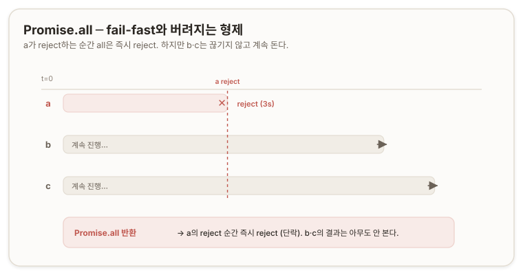

> 진단 질문 1 ─ 오답과 해설
>
>> **Answer.** <br/>
>> (1) 모르겠다. 배열 인자의 각 항목이 인덱스 순서대로 반복 실행되느냐 vs 동시에 개별 비동기로 실행되느냐의 차이 같은데, Promise 객체 하나 안에서 실행시키는 거니까 전자라 가정하면, p1이 reject되는 순간 p2·p3는 접근하지 못한 채 그냥 끝날 것이다.
>>
>>(2) 이 질문을 보면 (1)의 후자가 정답인 것처럼 읽힌다.
>
>> **Review.** <br/>
>> 네 프레임 자체가 깨져 있어. `Promise.all`이 배열 항목을 *실행*한다고 봤는데, `Promise.all`은 아무것도 실행 안 해.
>>
>>Promise는 **즉시 평가**라 `p1`, `p2`, `p3`가 만들어지는 순간 이미 다 돌고 있어. `Promise.all`은 걔네를 시작시키는 게 아니라 이미 도는 셋을 바깥에서 구독하는 옵저버야 — 컨테이너가 아니라.
>>
>>그리고 p2·p3가 "그냥 끝난다"도 틀렸어. 안 끝나, 끝까지 다 돌아. 아무도 안 멈췄으니까. 그냥 이제 결과를 아무도 안 볼 뿐이야.
>>
>> <br/>
>> "순서대로 실행되나?"의 답 — 순차인 건 `[p1, p2, p3]` 배열을 만드는 동기적 나열뿐이고, 그건 이미 도는 객체들을 마이크로초 단위로 줄 세우는 것뿐이라 비동기 작업엔 영향이 없어. 시험지를 읽고 "후자가 정답인가" 역산한 것도 짚어둘게 — 문제를 반대로 냈으면 넌 반대로 찍었을 거야. 방향이 맞아도 이유를 못 대면 0점이야.

## 03. 결합자 넷의 얼굴 ─ settle 의미의 두 대립축 {#all-settled-race-any}

결합자 넷은 두 개의 축으로 갈린다. 하나는 **전부를 기다리나 하나로 끝내나**, 다른 하나는 **실패를 어떻게 다루나**다.

**`Promise.all`** — 전원의 성공을 기다린다. 하나라도 실패하면 그 즉시 short-circuit하여 reject하고, 전원 성공 시 값들의 배열 `[v1, v2, v3]`를 반환한다.

**`Promise.allSettled`** — 아무도 버리지 않는다. 이름 그대로 all-settled, '모두가 **정착(settle)** 할 때까지' 기다린다. Promise의 정착이란 fulfilled(이행)든 rejected(거부)든 pending에서 벗어나 최종 상태로 굳는 것이므로, `allSettled`에게 reject는 실패가 아니라 정착의 한 형태일 뿐이다. 그래서 reject가 터져도 손을 뗄 이유가 없다.

반환도 `all`과 완전히 다르다. `allSettled`는 절대 reject하지 않고 항상 fulfill되며, 값 대신 **결과 기술 객체(outcome descriptor)의 배열**을 준다. 성공은 `{ status: 'fulfilled', value }`, 실패는 `{ status: 'rejected', reason }`로, 실패가 예외로 튀어나가는 것이 아니라 배열의 한 칸으로 얌전히 자리 잡는다. "열 개를 쐈는데 셋이 실패했지만 성공한 일곱은 챙기고 싶다"가 이 도구의 자리다. `all`은 하나가 터지면 성공한 것까지 버리기 때문이다([MDN: Promise.allSettled()](https://developer.mozilla.org/en-US/docs/Web/JavaScript/Reference/Global_Objects/Promise/allSettled)).

**`Promise.race`** — 제일 먼저 정착하는 한 놈의 결과를 그대로 채택한다. 여기서 채택 기준은 "먼저 fulfill한 놈"이 아니라 **"먼저 settle한 놈"** 이다. 셋 중 첫 번째로 결판난 것이 하필 reject였다면, `race`는 그 reject를 그대로 물고 나와 자기도 reject한다. 결승선을 제일 먼저 끊은 놈의 운명이 fulfill이든 reject든 그대로 복사된다([MDN: Promise.race()](https://developer.mozilla.org/en-US/docs/Web/JavaScript/Reference/Global_Objects/Promise/race)).

**`Promise.any`** — 첫 번째 **fulfill**을 낚아챈다. reject를 만나도 멈추지 않고 성공하는 놈이 나올 때까지 계속 기다린다. 여러 미러(mirror) 서버에 동시에 쏘고 아무거나 하나만 응답하면 그것으로 가는 상황이 `any`의 자리다. 모두가 reject하면 — 성공이 하나도 없으니 — `AggregateError`를 던지는데, 이것은 reason 하나가 아니라 실패한 모든 promise의 reason을 `.errors` 배열에 담아 하나로 묶은 특수한 에러다([MDN: Promise.any()](https://developer.mozilla.org/en-US/docs/Web/JavaScript/Reference/Global_Objects/Promise/any), [MDN: AggregateError](https://developer.mozilla.org/en-US/docs/Web/JavaScript/Reference/Global_Objects/AggregateError)).

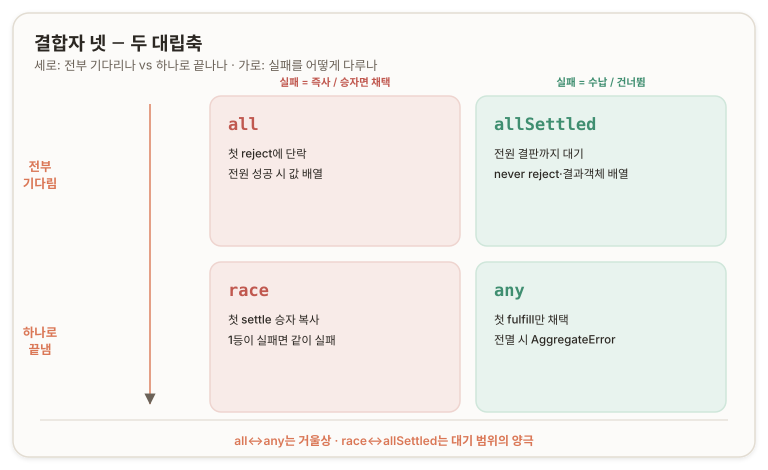

`race`와 `any`의 대조가 선명하다 — `race`는 첫 **settle**(성공이든 실패든 1등), `any`는 첫 **fulfill**(실패는 무시하고 첫 성공)이다. 그리고 `all`과 `any`는 거울상이다. `all`은 "하나라도 실패하면 전체 실패", `any`는 "하나라도 성공하면 전체 성공"으로, fulfill과 reject를 뒤집으면 서로가 된다.

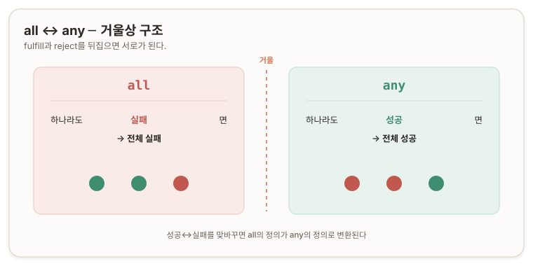

> 진단 질문 2 ─ 오답과 해설
>
>> **Answer.** <br/>
>> `allSettled`는 `all`과 다르게 인자로 받은 모든 Promise가 resolve할 때까지 계속 추적한다. 하지만 첫 reject가 터지면 손 떼는 건 `all`과 똑같을 것이다. `race`는 인자로 받은 Promise의 종료 이유와 순서를 기억할 것 같다. `any`는 하나만 resolve로 끝나면 추적을 끊고 resolve를 반환할 것 같다.
>
>> **Review.** <br/>
>> `allSettled` 답이 자기 자신이랑 모순이야. "모든 걸 끝까지 추적한다"면서 "reject 하나에 손 뗀다"? 그럼 끝까지 추적하는 게 아니잖아.
>>
>> 정답은 앞 문장 — `allSettled`는 아무도 안 버려. all-settled, '모두가 결판날 때까지'야. reject는 걔한테 실패가 아니라 정착의 한 형태니까 손 뗄 이유가 없어. 그래서 반환도 `all`이랑 완전히 달라. 절대 reject 안 하고 `{status, value}`/`{status, reason}` 결과객체 배열을 줘. 실패가 예외로 튀는 게 아니라 배열 한 칸으로 살아남아.
>>
>> `race`의 "순서를 기억"도 틀렸어. 기억은 `allSettled`가 하는 거고(다 모아두니까), `race`는 정반대로 기억 안 하고 1등 하나만 즉시 반영해. 그것도 "첫 fulfill"이 아니라 "첫 settle"이라, 1등이 실패면 race도 같이 실패해.
>>
>>`any` 앞면은 맞았는데 뒷면을 안 물었어. 모두가 reject하면 `AggregateError`를 던져. 실패한 모든 reason을 `.errors` 배열에 담아서. 이게 `any`의 지문이야.

---

## B부 ─ 취소를 결합하다: 관찰에서 통제로

## 04. race 타임아웃의 겉보기성 ─ AbortSignal.timeout과 소유권 {#abort-signal-timeout}

`race([fetch작업, 5초뒤_reject하는_promise])`는 겉보기에 5초 타임아웃을 완성한 것처럼 보인다. 5초가 지나면 타임아웃 promise가 reject하고 race가 그것을 물고 실패하기 때문이다. 그러나 이것은 반쪽짜리다. race가 타임아웃으로 reject된 그 순간, 원래 fetch는 끊기지 않고 계속 돈다. race는 실패한 promise만 일찍 reject할 뿐, 작업 자체는 방치되어 [§02](#eager-evaluation-fail-fast)의 자원 누수를 그대로 안고 간다. 이 누수를 막으려면 코어의 `AbortController`를 끌어와야 한다.

배선에는 순서가 있다. 컨트롤러는 타임아웃 콜백 *안에서* 만들어지면 안 된다. `fetch(url, { signal })`을 호출하는 순간 fetch는 signal을 즉시 요구하므로, signal은 요청이 나가는 시점에 이미 손에 쥐어져 있어야 한다. 타임아웃 콜백은 5초 뒤에야 실행되는 미래의 코드이므로, 그 안에서 컨트롤러를 만들면 fetch가 시작되는 0초 시점에는 signal이 존재하지 않는다.

올바른 순서는 (1) 컨트롤러를 맨 먼저 바깥에서 만들고, (2) 그 signal을 모든 fetch에 즉시 꽂고, (3) 타임아웃 콜백은 그 컨트롤러를 나중에 당기는 역할만 하는 것이다. *컨트롤러는 미리 놓인 폭약이고, 타임아웃은 5초 뒤 그 뇌관을 당기는 손이다.* [AbortController(→ §03)](./00-core.md#signal-receiver-abort-trigger)에서 세운 "signal은 수신기(미리 깔림), abort는 방아쇠(나중에 당김)"가 그대로 적용된다.

이 "컨트롤러를 만들어 타이머로 abort를 건다"는 조립품에는 표준화된 이름이 있다. **`AbortSignal.timeout(ms)`** 는 **지정한 시간 뒤 자동으로 abort 상태가 되도록 예약된 signal을 반환한다.** 손으로 짜려던 "컨트롤러 생성 + setTimeout으로 abort"의 두 동작이 한 줄에 봉인되어 있어, `fetch(url, { signal: AbortSignal.timeout(5000) })` 한 줄로 끝난다([MDN: AbortSignal.timeout()](https://developer.mozilla.org/en-US/docs/Web/API/AbortSignal/timeout)).

에러도 더 정확하다. 손수 만든 컨트롤러를 abort하면 fetch는 `AbortError`를 던져 "누가 취소했다"까지만 알린다. 반면 `AbortSignal.timeout()`이 터뜨린 취소는 **`TimeoutError`**(`name === 'TimeoutError'`인 `DOMException`)를 던져, `.catch`에서 `err.name`으로 "사용자 취소가 아니라 시간 초과였다"를 정확히 갈라낼 수 있다. [AbortController(→ §09)](./00-core.md#error-and-domexception)에서 "판별은 항상 `err.name`으로(`instanceof` 금지)"라고 못박은 것이 여기서 값을 한다.

`AbortSignal.timeout()`은 취소 출처가 오직 시간 하나일 때의 도구다. 취소 출처가 여럿일 때 — "5초 타임아웃 그리고 사용자가 취소 버튼도 누를 수 있음" — 는 코어의 `AbortSignal.any([])`로 서로 다른 signal을 OR 합성한다. `AbortSignal.any([userCtrl.signal, AbortSignal.timeout(5000)])`은 둘 중 먼저 터지는 쪽이 fetch를 끊으며, 그 사유가 그대로 전파되어 `err.name`으로 어느 쪽이 원인이었는지 구분된다([MDN: AbortSignal.any()](https://developer.mozilla.org/en-US/docs/Web/API/AbortSignal/any)).

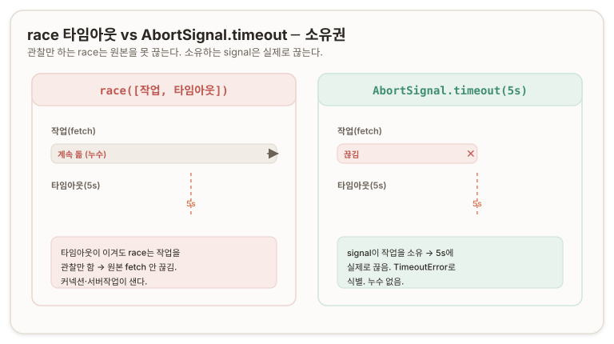

`race`는 "누가 먼저 끝났나"를 관찰하고, `AbortSignal`은 "작업을 실제로 끊는다". 축2의 통보와 조율이 여기서도 갈린다 — race는 먼저 끝난 것을 알려줄 뿐이고, signal은 통제한다.

> 진단 질문 3 ─ 오답과 해설
>
>> **Answer.** <br/>
>> 원래 fetch는 그대로 진행하고 있을 것이다. 이것은 타임아웃을 걸지 않은 상태에서 `race`가 reject를 반환했을 때 나머지 fetch가 그대로 진행하는 것과 마찬가지다. 이를 막으려면 timeout reject일 때 fetch를 중단하는 로직이 필요하다. timeout 콜백에서 AbortController를 만들고, 그 signal을 다른 Promise들의 RequestInit 안에 넣어두면 되나?
>
>> **Review.** <br/>
>> 자원 누수의 정체("fetch는 그대로 진행")도, 이게 02절과 같다는 연결도 정확해. 배선 방향(signal을 fetch에 심어 timeout 시 abort)도 맞고 signal을 `RequestInit`에 넣는 위치도 정확해.
>>
>> 딱 하나 뒤집힌 게 컨트롤러 생성 위치야. "timeout 콜백 안에서 만든다"고 했는데, 콜백은 5초 뒤에야 도는 미래의 코드라 그 안에서 컨트롤러를 만들면 0초에 fetch가 signal을 못 쥐어. **컨트롤러는 fetch보다 먼저, 바깥에서 태어나야 하고 콜백은 abort를 당기기만 해.**
>>
>> 그리고 놓친 게 있어 — 네가 손으로 재발명한 그 패턴이 이미 `AbortSignal.timeout()` 한 줄로 표준화돼 있어. 게다가 그게 던지는 건 `AbortError`가 아니라 `TimeoutError`라 취소 출처를 구분해줘. 시간+사용자처럼 출처가 여럿이면 `AbortSignal.any()`로 합성하고.

## 05. 형제 취소 전파 ─ 공유 컨트롤러와 .catch의 함정 {#sibling-cancel-fanout}

"fetchA가 실패하면 B·C를 즉시 취소한다"를 구현하려면, abort의 방아쇠를 어디에 거는지가 관건이다. 방아쇠를 `Promise.all`의 반환값에 걸면 **늦는다.**

`Promise.all`은 A가 reject되는 순간 short-circuit하지만, 그 반환값(reject)을 손에 쥐는 것은 이미 A가 실패하고 `Promise.all`이 등을 돌린 뒤다. 그 시점에 abort를 당겨도 B·C는 이미 상당 시간을 흘려보낸 뒤이고, "즉시 형제를 끊는다"의 '즉시'가 증발한다. 취합자(aggregator)는 모든 것이 끝난 뒤에야 입을 열기 때문에, 즉시 반응을 **취합자의 사후 보고에 맡기면 늦을 수밖에 없다.**

방아쇠는 개별 작업의 실패 그 자체에 걸어야 한다. "fetchA가 실패하는 바로 그 지점"은 A promise 자신의 `.catch`이므로, abort는 A의 실패 핸들러 안에서 당긴다. `fetchA.catch(() => ctrl.abort())`처럼 **A가 reject되는 순간** *`.catch`가 발화하여* 공유 signal을 즉시 abort 상태로 만들고, 그러면 B·C의 fetch가 그 자리에서 끊긴다. **`Promise.all`은 "셋 다 됐나"를 관찰만 하고, "A 실패 시 즉시 abort"라는 방아쇠는 A 자신에게 직접 건다.**

여기에는 두 개의 급소가 있다. 첫째, `.catch`는 기본적으로 에러를 삼키고 promise를 fulfilled로 되돌린다. `.catch(() => ctrl.abort())`라고만 쓰면 abort는 당겨지지만 그 promise는 "에러가 처리됐으니 성공"으로 간주되어 resolved 상태로 바뀌고, 상위 `Promise.all`은 실패를 감지조차 못 한다. 그래서 `.catch` 안에서 abort를 당긴 뒤 반드시 `throw err`로 에러를 다시 던져 실패를 실패로 유지해야 한다([MDN: Promise.prototype.catch()](https://developer.mozilla.org/en-US/docs/Web/JavaScript/Reference/Global_Objects/Promise/catch)). 둘째, `abort()`는 여러 번 불러도 안전하다. 여러 작업이 연쇄로 실패해 `ctrl.abort()`가 여러 번 불려도, 이미 abort된 컨트롤러는 다시 abort()를 불러도 조용히 무시하므로(idempotent, 멱등적), 누가 먼저 실패했는지 신경 쓰지 않고 각 `.catch`에서 부르면 된다([MDN: AbortController.abort()](https://developer.mozilla.org/en-US/docs/Web/API/AbortController/abort)).

"형제 실패 시 나머지 취소"를 완성하려면 A만이 아니라 셋 모두가 각자의 `.catch`에서 같은 공유 컨트롤러를 abort해야 한다. B나 C가 먼저 실패할 수도 있기 때문이다.

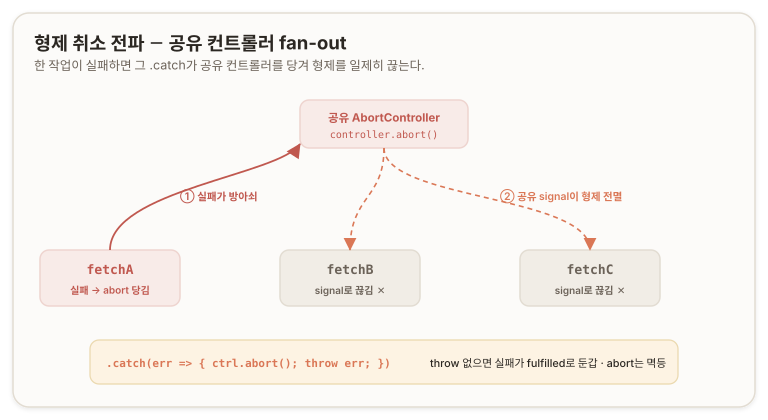

이 시나리오에서는 `AbortSignal.any([...])`가 아니라 손수 만든 공유 컨트롤러 하나면 충분하다. `AbortSignal.any()`는 취소 출처가 서로 독립적인 여럿일 때(예: 시간 OR 사용자)의 도구이고, 지금처럼 B·C를 끊는 이유가 "형제가 실패했다"는 단일 개념일 때는 공유 컨트롤러 하나를 여럿이 공유하면 된다. `any`는 이질적인 취소원 여럿을 OR로 묶고, 공유 컨트롤러는 동질적인 취소원 하나를 여럿이 공유한다.

> 진단 질문 4 ─ 오답과 해설
>
>> **Answer.** <br/>
>> 각 fetch의 signal 자리는 `AbortSignal.any([...])`로 두고, 바깥에 실패 조건 전용 AbortController를 하나 만든다. 이 signal을 `.any([...])` 배열에 넣고, 바깥에서 `Promise.all([fetchA, fetchB, fetchC])`의 반환값을 조건문으로 삼아 '각 fetch의 반환 객체 배열인지, 단순 reason 한 줄인지' 비교한 뒤에 `.abort()`를 발화시킨다.
>
>> **Review.** <br/>
>> 뼈대(공유 컨트롤러 하나 바깥에, signal 공유, 실패 시 abort)는 실무 그대로야. 근데 abort를 당기는 위치가 틀렸어.
>>
>> 방아쇠를 `Promise.all`의 반환값에 걸었는데, 취합자는 A가 실패하고 나서야 입을 열어. 그 시점엔 B·C가 이미 한참 돌았고 '즉시'가 죽어. 방아쇠는 개별 fetch의 `.catch`에 걸어야 해.
>>
>> 그리고 `AbortSignal.any([...])`는 이 시나리오엔 과잉이야. 출처가 "형제 실패"라는 하나뿐이니 공유 컨트롤러 하나면 돼.
>>
>> <br/>
>>
>> 놓친 것 둘 — `.catch`가 에러를 삼켜 promise를 fulfilled로 되돌리니 `throw err`가 필수고, `abort()`는 멱등적이라 여러 번 불러도 안전해.
>>
>> <br/>
>>
>> 마지막으로, 네 방식은 A 실패만 상정했는데 B·C가 먼저 실패할 수도 있으니 셋 다 `.catch`를 걸어야 완성이야.

---

## C부 ─ 동시성을 제한하다: 소비자에서 설계자로

## 06. 무한 병렬의 위험 ─ 스레드가 아니라 동시 작업 수 {#unbounded-concurrency}

`await Promise.all(urls.map(url => fetch(url)))`에서 `urls.length`가 1,000이면, **`map`이 1,000개 fetch를 동시에 발화시킨다**(promise는 즉시 평가라 생성 순간 모두 나간다). 이 한 줄이 재앙인 이유를 이해하려면 먼저 오개념 하나를 걷어내야 한다 — **JavaScript**는 fetch 1,000개를 쏴도 **스레드(thread)를 1,000개 만들지 않는다. 스레드는 단 하나다.**

**JavaScript**는 **단일 스레드(single-threaded)** 언어다. 실행을 담당하는 메인 스레드는 하나뿐이고, **그 위에서 이벤트 루프(event loop)가 돈다.** `fetch()`를 부르면 실제 네트워크 요청은 JS 엔진이 아니라 브라우저(또는 Node의 런타임)가 백그라운드에서 처리하고, JS 스레드는 "요청 나가라"고 지시만 던진 뒤 즉시 손을 뗀다(non-blocking). 요청이 완료되면 그 결과가 큐에 콜백으로 쌓이고, 이벤트 루프가 메인 스레드가 한가해질 때마다 하나씩 꺼내 처리한다. "1,000개 동시 실행"은 1,000개의 스레드가 병렬로 도는 것이 아니라, 하나의 스레드가 1,000개의 진행 중인 요청을 장부에 올려놓고 완료 알림을 받아 처리하는 것이다. 이것을 **동시성(concurrency)** 이라 하고, 물리적 **병렬성(parallelism)** 과는 다르다. 하나의 스레드가 여러 작업 사이를 오가는 인터리빙(interleaving)이지, 여럿이 동시에 굴러가는 것이 아니다([→ D부 - 이벤트 루프](#section-d))([MDN: 실행 모델](https://developer.mozilla.org/en-US/docs/Web/JavaScript/Reference/Execution_model)).

따라서 부하의 정체는 스레드 폭발이 아니라 **제어 없이 풀린 동시 작업 수(unbounded concurrency)**다. 위험은 세 군데서 나온다. 첫째, **커넥션 고갈** — fetch 하나하나가 네트워크 커넥션을 잡는데, 브라우저는 호스트당 동시 연결 수에 상한이 있어(HTTP/1.1 기준 보통 6개), 1,000개를 쏘면 6개만 실제로 나가고 나머지는 대기하며 커넥션 자원이 병목이 된다. 둘째, **서버 과부하** — 클라이언트가 1,000개를 쏟아부으면 받는 서버가 rate limit(속도 제한)에 걸려 429로 차단당하거나 DDoS로 오인된다. 셋째, **메모리** — 1,000개의 promise 객체와 각 요청의 버퍼가 전부 동시에 상주한다. 세 병목 모두 "동시에 진행 중인 작업의 개수"의 함수다.

`setTimeout`으로 "일정 개수씩 순차 실행"을 시도하는 것은 *도구가 틀렸다.* `setTimeout(fn, 2000)`이 "2초 뒤 다음 배치를 쏴라"는 것은 2초가 앞 배치의 완료를 보장하지 않는 근거 없는 추측이다. 앞 배치가 안 끝났는데 다음을 쏘면 동시 실행 수가 다시 폭발하고, 진작 끝났으면 시간만 버린다. "시간을 기다린다"가 아니라 **"완료를 기다린다"** 여야 한다. 배치(batch) 방식으로 고쳐도 문제가 남는다 — 10개 배치에서 9개가 빨리 끝나고 1개가 굼뜨면 나머지 9개 슬롯이 그 1개를 기다리며 논다.

제대로 된 발상은 "N개씩 끊어서 배치로"가 아니라 **"동시 실행 슬롯을 N개만 열어두고, 하나가 끝나는 즉시 그 빈 슬롯에 다음 작업을 밀어넣는다"** 이다. 은행 창구 5개에 손님 1,000명이 대기할 때, 배치 방식은 "5명 처리가 다 끝나면 다음 5명"이라 굼뜬 손님 하나가 나머지 창구를 놀리지만, 슬롯 방식은 "어느 창구든 손님 하나 끝나는 즉시 다음 대기자"라 5개 창구가 항상 꽉 차서 돌아간다. 이것이 **동시성 제한(concurrency limiting)** 또는 **작업 풀(worker pool)** 패턴이며, 세마포어(semaphore)라고도 부른다. JavaScript에는 내장이 없어 직접 만들거나 라이브러리([p-limit](https://github.com/sindresorhus/p-limit))를 쓴다. 동시 작업 수를 N으로 고정하면 세 병목이 한꺼번에 잡힌다 — 하나의 손잡이(N)로 세 병목을 동시에 통제한다.

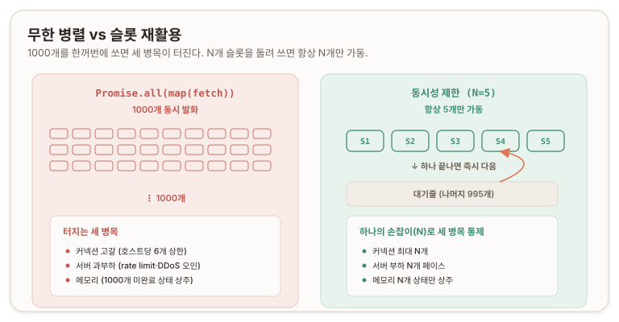

> 진단 질문 5 ─ 오답과 해설
>
>> **Answer.** <br/>
>> JS Threads가 urls.length 수만큼 생성되려 할 것이다. 내가 잘못 알고 있고 한 스레드가 여러 비동기를 수행 가능하더라도, 이 시도는 JS 엔진에 막대한 메모리 부하를 가져와 서버가 병목에 빠질 것이다. 현재는 urls를 fetch 배열로 매핑해 바로 실행시키는데, 이를 다른 함수로 감싸고 반복문과 setTimeout으로 일정 개수씩 순차 실행하면 되지 않을까?
>
>> **Review.** <br/>
>> "막대한 부하 → 서버 병목" 증상은 맞고, "내가 잘못 알고 있고"라고 오개념에 단서를 단 메타인지도 좋아. 근데 JS는 단일 스레드라 스레드는 안 생겨. 부하의 원인은 스레드가 아니라 제어 없이 풀린 동시 작업 수야. 진짜 병목은 세 가지 — 커넥션 고갈(호스트당 6개 상한), 서버 과부하(rate limit·DDoS 오인), 메모리(1000개 미완료 상태 상주).
>>
>> 그리고 "일정 개수씩"이라는 처방의 씨앗은 정답에 가까운데 `setTimeout`이 도구로 틀렸어. 시간은 완료의 대리물이 아니라 "시간을 기다린다"가 아니라 "완료를 기다린다"여야 해. 배치조차 굼뜬 작업이 슬롯을 놀리니, 진짜 해법은 슬롯 재활용 — 하나 끝나면 즉시 다음을 밀어넣어 N개를 항상 꽉 채우는 거야. 이름은 세마포어·풀·동시성 제한이고 JS 내장은 없어.

## 07. 제한기를 만들다 ─ 성크(thunk)·두 장부·Deferred·펌프 {#thunk-and-deferred}

동시성 제한기는 세 부품으로 조립된다 — 실행을 봉인하는 성크(thunk), 상태를 담는 두 장부(대기줄과 카운터), 그리고 promise의 생성과 결말을 분리하는 Deferred다.

**두 장부.** 은행 창구 비유에서 대기줄(queue)은 아직 시작 못 한 작업들이고, 가동 중인 창구 수(active count)는 지금 이 순간 실제로 돌고 있는 작업의 개수다. *대기줄은 "무엇을 아직 안 했나", 카운터는 "지금 몇 개가 돌고 있나"를 추적하며,* 이 둘로 "N개를 넘지 않게, 빈자리가 생기면 즉시 채우기"를 구현한다. 슬롯이 비었는지의 판정은 `active < N`이다 — *`=== N`이 아니라 `<`여야 "빈 슬롯이 있으면 채운다"가 자연스럽게 성립하고 경계를 정확히 N에서 막는다.* 작업 하나가 완료되면 카운터가 감소하고(`active--`), 대기줄에서 다음을 꺼내 실행하면서 카운터가 증가한다(`active++`). 카운터 증감은 "작업을 시작한다/끝난다"는 사건과 *코드상 같은 자리에 붙어야* 실제 상태의 거울로 유지된다.

**성크.** `limit(() => fetch(url))`의 `() => fetch(url)`처럼 실행을 함수로 감싼 것을 성크(thunk)라 부른다 — 실행을 나중으로 미루려고 함수로 감싼 지연된 계산 덩어리다. `fetch(url)`을 그대로 넘기면 즉시 평가되어 그 자리에서 요청이 나가버리지만, `() => fetch(url)`로 감싸면 누가 `thunk()`로 부르기 전에는 발화하지 않는다. *fetch의 발화 시점을 호출부가 아니라 제한기가 쥐게 된다.*

**Deferred.** 여기서 모순이 생긴다. `limit(thunk)`은 호출 즉시 promise를 반환해야 하는데(`Promise.all`이 1,000개의 promise를 지금 당장 쥐어야 하므로), 정작 *그 안의 실행은 슬롯이 빌 때까지 미뤄야 한다.* **"Promise는 지금 주는데 내용물 실행은 나중에"** 를 풀려면, promise를 지금 만들되 그것을 언제 resolve/reject할지는 나중에 결정하는 도구가 필요하다. promise의 생성과 결말을 분리하는 이 패턴을 **Deferred(디퍼드)** 라 부르며, 표준화된 형태가 **`Promise.withResolvers()`** 다. promise 하나와 그 promise의 resolve/reject를 한꺼번에 반환한다([MDN: Promise.withResolvers()](https://developer.mozilla.org/en-US/docs/Web/JavaScript/Reference/Global_Objects/Promise/withResolvers)).

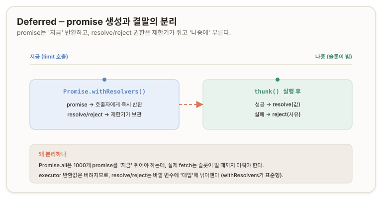

세 부품이 한 몸으로 엮이는 순환은 이렇다. `limit(thunk)`이 불리면 `withResolvers`로 promise를 즉시 만들어 반환하고, thunk와 그 resolve/reject를 대기줄에 넣고, "슬롯이 빌 때마다 대기줄에서 꺼내 실행하고 결과로 resolve하는" 펌프(pump)를 돌린다. 작업 완료 시 `active--` 후 펌프를 다시 깨워 다음을 꺼낸다.

```js
// ═══════════════════════════════════════════════════════════════════════════
//  createLimiter(n) — 동시 실행을 최대 n개로 제한하는 제한기를 만든다.
//  반환값: limit(thunk) 함수. thunk는 () => Promise 형태의 봉인된 작업.
//  limit(thunk)은 '지금 즉시' promise를 반환하지만, thunk의 실제 실행은
//  슬롯이 빌 때까지 미뤄진다. 두 장부로 상태를 관리한다:
//    queue  : 아직 시작 못 한 작업들의 대기줄
//    active : 지금 이 순간 실제로 돌고 있는 작업 수 (이게 n을 넘으면 안 됨)
// ═══════════════════════════════════════════════════════════════════════════
function createLimiter(n) {
  const queue = [];      // 장부1: 대기줄. 원소는 { thunk, resolve, reject }
  let active = 0;        // 장부2: 가동 중인 작업 수

  // pump — '빈 슬롯이 있으면 대기줄에서 꺼내 실행'을 담당하는 심장.
  // 두 곳에서 불린다: (1) limit()으로 새 작업이 들어올 때,
  //                  (2) 작업 하나가 끝나 슬롯이 하나 비었을 때.
  function pump() {
    // while인 이유: 슬롯이 여러 개 비어 있을 수 있으니(초기 가동 땐 n개가 한꺼번에).
    while (active < n && queue.length > 0) {
      const { thunk, resolve, reject } = queue.shift();  // 대기줄 맨 앞을 꺼냄

      active++;   // ★ 슬롯을 차지한다 = 카운터를 올린다 (이 둘은 한 몸)

      // thunk()는 () => fetch(url)이므로 여기서 비로소 fetch가 '발화'한다.
      // Promise.resolve()로 감싸는 이유: thunk가 promise가 아닌 값을 반환하거나
      // 동기 예외를 던져도 안전하게 promise 체인으로 흡수하기 위함.
      Promise.resolve(thunk())
        .then(resolve, reject)   // thunk의 성공/실패를, limit()이 반환했던
                                 // '바깥 promise'의 resolve/reject로 그대로 전달.
        .finally(() => {
          active--;   // ★ 작업 종료 = 슬롯 반납 = 카운터 내림
          pump();     // ★ 슬롯이 비었으니 펌프를 다시 깨운다 (순환의 고리).
        });
    }
  }

  // limit(thunk) — 호출자가 부르는 함수.
  // 핵심 계약: '지금 즉시 promise를 반환'하되, thunk 실행은 pump에 위임해 미룬다.
  return function limit(thunk) {
    // Deferred: promise를 지금 만들되, 그 resolve/reject 손잡이를 우리가 쥔다.
    const { promise, resolve, reject } = Promise.withResolvers();

    queue.push({ thunk, resolve, reject });  // 아직 실행 안 함 — 장부에 등록만.
    pump();                                  // 슬롯 있으면 즉시 실행, 없으면 대기.
    return promise;                          // 호출자에겐 '지금' 이 promise를 준다.
  };
}
```

호출은 `const limit = createLimiter(5); await Promise.all(urls.map(url => limit(() => fetch(url))))`처럼 한다. `.map`은 1,000번 `limit(...)`을 순차 호출하지만, 그 중 앞 5번만 pump가 즉시 fetch를 발화시키고(슬롯이 비어 있으니) 6번째부터는 대기줄에 쌓인다. `.map`의 순차성과 fetch 실행의 개수는 다른 층위다. `.map`은 작업을 제한기에 등록하는 행위이고, 실제 발화 개수는 제한기 내부의 카운터가 결정한다.

`active--`가 `.finally`에 있는 이유는 thunk가 성공하든 실패하든 슬롯은 반드시 반납되어야 하기 때문이다. 실패했다고 슬롯을 안 돌려주면 `active`가 줄지 않아 결국 대기줄이 막히는 데드락(deadlock)이 된다. `.then(resolve, reject)`는 thunk가 반환한 내부 promise의 결과를 `limit`이 반환했던 바깥 promise로 전달하는 다리이며, 이 지점에서야 호출자가 쥔 promise가 정착해 `Promise.all`이 반응한다.

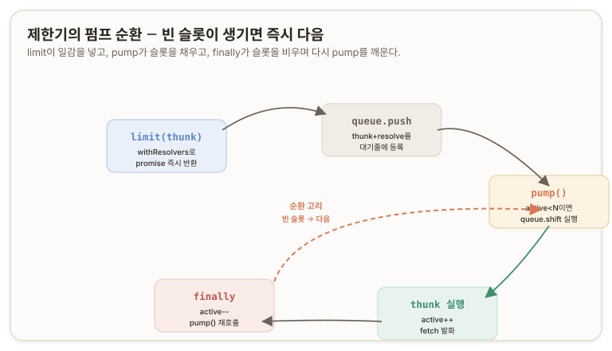

[p-limit](https://github.com/sindresorhus/p-limit)의 심장도 이 골격과 동일하다 — 내부에 `queue`와 `activeCount`를 두고, `next()`(이 골격의 pump)가 슬롯이 비면 대기줄에서 꺼내 실행하고 완료 시 `activeCount--` 후 `next()`를 다시 부르는 순환, 그리고 Deferred로 "지금 promise 반환, 나중에 resolve". 다만 p-limit는 몇 가지가 더 정교하다 — 배열 `shift()`가 O(n)인 문제를 [yocto-queue](https://github.com/sindresorhus/yocto-queue)라는 연결 리스트(linked list) 기반 큐로 O(1)로 만들고, `activeCount`·`pendingCount`를 노출해 모니터링을 돕고, `clearQueue()`로 대기줄을 비운다. 라이브러리를 뜯어봐도 "두 장부 + Deferred + 순환 펌프" 이상의 마법은 없고, 최적화된 큐와 편의 API가 껍데기다.

> 진단 질문 6 ─ 오답과 해설
>
>> **Answer.** <br/>
>> (1) 작업 완료 순간 카운터가 하나 줄고, 대기줄에서 신규 작업을 빈 슬롯으로 들여보낸 뒤 카운터를 다시 올린다.
>>
>> (2) `현재 사용 중 < N`이어야 하고, `.map`으로 반복 처리 중이니 첫 가동 시엔 하나씩 실행되지 않을까?
>>
>> (3) createLimiter 내부에서 fetch를 붙잡아야 한다. limit 인자로 익명함수 대신 url만 넘기고, 내부에서 fetch 반환값을 받을 때 카운터를 계산하고 대기줄에서 새로 만들면 되지 않을까?
>
>> **Review.** <br/>
>> (1)에서 "빈 슬롯에 넣고 나서 카운터를 올린다"는 두 박자로 봤는데, 실제론 "다음 작업을 실행한다 = 카운터가 올라간다"가 한 박자야. 카운터를 올리는 건 슬롯을 채운다는 사실 그 자체지 후속 동작이 아니야.
>>
>> (2) `< N`은 정확한데, "`.map`이라 첫 가동 시 하나씩"은 두 층위를 뭉갠 거야. `.map`은 1,000번 다 호출하지만 앞 N개까지만 즉시 발화하고 나머지는 대기줄로 가 — 결과적으로 항상 N개 가동이야.
>>
>> (3) "url만 넘기자"는 본능이 정답 근처였는데 왜인지를 못 짚었어. `() => fetch(url)`처럼 함수로 감싸면(성크) fetch가 그 자리서 실행 안 돼 — 발화 시점을 제한기가 쥐는 거야.
>>
>> <br/>
>> 근데 진짜 모순은 그다음이야: `limit(thunk)`이 지금 promise를 반환해야 하는데 실행은 나중이라, promise를 지금 만들되 resolve/reject를 나중에 부르는 도구가 필요해. 그게 Deferred(`Promise.withResolvers()`)야.

<none/>

> 진단 질문 7 ─ 오답과 해설
>
>> **Answer.** <br/>
>> `const { resolve, reject } = new Promise( (resolve, reject) => ({ resolve, reject }))`
>
>> **Review.** <br/>
>> 구조분해로 resolve/reject를 빼내려는 방향은 정확히 옳아. 근데 그 코드는 작동 안 해. 두 오해가 겹쳤어.
>>
>> **하나,** `new Promise(...)`가 반환하는 건 executor의 반환값이 아니라 **promise 객체**야. executor 안에서 뭘 반환하든 그 반환값은 통째로 버려져. 그러니 promise 객체에서 `.resolve`/`.reject`를 구조분해하려는 꼴이 되는데 그런 프로퍼티가 없어 — 둘 다 undefined.
>>
>> **둘,** executor는 `new Promise` 호출 중에 즉시 동기 실행돼(이게 promise 즉시평가의 뿌리야). 그래서 resolve/reject를 빼내려면 executor 안에서 "반환"하면 안 되고, 즉시 실행되는 그 순간 바깥 변수에 "대입"해 낚아채야 해.
>>
>> <br/>
>> 
>> **이 패턴 이름이 Deferred고, 표준 승격형이 `Promise.withResolvers()`야.** 네 구조분해 발상은 표준 API의 모양을 정확히 예견한 거야 — 대상만 `new Promise`에서 `Promise.withResolvers()`로 바꾸면 됐어.

## 08. cancel-previous ─ 낡은 응답을 죽이는 두 방어선

검색창에서 사용자가 "r", "re", "rea", "reac", "react"를 빠르게 타이핑하면 매 글자마다 fetch가 나가고, 이것들의 도착 순서가 보낸 순서와 다를 수 있다. "react"의 결과보다 "rea"의 결과가 늦게 도착하면 화면에 최신 검색어와 맞지 않는 낡은 응답(stale response)이 뜬다. 이 문제는 새 개념이 아니라 이미 배운 것의 재조합으로 풀린다 — `AbortController`는 진행 중 fetch를 끊고, 문제는 낡은 응답이 화면을 덮어쓰는 것이며, 매 글자마다 새 요청이 나간다. "rea"의 응답이 화면을 덮어쓰는 게 문제라면 "rea"의 fetch가 살아서 응답을 돌려주는 것이 문제이므로, "react"를 쏘기 전에 아직 살아 있는 "rea"의 fetch를 끊으면 된다.

**cancel-previous**의 동작은 "매 글자마다 새 fetch를 쏘기 직전에 직전 글자의 fetch를 `abort()`로 죽인다"이다. "re"를 칠 때 "r" 요청의 컨트롤러를 abort하고 새 컨트롤러로 "re"를 fetch하는 식으로, **항상 직전 것을 죽이고 새것을 쏘면 어느 순간에도 살아 있는 fetch는 가장 최신 하나뿐이다.** 낡은 응답이 낡아지기 전에 죽였으므로 존재할 수가 없다. 이 패턴을 latest-wins라고도 부른다.

```js
// ═══════════════════════════════════════════════════════════════════════
//  검색창: 매 입력마다 이전 요청을 죽이고 새 요청을 쏜다 (cancel-previous).
//  어느 시점에도 살아있는 fetch는 최신 하나뿐 → 낡은 응답이 화면을 못 덮어씀.
// ═══════════════════════════════════════════════════════════════════════
let currentCtrl = null;   // 직전 요청의 컨트롤러를 기억해두는 자리

async function onSearchInput(query) {
  currentCtrl?.abort();              // ① 직전 요청이 살아 있으면 죽인다.
  const ctrl = new AbortController();
  currentCtrl = ctrl;               // ② 새 컨트롤러를 '직전' 자리에 등록.
  try {
    const res = await fetch(`/search?q=${query}`, { signal: ctrl.signal });  // ③
    const data = await res.json();
    render(data);   // 여기 도달 = 안 끊기고 살아남음 → 최신 결과
  } catch (err) {
    if (err.name === 'AbortError') return;   // ④ 취소는 정상 → 조용히 무시
    throw err;                                // 진짜 에러만 위로 던짐
  }
}
```

새 컨트롤러를 만들기 전에 직전 것을 죽이는 ①→② 순서가 관건이고, `currentCtrl`이라는 단 하나의 기억 자리가 "직전 요청"을 추적한다. ④에서 `AbortError`를 무시하는 것은 이전 요청을 죽이면 그 fetch가 던지는 `AbortError`가 버그가 아니라 의도한 정상 동작이기 때문이다([MDN: AbortController](https://developer.mozilla.org/en-US/docs/Web/API/AbortController)).

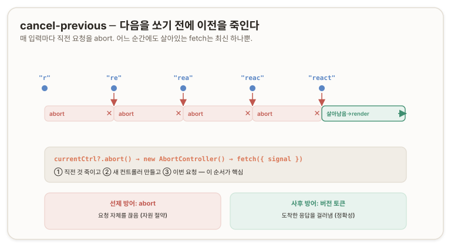

*cancel-previous에는 빈틈이 있다.* abort는 요청을 끊지만, 응답이 이미 도착해 `.json()` 파싱이 진행 중인 극히 짧은 순간에는 취소가 응답 처리를 100% 막는다는 보장이 없고, fetch가 아닌 순수 계산 작업은 `AbortController`로 끊을 곳이 없다. 그래서 두 번째 방어선으로 **버전 토큰(version token)** 또는 **시퀀스 번호(sequence number)**를 겹친다 — **매 요청에 일련번호를 붙이고, 응답이 도착했을 때 "이 응답의 번호가 지금까지 본 것 중 최신인가"를 검사해** 낡은 번호면 화면에 그리지 않고 버린다. `let latestSeq = 0`을 두고 `const seq = ++latestSeq`로 번호를 발급한 뒤, 응답 도착 시 `if (seq !== latestSeq) return`으로 내가 기다리는 동안 더 새로운 요청이 나갔는지 확인한다. 취소가 요청을 끊는 선제 방어라면, 버전 토큰은 도착한 응답을 걸러내는 사후 방어다.

두 방어선은 트레이드오프가 다르다. 취소(`AbortController`)는 요청 자체를 끊어 네트워크·서버 자원을 반납하는 선제 방어이지만 *도착 찰나의 응답이나 비-fetch 계산은 못 막는다.* 버전 토큰은 도착한 응답을 걸러내는 사후 방어라 순수 계산까지 적용되지만 *요청은 끝까지 가서 자원을 아끼지 못한다.* 실무 검색창은 둘을 겹쳐 abort로 대부분의 낡은 요청을 죽이고 seq로 그물을 빠져나온 응답을 최종 차단한다 — 하나는 자원을, 하나는 정확성을 지킨다.

> 진단 질문 8 ─ 오답과 해설
>
>> **Answer.** <br/>
>> 깊게 고민해봤는데, 모르겠다.
>
>> **Review.** <br/>
>> 몰라서가 아니라 아는 걸 재조합 못 한 거야. cancel-previous는 새 지식이 하나도 안 필요했어 — 코어의 `abort()` + 방금 깐 stale 문제의 직접적 재조합이야. 넌 이미 `abort()`를 알았으니 "언제 부를까"만 답하면 됐어: 다음을 쏘기 전에 이전을 abort. `currentCtrl` 하나로 직전 요청을 추적하고, 끊긴 fetch의 `AbortError`는 정상이니 무시하고. 그리고 취소가 못 막는 틈(찰나의 응답·비-fetch 계산)을 버전 토큰(sequence)으로 메우는 사후 방어까지. 다음엔 모르겠어도 아는 조각을 소리 내 나열해봐 — "abort는 안다, 문제는 낡은 응답이다, 매번 새 요청이 나간다" 이 셋만 적었어도 스스로 답에 도달했어. 아키텍트는 "모른다"에서 멈추는 게 아니라 아는 걸 재조합해서 모르는 걸 만들어나가야 하는 거야.

---

## D부 ─ 실행 기계: 그 모든 것이 딛고 선 이벤트 루프 {#section-d}

## 09. 이벤트 루프 단위 ─ 콜 스택과 두 큐 {#call-stack-and-queue}

지금까지 이 축은 결합자가 여러 비동기를 "동시에" 관찰한다고 반복해서 말했다. 그러나 [§06](#unbounded-concurrency)에서 확인했듯 *JavaScript는 단일 스레드(single-threaded)다.* 스레드가 하나뿐이라면 "동시에"라는 말은 기계적으로 무엇을 뜻하는가. 그 실체를 규명하지 않으면 "동시 관찰"은 은유로만 남는다. 그 실체가 바로 **이벤트 루프(event loop)** 와 **마이크로태스크 큐(microtask queue)** 에서 벌어지는 일이다.

JavaScript 런타임이 코드를 실행하는 판은 세 부분으로 나뉜다 ─

- **콜 스택(call stack)** 은 지금 당장 실행 중인 동기 코드가 쌓이는 곳이다. `console.log(1)`을 부르면 스택에 올라가 실행되고 내려온다. 스택에 무엇이 하나라도 있으면 JavaScript는 그것을 처리하느라 다른 것을 하지 못한다. 이것이 단일 스레드의 물리적 실체다 — 스택은 하나뿐이고, 한 번에 하나씩만 처리한다.
- **마이크로태스크 큐**는 `.then` 콜백, `queueMicrotask`, `await` 뒤의 코드가 줄 서는 곳이다.
- **매크로태스크 큐(macrotask queue)**(태스크 큐라고도 한다)는 `setTimeout`, `setInterval`, I/O 콜백, 이벤트 콜백이 줄 서는 곳이다([MDN: 실행 모델](https://developer.mozilla.org/en-US/docs/Web/JavaScript/Reference/Execution_model)).

이 셋을 지배하는 것이 이벤트 루프의 규칙이다. 콜 스택이 비면, 이벤트 루프는 마이크로태스크 큐를 먼저 그리고 몽땅 비운 뒤, 매크로태스크 큐에서 딱 하나를 꺼내 실행하고, 다시 마이크로태스크 큐를 몽땅 비우고, 매크로 하나를 꺼내는 순환을 반복한다([MDN: 마이크로태스크 가이드](https://developer.mozilla.org/en-US/docs/Web/API/HTML_DOM_API/Microtask_guide)).

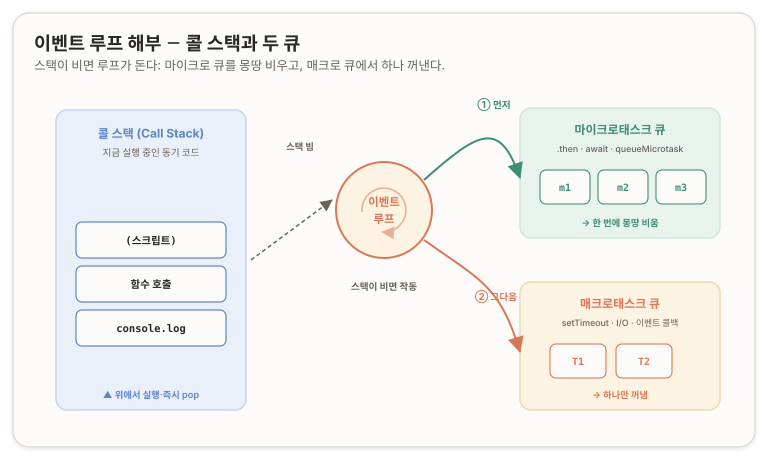

이 규칙에는 두 개의 비대칭이 박혀 있다. **첫째, 스택이 먼저다.** 마이크로태스크든 매크로태스크든, 콜 스택에 동기 코드가 남아 있는 한 어떤 큐도 실행되지 않는다. 큐는 스택이 완전히 빌 때까지 무조건 대기한다. **둘째, 마이크로가 매크로를 이긴다.** 스택이 비면 마이크로태스크 큐를 전부 비운 다음에야 매크로태스크를 하나 건드린다. 그래서 `setTimeout(fn, 0)`의 `0`조차 모든 마이크로태스크에 추월당한다. `.then`은 항상 `setTimeout(…, 0)`을 이긴다.

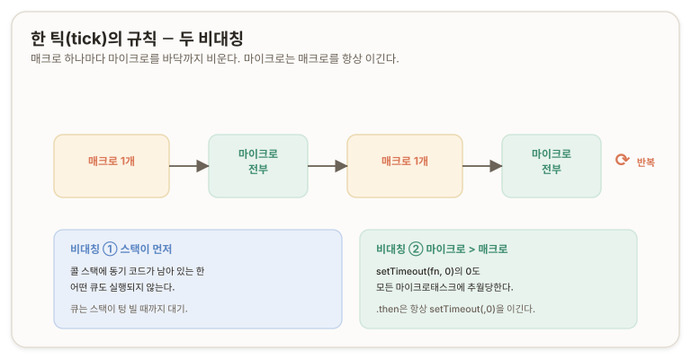

여기서 두 가지 오개념을 걷어내야 한다. 첫째, **`new Promise(executor)`의 executor는 즉시, 동기적으로 실행된다.** `new Promise((resolve) => { console.log(2); resolve(); })`에서 `console.log(2)`는 `new Promise`가 실행되는 그 순간 그 자리에서 실행되며, `console.log(1)`과 완전히 같은 자격의 동기 코드다. Promise의 즉시 평가(eager evaluation)가 적용되는 것은 executor 본문이지 `.then` 콜백이 아니다(07절의 Deferred가 이 즉시 실행을 이용해 resolve를 낚아챘다).

둘째, **`resolve()`는 실행이 아니라 큐잉(queuing)이다.** `resolve()`가 하는 일은 promise의 상태를 pending에서 fulfilled로 바꾸고, 그 promise에 붙은 `.then` 콜백을 마이크로태스크 큐에 넣으라고 예약하는 것뿐이다. 큐에 넣기만 하지, 그 자리에서 콜백을 실행하지 않는다. 그래서 `resolve()`가 불린 직후에도 `.then` 콜백은 아직 실행되지 않고, 동기 코드가 전부 끝나 콜 스택이 빈 뒤에야 큐에서 꺼내진다. resolve와 `.then` 콜백 실행 사이에는 반드시 "스택 비우기"가 낀다.

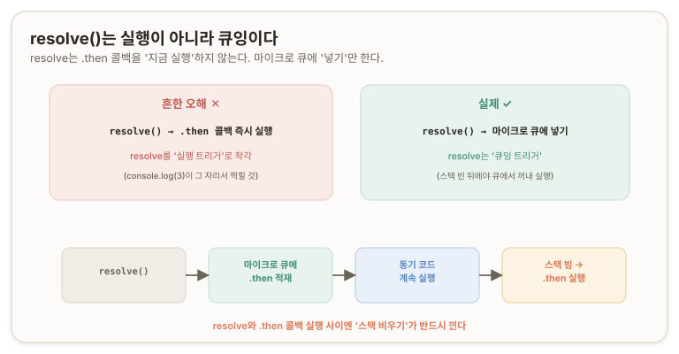

이 기계를 손에 쥐면 "동시 관찰"의 정체가 드러난다. `Promise.all`이 세 promise를 "동시에" 기다린다는 것은, 세 개가 각자 완료될 때 각자의 처리를 마이크로태스크 큐에 넣고 이벤트 루프가 그것을 하나씩 꺼내 처리하는 것이다. 물리적 동시가 아니라 마이크로태스크 큐 위의 인터리빙(interleaving)이며, [§06](#unbounded-concurrency)에서 예고한 그 단어가 이제 기계로 설명된다.

> 진단 질문 9 ─ 오답과 해설
>
>> **Answer.** <br/>
>> Promise는 `const p`로 선언됨과 동시에 실행됐어. `resolve`를 통해 `.then`으로 넘어갈 거고, 여기서의 console.log(3)은 console.log(2)와 마찬가지로 비동기로 진행돼. **출력 순서는 1 → 2 → 4 → 3이라고 봐.**
>>
>> 왜 3보다 4가 먼저냐면, 2는 Promise가 생성되자마자 실행되는 코드고, JS 컴파일러는 곧바로 다음 코드인 console.log(4)를 실행시키겠지. `.then()`으로 묶인 3은 그보단 늦게 실행될 것 같았어.
>>
>> <br/>혹시 `resolve()`가 중요한 녀석인가? 얘가 언제 어떻게 동작하는지 잘 모른다는 걸 깨달았거든. setTimeout callback이 Promise로 선언되었으니까 둘째 줄 `.then()`이 setTimeout 뒤쪽인 건가? `Promise.resolve()`가 앞서 실행 중인 모든 Promise를 묶는 건가?
>
>> **Review.** <br/>
>> 순서 `1→2→4→3`은 정답이야. 근데 "2도 3과 마찬가지로 비동기"가 정반대로 틀렸어. **2는 완전 동기고, 3이 비동기야.** executor는 `new Promise`가 도는 그 순간 스택에서 즉시 실행되니까 2는 1과 똑같은 동기 코드고, "즉시 평가"가 적용되는 건 3이 아니라 2야. 결론은 맞았는데 근거가 뒤집혀 있었어 — 반쯤 운이야. 그리고 네가 스스로 짚은 "`resolve()`를 잘 모른다"가 이 매듭의 진짜 급소였어. `resolve()`는 `.then`을 **실행하는 게 아니라 마이크로태스크 큐에 넣는** 큐잉 트리거야. 3이 4보다 늦는 진짜 이유가 이거고.
>>
>> <br/>두 오개념 — "setTimeout이 Promise로 선언됐다"는 무관한 독립 두 줄이고(setTimeout은 매크로, Promise는 마이크로), "`Promise.resolve()`가 앞선 Promise를 묶는다"도 아니야. 묶는 건 `Promise.all`이고 `Promise.resolve()`는 이미 완료된 promise 하나를 만드는 팩토리야. 그래서 Q2 정답은 `'T'`가 아니라 `'P'`가 먼저 — 마이크로가 매크로를 이기니까. "모른다"를 정직하게 짚은 메타인지가 오늘 제일 값진 한 수였어.

---

## 10. 중첩과 run-to-completion ─ 이벤트 루프의 개입 지점

이벤트 루프가 "스택이 빌 때 큐를 본다"면, 그 "단위"는 무엇인가. `setTimeout`을 선언하는 시점엔 스택도 큐도 비어 보이는데, 어째서 뒷줄의 `.then`이 먼저 처리되는가. 이 물음의 답은 이벤트 루프가 개입하는 단위가 코드의 스코프(scope)나 함수가 아니라 **태스크(task)** 라는 사실에 있다.

이벤트 루프의 한 틱(tick)에서 실행되는 원자적 단위는 태스크 하나이고, 태스크 하나는 시작하면 끝까지 안 끊기고 완주한다. 이 원칙을 **실행-완료(run-to-completion)** 라 부른다. 태스크가 도는 도중에는 이벤트 루프가 절대 끼어들지 못하며, 큐에 무엇이 쌓이든 지금 도는 태스크가 끝날 때까지 기다린다([HTML Standard: Event loop processing model](https://html.spec.whatwg.org/multipage/webappapis.html#event-loop-processing-model)).

무엇이 "하나의 태스크"인가. 스크립트 전체의 실행이 태스크 하나이고, 각 `setTimeout` 콜백이 태스크 하나이며, 각 이벤트 콜백(버튼 클릭 핸들러 등)과 각 I/O 완료 콜백이 각각 태스크 하나다. "단위"는 코드 블록이 아니라 이벤트 루프가 큐에서 꺼내 올리는 콜백 하나하나다. 그 콜백이 내부에서 함수를 몇 겹 부르든, 그 전체가 끊기지 않는 한 덩어리로 실행되고 다 끝나야 다음으로 넘어간다.

이 관점에서 "`setTimeout` 선언 시점엔 큐가 비어 있었다"는 관찰이 왜 어긋나는지 드러난다. 그 두 줄은 통째로 **하나의 스크립트 태스크로 콜 스택 위에서 실행 중**이었다. `setTimeout(…)`은 `'T'`를 매크로 큐에 적재하지만 스택은 아직 안 비었고(다음 줄이 남았으니), `Promise.resolve().then(…)`은 `'P'`를 마이크로 큐에 적재한 뒤 스크립트 태스크가 끝나야 스택이 빈다. `setTimeout`이 뒷줄을 "기다려준" 것이 아니라, 스크립트 태스크가 끝날 때까지 두 큐가 모두 대기한 것이다.

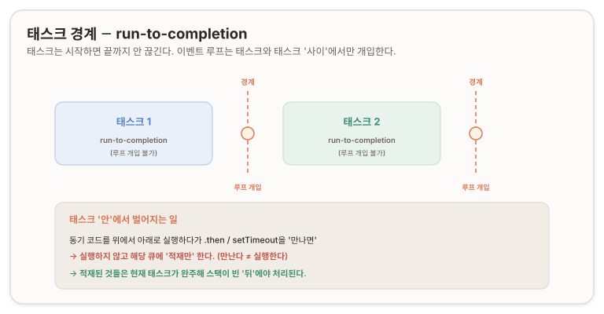

여기에 자주 빠지는 오개념 하나를 교정할 필요가 있다 — 태스크를 실행할 때 ***그 안의 코드가 미리 분류되어 큐에 한꺼번에 쌓이는 것이 아니다.*** 태스크 안의 코드는 콜 스택에서 위에서 아래로 순차 실행되다가, `.then`이나 `setTimeout`을 **만나는 순간** 해당 큐에 하나씩 밀어 넣는다. "만난다"는 "실행한다"가 아니다. 실행이 먼저이고, 큐잉은 그 실행 도중에 벌어지는 사건이다. 따라서 조건 분기로 그 줄에 도달하지 않으면 큐잉도 일어나지 않는다 — 실행의 흐름이 큐 적재를 결정하는 것이지, 코드를 미리 스캔해서 뿌리는 것이 아니다.

두 규칙(스택 먼저, 매크로마다 마이크로 완전 비우기)을 재귀적으로 적용하면 아무리 중첩된 코드도 순서를 계산할 수 있다. 다음 코드를 추적하면, 스크립트 태스크가 A와 F를 동기로 찍고 T1을 매크로에, E를 마이크로에 적재한 뒤 끝난다. 스택이 비자 마이크로(E)가 먼저 비워지고, 그다음 매크로 T1이 올라가 B를 찍고 C를 마이크로에·D를 매크로(T2)에 적재한다. T1이 끝나면 다시 마이크로(C)를 비우고, 마지막으로 T2가 D를 찍는다.

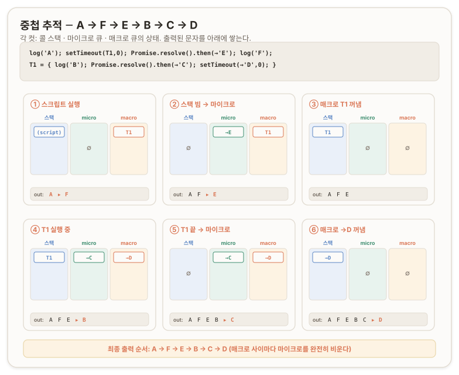

최종 순서는 A → F → E → B → C → D이다. 매크로태스크와 매크로태스크 사이마다 마이크로태스크 큐를 완전히 비운다는 규칙이 순서를 가르며, 중첩된 `setTimeout`은 "지금 태스크가 끝난 후의 큐"에 들어가므로 당연히 그 뒤 순번이 된다. `await`도 이 기계 위에 있다 — `await` 뒤의 코드는 `.then`과 같이 마이크로태스크로 스케줄되어, `async` 함수는 `await`에서 일시 중단됐다가 마이크로태스크로 재개된다(→ 축4에서 본격적으로 다룬다)([Jake Archibald: Tasks, microtasks, queues and schedules](https://jakearchibald.com/2015/tasks-microtasks-queues-and-schedules/)).

---

## 11. 제한기에 취소를 심다 ─ 두 종류의 취소 {#two-cancellation-queued-in-flight}

[§07](#thunk-and-deferred)의 제한기 골격에는 취소가 없었다. 대기줄에 500개가 쌓였는데 사용자가 "전체 취소"를 누르면, 그 골격은 500개를 전부 실행한다. 여기에 취소를 심으려면 먼저 취소가 **두 종류**라는 것을 봐야 한다.

취소 대상은 상태에 따라 갈린다. **대기 중(queued)** 작업은 아직 슬롯을 못 얻어 대기줄에 있는, fetch가 아직 안 나간 작업이다. **진행 중(in-flight)** 작업은 이미 슬롯을 차지하고 fetch가 돌고 있는 작업이다. 이 둘의 처리가 완전히 다른 이유는 "작업이 이벤트 루프에 이미 올라탔는가"에 있다. 대기 중은 아직 큐에서 안 나왔으니 버리면 그만이고, 진행 중은 이미 태스크로 실행되어 커넥션·서버작업이라는 자원을 쥐고 있으니 `AbortSignal`로 실제로 끊어야 한다([→ §09](#call-stack-and-queue)에서 본 "태스크로 올라탔나"의 구분과 같은 경계다).

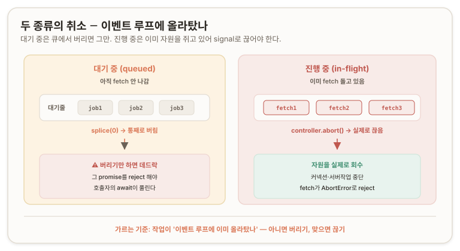

**진행 중 취소**를 하려면 fetch가 signal을 물고 있어야 한다. [§07](#thunk-and-deferred)의 성크는 `() => fetch(url)`이라 signal이 안 들어가 있으므로, 성크 시그니처를 `(signal) => fetch(url, { signal })`로 바꾸고 제한기가 실행 시점에 signal을 **주입(inject)** 한다. 그리고 제한기 전체를 관장하는 공유 `AbortController` 하나를 두어, 그 signal을 모든 작업에 주입하면 컨트롤러 하나를 abort하는 것으로 진행 중 작업 전부가 fan-out으로 끊긴다([§05](#sibling-cancel-fanout)의 형제 취소 전파와 같은 사상이다). 취소 권한이 제한기 안에 캡슐화(encapsulation)되어, 호출자는 signal의 존재를 몰라도 그냥 받아서 fetch에 꽂기만 하면 된다.

**대기 중 취소**는 대기줄에서 작업을 빼는 것이지만, 빼기만 하면 데드락(deadlock)이 된다. `limit(thunk)`은 호출자에게 `withResolvers`의 promise를 이미 반환했으므로, 큐에서 성크만 슬쩍 빼면 그 promise는 아무도 resolve/reject를 안 불러 영원히 pending으로 남고, 호출자의 `await`이 영원히 안 풀린다. 그래서 대기 중 취소는 큐에서 빼는 것에 더해 그 promise를 반드시 **reject**해야 한다(보통 `AbortError`로). 이 reject 역시 [→ §09](#call-stack-and-queue)에서 본 대로 `.catch`/`await` 재개를 마이크로태스크로 스케줄한다.

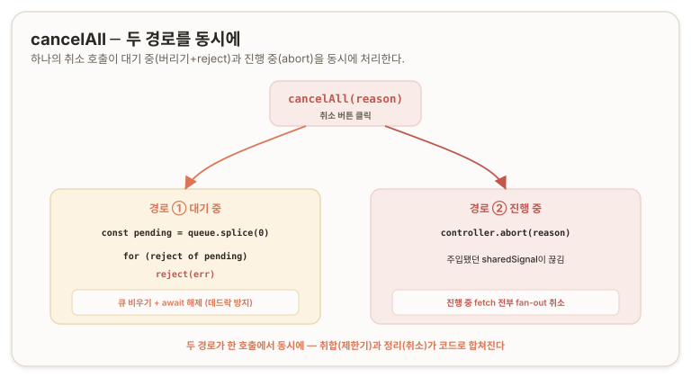

> **진단 질문 (매듭 B).** 동시 실행을 N개로 제한하는 제한기에 "전체 취소"를 심는다. 취소 대상이 대기 중(queued)과 진행 중(in-flight) 두 종류인데, 각각 어떻게 취소해야 할까? 아직 시작 안 한 놈과 이미 fetch 도는 놈, 둘의 처리가 왜 다르고 각각 뭘 해야 하지?

<none/>

> 진단 질문 (매듭 B) ─ 오답과 해설
>
>> **Answer.** <br/>
>> 대기 중(queued): 큐에서 제거. 근데 큐가 특정 인덱스 제거가 되나? 보통 FIFO/LIFO 아닌가? 진행 중(in-flight): Abort로 중단.
>
>> **Review.** <br/>
>> 방향은 둘 다 맞았어 — 두 종류를 다르게 처리해야 한다는 직관, 진행 중은 Abort라는 것도. 그리고 네가 던진 "큐가 인덱스 제거 되나?"가 정확히 실무 갈림길이라 짚어둘게.
>>
>> **"큐(queue)"는 추상 자료형(ADT, Abstract Data Type)이야.** "FIFO로 넣고 뺀다"는 동작 계약이지 물리적 구현이 아니야. JS에서 큐를 배열(`Array`)로 구현하면 — 보통 그래 — 배열의 모든 능력을 그대로 써. 인덱스 접근도 중간 제거(`splice`)도 다 돼. "큐라서 인덱스 제거가 안 된다"가 아니라, 큐라는 계약은 FIFO만 약속하지만 배열로 구현했으면 배열 메서드로 뭐든 할 수 있어.
>>
>>"전체 취소"면 아예 더 간단해 — `queue.splice(0)`로 통째로 비우면 끝. 근데 여기서 네가 못 짚은 게 있어: 큐에서 빼기만 하면 그 작업의 promise가 **영원히 pending**이야. `limit`이 호출자에게 이미 promise를 반환했는데 resolve/reject를 안 부르면 호출자의 `await`이 영영 안 풀려. 데드락이야. 그래서 대기 중 취소는 "큐에서 빼기 + 그 promise를 reject"가 한 쌍이야. 진행 중도 "Abort" 한마디론 부족해. 성크가 signal을 안 물고 있으니 시그니처를 `(signal) => fetch(url, { signal })`로 바꿔 제한기가 주입해야 abort가 먹혀.

<br/>

이 두 취소를 [§07](#thunk-and-deferred) 골격에 심으면 다음과 같다.

성크 시그니처가 `(signal) => Promise`로 바뀌고, 공유 컨트롤러·`aborted` 가드·`cancelAll`이 추가된다. 나머지 골격(두 장부·펌프 순환·Deferred)은 그대로다.

```js
// ═══════════════════════════════════════════════════════════════════════════
//  createLimiter(n) — 동시 실행 최대 n개 제한 + 취소(cancel) 지원 완성본.
//
//  07절 골격 대비 추가된 것:
//    · 각 작업 실행 시 AbortSignal을 '주입'해, 진행 중 작업을 실제로 끊을 수 있음.
//    · 공유 컨트롤러 하나로 '전체 취소'. abort() 한 번에 진행 중 전부 + 대기 중 전부.
//    · 대기 중(아직 시작 안 함) 취소: 큐에서 빼고 그 promise를 reject (데드락 방지).
//    · 진행 중(이미 fetch 돎) 취소: 주입된 signal이 끊겨 fetch가 AbortError로 실패.
//
//  thunk 계약이 바뀐다: () => Promise 가 아니라 (signal) => Promise.
//    예: limit((signal) => fetch(url, { signal }))
// ═══════════════════════════════════════════════════════════════════════════
function createLimiter(n) {
  const queue = [];                          // 장부1: 대기줄. 원소 = { thunk, resolve, reject }
  let active = 0;                            // 장부2: 진행 중(in-flight) 작업 수
  const controller = new AbortController();  // 제한기 전체를 관장하는 공유 컨트롤러
  const sharedSignal = controller.signal;    // 모든 작업에 주입될 하나의 signal

  function pump() {
    while (active < n && queue.length > 0) {
      const { thunk, resolve, reject } = queue.shift();
      active++;   // 슬롯 차지 = 카운터 증가 (한 몸)

      // ★ 변경점: thunk에 sharedSignal을 '주입'하며 실행.
      //   thunk가 (signal) => fetch(url, { signal }) 이므로,
      //   여기서 넘긴 signal이 fetch에 꽂혀 → controller.abort() 시 이 fetch가 끊긴다.
      Promise.resolve(thunk(sharedSignal))
        .then(resolve, reject)   // 진행 중 작업이 abort되면 fetch가 AbortError로 reject,
                                 // 그 에러가 reject를 타고 바깥 promise로 전달된다.
                                 // (에러를 삼키지 않고 그대로 호출자에게 넘김)
        .finally(() => {
          active--;   // 작업 종료 = 슬롯 반납
          pump();     // 빈 슬롯 채우러 다음 작업 당김 (순환의 고리)
        });
    }
  }

  function limit(thunk) {
    const { promise, resolve, reject } = Promise.withResolvers();

    // ★ 변경점: 등록 '시점'에 이미 전체가 취소된 상태라면, 큐에 넣지 말고 즉시 reject.
    //   (abort 이후 들어온 새 작업까지 받아버리면 취소의 의미가 깨진다.)
    //   AbortSignal.reason: abort() 시 넘긴 사유. 기본값은 AbortError DOMException.
    if (sharedSignal.aborted) {
      reject(sharedSignal.reason);
      return promise;
    }

    queue.push({ thunk, resolve, reject });
    pump();
    return promise;
  }

  function cancelAll(reason) {
    // (1) 대기 중(queued) 취소: 아직 시작 안 한 놈들.
    //     큐에서 빼는 것만으론 부족 — 각 promise를 reject 해야 호출자의 await이 풀린다.
    //     이 뒷정리를 빠뜨리면 그 promise들은 영원히 pending = 데드락.
    const pending = queue.splice(0);   // 큐를 통째로 비우고, 빠진 원소들을 손에 쥠
    const err = reason ?? new DOMException('Aborted', 'AbortError');
    for (const { reject } of pending) {
      reject(err);   // 대기 중이던 각 작업의 바깥 promise를 reject → await 해제
    }

    // (2) 진행 중(in-flight) 취소: 이미 fetch 도는 놈들.
    //     공유 컨트롤러를 abort → 주입됐던 sharedSignal이 끊김 →
    //     각 fetch가 AbortError로 reject → pump의 .then(resolve, reject) 타고 전달.
    //     (abort() 한 번이 진행 중 '전부'를 fan-out으로 끊는다.)
    controller.abort(reason);
  }

  return { limit, cancelAll, signal: sharedSignal };
}
```

호출은 `const { limit, cancelAll } = createLimiter(5)`로 받아, `urls.map(url => limit((signal) => fetch(url, { signal }).then(r => r.json())))`처럼 성크에 signal을 흘려보낸다. 취합자는 `Promise.allSettled`가 자연스럽다 — 취소 시 각 결과가 `{ status: 'rejected', reason: AbortError }`로 수납되어, 취소가 예외로 전체를 무너뜨리지 않고 결과 배열의 한 칸으로 자리 잡기 때문이다([§03](#all-settled-race-any)의 `allSettled` 자리). `cancelButton.onclick = () => cancelAll()` 한 줄이 진행 중 5개를 `AbortError`로 끊고, 대기 중 나머지를 큐에서 빼며 reject한다.

`cancelAll`의 두 경로가 [§09](#call-stack-and-queue)의 이벤트 루프 위에서 도는 방식이 이 완성본의 타이밍이다. `reject(err)`를 부르면 그 promise의 `.catch`/`await` 재개가 마이크로태스크 큐로 들어가고, abort로 인한 fetch의 `AbortError`도 마이크로태스크를 타고 바깥 promise로 흐른다. 취소가 "지금 당장 동기로 끝나는" 것이 아니라 이벤트 루프 위에서 마이크로태스크로 전파되는 것이며, [§09](#call-stack-and-queue)에서 세운 "resolve/reject는 실행이 아니라 큐잉 트리거"가 여기서 그대로 작동한다.

이 완성본에도 한계는 남는다. `cancelAll`은 전부 끊지만 "3번 작업만 취소"라는 개별 취소는 없어, 하려면 각 작업에 개별 컨트롤러를 더 두고 `AbortSignal.any([개별, 공유])`로 합성해야 한다([§04](#abort-signal-timeout)의 이질적 취소원 합성 패턴). 그리고 한 번 `cancelAll`하면 컨트롤러가 abort 상태로 굳어 이 제한기는 폐기해야 하고, 재사용하려면 컨트롤러를 갈아 끼우는 로직이 필요하다([MDN: AbortSignal.reason](https://developer.mozilla.org/en-US/docs/Web/API/AbortSignal/reason)).

---

## 결론 ─ 조율은 통제가 아니다

## 12. race의 세 겹 누수 ─ 소유하는 자만 정리한다 {#race-leak-via-ownership}

04절에서 `race([작업, 타임아웃])`이 원본 작업을 못 끊는 누수를 봤다. 그런데 그 누수는 한 겹이 아니라 세 겹이고, 어느 쪽이 이기든 진 쪽이 샌다.

`Promise.race([fetchWork, timeout5s])`에서 승패에 따라 새는 자리가 다르다. **타임아웃이 이기면(갈래 A)** 진 쪽인 `fetchWork`가 안 끊겨 커넥션·서버작업이 샌다(04절의 그 누수). **작업이 이기면(갈래 B)** 진 쪽인 `timeout5s`가 문제다 — `fetchWork`가 3초에 성공해 race가 정착해도, `timeout5s`는 사라지지 않고 그 안의 `setTimeout`이 5초를 꽉 채워 콜백을 발화시킨다. race의 승패와 `setTimeout`의 수명은 완전히 무관하다. 그리고 5초에 그 타이머가 예정대로 reject하는데, race는 이미 `fetchWork`로 끝나 이 promise를 아무도 안 보고 있으므로, 받아줄 핸들러 없는 이 reject는 **처리 안 된 거부(unhandled rejection)** 가 된다. 브라우저는 이것을 감지해 `unhandledrejection` 이벤트를 쏘고 콘솔에 경고를 찍는다([MDN: unhandledrejection 이벤트](https://developer.mozilla.org/en-US/docs/Web/API/Window/unhandledrejection_event)).

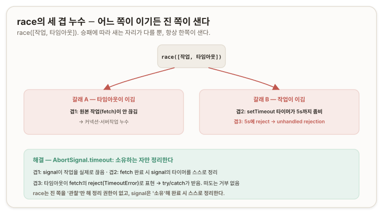

`race`가 진 쪽을 정리하지 못하는 근본 이유는 **소유(ownership)** 에 있다. race는 `timeout5s`를 관찰(observe)만 하지 소유하지 않는다. race가 받은 것은 이미 만들어져 돌아가는 promise 둘이고, race는 거기에 `.then`을 걸어 "누가 먼저 끝나나"를 지켜볼 뿐이다. `timeout5s` 안의 `setTimeout`은 race가 만든 것도 아니고 race가 접근할 수도 없으므로, race한테는 그것을 끌 손잡이가 없다(06·07절에서 `Promise.all`이 "실행 주체가 아니라 관찰자"였던 것과 같다 — 관찰자는 관찰 대상을 멈출 권한이 없다). 그래서 race가 진 쪽에 하는 일은 멈추는 것이 아니라 **버리는(abandon)** 것이다. 버려진 `timeout5s`는 아무도 안 보는 채로 5초까지 살아 돌아간다.

`AbortSignal.timeout()`이 이 세 겹을 다 막는 것은 그것이 타이머를 **소유** 하기 때문이다. 겹1은 signal이 작업을 실제로 끊어 해결하고, 겹2는 fetch가 성공하면 자기가 문 signal의 타임아웃 타이머를 스스로 정리해(fetch 완료 시 signal에 걸린 타이머가 청소되므로 좀비 타이머가 안 남는다) 해결하며, 겹3은 타임아웃이 fetch의 reject(`TimeoutError`)로 표현되어 `try/catch`가 받으므로 떠도는 거부 자체가 안 생겨 해결한다. race는 관찰만 해 정리 권한이 없고, signal은 소유해 완료 시 스스로 정리한다 — 이것이 [§04](#abort-signal-timeout)에서 표로만 보고 넘어간 "왜 우월한가"의 실체다([MDN: AbortSignal.timeout()](https://developer.mozilla.org/en-US/docs/Web/API/AbortSignal/timeout)).

이 **unhandled rejection**은 race만의 것이 아니다. [§02](#eager-evaluation-fail-fast)에서 본 `Promise.all`의 fail-fast 뒤에도 같은 일이 벌어진다 — `all([a,b,c])`에서 a가 먼저 reject해 all이 끝난 뒤 b가 나중에 reject하면, all은 이미 a로 끝나 b의 reject를 안 보므로 b에 `.catch`가 없으면 unhandled가 된다. [§05](#sibling-cancel-fanout)에서 형제를 공유 컨트롤러로 끊을 때 그 `AbortError`도 처리 안 하면 unhandled이므로, 실무에서는 취소된 형제의 `AbortError`를 삼키는 `.catch(() => {})`를 다는 것이 관용이다(취소는 정상이니 조용히 무시). [§11](#two-cancellation-queued-in-flight) 완성본이 `.then(resolve, reject)`로 에러를 바깥 promise로 넘긴 것도 이 맥락 — 받아줄 곳을 만들어 떠도는 거부를 막은 것이다.

> 진단 질문 10 ─ 오답과 해설
>
>> **Answer.** <br/>
>> (1) `timeout5s`는 사라지지진 않고, race가 추적하는 작업을 멈춰. race가 이겼으니 걔가 스레드 위에서 돌고 있는 거니까 정리될 것 같아.
>>
>> (2) 그 안의 `setTimeout`은 여전히 5초 기다리기를 수행 중일 거야 — race가 끝나도 자동 취소는 안 되고 5초를 마저 채우겠지.
>
>> **Review.** <br/>
>> (2)는 정확히 맞았어 — `setTimeout`은 race 승패와 무관하게 5초를 꽉 채워. 이 무관함을 잡은 게 핵심이야.
>>
>> 근데 (1)의 "race가 진 쪽 작업을 **멈춘다**"가 틀렸어. race는 멈출 능력이 없어. 토픽6에서 판 "결합자는 형제를 안 끊는다"를 여기다 적용 못 한 거야 — race도 결합자고, 진 쪽을 관찰만 하지 소유를 못 해서 그냥 **버려(abandon)**. 등 돌리는 거지 끄는 게 아니야.
>>
>> <br/> 그리고 "스레드 위에서 돌고 있다"도 짚어둘게 — `setTimeout`은 스레드를 점유하고 도는 게 아니야. 타이머가 매크로태스크 큐에 등록돼 5초 뒤 발화 예약된 거지([§09](#call-stack-and-queue)), 스레드가 그걸 붙잡고 있는 게 아니야. JS는 단일 스레드라 스레드 위에서 "돈다"는 건 콜 스택에 있을 때뿐이고, 버려진 타이머는 스택이 아니라 큐에 예약돼 있어. 결론(안 사라지고 5초 마저 감)은 옳게 도착했는데, "멈춘다/스레드 위"라는 근거 둘이 뒤집혀 있었어.

---

## 13. 자원 누수의 실체 ─ 3층과 3겹 {#resource-leak}

이 문서를 관통한 실 하나가 자원 누수(resource leak)였다. [§02](#eager-evaluation-fail-fast)에서 이름만 붙이고, [§06](#unbounded-concurrency)에서 무한 병렬의 위험으로, [§12](#race-leak-via-ownership)에서 race의 세 겹으로 나타난 그것을, 마지막으로 무엇이 새고 왜 위험한가까지 규명한다.

한 작업이 실패하고 형제를 안 끊었을 때 새는 것은 세 층이다.

- **커넥션** — fetch가 소켓·커넥션을 계속 점유하고, 브라우저는 호스트당 동시 연결 수 상한(HTTP/1.1 보통 6개)이 있어, 죽었어야 할 요청이 커넥션을 안 놓으면 그 뒤 요청들이 이 좀비 커넥션 때문에 대기한다.
- **서버 작업** — 이것이 가장 무겁다. 클라이언트가 등 돌려도 서버는 그 요청을 끝까지 처리해서, DB 쿼리를 돌리고 파일을 쓰고 결제를 커밋한다. 클라이언트의 `Promise.all`이 fail-fast로 끝난 것과 서버의 실행은 완전히 무관하다.
- **메모리·콜백** — promise 객체·응답 버퍼·매달린 `.then` 콜백이 상주하고, 그 콜백이 이미 사라진 UI를 갱신하려 들거나 죽은 문맥의 변수를 붙잡아(클로저) 가비지 컬렉션을 막는다([수명·정리](./01-lifecycle-cleanup.md#section-base)의 "위험은 완료가 아니라 도달 가능성(reachability)"이 여기서 재현된다 — *안 끊긴 작업이 콜백 체인으로 객체들을 계속 도달 가능하게 붙들어 수거를 막는다*).

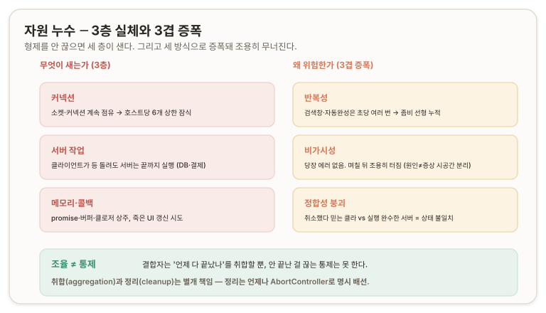

"단순히 취소 안 함"을 넘어 "위험"인 이유는 세 방식으로 증폭되기 때문이다.

**반복성:** 검색창·자동완성·필터는 요청이 초당 여러 번 반복되므로, 한 번의 누수는 사소해도 cancel-previous 없이 매 입력마다 좀비가 쌓이면 선형으로 누적된다.

**비가시성:** 자원 누수는 당장 에러를 안 뿜는다. 화면은 멀쩡히 동작하고 기능도 되는 것처럼 보이는데, 뒤에서 커넥션이 조금씩 새고 메모리가 조금씩 차올라, 몇 시간 뒤·며칠 뒤 갑자기 "왜 앱이 느려지지" 하고 터진다. 원인과 증상이 시공간적으로 멀리 떨어져 있어 디버깅이 지옥이다.

**정합성 붕괴:** 서버 실행 문제는 "취소했다고 믿는 클라이언트"와 "실행을 완수한 서버" 사이의 상태 불일치를 낳아, 자원 낭비를 넘어 데이터 정합성(consistency)을 깬다. 돈이 걸린 도메인에선 치명적이다.

> 진단 질문 (토픽 6) ─ 오답과 해설
>
>> **Answer.** <br/>
>> 패킷이 이미 브라우저에 도달했고, DevTools로 Response를 읽을 수 있어 보안상 나쁘다.
>
>> **Review.** <br/>
>> "뭔가 위험하다"는 방향은 살아 있었는데, 진짜 급소(자원 누수의 실체)를 못 짚었고 DevTools 얘기엔 오개념이 껴 있어. DevTools로 응답이 보이는 건 이 상황의 고유 문제가 아니야 — 네가 정상적으로 성공한 요청도, 취소한 요청도, 모든 네트워크 응답은 DevTools Network 탭에 다 찍혀. 그게 개발자 도구의 존재 이유고, 브라우저 상시 조건이야. 게다가 DevTools를 여는 건 그 브라우저 주인 본인이라, 자기가 자기 요청 응답을 보는 거니 유출(leak)이라 할 게 없어.
>>
>> 안 끊긴 요청에 진짜 보안·위험 각도가 있다면 "DevTools에 보인다"가 아니라 **"불필요한 요청이 서버에 계속 도달해 공격 표면·부하를 늘린다"**거나 **"취소했어야 할 민감 작업(결제·주문)이 실제로 서버에서 실행 완료된다"** 쪽이야. 위험의 무게중심은 클라이언트가 응답을 읽느냐가 아니라 **서버가 그 작업을 끝까지 실행하느냐**에 있어. 보안 각도를 스스로 떠올린 건 좋았어 — 근데 "위험"을 물으면 화려한 시나리오보다 제일 흔하고 무거운 것(자원 누수·서버 실행)부터 짚는 훈련을 해.

---

## 14. 조율 ≠ 통제 ─ 결합자로 묶고 컨트롤러로 끊는다

이 축의 모든 도구가 공유하는 맹점이 있다. `Promise.all`·`race`·`any`, 동시성 제한기, cancel-previous — 이것들은 전부 "여러 비동기를 어떻게 관찰하고 취합하느냐"의 도구이지만, 어느 것도 자동으로 생명주기를 정리해주지 않는다. `Promise.all`이 fail-fast로 끝나도 형제를 안 죽이고, 제한기가 대기줄을 비워도 진행 중인 걸 안 끊고, race가 타임아웃돼도 원본이 계속 돈다. **취합(aggregation)과 정리(cleanup)는 별개의 책임**이고, 후자는 언제나 `AbortController`로 명시적으로 배선해야 한다.

축2는 `dispatchEvent`가 불리언을 반환하는 자리에서 **통보(notification) ≠ 조율(coordination)** 을 세웠다. 이벤트를 흘려보내 무슨 일이 일어났는지 알릴 수는 있어도, 그 이벤트에 붙은 N개의 비동기를 언제 모을지는 결정하지 못한다는 경계였다. 이 축은 결합자로 그 빈자리를 메운 뒤, 한 층 더 내려가 **조율(coordination) ≠ 통제(control)** 를 세운다. 결합자는 "언제 다 끝났나"를 조율하지만, "안 끝난 걸 실제로 끊는" 통제는 못 한다. 조율은 관찰의 언어이고, 통제는 생명주기의 언어다.

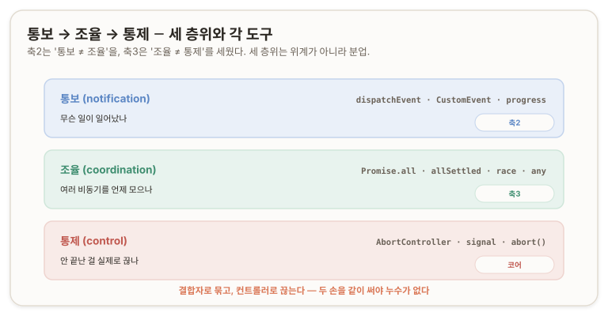

세 층위는 위계가 아니라 분업이다. **통보**는 *`dispatchEvent`·`CustomEvent`로 "<u>무슨 일이 일어났나</u>"를 알리고([EventTarget](./02-event-target.md)),* **조율**은 *`Promise.all`·`race`·`any`로 "<u>여러 비동기를 언제 모으나</u>"를 결정하며([합성·동시성](./03-composition-concurrency.md)),* **통제**는 *`AbortController`·`signal`로 "<u>안 끝난 걸 실제로 끊나</u>"를 담당한다([AbortController](./00-core.md)).* 이 셋은 서로를 대체하지 않고 각자의 자리에서 협력한다. 결합자로 여러 비동기를 묶고, 컨트롤러로 안 끝난 것을 끊는다 — 이 두 손을 항상 같이 써야 자원 누수가 없다.

이 문서의 결론은 그래서 하나의 문장으로 압축된다. 통보가 조율이 아니듯, 조율 또한 통제가 아니다.

결합자는 묶는 도구이지 끊는 도구가 아니며, 끊는 일은 처음부터 끝까지 `AbortController`의 몫이다. 그 둘을 가르는 눈 — 무엇을 결합자에 맡기고 무엇을 컨트롤러에 맡길지 아는 것 — 이 이 축이 남기는 판단 기준이다.

---

## 부록 A ─ 핵심 어휘

이 축에서 처음 나오거나 정밀하게 다시 규정한 용어를 모은다.

**결합자(combinator)** — 여러 Promise를 입력받아 하나의 새 Promise를 반환하는 정적 메서드. `all`·`allSettled`·`race`·`any` 넷. 입력 Promise를 실행하는 것이 아니라 이미 도는 것들을 관찰·취합한다.

**즉시 평가(eager evaluation)** — Promise가 생성되는 순간 그 안의 비동기 작업이 이미 발화하는 성질. `fetch(url)`을 쓰는 순간 요청이 나간다. 지연 실행(lazy)과 반대.

**정착(settle)** — Promise가 pending에서 벗어나 최종 상태(fulfilled 또는 rejected)로 굳는 것. `allSettled`는 전원이 정착할 때까지 기다리며, reject도 정착의 한 형태로 본다.

**조기 실패·단락(fail-fast, short-circuit)** — `all`이 첫 reject 순간 나머지를 안 기다리고 즉시 reject하는 동작.

**동시성(concurrency)** vs **병렬성(parallelism)** — 동시성은 하나의 스레드가 여러 작업 사이를 오가는 인터리빙, 병렬성은 여럿이 물리적으로 동시에 도는 것. JavaScript의 "동시 실행"은 전자다.

**동시성 제한·세마포어·작업 풀(concurrency limit, semaphore, worker pool)** — 동시 실행 작업 수를 N으로 고정하고, 하나가 끝나면 즉시 다음을 밀어 넣어 슬롯을 재활용하는 패턴.

**성크(thunk)** — 실행을 나중으로 미루려고 함수로 감싼 지연된 계산. `() => fetch(url)`. 누가 부르기 전엔 발화하지 않는다.

**Deferred(디퍼드)** — Promise의 생성과 결말(resolve/reject)을 분리하는 패턴. 표준형은 `Promise.withResolvers()`. "promise는 지금 반환, resolve는 나중에".

**펌프(pump)** — 제한기에서 "빈 슬롯이 있으면 대기줄에서 꺼내 실행"을 담당하는 함수. 작업 완료 시(`finally`)와 새 작업 등록 시 두 곳에서 불려 순환한다.

**콜 스택·마이크로태스크 큐·매크로태스크 큐(call stack, microtask queue, macrotask queue)** — JavaScript 실행의 세 판. 스택은 동기 코드, 마이크로 큐는 `.then`·`await`·`queueMicrotask`, 매크로 큐는 `setTimeout`·I/O·이벤트 콜백.

**큐잉 트리거(queuing trigger)** — `resolve()`의 정체. `.then` 콜백을 실행하는 것이 아니라 마이크로태스크 큐에 넣기만 한다.

**실행-완료(run-to-completion)** — 태스크 하나는 시작하면 끝까지 안 끊기고 완주하며, 이벤트 루프는 태스크 경계에서만 개입한다는 원칙.

**소유(ownership)** — 자원을 실제로 정리할 권한. race는 진 쪽을 관찰만 해 소유하지 않으므로 못 끊고(버릴 뿐), `AbortSignal.timeout()`은 타이머를 소유해 완료 시 정리한다.

**팬아웃(fan-out)** — 공유 signal 하나를 abort하면 그것을 문 모든 작업이 일제히 끊기는 것. 형제 취소와 제한기 전체 취소의 공통 구조.

**처리 안 된 거부(unhandled rejection)** — reject됐는데 받아줄 `.catch`도 관찰자도 없는 promise. 브라우저는 `unhandledrejection` 이벤트로 감지한다.

---

## 부록 B ─ API 빠른 참조

이 축에서 쓴 표준 API의 요지를 코드로 모은다. 세부는 각 절과 MDN 링크 참조.

```js
// ── 결합자 넷 ──────────────────────────────────────────────────────────
Promise.all([p1, p2, p3]);        // 전원 성공 → [v1,v2,v3]. 첫 reject에 short-circuit.
Promise.allSettled([p1, p2, p3]); // 전원 정착 대기. never reject.
                                  // → [{status:'fulfilled',value}, {status:'rejected',reason}, ...]
Promise.race([p1, p2, p3]);       // 첫 settle(성공이든 실패든)의 결과 복사.
Promise.any([p1, p2, p3]);        // 첫 fulfill 채택. 전멸 시 AggregateError(.errors 배열).

// ── Deferred: promise 생성과 결말 분리 ────────────────────────────────
const { promise, resolve, reject } = Promise.withResolvers();
// promise는 지금 반환, resolve/reject는 나중에 바깥에서 호출.
// (표준화 전 관용: let resolve; const p = new Promise(r => { resolve = r; }); )

// ── 마이크로태스크 직접 큐잉 ──────────────────────────────────────────
queueMicrotask(() => { /* 동기보다 늦고 setTimeout보다 이르게 */ });
// Promise.resolve().then(fn)과 타이밍 동일. promise 객체 우회 없이 의도를 직접 표현.

// ── 취소: 시간 / 합성 / 수동 ──────────────────────────────────────────
AbortSignal.timeout(5000);        // 5초 뒤 자동 abort되는 signal. 끊기면 TimeoutError.
AbortSignal.any([sigA, sigB]);    // 여러 signal을 OR 합성. 먼저 터진 쪽 사유가 전파.
const ctrl = new AbortController();// 수동 취소. ctrl.signal을 fetch에 주입, ctrl.abort()로 끊음.
ctrl.abort(reason);               // 멱등적. reason은 signal.reason으로 조회(기본 AbortError).

// ── 취소 판별: 항상 err.name (instanceof 금지) ────────────────────────
try { await fetch(url, { signal }); }
catch (err) {
  if (err.name === 'AbortError')   return;  // 사용자·형제 취소
  if (err.name === 'TimeoutError') return;  // 시간 초과 (AbortSignal.timeout)
  throw err;                                // 진짜 에러
}
```

---

## 개인 노트

**손때 검증 대기.** 아래는 글로만 정리한 것이라 직접 돌려봐야 체화된다.

- 이벤트 루프 순서 실측 — 09·10절의 `A → F → E → B → C → D` 추적 코드를 실제로 콘솔에 찍어 순서 확인. 중첩 `setTimeout`·`.then`을 한 단계씩 늘려가며 예측과 대조.
- 제한기 부하 테스트 — `createLimiter(5)`로 1,000개 fetch를 돌리며 개발자 도구 Network 탭에서 동시 요청이 정말 5개로 유지되는지, `cancelAll` 시 진행 중 5개가 `AbortError`로 끊기고 대기 중이 조용히 사라지는지 관측.
- race 타이머 좀비 관측 — `race([빠른작업, 5초타임아웃])`에서 빠른 작업이 이긴 뒤에도 5초 뒤 콘솔에 `unhandledrejection` 경고가 뜨는지, `AbortSignal.timeout()`으로 바꾸면 그 경고가 사라지는지 확인.
- 마이크로태스크 기아(starvation) — 마이크로태스크가 끝없이 자기 자신을 큐에 넣으면(`function loop() { queueMicrotask(loop); }`) 렌더링·`setTimeout`이 영영 굶는지 실험. 매크로태스크는 마이크로가 다 비어야 도니까.

**미완 심화 (축4 예고와 연결).**

- `await`의 정체 — 10절에서 "`await` 뒤 코드는 `.then` 마이크로태스크"라고 씨앗만 심었다. `async` 함수가 `await`에서 어떻게 중단·재개되는지(상태 기계로 컴파일되는지)는 축4의 바닥.
- 순서 보장(ordering) — 여러 요청을 동시에 쏘되 결과를 요청 순서대로 정렬해 처리하는 것(예: 스트리밍 응답을 순서대로 렌더)은 결합자로 안 풀리는 새 영역. 축4의 async 이터레이터에서 다룬다.
- 소유권의 재등장 — "소유하는 자만 정리한다"(12절)가 축4의 `ReadableStream` 취소·`locked`·`cancel()`에서 스트림 소유권 문제로 다시 나온다.

**자기 점검 — 진단 질문 ↔ 절 매핑.** Q1·Q2 → 02·03절(결합자). Q3·Q4 → 04·05절(취소 결합). Q5·Q6·Q7 → 06·07절(제한기). Q8 → 08절(cancel-previous). Q9 → 09·10절(이벤트 루프). Q10 → 12절(race 누수). 매듭 B 진단 → 11절(제한기 취소). 토픽 6 진단 → 13절(자원 누수).

---

## 다음 축

**축4 ─ 스트림 취소 (Stream Cancellation).** async 이터레이터·제너레이터, Web Streams(`ReadableStream`·`WritableStream`), 백프레셔(backpressure), fetch 본문 스트리밍. 이 축에서 깔고 선 바닥 — 이벤트 루프, `resolve`의 큐잉, `await`의 정체, 소유권 — 위에 스트림의 취소와 순서 보장을 쌓는다. "조각조각 흘러 들어오는 것을 어떻게 취소하고 순서 지키나"는 결합자로 안 풀리는 다음 영역이다.
