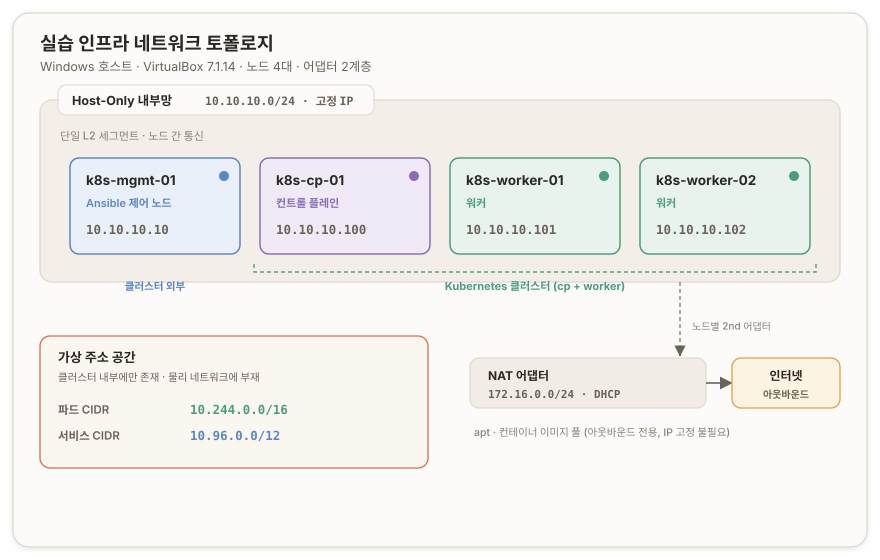

# Phase 0 ─ 기반 설계 (Substrate)

## 개요 {#overview}

이 시리즈는 kubeadm으로 세운 린(lean) 클러스터를 허브로 삼아 컨트롤 플레인(Control Plane)의 해부학을 손으로 익힌다. 클러스터를 세우는 작업은 Phase 1이지만, 그 앞에 클러스터가 딛고 설 물리·네트워크·스토리지 바닥이 먼저 있어야 한다. 이 바닥을 별도 Phase로 떼어 Phase 0으로 문서화한다.

분리의 이유는 관심사에 있다. Phase 1이 다룰 것은 kube-apiserver, etcd, kube-controller-manager, kube-scheduler, kubelet의 상호작용과 kubeadm의 부트스트랩이다. 반면 노드에 RAM을 얼마나 줄지, IP 대역을 어떻게 가를지, etcd 디스크를 어디에 둘지는 클러스터 소프트웨어의 문제가 아니라 그 아래 인프라의 문제다. 이 둘을 한 문서에 섞으면 Phase 1이 비대해지고, 나중에 "이 랩이 어떤 하드웨어·네트워크 위에 서 있는가"를 되찾을 단일 참조점이 사라진다. Phase 0은 그 참조점이다.

시리즈의 허브는 선언적 상태(declarative desired state)와 조정 루프(reconciliation loop)다. 사용자가 원하는 상태를 선언하면 컨트롤러가 실제 상태와의 차이를 끊임없이 조정하고, kubelet과 CNI(Container Network Interface)와 CSI(Container Storage Interface)가 노드에서 실행한다. 이 루프의 실행 층이 서려면 물리 노드, 노드 간 네트워크, etcd가 쓸 디스크가 준비돼 있어야 한다. Phase 0은 그 실행 층의 하부를 짓는다.

> 이 시리즈의 공통 자세: 정답을 외우지 않고 기준을 세운다. 숫자 하나를 고를 때도 "왜 이 숫자인가"를 원리로 답할 수 있어야 한다.

---

## 진단 질문 {#diagnostic-questions}

> **질문 1.**<br/>
> 15.8GiB RAM / 4Core 노트북에 VM 3대(CP 1 + worker 2)를 올려야 한다. 호스트 OS도 살아 있어야 하고, VirtualBox 오버헤드도 있다. CP 노드는 etcd와 apiserver를 이고 있어서 worker보다 무겁다. 이 3대에 RAM을 어떻게 쪼갤 것인가. 숫자만이 아니라 ①CP를 worker보다 크게 주는 이유를 컴포넌트 관점에서, ②호스트에 얼마를 남겨야 안전한지, ③이 배분이 나중에 워크로드를 얹었을 때 어디서 먼저 터질지(어느 노드가 병목일지)까지 근거를 붙여서.

<none/>

> **질문 2.**<br/>
> VM 3대와 호스트를 Host-Only 어댑터로 묶어야 한다. ①Host-Only 네트워크의 서브넷을 무엇으로 잡고 각 노드에 어떤 IP를 줄 것인지, ②그 IP가 재부팅해도 안 바뀌게 어떻게 보장할 것인지, ③파드 CIDR(Pod CIDR)·서비스 CIDR을 노드 IP 대역과 겹치지 않게 어떻게 분리할 것인지. 세 번째는 겹치면 안 되는 이유까지 논리를 세워서.

<none/>

> **질문 3.**<br/>
> 각 VM에 가상 디스크를 붙일 때, CP 노드의 디스크에만 특별히 신경 써야 하는 이유가 있다. 어느 컴포넌트가, 왜 디스크에 예민한지, 그리고 그것이 성능 병목이 되면 클러스터에 무슨 증상으로 나타나는지.

<none/>

> **질문 4.**<br/>
> "containerd를 설치한다"는 스텝을 생각해 보자. 쉘 스크립트로 `apt install`은 두 번 돌려도 무방하지만, `echo … >> config.toml` 같은 append는 두 번 돌리면 줄이 두 번 박혀 설정이 깨진다.
> (a) 같은 스크립트를 두 번 돌렸을 때 첫 번째와 결과가 달라지는 것이 왜 위험한지, 재현성(reproducibility) 관점에서. 노드가 3개라는 것을 염두에 두고.
> (b) Ansible은 이것을 어떻게 다르게 접근할 것 같은가. (힌트: Ansible의 태스크는 "이 명령을 실행해라"가 아니라 "이 상태가 되게 해라"로 쓰인다.)
> (c) 이 "명령을 실행해라 → 상태를 선언해라"의 전환은 이 시리즈의 허브(조정 루프)와 어떻게 같은 철학인가.

<none/>

---

## 실습 인프라 환경 정보 {#infra-reference}

이 절은 이 랩의 단일 참조점이다. 이후 모든 Phase가 여기의 호스트명·IP·디스크 배치를 그대로 물려 쓴다.



### 호스트 환경 {#host-environment}

| 항목 | 값 |
| --- | --- |
| 하드웨어 | 15.8 GiB RAM · 4 Core |
| 호스트 OS | Windows |
| 하이퍼바이저 | Oracle VirtualBox 7.1.14 r170994 |
| 게스트 OS | Debian 13 (Trixie) · 커널 6.12 LTS · `cat /etc/debian_version` = `<설치 후 확인>` |
| Kubernetes | v1.35 (kubeadm) · Phase 1에서 설치 |
| 컨테이너 런타임 | containerd 2.0+ · Phase 1에서 설치 |
| IaC 도구 | Ansible · 제어 노드 `k8s-mgmt-01` |

Debian 13(Trixie)은 2025년 8월 릴리스본이며 커널 6.12 LTS와 cgroup v2(control group v2)를 기본으로 쓴다([Debian trixie 릴리스 정보](https://www.debian.org/releases/trixie/)). cgroup v2 기본은 v1.35와 containerd 2.0이 요구하는 조건과 맞아떨어진다. 게스트 설치 후 실제 점 릴리스 버전은 `cat /etc/debian_version`으로 확인해 위 표의 자리값을 채운다. Trixie는 `/etc/sysctl.conf`를 더 이상 존중하지 않고 `/tmp`를 tmpfs에 두므로, Phase 1의 sysctl 설정은 `/etc/sysctl.d/` 드롭인(drop-in) 파일로 넣어야 한다([Debian 13 릴리스 노트 §5.1](https://www.debian.org/releases/stable/release-notes/)).

### 노드 구성 {#node-inventory}

| 호스트명 | VirtualBox VM 이름 | 역할 | vCPU | RAM | 디스크 | 프로비저닝 |
| --- | --- | --- | --- | --- | --- | --- |
| `k8s-mgmt-01` | `k8s-mgmt-01` | Ansible 제어 노드 | 1 | 1 GiB | 20 GB 동적 (베이스 복제) | Phase 1 |
| `k8s-cp-01` | `k8s-cp-01` | 컨트롤 플레인 | 2 | 4 GiB | 20 GB 동적 + 8 GB 고정 (etcd 전용) | Phase 1 |
| `k8s-worker-01` | `k8s-worker-01` | 워커 | 2 | 2 GiB | 20 GB 동적 | Phase 1 |
| `k8s-worker-02` | `k8s-worker-02` | 워커 | 2 | 2 GiB | 20 GB 동적 | Phase 1 |

VM 이름과 호스트명과 인벤토리 이름을 하나로 맞춘다. 셋이 어긋나면 SSH로 노드를 오갈 때 지금 어디에 있는지 혼동이 생긴다. 총 RAM 예산은 클러스터 3대에 8 GiB, 제어 노드에 1 GiB, 합 9 GiB이며, 나머지 약 6.8 GiB를 Windows 호스트와 VirtualBox 오버헤드에 남긴다. 베이스 VM 한 대는 지금 준비하고, cp·worker·mgmt로의 복제와 분화는 Phase 1에서 한다.

### 네트워크 배정 {#network-assignment}

| 호스트명 | Host-Only IP (`10.10.10.0/24`) | NAT (`172.16.0.0/24`) | 어댑터 |
| --- | --- | --- | --- |
| `k8s-mgmt-01` | `10.10.10.10` | DHCP | Host-Only(고정) + NAT(외부) |
| `k8s-cp-01` | `10.10.10.100` | DHCP | Host-Only(고정) + NAT(외부) |
| `k8s-worker-01` | `10.10.10.101` | DHCP | Host-Only(고정) + NAT(외부) |
| `k8s-worker-02` | `10.10.10.102` | DHCP | Host-Only(고정) + NAT(외부) |

주소 공간은 용도별로 세 블록을 겹치지 않게 갈랐다.

| 용도 | 대역 | 성격 |
| --- | --- | --- |
| 노드 내부망 (Host-Only) | `10.10.10.0/24` | 노드 간 통신, 고정 IP |
| 파드 CIDR (클러스터 가상) | `10.244.0.0/16` | Cilium이 관리, 물리망 부재 |
| 서비스 CIDR (클러스터 가상) | `10.96.0.0/12` | kube-proxy 대체 로직이 사용, 물리망 부재 |
| NAT (외부 아웃바운드) | `172.16.0.0/24` | `apt`·이미지 풀 전용 |

`k8s-mgmt-01`은 IP만 예약해 두고 실제 생성은 Phase 1에서 한다. 이 노드는 Ansible 제어 노드이며 Kubernetes 클러스터의 구성원이 아니다.

### 스토리지 배치 {#storage-layout}

| 노드 | 디스크 | 타입 | 크기 | 근거 |
| --- | --- | --- | --- | --- |
| 전 노드 | OS 루트 | 동적 할당 | 20 GB | 공간 절약, OS·컨테이너 이미지·로그 |
| `k8s-cp-01`만 | etcd 전용 (2번 디스크) | 고정(fixed) | 8 GB | fsync 레이턴시 안정화 + OS I/O 경합 격리 |

CP의 etcd 전용 디스크는 베이스 VM에 넣지 않고, cp 복제 후 별도로 추가한다. 이 디스크를 etcd 데이터 경로로 마운트하는 작업은 Phase 1에서 한다.

---

## A부 ─ 물리 기반 자원 {#part-a-physical-substrate}

## 01. 노드 사이징 {#node-sizing}

노드에 자원을 배분하는 결정은 세 개념 위에 선다. 노드가 광고하는 용량과 실제로 파드가 쓸 수 있는 양의 차이, 자원의 압축 가능 여부, 그리고 한 노드가 죽었을 때의 파급 범위다.

먼저 용량 회계다. "2 GiB 워커"가 파드에게 2 GiB를 주는 것이 아니다. 노드의 할당 가능량(Allocatable)은 전체 용량(Capacity)에서 kubelet 예약(kube-reserved), 시스템 예약(system-reserved), 축출 임계치(eviction threshold)를 뺀 값이다([Reserve Compute Resources](https://kubernetes.io/docs/tasks/administer-cluster/reserve-compute-resources/)). 문제는 kubeadm 기본 설치가 kube-reserved와 system-reserved를 설정하지 않는다는 데 있다. 그래서 기본 Allocatable은 축출 임계치만 뺀 값이 되는데, 실제로는 OS와 kubelet과 containerd와 CNI 데몬이 이미 수백 MiB를 쓰고 있다. 스케줄러는 예약되지 않은 이 발자국을 모른 채 Allocatable만큼 파드 요청을 받아들이고, 결과적으로 물리 RAM이 시스템과 파드의 합을 담지 못해 노드가 메모리 압박에 빠진다. 작은 노드일수록 예약되지 않은 데몬 발자국이 전체에서 큰 비중을 차지하므로 이 함정이 더 치명적이다. 그래서 Phase 1의 워커 kubelet에는 `system-reserved`를 걸어 Allocatable이 현실을 반영하게 만든다.

다음은 자원의 성격이다. CPU는 압축 가능 자원(compressible resource)이다. 경합하면 스케줄러가 시간을 쪼개 나눠줄(throttle) 뿐 프로세스가 죽지 않는다. 반면 메모리는 비압축 자원(incompressible resource)이라 제한을 넘으면 곧바로 OOMKill(Out Of Memory Kill)로 하드 실패한다([Resource Management for Pods](https://kubernetes.io/docs/concepts/configuration/manage-resources-containers/)). 4 논리 코어에 노드별 2 vCPU씩, 합 6 vCPU를 얹는 오버커밋(overcommit)이 안전한 것은 CPU가 압축 가능해서다. 메모리는 오버커밋을 피해야 하며, 총 배분이 물리 RAM을 넘으면 호스트가 페이지파일로 페이징하며 랩 전체가 느려진다.

세 번째는 파급 범위(blast radius)다. 워커 하나가 OOM이면 그 워커의 파드만 잃고, 파드는 격리되며 다른 노드로 재스케줄된다. 그러나 CP가 OOM이면 컨트롤 플레인 전체를 잃는다. `kubectl`도 먹지 않고 진단도 복구도 어렵다. 이 랩은 단일 CP라 고가용성(High Availability)이 없으므로 CP 상실은 머리 없는 몸통을 남긴다. 여유 마진을 쓸 곳은 파급 범위가 큰 CP다. CP에 4 GiB를 주는 결정은 이 근거로 정당하다.

kubeadm은 컨트롤 플레인 노드에 최소 2 CPU를 요구한다([kubeadm 설치 사전 요구사항](https://kubernetes.io/docs/setup/production-environment/tools/kubeadm/install-kubeadm/)). 노드별 2 vCPU 배분은 이 하한을 충족한다.

> 진단 질문 1 ─ 오답과 해설
>
>> **Answer.** <br/>
>> Windows RAM의 절반인 8 GiB를 할당한다. CP에 4 GiB, 각 워커에 2 GiB, CPU는 세 노드 모두 2 코어. ①CP는 static Pod가 항시 돌고 Cilium을 설치하면 메인 라우팅을 담당할 서비스가 살아 있어야 하니까 크게 준다. ②절반은 남겨 두고, Phase를 진행하다 워커의 할 일이 많아지면 1번 워커부터 순차적으로 RAM을 4 GiB로 늘린다. ③워크로드의 동시 리소스 할당량이 넘칠 때, 해당 파드들이 몰린 워커 노드부터 문제가 될 것 같다.
>
>> **Review.** <br/>
>> 결론은 맞아. CP를 크게, 호스트를 안 넘김. 근데 근거 하나가 틀렸어. Cilium은 데몬셋(DaemonSet)이라 `cilium-agent`가 모든 노드에 한 개씩 떠. 데이터 플레인 라우팅(eBPF)은 각 노드에서 로컬로 일어나고, `kubeProxyReplacement=true`면 서비스 로드밸런싱도 각 노드가 처리해. CP는 라우팅 허브가 아니야. CP가 무거운 진짜 이유는 etcd와 kube-apiserver, 그리고 무엇보다 폭발 반경이야. worker OOM은 격리되지만 CP OOM은 클러스터 전체를 날려. "절반"은 원칙이 아니라 어림짐작이었고, 진짜 원칙은 메모리가 비압축 자원이라 오버커밋이 불가능하다는 것. 숫자로 접근하지 말고 원리로 접근해. 그리고 병목은 워커만이 아니야. 호스트 aggregate가 물리 RAM을 넘으면 Windows가 디스크로 페이징하면서 CP까지 흔들려. 그게 더 나빠. ([Cilium 컴포넌트 개요](https://docs.cilium.io/en/stable/overview/component-overview/))

## 02. 네트워크 설계 {#network-design}

네트워크 설계는 두 가지를 고정한다. 노드가 재부팅해도 바뀌지 않는 주소, 그리고 물리 대역과 클러스터 가상 대역의 분리다.

노드 IP는 고정이어야 한다. kubeadm으로 세운 클러스터에서 노드 IP는 불변에 가까운 계약이다. IP가 재부팅으로 바뀌면 kubelet이 API 서버에 등록한 주소, 인증서(certificate)의 SAN(Subject Alternative Name), etcd peer URL, kubeconfig의 server 주소가 모두 어긋나 클러스터가 조용히 깨진다. 그래서 DHCP(Dynamic Host Configuration Protocol)를 끄고 Host-Only 어댑터에 고정 IP를 수동으로 준다. 외부 인터넷 아웃바운드는 별도 NAT(Network Address Translation) 어댑터가 맡으며, 이쪽은 `apt`와 이미지 풀만 하면 되므로 IP 고정이 필요 없고 DHCP로 받아도 무방하다.

서브넷 마스크와 의도를 일치시켜야 한다. `10.10.10.0/24`는 3옥텟이 네트워크 식별자이고 4옥텟이 호스트 부분이므로, 노드는 4옥텟으로 구분한다(`.100`, `.101`, `.102`, 제어 노드 `.10`). 역할(plane) 구분을 IP로 하려면 서브넷 자체를 갈라야 하는데, VirtualBox Host-Only는 통상 단일 L2 세그먼트라 서브넷을 둘로 쪼개면 불필요한 라우팅이 생긴다. 3노드 랩에서는 단일 `/24`가 맞고, 역할 구분은 IP가 아니라 노드 레이블(label)과 테인트(taint)로 한다.

가장 위험한 지점은 클러스터 가상 대역과 물리 대역의 충돌이다. 파드 CIDR과 서비스 CIDR은 물리 네트워크에 존재하지 않는 클러스터 내부 가상 주소 공간이다. Cilium은 파드 IP를, kube-proxy 대체 로직은 서비스 IP를 이 대역으로 보고 "이 목적지는 클러스터 내부이므로 eBPF로 처리한다"고 판단한다. 이 가상 대역이 노드가 실제로 쓰는 물리 대역과 같은 상위 블록에 얹히면 라우팅 결정이 모호해진다. 어떤 목적지가 물리망의 실제 호스트인지 클러스터 내부 파드인지 커널과 CNI가 헷갈리고, 명확한 에러가 아니라 "가끔 되고 가끔 안 되는" 간헐적 통신 실패로 나타나 디버깅이 어려워진다. 그래서 노드망 `10.10.10.0/24`와 완전히 다른 대역에서 파드 `10.244.0.0/16`, 서비스 `10.96.0.0/12`를 고른다. 이 두 값은 생태계 관례이기도 하다. `10.96.0.0/12`는 kubeadm의 서비스 CIDR 기본값이고([kubeadm init 레퍼런스](https://kubernetes.io/docs/reference/setup-tools/kubeadm/kubeadm-init/)), `10.244.0.0/16`은 파드 대역으로 널리 쓰인다. NAT 대역도 같은 원리로 `10.x`를 피해 `172.16.0.0/24`(RFC 1918 사설 블록)로 잡아, 주소 접두사만 봐도 내부망·클러스터·외부 경로가 갈리게 한다([RFC 1918](https://datatracker.ietf.org/doc/html/rfc1918)).

> 진단 질문 2 ─ 오답과 해설
>
>> **Answer.** <br/>
>> `10.10.10.x` 대역, 서브넷 `/16`. 세 번째 옥텟으로 컨트롤 플레인과 워커를 구분(cp 10, worker 20), 네 번째 옥텟으로 각 노드를 구분(1번 100, 2번 200). CP는 `10.10.10.100`, 워커는 `10.10.20.100`·`10.10.20.200`. DHCP는 끄고 IPv4만 허용하며 Host-Only IP를 수동 지정하고, 외부 연결용 NAT 어댑터를 붙인다. 파드 CIDR은 `10.10.30.x`, 서비스 CIDR은 `10.10.40.x`로 옥텟을 갈라 분리한다.
>
>> **Review.** <br/>
>> 옥텟으로 역할을 가르는 발상 자체는 확장 가능해서 좋아. 근데 두 개가 어긋났어. 첫째, `/16`과 "`10.10.10.x` 대역"이 모순이야. `/16`이면 3옥텟도 호스트 비트라 `10.10.10.100`과 `10.10.20.100`이 같은 서브넷 안 두 호스트일 뿐, 다른 대역이 아니야. 단일 L2 랩엔 `/24`가 맞고 plane 구분은 레이블·테인트로 해. 둘째, 이게 더 위험한데, Pod/Service CIDR을 노드와 같은 `10.10.x`대에 두면 라우팅이 모호해져서 간헐적 통신 실패가 나. 노드망과 완전히 다른 대역으로 분리해. `10.244.0.0/16`, `10.96.0.0/12`. 대역은 우연히 안 겹치길 바라는 게 아니라 처음부터 겹칠 수 없게 블록을 가르는 거야.

## 03. 스토리지 설계 {#storage-design}

CP 디스크에 신경 써야 하는 이유는 etcd 한 컴포넌트에 있다. etcd는 분산 키-값 저장소(distributed key-value store)이며 클러스터 상태의 단일 진실 공급원(source of truth)이다. 이 저장소가 디스크에 예민한 까닭은 일관성을 지키는 방식에 있다.

etcd는 Raft라는 합의 알고리즘(consensus algorithm)으로 돈다. Raft의 규칙은, 어떤 변경을 "커밋됐다"고 선언하려면 그 변경이 로그로 디스크에 영구 기록(fsync)된 뒤 과반수 노드가 그것을 확인해야 한다는 것이다. fsync를 기다리는 이유는, 메모리에는 썼지만 디스크에는 아직인 상태에서 노드가 죽으면 그 데이터가 증발해 단일 진실 공급원이 거짓말을 하기 때문이다. etcd는 거짓말하지 않으려고 매 쓰기마다 디스크가 확정 응답을 줄 때까지 기다린다. 따라서 etcd의 쓰기 지연은 디스크 fsync 지연에 직결한다. SSD의 fsync는 빠르고, 여러 VM이 하나의 물리 디스크를 나눠 쓰며 경합하는 상황의 fsync는 느리다.

이 지연이 무서운 이유는 apiserver가 etcd에 전적으로 의존하기 때문이다. apiserver는 자기 상태를 갖지 않고 전부 etcd에 읽고 쓴다. 파드 하나를 조회하면 apiserver가 etcd를 읽고, 파드 하나를 생성하면 apiserver가 etcd에 쓰며 fsync를 기다린다. etcd가 디스크 때문에 느려지면 apiserver의 모든 요청이 느려지고 클러스터의 모든 조작이 느려진다. apiserver는 상태가 없어 수평 확장(scale horizontally)이 가능하지만, 여러 apiserver가 모두 같은 etcd를 바라보므로 확장의 천장은 apiserver가 아니라 etcd에 있다. 대규모 운영에서 etcd를 CP에서 떼어 전용 고속 디스크 노드에 두는 이유가 여기 있다. 이 랩은 학습용이라 내장(stacked) 구성으로 가되, CP 디스크만은 레이턴시를 우선한다.

디스크 성능이 무너지면 나타나는 증상은 구체적이다. etcd가 시간 내에 합의를 못 이뤄 `etcdserver: request timed out`을 반환하고 `kubectl` 명령이 간헐적으로 멈춘다. Raft 리더가 느린 디스크로 하트비트(heartbeat)를 제때 못 보내면 팔로워가 재선출을 시작하고, 디스크가 계속 느리면 이 리더 선출이 반복되며(flapping) 클러스터가 주기적으로 얼었다 녹는다. apiserver 지연으로 kubelet의 상태 업데이트가 밀려 노드가 NotReady로 깜빡이기도 한다. 진단은 etcd 메트릭으로 한다. WAL(Write-Ahead Log) fsync 소요 `etcd_disk_wal_fsync_duration_seconds`와 백엔드 커밋 소요 `etcd_disk_backend_commit_duration_seconds`를 보며, 공식 권고 기준선은 WAL fsync p99가 10ms 이하, 백엔드 커밋 p99가 25ms 이하다([etcd 하드웨어 권고](https://etcd.io/docs/latest/op-guide/hardware/)). 이 값의 실측은 Phase 8(관측성)에서 Prometheus로 뽑는다.

디스크 타입 선택은 이 특성에서 나온다. 동적 할당(dynamically allocated) 디스크는 게스트가 새 블록에 처음 쓸 때마다 호스트가 파일을 그 순간 확장하므로, 쓰기 경로에 블록 할당 작업이 끼어 fsync 레이턴시에 지터(jitter)가 생긴다. 고정(fixed) 디스크는 생성 시점에 전체 공간을 미리 할당해 이 확장이 없으므로 레이턴시가 일정하다([VirtualBox 가상 스토리지](https://www.virtualbox.org/manual/ch05.html)). etcd가 원하는 것은 빠른 것보다 일정한 레이턴시이므로 CP의 etcd 디스크는 고정으로 잡는다. 여기에 더해, etcd를 OS 루트와 물리적으로 다른 디스크에 두면 OS 로그·`apt`·이미지 풀이 폭주해도 etcd의 I/O 경로가 독립된다. 분리와 고정, 두 겹으로 CP 디스크를 보호한다. 이 방식은 프로덕션에서 etcd를 전용 디스크에 두는 표준 권고와 같다([etcd FAQ](https://etcd.io/docs/latest/faq/)).

베이스 VM은 공통분모인 OS 루트 한 장만 갖는다. CP만 필요한 etcd 디스크를 베이스에 넣으면 워커 2대도 쓰지 않을 디스크를 복제받아 낭비가 생긴다. 베이스는 최소 공통, 차이는 복제 후 추가한다. 이것이 골든 이미지(golden image) 패턴의 방식이다.

> 진단 질문 3 ─ 오답과 해설
>
>> **Answer.** <br/>
>> etcd가 디스크에 예민한 컴포넌트다. 그런데 왜 그런지, 증상이 어떤지는 잘 모르겠다. 작년에 K8s를 한 번 공부할 때 이런 부분들을 흘려넘겼던 것 같다.
>
>> **Review.** <br/>
>> etcd 지목한 건 맞아. "모르겠다"고 정직하게 자각한 게 오히려 중요해. 채워줄게. etcd는 매 쓰기마다 fsync로 디스크 확정을 기다려. Raft 합의가 "커밋됐다"고 선언하기 전에 로그를 영구 기록해야 하거든. 메모리엔 썼는데 디스크엔 아직인 상태에서 죽으면 단일 진실 공급원이 거짓말한 게 되니까. 그래서 fsync가 느리면 etcd 전체가 느려지고, apiserver는 상태를 전부 etcd에 의존하니 클러스터의 모든 조작이 느려져. 증상은 `etcdserver: request timed out`, 리더 선출 폭풍, 노드 NotReady 깜빡임, `kubectl` 굼뜸이야. 그래서 CP 디스크는 용량이 아니라 레이턴시가 중요하고, 고정 디스크로 분리해서 둬. "흘려넘겼다"는 게 작년 문서와 이번 문서의 차이야. 작년엔 목차를 모았고 지금은 인과를 세웠어.

---

## B부 ─ 재현 가능한 기반 {#part-b-reproducible-substrate}

## 04. 선언형 인프라 관리 {#declarative-iac}

세 노드에 같은 사전 준비를 반복해야 한다. 이 반복을 손으로 각 VM에 명령해 채우면, 작년의 재현 불가 눈송이(snowflake)가 재발한다. 그래서 이번에는 코드형 인프라(IaC, Infrastructure as Code)로 간다. 도구는 쉘 스크립트와 Ansible 두 갈래였고, 이 랩은 Ansible을 택했다.

선택의 논거는 학습 효과와 철학 정합성에 있다. 쉘 스크립트는 진입장벽이 없지만, 문법을 모르는 상태에서는 완성된 스크립트를 받아 실행만 하게 되어 배움이 남지 않는다. 더 근본적으로, Kubernetes의 정체성이 선언형인데 그 아래 노드 세팅만 명령형 눈송이로 두는 것은 철학이 어긋난다. 파드를 YAML로 선언하는 것과 노드를 선언형 명세로 관리하는 것은 같은 사고의 다른 층위다. IaC의 명세는 실행 도구이기 전에 "이 노드는 이런 상태여야 한다"는 명세서(spec)이며, 문제가 생겼을 때 이 명세가 기준점이 되어 원인 분석을 쉽게 한다([Ansible 기본 개념](https://docs.ansible.com/ansible/latest/getting_started/basic_concepts.html)).

Ansible 자체를 배우느라 K8s 진도가 막히면 주객이 전도되므로, 이 시리즈의 본질이 Kubernetes임을 잊지 않는다. Ansible은 노드 기반을 까는 도구로 쓰고, 그 위에 kubeadm으로 클러스터를 세운 뒤의 운영은 Kubernetes 조정 루프에 맡긴다. 두 도구가 바통을 주고받는 구조다. 이 분업의 근거는 아래 두 절에서 세운다.

## 05. 멱등성 {#idempotency}

멱등성(Idempotency)은 성공한 연산을 여러 번 실행해도 결과가 같은 속성이다. Ansible의 태스크는 "이 명령을 실행해라"가 아니라 "이 상태가 되게 해라"로 쓰인다. 예컨대 "설정 파일에 이 줄이 존재하는 상태"를 선언하면, Ansible은 실행 전에 먼저 확인해서 이미 있으면 아무것도 하지 않고 `ok`를 반환하고, 없으면 추가하고 `changed`를 반환한다. 두 번째 실행에서는 이미 있으므로 `ok`만 뜨고 파일을 건드리지 않는다. 쉘 스크립트에서 append로 줄을 박으면 두 번 실행 시 줄이 두 번 들어가지만, 이 방식은 중복이 원천적으로 불가능하다.

멱등성은 에러 핸들링(error handling)과 다른 층위다. 태스크가 실패하면 Ansible은 그 노드에서 즉시 멈추고 실패를 보고한다. 조용히 넘어가지 않는다는 것은 이쪽이다. 멱등성의 값은 실패를 막는 데 있지 않고, 부분 실패 후 처음부터 다시 실행해도 안전하다는 데 있다. 이미 된 것은 `ok`로 건너뛰고 안 된 것만 `changed`로 채우기 때문이다. 쉘 스크립트로 같은 안전성을 얻으려면 매 스텝에 "이미 됐는가"를 손으로 확인하는 코드를 짜야 하고, Ansible은 그 확인을 모듈이 대신한다([Ansible 용어집](https://docs.ansible.com/ansible/latest/reference_appendices/glossary.html)).

> 진단 질문 4-(b) ─ 오답과 해설
>
>> **Answer.** <br/>
>> 스크립트를 돌릴 때 문제가 발생하면 그 결과가 선언된 상태에 부합하지 않을 테니 재시도를 하거나 에러를 남긴 채 끝날 것이고, 조용히 넘어가서 나중에 깨닫는 일은 없을 것이다. 그리고 이미 구동 중인 이질적 상태의 VM들을 K8s 클러스터로 묶을 때, Ansible은 선언된 상태를 기준으로 필요한 작업을 찾아 수행하고 불필요한 중복 작업을 건너뛸 것 같다.
>
>> **Review.** <br/>
>> 후반이 정확해. 이질적 상태의 VM들을 선언된 기준으로 수렴시킨다는 거, 이게 Ansible을 단순 설치 스크립트가 아니라 상태 관리 도구(configuration management)로 보는 눈이야. 전반은 멱등성과 에러 핸들링을 살짝 섞었어. 갈라 두자. 멱등성은 성공했을 때 여러 번 돌려도 결과가 같은 속성이고, 실행 전에 먼저 확인해서 이미 있으면 `ok`, 없으면 `changed`야. 에러 핸들링은 별개 층위로, 실패하면 즉시 멈추고 보고해. 네가 말한 "조용히 안 넘어간다"는 이쪽이 맞아. 멱등성의 진짜 값은 "몇 번을 돌리든 안전하다"는 거야.

## 06. 조정 시점과 역할 분담 {#reconciliation-timing}

명령형(imperative)에서 선언형(declarative)으로의 전환은 Ansible과 Kubernetes를 관통하는 축이다. 어떻게를 지시하지 않고 무엇을 선언하면 시스템이 수렴시킨다. 다만 두 시스템의 선언형은 철학이 같아도 작동 시점(temporality)이 다르며, 이 차이가 둘의 역할을 가른다.

Kubernetes의 조정 루프는 지속적이다. 컨트롤러가 끊임없이 원하는 상태와 실제 상태를 비교한다. 파드가 새벽에 죽어도 아무도 보지 않는 사이 컨트롤러가 자동으로 재생성한다. 한 번 선언하면 시스템이 그 상태를 영구히 지키는 자가 치유(self-healing) 루프다. 반면 Ansible은 일회성이다. `ansible-playbook`을 실행하는 그 순간에만 원하는 상태와 실제 상태를 비교해 수렴시키고, 실행이 끝나면 손을 뗀다. playbook을 돌린 뒤 누군가 노드에서 설정을 되돌려도 Ansible은 모르고 고치지 않으며, 다시 실행해야 감지하고 교정한다.

이 차이는 Day 0/1과 Day 2의 경계와 같다. Ansible은 노드를 셋업하는 Day 0/1에 강하다. swap을 끄고 containerd를 깔고 kubeadm을 준비한다. 클러스터가 일단 뜨면 그 안의 워크로드를 살아 있게 지키는 Day 2 운영은 Kubernetes 조정 루프의 몫이다(논리적 추론에 따른 정리). 그래서 이 랩의 전략은 Ansible로 노드 기반을 깔고, 그 위에 kubeadm으로 클러스터를 세운 뒤, 이후는 조정 루프가 워크로드를 지키는 순서다.

Ansible 제어 노드(control node)와 관리 대상(managed nodes)의 분리도 이 절의 결정에 속한다. Ansible 제어 노드는 Windows를 공식 지원하지 않으며 POSIX 셸과 파이썬 환경을 전제로 돈다([Ansible 제어 노드 요구사항](https://docs.ansible.com/ansible/latest/installation_guide/intro_installation.html)). 선택지는 WSL2(Windows Subsystem for Linux 2)에서 실행, 별도 관리 VM, CP 겸용의 셋이었고, 이 랩은 별도 관리 VM `k8s-mgmt-01`을 택했다. 제어 노드를 물리적으로 분리하는 것이 Ansible의 정석 토폴로지이고, 3노드와 같은 Host-Only 세그먼트에 두면 SSH 경로가 확실하기 때문이다.

> 진단 질문 4-(c) ─ 오답과 해설
>
>> **Answer.** <br/>
>> K8s는 Deploy든 Service든 CronJob이든 YAML로 만들고 한 YAML에 여러 Object를 함께 선언할 수 있다. YAML은 하나의 워크플로우를 설계하는 것이나 다름없고 개발자의 의도를 대변한다. YAML로 구축을 시작하면 kubectl이 모든 Object의 status를 확인하고, Pod가 문제 터지면 재생성을 시도하며, 한 Deployment의 모든 Pod가 정상일 때 Deploy도 정상이 된다. Ansible도 마찬가지로 선언된 스크립트 하나 위에 K8s 구축에 필요한 여러 설정을 설계하는 것이다.
>
>> **Review.** <br/>
>> 축은 관통했어. 명령형에서 선언형으로의 전환, 정확히 이거야. 하나만 정밀하게 교정하자. 작동 시점이 달라. 쿠버네티스 조정 루프는 지속적이야. 컨트롤러가 끊임없이 desired와 actual을 비교하고, 파드가 죽으면 자동 재생성해. 살아 있는 루프고 self-healing이야. Ansible은 일회성이야. `ansible-playbook`을 실행하는 순간에만 수렴시키고 끝나면 손을 떼. 네 문장 "Pod 문제 터지면 재생성 시도"는 쿠버네티스의 지속성을 묘사한 건데 Ansible엔 그 지속성이 없어. 이 차이가 Day 0/1 셋업(Ansible)과 Day 2 운영(K8s)의 분업이야. 두 선언형 도구가 바통을 주고받는 거지 같은 일을 하는 게 아니야.

---

## 설계 결정 기록 {#design-decisions}

이 절은 Phase 0에서 내린 결정과 그 근거, 감수한 비용을 한자리에 모은다. 각 결정의 상세 인과는 위 개념 절에 있다.

| 결정 | 근거 | 감수 비용 | 재검토 시점 |
| --- | --- | --- | --- |
| RAM 4/2/2, CPU 2/2/2 | 파급 범위가 큰 CP에 마진, 메모리는 비압축이라 오버커밋 회피 | 워커 2 GiB가 빡빡, 무거운 워크로드에서 OOM 관찰 예상 | 워커 상시 압박 시 1번 워커부터 4 GiB로 |
| 단일 `/24` 노드망 | Host-Only 단일 L2에 서브넷 분할은 불필요한 라우팅 | 역할 구분을 IP로 못 함(레이블·테인트로 대체) | 물리 다중 세그먼트로 확장 시 |
| 파드/서비스 CIDR 분리 | 노드 물리 대역과 겹치면 간헐적 통신 실패 | 없음(관례값 채택으로 오히려 정합) | Cilium IPAM 모드 변경 시([Cilium IPAM](https://docs.cilium.io/en/stable/network/concepts/ipam/)) |
| swap 영구 비활성화 | 스케줄러 회계와 QoS 예측성을 swap이 깸(v1.35는 지원하나 기본 NoSwap) | 노드 메모리 여유 축소 | 시험 정합성 벗어난 실험 시([swap 튜닝](https://kubernetes.io/blog/2025/08/19/tuning-linux-swap-for-kubernetes-a-deep-dive/)) |
| Nested VT-x 제외 | K8s 노드는 컨테이너를 돌릴 뿐 하이퍼바이저를 안 돌림, 중첩 불요 | 게스트 내 VM 실행 불가(이 랩엔 무관) | 게스트 안에서 가상화가 필요해질 때 |
| CP etcd 전용 고정 디스크 | fsync 레이턴시 안정화 + OS I/O 경합 격리 | 고정 8 GB만큼 호스트 저장공간 즉시 점유 | 없음(etcd 특성상 유지) |
| Ansible 제어 노드 별도 VM | 제어와 대상의 분리가 정석, Host-Only 동일 세그먼트로 SSH 확실 | 관리 VM RAM 약 1 GiB 추가 소모 | 없음 |

swap 비활성화의 인과를 보완한다. 스케줄러는 메모리 요청과 제한을 근거로 배치를 결정하며 이 모델은 RAM이 고정되고 회계 가능한 자원이라는 전제 위에 선다. swap이 켜지면 제한을 초과한 파드가 OOMKill 대신 디스크로 흘러 실제 사용량이 불투명해지고 스케줄러의 계산이 어긋난다. Guaranteed 등급 파드는 메모리를 보장받아야 하는데 swap이 켜지면 그 파드의 페이지가 느린 디스크로 밀려 성능 보장이 소리 없이 위반된다. v1.35에서 swap 지원은 정식(GA)이 되었으나 기본 동작은 여전히 NoSwap이며 kubeadm과 CKA 시험 환경은 swap 비활성화를 가정하므로, 근육 기억을 시험에 맞추기 위해 이 랩은 swap을 끈다.

---

## 베이스 VM 준비 절차 {#base-vm-provisioning}

베이스 VM은 최소 공통만 담는다. OS와 SSH 접속과 sudo 계정까지가 전부이며, swap·커널 모듈·containerd 같은 나머지 설정은 Ansible playbook이 Phase 1에서 담당한다. 손으로 한 작업을 문서화하는 대신 playbook이 곧 명세가 되게 하기 위해, 이 절차에는 최소 설치와 접속 준비만 남긴다.

베이스에 남길 것은 다음과 같다. Debian 13 최소 설치(데스크톱 환경 없이 SSH 서버만), 일반 계정과 sudo 권한, 호스트에서 SSH 접속 가능한 상태다. 이 상태를 스냅샷으로 떠 두고, Phase 1에서 cp·worker·mgmt로 복제한 뒤 IP와 호스트명만 바꾼다.

swap 즉시 비활성화와 `/etc/fstab` 영구 비활성화, 커널 모듈, sysctl, containerd 설치는 이 절차에 넣지 않는다. 이들은 Ansible playbook으로 이관되어 Phase 1 문서에 선언형으로 들어간다. 같은 작업을 수동 절차와 playbook 두 곳에 중복으로 두면 눈송이가 다시 생기기 때문이다.

> **미검증 표기.** 이 문서는 초안이며 베이스 VM 재설치와 제어 노드 세팅은 손때(hands-on) 검증 대기 상태다. `cat /etc/debian_version` 실측값과 Davi가 조정할 설계 항목이 채워지고 검증되기 전까지 `draft: true`, `review: unreviewed`를 유지한다.

---

## 부록 A. 핵심 어휘 {#appendix-a-glossary}

| 용어 | 한 줄 정의 |
| --- | --- |
| **조정 루프 (Reconciliation Loop)** | 원하는 상태와 실제 상태의 차이를 지속적으로 좁히는 컨트롤러의 순환 |
| **Allocatable / Capacity** | 파드가 실제 쓸 수 있는 양 / 노드가 광고하는 전체 양. 예약·축출 임계치만큼 차이 |
| **압축 가능 자원 (Compressible)** | 경합 시 나눠 쓸 수 있어 죽지 않는 자원(CPU). 비압축(메모리)은 초과 시 OOMKill |
| **폭발 반경 (Blast Radius)** | 한 컴포넌트가 죽었을 때 파급되는 범위. CP 상실이 워커 상실보다 큼 |
| **CIDR (Classless Inter-Domain Routing)** | 접두사 길이로 주소 블록 크기를 표기하는 방식(예: `/24`) |
| **파드/서비스 CIDR** | 클러스터 내부에만 존재하는 가상 주소 공간. 물리 대역과 분리 필수 |
| **fsync** | 디스크에 기록이 물리적으로 박혔음을 확인하고 반환하는 동기 쓰기 |
| **Raft** | etcd의 합의 알고리즘. 과반수 노드의 영구 기록 확인 후 커밋 선언 |
| **단일 진실 공급원 (Source of Truth)** | 클러스터 상태의 유일한 권위 저장소. etcd가 담당 |
| **IaC (Infrastructure as Code)** | 인프라 상태를 코드 명세로 선언·재현하는 방식 |
| **멱등성 (Idempotency)** | 성공 연산을 여러 번 실행해도 결과가 같은 속성 |
| **골든 이미지 (Golden Image)** | 최소 공통 베이스를 만들어 복제 후 차이를 얹는 프로비저닝 패턴 |
| **cgroup v2 (Control Group v2)** | 프로세스 그룹의 자원 한도를 커널이 강제하는 리눅스 기능. requests/limits가 여기서 지켜짐 |
| **데몬셋 (DaemonSet)** | 모든(또는 선택된) 노드에 파드를 한 개씩 배치하는 워크로드. `cilium-agent`가 예 |

---

## 부록 B. 명령어 빠른 참조 {#appendix-b-commands}

```bash
# === 환경 확인 ===
VBoxManage --version                       # VirtualBox 버전 (예: 7.1.14r170994)
cat /etc/debian_version                    # 게스트 Debian 실제 버전 확인
egrep -c '(vmx|svm)' /proc/cpuinfo         # CPU 가상화 플래그 개수 (이 랩은 0이어도 무방)

# === 베이스 VM 준비 (최소) ===
su -                                       # root 전환
apt update && apt install -y sudo openssh-server   # 필수 최소 패키지
usermod -aG sudo <일반계정>                 # sudo 권한 부여
systemctl enable --now ssh                 # SSH 서버 상시 기동

# === 네트워크 확인 ===
ip -4 addr show                            # 고정 IP 반영 확인 (Host-Only)
ping -c2 10.10.10.100                       # 노드 간 Host-Only 도달 확인

# === Phase 1로 이관되는 항목 (여기서 실행하지 않음) ===
# swapoff -a / fstab swap 제거 / overlay·br_netfilter / sysctl.d / containerd
# 위 항목은 Ansible playbook으로 선언형 관리 (Phase 1)
```

---

## 개인 노트 {#personal-notes}

### 손때 검증 대기 {#hands-on-pending}

이 문서는 개념·설계 정리이며, 아래 항목은 실제 손으로 수행·검증한 뒤에 확정된다. 검증 전까지 `draft: true`.

1. 베이스 VM 재설치(Debian 13 최소, SSH만) 후 `cat /etc/debian_version` 실측값 기입.
2. 네 노드의 Host-Only 고정 IP 반영과 노드 간 `ping` 도달 확인.
3. `k8s-mgmt-01`(Ansible 제어 노드) 생성과 3노드로의 SSH 접속 확인(Phase 1).
4. Davi가 조정할 설계 항목(디스크 크기 미세 조정, VirtualBox Host-Only 어댑터 이름 등) 반영.

### 심화로 가는 길 {#deeper-topics}

- **`system-reserved` 튜닝** — 워커 kubelet에 예약을 걸어 Allocatable을 현실화. Phase 1에서 `kubectl describe node`로 Capacity/Allocatable/Allocated 비교.
- **etcd 메트릭 실측** — `etcd_disk_wal_fsync_duration_seconds` p99를 Prometheus로 관측. Phase 8.
- **Ansible에서 더 큰 규모로** — 3노드 이상으로 확장하거나 롤(role) 구조로 재편할 때의 인벤토리·변수 설계.

### 자기 점검 ─ 진단 질문 재방문 {#self-check}

1. **CP를 크게 주는 진짜 이유(컴포넌트 + 파급 범위)** → 01
2. **Allocatable과 Capacity의 차이, 압축/비압축 자원** → 01
3. **`/24` 선택과 서브넷 마스크·의도 일치** → 02
4. **파드/서비스 CIDR을 물리 대역과 분리하는 이유** → 02
5. **etcd가 디스크에 예민한 이유(Raft·fsync)와 증상** → 03
6. **고정 디스크와 경합 격리** → 03
7. **멱등성과 에러 핸들링의 구분** → 05
8. **지속 조정(K8s)과 순간 조정(Ansible)의 분업** → 06

---

다음 [Phase 1: 컨트롤 플레인과 조정 루프](./01-foundation/)에서 이 기반 위에 kubeadm으로 다섯 컴포넌트를 배치하고, Cilium을 `kubeProxyReplacement=true`로 얹어 NotReady를 Ready로 뒤집는다. Phase 0에서 선언한 IP·디스크·Ansible 토폴로지가 그곳에서 실물로 등장한다.
