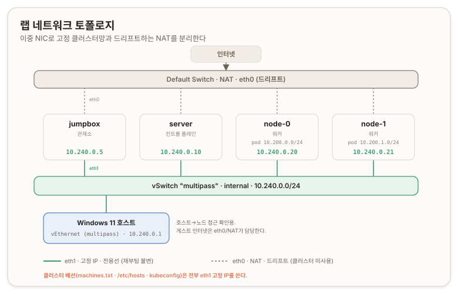

# 랩 토폴로지와 네트워크 기반 {#lab-topology-and-network}

## 개요 {#overview}

이 문서는 Kubernetes The Hard Way 트랙 A의 첫 구간(리포 [01](https://github.com/kelseyhightower/kubernetes-the-hard-way/blob/master/docs/01-prerequisites.md), [02](https://github.com/kelseyhightower/kubernetes-the-hard-way/blob/master/docs/02-jumpbox.md), [03](https://github.com/kelseyhightower/kubernetes-the-hard-way/blob/master/docs/03-compute-resources.md))을 다룬다. 클러스터의 어떤 프로세스도 아직 뜨지 않은 단계에서, 그 프로세스들이 설 물리 기반과 신원 배선을 세우는 작업이다.

축은 둘이다. 하나는 _네 대의 가상 머신, 그것들을 잇는 전용 네트워크, 그리고 조작이 나가는 관제소(점프박스)까지의 **물리·운영 기반이다.**_ 다른 하나는 _점프박스가 노드에 닿는 접근 경로(SSH)와, 이름·IP·호스트 키로 이루어진 **신원 배선이다.**_ 뒤에 이어지는 인증서(A1)와 데이터 암호화(A2)는 전부 이 배선 위에 얹힌다.

이 정리는 The Hard Way 문서를 옮긴 일반론이 아니라 실제 구축 기록이다. 초기 계획은 DHCP(Dynamic Host Configuration Protocol, 동적 호스트 설정)가 할당한 주소를 캡처해서 쓰는 것이었다. 그 방식이 이틀째에 IP 드리프트와 이름 스크램블을 냈고, 그 실패를 딛고 고정 IP 구조로 전환했다. 전환 경로와 도중에 낸 실수를 박제로 함께 남긴다.

환경은 Windows 11 Pro 호스트, Multipass 하이퍼바이저, Hyper-V 백엔드다. 노드 네 대는 모두 Ubuntu 24.04 LTS다.

---

# A부. 물리 기반 {#part-a-substrate}

## 01. Four VMs Topology {#four-machine-topology}

The Hard Way는 머신 네 대로 클러스터를 세운다. 컨트롤 플레인(Control Plane) 컴포넌트 전부를 한 노드에 올리고, 워커(worker) 두 대를 붙이고, 나머지 한 대는 점프박스(jumpbox)로 둔다. **점프박스는 클러스터 구성원이 아니라 관리 거점이다.** <u>인증서 생성, 파일 배포, 원격 명령</u>이 전부 여기서 나간다.

| 이름 | 역할 | 파드 대역 |
| --- | --- | --- |
| `jumpbox` | 관리 거점 (클러스터 비구성원) | 없음 |
| `server` | 컨트롤 플레인 (apiserver·controller-manager·scheduler·etcd) | 없음 |
| `node-0` | 워커(worker) | `10.200.0.0/24` |
| `node-1` | 워커(worker) | `10.200.1.0/24` |

파드 대역은 워커(worker)에만 배정된다. `node-0`은 *`10.200.0.0/24`,* `node-1`은 *`10.200.1.0/24`이며,* 두 대역의 상위 클러스터 CIDR(Classless Inter-Domain Routing, 클래스 없는 도메인 간 라우팅)은 `10.200.0.0/16`이다. 이 대역은 A6 파드 네트워크 라우트에서 노드 간 정적 경로로 실체화된다. 지금 단계에서는 각 워커가 어떤 파드 대역을 갖는지만 적어둔다. ([Kubernetes The Hard Way · 03 Compute Resources](https://github.com/kelseyhightower/kubernetes-the-hard-way/blob/master/docs/03-compute-resources.md))

## 02. Multipass와 Hyper-V {#multipass-hyperv}

Multipass는 Canonical이 배포하는 단일 바이너리 가상 머신 도구다. Windows에서는 Hyper-V를 백엔드로 삼아 Ubuntu VM을 띄운다. 커널 드라이버를 여러 겹 설치하지 않고 호스트를 비교적 깨끗하게 유지한 채 우분투 명령줄에 닿을 수 있다. ([Multipass](https://multipass.run/))

머신 관리는 이름으로 한다. `multipass list`가 인스턴스 상태와 IPv4를 보여주고, `multipass start`로 정지된 인스턴스를 켠다. 인자 없이 `multipass start`를 쓰면 primary 인스턴스만 켜지므로, 여러 대를 한 번에 켤 때는 `--all`이나 이름 나열을 쓴다. ([Multipass · start](https://canonical.com/multipass/docs/stable/reference/command-line-interface/start/))

세션 시작 시점의 상태는 네 대가 모두 `Stopped`였고 IPv4가 비어 있었다. 정지 상태에서는 주소가 없으니, 켜서 주소를 다시 확인하는 것이 첫 조작이다.

```ini
Name       State     IPv4    Image
jumpbox    Stopped   --      Ubuntu 24.04 LTS
node-0     Stopped   --      Ubuntu 24.04 LTS
node-1     Stopped   --      Ubuntu 24.04 LTS
server     Stopped   --      Ubuntu 24.04 LTS
```

## 03. DHCP 드리프트 문제 {#dhcp-drift}

Multipass가 Windows에서 인터넷 연결을 주는 통로는 Hyper-V의 Default Switch다. 이것은 NAT(Network Address Translation, 주소 변환) 스위치이며, 호스트나 인스턴스가 재시작할 때마다 DHCP로 매번 다른 주소를 할당한다. 서비스가 자기 주소를 고정으로 기대하는 상황과 맞지 않는 성질이다. ([Multipass on Windows with Hyper-V · permanent private IP](https://dev.to/madalinignisca/how-to-permanent-private-ip-on-multipass-on-windows-with-hyper-v-14k6))

이 드리프트가 왜 The Hard Way에서 문제인가. The Hard Way의 배선은 이름을 IP로 푸는 `/etc/hosts`와, 그 이름을 서버 주소로 쓰는 kubeconfig 위에 얹힌다. 노드 IP가 바뀌면 이 이름 해소가 어긋나고, 맞추려면 재배선을 반복해야 한다. 그래서 뒤 인증서 단계 전에 IP를 확정하는 순서를 지킨다. 흔히 '노드 IP가 인증서 SAN(Subject Alternative Name, 주체 대체 이름)에 박히니 굽기 전에 확정해야 한다'고 말하지만, A1에서 실제 `ca.conf`를 열어 보면 이 리포의 apiserver 인증서는 노드 IP가 아니라 이름에 기댄다. 그래서 IP 확정의 진짜 근거는 SAN 굽기가 아니라 이름 해소와 kubeconfig 주소의 안정이다. ([A1 apiserver SAN 실측](./a1-pki-and-trust#apiserver-san-measured))

초기 계획은 이 드리프트를 인프라가 아니라 절차로 흡수하는 것이었다. 재시작해서 새 주소를 받으면 그 값을 다시 캡처해 설정을 맞춘다는 방침이다. 이 방침은 이틀째 호스트 재부팅에서 실제로 무너졌다. 네 대의 주소가 하나도 남김없이 바뀌었다.

| 노드 | 이전 주소 | 재부팅 후 주소 |
| --- | --- | --- |
| `jumpbox` | `172.25.149.96` | `172.25.157.186` |
| `server` | `172.25.158.194` | `172.25.156.67` |
| `node-0` | `172.25.157.116` | `172.25.152.222` |
| `node-1` | `172.25.150.168` | `172.25.153.76` |

주소를 다시 캡처해 설정에 옮기는 그 절차 자체가 손으로 하는 전사(transcription)라, 옮겨 적는 과정에서 사고가 났다. 이 사고는 B부 신원 배선에서 박제로 다룬다. 드리프트가 절차 사고의 입구였다는 사실이 곧 고정 IP로 전환한 근거다.

## 04. 전용 스위치와 이중 NIC {#dedicated-switch-dual-nic}

드리프트를 절차가 아니라 인프라로 끊는 해법은 고정된 주소를 노드에 주는 것이다. Multipass 공식 문서가 권장하는 구성은 이렇다. 인스턴스에 외부 통신용 기존 NAT 네트워크를 그대로 두고, 그와 별도로 재부팅을 넘어 같은 주소로 닿는 내부 네트워크를 하나 더 붙인다. ([Multipass · Configure static IPs](https://canonical.com/multipass/docs/latest/how-to-guides/manage-instances/configure-static-ips/))

결과적으로 노드마다 NIC(Network Interface Card, 네트워크 인터페이스)가 두 장이 된다.

- 첫 번째 NIC(`eth0`, Default Switch NAT): 인터넷과 `multipass` 관리 통신용. 재시작마다 주소가 드리프트하지만 클러스터가 이 주소를 쓰지 않으므로 무시한다. `multipass shell`과 `exec`은 인스턴스를 이름으로 찾으므로 관리에 지장이 없다.
- 두 번째 NIC(`eth1`, 전용 내부 스위치): 클러스터 전용선. `machines.txt`와 `/etc/hosts`, kubeconfig가 전부 이 고정 주소를 쓴다(뒤 단계의 etcd·kubelet 서빙 인증서도). 재시작을 넘어 안 변한다.

Windows 쪽에서 새로 만드는 것은 전용 internal 가상 스위치(virtual switch) 한 개뿐이다. 이 스위치는 물리 NIC에 붙지 않는다. 실제 랜이나 공유기, 인터넷 경로와 분리된, 호스트와 VM만 참여하는 폐쇄 스위치다. private가 아니라 internal로 만든 이유는 호스트도 노드에 닿아야 하고, private는 그 접근을 막아 불필요한 복잡성만 더하기 때문이다. ([Multipass on Windows with Hyper-V · internal switch](https://dev.to/madalinignisca/how-to-permanent-private-ip-on-multipass-on-windows-with-hyper-v-14k6))

스위치를 만들면 호스트에 어댑터가 하나 생긴다. 이름(Alias)를 `vEthernet (multipass)`로 지었으며, 이 작업이 Windows 호스트에 남기는 유일한 흔적이다. Hyper-V 관리자에서 스위치를 지우면 그 어댑터까지 사라지므로 완전히 가역적이다. 물리 랜카드, 실제 랜, Windows 라우팅, 인터넷, 기존 Default Switch는 건드리지 않는다.

관리자 권한 PowerShell에서 스위치를 만들고 호스트 어댑터에 주소를 준다.

```powershell
New-VMSwitch -Name "multipass" -SwitchType Internal
New-NetIPAddress -InterfaceAlias "vEthernet (multipass)" -IPAddress 10.240.0.1 -PrefixLength 24
```

호스트 주소 `10.240.0.1`은 클러스터가 의존하는 값이 아니다. 게스트끼리는 스위치에서 직접 통신하며, 이 주소는 순전히 호스트에서 노드로 접근을 확인하기 위한 호스트의 주소다. 게스트에 인터넷을 주는 것도 아니다. 인터넷은 첫 번째 NIC의 몫이다.

기존에 떠 있는 인스턴스에 두 번째 NIC를 붙이는 것은 Multipass 관리자가 안내하는 경로가 있다. 전용 스위치를 만든 뒤 `multipass set local.bridged-network`으로 스위치를 지정하고, 인스턴스마다 `bridged=true`를 켠다. 설정은 인스턴스를 정지한 상태에서 하고 다시 켜서 반영한다. ([Multipass discussion #3983 · static IP for existing instances](https://github.com/canonical/multipass/discussions/3983))

이 재시작으로 첫 번째 NIC의 주소는 또 드리프트하지만 이제 상관없다. 또한 재시작하면서 cloud-init(클라우드 초기화 도구)이 각 노드의 `/etc/hosts`를 템플릿에서 재생성한다. 이 재생성이 B부에서 다룰 `/etc/hosts` 오염을 자동으로 씻어내는 부수 효과를 낸다.

두 번째 NIC가 실제로 생겼는지는 인터페이스 목록으로 확인한다. `eth0`과 `eth1` 두 개가 나오면 성공이며, `eth1`에는 아직 IPv4가 없다. 전용 스위치에는 DHCP 서버가 없으므로 당연한 상태이고, 그 빈 인터페이스에 다음 절에서 고정 주소를 손으로 박는다.



## 05. netplan 고정 IP와 MAC 매칭 {#netplan-static-mac}

두 번째 NIC의 고정 주소는 게스트 안에서 netplan으로 박는다. netplan은 우분투의 네트워크 설정 도구이며, YAML 파일로 인터페이스를 선언한다. ([netplan documentation](https://netplan.readthedocs.io/en/stable/))

설정에서 인터페이스를 `eth1`이라는 이름이 아니라 MAC(Media Access Control, 매체 접근 제어) 주소로 지목한다. 리눅스의 인터페이스 이름(`eth0`, `eth1`)은 재부팅 때 열거 순서가 뒤바뀌면 함께 바뀔 수 있고, 그러면 고정 주소가 엉뚱한 인터페이스에 붙는다. MAC은 그 가상 NIC의 고유 식별자라 바뀌지 않으므로, 설정을 하드웨어 정체성에 묶어 이 흔들림을 막는다. Multipass 공식 문서도 이 MAC 매칭 방식을 예시로 쓴다. ([Multipass · Configure static IPs](https://canonical.com/multipass/docs/latest/how-to-guides/manage-instances/configure-static-ips/))

각 노드의 `eth1` MAC과 배정할 주소는 이렇다. 대역은 `10.240.0.0/24`로 잡았고, 파드 대역(`10.200.0.0/16`)과 겹치지 않으며 뒤 단계 배선에 두루 쓸 값이라 정돈된 편을 골랐다.

| 노드 | `eth1` MAC | 고정 IP |
| --- | --- | --- |
| `jumpbox` | `52:54:00:8c:47:0d` | `10.240.0.5/24` |
| `server` | `52:54:00:70:30:38` | `10.240.0.10/24` |
| `node-0` | `52:54:00:b4:26:e9` | `10.240.0.20/24` |
| `node-1` | `52:54:00:67:b5:4e` | `10.240.0.21/24` |

노드마다 셸로 들어가 netplan 파일을 심는다. 파일명을 `99-`로 시작해 cloud-init이 관리하는 `50-cloud-init.yaml`(첫 번째 NIC 담당)과 분리하면, `eth0`과 인터넷은 건드리지 않는다.

```yaml
network:
  version: 2
  ethernets:
    eth1:
      match:
        macaddress: "52:54:00:8c:47:0d"
      dhcp4: no
      optional: true
      addresses: [10.240.0.5/24]
```

각 지시의 뜻은 이렇다. `match.macaddress`로 그 MAC의 인터페이스만 고르고, `dhcp4: no`로 DHCP를 끄며(전용선에 DHCP 서버가 없으니 켜두면 부팅 때 없는 서버를 기다리며 지연된다), `optional: true`로 이 인터페이스가 안 떠도 부팅이 온라인 판정을 기다리지 않게 하고, `addresses`로 고정 주소를 준다.

`netplan apply`를 실행하면 인터페이스를 잠깐 내렸다 올린다. 이때 `multipass shell` 세션이 타고 있던 경로가 순간 끊기면 셸이 호스트 프롬프트로 튕겨 나온다. 이것은 오류가 아니라, 대화형 세션이 끊긴 것일 뿐 `netplan apply` 명령은 노드 안에서 끝까지 실행된다. 앞으로 노드 안에서 네트워크를 만지는 작업은 `multipass exec <노드> -- <명령>` 한 방으로 던지는 편이 안전하다. 유지할 셸 세션이 없으니 튕길 세션도 없다.

적용 확인은 주소만 보지 않고 실제로 트래픽이 흐르는지까지 본다. 서로 다른 두 머신이 이 전용선으로 통신되는지가 완성의 판정 기준이다.

```bash
$ multipass exec jumpbox -- ping -c 2 10.240.0.10
```

```ini
64 bytes from 10.240.0.10: icmp_seq=1 ttl=64 time=0.335 ms
64 bytes from 10.240.0.10: icmp_seq=2 ttl=64 time=0.281 ms
```

`ping`이 `time<1ms`에 `ttl=64`로 돌아왔다. TTL(Time To Live, 생존 시간)이 64면 라우터를 거치지 않고 같은 스위치에서 직접 오갔다는 뜻이다. `jumpbox`에서 세 노드로, 그리고 Windows 호스트에서 노드로 전부 응답이 왔다. 전용 클러스터망이 완성됐고 주소가 확정됐다. 함께 뜨는 `fe80::`로 시작하는 주소는 링크-로컬(link-local) IPv6 주소로 리눅스가 인터페이스마다 자동으로 붙이는 것이며, 여기서 쓰지 않는다.

## 06. 점프박스 관제소 {#jumpbox-bastion}

점프박스는 클러스터 구성원이 아니라 관리 거점이다. 클러스터의 어떤 프로세스도 여기서 돌지 않는다. 대신 인증서를 만들고, 파일을 노드로 배포하고, `kubectl`로 클러스터를 조작하는 일이 전부 이 상자에서 나간다. 그래서 A부의 마지막 조작은 이 거점을 실제 작업대로 무장하는 것이다. 도구와 바이너리를 갖추고, 뒤 단계에서 서명 기관(CA, Certificate Authority)이 될 워크스테이션으로 세운다.

도구를 점프박스에 몰아 두는 데는 뒤 페이즈로 이어지는 근거가 있다. 인증서 서명은 CA 개인키가 있는 자리에서만 일어난다. 그 개인키를 점프박스에만 두면, _서명이라는 민감한 조작이 클러스터 노드가 아니라 관리 거점 한 곳에 갇힌다._ 이 배치의 근거는 [PKI와 TLS 신뢰 사슬](./_concepts/pki-tls-trust-chain) 문서에서 다룬다.

기본 도구부터 설치한다. 다운로드(`wget`, `curl`), 인증서 조작(`openssl`), 편집(`vim`), 리포 복제(`git`)에 쓰는 것들이다.

```bash
apt-get -y install wget curl vim openssl git
```

The Hard Way 리포는 얕은 복제(shallow clone)로 가져온다. 히스토리 없이 최신 커밋 하나만 받는 방식이며, 필요한 것이 설정 템플릿과 다운로드 목록뿐이라 과거 커밋을 받을 이유가 없다.

```bash
git clone --depth 1 https://github.com/kelseyhightower/kubernetes-the-hard-way.git
```

이어서 클러스터 구성 요소의 바이너리를 내려받아 역할별로 분류한다. 리포가 다운로드 목록에서 버전을 고정하므로, 받는 버전은 내 선택이 아니라 그 시점 매니페스트가 정한 값이다.

이번 복제 시점의 목록에는 crictl(`v1.32.0`), containerd(`2.1.0-beta.0`), runc, cni-plugins(`v1.6.2`), etcd(`v3.6.0-rc.3`), 그리고 쿠버네티스 `v1.32.x` 계열(`kube-apiserver`·`kube-controller-manager`·`kube-scheduler`·`kubelet`·`kube-proxy`·`kubectl`)이 있었다. 일부가 베타·RC(release candidate, 출시 후보)인 것은 리포의 고정값이지 내 의도가 아니다. 아키텍처는 `dpkg --print-architecture`가 반환하는 값(*이 호스트는 `amd64`*)으로 고른다.

```text
downloads/
├── client/        # kubectl
├── controller/    # kube-apiserver, kube-controller-manager, kube-scheduler, etcd
├── worker/        # kubelet, kube-proxy, crictl, containerd, runc
└── cni-plugins/   # CNI 플러그인 묶음
```

마지막으로 **`kubectl`만 지금 점프박스에 설치한다.** *관제소에서 곧바로 클러스터를 조회·조작하려면* 이 클라이언트가 경로에 있어야 하기 때문이다. 나머지 바이너리는 아직 설치하지 않고 배포용으로 쌓아 둔다. 실제 노드에 얹는 것은 페이즈 2의 몫이다.

```bash
install -m 755 downloads/client/kubectl /usr/local/bin/kubectl
kubectl version --client
```

> 제품으로 접히는 지점. 이 관제소 역할을 제품(RKE2 설치·업그레이드 콘솔)에서는 Java·Spring 백엔드가 대신한다. 노드에 SSH로 접속하고 바이너리·번들을 내려받아 전송하는 흐름이 관제소의 도구 배선과 그대로 대응한다(기능목록의 다운로드·번들 전송 컴포넌트).

출처는 [Kubernetes The Hard Way · 02 Jumpbox](https://github.com/kelseyhightower/kubernetes-the-hard-way/blob/master/docs/02-jumpbox.md), [Multipass](https://multipass.run/)다.

---

# B부. 신원 배선 {#part-b-identity}

물리 전용선 위에 이제 신원을 얹는다. 신원 배선은 두 겹이다. 먼저 점프박스가 노드에 손을 뻗는 접근 경로(root SSH)를 세우고, 그 위에 노드가 서로를 `server`, `node-0` 같은 이름으로 부르는 이름 배선을 올린다. 접근이 없으면 이름을 심을 통로 자체가 없으므로 접근부터다. 이름 배선은 다시 세 파일에 나뉘어 있고, 각 파일이 담는 것이 서로 다르다. 이 차이를 흐리게 본 것이 스크램블 사고의 뿌리였다.

## 07. SSH 대역외 부트스트랩 {#ssh-oob-bootstrap}

신원 배선의 첫 매듭은 이름이 아니라 <u>접근</u>이다.

*점프박스에서 노드의 `root`로 SSH가 뚫려 있어야, 뒤의 이름 배선 루프가 전부 성립한다. The Hard Way 03의 조작은 예외 없이 `ssh -n root@<노드> ...` 형태로 점프박스에서 노드 root에 명령을 밀어 넣는다. 그런데 Multipass가 찍어 주는 클라우드 이미지는 `ubuntu` 사용자와 그 키 접근만 열어 두고, `root` 로그인과 노드 간 SSH는 기본으로 잠가 둔다. 접근을 열려면 설정을 바꿔야 하는데, 설정을 바꾸려면 접근이 있어야 한다.*

이 순환이 부트스트랩 패러독스(bootstrap paradox)다. 안쪽 채널(SSH)로는 순환을 못 끊으므로, 신뢰 경로 바깥의 채널로 끊어야 한다.

왜 익숙한 도구가 여기서 안 통하는지부터 짚어야 한다. `ssh-copy-id`는 이름과 달리 SSH 위에서 도는 스크립트라, 그 자체가 대역외 채널(out-of-band channel)이 아니다. 노드는 클라우드 이미지 설정이 `PasswordAuthentication no`를 걸어 비밀번호 로그인이 막혀 있고, 점프박스 키는 아직 심기지 않았다. 인증 수단이 하나도 없으니 `ssh-copy-id`든 맨손 `ssh`든 `Permission denied (publickey)`로 튕긴다. `passwd`로 root 비밀번호를 만들어도 소용없다. 비밀번호 인증 자체가 꺼져 있기 때문이다.

순환을 끊는 채널은 하이퍼바이저 관리층이다. Multipass는 게스트 안쪽 SSH를 거치지 않고 호스트에서 게스트로 직접 파일을 밀고 명령을 실행하는 통로(`transfer`, `exec`)를 준다. 이것이 대역외 채널이다. 점프박스에 미리 만들어 둔 ed25519 공개키(`~/.ssh/id_ed25519.pub`)를 이 통로로 각 노드 root의 `authorized_keys`에 심는다.

```bash
# 호스트에서: 점프박스 공개키를 각 노드 /tmp로 밀어 넣고
multipass transfer jumpbox.pub <노드>:/tmp/jumpbox.pub
# 노드 root의 authorized_keys를 그 키로 원자적으로 덮어쓴다 (권한 600, root 소유)
multipass exec <노드> -- sudo install -m 600 -o root -g root /tmp/jumpbox.pub /root/.ssh/authorized_keys
```

`/tmp`를 경유하는 이유가 있다. `/root`는 권한이 700이라 전송 에이전트가 들어가지 못한다. 누구나 쓸 수 있는 `/tmp`에 먼저 올린 뒤, 노드 안에서 `root` 권한으로 `install`이 제자리에 복사한다. `install`은 복사·권한 설정·소유자 지정을 한 번에 처리하므로, 기존 `authorized_keys`의 내용이 이 시점에 통째로 교체된다. 붙이기(append)가 아니라 덮어쓰기(overwrite)라는 점이 중요하다. 뒤 박제에서 보듯, 원래 그 파일에 있던 오염된 줄들이 이때 함께 사라진다.

뚫렸는지는 반드시 반대편에서 확인한다. 점프박스에서 노드 root로 접속해 호스트명이 돌아오면 성공이다.

```bash
ssh -o StrictHostKeyChecking=accept-new root@<노드-IP> hostname
```

`accept-new`는 처음 보는 호스트 키를 자동으로 수락해 대화형 프롬프트를 없앤다(호스트 키 자체의 신뢰 문제는 뒤 ["SSH 호스트 키와 known_hosts"](#ssh-host-key-known-hosts)에서 따로 다룬다).

여기에 곁가지 사실 셋을 정리해 둔다.

- 첫째, SSH 데몬의 서비스명은 우분투에서 `ssh`이고(24.04는 `ssh.socket`으로 소켓 활성화된다) RHEL 계열에서 `sshd`다.
- 둘째, `sshd_config`의 `PermitRootLogin` 기본값은 `prohibit-password`라, 키 로그인은 원래부터 허용돼 있었다.
- 셋째, 그러므로 root 접근을 막고 있던 것은 설정(config)이 아니라 `authorized_keys`의 내용이었다. 잠금의 자리를 config로 오해하면 엉뚱한 곳을 고치게 된다.

> **박제: 지문을 키로 착각한 대역외 심기**
>
>> **삽질.** <br/>
>> 점프박스 키를 노드에 심으려고 노드 `authorized_keys`를 직접 열어 한 줄을 붙였다. 그런데 두 가지가 겹쳐 접근이 계속 막혔다.
>>
>> (1) 그 파일에는 클라우드 이미지가 넣어 둔 강제 명령(forced command) 가드가 이미 한 줄 있었다. `command="echo 'Please login as the user ...'; exit 142"` 꼴로 root 키 로그인을 가로채고, 딸린 키도 무관한 `ubuntu` 키였다.
>>
>> (2) 정작 내가 붙인 것은 공개키가 아니라 지문(fingerprint) 문자열 `SHA256:...`이었다. 키를 붙였다고 생각했지만, 지문은 키가 아니라 키의 해시 요약이라 sshd가 조용히 무시했다.
>>
>> 그래서 아무 키도 실제로 추가되지 않았고, 강제 명령 가드만 남아 접근이 `exit 142`로 끊겼다.
>
>> **교정.** <br/>
>> 지문과 키를 구분하는 것부터다. 진짜 공개키는 `ssh-ed25519 AAAA...`로 시작하는 `id_ed25519.pub`의 내용 전체야. `SHA256:...`은 그 키를 사람이 눈으로 대조하라고 만든 해시 지문이지 키가 아니다.
>>
>> 그리고 붙이는(append) 방식이 아니라 덮어쓰는(overwrite) 방식이어야 했다. `install -m 600 -o root`로 `authorized_keys`를 통째로 교체하면 오염된 강제 명령 줄이 함께 사라지고 점프박스 키만 남는다.
>>
>> 마지막으로 검증은 늘 반대편에서. 심었다고 믿지 말고 `ssh root@<IP> hostname`이 호스트명을 돌려주는지로 확인해라. 네가 심었다고 생각한 것과 sshd가 실제로 읽은 것이 다를 수 있다.

<none/>

> 제품으로 접히는 지점. 이 대역외 부트스트랩을 제품은 노드 정보 입력(계정과 비밀번호 또는 키)으로 받아, 공통 컴포넌트의 SSH·SCP가 대신 수행한다. 실무의 대역외 채널이 물리 콘솔·클라우드 메타데이터·IPMI인 것과 같은 자리를, 이 랩에서는 Multipass의 `exec`·`transfer`가 맡는다.

출처는 [Kubernetes The Hard Way · 03 Compute Resources](https://github.com/kelseyhightower/kubernetes-the-hard-way/blob/master/docs/03-compute-resources.md), [Multipass](https://multipass.run/), [sshd_config(5)](https://man.openbsd.org/sshd_config)다.

## 08. machines.txt 단일 진실 원천 {#machines-txt}

`machines.txt`는 점프박스가 유지하는 단일 진실 원천(SoT, Source of Truth)이다. IP, FQDN(Fully Qualified Domain Name, 완전 정규 도메인 이름), 짧은 이름, 파드 대역을 한 줄에 담고, The Hard Way의 나머지 배선이 이 파일을 루프로 돌아 파생된다. `jumpbox`는 관리 거점이라 이 파일에 넣지 않는다.

고정 IP 전환 뒤의 `machines.txt`는 이렇다.

```text
10.240.0.10 server.kubernetes.local server
10.240.0.20 node-0.kubernetes.local node-0          10.200.0.0/24
10.240.0.21 node-1.kubernetes.local node-1          10.200.1.0/24
```

이 파일이 배선의 원천이므로, 여기의 이름과 IP 짝이 어긋나면 그 오류가 하위 전부로 번진다. 스크램블이 정확히 그렇게 났다.

```bash
# machices.txt의 무결성을 장담하면 바로 /etc/hosts에 집어넣어도 된다.
echo "" > hosts
echo "# Kubernetes The Hard Way" >> hosts
while read IP FQDN HOST CIDR; do
  case "${HOST}" in
    server)
      # 서버(server)는 CIDR 없이 처리
      echo "${IP} ${FQDN} ${HOST}" >> hosts
      ;;
    *)
      # 워커 노드(worker node)는 CIDR(Pod CIDR)까지 사용
      echo "${IP} ${FQDN} ${HOST} ${CIDR}" >> hosts
      ;;
  esac
done < machines.txt

cat hosts    # 확인 후 기입

cat hosts >> /etc/hosts
```

> **박제: IP와 이름의 스크램블**
>
>> **삽질.** <br/>
>> DHCP 드리프트로 네 주소가 다 바뀐 뒤, 새 주소를 `machines.txt`에 옮겨 적었다. 그런데 `multipass list`는 이름 알파벳순(`node-0`, `node-1`, `server`)으로 출력되고 `machines.txt`의 행 순서는 `server`, `node-0`, `node-1`이다. 리스트에 뜬 주소를 보이는 순서대로 행에 내리찍으면서, `server`에 `node-0`의 주소를, `node-0`에 `node-1`의 주소를, `node-1`에 `server`의 주소를 박았다. 세 이름의 주소가 한 칸씩 회전한 것이다. 이 상태로 이름 배선을 진행하자 각 노드의 호스트명까지 함께 회전했고, `ssh server`가 엉뚱한 물리 박스에 닿았다.
>>
>> (얼탱이 없는 실수를 정성스럽게 포장해주네;)
>
>> **교정.** <br/>
>> 옮겨 적기 전에 두 출력의 정렬이 다르다는 걸 봤어야 해. `multipass list`(이름순)와 `machines.txt`(네 행 순서)를 짝짓지 말고, 이름을 기준으로 하나씩 대조해서 넣어라. 그리고 더 중요한 건 검증이야. 이름 배선을 끝내고 `uname -n`이 `server`를 돌려준다고 만족하면 안 된다. 호스트명까지 회전했으니 이름을 물으면 회전된 이름이 그대로 답할 뿐이거든. 검증은 반드시 네가 설정하지 않은 쪽, 즉 `multipass list`가 말하는 실제 주소와 `hostname -I`를 교차대조해야 한다. 네가 설정한 값을 네게 되물으면 초록불은 늘 거짓말을 한다.

## 09. /etc/hosts와 127.0.1.1 규칙 {#etc-hosts-127011}

`/etc/hosts`는 이름을 IP로 푸는 로컬 해석 파일이다. `ssh server`가 실제로 어느 상자에 닿느냐가 여기서 결정된다. 점프박스와 세 노드 모두에 클러스터 이름 블록을 배포한다.

여기서 우분투의 관례를 정확히 알아야 한다. 우분투(데비안 계열)의 `/etc/hosts`는 두 줄을 구분해서 쓴다. **`127.0.0.1 localhost`는 루프백 이름이고, `127.0.1.1 <호스트명>`은 그 상자 자신의 호스트명 줄이다.** The Hard Way 03의 호스트명 설정은 정확히 `127.0.1.1` 줄만 갱신한다. ([Kubernetes The Hard Way · 03 Compute Resources](https://github.com/kelseyhightower/kubernetes-the-hard-way/blob/master/docs/03-compute-resources.md))

```bash
sed -i 's/^127.0.1.1.*/127.0.1.1\t${FQDN} ${HOST}/' /etc/hosts
```

이 두 줄의 역할이 다르다는 걸 흐리게 보면 localhost를 덮어쓰는 사고가 난다.

> **박제: localhost 오염**
>
>> **삽질.** <br/>
>> 호스트명 줄을 갱신하는 `sed`에서 대상을 `^127.0.1.1`이 아니라 `^127.0.0.1`로 잡았다. 그 결과 호스트명 줄이 아니라 `127.0.0.1 localhost` 줄을 덮어써서, 세 노드의 `/etc/hosts`에서 `127.0.0.1 localhost`가 사라지고 `127.0.0.1 server.kubernetes.local server` 같은 줄로 바뀌었다. 게다가 스크램블을 복구하며 이 `sed`를 재실행할 때도 같은 `^127.0.0.1`을 그대로 써서 오염을 반복했다. 정체성만 검증하고 localhost 해석은 확인하지 않아, 이 오염이 초록불 아래로 숨었다.
>
>> **교정.** <br/>
>> 불변식 하나만 박아라. **`127.0.1.1`은 호스트명 줄, `127.0.0.1`은 localhost.** 절대 섞지 마. 기본 localhost 항목은 건드리면 안 되고, 많은 소프트웨어가 `127.0.0.1 localhost` 해석에 의존한다. 그리고 검증이 또 절반이었어. `hostname -I`로 정체성은 봤지만 localhost는 안 봤지. `getent ahostsv4 localhost`가 `127.0.0.1`을 돌려주는지까지 봐야 한다. 늘 네가 설정하지 않은 쪽에서 확인하라는 얘기가 여기서 두 번째로 나온다.

이 오염은 결국 손으로 고치지 않았다. 고정 IP 전환을 위해 인스턴스를 재시작하는 순간 cloud-init이 `manage_etc_hosts` 규칙에 따라 `/etc/hosts`를 템플릿에서 재생성했고(**논리적 추론에 따른 답**: `manage_etc_hosts: True`와 재시작 조합이면 그렇게 동작하며, 아래 검증으로 확정했다), 그때 `127.0.0.1 localhost`가 자동 복구됐다. 재배선은 그 깨끗한 기반 위에서 이번엔 `127.0.1.1` 규칙으로 다시 썼다.

## 10. SSH 호스트 키와 known_hosts {#ssh-host-key-known-hosts}

점프박스가 노드에 SSH로 접속할 때, 상대가 진짜 그 노드인지는 호스트 키(host key)로 확인한다. 호스트 키는 각 노드의 디스크에 있는 그 노드 고유의 키쌍이며, `known_hosts` 파일이 **(이름 OR 주소 → 키)** 의 목록으로 이를 기억한다. 이 목록과 대조해 상대를 신뢰한다.

Multipass의 `stop`과 `start`는 게스트 디스크를 보존하므로, 노드의 호스트 키는 재시작을 넘어 그대로 유지된다. 이 사실이 [스크램블(§08 박제)](#machines-txt) 탐지의 결정적 단서였다.

> **박제: 이름 접속의 침묵이 깨진 신호**
>
>> **삽질.** <br/>
>> 스크램블 상태에서 `ssh server`, `ssh node-0`, `ssh node-1`을 하자 세 개 모두 `REMOTE HOST IDENTIFICATION HAS CHANGED` 경고가 떴다. 이걸 단순한 키 갱신 잡음으로 보고 `ssh-keygen -R`로 지운 뒤 새 키를 그냥 수용해서, 회전된 잘못된 짝을 `known_hosts`에 다시 시멘트로 박았다.
>
>> **교정.** <br/>
>> 그 경고가 뜬 것 자체가 증거였다. 호스트 키는 재시작을 넘어 안 변하니까, 매핑이 옳았다면 이름 접속은 경고 없이 조용히 통과했어야 해. 저장된 키와 제시된 키가 같을 테니까. 세 개 전부 경고가 떴다는 건 각 이름이 이제 다른 물리 박스를 가리킨다는 뜻이야. 게다가 첫 시도에서 SSH가 친절하게 알려줬어. 새 호스트 키를 수용할지 물을 때, 같은 키가 이미 걸려 있는 다른 이름이나 주소를 함께 표시하거든. "이 주소, 네가 다른 이름으로 저장해둔 그 박스인데?"라고 말해준 거야. 그 줄을 읽었어야 했다.

이 침묵과 경고의 갈림을 지배하는 것은 SSH의 이름·주소 검증 기본값이다. 과거 OpenSSH는 이름으로 접속해도 주소까지 대조하는 `CheckHostIP` 옵션이 켜져 있어, 이름이 같아도 IP가 바뀌면 경고를 냈다. 이 기본값은 OpenSSH 8.5(2021년 3월)에서 비활성으로 바뀌었다. 공식 릴리스 노트는 그 이유를 밝힌다. 이 검증은 얻는 이익이 미미한 반면, 특히 IP 기반 로드밸런서 뒤의 호스트에서 키 순환을 크게 어렵게 만들기 때문이다. 그리고 같은 릴리스가 새 호스트 키 수용 시 그 키에 걸린 다른 이름과 주소를 표시하는 동작도 넣었다. ([OpenSSH 8.5 release notes](https://www.openssh.com/txt/release-8.5))

Ubuntu 24.04 LTS는 OpenSSH 9.x 계열이라 이 기본값(주소 대조 없음)을 따른다(**논리적 추론에 따른 답**: 24.04는 OpenSSH 9.6을 담고 있어 8.5 이후의 기본값을 상속한다). 그래서 재배선을 새 고정 IP 위에서 할 때, 이름의 저장된 키가 그대로면 IP가 `172.25.x`에서 `10.240.0.x`로 바뀌어도 이름 접속은 조용히 통과했다. 박스의 정체성(호스트 키)이 안 바뀌었고, 접속하는 주소만 바뀌었기 때문이다.

## 11. 재배선과 이중 검증 {#rewire-and-verify}

세 파일의 역할을 정확히 갈랐으니 재배선은 순서대로 흐른다. `machines.txt`를 고정 IP로 교체하고, 각 노드의 `127.0.1.1` 줄을 FQDN으로 갱신하고(호스트명 설정 포함), 이름 블록을 점프박스와 세 노드에 배포한다.

검증은 이번엔 정체성과 localhost를 함께 본다. 정체성만 보다 localhost를 놓친 것이 앞의 실수였다.

```ini
== server ==
server
server.kubernetes.local
172.25.158.243 10.240.0.10
127.0.0.1       STREAM localhost
```

네 항목이 각각 이렇게 읽힌다.

- `uname -n`이 `server`,
- `hostname --fqdn`이 `server.kubernetes.local`,
- `hostname -I`에 고정 주소 `10.240.0.10`이 포함<br/>
  *(NIC가 두 장이라 드리프트하는 `172.25.x`와 함께 두 주소가 나온다),*
- `getent ahostsv4 localhost`가 `127.0.0.1`.

세 노드가 모두 통과했다. `multipass list`가 말하는 실제 주소와 일치했고, localhost는 살아 있다. *(스크램블과 오염이 둘 다 닫혔다.)*

---

## 부록 A. 핵심 어휘 빠른 참조 {#appendix-a-glossary}

| 용어 | 한 줄 정의 |
| --- | --- |
| **점프박스(jumpbox)** | 클러스터 구성원이 아닌 관리 거점. 인증서 생성·배포·원격 명령의 출발점 |
| **NAT(Network Address Translation)** | 사설 주소를 공인 주소로 바꿔 외부와 통신시키는 방식. Hyper-V Default Switch가 이 방식 |
| **DHCP(Dynamic Host Configuration Protocol)** | 주소를 자동 할당하는 프로토콜. 재시작마다 주소가 바뀔 수 있음 |
| **가상 스위치(virtual switch)** | 하이퍼바이저가 만드는 소프트웨어 스위치. internal은 호스트와 VM만, private는 VM만, external은 물리 랜까지 연결 |
| **NIC(Network Interface Card)** | 네트워크 인터페이스. 이 랩의 노드는 NAT용과 전용선용 두 장을 가짐 |
| **netplan** | 우분투의 YAML 기반 네트워크 설정 도구 |
| **MAC(Media Access Control) 주소** | NIC의 고유 하드웨어 식별자. 이름과 달리 재부팅에 안 흔들려 인터페이스 지목에 씀 |
| **SoT(Source of Truth)** | 단일 진실 원천. 이 랩에서는 `machines.txt`가 배선의 원천 |
| **FQDN(Fully Qualified Domain Name)** | 완전 정규 도메인 이름. 예: `server.kubernetes.local` |
| **호스트 키(host key)** | 각 노드 고유의 SSH 키쌍. 노드의 정체성. 재시작(디스크 보존)에 안 변함 |
| **known_hosts** | (이름/주소 → 호스트 키) 목록. 접속 상대의 정체성을 대조하는 파일 |
| **CheckHostIP** | 이름 접속 시 주소까지 대조하는 SSH 옵션. OpenSSH 8.5부터 기본 비활성 |
| **부트스트랩 패러독스(bootstrap paradox)** | 접근을 여는 설정을 하려면 접근이 필요한 순환. 대역외 채널로만 끊긴다 |
| **대역외 채널(out-of-band channel)** | 신뢰 경로 밖의 통로. 이 랩은 Multipass `transfer`·`exec`, 실무는 콘솔·IPMI·클라우드 메타데이터 |
| **강제 명령(forced command)** | `authorized_keys`의 `command="..."` 옵션. 그 키로 접속하면 지정 명령만 실행됨. 클라우드 이미지가 `exit 142` 가드로 사용 |
| **지문(fingerprint)** | 공개키의 해시 요약(`SHA256:...`). 키 원문이 아니라 `authorized_keys`에 넣어도 sshd가 무시 |
| **TTL(Time To Live)** | 패킷 생존 시간. 응답의 `ttl=64`는 라우터를 안 거친 직접 통신을 시사 |
| **cloud-init** | 클라우드 초기화 도구. `manage_etc_hosts: True`면 부팅마다 `/etc/hosts`를 템플릿에서 재생성 |
| **SAN(Subject Alternative Name)** | 인증서에 담기는 이름·주소 목록. 이 리포의 apiserver SAN은 노드 IP가 아니라 이름 기반이다(A1 실측) |

---

## 부록 B. 명령어 빠른 참조 {#appendix-b-commands}

```bash
# === 인스턴스 상태와 기동 ===
multipass list                                  # 인스턴스 상태와 IPv4
multipass start --all                           # 정지된 인스턴스 전부 기동
multipass exec <node> -- <command>              # 셸 없이 단발 명령 (네트워크 조작에 안전)

# === 전용 스위치 (관리자 PowerShell) ===
New-VMSwitch -Name "multipass" -SwitchType Internal
New-NetIPAddress -InterfaceAlias "vEthernet (multipass)" -IPAddress 10.240.0.1 -PrefixLength 24
Get-VMSwitch -Name multipass                    # 스위치 타입 확인

# === 기존 인스턴스에 두 번째 NIC 부착 ===
multipass stop jumpbox server node-0 node-1
multipass set local.bridged-network=multipass
multipass set local.<node>.bridged=true
multipass start jumpbox server node-0 node-1
multipass exec <node> -- ip -br link            # eth1 존재와 MAC 확인

# === 고정 IP 확인과 연결 검증 ===
multipass exec <node> -- ip -br addr show eth1  # eth1 고정 주소 확인
multipass exec jumpbox -- ping -c 2 10.240.0.10 # 전용선 트래픽 검증 (ttl=64 기대)

# === 이름 배선 검증 (정체성 + localhost) ===
ssh -n root@<host> "uname -n; hostname --fqdn; hostname -I; getent ahostsv4 localhost | head -1"

# === known_hosts 정리 ===
ssh-keygen -f '/root/.ssh/known_hosts' -R '<host>'   # 이름 항목 제거 후 재수용

# === 관제소 무장 (점프박스) ===
apt-get -y install wget curl vim openssl git
git clone --depth 1 https://github.com/kelseyhightower/kubernetes-the-hard-way.git
dpkg --print-architecture                            # amd64 등 아키텍처 확인
install -m 755 downloads/client/kubectl /usr/local/bin/kubectl

# === 대역외 키 심기 (호스트 → 노드 root) ===
multipass transfer jumpbox.pub <node>:/tmp/jumpbox.pub
multipass exec <node> -- sudo install -m 600 -o root -g root /tmp/jumpbox.pub /root/.ssh/authorized_keys
ssh -o StrictHostKeyChecking=accept-new root@<node-IP> hostname   # 반대편에서 접근 검증
```

---

## 개인 노트 {#personal-notes}

### 손때 검증 상태 {#hands-on-status}

이 문서의 A부와 B부는 전부 실습으로 닫혔다. 전용 스위치 생성, 이중 NIC 부착, netplan 고정 IP, 관제소 도구 배선, SSH 대역외 부트스트랩, 이름 배선을 실제로 수행했고, `ping`(양방향, `ttl=64`)과 정체성·localhost 이중 검증, 그리고 반대편에서 `ssh ... hostname`으로 확인했다. 네 박제는 상상한 함정이 아니라 실제로 낸 실수의 기록이다.

한 가지 얇은 구간은 네 대의 최초 생성(`multipass launch`)뿐이다. 이 프로비저닝은 이 정리 이전에 이뤄져 CLI 원장이 요약본만 남았고, 명령 단위 재현은 그 자리를 다시 밟을 때 채운다.

### 심화로 가는 길 {#deeper}

- **Hyper-V internal 스위치의 내부 동작**: 호스트에 생기는 `vEthernet` 어댑터가 게스트 트래픽을 어떻게 브리징하는가, private와의 격리 차이가 어디서 오는가.
- **netplan 렌더러**: netplan이 백엔드로 `systemd-networkd`와 `NetworkManager` 중 무엇을 쓰는가, 우분투 서버 기본값과 그 함의.
- **manage_etc_hosts 지속성**: 재부팅마다 `/etc/hosts`가 재생성되면 배포한 이름 블록도 지워진다. 고정 IP로 드리프트는 끊었지만 이 재생성은 별개 문제이며, 블록 지속을 어떻게 보장할지.
- **호스트 키 신뢰의 시작**: `known_hosts`의 첫 접속 신뢰(TOFU, Trust On First Use)와 그 약점. 이 주제는 A1 PKI 문서의 위임된 신뢰와 정면으로 이어진다.

### 자기 점검 {#self-check}

진단 질문 대신, 각 절이 왜 성립하는지를 한 줄로 재구성해 본다.

1. **드리프트가 왜 문제인가** → 이름을 IP로 푸는 `/etc/hosts`와 kubeconfig 주소가 안정된 IP에 의존하고, 바뀌면 재배선을 반복하게 된다. apiserver 인증서 자체는 이름 기반이라 직접 깨지진 않는다 (→ DHCP 드리프트 문제).
2. **왜 NIC를 두 장 쓰는가** → NAT용 주소는 드리프트해도 무시하고, 전용선의 고정 주소만 클러스터가 쓴다 (→ 전용 스위치와 이중 NIC).
3. **왜 MAC으로 인터페이스를 지목하는가** → 이름은 재부팅에 흔들리고 MAC은 안 흔들려, 설정을 하드웨어 정체성에 묶는다 (→ netplan 고정 IP와 MAC 매칭).
4. **왜 스크램블이 났는가** → `multipass list`와 `machines.txt`의 정렬이 달라 주소를 회전 배치했고, 검증을 설정한 쪽에서 했다 (→ machines.txt 단일 진실 원천).
5. **왜 이름 접속이 조용히 통과하는가** → 호스트 키는 재시작에 안 변하고 `CheckHostIP`가 기본 비활성이라, IP만 바뀌면 이름 접속은 경고를 내지 않는다 (→ SSH 호스트 키와 known_hosts).
6. **왜 안쪽 SSH로 노드 접근을 못 여는가** → 접근을 여는 설정을 하려면 접근이 필요한 부트스트랩 패러독스라, 하이퍼바이저 관리층(`multipass transfer`·`exec`)이라는 대역외 채널로 끊는다 (→ SSH 대역외 부트스트랩).
7. **지문과 공개키는 어떻게 다른가** → 공개키는 `ssh-ed25519 AAAA...` 원문이고 지문 `SHA256:...`은 그 해시 요약이라, 지문을 심으면 sshd가 조용히 무시한다 (→ SSH 대역외 부트스트랩 박제).

다음 [A1 PKI와 신뢰 모델](./a1-pki-and-trust)에서 이 전용선 위에 CA와 인증서로 신원 계층을 세운다. `known_hosts`의 평평한 신뢰가 위임된 신뢰로 접히는 대목이 그 문서의 출발점이다.
