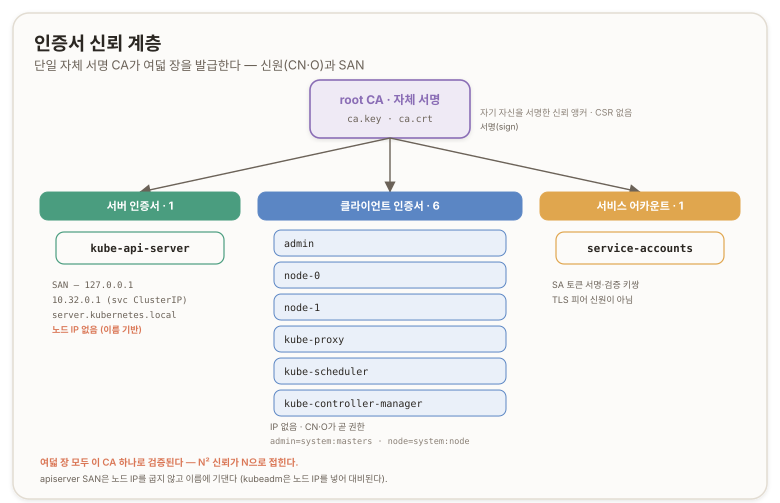

# 인증서 신뢰 계층과 kubeconfig {#pki-certs-and-kubeconfig}

## 개요 {#overview}

이 문서는 Kubernetes The Hard Way 트랙 A의 두 번째 구간(리포 [04](https://github.com/kelseyhightower/kubernetes-the-hard-way/blob/master/docs/04-certificate-authority.md)~[05](https://github.com/kelseyhightower/kubernetes-the-hard-way/blob/master/docs/05-kubernetes-configuration-files.md))을 다룬다. [랩 토폴로지와 네트워크 기반](./a0-lab-topology-and-network)에서 세운 전용 고정 IP 위에, 이제 신원 계층을 얹는다. 자체 서명 인증기관(CA, Certificate Authority)을 하나 세우고, 여덟 컴포넌트의 인증서를 발급하고, 각자를 제자리에 배포하고, 여섯 개의 kubeconfig로 클라이언트 접속 설정을 굽는다. 클러스터 프로세스는 아직 하나도 뜨지 않는다. etcd·apiserver·kubelet이 서로를 믿을 수 있게 하는 신원과 설정 산출물만 확보한다.

이 문서는 두 갈래로 나뉜 짝을 이룬다. [PKI와 TLS 신뢰 사슬](./pki-tls-trust-chain)은 왜 이렇게 되는지(위임된 신뢰, 자체 서명 앵커, 신원과 권한의 결합)를 정리한 근원 개념 페이지다. 이 문서는 그 개념을 실제로 어떻게 실행했는지(진짜 명령, 진짜 출력, 도중에 낸 실수)를 담는다. 개념이 궁금하면 근원 페이지로, 손을 어떻게 놀렸는지가 궁금하면 이 문서로 온다.

이번 구간에서 개념 페이지를 실측으로 교정한 대목이 하나 있다. apiserver 서버 인증서의 SAN(Subject Alternative Name, 주체 대체 이름)은 노드 IP를 굽지 않고 이름에만 기댄다. 이 발견을 [apiserver SAN 실측](#apiserver-san-measured)에서 다룬다.

환경은 [a0](./a0-lab-topology-and-network)와 같다. 점프박스(jumpbox)에서 모든 명령을 실행하고, 고정 IP는 server `10.240.0.10`, node-0 `10.240.0.20`, node-1 `10.240.0.21`이다.

---

# A부. 신뢰의 뿌리 {#part-a-root-of-trust}

## 01. 단일 CA와 여덟 인증서 {#single-ca-eight-certs}

The Hard Way는 자체 서명 CA 하나로 여덟 컴포넌트의 인증서를 전부 서명한다. admin, node-0, node-1, kube-proxy, kube-scheduler, kube-controller-manager, kube-api-server, service-accounts다. CA를 하나 두는 이유, 인증서가 여덟 장인 이유, 신원(CN·O)이 곧 권한(RBAC)의 기반이 되는 원리는 근원 페이지에 정리돼 있다. ([PKI와 TLS 신뢰 사슬 · 인증서가 여러 장인 이유](./pki-tls-trust-chain#why-many-certs))



실행 관점의 특징은 리포가 `ca.conf`라는 openssl 설정 파일 하나에 모든 컴포넌트의 발급 조건(주체 이름, 확장, SAN)을 미리 담아뒀다는 점이다. 그래서 CSR(Certificate Signing Request, 인증서 서명 요청)마다 긴 인자를 손으로 넘기지 않고, `-section <컴포넌트>`로 해당 블록을 골라 쓴다. 리포의 표현대로 `ca.conf`를 전부 이해할 필요는 없고, openssl 설정을 배우는 출발점으로 삼으면 된다. ([Kubernetes The Hard Way · 04 Certificate Authority](https://github.com/kelseyhightower/kubernetes-the-hard-way/blob/master/docs/04-certificate-authority.md))

## 02. CA 생성 {#ca-generation}

CA는 개인키 하나와 자체 서명(self-signed) 루트 인증서 하나로 시작한다. IP와 무관한 조작이라, IP 드리프트 점검보다 먼저 해도 되고 실제로 그렇게 했다.

```bash
{
  openssl genrsa -out ca.key 4096
  openssl req -x509 -new -sha512 -noenc \
    -key ca.key -days 3653 \
    -config ca.conf \
    -out ca.crt
}
ls -1 ca.crt ca.key
```

각 부분의 뜻은 이렇다.

- `genrsa -out ca.key 4096`으로 4096비트 RSA 개인키를 만들고,
- `req -x509`로 CSR 단계 없이 곧바로 자체 서명 인증서를 만든다(`-x509`가 그 지름길이다).
- `-noenc`는 개인키를 암호로 감싸지 않아 프로세스가 암호 입력 없이 읽게 하고,
- `-days 3653`은 약 10년 유효기간이며,
- `-config ca.conf`가 주체 이름 같은 세부를 그 파일에서 읽는다.

결과는 `ca.crt`(공개 인증서)와 `ca.key`(개인키) 두 파일이다.

이 `ca.key`가 앞으로 여덟 장을 서명하는 유일한 도장이다. 서명은 CA 개인키가 있는 곳에서만 일어나므로, 이 키를 점프박스에만 둔다. ([PKI와 TLS 신뢰 사슬 · 자체 서명 뿌리](./pki-tls-trust-chain#self-signed-root))

> **박제: ca.conf가 없는 디렉터리에서 실행**
>
>> **삽질.** <br/>
>> 위 CA 생성 블록을 실행하자 `Can't open "ca.conf" for reading, No such file or directory`가 났다.
>>
>> <br/>
>> 원인은 작업 디렉터리였다.
>>
>> 이름 배선 파일(`machines.txt`, `hosts`)을 `/home/ubuntu`에서 만들고 있었는데, 리포는 `/root/kubernetes-the-hard-way`에 클론돼 있었고 `ca.conf`는 그 안에 있었다. `/home/ubuntu`에서 `ca.conf`를 찾으니 없었던 것이다. 여기서 `cd /ubuntu/home`(존재하지 않는 경로), `su ubuntu`, `su -`를 오가며 디렉터리를 헤맸다.
>
>> **교정.** <br/>
>> openssl 명령은 전부 현재 작업 디렉터리(CWD, Current Working Directory) 기준이다. `ca.conf`도, `ca.crt`·`ca.key`도, 앞으로 나올 여덟 장 leaf도 전부 한 디렉터리에 모여야 서로를 찾는다. 리포가 있는 `~/kubernetes-the-hard-way`로 들어가서 거기서 계속 가라. 이름 배선 파일이 다른 데 있으면 그것도 리포 디렉터리로 옮겨 일관되게 둬. 명령이 상대 경로로 파일을 참조할 때는 "지금 내가 어느 디렉터리에 서 있는가"부터 물어야 한다.

<none/>

> **박제: ssh-keygen 플래그 오독**
>
>> **삽질.** <br/>
>> 고정 IP 전환을 위해 인스턴스를 재시작한 뒤 노드 호스트 키 관련 경고가 떠서, 호스트 키를 다시 만들려고 `ssh-keygen -f -A`를 쳤다. 그런데 `-f`는 파일명 인자를 요구하는 옵션이라, 뒤에 온 `-A`가 옵션이 아니라 파일명으로 먹혔다. 그 결과 홈 디렉터리에 `-A`와 `-A.pub`라는 이름의 키쌍 파일이 root 소유로 생겼다(`-rw------- 1 root root ... -A`).
>
>> **교정.** <br/>
>> 플래그의 인자 구조를 먼저 봐라. `-f <파일>`는 파일명을 먹는 옵션이고, `-A`(모든 호스트 키 타입 생성)는 인자가 필요 없는 독립 옵션이다. 둘을 `-f -A`로 붙이면 `-A`가 `-f`의 인자로 삼켜진다. 하이픈으로 시작하는 파일이 생겼다는 건 옵션 파싱이 어긋났다는 신호야. 그리고 애초에 노드 호스트 키를 손으로 재생성할 필요는 없었다(그 경고의 처리는 [a0의 SSH 호스트 키](./a0-lab-topology-and-network#ssh-host-key-known-hosts) 맥락이다). 잘못 생긴 `-A`·`-A.pub`는 `rm -- -A -A.pub`로 지운다(`--`로 옵션 파싱을 끝내야 하이픈 이름을 지운다).

## 03. 여덟 컴포넌트 인증서 {#eight-leaf-certs}

CA가 섰으면 여덟 컴포넌트의 인증서(leaf, 말단 인증서)를 루프로 발급한다. 각 컴포넌트마다 개인키 생성, CSR 생성, CA 서명 세 단계를 돈다.

```bash
certs=(
  "admin" "node-0" "node-1"
  "kube-proxy" "kube-scheduler"
  "kube-controller-manager"
  "kube-api-server"
  "service-accounts"
)

for i in ${certs[*]}; do
  openssl genrsa -out "${i}.key" 4096

  openssl req -new -key "${i}.key" -sha256 \
    -config "ca.conf" -section ${i} \
    -out "${i}.csr"

  openssl x509 -req -days 3653 -in "${i}.csr" \
    -copy_extensions copyall \
    -sha256 -CA "ca.crt" \
    -CAkey "ca.key" \
    -CAcreateserial \
    -out "${i}.crt"
done

ls -1 *.crt *.key *.csr
```

세 단계가 각각 이렇게 읽힌다.

1. `genrsa`로 그 컴포넌트의 개인키를 만들고,
2. `req -new -config ca.conf -section ${i}`로 `ca.conf`의 해당 블록(주체 이름 CN·O와 SAN 확장)을 골라 CSR을 만들고,
3. `x509 -req -CA ca.crt -CAkey ca.key`로 CA가 그 CSR에 서명해 인증서를 발급한다.<br/>
  `-CAcreateserial`은 서명마다 필요한 일련번호 파일(`ca.srl`)을 처음에 만들어 준다.

핵심 플래그는 `-copy_extensions copyall`이다. SAN을 비롯한 확장은 CSR에 담기는데, 기본 동작은 서명할 때 CSR의 확장을 인증서로 옮기지 않는다. 이 플래그가 CSR의 확장을 최종 인증서로 그대로 복사하게 한다. 이게 없으면 apiserver 인증서에 SAN이 아예 안 실려 TLS 검증이 깨진다. ([openssl-x509 · -copy_extensions](https://docs.openssl.org/master/man1/openssl-x509/))

발급 결과는 각 컴포넌트가 담는 신원으로 갈린다. 인증서 한 장이 신원 하나이자 권한 경계 하나다.

| 인증서 | 주체(CN / O) | 성격 | 권한 근거 |
| --- | --- | --- | --- |
| `admin` | `CN=admin`, `O=system:masters` | 클라이언트 | `system:masters` 그룹이 클러스터 최고 권한 |
| `node-0` · `node-1` | `CN=system:node:<노드명>`, `O=system:nodes` | 클라이언트(kubelet) | Node Authorizer가 이름 규칙으로 노드별 권한 경계 |
| `kube-proxy` | `CN=system:kube-proxy`, `O=system:node-proxier` | 클라이언트 | 프록시 최소 권한 |
| `kube-scheduler` | `CN=system:kube-scheduler` | 클라이언트 | 스케줄러 최소 권한 |
| `kube-controller-manager` | `CN=system:kube-controller-manager` | 클라이언트 | 컨트롤러 최소 권한 |
| `kube-api-server` | SAN 기반(아래 절) | 서버(유일) | 서버 신원, 클라이언트가 접속 대상 검증 |
| `service-accounts` | 서명용 키쌍 | 특수 | TLS 신원이 아니라 서비스어카운트 토큰 서명·검증용 |

실행 결과는 파일 26개다. 여덟 컴포넌트가 각각 `.key`·`.csr`·`.crt` 세 개(24개)에, CA의 `ca.crt`·`ca.key`(2개)다. **CA에는 `.csr`이 없는 게 정상**이다. CA는 자기가 자기를 서명하는 자체 서명이라 남에게 낼 서명 요청(CSR)이 필요 없고, `req -x509`가 CSR 단계 없이 바로 인증서를 만들었기 때문이다.

## 04. apiserver SAN 실측 {#apiserver-san-measured}

여덟 장 중 유일한 서버 인증서인 `kube-api-server`의 SAN이 이 구간의 관찰 지점이다. 발급 전에 실제 `ca.conf`의 apiserver 블록을 열어 확인했고, <u>결과가 사전 예상과 달랐다.</u>

```ini
IP.0  = 127.0.0.1
IP.1  = 10.32.0.1
DNS.5 = server.kubernetes.local
```

DNS 항목에는 이 외에 `kubernetes`, `kubernetes.default`, `kubernetes.default.svc`, `kubernetes.default.svc.cluster.local` 계열의 서비스 이름이 함께 들어간다. **주목할 점은 노드 IP가 없다는 것**이다. NIC0(NAT DHCP)의 `172.25.x`도, NIC1(Default Switch) 고정 `10.240.0.x`도 SAN에 박혀 있지 않다. apiserver에 닿는 경로가 IP가 아니라 이름 `server.kubernetes.local`(DNS.5)이기 때문이다.

이게 왜 성립하는지는 세 단계로 읽힌다.<br/>
[Hard Way 05](https://github.com/kelseyhightower/kubernetes-the-hard-way/blob/master/docs/05-kubernetes-configuration-files.md)에서 만들 kubeconfig가 apiserver를 `https://server.kubernetes.local:6443` 이름으로 가리키도록 설정된다. ***클라이언트가 접속할 때:***

1. `/etc/hosts`가 그 이름을 `10.240.0.10`으로 풀고,
2. 풀어낸 IP에 비로소 붙고,
3. apiserver가 내민 인증서 SAN에 그 **이름 (`server.kubernetes.local`)** 이 있는지 검증한다.

TLS 신원 검증은 접속에 쓴 이름을 SAN과 대조하지, 그 이름이 풀린 IP를 대조하지 않는다. `server.kubernetes.local`이 SAN에 있으니 통과한다. IP 변경은 `/etc/hosts`가 흡수하고, 인증서는 이름에 묶여 무관하다.

나머지 두 IP도 노드 IP와 무관해 안 바뀐다. `127.0.0.1`은 server 위에서 도는 kubectl·헬스체크가 루프백으로 apiserver를 칠 때, `10.32.0.1`은 클러스터 내부 파드가 `kubernetes` 서비스(서비스 대역 `10.32.0.0/24`의 첫 IP)로 apiserver를 칠 때 쓴다. 발급 전에 이 두 IP만 나오고 노드 IP는 없는지를 한 번에 확인하려면 다음처럼 훑는다.

```bash
grep -nE "([0-9]{1,3}\.){3}[0-9]{1,3}" ca.conf
```

`127.0.0.1`과 `10.32.0.x`(주석의 `10.32.0.0/24` 포함)만 나오면 전부 이름 기반이라는 뜻이다. 어느 섹션에도 노드 IP가 안 나오면 편집 없이 그대로 leaf를 굽는다.

이 실측이 근원 페이지의 한 대목을 교정한다. [PKI와 TLS 신뢰 사슬 · SAN과 IP 규칙](./pki-tls-trust-chain#san-ip-rule)이 "apiserver SAN에 각 노드의 IP·호스트명이 함께 들어간다"고 적었는데, **이 리포의 실제 apiserver SAN엔 노드 IP가 없다**. 노드 IP를 apiserver SAN에 박는 건 kubeadm 계열의 관례다(kubeadm은 advertise IP와 컨트롤 플레인 노드들을 SAN에 넣는다). Hard Way는 그 대신 이름 하나에 기댄다. 같은 PKI 원리인데 SAN 설계 위상만 다르며, 이 대조가 시리즈의 학습 축이다.

그렇다고 IP 고정이 헛수고였다는 건 아니다. apiserver 인증서만 놓고 보면 이름 기반이라 IP가 바뀌어도 `/etc/hosts`만 고치면 됐을 것이다. 하지만 IP를 고정한 진짜 이유는 그 `/etc/hosts` 재배선을 재시작마다 반복하는 사이클(그리고 [a0에서 겪은 스크램블](./a0-lab-topology-and-network#machines-txt)) 자체를 끊는 것이었다. 인증서는 살아남아도 그 운영 부담은 안 사라진다.

> **제품으로 접히는 지점.** RKE2 설치 콘솔 제품에서 `config.yaml`의 `tls-san` 항목이 바로 이 **SAN 목록을 흡수하는 자리다.** 콘솔이 노드 정보(IP·이름)를 입력받아 무엇을 SAN에 넣을지, 인증서를 어떻게 회전(rotate)할지 다루는 근거가 여기 있다. Hard Way에서 손으로 `ca.conf`를 열어 SAN을 확인한 이 경험이, 제품이 자동화하는 그 층을 읽는 눈이 된다.

## 05. 인증서 배포 {#cert-distribution}

발급한 인증서를 각 컴포넌트가 실제로 읽는 경로에 놓는다. 지금 옮기는 건 노드가 직접 쥐어야 하는 것들뿐이고, 클라이언트 인증서 다섯(admin·kube-proxy·kube-controller-manager·kube-scheduler·kubelet)은 옮기지 않고 점프박스에 남긴다. 그것들로는 다음 절에서 kubeconfig를 굽는다.

워커 두 대에 CA 공개 인증서와 kubelet 서빙 인증서를 보낸다.

```bash
for host in node-0 node-1; do
  ssh root@${host} mkdir /var/lib/kubelet/
  scp ca.crt root@${host}:/var/lib/kubelet/
  scp ${host}.crt root@${host}:/var/lib/kubelet/kubelet.crt
  scp ${host}.key root@${host}:/var/lib/kubelet/kubelet.key
done
```

포인트는 `${host}.crt`를 원격에선 `kubelet.crt`로 이름을 바꿔 넣는 것이다. node-0엔 node-0 인증서가, node-1엔 node-1 인증서가 `kubelet.crt`라는 이름으로 앉는다. kubelet은 늘 `kubelet.crt`를 찾지만 그 실체는 각 노드마다 존재하는 서로 다른 신원인 것이다.

server 노드에는 CA 개인키까지, 그리고 apiserver·서비스어카운트 인증서를 보낸다.

```bash
scp \
  ca.key ca.crt \
  kube-api-server.key kube-api-server.crt \
  service-accounts.key service-accounts.crt \
  root@server:~/
```

server만 `ca.key`(CA 개인키)를 받는다. 컨트롤러 매니저(`kube-controller-manager`)가 이 키로 kubelet 서빙 인증서를 자동 서명하기 때문이다([리포 08](https://github.com/kelseyhightower/kubernetes-the-hard-way/blob/master/docs/08-bootstrapping-kubernetes-controllers.md)에서 쓴다). 나머지 노드엔 `ca.crt`(공개)만 간다. 배포가 끝나면 각 워커에 `ca.crt`·`kubelet.crt`·`kubelet.key` 세 개, server에 `ca.crt`·`ca.key`·`kube-api-server.crt/key`·`service-accounts.crt/key`가 있는지 `ls`로 교차 확인한다.

---

# B부. 클라이언트 설정 {#part-b-kubeconfig}

## 06. kubeconfig의 두 축 {#kubeconfig-two-axes}

kubeconfig는 클라이언트가 apiserver에 붙어 인증하는 데 필요한 설정을 한 파일에 묶은 것이다. 담는 건 두 축이다. **어디로 접속하는가**(apiserver 주소 + 신뢰할 CA)와 **누구로 접속하는가**(클라이언트 인증서·키)다. 컴포넌트마다 신원이 다르니 kubeconfig도 컴포넌트마다 한 벌씩 굽는다. ([Kubernetes The Hard Way · 05 Kubernetes Configuration Files](https://github.com/kelseyhightower/kubernetes-the-hard-way/blob/master/docs/05-kubernetes-configuration-files.md))

kubeconfig 생성은 네 명령이 한 세트다. `set-cluster`(클러스터: 주소 + CA), `set-credentials`(사용자: 클라이언트 인증서·키), `set-context`(둘을 묶는 컨텍스트), `use-context`(그 컨텍스트를 기본으로). 모든 생성에 `--embed-certs=true`를 붙여 인증서 파일을 참조가 아니라 내용으로 kubeconfig 안에 박는다. 그래야 파일이 자족적이라 원격에 옮겨도 인증서 경로에 의존하지 않는다.

## 07. 여섯 kubeconfig 생성 {#six-kubeconfigs}

여섯 벌을 굽는다. kubelet은 노드별로 호스트명(노드명)을 사용하니까 루프로 돈다.

```bash
for host in node-0 node-1; do
  kubectl config set-cluster kubernetes-the-hard-way \
    --certificate-authority=ca.crt --embed-certs=true \
    --server=https://server.kubernetes.local:6443 \
    --kubeconfig=${host}.kubeconfig
  kubectl config set-credentials system:node:${host} \
    --client-certificate=${host}.crt --client-key=${host}.key \
    --embed-certs=true --kubeconfig=${host}.kubeconfig
  kubectl config set-context default \
    --cluster=kubernetes-the-hard-way --user=system:node:${host} \
    --kubeconfig=${host}.kubeconfig
  kubectl config use-context default --kubeconfig=${host}.kubeconfig
done
```

kube-proxy, kube-controller-manager, kube-scheduler도 같은 네 명령 패턴이며, 파일명·사용자·인증서만 바꾼다. 서버 주소는 넷 다 `https://server.kubernetes.local:6443`이다. admin만 다르다.

```bash
{
  kubectl config set-cluster kubernetes-the-hard-way \
    --certificate-authority=ca.crt --embed-certs=true \
    --server=https://127.0.0.1:6443 \
    --kubeconfig=admin.kubeconfig
  kubectl config set-credentials admin \
    --client-certificate=admin.crt --client-key=admin.key \
    --embed-certs=true --kubeconfig=admin.kubeconfig
  kubectl config set-context default \
    --cluster=kubernetes-the-hard-way --user=admin \
    --kubeconfig=admin.kubeconfig
  kubectl config use-context default --kubeconfig=admin.kubeconfig
}
```

주소가 컴포넌트별로 갈리는 데에 규칙이 있다. admin만 `127.0.0.1`을 가리킨다. admin kubectl은 server 위에서 로컬로 apiserver를 치기 때문이다. 나머지는 이름 **`server.kubernetes.local`** 으로 붙는다. 그리고 이 이름이 [apiserver SAN 실측](#apiserver-san-measured)의 실전이다. *방금 확인한 SAN의 `DNS.5 = server.kubernetes.local`이 여기 `--server` 값과 맞물리고, `/etc/hosts`가 그 이름을 `10.240.0.10`으로 풀고, TLS는 이름을 SAN과 대조해 통과한다.* `127.0.0.1`도 SAN에 있으니 admin의 루프백 접속도 검증된다. IP를 SAN에 안 박고도 굴러가는 이유가 이 연결이다.

kubelet kubeconfig엔 반드시 노드명과 일치하는 인증서를 써야 한다. node-0 kubeconfig엔 node-0 인증서(`CN=system:node:node-0`)가 들어가야 Node Authorizer(노드 인가자)가 "이 kubelet은 이 노드 것만 만진다"로 인가한다. 그래서 kubelet만 노드별 루프로 돈다.

## 08. kubeconfig 배포 {#kubeconfig-distribution}

kubelet·kube-proxy kubeconfig는 각 워커가 읽는 경로로, admin·컨트롤러·스케줄러 kubeconfig는 server로 보낸다.

```bash
for host in node-0 node-1; do
  ssh root@${host} "mkdir -p /var/lib/{kube-proxy,kubelet}"
  scp kube-proxy.kubeconfig root@${host}:/var/lib/kube-proxy/kubeconfig
  scp ${host}.kubeconfig root@${host}:/var/lib/kubelet/kubeconfig
done

scp admin.kubeconfig kube-controller-manager.kubeconfig kube-scheduler.kubeconfig \
  root@server:~/
```

배포 뒤 확인은 점프박스에 여섯 kubeconfig가 다 있는지, 각 워커의 `/var/lib/kube-proxy/`와 `/var/lib/kubelet/`에 `kubeconfig`가 있는지, server에 세 kubeconfig가 있는지를 `ls`로 본다. 이걸로 05 kubeconfig 배선이 닫힌다.

---

## 부록 A. 핵심 어휘 빠른 참조 {#appendix-a-glossary}

| 용어 | 한 줄 정의 |
| --- | --- |
| **CA(Certificate Authority)** | 인증기관. 다른 인증서를 서명·보증하는 신뢰의 뿌리 |
| **자체 서명(self-signed)** | 자기 개인키로 자기 인증서를 서명. 발급자와 주체가 같음. CSR 불필요 |
| **leaf(말단 인증서)** | CA가 서명한 각 컴포넌트의 인증서. 사슬의 끝단 |
| **CSR(Certificate Signing Request)** | 인증서 서명 요청. 공개키와 신원을 담아 CA에 서명을 요청 |
| **SAN(Subject Alternative Name)** | 인증서가 보증하는 이름·주소 목록. Hard Way apiserver는 노드 IP 없이 이름 기반 |
| **CN(Common Name) / O(Organization)** | 주체의 신원과 그룹. 쿠버네티스에서 CN·O가 곧 사용자·그룹이자 RBAC의 기반 |
| **mTLS(mutual TLS)** | 상호 TLS. 서버와 클라이언트가 서로를 인증. 그래서 서버·클라이언트 인증서가 각각 필요 |
| **Node Authorizer(노드 인가자)** | `system:node:<노드명>` 이름 규칙으로 kubelet의 권한을 노드별로 가르는 인가 모드 |
| **kubeconfig** | 클라이언트가 apiserver에 붙어 인증하는 설정. 주소·CA·클라이언트 인증서를 묶음 |
| **컨텍스트(context)** | kubeconfig에서 클러스터와 사용자를 하나로 묶은 단위 |
| **`--embed-certs`** | 인증서를 경로 참조가 아니라 내용으로 kubeconfig에 박아 자족적으로 만드는 플래그 |
| **`-copy_extensions copyall`** | CSR의 확장(SAN 등)을 최종 인증서로 복사하게 하는 openssl 플래그 |
| **서비스 ClusterIP `10.32.0.1`** | 서비스 대역 `10.32.0.0/24`의 첫 IP. `kubernetes` 서비스에 할당돼 apiserver SAN에 들어감 |
| **CWD(Current Working Directory)** | 현재 작업 디렉터리. openssl의 상대 경로 참조가 이 기준으로 동작 |

---

## 부록 B. 명령어 빠른 참조 {#appendix-b-commands}

```bash
# === CA 생성 (jumpbox, 리포 디렉터리에서) ===
{
  openssl genrsa -out ca.key 4096
  openssl req -x509 -new -sha512 -noenc \
    -key ca.key -days 3653 -config ca.conf -out ca.crt
}
ls -1 ca.crt ca.key

# === leaf 여덟 장 발급 ===
certs=("admin" "node-0" "node-1" "kube-proxy" "kube-scheduler" \
  "kube-controller-manager" "kube-api-server" "service-accounts")
for i in ${certs[*]}; do
  openssl genrsa -out "${i}.key" 4096
  openssl req -new -key "${i}.key" -sha256 -config "ca.conf" -section ${i} -out "${i}.csr"
  openssl x509 -req -days 3653 -in "${i}.csr" -copy_extensions copyall \
    -sha256 -CA "ca.crt" -CAkey "ca.key" -CAcreateserial -out "${i}.crt"
done
ls -1 *.crt *.key *.csr

# === 발급 전 SAN IP 점검 (노드 IP 없어야 정상) ===
grep -nE "([0-9]{1,3}\.){3}[0-9]{1,3}" ca.conf

# === 인증서 배포 ===
for host in node-0 node-1; do
  ssh root@${host} mkdir /var/lib/kubelet/
  scp ca.crt root@${host}:/var/lib/kubelet/
  scp ${host}.crt root@${host}:/var/lib/kubelet/kubelet.crt
  scp ${host}.key root@${host}:/var/lib/kubelet/kubelet.key
done
scp ca.key ca.crt kube-api-server.key kube-api-server.crt \
  service-accounts.key service-accounts.crt root@server:~/

# === kubeconfig 생성 (kubelet 노드별) ===
for host in node-0 node-1; do
  kubectl config set-cluster kubernetes-the-hard-way \
    --certificate-authority=ca.crt --embed-certs=true \
    --server=https://server.kubernetes.local:6443 --kubeconfig=${host}.kubeconfig
  kubectl config set-credentials system:node:${host} \
    --client-certificate=${host}.crt --client-key=${host}.key \
    --embed-certs=true --kubeconfig=${host}.kubeconfig
  kubectl config set-context default \
    --cluster=kubernetes-the-hard-way --user=system:node:${host} --kubeconfig=${host}.kubeconfig
  kubectl config use-context default --kubeconfig=${host}.kubeconfig
done
# admin은 --server=https://127.0.0.1:6443 로, 나머지는 server.kubernetes.local 로

# === kubeconfig 배포 ===
for host in node-0 node-1; do
  ssh root@${host} "mkdir -p /var/lib/{kube-proxy,kubelet}"
  scp kube-proxy.kubeconfig root@${host}:/var/lib/kube-proxy/kubeconfig
  scp ${host}.kubeconfig root@${host}:/var/lib/kubelet/kubeconfig
done
scp admin.kubeconfig kube-controller-manager.kubeconfig kube-scheduler.kubeconfig root@server:~/
```

---

## 개인 노트 {#personal-notes}

### 손때 검증 상태 {#hands-on-status}

이 문서의 A부와 B부는 전부 실습으로 닫혔다. CA 생성, 여덟 leaf 발급(26개 파일 확인), apiserver SAN 실측(노드 IP 없음 확인), 인증서 배포, 여섯 kubeconfig 생성과 배포를 실제로 수행했고 `ls` 교차 확인으로 검증했다. 두 박제(`ca.conf` CWD 미스, `ssh-keygen` 플래그 오독)는 상상한 함정이 아니라 실제로 낸 실수의 기록이다.

가장 값이 나가는 자산은 apiserver SAN 실측이다. 발급 전에 `ca.conf`를 열어 SAN이 노드 IP가 아니라 이름 기반임을 눈으로 확인한 것이, 근원 개념 페이지의 부정확한 대목을 교정하는 경험적 증거가 됐다.

### 심화로 가는 길 {#deeper}

- **RBAC 바인딩의 실제**: `O=system:masters`가 왜 관리자인가, Node Authorizer가 `system:node:<노드명>`을 어떻게 노드별 권한으로 해석하는가. 인증서의 CN·O가 인가와 만나는 지점.
- **kubeadm의 3-CA와 SAN 위상**: Hard Way 단일 CA·이름 기반 SAN과, kubeadm의 `ca`·`etcd-ca`·`front-proxy-ca` 3-CA·노드 IP 포함 SAN의 대조. 이 대조는 트랙 B에서 RKE2의 내부 CA를 실물로 확인하며 채운다. ([PKI와 TLS 신뢰 사슬 · CA 위상 대조](./pki-tls-trust-chain#ca-topology))
- **인증서 회전(rotation)**: 유효기간 만료 전 인증서를 새로 발급·교체하는 흐름. 제품 콘솔이 다뤄야 하는 Day-2 운영의 한 축.
- **`--embed-certs`의 함의**: kubeconfig에 인증서가 내용으로 박히면 그 파일 자체가 민감 정보가 된다. 유출·보관·회전이 파일 단위로 걸린다.

### 자기 점검 {#self-check}

각 절이 왜 성립하는지를 한 줄로 재구성해 본다.

1. **왜 CA에는 CSR이 없나** → CA는 자기가 자기를 서명하는 자체 서명이라 남에게 낼 서명 요청이 필요 없다 (→ 여덟 컴포넌트 인증서).
2. **`-copy_extensions copyall`이 왜 필요한가** → 기본은 CSR의 확장을 인증서로 안 옮기므로, 이 플래그가 없으면 apiserver SAN이 실리지 않는다 (→ 여덟 컴포넌트 인증서).
3. **왜 apiserver SAN에 노드 IP가 없어도 되나** → 접속 경로가 이름 `server.kubernetes.local`이고 TLS는 접속한 이름을 SAN과 대조하므로, IP 변경은 `/etc/hosts`가 흡수한다 (→ apiserver SAN 실측).
4. **왜 kubelet kubeconfig는 노드별로 굽나** → Node Authorizer가 `system:node:<노드명>` 이름 규칙으로 인가하므로, 노드명과 일치하는 인증서를 써야 한다 (→ 여섯 kubeconfig 생성).
5. **왜 admin만 `127.0.0.1`인가** → admin kubectl은 server 위에서 로컬로 apiserver를 치기 때문 (→ 여섯 kubeconfig 생성).

다음 [저장 데이터 암호화 설정](./a2-data-encryption)에서 페이즈 1의 마지막 산출물인 암호화 키를 만든다. 여기까지 신원 계층이 섰으니, 그 위에 저장 데이터 보호가 얹힌다.
