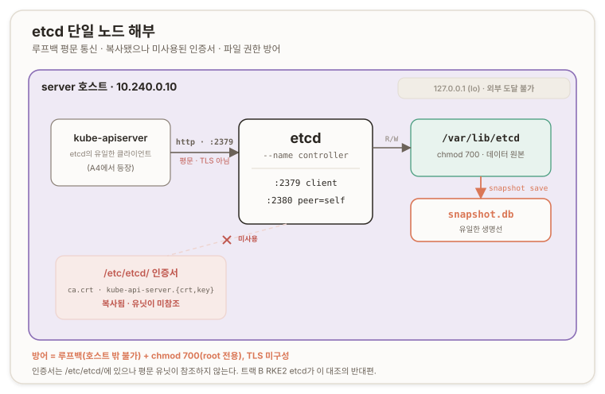

# etcd 부트스트랩 {#etcd-bootstrap}

## 개요 {#overview}

이 문서는 Kubernetes The Hard Way 트랙 A의 [리포 07](https://github.com/kelseyhightower/kubernetes-the-hard-way/blob/master/docs/07-bootstrapping-etcd.md)을 다룬다. 이 시리즈에서 **처음으로 클러스터 프로세스를 올리는** 지점이다. [저장 데이터 암호화 설정](./a2-data-encryption)까지 페이즈 1은 전부 Paper Work였다. **CA와 인증서, kubeconfig, 암호화 키까지 신원과 설정 산출물만 만들었고** 실행 중인 프로세스는 하나도 없었다. 여기서 **그 위에 etcd를 세운다.**

**etcd**는 클러스터의 모든 상태를 담는 단일 저장소다. apiserver가 이 위에 얹히므로([리포 08](https://github.com/kelseyhightower/kubernetes-the-hard-way/blob/master/docs/08-bootstrapping-kubernetes-controllers.md)), <u>etcd가 먼저 서야 그다음이 선다.</u> 이 구간은 server 한 대에 단일 노드 etcd를 부트스트랩하고, 살아 있음을 확인하고, 스냅샷으로 첫 백업을 뜨는 데까지다.

환경과 실행 위치는 [a1](./a1-pki-and-trust)·[a2](./a2-data-encryption)와 같다. 점프박스(jumpbox)에서 배송 명령을 실행하고, 배포 대상 컨트롤 플레인은 server(`10.240.0.10`) 하나다.

---

## 01. 기동 순서의 근거 {#boot-order-rationale}

etcd가 첫 프로세스인 이유는 의존성에 있다. etcd는 분산 키-값 저장소(distributed key-value store)이며, **쿠버네티스의 모든 상태가 오직 여기에만 산다**. Deployment, Secret, ConfigMap, 노드 목록 등 kubectl로 만드는 모든 객체가 etcd에 저장된다. apiserver·scheduler·controller-manager·kubelet은 자체 상태를 들고 있지 않고(stateless), 전부 etcd를 읽어 자기 세계관을 재구성한다.

<u>그래서 순서가 강제된다.</u> **apiserver는 etcd에 읽고 쓰는 것이** 존재 이유의 절반이라, etcd가 없으면 뜰 자리가 없다. A3(etcd) → A4(apiserver)는 뒤집을 수 없는 순서다. ([etcd Documentation](https://etcd.io/docs/), [Kubernetes · Operating etcd](https://kubernetes.io/docs/tasks/administer-cluster/configure-upgrade-etcd/))

이 지점에서 백업의 근거 절반이 이미 나온다. 다른 컴포넌트는 죽어도 재시작하면 etcd를 다시 읽어 복구한다. etcd가 죽으면 읽을 원본 자체가 사라지므로, 재구성할 대상이 없다.

## 02. Raft와 정족수 {#raft-and-quorum}

etcd가 분산 저장소이면서도 모든 노드가 같은 값을 보증하는 것은 Raft 합의 알고리즘(consensus algorithm) 덕분이다. 리더를 하나 뽑고, 모든 쓰기를 리더가 로그로 받아 팔로워에게 복제하며, 과반이 받았다고 확인해야 그 쓰기가 확정(commit)된다. 이 과반이 정족수(quorum)이고, 공식은 `floor(N/2)+1`이다. ([Raft Consensus Algorithm](https://raft.github.io/))

| 노드 수 N | 정족수 | 견디는 장애 수<br/>(fault tolerance) |
| :---: | :---: | :---: |
| **1** | **1** | **0** |
| **3** | **2** | **1** |
| **5** | **3** | **2** |
| | | |
| *2* | *1* | *1* |
| *4* | *2* | *2* |

여기서 두 결론이 나온다.

**첫째,** 실전 etcd가 홀수인 이유다. N=3과 N=4는 둘 다 장애 1대만 견디는데, 4대는 정족수가 3이라 고장 표면만 넓어진다. 짝수는 내결함성(fault tolerance)을 올리지 못하고 비용만 올리므로, 프로덕션은 3·5·7로 간다.

**둘째,** 이 랩이 지금 1대인 것의 함의다. N=1이면 정족수 1, 견디는 장애 0이다. 즉 **내결함성이 없다**. server의 디스크 하나가 나가면 클러스터 상태가 통째로 사라진다. 복제본이 없기 때문이다. Hard Way는 학습을 위해 의도적으로 단일 노드로 단순화했고, 이것이 백업 근거의 나머지 절반이다. 복제가 지켜주지 않으니 유일한 안전망은 스냅샷이다.

> [!CAUTION] REVIEW-REQUIRED
> Raft의 리더 선출·로그 복제·term·WAL(Write-Ahead Log) 내부는 트랙 B의 RKE2 HA(High Availability, 고가용성) etcd에서 재사용되는 깊은 층이다. 두 번째 참조가 생기는 시점에 `_concepts/raft-consensus.md` 근원 페이지로 분리하고, 이 절의 근원 서술을 링크로 교체한다.

## 03. 포트 2379와 2380 {#ports-2379-2380}

etcd는 포트를 둘 연다. 2379는 클라이언트 포트로, apiserver와 etcdctl이 여기로 붙어 읽고 쓴다. 2380은 피어 포트(peer port)로, etcd 노드끼리 Raft 트래픽을 주고받는다. 단일 노드에서는 2380의 피어가 자기 자신이며, 유닛의 `--initial-cluster controller=http://127.0.0.1:2380`이 "구성원 하나짜리 클러스터, 그 피어는 나"라고 선언한다.

## 04. 평문 루프백과 미사용 인증서 {#plaintext-loopback-unused-certs}

이 구간의 관찰 지점은 TLS다. 사전 예상은 페이즈 1의 인증서를 재사용해 etcd에 TLS를 거는 것이었으나, 리포는 그렇게 하지 않는다. 실제 `units/etcd.service`를 열면 네 URL이 전부 `http://127.0.0.1`이고, `--cert-file`·`--trusted-ca-file`·`--client-cert-auth` 계열 플래그가 하나도 없다. etcd가 루프백(loopback)에 평문으로 뜬다. ([units/etcd.service](https://github.com/kelseyhightower/kubernetes-the-hard-way/blob/master/units/etcd.service))

그런데 [리포 07](https://github.com/kelseyhightower/kubernetes-the-hard-way/blob/master/docs/07-bootstrapping-etcd.md)은 `ca.crt`, `kube-api-server.key`, `kube-api-server.crt`를 `/etc/etcd/`로 복사시킨다. **복사는 시키되 유닛은 참조하지 않는다.** _유닛에 인증서 플래그가 없고 스킴이 http인 이상 그 인증서들은 놓여만 있는 미사용 파일이다._ *([유닛](https://github.com/kelseyhightower/kubernetes-the-hard-way/tree/master/units)과 [07](https://github.com/kelseyhightower/kubernetes-the-hard-way/blob/master/docs/07-bootstrapping-etcd.md) bash 명령 두 소스로 추론 ─ 예전 클라우드 기반 Hard Way의 TLS 구성이 문서에 남긴 잔재로 보인다.)*

이 [a2](./a2-data-encryption)의 암호화 설정과 대비된다. 06의 암호화 설정은 지금 놀지만 페이즈 2에서 apiserver가 플래그로 소비한다. 반면 `/etc/etcd/`의 인증서는 이후에도 소비되지 않는다.

<br/>

그러면 이 판의 보안은 두 층으로 선다.

**하나,** etcd가 `127.0.0.1`에만 바인딩하므로 호스트 밖에서는 도달할 수 없다(루프백은 라우팅되지 않는다). apiserver가 같은 server 위에 얹히니 루프백으로 충분하다.

**둘,** 데이터 디렉터리 `/var/lib/etcd`에 `chmod 700`을 걸어 root만 접근하게 한다. 이 판의 etcd 방어는 TLS가 아니라 루프백 바인딩과 파일 권한이다.



주의할 것은 etcd가 TLS를 **못 거는** 것이 아니라 이 구성이 **안 건** 것이라는 점이다. etcd는 TLS를 완전히 지원하며, 프로덕션과 RKE2의 etcd는 TLS로 돈다. 이 대조가 트랙 B의 앵커다.

> **제품으로 접히는 지점.** RKE2의 etcd는 client·peer 양쪽에 TLS를 걸고 client-cert-auth로 상호 인증한다. Hard Way가 루프백 공존을 이유로 접은 이 TLS 계층을, 제품 콘솔은 노드 정보와 `tls-san`으로부터 자동 구성해야 한다. 손으로 "인증서를 복사해놓고 안 쓰는" 이 구성을 겪은 것이, 제품이 펴야 할 TLS 표면을 읽는 근거가 된다.

## 05. systemd 유닛 구조 {#systemd-unit}

TLS를 빼면 유닛은 단순하다. 멤버 이름은 `controller`, 데이터 디렉터리는 `/var/lib/etcd`, 클러스터 토큰은 `etcd-cluster-0`이다. 눈여겨볼 플래그는 `--initial-cluster-state new`로, "갓 태어나는 새 클러스터"라는 선언이다. 최초 부트스트랩에만 의미가 있고, **이미 도는 클러스터에 노드를 붙일 때는 `existing`을 쓴다.**

재시작 때마다 새로 부트스트랩하지 않는 이유가 여기 있다. etcd는 데이터 디렉터리에 멤버가 이미 초기화돼 있으면 `initial-cluster` 계열 플래그를 무시하고 기존 데이터로 뜬다. 그래서 유닛에 `new`가 남아 있어도 재시작이 안전하다(etcd 동작, 착수 시 재시작으로 확인 가능).

systemd 관점에서는 `Type=notify`가 핵심이다. etcd가 "준비됐다" 신호(sd_notify)를 보낼 때까지 systemd가 기다리므로, `systemctl start`가 반환됐다는 것은 etcd가 실제로 떴다는 뜻이다. 이 덕분에 나중에 apiserver를 이 유닛 뒤로 순서 지을 수 있다. `Restart=on-failure`와 `RestartSec=5`는 크래시 시 5초 뒤 자동 재시작을 건다.

## 06. 결정론적 멤버 ID {#deterministic-member-id}

기동 후 `etcdctl member list`가 낸 멤버 ID `6702b0a34e2cfd39`는 [리포 07](https://github.com/kelseyhightower/kubernetes-the-hard-way/blob/master/docs/07-bootstrapping-etcd.md) 문서에 박힌 예시 ID와 동일하다. 우연이 아니다. etcd 멤버 ID는 난수가 아니라 멤버 구성(피어 URL과 클러스터 토큰)에서 결정론적으로 파생되며, 리포와 같은 `--name`·`--initial-cluster`·`--initial-cluster-token`을 썼으니 파생 입력이 같아 출력 ID도 같다(etcd 동작, 논리적 추론에 따른 답. 리포 예시와의 일치가 그 증거다). 이 부트스트랩에 무작위 요소는 없고, 모든 값이 설정에서 결정론적으로 떨어진다.

## 07. 검증과 스냅샷 {#verification-and-snapshot}

검증은 두 단계다. `systemctl status etcd`가 `active (running)`인지 보고, `etcdctl member list`가 한 줄을 내는지 본다.

```ini
6702b0a34e2cfd39, started, controller, http://127.0.0.1:2380, http://127.0.0.1:2379, false
```

맨 끝 `false`는 이 멤버가 학습자(learner)가 아니라는 뜻이다. 이 명령이 TLS 인자(`--cacert` 등) 없이 맨몸으로 도는 것도 관찰 지점이다. 평문이라 인증서 플래그가 필요 없고, TLS etcd였다면 세 개의 인증서 플래그를 붙여야 했다.

마지막으로 스냅샷을 뜬다. A3의 주제가 백업이므로, 말로 끝내지 않고 실제 생명선을 하나 확보한다.

```ini
Snapshot saved at snapshot.db
Server version 3.6.0
```

이 스냅샷이 단일 노드 etcd의 유일한 복구 수단이다. 실전에서도 마찬가지로, 3·5·7대 HA에서도 백업은 필수다. 복제는 노드 한 대의 죽음만 막고, 논리적 손상(잘못된 대량 쓰기)·업그레이드 사고·정족수 상실은 복제가 막지 못한다. 그것은 스냅샷만 막는다. `etcdctl snapshot save`가 그 시점 일관성 있는 백업을 만든다.

> **제품으로 접히는 지점.** 제품의 RKE2UpgradeSvc는 업그레이드 전 사전준비로 etcd 백업을 박고, 실패 시 전체 etcd 복구로 롤백한다. 참조 배포인 NS의 Rancher 운영 환경도 etcd 스냅샷을 NFS에 두고 Rancher Backups로 백업한다. 손으로 단일 노드 etcd를 세우고 "이것이 죽으면 전부 죽는다"를 겪은 것이, 콘솔이 자동화할 백업·복구 표면을 읽는 근거가 된다.

---

## 부록 A. 핵심 어휘 빠른 참조 {#appendix-a-glossary}

| 용어 | 한 줄 정의 |
| --- | --- |
| **etcd** | 클러스터의 모든 상태를 담는 분산 키-값 저장소. apiserver의 유일한 백킹 스토어 |
| **Raft** | 리더 선출과 로그 복제로 분산 노드의 값을 일치시키는 합의 알고리즘 |
| **정족수(quorum)** | 쓰기 확정에 필요한 과반. `floor(N/2)+1` |
| **내결함성(fault tolerance)** | 클러스터가 견디는 장애 노드 수. `N − 정족수`. N=1이면 0 |
| **2379 / 2380** | 클라이언트 포트(apiserver·etcdctl) / 피어 포트(노드 간 Raft) |
| **`--initial-cluster-state`** | `new`는 최초 부트스트랩, `existing`은 기존 클러스터 합류 |
| **`Type=notify`** | etcd의 준비 신호(sd_notify)를 systemd가 기다리는 유닛 타입 |
| **멤버 ID** | 난수가 아니라 멤버 구성에서 결정론적으로 파생되는 식별자 |
| **loopback(`127.0.0.1`)** | 호스트 내부 전용 주소. 라우팅되지 않아 외부에서 도달 불가 |
| **스냅샷(snapshot)** | 그 시점 일관성 있는 etcd 백업. 단일 노드의 유일한 복구 수단 |
| **etcdutl** | etcd 3.6에서 스냅샷 status·restore를 맡는 오프라인 유틸리티 |
| **learner** | 투표에 참여하지 않고 로그만 따라잡는 멤버. 검증 출력의 `false`가 이 여부 |

---

## 부록 B. 명령어 빠른 참조 {#appendix-b-commands}

```bash
# === 배송 (jumpbox, 리포 디렉터리에서) ===
scp \
  downloads/controller/etcd \
  downloads/client/etcdctl \
  units/etcd.service \
  root@server:~/

# === 설치·배치 (server) ===
mv etcd etcdctl /usr/local/bin/
etcdctl version                     # 바이너리 실행·버전 확인 (arch 불일치면 여기서 터짐)

mkdir -p /etc/etcd /var/lib/etcd
chmod 700 /var/lib/etcd             # 데이터 디렉터리를 root 전용으로 잠금
cp ca.crt kube-api-server.key kube-api-server.crt /etc/etcd/   # 복사되나 유닛은 미참조

mv etcd.service /etc/systemd/system/
cat /etc/systemd/system/etcd.service   # 실측: http://127.0.0.1, TLS 플래그 없음 확인

# === 기동 (server) ===
systemctl daemon-reload
systemctl enable etcd
systemctl start etcd

# === 검증 (server) ===
systemctl status etcd               # active (running)
etcdctl member list                 # <id>, started, controller, :2380, :2379, false

# === 첫 백업 (server) ===
etcdctl snapshot save snapshot.db   # 평문이라 인증서 인자 불필요
```

---

## 개인 노트 {#personal-notes}

### 손때 검증 상태 {#hands-on-status}

이 구간은 전부 실습으로 닫혔다. 배송, 바이너리 설치, 유닛 배치와 실측, 기동, `member list` 검증, 스냅샷 저장까지 실제로 수행했고 각 단계를 출력으로 확인했다. 이번 구간은 삽질 없이 곧게 지나갔다.

가장 값이 나가는 자산은 인증서 실측이다. 유닛을 `cat`으로 열어 네 URL이 전부 `http://127.0.0.1`이고 인증서 플래그가 없음을 눈으로 확인한 것이, "리포가 `/etc/etcd/`에 복사시킨 인증서를 유닛이 참조하지 않는다"는 관찰의 경험적 증거다. [a1](./a1-pki-and-trust)의 apiserver SAN 실측(노드 IP 없음)과 같은 결의 실측이다.

버전에서 한 가지가 관찰됐다. `etcdctl version`은 `3.6.0-rc.3`(릴리스 후보, Release Candidate)을 냈는데, 스냅샷 출력의 `Server version`은 `3.6.0`(정식, General Availability)이다. 즉 서버 바이너리와 etcdctl 클라이언트의 버전이 어긋나 있다. 리포가 두 바이너리를 다른 시점에 핀한 흔적이다.

> [!CAUTION] REVIEW-REQUIRED
> 서버 빌드는 스냅샷 출력의 `Server version 3.6.0`으로만 확인했다. `etcd --version`으로 Git SHA까지 확정해 클라이언트(rc.3)와의 스큐를 정밀 기록한다. `etcdctl endpoint health`·`endpoint status`는 이번에 돌리지 않았으므로, 다음 세션에서 상태 검증을 보강한다.

### 심화로 가는 길 {#deeper}

- **Raft 내부**: 리더 선출, 로그 복제, term, WAL. 트랙 B HA etcd에서 재사용될 때 `_concepts/raft-consensus`로 분리한다.
- **etcd TLS**: client·peer 인증서와 client-cert-auth. 이 랩이 접은 계층으로, 트랙 B RKE2 etcd에서 실물로 본다.
- **정족수 동역학**: 3·5·7대에서 리더 장애·네트워크 분할 시 정족수가 어떻게 재구성되는가.
- **오프라인 복구**: etcd 3.6에서 `etcdutl snapshot restore`로 스냅샷을 되살리는 흐름. 복구 드라마는 트랙 B B4로 이어진다.
- **Day-2 유지보수**: 컴팩션(compaction)과 디프래그(defrag), 그리고 그것들이 데이터 디렉터리 크기에 미치는 영향.

### 자기 점검 {#self-check}

각 절이 왜 성립하는지를 한 줄로 재구성해 본다.

1. **왜 etcd가 가장 먼저인가** → 나머지 컴포넌트가 stateless라 etcd를 읽어 재구성하고, apiserver가 etcd에 의존하므로 순서가 강제된다 (→ 기동 순서의 근거).
2. **왜 지금 이 한 대가 위험한가** → N=1이면 내결함성이 `N − 정족수 = 0`이라, 디스크 하나가 나가면 복제본 없이 상태가 통째로 사라진다 (→ Raft와 정족수).
3. **왜 스냅샷이 유일한 안전망인가** → 복제는 노드 죽음만 막고, 논리 손상·정족수 상실은 스냅샷만 막으므로, HA에서도 백업은 필수다 (→ 검증과 스냅샷).
4. **왜 여기 TLS가 없어도 되나** → etcd가 루프백에만 바인딩해 호스트 밖에서 도달 불가하고, `chmod 700`이 파일 권한으로 막기 때문. TLS를 못 거는 게 아니라 안 건 것이다 (→ 평문 루프백과 미사용 인증서).
5. **왜 멤버 ID가 리포와 같은가** → 멤버 ID가 멤버 구성에서 결정론적으로 파생되고, 같은 구성 값을 썼기 때문 (→ 결정론적 멤버 ID).

이로써 **A-페이즈 2의 첫 프로세스가 섰다**. 다음은 A4 컨트롤 플레인(리포 08)에서 apiserver·controller-manager·scheduler를 올린다. 거기서 두 갈래가 맞물린다. apiserver가 [a2](./a2-data-encryption)의 암호화 설정을 `--encryption-provider-config`로 처음 소비하고, 동시에 이 etcd를 `http://127.0.0.1:2379`로 연결한다. 오늘 세운 저장소가 그때 첫 클라이언트를 맞는다.
