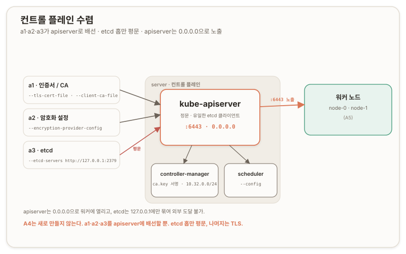

# 컨트롤 플레인 부트스트랩 {#control-plane-bootstrap}

## 개요 {#overview}

이 문서는 Kubernetes The Hard Way 트랙 A의 [리포 08](https://github.com/kelseyhightower/kubernetes-the-hard-way/blob/master/docs/08-bootstrapping-kubernetes-controllers.md)을 다룬다. [etcd 부트스트랩](./a3-etcd-bootstrap)에서 세운 저장소 위에 컨트롤 플레인 세 프로세스(kube-apiserver, kube-controller-manager, kube-scheduler)를 올린다.

a4의 성격은 한마디로 배선이다. 새로 만드는 산출물이 거의 없고, 페이즈 1·2에서 만든 것을 apiserver 설정에 연결한다. [a1](./a1-pki-and-trust)의 인증서와 kubeconfig, [a2](./a2-data-encryption)의 암호화 설정, [a3](./a3-etcd-bootstrap)의 etcd가 여기서 apiserver 하나로 수렴한다.

환경과 실행 위치는 이전 구간과 같다. 점프박스(jumpbox)에서 배송하고, 컨트롤 플레인은 server(`10.240.0.10`)에 올린다. server 위 kubectl은 `admin.kubeconfig`(주소 `127.0.0.1:6443`)로 apiserver를 로컬로 친다.

---

## 01. 세 컴포넌트와 역할 {#three-components}

컨트롤 플레인은 세 프로세스로 구성한다. ([Kubernetes Components](https://kubernetes.io/docs/concepts/overview/components/))

**apiserver**는 클러스터의 정문(front door)이자 유일한 etcd 클라이언트다. kubectl도 kubelet도 컨트롤러도 전부 apiserver에게 말하고, apiserver만 etcd에 읽고 쓴다. [a3](./a3-etcd-bootstrap)에서 etcd의 모든 요소에서 apiserver를 언급하며 설명했던 statements가 여기서 실물이 된다.

**controller-manager**는 조정 루프(reconciliation loop)의 집이다. 선언된 상태와 실제 상태가 어긋나면 계속 맞추는 컨트롤러 뭉치이며, 노드 컨트롤러와 서비스어카운트(ServiceAccount) 컨트롤러 등이 여기 산다. 그리고 kubelet 인증서를 CA로 서명하는 자리도 여기다. [a1](./a1-pki-and-trust)에서 server에만 `ca.key`를 배포한 이유가 이것이다.

**scheduler**는 아직 노드가 정해지지 않은 파드를 보고 어느 노드에 앉힐지 정하고, 파드를 바인딩한다. 역할이 그 하나뿐으로 좁은 편이다.

## 02. a1·a2·a3의 수렴 {#convergence}

a4의 핵심은 apiserver 유닛의 플래그를 여는 순간 드러난다. 지금까지 만든 산출물이 하나씩 자리를 찾아 들어간다. ([08 Bootstrapping the Kubernetes Control Plane](https://github.com/kelseyhightower/kubernetes-the-hard-way/blob/master/docs/08-bootstrapping-kubernetes-controllers.md))



- **etcd**([a3](./a3-etcd-bootstrap))는 **`--etcd-servers=http://127.0.0.1:2379`** 로 들어온다. 스킴이 `http`이고 인증서 인자가 하나도 없다. etcd를 평문 루프백으로 세운 이유가 여기서 나온다. apiserver가 같은 server 위에 얹혀 루프백으로 etcd를 치므로, TLS 없이 충분했다.

- **암호화 설정**([a2](./a2-data-encryption))은 `--encryption-provider-config=/var/lib/kubernetes/encryption-config.yaml`로 활성화된다. 이 플래그가 apiserver에 걸리는 순간부터 Secret이 **etcd**에 aescbc로 암호화돼 저장된다.

- **인증서**([a1](./a1-pki-and-trust))는 여러 플래그로 흩어져 들어온다.
  - apiserver의 서빙 인증서가 `--tls-cert-file=.../kube-api-server.crt`이고, `--client-ca-file=.../ca.crt`로 [a1](./a1-pki-and-trust#cert-distribution)이 서명한 클라이언트 인증서를 신뢰한다.
  - controller-manager는 `--cluster-signing-key-file=.../ca.key`로 kubelet 인증서를 서명하고([a5](./a5-worker-nodes.md)에서 워커가 붙을 때), `--service-cluster-ip-range=10.32.0.0/24`로 서비스 대역을 잡는다. [a1](./a1-pki-and-trust.md) SAN에서 본 `10.32.0.1`(apiserver ClusterIP)이 이 대역의 첫 IP다.
  - `--cluster-cidr=10.200.0.0/16`은 파드 대역(CIDR, Classless Inter-Domain Routing)으로, A6 라우트의 예고편이다.

한 가지 더 눈여겨볼 것은 apiserver가 kubelet에 거꾸로 붙을 때의 인증서다. `--kubelet-client-certificate=.../kube-api-server.crt`가 그것인데, **서버 인증서 `kube-api-server.crt`가 여기서는 클라이언트 인증서 역할도 겸한다.** 한 장이 서버로도 클라이언트로도 쓰인다.

> [!NOTE] A6 정정
> a4 시점의 apiserver 유닛에는 **`--advertise-address`와 `--service-cluster-ip-range`가 없었다.** 그래서 apiserver의 서비스 대역이 cm·인증서의 `10.32.0.0/24`가 아니라 기본 `10.0.0.0/24`로 돌았고, `kubernetes` 엔드포인트도 드리프트하는 eth0를 광고했다. [A6](./a6-pod-network-dns#three-layer-debug)에서 두 플래그(`--advertise-address=10.240.0.10`, `--service-cluster-ip-range=10.32.0.0/24`)를 넣어 정렬했다. 이 절의 `--service-cluster-ip-range=10.32.0.0/24` 서술은 controller-manager 기준이며, apiserver의 최종 정렬은 A6에서 이뤄졌다.

## 03. 노출과 TLS의 두 대조 {#exposure-and-tls}

apiserver와 etcd를 나란히 두면 두 대조가 드러난다.

첫째는 노출이다. etcd는 `127.0.0.1`에만 묶여 호스트 밖에서 도달할 수 없다. 반면 apiserver는 `--bind-address=0.0.0.0`으로 6443 포트를 모든 인터페이스에 연다. 워커 노드가 apiserver에 붙어야 하니 호스트 밖에서 닿아야 하기 때문이다. etcd는 밖에서 닿으면 안 되고 apiserver는 닿아야 한다. 노출 정책이 정반대다.

둘째는 TLS다. apiserver에서 etcd로 가는 홉만 평문이고(루프백이므로), apiserver에서 클라이언트로, apiserver에서 kubelet으로 가는 경로는 전부 TLS와 mTLS다. 이 판은 "루프백 etcd 한 홉을 제외하면 전부 TLS"인 구조다. [a3](./a3-etcd-bootstrap.md)에서 "TLS를 못 거는 게 아니라 루프백이라 안 건 것"이라 정리한 명제가 이 그림에서 정확히 맞아떨어진다.

## 04. 인가와 kubelet 접근 RBAC {#authz-and-kubelet-rbac}

apiserver는 `--authorization-mode=Node,RBAC`로 두 인가 모드를 겹쳐 쓴다.

- Node 인가자(authorizer)는 [a1](./a1-pki-and-trust.md)에서 kubelet 인증서를 `system:node:<노드명>`으로 발급한 그 신원을 읽어, kubelet이 자기 노드 것만 만지도록 이름으로 가른다.
- RBAC(Role-Based Access Control, 역할 기반 접근 제어)는 역할과 바인딩으로 권한을 준다. ([Node Authorization](https://kubernetes.io/docs/reference/access-authn-authz/node/), [RBAC](https://kubernetes.io/docs/reference/access-authn-authz/rbac/))

[리포 08](https://github.com/kelseyhightower/kubernetes-the-hard-way/blob/master/docs/08-bootstrapping-kubernetes-controllers.md) 끝에서 RBAC 하나를 apply한다. apiserver가 kubelet에 거꾸로 접속해야 할 때(로그 조회, exec, 메트릭)가 있고, 그 방향에도 권한이 필요하기 때문이다.

```yaml
kind: ClusterRole
metadata:
  name: system:kube-apiserver-to-kubelet
rules:
  - apiGroups: [""]
    resources: [nodes/proxy, nodes/stats, nodes/log, nodes/spec, nodes/metrics]
    verbs: ["*"]
---
kind: ClusterRoleBinding
metadata:
  name: system:kube-apiserver
roleRef: { kind: ClusterRole, name: system:kube-apiserver-to-kubelet }
subjects:
  - kind: User
    name: kubernetes
```

바인딩 대상이 User `kubernetes`인데, 이는 apiserver가 kubelet에 붙을 때 내미는 클라이언트 인증서 `kube-api-server.crt`의 CN(Common Name)이 `kubernetes`이기 때문이다(논리적 추론에 따른 답. 바인딩 주체와 인증서 CN이 일치해야 인가가 성립한다). 그 신원에 노드 하위 리소스 접근권을 준다.

> [!CAUTION] REVIEW-REQUIRED
> `kube-api-server.crt`의 CN이 실제로 `kubernetes`인지 `openssl x509 -in kube-api-server.crt -noout -subject`로 확정해 이 인과를 실측으로 못박는다.

## 05. systemd 유닛과 기동 순서 {#units-and-startup}

세 유닛에서 눈여겨볼 것은 apiserver에 **`Type=notify`** 가 없다는 점이다. etcd 유닛은 `Type=notify`라 준비 신호를 기다렸지만, apiserver 유닛은 타입 지정이 없어 기본값으로 동작한다. 그래서 `systemctl start`가 프로세스 생성 직후 즉시 반환하고, apiserver가 실제로 응답하기까지 약 10초가 더 걸린다. 리포가 "최대 10초"를 안내하는 이유다. 검증 명령 전에 이 대기를 넣어야 한다.

controller-manager와 scheduler는 <u>apiserver에 붙어 동작하므로,</u> apiserver가 떠 있어야 의미가 있다. 셋 중 apiserver가 실패하면 나머지 둘도 붙을 데가 없어 줄줄이 어긋난다. 세 유닛 모두 `Restart=on-failure`, `RestartSec=5`로 크래시 시 자동 재시작을 건다.

## 06. 이름 해석과 SAN 재확인 {#name-resolution-and-san}

검증 마지막에서 이 구간의 실측이 나왔다. jumpbox에서 apiserver를 이름으로 원격 호출하려 했으나 이름 해석이 실패했고, 그 원인과 교정이 a1의 SAN 실측을 다시 확인해 주었다.

> **박제: jumpbox의 FQDN 미해석**
>
>> **삽질.** <br/>
>> server에서 `kubectl cluster-info`가 정상 응답한 뒤, jumpbox에서 `curl --cacert ca.crt https://server.kubernetes.local:6443/version`을 쳤더니 `curl: (6) Could not resolve host: server.kubernetes.local`이 났다. 이어서 `https://127.0.0.1:6443`으로 우회하자 이번엔 `curl: (7) Failed to connect`가 났다.
>
>> **교정.** <br/>
>> 에러 6은 이름을 못 찾은 것이다. jumpbox `/etc/hosts`에 `server.kubernetes.local`이라는 FQDN(Fully Qualified Domain Name, 완전한 도메인 이름)이 없었다. server에는 있었기에 controller-manager와 scheduler가 그 이름으로 apiserver에 붙어 떴지만, jumpbox에는 박혀 있지 않았다. `echo "10.240.0.10 server.kubernetes.local" >> /etc/hosts`로 이름을 넣자 curl이 버전 JSON을 냈다. 두 번째 시도의 에러 7은 당연한데, jumpbox의 `127.0.0.1`은 jumpbox 자신이지 server가 아니기 때문이다.

여기서 IP로 우회하는 길은 막혀 있다. `https://10.240.0.10:6443`으로 붙으면 이번엔 TLS가 깨진다. a1에서 실측했듯 apiserver SAN에는 노드 IP가 없고 이름 `server.kubernetes.local`만 있다. TLS는 접속에 쓴 이름을 SAN과 대조하므로, IP로 붙으면 SAN에 그 IP가 없어 검증이 실패한다. 그래서 반드시 이름으로 붙어야 하고, 그 이름이 풀리도록 `/etc/hosts`에 박는다. jumpbox에 이 이름을 넣어 두면 리포 10(원격 kubectl)에서 관제소로 쓸 때 그대로 쓴다.

## 검증 {#verification}

검증은 두 층이고, 각각 다른 것을 증명한다.

server에서 `systemctl is-active kube-apiserver kube-controller-manager kube-scheduler`가 셋 다 `active`를 내고, `kubectl cluster-info --kubeconfig admin.kubeconfig`가 `https://127.0.0.1:6443`을 낸다. 이는 로컬에서 apiserver가 살아 있고 admin 인증서로 인증이 통과함을 증명한다.

jumpbox에서 `curl --cacert ca.crt https://server.kubernetes.local:6443/version`이 버전 JSON을 낸다. 이는 apiserver가 네트워크 너머에서 이름으로 도달 가능하고, 그 이름이 SAN과 대조돼 TLS가 통과함을 증명한다. 로컬 검증과는 다른 것을 본다.

```json
{ "major": "1", "minor": "32", "gitVersion": "v1.32.3", "platform": "linux/amd64", ... }
```

`v1.32.3`은 리포가 못 박은 K8s 버전이고, `linux/amd64`는 이 랩의 아키텍처다. 이 curl이 이름으로 성공했다는 것은, a1에서 이름 기반으로 설계한 SAN이 다른 호스트에서의 원격 TLS 접속으로 살아 있는 채 증명됐다는 뜻이다.

> **제품으로 접히는 지점.** 제품의 RKE2InstallSvc는 컨트롤 플레인 기동과 kubeconfig·노드 상태 점검을 자동화한다. 여기서 손으로 배선한 apiserver 플래그(etcd 주소, 암호화 설정, 인증서, 인가 모드)와 `tls-san`이 콘솔의 설정 표면에 대응하고, 두 층 검증(로컬 `cluster-info`와 원격 `curl`)이 점검 로직의 원형이 된다.

---

## 부록 A. 핵심 어휘 빠른 참조 {#appendix-a-glossary}

| 용어 | 한 줄 정의 |
| --- | --- |
| **kube-apiserver** | 클러스터의 정문이자 유일한 etcd 클라이언트. 모든 조작이 통과하는 허브 |
| **kube-controller-manager** | 조정 루프의 집. kubelet 인증서를 `ca.key`로 서명하는 자리 |
| **kube-scheduler** | 미배치 파드를 노드에 바인딩하는 프로세스 |
| **RBAC(Role-Based Access Control)** | 역할과 바인딩으로 권한을 주는 인가 모드 |
| **Node 인가자(authorizer)** | `system:node:<노드명>` 신원으로 kubelet 권한을 노드별로 가르는 인가 |
| **ClusterRole / ClusterRoleBinding** | 클러스터 범위 역할과, 그 역할을 신원에 묶는 바인딩 |
| **`--bind-address=0.0.0.0`** | apiserver를 모든 인터페이스에 여는 노출. etcd의 `127.0.0.1`과 정반대 |
| **`--encryption-provider-config`** | a2의 암호화 설정을 apiserver가 소비하는 플래그. Secret 암호화가 여기서 활성화 |
| **`service-cluster-ip-range` `10.32.0.0/24`** | 서비스 대역. `10.32.0.1`이 apiserver ClusterIP |
| **`cluster-cidr` `10.200.0.0/16`** | 파드 대역(CIDR). A6 라우트의 예고 |
| **`Type=notify` 부재** | apiserver 유닛엔 준비 신호 대기가 없어 `start`가 즉시 반환. 약 10초 대기 필요 |
| **FQDN(Fully Qualified Domain Name)** | 완전한 도메인 이름. `server.kubernetes.local`. `/etc/hosts`에 없으면 해석 실패 |

---

## 부록 B. 명령어 빠른 참조 {#appendix-b-commands}

```bash
# === 배송 (jumpbox, 리포 루트에서) ===
scp \
  downloads/controller/kube-apiserver \
  downloads/controller/kube-controller-manager \
  downloads/controller/kube-scheduler \
  downloads/client/kubectl \
  units/kube-apiserver.service units/kube-controller-manager.service units/kube-scheduler.service \
  configs/kube-scheduler.yaml configs/kube-apiserver-to-kubelet.yaml \
  root@server:~/

# === 바이너리 + 배치 (server) ===
mv kube-apiserver kube-controller-manager kube-scheduler kubectl /usr/local/bin/
mkdir -p /etc/kubernetes/config /var/lib/kubernetes/
mv ca.crt ca.key kube-api-server.key kube-api-server.crt \
   service-accounts.key service-accounts.crt encryption-config.yaml \
   kube-controller-manager.kubeconfig kube-scheduler.kubeconfig \
   /var/lib/kubernetes/                          # admin.kubeconfig는 /root/에 남긴다
mv kube-apiserver.service kube-controller-manager.service kube-scheduler.service /etc/systemd/system/
mv kube-scheduler.yaml /etc/kubernetes/config/

# === 기동 (server) ===
systemctl daemon-reload
systemctl enable kube-apiserver kube-controller-manager kube-scheduler
systemctl start  kube-apiserver kube-controller-manager kube-scheduler
sleep 10                                          # apiserver 초기화. Type=notify 없어 start는 즉시 반환

# === RBAC (server) ===
kubectl apply -f kube-apiserver-to-kubelet.yaml --kubeconfig admin.kubeconfig

# === 검증 (server, 마지막 줄은 jumpbox) ===
systemctl is-active kube-apiserver kube-controller-manager kube-scheduler
kubectl cluster-info --kubeconfig admin.kubeconfig       # → https://127.0.0.1:6443
# jumpbox: /etc/hosts에 이름 없으면 추가 후 원격 호출
echo "10.240.0.10 server.kubernetes.local" >> /etc/hosts
curl --cacert ca.crt https://server.kubernetes.local:6443/version   # → v1.32.3, linux/amd64
```

---

## 개인 노트 {#personal-notes}

### 손때 검증 상태 {#hands-on-status}

이 구간은 전부 실습으로 닫혔다. 배송, 바이너리 설치, 인증서·kubeconfig·암호화설정 배치, 세 유닛 기동, RBAC 적용, 두 층 검증까지 실제로 수행했다. `systemctl is-active`가 셋 다 `active`, `cluster-info`가 `127.0.0.1:6443`, jumpbox `curl`이 `v1.32.3`·`linux/amd64`를 냈다.

가장 값이 나가는 자산은 두 가지다. 하나는 수렴 자체를 실물로 확인한 것이다. apiserver가 etcd(a3)에 붙고, admin 인증서(a1)로 인증이 통과하고, 암호화 설정(a2)을 물고 떴다. 페이즈 1·2의 산출물이 apiserver 하나에서 배선되는 것을 검증으로 봤다. 다른 하나는 jumpbox FQDN 삽질이다. 이름 해석 실패를 교정하는 과정에서, apiserver SAN이 이름 기반이라 IP로는 TLS가 깨진다는 a1의 실측이 원격 접속으로 다시 확인됐다.

### 심화로 가는 길 {#deeper}

- **어드미션 플러그인**: `enable-admission-plugins`에 걸린 `NodeRestriction`·`ResourceQuota` 등이 각각 무엇을 검문하는가. `NodeRestriction`이 Node 인가자와 짝을 이루는 방식.
- **apiserver→kubelet mTLS**: 서버 인증서가 클라이언트 인증서를 겸하는 구조와, 그 CN이 RBAC 바인딩 주체와 맞물리는 인가 사슬.
- **HA 컨트롤 플레인**: apiserver 여러 대와 로드밸런서. 트랙 B의 RKE2·NS 레퍼런스가 이 위상을 실물로 보여준다.
- **스케줄러 설정**: `kube-scheduler.yaml`의 내부(kubeconfig 경로, 프로파일)와 스케줄링 프레임워크.
- **감사 로그**: `audit-log-*` 플래그가 남기는 것과 Day-2 운영에서의 활용.

### 자기 점검 {#self-check}

각 절이 왜 성립하는지를 한 줄로 재구성해 본다.

1. **왜 A4는 새로 만드는 게 적은가** → a1·a2·a3의 산출물을 apiserver 플래그에 배선하는 구간이기 때문 (→ a1·a2·a3의 수렴).
2. **왜 apiserver→etcd만 평문인가** → etcd가 같은 호스트의 루프백에 있어 TLS 없이 충분하고, 나머지 경로는 전부 TLS이기 때문 (→ 노출과 TLS의 두 대조).
3. **왜 server에만 `ca.key`가 갔나** → controller-manager가 `--cluster-signing-key-file`로 그 키를 써 kubelet 인증서를 서명하기 때문 (→ a1·a2·a3의 수렴).
4. **왜 apiserver에 10초를 기다리나** → 유닛에 `Type=notify`가 없어 `start`가 즉시 반환하고 실제 응답은 그 뒤이기 때문 (→ systemd 유닛과 기동 순서).
5. **왜 IP가 아니라 이름으로 붙어야 하나** → SAN이 이름 기반이라, IP로 붙으면 SAN에 그 IP가 없어 TLS가 깨지기 때문 (→ 이름 해석과 SAN 재확인).
6. **`cluster-info`와 `curl`은 각각 무엇을 증명하나** → 전자는 로컬 apiserver 기동과 인증을, 후자는 원격 이름 도달과 이름 기반 TLS를 증명한다 (→ 검증).

이로써 **컨트롤 플레인이 섰다**. 다음은 A5 워커(리포 09)에서 node-0·node-1에 containerd·kubelet·kube-proxy를 올린다. 데이터 플레인이 처음 서는 지점이고, a1에서 노드별로 구운 kubelet 인증서(`system:node:node-0/1`)와 이 문서에서 건 Node 인가자·kubelet RBAC가 그때 함께 실물이 된다.
