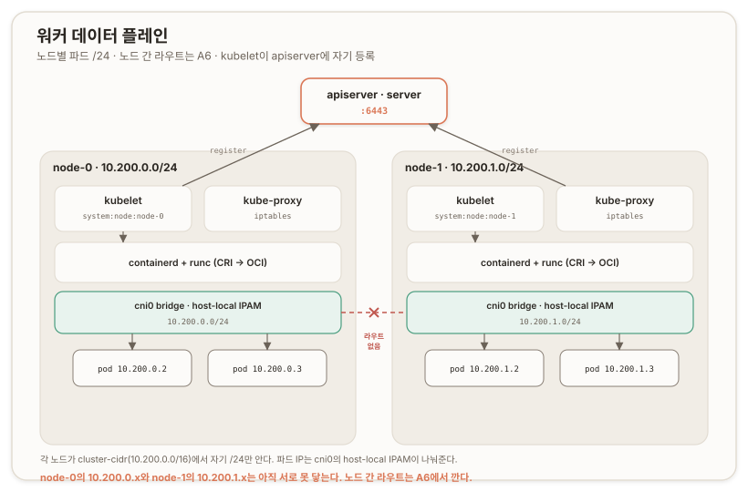

# 워커 노드 부트스트랩 {#worker-nodes-bootstrap}

## 개요 {#overview}

이 문서는 Kubernetes The Hard Way 트랙 A의 [리포 09](https://github.com/kelseyhightower/kubernetes-the-hard-way/blob/master/docs/09-bootstrapping-kubernetes-workers.md)를 다룬다. 데이터 플레인이 처음 서는 지점이다. [컨트롤 플레인 부트스트랩](./a4-control-plane)까지 server 한 대에 세운 클러스터에, 이제 파드를 실제로 돌릴 워커 node-0·node-1을 붙인다.

각 워커에 네 층을 얹는다. 컨테이너 런타임(containerd + runc), 파드 네트워크(CNI 플러그인 + 설정), 노드 에이전트(kubelet), 서비스 프록시(kube-proxy)다. [a1](./a1-pki-and-trust)에서 노드별로 발급한 kubelet 인증서(`system:node:node-0/1`)와 [a4](./a4-control-plane)에서 건 [Node 인가자·kubelet 접근 RBAC](./a4-control-plane.md#authz-and-kubelet-rbac)가 여기서 실물이 된다.

배포는 점프박스(jumpbox)에서 두 노드를 순회(loop)하며 진행하고, 설치는 각 노드에 접속해 실행한다. 노드별로 다른 값(파드 서브넷)은 배송 전에 점프박스에서 치환해 넣는다.

---

## 01. 워커 스택 {#stack}

워커는 아래에서 위로 네 층이다. ([Kubernetes Components](https://kubernetes.io/docs/concepts/overview/components/))

containerd(컨테이너 런타임)와 runc가 최하단이다. kubelet의 CRI(Container Runtime Interface, 컨테이너 런타임 인터페이스) 요청을 containerd가 받아 컨테이너를 관리하고, 실제로 프로세스를 낳는 최하단 OCI(Open Container Initiative) 런타임이 runc다. 순서는 kubelet → containerd → runc다.

CNI 플러그인(`/opt/cni/bin`)과 CNI 설정(`/etc/cni/net.d`)이 파드에 네트워크를 붙인다. bridge 플러그인이 `cni0` 브리지를 만들고, host-local IPAM(IP Address Management, IP 주소 관리)이 그 노드 몫의 서브넷에서 파드 IP를 나눠준다.

kubelet은 노드 에이전트다. apiserver에 노드를 등록하고, [a1](./a1-pki-and-trust.md#cert-distribution)의 노드별 인증서로 인증하고, containerd에 파드를 지시하고, `10250`에서 서빙한다. *([a4](./a4-control-plane.md#authz-and-kubelet-rbac)에서 건 apiserver→kubelet RBAC가 이 포트를 친다)*

kube-proxy는 Service를 iptables 규칙으로 구현한다. apiserver를 감시하다 ClusterIP를 파드 IP로 로드밸런싱하는 규칙을 iptables에 새긴다.

## 02. 노드별 파드 서브넷 {#per-node-pod-subnet}

a5의 핵심 설계는 <u>파드 주소 대역을 노드마다 쪼개는 것</u>이다. [a4](./a4-control-plane.md)에서 controller-manager에 건 `--cluster-cidr=10.200.0.0/16`을 노드마다 `/24`로 나눈다. node-0은 `10.200.0.0/24`, node-1은 `10.200.1.0/24`다. 이 값은 `machines.txt`의 4번째 열에 있고, 점프박스가 그 값을 읽어 각 노드의 CNI 설정에 치환해 배송한다.



그래서 node-0의 파드는 `10.200.0.x`, node-1의 파드는 `10.200.1.x`를 받는다. 그리고 여기가 a6의 씨앗이다. node-0의 파드가 node-1의 파드(`10.200.1.x`)로 가려면, 호스트에 "`10.200.1.0/24`는 node-1로"라는 라우트가 있어야 한다. 지금은 각 노드가 자기 `/24`만 안다. 노드 사이 라우트는 [파드 네트워크 라우트](./a6-pod-network-dns.md#pod-routes) 구간([리포 11](https://github.com/kelseyhightower/kubernetes-the-hard-way/blob/master/docs/11-pod-network-routes.md))에서 깐다. "파드망은 결국 라우팅"이 여기서 시작된다.

> [!CAUTION] REVIEW-REQUIRED
> 점프박스의 `sed "s|SUBNET|...|g"`는 `10-bridge.conf`와 `kubelet-config.yaml` 양쪽의 `SUBNET`을 채운다. `10-bridge.conf`의 `ipam.ranges.subnet`은 확인했으나, `kubelet-config.yaml` 쪽 `SUBNET` 필드가 `podCIDR`인지 실측으로 못박는다.

## 03. 브리지와 netfilter {#bridge-netfilter}

CNI bridge 설정(<u>[`10-bridge.conf`](https://github.com/kelseyhightower/kubernetes-the-hard-way/blob/master/configs/10-bridge.conf)</u>)은 `cni0` 브리지를 만들고, `isGateway`로 브리지에 게이트웨이 IP를 줘 **파드의 기본 게이트웨이가 되게 하며,** `ipMasq`로 파드가 클러스터 밖으로 나갈 때 노드 IP로 마스커레이드(masquerade, 출발지 NAT)한다.

설치 중에 커널 쪽 준비가 하나 붙는다. `modprobe br-netfilter`와 `net.bridge.bridge-nf-call-iptables = 1`이다. 이것이 없으면 브리지(`cni0`)를 지나는 파드 트래픽이 iptables를 거치지 않아, kube-proxy가 새긴 Service 규칙이 파드에 먹지 않는다. 브리지 트래픽을 netfilter로 통과시키는 커널 스위치이며, 빠뜨리면 노드가 `Ready`로 떠도 Service 네트워킹이 조용히 깨진다. ([sysctl bridge-nf-call-iptables](https://www.kernel.org/doc/Documentation/networking/ip-sysctl.txt))

> [!WARNING] 머리에 안 들어옴 ^0^ (여기서부터 리뷰작업 진행 중...)

## 04. kubelet 신원과 등록 {#kubelet-identity}

`kubelet-config.yaml`이 kubelet의 인증·인가·런타임 연결을 잡는다. 인증은 익명(anonymous)을 끄고 x509 클라이언트 인증서(clientCAFile = `ca.crt`)와 webhook을 쓰며, 인가는 Webhook 모드다. 즉 kubelet은 들어오는 요청의 허가 여부를 apiserver에 되물어 판단한다. kubelet 자신의 신원은 [a1](./a1-pki-and-trust.md)의 노드별 `kubelet.crt`·`kubelet.key`이고, 런타임 연결은 `containerRuntimeEndpoint`로 containerd 소켓을 가리킨다.

`registerNode: true`가 노드를 스스로 apiserver에 등록하게 한다. 그래서 kubelet이 뜨면 **`kubectl get nodes`** 에 노드가 나타난다. 이때 a4에서 건 Node 인가자가 그 `system:node:<노드명>` 신원을 검문해, 각 kubelet이 자기 노드 것만 만지도록 가른다. `cgroupDriver: systemd`는 containerd와 맞춰야 하는 값이다.

한 가지 짚을 것은 클러스터 DNS다. `kubelet-config.yaml`에 `clusterDNS`가 없어서, 지금 파드는 노드의 `resolv.conf`를 쓴다. 클러스터 내부 DNS(CoreDNS)는 이후 별도 DNS 애드온에서 얹는다.

> [!NOTE] A6 정정
> 리포 12는 DNS 애드온이 아니라 스모크 테스트이며, 현재 리포엔 DNS 문서가 없다. 클러스터 DNS는 [A6](./a6-pod-network-dns#coredns)에서 CoreDNS를 직접 배포하고 kubelet에 `clusterDNS: [10.32.0.10]`·`clusterDomain: cluster.local`을 넣어 얹었다. 또한 이 문서의 `resolvConf: /etc/resolv.conf`는 Ubuntu systemd-resolved 스텁이라 CoreDNS 루프를 유발해, A6에서 `/run/systemd/resolve/resolv.conf`로 정정했다(OS 선택이 실측에서 처음 닿은 예외).

## kube-proxy와 Service {#kube-proxy}

`kube-proxy-config.yaml`은 `mode: iptables`와 `clusterCIDR: 10.200.0.0/16`을 잡는다. kube-proxy는 이 kubeconfig(a1 배포)로 apiserver를 감시하다, Service의 ClusterIP를 뒤의 파드 IP들로 분산하는 규칙을 iptables에 새긴다. `clusterCIDR`이 파드망 통짜(`/16`)라, kube-proxy는 이 대역을 클러스터 내부로 인식해 외부로 나가는 트래픽의 마스커레이드 판단에 쓴다.

## 이름 드리프트 박제 {#hosts-drift}

이 구간의 실측은 검증에서 터졌다. 두 노드 설치를 마치고 `kubectl get nodes`를 쳤는데 노드가 하나도 없었다. 원인 추적이 a4의 이름 해석 문제를 근본에서 다시 설명해 주었다.

> **박제: cloud-init이 지우는 `/etc/hosts`**
>
>> **삽질.** <br/>
>> 두 노드에서 containerd·kubelet·kube-proxy가 `active`인데 `kubectl get nodes --kubeconfig admin.kubeconfig`가 `No resources found`를 냈다. 노드가 `NotReady`도 아니고 아예 0개였다.
>
>> **교정.** <br/>
>> 노드가 `NotReady`가 아니라 **아예 없다**는 것이 진단의 열쇠였다. containerd나 CNI 문제였다면 노드는 등록은 되되 `NotReady`로 떴을 것이다. 아예 없다는 것은 등록 이전, kubelet ↔ apiserver 연결 자체가 안 됐다는 뜻이다. kubelet의 kubeconfig는 apiserver를 `https://server.kubernetes.local:6443` 이름으로 가리키는데, 노드의 `/etc/hosts`에 그 FQDN(Fully Qualified Domain Name, 완전한 도메인 이름) 블록이 통째로 사라져 있었다. 원인은 cloud-init의 `update_etc_hosts` 모듈이다. `manage_etc_hosts`가 True라, 재부팅마다 `/etc/hosts`를 템플릿에서 다시 생성하며 손으로 넣은 `machines.txt` 블록을 지운다. 이것이 [a4](./a4-control-plane#name-resolution-and-san)의 "jumpbox가 이름을 못 푼다"를 근본에서 설명한다. jumpbox만 빈 것이 아니라, 재부팅을 먼저 겪은 머신부터 순서대로 `/etc/hosts`가 초기화되고 있었다.

교정의 방향이 중요하다. `manage_etc_hosts` 값은 `cloud.cfg`에 없었다(`cloud.cfg.d` 드롭인이나 Multipass user-data에서 설정됨). 값을 어디서 끄는지로 싸우면 우선순위가 더 높은 설정에 뒤집힐 수 있다. 그래서 값과 싸우는 대신, 재생성이 읽는 소스를 고쳤다. 템플릿 `/etc/cloud/templates/hosts.debian.tmpl`에 클러스터 FQDN 블록을 박으면, `/etc/hosts`가 재생성돼도 그 블록이 항상 렌더링돼 살아남는다. `cloud-init single --name update_etc_hosts`로 재부팅 없이 재생성을 돌려, 블록이 유지되는지 실측으로 확인했다.

> **제품으로 접히는 지점.** 이 이름 드리프트는 고정 IP 결정과 같은 성격의 문제다(소스에서 드리프트를 차단). 제품 콘솔의 RKE2InstallSvc가 사전준비에서 호스트명·`/etc/hosts`를 다루는 지점이 여기에 대응하고, 노드가 이름으로 서로를 확실히 푸는 것을 설치 성공의 전제로 삼아야 함을 이 삽질이 보여준다.

## 검증 {#verification}

배송·설치를 두 노드에 마치고, 이름 드리프트를 잡은 뒤, 점프박스에서 확인한다.

```text
NAME     STATUS   ROLES    AGE   VERSION
node-0   Ready    <none>   96s   v1.32.3
node-1   Ready    <none>   94s   v1.32.3
```

두 노드가 `Ready`로 뜨면 데이터 플레인이 처음 선 것이다. `Ready`는 kubelet이 apiserver에 등록되고, CNI가 준비돼 파드를 받을 수 있는 상태임을 뜻한다.

---

## 부록 A. 핵심 어휘 빠른 참조 {#appendix-a-glossary}

| 용어 | 한 줄 정의 |
| --- | --- |
| **containerd / runc** | 컨테이너 런타임과 그 아래 OCI 런타임. kubelet → containerd → runc |
| **CRI(Container Runtime Interface)** | kubelet이 컨테이너 런타임과 말하는 표준 인터페이스 |
| **CNI(Container Network Interface)** | 파드에 네트워크를 붙이는 플러그인 규격. bridge 플러그인이 `cni0`를 만듦 |
| **host-local IPAM** | 노드 로컬에서 그 노드 서브넷의 파드 IP를 나눠주는 IP 주소 관리 |
| **노드별 파드 `/24`** | cluster-cidr `/16`을 노드마다 쪼갠 대역. node-0 `10.200.0.0/24` 등 |
| **kubelet** | 노드 에이전트. 노드를 등록하고 파드를 containerd에 지시. `10250` 서빙 |
| **`registerNode: true`** | kubelet이 스스로 apiserver에 노드를 등록하는 설정 |
| **kube-proxy** | Service를 iptables 규칙으로 구현하는 프록시. `mode: iptables` |
| **br-netfilter** | 브리지 트래픽을 iptables로 통과시키는 커널 모듈·sysctl. Service 네트워킹 필수 |
| **`manage_etc_hosts`** | cloud-init이 `/etc/hosts`를 재생성하는 설정. True면 재부팅마다 수동 편집이 소실 |
| **FQDN(Fully Qualified Domain Name)** | 완전한 도메인 이름. `server.kubernetes.local` |

---

## 부록 B. 명령어 빠른 참조 {#appendix-b-commands}

```bash
# === 배송 (jumpbox, 리포 루트, 세 루프 다 node-0·node-1 순회) ===
for HOST in node-0 node-1; do                       # 노드별 SUBNET 치환
  SUBNET=$(grep ${HOST} machines.txt | cut -d " " -f 4)
  sed "s|SUBNET|$SUBNET|g" configs/10-bridge.conf     > 10-bridge.conf
  sed "s|SUBNET|$SUBNET|g" configs/kubelet-config.yaml > kubelet-config.yaml
  scp 10-bridge.conf kubelet-config.yaml root@${HOST}:~/
done
for HOST in node-0 node-1; do                       # 바이너리·설정·유닛
  scp downloads/worker/* downloads/client/kubectl \
    configs/99-loopback.conf configs/containerd-config.toml configs/kube-proxy-config.yaml \
    units/containerd.service units/kubelet.service units/kube-proxy.service \
    root@${HOST}:~/
done
for HOST in node-0 node-1; do scp downloads/cni-plugins/* root@${HOST}:~/cni-plugins/; done

# === 설치 (node-0에서, 끝나면 node-1에서 동일) ===
apt-get update && apt-get -y install socat conntrack ipset kmod
swapon --show && swapoff -a
mkdir -p /etc/cni/net.d /opt/cni/bin /var/lib/kubelet /var/lib/kube-proxy \
  /var/lib/kubernetes /var/run/kubernetes
mv crictl kube-proxy kubelet runc /usr/local/bin/
mv containerd containerd-shim-runc-v2 containerd-stress /bin/
mv cni-plugins/* /opt/cni/bin/
mv 10-bridge.conf 99-loopback.conf /etc/cni/net.d/
modprobe br-netfilter
echo "br-netfilter" >> /etc/modules-load.d/modules.conf
echo "net.bridge.bridge-nf-call-iptables = 1"  >> /etc/sysctl.d/kubernetes.conf
echo "net.bridge.bridge-nf-call-ip6tables = 1" >> /etc/sysctl.d/kubernetes.conf
sysctl -p /etc/sysctl.d/kubernetes.conf
mkdir -p /etc/containerd/
mv containerd-config.toml /etc/containerd/config.toml
mv containerd.service /etc/systemd/system/
mv kubelet-config.yaml /var/lib/kubelet/
mv kubelet.service /etc/systemd/system/
mv kube-proxy-config.yaml /var/lib/kube-proxy/
mv kube-proxy.service /etc/systemd/system/
systemctl daemon-reload
systemctl enable containerd kubelet kube-proxy
systemctl start  containerd kubelet kube-proxy

# === 이름 드리프트 차단 (각 머신, 재부팅 대비) ===
cat >> /etc/cloud/templates/hosts.debian.tmpl <<'EOF'
# --- k8s cluster (fixed IPs) ---
10.240.0.5  jumpbox.kubernetes.local jumpbox
10.240.0.10 server.kubernetes.local server
10.240.0.20 node-0.kubernetes.local node-0
10.240.0.21 node-1.kubernetes.local node-1
EOF
cloud-init single --name update_etc_hosts        # 재생성해도 블록 유지되는지 실측

# === 검증 (jumpbox) ===
ssh root@server "kubectl get nodes --kubeconfig admin.kubeconfig"   # node-0·node-1 Ready
```

---

## 개인 노트 {#personal-notes}

### 손때 검증 상태 {#hands-on-status}

이 구간은 실습으로 닫혔다. 두 노드에 배송·설치·기동을 마치고, 이름 드리프트를 잡은 뒤 `kubectl get nodes`에서 `node-0`·`node-1`이 `Ready`(v1.32.3)로 뜨는 것을 확인했다.

가장 값이 나가는 자산은 이름 드리프트 박제다. 노드가 0개라는 증상에서 "등록 이전의 연결 문제"로 진단을 좁힌 것, 그리고 원인이 cloud-init의 `/etc/hosts` 재생성이라는 것을 찾아 값과 싸우는 대신 템플릿을 고쳐 소스에서 끊은 것이 핵심이다. 이 발견이 a4의 이름 해석 문제를 근본에서 재설명한다.

### 심화로 가는 길 {#deeper}

- **CNI 내부**: bridge 플러그인이 veth 쌍과 `cni0`를 만드는 과정, host-local IPAM의 IP 할당 상태 파일.
- **kube-proxy 모드**: iptables와 IPVS의 차이, 그리고 트랙 C의 Cilium eBPF가 kube-proxy를 대체하는 지점.
- **containerd 설정**: `config.toml`의 CRI 플러그인, cgroup 드라이버, 샌드박스 이미지.
- **cgroup과 kubelet 회계**: `cgroupDriver: systemd`가 containerd와 맞아야 하는 이유, `failSwapOn: false`의 함의.
- **DNS 지연**: `clusterDNS` 부재로 지금 파드가 노드 `resolv.conf`를 쓰는 상태와, 리포 12 CoreDNS 애드온의 역할.

### 자기 점검 {#self-check}

각 절이 왜 성립하는지를 한 줄로 재구성해 본다.

1. **왜 파드 대역을 노드마다 `/24`로 쪼개나** → cluster-cidr `/16`을 노드별로 나눠 host-local IPAM이 겹치지 않게 IP를 주기 위해. 그리고 그 경계가 A6 라우트의 단위가 된다 (→ 노드별 파드 서브넷).
2. **왜 br-netfilter가 필요한가** → 없으면 브리지를 지나는 파드 트래픽이 iptables를 안 거쳐 kube-proxy의 Service 규칙이 먹지 않기 때문 (→ 브리지와 netfilter).
3. **왜 노드가 스스로 등록되나** → `registerNode: true`라 kubelet이 apiserver에 노드를 만들고, a4의 Node 인가자가 그 신원을 검문하기 때문 (→ kubelet 신원과 등록).
4. **왜 노드 0개가 CNI 문제가 아니었나** → CNI 문제였다면 등록은 되되 `NotReady`로 떴을 것이므로, 아예 없다는 것은 등록 이전 연결 문제이기 때문 (→ 이름 드리프트 박제).
5. **왜 값이 아니라 템플릿을 고쳤나** → `manage_etc_hosts` 값이 상위 설정에서 뒤집힐 수 있어, 재생성이 읽는 소스(템플릿)를 고치는 편이 확실하기 때문 (→ 이름 드리프트 박제).

이로써 **데이터 플레인이 처음 섰다**. 다만 노드 간 파드 트래픽은 아직 못 흐른다. 각 노드가 자기 `/24`만 알기 때문이다. 다음은 A6(리포 11·12), 노드 사이에 파드 라우트를 깔아 파드망을 잇고 CoreDNS로 클러스터 DNS를 얹는다. 도식의 그 빨간 빗금, 노드 간 라우트 부재를 거기서 메운다. "파드망은 결국 라우팅"의 본편이다.
