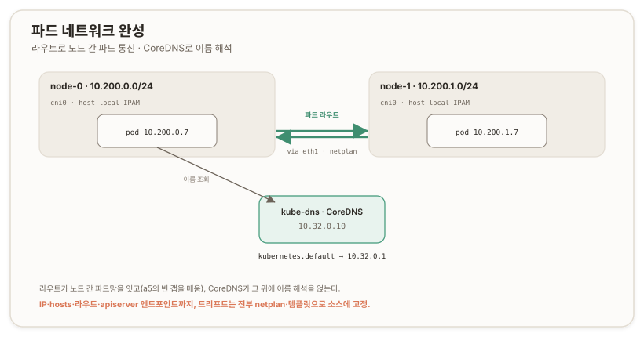

# 파드 네트워크 라우트와 DNS {#pod-network-and-dns}

## 개요 {#overview}

이 문서는 Kubernetes The Hard Way 트랙 A의 리포 10~11과, 리포에 없는 DNS 애드온을 다룬다. 페이즈 2의 마지막 실질 구간이며(리포 12는 스모크 테스트다), [워커 노드](./a5-worker-nodes)에서 각 노드가 자기 `/24`만 알던 상태에 노드 간 라우트를 깔아 파드망을 잇고, 그 위에 CoreDNS로 이름 해석을 얹는다.

세 조각이다. 원격 kubectl(리포 10)로 점프박스(jumpbox)에서 직접 클러스터를 조작하고, 파드 라우트(리포 11)로 노드 간 파드 통신을 열고, CoreDNS를 의도적 애드온으로 배포한다. DNS는 현재 리포에 문서가 없어(구 버전의 애드온이 빠졌다) 직접 얹는다.



## 원격 kubectl {#remote-kubectl}

점프박스에 admin 인증서로 kubeconfig를 만들어, `ssh root@server "kubectl ..."` 없이 점프박스에서 바로 클러스터를 친다. `admin.crt`·`admin.key`·`ca.crt`는 [a1](./a1-pki-and-trust)에서 점프박스에 만들었으니 그 자리에 있다. `set-cluster`·`set-credentials`·`set-context`·`use-context` 네 명령이 `~/.kube/config`를 만들고, 서버 주소는 `https://server.kubernetes.local:6443`이다. 이 이름은 [a5의 hosts 드리프트 교정](./a5-worker-nodes#hosts-drift)으로 템플릿에 박아둔 그 FQDN이 값을 한다.

## 파드 라우트와 파드망 {#pod-routes}

이 구간이 트랙 A 네트워킹의 핵심이다. a5에서 각 노드는 자기 `/24`만 안다(node-0 `10.200.0.0/24`, node-1 `10.200.1.0/24`). 노드를 넘는 파드 통신에 필요한 것은 오버레이도, 캡슐화도, 터널도 아니다. **"어느 `/24`가 어느 노드에 사느냐"는 L3(Layer 3, 3계층) 라우트 한 줄씩**이다. node-0의 파드가 `10.200.1.5`로 패킷을 보내면, node-0 커널이 "`10.200.1.0/24`는 `10.240.0.21`(node-1)로"라는 라우트를 보고 그 노드로 넘기고, 받은 node-1이 자기 `cni0` 브리지로 파드에 꽂는다. 리눅스 라우팅 테이블이 파드망의 전부다. "파드망은 결국 라우팅"의 실체가 여기 있다. ([11 Pod Network Routes](https://github.com/kelseyhightower/kubernetes-the-hard-way/blob/master/docs/11-pod-network-routes.md))

리포는 `ip route add`로 런타임 라우트를 넣지만, 그것은 재부팅에 사라진다. IP와 `/etc/hosts`에 이어 드리프트의 세 번째 표면이다. 그래서 netplan에 라우트를 박아 영속화했다(각 인터페이스의 `routes:` 블록). 적용 후 `ip route`에 `proto static`으로 뜨는 것이 netplan이 소스가 됐다는 표시다.

> **결정: netplan 라우트 영속화.** 런타임 `ip route add` 대신 netplan `routes:`로 박은 것은, 고정 IP·hosts 템플릿과 같은 '소스에서 드리프트 차단' 결정이다. 트랙 B의 RKE2에서 Rocky Linux 게스트를 다룰 때도 같은 방식이 이어지므로 맥락이 연속된다.

## CoreDNS 직접 배포 {#coredns}

DNS는 리포에 문서가 없다. 리포 12는 스모크 테스트이고, 구 GCP 버전에 있던 DNS 애드온 문서가 현재 no-cloud 버전에서 빠졌다. 그래서 CoreDNS를 의도적 애드온으로 직접 얹는다. ServiceAccount·ClusterRole·ClusterRoleBinding·ConfigMap(Corefile)·Deployment·Service(ClusterIP `10.32.0.10`) 한 벌을 배포하고, 각 노드 kubelet에 `clusterDNS: [10.32.0.10]`·`clusterDomain: cluster.local`을 넣어 파드가 그 DNS를 쓰게 한다([a5](./a5-worker-nodes)가 비워둔 자리다). ([CoreDNS](https://coredns.io/manual/toc/))

## 세 겹 삽질 {#three-layer-debug}

CoreDNS 하나를 세우는 데 세 겹의 문제를 통과했다. 각각이 다른 층의 교훈이다.

> **박제 1: Corefile 인라인 블록**
>
>> **삽질.** <br/>
>> CoreDNS 파드가 `CrashLoopBackOff`, 로그에 `Corefile:3 ... unexpected line ending after '}'`. 매니페스트의 Corefile에서 `health { lameduck 5s }`와 `forward . /etc/resolv.conf { max_concurrent 1000 }`를 한 줄로 썼다.
>
>> **교정.** <br/>
>> CoreDNS Corefile(Caddyfile 포맷)은 인라인 블록을 받지 않는다. `{`는 줄 끝에, 내용은 다음 줄, `}`는 제 줄에 있어야 한다. 두 블록을 여러 줄로 펴자 파싱이 통과했다. (초안 매니페스트의 저자 실수였다.)

> **박제 2: 서비스 대역 불일치**
>
>> **삽질.** <br/>
>> `Service "kube-dns" is invalid ... failed to allocate IP 10.32.0.10 ... valid range is 10.0.0.0/24`. 즉 apiserver의 실제 서비스 대역은 `10.32.0.0/24`가 아니라 기본값 `10.0.0.0/24`였다.
>
>> **교정.** <br/>
>> a4의 apiserver 유닛에 `--service-cluster-ip-range`가 없어 기본 `10.0.0.0/24`로 돌고 있었다. 반면 controller-manager는 `10.32.0.0/24`, 인증서 SAN도 `10.32.0.1`이다. apiserver만 어긋난 것이다. 리포는 클러스터 내부 파드가 없어 이 불일치를 밟지 않는데, CoreDNS가 첫 내부 파드로 그것을 드러냈다. apiserver에 `--service-cluster-ip-range=10.32.0.0/24`를 넣어 나머지와 정렬하고, 대역 밖이 된 기존 `kubernetes` 서비스(`10.0.0.1`)를 지워 apiserver가 `10.32.0.1`로 재생성하게 했다. `10.0.0.10`으로 CoreDNS를 굽히는 길은 막혀 있었다. 그러면 `kubernetes`가 `10.0.0.1`이 되는데, 그 IP는 인증서 SAN에 없어 파드의 TLS가 깨지기 때문이다.

> **박제 3: systemd-resolved 루프**
>
>> **삽질.** <br/>
>> CoreDNS 파드가 다시 죽고, 로그에 `[FATAL] plugin/loop: Loop ... detected for zone "."`.
>
>> **교정.** <br/>
>> Ubuntu의 systemd-resolved는 `/etc/resolv.conf`에 실제 서버가 아니라 스텁(stub) `127.0.0.53`을 둔다. a5의 kubelet `resolvConf: /etc/resolv.conf`가 그 스텁을 파드에 물려주고, CoreDNS의 `forward . /etc/resolv.conf`가 그것을 상류로 삼아 자기에게 되던지는 루프가 생겼다. kubelet `resolvConf`를 실제 상류 파일 `/run/systemd/resolve/resolv.conf`로 바꾸고 kubelet·CoreDNS를 재시작하자 해소됐다. 원장의 "배포판 차이는 실질적으로 안 닿는다"는 판단이 처음으로 닿은 예외가 이 자리다. systemd-resolved의 스텁 resolv.conf가 그것이다.

## 상류 정정 {#upstream-corrections}

[a4](./a4-control-plane)에 apiserver 유닛의 두 누락 플래그를 정정했다. `--advertise-address=10.240.0.10`(kubernetes 엔드포인트를 안정 eth1로 고정)과 `--service-cluster-ip-range=10.32.0.0/24`(서비스 대역을 cm·인증서와 정렬)이다. a4는 대역을 `10.32`로 전제했으나 apiserver는 플래그 누락으로 기본 `10.0`으로 돌고 있었고, 그 정정을 이 문서의 박제 2로 링크했다.

[a5](./a5-worker-nodes)에 kubelet `resolvConf`를 `/run/systemd/resolve/resolv.conf`로 정정하고, "DNS는 리포 12 애드온" 서술을 "리포에 DNS 문서 없음, A6에서 CoreDNS 직접 배포"로 교체했다.

[a1](./a1-pki-and-trust)은 정정하지 않는다. `10.32.0.1` SAN 언급은 apiserver 대역 정렬 이후 오히려 실제와 일치하게 됐다. 상류가 앞서 있었고 현실이 따라잡은 사후 정합이다.

## 검증 {#verification}

점프박스에서 새 파드로 이름을 조회한다.

```text
Server:    10.32.0.10
Name:      kubernetes.default
Address 1: 10.32.0.1 kubernetes.default.svc.cluster.local
```

DNS 서버가 `10.32.0.10`(kube-dns), `kubernetes.default`가 `10.32.0.1`로 풀린다. 이로써 라우트로 파드망을 잇고 그 위에 이름 해석을 얹은 데이터 플레인이 완성됐다. CoreDNS 파드가 각 노드(`10.200.0.7`, `10.200.1.7`)에 떠서 안정적으로 `Running`인 것과, apiserver에 TLS로 닿는 것이 대역 정렬이 옳았다는 증거다.

> **제품으로 접히는 지점.** apiserver와 controller-manager의 서비스 대역 일치, 그리고 apiserver `advertise-address`가 안정 IP를 가리키는 것은 콘솔이 강제해야 할 불변식이다. 리포처럼 내부 파드가 없으면 드러나지 않지만, CoreDNS·CNI 같은 첫 애드온에서 즉시 터진다. RKE2InstallSvc가 사후 검증에 DNS 조회를 포함해야 하는 근거가 여기 있다.

---

## 부록 A. 핵심 어휘 빠른 참조 {#appendix-a-glossary}

| 용어 | 한 줄 정의 |
| --- | --- |
| **파드 라우트(L3 route)** | 노드 커널의 정적 라우트. "어느 파드 `/24`가 어느 노드냐"를 담아 노드 간 파드망을 잇는다 |
| **`proto static`** | `ip route`에서 netplan 등 설정이 관리하는 라우트 표시. 런타임 추가와 구분 |
| **CoreDNS / kube-dns** | 클러스터 DNS. Service `kube-dns`(ClusterIP `10.32.0.10`)로 노출, 이름을 ClusterIP로 해석 |
| **`clusterDNS` / `clusterDomain`** | kubelet이 파드에 알려주는 DNS 서버와 도메인. 없으면 파드가 클러스터 DNS를 못 씀 |
| **서비스 대역(service CIDR)** | Service ClusterIP가 할당되는 대역. apiserver·cm·인증서 SAN이 일치해야 함(`10.32.0.0/24`) |
| **`--advertise-address`** | apiserver가 `kubernetes` 서비스 엔드포인트로 광고하는 IP. 안정 IP(eth1)로 고정 |
| **Corefile(Caddyfile)** | CoreDNS 설정. 블록 `{ }`는 여러 줄이어야 하며 인라인 불가 |
| **systemd-resolved 스텁** | `/etc/resolv.conf`의 `127.0.0.53`. CoreDNS 상류로 쓰면 루프. 실제 파일은 `/run/systemd/resolve/resolv.conf` |

---

## 부록 B. 명령어 빠른 참조 {#appendix-b-commands}

```bash
# === 원격 kubectl (jumpbox) ===
kubectl config set-cluster kubernetes-the-hard-way \
  --certificate-authority=ca.crt --embed-certs=true \
  --server=https://server.kubernetes.local:6443
kubectl config set-credentials admin --client-certificate=admin.crt --client-key=admin.key
kubectl config set-context kubernetes-the-hard-way --cluster=kubernetes-the-hard-way --user=admin
kubectl config use-context kubernetes-the-hard-way
kubectl get nodes

# === 파드 라우트 (jumpbox) ===
{
  NODE_0_IP=$(grep node-0 machines.txt | cut -d " " -f 1)
  NODE_0_SUBNET=$(grep node-0 machines.txt | cut -d " " -f 4)
  NODE_1_IP=$(grep node-1 machines.txt | cut -d " " -f 1)
  NODE_1_SUBNET=$(grep node-1 machines.txt | cut -d " " -f 4)
}
ssh root@server  "ip route add ${NODE_0_SUBNET} via ${NODE_0_IP}; ip route add ${NODE_1_SUBNET} via ${NODE_1_IP}"
ssh root@node-0  "ip route add ${NODE_1_SUBNET} via ${NODE_1_IP}"
ssh root@node-1  "ip route add ${NODE_0_SUBNET} via ${NODE_0_IP}"

# === netplan 영속화 (각 머신, eth1 스탠자에 routes: 추가 후) ===
#   routes:
#     - { to: 10.200.1.0/24, via: 10.240.0.21 }   # 노드마다 상대 대역
netplan apply
ip route          # proto static 확인

# === apiserver 정합 (server, 유닛 ExecStart에 추가) ===
#   --advertise-address=10.240.0.10
#   --service-cluster-ip-range=10.32.0.0/24
systemctl daemon-reload && systemctl restart kube-apiserver
kubectl delete svc kubernetes            # 대역 밖 옛 서비스 삭제 → 10.32.0.1로 재생성

# === CoreDNS 배포 (jumpbox) ===
kubectl apply -f coredns.yaml
kubectl -n kube-system rollout restart deployment coredns
kubectl -n kube-system get pods -l k8s-app=kube-dns -o wide

# === kubelet DNS·루프 교정 (각 노드) ===
#   resolvConf: "/run/systemd/resolve/resolv.conf"
#   clusterDomain: "cluster.local"
#   clusterDNS: ["10.32.0.10"]
systemctl restart kubelet

# === 검증 (jumpbox) ===
kubectl run dnstest --image=busybox:1.28 --restart=Never -it --rm -- nslookup kubernetes.default
```

---

## 개인 노트 {#personal-notes}

### 손때 검증 상태 {#hands-on-status}

이 구간은 실습으로 닫혔다. 원격 kubectl, 파드 라우트(런타임 + netplan 영속), CoreDNS 배포, kubelet DNS 교정, 이름 조회까지 수행했다. `nslookup kubernetes.default`가 `10.32.0.1`로 풀리는 것으로 완성을 확인했다.

가장 값이 나가는 자산은 세 겹 삽질이다. Corefile 문법(초안 실수), 서비스 대역 불일치(apiserver의 누락 플래그가 첫 내부 파드에서 드러남), systemd-resolved 루프(OS 선택이 처음 닿은 지점). 셋 다 코덱스 부분 수정 규칙에 따라 상류 문서로 정정을 반영했다.

### 심화로 가는 길 {#deeper}

- **CNI 없는 라우팅**: static route CNI의 한계와, 오버레이(VXLAN)·BGP·eBPF가 이를 대체하는 방식. 트랙 C Cilium 캡스톤과 이어진다.
- **kube-proxy와 Service 경로**: ClusterIP DNAT부터 파드까지의 iptables 경로 추적.
- **CoreDNS 플러그인**: `kubernetes` 플러그인의 서비스·엔드포인트 감시, `forward`·`cache`·`loop`의 역할.
- **서비스 대역 변경 운영**: 이미 도는 클러스터에서 service CIDR을 바꿀 때의 절차와 위험.
- **apiserver 엔드포인트 조정자**: `kubernetes` 서비스가 `advertise-address`로 유지되는 메커니즘.

### 자기 점검 {#self-check}

각 절이 왜 성립하는지를 한 줄로 재구성해 본다.

1. **왜 파드망에 오버레이가 없어도 되나** → 노드마다 겹치지 않는 `/24`를 주고, "어느 `/24`가 어느 노드냐"를 L3 라우트로 알려주면 커널 라우팅만으로 노드 간 파드 통신이 되기 때문 (→ 파드 라우트와 파드망).
2. **왜 노드 0개가 아니라 서비스 IP에서 처음 터졌나** → apiserver·cm·인증서의 서비스 대역 불일치는 내부 파드가 ClusterIP를 쓸 때 처음 드러나고, CoreDNS가 그 첫 파드였기 때문 (→ 세 겹 삽질).
3. **왜 CoreDNS를 `10.0.0.10`으로 안 바꿨나** → 그러면 `kubernetes`가 `10.0.0.1`이 되는데 인증서 SAN에 없어 TLS가 깨지므로, apiserver를 `10.32`로 정렬하는 게 맞기 때문 (→ 세 겹 삽질).
4. **왜 DNS 루프가 났나** → Ubuntu systemd-resolved의 스텁 `127.0.0.53`을 CoreDNS 상류로 물려받아 자기에게 되던졌기 때문. 실제 상류 파일로 바꿔 해소 (→ 세 겹 삽질).
5. **왜 라우트를 netplan에 박았나** → 런타임 라우트는 재부팅에 사라지므로, 소스에 박아 드리프트를 끊기 위해 (→ 파드 라우트와 파드망).

이로써 **A-페이즈 2가 사실상 완성**이다. 컨트롤 플레인·워커·파드 라우팅·DNS까지 맨바닥에서 다 올렸다. 남은 것은 A7, 리포 12 스모크 테스트로 저장 데이터 암호화(a2 검증 포함)·디플로이·서비스·exec·로그를 실증하고 정리하는 일이다. 오늘 세운 클러스터가 실제로 일하는지를 거기서 확인한다.
