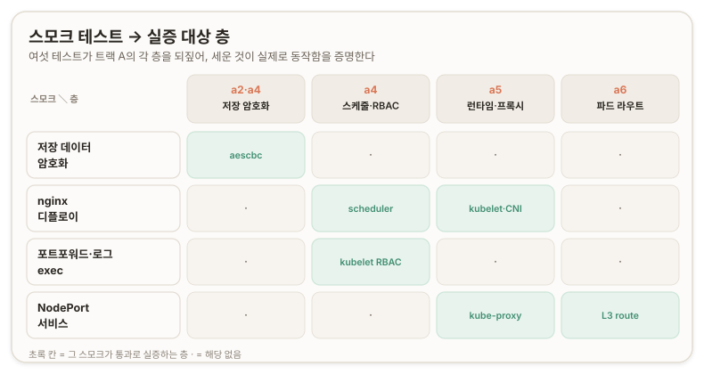

# 스모크 테스트와 트랙 A 마감 {#smoke-test-and-track-a-close}

## 개요 {#overview}

이 문서는 Kubernetes The Hard Way 트랙 A의 리포 12(스모크 테스트)를 다루고, 그로써 트랙 A를 닫는다. [파드 네트워크 라우트와 DNS](./a6-pod-network-dns)까지 맨바닥에서 세운 클러스터가 실제로 일하는지를 여섯 테스트로 실증하는 검증 구간이다. 새로 세우는 인프라는 없다. 지금까지 올린 층을 하나씩 건드려 "떴다"가 아니라 "동작한다"를 확인한다.

이 세션의 중심은 저장 데이터 암호화(encryption at rest) 검증이다. [a2](./a2-data-encryption)에서 암호화 설정을 만들며 "지금은 놀지만 페이즈 2에서 검증한다"고 미뤄둔 그 키가, 여기서 etcd에 실제로 암호문을 쓰고 있음을 눈으로 본다. 여섯 테스트 각각이 특정 페이즈를 실증하므로, 스모크는 트랙 A 전체를 한 번에 되짚는 회로 시험이 된다. ([12 Smoke Test](https://github.com/kelseyhightower/kubernetes-the-hard-way/blob/master/docs/12-smoke-test.md))

---



## 스모크의 의미 {#what-smoke-proves}

여섯 테스트는 "되나 보자"가 아니다. 각 테스트가 오늘 세운 특정 층을 골라 건드려, 그 층이 실제로 동작함을 증명한다. 네 묶음으로 갈린다.

저장 데이터 암호화는 [a2](./a2-data-encryption)의 EncryptionConfig와 [a4](./a4-control-plane#convergence)의 `--encryption-provider-config` 플래그를 실증한다. Secret을 만들어 etcd를 직접 열면, 값이 평문이 아니라 암호문으로 저장돼 있다.

nginx 디플로이는 스케줄러(a4)와 kubelet·containerd·runc·CNI(a5)를 한 줄로 실증한다. 파드가 `Running`에 이르려면 이 사슬 전체가 살아 있어야 한다.

포트포워드·로그·exec는 apiserver가 kubelet에 거꾸로 접속하는 경로와, 그 방향을 여는 [a4의 kubelet 접근 RBAC](./a4-control-plane#authz-and-kubelet-rbac)를 실증한다.

NodePort 서비스는 kube-proxy의 iptables 규칙과 br-netfilter([a5](./a5-worker-nodes#kube-proxy))와 파드 라우트([a6](./a6-pod-network-dns#pod-routes))를 실증한다. 클러스터 밖에서 들어온 요청이 파드까지 닿는 데이터 플레인 종단 경로다.

## 저장 데이터 암호화 검증 {#encryption-at-rest}

이 검증이 오늘의 하이라이트이며, a2를 갚는 장면이다. Secret 하나를 만들고, etcd에 저장된 그 원본 바이트를 직접 들여다본다.

```bash
kubectl create secret generic kubernetes-the-hard-way --from-literal="mykey=mydata"
ssh root@server 'etcdctl get /registry/secrets/default/kubernetes-the-hard-way | hexdump -C'
```

두 번째 명령이 핵심이다. `kubectl get secret`이 아니라 `etcdctl`로 저장소를 직접 친다. apiserver를 거치면 복호화된 값이 나오므로, 암호화 여부를 보려면 apiserver를 우회해 etcd의 원본을 봐야 한다. hexdump의 핵심 대목은 이렇다.

```text
00000020  65 74 65 73 2d 74 68 65  2d 68 61 72 64 2d 77 61  |etes-the-hard-wa|
00000030  79 0a 6b 38 73 3a 65 6e  63 3a 61 65 73 63 62 63  |y.k8s:enc:aescbc|
00000040  3a 76 31 3a 6b 65 79 31  3a 3d e8 51 36 43 9c b5  |:v1:key1:=.Q6C..|
```

읽는 법이 중요하다. 앞부분 키 경로(`/registry/secrets/default/kubernetes-the-hard-way`)는 오른쪽 ASCII 열에 그대로 읽힌다. etcd의 키(key)는 암호화 대상이 아니기 때문이다. 그래야 apiserver가 `/registry/secrets/...` 접두로 범위 조회(range query)를 돌려 Secret 목록을 훑을 수 있다. 반면 값(value)은 `k8s:enc:aescbc:v1:key1:` 접두 뒤로 전부 판독 불가한 바이트다. `mydata`라는 평문이 어디에도 나타나지 않는다.

접두가 스스로를 설명한다. `k8s:enc`는 쿠버네티스 암호화 봉투(envelope)임을, `aescbc`는 AES-CBC(Advanced Encryption Standard, Cipher Block Chaining) 방식임을, `key1`은 복호화에 쓸 키의 이름을 가리킨다. 이 `key1`이 a2에서 EncryptionConfig에 적은 바로 그 키 이름이다. 만약 암호화가 걸리지 않았다면(`identity` 프로바이더로 돌았다면) 이 자리에 `mykey`·`mydata`가 읽히는 평문으로 나왔을 것이다. ([Encrypting Confidential Data at Rest](https://kubernetes.io/docs/tasks/administer-cluster/encrypt-data/))

> **a2를 갚는 지점.** a2 문서 끝에서 암호화 키의 실제 활성화 검증을 페이즈 2로 미뤘다. 그 미룬 빚이 이 hexdump 한 장으로 갚아진다. a1(신원)에서 a2(암호화 설정)로, a3(etcd)로, a4(apiserver 배선)로 이어진 사슬이 여기서 "Secret이 디스크에 암호문으로 앉는다"는 한 장면으로 수렴한다.

한 가지 비대칭이 이 검증의 핵심 논리다. 키 경로는 읽히는데 값은 안 읽힌다. 이 어긋남이 정확히 "값에만 암호화가 걸렸다"의 증거다. 만약 전체가 암호화됐다면 apiserver가 키로 Secret을 찾지 못하고, 전체가 평문이면 디스크를 얻은 공격자가 값을 바로 읽는다. 저장 데이터 암호화는 조회 가능성을 위해 키는 남기고, 기밀성을 위해 값만 가리는 그 사이의 선택이다.

> **제품으로 접히는 지점.** 저장 데이터 암호화 활성 여부는 콘솔이 사후 점검으로 확인해야 할 불변식이다. RKE2InstallSvc가 설치 후 검증에 "Secret이 etcd에 암호문으로 저장되는가"를 포함하면, 암호화 프로바이더 설정이 실제로 걸렸는지를 배포 밖에서 증명할 수 있다. RKE2는 이 설정을 자동화하지만, 검증의 원형은 이 hexdump다.

## 워크로드 스케줄링 실증 {#workload-scheduling}

nginx 디플로이먼트(Deployment)를 만들어 파드가 실제로 뜨는지 본다.

```bash
kubectl create deployment nginx --image=nginx:latest
kubectl get pods -l app=nginx        # Running 뜰 때까지
```

파드가 `ContainerCreating`을 거쳐 `Running`에 이르는 짧은 과정에 사슬 전체가 관여한다. 스케줄러(a4)가 미배치 파드를 보고 노드를 골라 바인딩하고, 그 노드의 kubelet(a5)이 배정을 받아 containerd에 파드를 지시하고, containerd 아래 runc가 컨테이너 프로세스를 낳고, CNI bridge 플러그인(a5)이 `cni0`에서 파드 IP를 붙인다. 하나라도 끊기면 파드는 `Running`에 닿지 못한다. `Running` 한 줄이 스케줄링·런타임·네트워크 세 층의 동시 통과를 뜻한다. ([Deployments](https://kubernetes.io/docs/concepts/workloads/controllers/deployment/))

## apiserver→kubelet 스트리밍 경로 {#apiserver-kubelet-streaming}

포트포워드·로그·exec 세 조작은 겉보기가 다르지만 같은 경로를 실증한다. 셋 다 apiserver가 kubelet에 거꾸로 접속해야 성립한다.

```bash
POD_NAME=$(kubectl get pods -l app=nginx -o jsonpath="{.items[0].metadata.name}")
kubectl port-forward $POD_NAME 8080:80 &
curl --head http://127.0.0.1:8080      # HTTP/1.1 200 OK
kubectl logs $POD_NAME
kubectl exec -ti $POD_NAME -- nginx -v  # nginx version: nginx/1.31.2
```

`kubectl logs`가 컨테이너 로그를 가져오고 `kubectl exec`가 파드 안에서 명령을 실행할 때, 요청은 apiserver를 지나 대상 파드가 앉은 노드의 kubelet(`10250`)으로 프록시된다. 이 역방향 접속에는 별도의 권한이 필요하고, 그것이 [a4에서 apply한 `system:kube-apiserver-to-kubelet` RBAC](./a4-control-plane#authz-and-kubelet-rbac)다. `nodes/log`·`nodes/proxy` 같은 하위 리소스 접근권이 여기서 실제로 소비된다. exec가 `nginx/1.31.2`를 뱉는 것은 그 경로가 파드 내부까지 뚫렸다는 뜻이다.

> **박제: 포트포워드 포그라운드 블로킹**
>
>> **삽질.** <br/>
>> `kubectl port-forward $POD_NAME 8080:80`를 포그라운드로 띄운 직후 `curl`을 쳤더니 `curl: (7) Failed to connect to 127.0.0.1 port 8080`이 났다.
>
>> **교정.** <br/>
>> `kubectl port-forward`는 포그라운드에서 터널을 붙잡고 블로킹한다. 같은 셸에서 곧바로 이어 친 `curl`은 포워딩이 준비되기 전에 실행돼 연결할 상대가 없었다. 포워딩을 백그라운드(`&`)로 돌려 `Forwarding from 127.0.0.1:8080 -> 80`이 뜬 뒤 `curl`을 치자 `HTTP/1.1 200 OK`(Server: nginx/1.31.2)가 나왔다. 뒤이은 `kill %1`은 잡 번호가 어긋나 빗나갔고(`no such job`), 백그라운드 포워딩이 살아남아 세션 끝의 `pkill -f "port-forward"`로 정리했다. 절차상의 순서 문제이지 클러스터 결함이 아니다. ([kubectl port-forward](https://kubernetes.io/docs/reference/kubectl/generated/kubectl_port-forward/))

## NodePort 서비스 도달성 {#nodeport-reachability}

마지막 테스트는 클러스터 밖에서 파드까지 닿는 종단 경로다.

```bash
kubectl expose deployment nginx --port 80 --type NodePort
NODE_PORT=$(kubectl get svc nginx -o jsonpath='{.spec.ports[0].nodePort}')
NODE_NAME=$(kubectl get pods -l app=nginx -o jsonpath="{.items[0].spec.nodeName}")
curl -I http://${NODE_NAME}:${NODE_PORT}   # nginx 응답 헤더
```

NodePort 서비스는 모든 노드의 한 포트(기본 30000~32767 범위)를 열고, 그 포트로 들어온 요청을 뒤의 파드로 넘긴다. `curl`이 nginx 헤더(`HTTP/1.1 200 OK`, Server: nginx/1.31.2)를 받으면 여러 층이 동시에 증명된다. kube-proxy(a5)가 NodePort를 파드 IP로 향하는 iptables 규칙으로 구현했고, br-netfilter(a5)가 브리지를 지나는 파드 트래픽을 iptables로 통과시켜 그 규칙이 먹었고, 파드가 다른 노드에 있었다면 파드 라우트(a6)가 노드 간 전달을 이었다. ([Service — type NodePort](https://kubernetes.io/docs/concepts/services-networking/service/#type-nodeport))

한 가지 이름 의존이 여기서도 값을 한다. `NODE_NAME`은 IP가 아니라 노드 이름(`node-0` 등)이라, jumpbox의 `/etc/hosts`에 그 노드 FQDN이 풀려야 `curl`이 대상을 찾는다. [a5에서 템플릿에 박은 클러스터 FQDN 블록](./a5-worker-nodes#hosts-drift)이 이 조회를 받쳐준다.

> [!CAUTION] REVIEW-REQUIRED
> 이 검증은 파드가 앉은 노드(`NODE_NAME`) 하나로만 NodePort에 접속했다. NodePort의 정의는 "모든 노드"에서 열리는 것이므로, 파드가 없는 다른 노드의 IP로도 같은 `NODE_PORT`가 응답하는지를 확인하면 kube-proxy가 전 노드에 규칙을 심었다는 것과, 그 홉이 파드 라우트를 타는 것까지 함께 실증된다. 다음 세션 재개 시 점검한다.
>
>> [REVIEWED] B3에서 파드 없는 노드 도달로 종결.

> **제품으로 접히는 지점.** 콘솔의 설치 후 검증에 워크로드 배포와 서비스 도달성 확인을 포함하면, "노드가 Ready"를 넘어 "실제 트래픽이 파드까지 흐른다"를 배포 성공의 기준으로 삼을 수 있다. 이 스모크 흐름이 그 점검 로직의 원형이다.

## 정리 보류 결정 {#cleanup-deferred}

리포 13은 multipass 인스턴스 삭제다. 지금은 실행하지 않는다.

> **결정: 트랙 A VM 보존.** 리포 13(삭제) 대신 `multipass stop --all`로 네 VM을 세워만 둔다. 두 가지 이유다. 하나는 커널 재부팅 후 고정 IP·`/etc/hosts`·파드 라우트의 영속화 검증이 아직 남았다는 것이고, 다른 하나는 오늘 세운 클러스터를 지우기 아깝다는 것이다. 트랙 B의 RKE2는 새 VM(Rocky Linux)으로 가지만, 메모리가 빡빡하면 트랙 A VM은 삭제가 아니라 정지로 비켜 두면 된다. 그래서 A7의 실질은 스모크까지이고, 삭제는 트랙 A의 필수 단계가 아니다.

```text
Name       State     IPv4   Image
jumpbox    Stopped   --     Ubuntu 24.04 LTS
node-0     Stopped   --     Ubuntu 24.04 LTS
node-1     Stopped   --     Ubuntu 24.04 LTS
server     Stopped   --     Ubuntu 24.04 LTS
```

## 검증 {#verification}

여섯 테스트가 전부 통과했다. 두 결과가 트랙 A의 종결을 대표한다.

첫째는 저장 데이터 암호화다. hexdump에서 키 경로는 읽히고 값은 `k8s:enc:aescbc:v1:key1:` 접두 뒤로 판독 불가였다. a2의 키가 etcd를 실제로 암호화하고 있다는 물증이다.

둘째는 NodePort 도달성이다. `curl -I http://${NODE_NAME}:${NODE_PORT}`가 nginx 응답 헤더를 냈다.

```text
HTTP/1.1 200 OK
Server: nginx/1.31.2
Content-Type: text/html
Content-Length: 896
```

나머지도 모두 초록이었다. 디플로이는 `Running`, 포트포워드는 `HTTP/1.1 200`, 로그와 exec는 `nginx/1.31.2`를 냈다. nginx가 기대했던 `1.27.x`가 아니라 `1.31.2`인 것은 이미지 태그가 `:latest`라 최신을 당겼기 때문이며, 스모크의 목적(경로 실증)에는 영향이 없다. 검증을 마친 뒤 백그라운드 포트포워드를 `pkill -f "port-forward"`로 정리하고, 네 VM을 `multipass stop --all`로 정지했다.

---

## 부록 A. 핵심 어휘 빠른 참조 {#appendix-a-glossary}

| 용어 | 한 줄 정의 |
| --- | --- |
| **스모크 테스트(smoke test)** | 세운 시스템이 최소 동작하는지 빠르게 훑는 검증. 각 테스트가 특정 층을 실증 |
| **저장 데이터 암호화(encryption at rest)** | Secret 등을 etcd 디스크에 암호문으로 저장. apiserver가 읽을 때 복호화 |
| **`etcdctl get ... \| hexdump`** | apiserver를 우회해 etcd 원본 바이트를 직접 조회. 암호화 여부 확인용 |
| **`k8s:enc:aescbc:v1:key1:`** | 암호화 봉투(envelope) 접두. 방식(aescbc)과 키 이름(key1)을 담고 뒤는 암호문 |
| **AES-CBC(aescbc)** | Advanced Encryption Standard, Cipher Block Chaining. a2 EncryptionConfig의 방식 |
| **키·값 비대칭** | etcd 키(경로)는 평문, 값만 암호화. 조회 가능성과 기밀성의 절충 |
| **디플로이먼트(Deployment)** | 파드 복제와 롤아웃을 관리하는 워크로드. `Running`이 사슬 통과의 증거 |
| **`kubectl port-forward`** | 로컬 포트를 파드 포트로 잇는 터널. 포그라운드 블로킹이라 백그라운드로 돌림 |
| **`kubectl exec` / `logs`** | 파드 안 명령 실행·로그 조회. apiserver→kubelet 프록시 경로를 씀 |
| **NodePort** | 모든 노드의 한 포트를 열어 파드로 넘기는 Service 타입. 기본 30000~32767 |
| **apiserver→kubelet RBAC** | `system:kube-apiserver-to-kubelet`. `nodes/log`·`nodes/proxy` 등 역방향 접근권 |

---

## 부록 B. 명령어 빠른 참조 {#appendix-b-commands}

```bash
# === ① 저장 데이터 암호화 검증 (jumpbox → server) ===
kubectl create secret generic kubernetes-the-hard-way --from-literal="mykey=mydata"
ssh root@server 'etcdctl get /registry/secrets/default/kubernetes-the-hard-way | hexdump -C'
#   기대: 키 경로는 ASCII로 읽히고, 값은 k8s:enc:aescbc:v1:key1: 접두 뒤 암호문

# === ② 디플로이 + 파드 확인 (jumpbox) ===
kubectl create deployment nginx --image=nginx:latest
kubectl get pods -l app=nginx            # Running 확인

# === ③ 포트포워드 (백그라운드로, curl 후 정리) ===
POD_NAME=$(kubectl get pods -l app=nginx -o jsonpath="{.items[0].metadata.name}")
kubectl port-forward $POD_NAME 8080:80 &     # 포그라운드는 블로킹 → 백그라운드
curl --head http://127.0.0.1:8080            # HTTP/1.1 200 OK

# === ④ 로그 + exec (apiserver→kubelet RBAC 경로) ===
kubectl logs $POD_NAME
kubectl exec -ti $POD_NAME -- nginx -v       # nginx version: nginx/1.31.2

# === ⑤ NodePort 서비스 ===
kubectl expose deployment nginx --port 80 --type NodePort
NODE_PORT=$(kubectl get svc nginx -o jsonpath='{.spec.ports[0].nodePort}')
NODE_NAME=$(kubectl get pods -l app=nginx -o jsonpath="{.items[0].spec.nodeName}")
curl -I http://${NODE_NAME}:${NODE_PORT}     # nginx 헤더 (jumpbox /etc/hosts에 노드 FQDN 필요)

# === 뒷정리 ===
pkill -f "port-forward"                       # 백그라운드 포워딩 종료
# (호스트 PowerShell) multipass stop --all    # 삭제 아님, 정지 (트랙 B 대비 메모리 확보)
```

---

## 개인 노트 {#personal-notes}

### 손때 검증 상태 {#hands-on-status}

이 구간은 실습으로 닫혔다. 여섯 스모크(암호화, 디플로이, 포트포워드, 로그, exec, NodePort)를 전부 수행해 모두 통과를 확인했다. 특히 `etcdctl ... | hexdump`로 Secret이 etcd에 `k8s:enc:aescbc:v1:key1:` 암호문으로 앉는 것을, `curl -I`로 NodePort가 파드까지 닿는 것을 눈으로 봤다.

가장 값이 나가는 자산은 암호화 hexdump다. a2에서 미뤄둔 키의 활성화를, 파생 값이 아니라 저장소 원본 바이트로 증명했다. 키 경로는 읽히고 값만 안 읽히는 비대칭이 곧 "값에만 암호화가 걸렸다"의 증거라는 점이 이 검증의 핵심 논리다.

### 심화로 가는 길 {#deeper}

- **암호화 프로바이더와 키 로테이션**: `identity`·`aescbc`·`secretbox`·KMS(Key Management Service) 프로바이더의 차이와, 프로바이더 순서가 복호화·재암호화에 갖는 의미. 키를 바꿀 때 기존 Secret을 다시 써 전체를 재암호화하는 절차.
- **kube-proxy 서비스 경로 추적**: NodePort·ClusterIP 요청이 iptables 체인(`KUBE-SERVICES` 등)을 지나 파드로 DNAT되는 경로를 `iptables -t nat -L`로 따라가기.
- **port-forward·exec의 스트리밍**: apiserver가 kubelet으로 여는 스트림 프로토콜(SPDY에서 WebSocket으로의 전환)과 그 보안 함의.
- **NodePort 대 LoadBalancer·Ingress**: 온프레미스에서 외부 노출을 다루는 상위 방식과, 트랙 B RKE2의 기본 인그레스(Traefik) 연결점.

### 자기 점검 {#self-check}

각 스모크가 왜 그 층을 증명하는지 한 줄로 재구성해 본다.

1. **왜 `kubectl get secret`이 아니라 `etcdctl`로 봤나** → apiserver를 거치면 복호화된 값이 나오므로, 암호화 여부는 저장소 원본을 직접 봐야 드러나기 때문 (→ 저장 데이터 암호화 검증).
2. **왜 키 경로는 읽히고 값만 안 읽히나** → etcd 키를 암호화하면 apiserver가 Secret을 범위 조회로 못 찾으므로, 조회 가능성을 위해 키는 남기고 기밀성을 위해 값만 가리기 때문 (→ 저장 데이터 암호화 검증).
3. **왜 `Running` 한 줄이 세 층을 증명하나** → 파드가 뜨려면 스케줄러 배치, kubelet·containerd 실행, CNI IP 부여가 모두 통과해야 하기 때문 (→ 워크로드 스케줄링 실증).
4. **왜 logs·exec가 RBAC를 실증하나** → 두 조작은 apiserver가 kubelet에 역방향으로 붙어야 하고, 그 권한이 a4의 `system:kube-apiserver-to-kubelet` 바인딩이기 때문 (→ apiserver→kubelet 스트리밍 경로).
5. **왜 NodePort curl 하나가 여러 층을 증명하나** → 외부 요청이 파드에 닿으려면 kube-proxy 규칙, br-netfilter 통과, 필요 시 파드 라우트가 함께 동작해야 하기 때문 (→ NodePort 서비스 도달성).

이로써 **트랙 A를 완주했다**. A3 etcd부터 A7 스모크까지 다섯 페이즈에 걸쳐, 맨바닥에서 도는 쿠버네티스를 세우고 그것이 실제로 일함을 증명했다. 다음은 트랙 B다. 같은 클러스터를 RKE2로 한 번에 세워, 손으로 배선한 이 모든 층이 배포 도구 안에서 어떻게 접히는지를 대조한다. 트랙 A에서 판 골수가 트랙 B에서 각 설정 항목의 근거가 된다.
