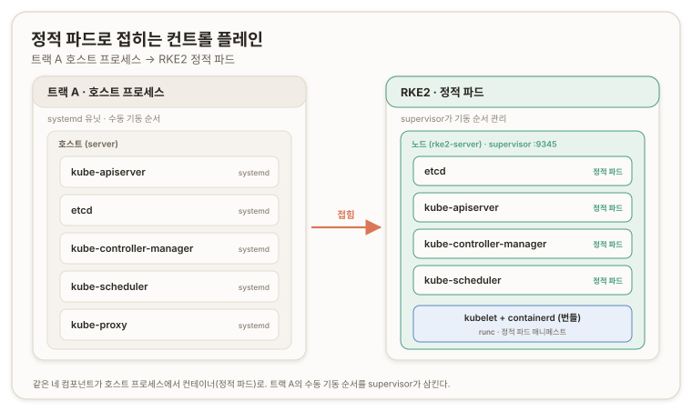

# 서버·에이전트 설치 {#install-server-and-agents}

## 개요 {#overview}

이 문서는 트랙 B의 실제 설치 구간이다. [트랙 B 랩과 노드 사전준비](./b1-lab-and-node-prep)에서 B2 설치 직전 상태까지 만든 세 노드에, RKE2를 올린다. 서버부터 `config.yaml`을 박고 설치하고, 그 위에 에이전트 두 대를 붙인다. [b0](./b0-what-rke2-folds)에서 개념으로 그린 접힘이 여기서 실물이 된다. 트랙 A가 여덟 문서에 걸쳐 손으로 배선한 신원·저장소·컨트롤 플레인·워커가, RKE2에선 노드마다 `config.yaml` 한 장과 설치 한 줄로 접힌다.

환경은 [b1](./b1-lab-and-node-prep#lab-topology)과 같다. `rke2-server`(Ubuntu, `10.240.0.30`), `rke2-agent-0`(Ubuntu, `10.240.0.31`), `rke2-agent-1`(Rocky Linux 10, `10.240.0.32`)이며, 핀은 `v1.35.6+rke2r1`이다.



## config.yaml 키 매핑 {#config-key-mapping}

RKE2는 `/etc/rancher/rke2/config.yaml`을 설치 전에 읽는다. 그러므로 이 파일을 먼저 박고 설치한다. 서버 설정은 다음과 같고, 각 키가 트랙 A의 어느 손배선을 접는지로 읽는다. ([RKE2 Server Config](https://docs.rke2.io/reference/server_config))

```yaml
token: <공유-토큰>
node-ip: 10.240.0.30
tls-san:
  - 10.240.0.30
cni: calico
cluster-cidr: 10.42.0.0/16
service-cidr: 10.43.0.0/16
write-kubeconfig-mode: "0644"
```

`token`은 노드 합류의 공유 비밀(shared secret)이다. [a1](./a1-pki-and-trust)에서 kubeconfig와 클라이언트 인증서로 손수 배선한 신원 합류가, RKE2에선 이 한 줄로 접힌다. 이 토큰은 새 노드 합류 인증에도, 클러스터 부트스트랩 데이터 암호화에도 쓰인다. 미지정이면 무작위로 생성되지만, 에이전트가 재사용할 값이라 `openssl rand -hex 24`로 만들어 명시로 잡는다.

`node-ip`가 이 판의 핵심이다. 노드는 NIC가 둘이고([b1](./b1-lab-and-node-prep#lab-topology)), 기본 라우트는 드리프트하는 `eth0`(Default Switch)가 쥔다(전용선 `eth1`엔 게이트웨이가 없다). RKE2는 기본으로 그 기본 라우트 인터페이스를 골라 advertise하므로, `node-ip`로 `eth1` 고정 IP를 강제하지 않으면 [a6](./a6-pod-network-dns#three-layer-debug)에서 apiserver가 드리프트 eth0를 광고하던 사고가 그대로 재현된다(**논리적 추론에 따른 답**, 기본 라우트 기준 선택 + 검증에서 INTERNAL-IP가 eth1로 뜬 것으로 확인). a6의 `--advertise-address` 교정이 RKE2에선 이 키다.

`tls-san`은 apiserver 서빙 인증서 SAN(Subject Alternative Name)에 주소를 더한다. [a1의 SAN 실측](./a1-pki-and-trust#apiserver-san-measured)에서 `ca.conf`를 열어 손으로 확인한 그 목록이, RKE2에선 이 키로 접힌다. 단일 서버라 지금은 서버 IP 하나지만, HA면 여기에 로드밸런서 주소가 들어간다.

`cni: calico`는 확정 결정이다. [a6](./a6-pod-network-dns#pod-routes)에서 손으로 깐 L3 정적 라우트를, RKE2 기본 Canal이 아니라 Calico로 접는다(NS 프로덕션 일치). RKE2 내장 옵션이라 Helm 차트로 자동 배포된다. ([RKE2 Network Options](https://docs.rke2.io/networking/basic_network_options))

`cluster-cidr`·`service-cidr`은 파드·서비스 대역이다. 트랙 A는 파드 `10.200.0.0/16`·서비스 `10.32.0.0/24`를 손으로 배선했고, [a6](./a6-pod-network-dns#three-layer-debug)에서 apiserver와 controller-manager의 서비스 대역이 어긋난 삼중 삽질을 밟았다. RKE2는 기본값(`10.42`·`10.43`)을 apiserver·controller-manager·인증서에 한 소스로 정합 주입하니 그 어긋남이 구조적으로 안 난다. 여기선 기본값을 명시로 적어 키를 눈에 익힌다.

`write-kubeconfig-mode: "0644"`는 편의다. kubeconfig를 비루트도 읽게 해 `sudo` 없이 kubectl을 친다.

## 서버 설치와 정적 파드 {#server-install}

순서가 중요하다. `config.yaml` 먼저, 그다음 설치, 그다음 기동이다. 설치는 바이너리만 내려받아 배치하고, 기동이 그 위에서 컨트롤 플레인을 올린다. ([RKE2 Quickstart](https://docs.rke2.io/install/quickstart))

첫 기동은 이미지 풀과 정적 파드 기동으로 몇 분 걸린다. 검증에서 `kubectl get nodes`가 이렇게 나왔다.

```text
NAME          STATUS   ROLES                AGE    VERSION          INTERNAL-IP   ...
rke2-server   Ready    control-plane,etcd   101s   v1.35.6+rke2r1   10.240.0.30   ...
```

`INTERNAL-IP`가 `10.240.0.30`, 곧 전용선 `eth1`이다. 드리프트하는 `172.x`가 아니다. `node-ip`가 먹었고, a6의 advertise 드리프트가 이 키 하나로 접혔다는 증거다. `kubectl get pods -A`에서는 `etcd-rke2-server`·`kube-apiserver-rke2-server`·`kube-controller-manager-rke2-server`·`kube-scheduler-rke2-server`·`kube-proxy-rke2-server`가 전부 파드로 떴다.

> **b0 구조가 찍히는 지점.** 트랙 A에서 apiserver·etcd·컨트롤러·스케줄러를 systemd 호스트 프로세스로 손수 띄운 그 컴포넌트들이, RKE2에선 `<컴포넌트>-rke2-server` 이름의 정적 파드(static pod)로 뜬다. [b0의 구조적 차이](./b0-what-rke2-folds#structural-difference)가 `kubectl get pods` 한 줄에 그대로 찍힌다. 그리고 `etcd-rke2-server`는 TLS 정적 파드로 돈다. [a3](./a3-etcd-bootstrap#plaintext-loopback-unused-certs)가 "루프백이라 안 건" 그 TLS를 RKE2가 폈다.

곁들여 두 관찰이 나왔다. Calico가 `tigera-operator`로 배포됐다(`calico-system` 네임스페이스에 `calico-node`·`calico-typha`·`calico-kube-controllers`). RKE2의 Calico는 오퍼레이터 관리형이라, Canal 기본값과의 위상 차이는 트랙 C에서 다시 짚을 거리다. 그리고 `rke2-ingress-nginx`가 떴다. Traefik이 아니라 ingress-nginx다. v1.35 라인은 아직 ingress-nginx 기본이라는 [b0의 버전 좌표](./b0-what-rke2-folds#version-coordinates)가 여기서 확인됐다.

## 에이전트 조인과 RPM 경로 {#agent-join}

서버가 `Ready`면 워커를 붙인다. 에이전트 `config.yaml`은 세 줄이다. 서버 주소, 토큰, 그리고 자기 `node-ip`다.

```yaml
server: https://10.240.0.30:9345
token: <서버-토큰>
node-ip: 10.240.0.31        # Rocky는 10.240.0.32
```

`server`가 supervisor 포트 `9345`를 가리킨다. apiserver의 `6443`과 별개인, 노드 합류 전용 포트다. `node-ip`는 서버와 같은 이유로 각 노드의 `eth1`을 강제한다.

여기서 RedHat 분기가 갈린다. agent-0(Ubuntu)은 설치 스크립트가 tarball을 풀어 바이너리를 `/usr/local/bin`에 두고, agent-1(Rocky)은 같은 `curl | sh`가 자동으로 dnf(RPM) 경로를 타 RKE2 리포를 걸고 `rke2-agent` RPM을 깔며, 그 의존성으로 [b1에서 enforcing으로 남겨둔](./b1-lab-and-node-prep#redhat-branch) SELinux의 `rke2-selinux`·`container-selinux`를 함께 당긴다. 같은 명령이 OS에 따라 다른 경로로 접히는 지점이다.

검증에서 세 노드가 다 떴다.

```text
NAME           STATUS   ROLES                VERSION          INTERNAL-IP    OS-IMAGE
rke2-agent-0   Ready    <none>               v1.35.6+rke2r1   10.240.0.31    Ubuntu 24.04.4 LTS
rke2-agent-1   Ready    <none>               v1.35.6+rke2r1   10.240.0.32    Rocky Linux 10.2 (Red Quartz)
rke2-server    Ready    control-plane,etcd   v1.35.6+rke2r1   10.240.0.30    Ubuntu 24.04.4 LTS
```

세 `INTERNAL-IP`가 전부 `eth1`(`.30`/`.31`/`.32`)이고, 한 클러스터에 Ubuntu와 Rocky가 같은 RKE2·같은 containerd로 섰다. RKE2 혼종 OS 지원이 실물로 증명됐다. 특히 agent-1(Rocky)이 `Ready`라는 것은, RPM 경로·SELinux enforcing·firewalld off·NetworkManager 드롭인·node-ip·Calico 오버레이가 RedHat 노드에서 전부 맞물렸다는 뜻이다.

## 박제 {#stucco}

> **박제: 토큰 placeholder 미치환**
>
>> **삽질.** <br/>
>> agent-0 `config.yaml`에 `token: <서버-토큰>` 예시 표시를 그대로 둔 채 설치했다. 에이전트는 떴지만 서버 인증이 안 돼 합류 루프만 돌았고, `journalctl`이 2분째 대기였다.
>
>> **교정.** <br/>
>> 여기서 heredoc(`<<'EOF'`)은 따옴표로 감싸 내용을 리터럴로 쓰므로, `<서버-토큰>`이 파일에 그대로 박혔다. 재설치는 필요 없다. `config.yaml`의 `token`을 서버에 넣은 실제 값(node-token의 `::server:` 뒤 48자, 곧 서버 config에 넣은 그 openssl 토큰)으로 다시 쓰고 `systemctl restart rke2-agent` 한 번이면 config를 다시 읽어 합류가 통과한다. 교훈은 하나다. heredoc으로 설정을 박을 땐 placeholder가 치환됐는지 `cat`으로 눈으로 확인하고 넘어간다. [a0의 "네가 설정하지 않은 쪽에서 검증하라"](./a0-lab-topology-and-network#machines-txt)는 규칙의 축소판이다.

> **제품으로 접히는 지점.** InstallSvc의 설치 컴포넌트가 이 구간 전체다. 노드 정보(IP·SSH·계정)와 토큰·tls-san·cni·cidr을 입력받아 `config.yaml`을 생성해 전송하고, `install.sh`를 버전 핀으로 실행하고, `rke2-server`/`rke2-agent` 서비스를 기동한다. node-ip를 안정 IP로 강제하는 것과 서버/에이전트 설치 순서가 콘솔의 설치 로직에 그대로 대응한다.

---

## 부록 A. 핵심 어휘 빠른 참조 {#appendix-a-glossary}

| 용어 | 한 줄 정의 |
| --- | --- |
| **`config.yaml`** | `/etc/rancher/rke2/config.yaml`. 설치 전에 읽히는 노드 설정. 27개 손조작이 접히는 자리 |
| **`node-ip`** | 노드가 advertise할 IP. 멀티 NIC에서 eth1 고정 IP를 강제. a6 advertise 교정의 접힘 |
| **`tls-san`** | apiserver 서빙 인증서에 더할 이름·주소. a1 SAN 실측의 접힘 |
| **`cni: calico`** | RKE2 내장 CNI 옵션. Helm 차트로 자동 배포. a6 정적 라우트를 오버레이로 접음 |
| **`cluster-cidr` / `service-cidr`** | 파드·서비스 대역(기본 `10.42`·`10.43`). apiserver·cm·인증서에 정합 주입 |
| **정적 파드(static pod)** | kubelet이 로컬 매니페스트로 돌리는 파드. `<컴포넌트>-rke2-server` 명명 |
| **supervisor 포트 9345** | 에이전트가 서버에 합류하는 포트. apiserver 6443과 별개 |
| **node-token** | `/var/lib/rancher/rke2/server/node-token`. `K10<CA해시>::server:<토큰>` 형식 |
| **tigera-operator** | RKE2 Calico의 오퍼레이터. `calico-system` 네임스페이스를 관리 |
| **RPM 경로** | Rocky에서 `curl \| sh`가 타는 dnf 설치. 바이너리 `/usr/bin`, rke2-selinux 의존성 동반 |

---

## 부록 B. 명령어 빠른 참조 {#appendix-b-commands}

```bash
# === 서버 (rke2-server) ===
sudo mkdir -p /etc/rancher/rke2
sudo tee /etc/rancher/rke2/config.yaml >/dev/null <<'EOF'
token: <공유-토큰>
node-ip: 10.240.0.30
tls-san:
  - 10.240.0.30
cni: calico
cluster-cidr: 10.42.0.0/16
service-cidr: 10.43.0.0/16
write-kubeconfig-mode: "0644"
EOF
curl -sfL https://get.rke2.io -o /tmp/rke2-install.sh
sudo INSTALL_RKE2_VERSION="v1.35.6+rke2r1" sh /tmp/rke2-install.sh
sudo systemctl enable --now rke2-server.service
sudo journalctl -u rke2-server -f            # 첫 기동 2~5분, 끊지 말 것

# === 서버 검증 ===
export KUBECONFIG=/etc/rancher/rke2/rke2.yaml
export PATH=$PATH:/var/lib/rancher/rke2/bin
kubectl get nodes -o wide                    # rke2-server Ready, INTERNAL-IP 10.240.0.30
kubectl get pods -A                          # 정적 파드·calico·coredns·ingress-nginx
sudo cat /var/lib/rancher/rke2/server/node-token   # 에이전트용 토큰

# === 에이전트 (agent-0 Ubuntu / agent-1 Rocky, node-ip만 다름) ===
sudo mkdir -p /etc/rancher/rke2
sudo tee /etc/rancher/rke2/config.yaml >/dev/null <<'EOF'
server: https://10.240.0.30:9345
token: <서버-토큰>
node-ip: 10.240.0.31
EOF
cat /etc/rancher/rke2/config.yaml            # 토큰 치환 확인 (박제 방지)
curl -sfL https://get.rke2.io -o /tmp/rke2-install.sh
sudo INSTALL_RKE2_VERSION="v1.35.6+rke2r1" INSTALL_RKE2_TYPE="agent" sh /tmp/rke2-install.sh
sudo systemctl enable --now rke2-agent.service

# === 최종 검증 (서버) ===
kubectl get nodes -o wide                    # 3노드 Ready, INTERNAL-IP .30/.31/.32
```

---

## 개인 노트 {#personal-notes}

### 손때 검증 상태 {#hands-on-status}

이 구간은 실습으로 닫혔다. 서버 `config.yaml` 작성·설치·기동, 에이전트 두 대 조인(agent-0 tarball, agent-1 Rocky RPM), 3노드 혼종 클러스터 `Ready`를 실제로 확인했다. `INTERNAL-IP`가 세 노드 모두 `eth1`(`.30`/`.31`/`.32`)로 떴고, 정적 파드로 뜬 컨트롤 플레인과 TLS etcd, tigera-operator Calico, ingress-nginx를 눈으로 봤다.

가장 값이 나가는 자산은 두 가지다. 하나는 `node-ip`가 세 노드 모두에서 드리프트 eth0를 제치고 안정 인터페이스를 잡은 것이다. a0의 이중 NIC와 a6의 advertise 교정이 이 키 하나로 세 번 접혔다. 다른 하나는 토큰 placeholder 박제다. 예시 표시를 치환 없이 둔 실수가 합류 루프를 냈고, `cat` 한 번으로 잡혔을 일이었다.

### 심화로 가는 길 {#deeper}

- **정적 파드 매니페스트**: `/var/lib/rancher/rke2/agent/pod-manifests/`의 실물과, RKE2가 config를 그 매니페스트 플래그로 렌더하는 방식.
- **RKE2 내부 CA 위상**: `/var/lib/rancher/rke2/server/tls`의 다중 CA. a1 단일 CA 대조를 여기서 실물로 닫는다.
- **tigera-operator 대 매니페스트 Calico**: 오퍼레이터 관리형과 직접 매니페스트의 차이, `Installation` CR.
- **node-token과 CA 핀**: `K10<해시>::server:<토큰>`의 해시가 TLS 신뢰를 어떻게 고정하는가, 공유 비밀만 쓰는 TOFU와의 차이.

### 자기 점검 {#self-check}

각 절이 왜 성립하는지를 한 줄로 재구성한다.

1. **왜 `node-ip`를 명시하나** → 기본 라우트 인터페이스(드리프트 eth0)가 아니라 전용선 eth1을 advertise해야, a6의 엔드포인트 드리프트가 안 나기 때문 (→ config.yaml 키 매핑).
2. **왜 컨트롤 플레인이 파드로 뜨나** → RKE2는 컴포넌트를 정적 파드로 돌린다. 트랙 A의 systemd 호스트 프로세스와 구조가 다르다 (→ 서버 설치와 정적 파드).
3. **왜 같은 설치 명령이 Rocky에서 다르게 도나** → `curl \| sh`가 RHEL 계열에서 RPM 경로를 타 바이너리를 `/usr/bin`에 두고 rke2-selinux를 당기기 때문 (→ 에이전트 조인과 RPM 경로).
4. **왜 토큰 루프가 났나** → 따옴표 heredoc이 placeholder를 리터럴로 박아 인증에 실패했고, config 교정 + 재시작으로 풀렸다 (→ 박제).

다음 [검증과 스모크](./b3-verify-smoke)에서 이 클러스터가 실제로 일하는지, 특히 Calico 오버레이가 혼종 노드를 넘어 파드를 잇는지 실증한다.
