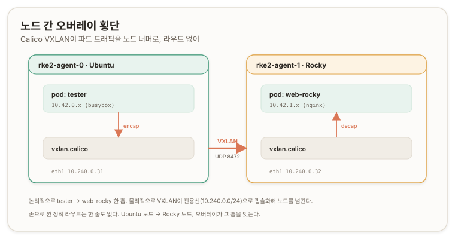

# 검증과 스모크 {#verify-smoke}

## 개요 {#overview}

이 문서는 [서버·에이전트 설치](./b2-install-server-and-agents)로 세운 혼종 클러스터가 실제로 일하는지 실증한다. [트랙 A a7](./a7-smoke-test)의 스모크와 같은 결이되, 별은 다르다. 트랙 A는 단일 OS 위에서 각 층을 확인했고, 여기서는 Calico VXLAN 오버레이가 노드를 넘어, 그것도 Ubuntu와 Rocky를 넘어 파드를 잇는지가 중심이다. 네 테스트가 각각 트랙 A의 한 층을 접어 증명하고, 그중 하나는 a7이 열린 채 남긴 숙제를 닫는다.

이 구간은 새로 세우는 인프라가 없다. b2까지 올린 층을 하나씩 건드려 "떴다"가 아니라 "동작한다"를 확인하는 회로 시험이다. 실행 위치는 `rke2-server`이며 kubectl과 kubeconfig가 준비돼 있다.



## control-plane taint {#control-plane-taint}

먼저 서버에 워크로드를 안 앉히는 선택을 건다. 워커가 둘이니 서버는 control-plane 전용으로 두는 게 프로덕션 결이고, 제품의 "control-plane taint 여부" 입력에 대응한다.

```bash
kubectl taint node rke2-server CriticalAddonsOnly=true:NoExecute
```

이 taint는 노드 오브젝트에 박히므로(etcd에 저장) 서비스 재시작을 넘어 유지된다. 즉시 걸고 끝에 `-`를 붙여 되돌린다. 영속·재현은 `config.yaml`의 `node-taint` 키이며, 제품은 그 키를 생성한다. `CriticalAddonsOnly=true:NoExecute`는 일반 워크로드를 서버에서 밀어내되, 이 taint를 tolerate하는 핵심 애드온(calico-node·kube-proxy 등 DaemonSet)은 남긴다.

## 노드 간 오버레이 {#cross-node-overlay}

이 테스트가 트랙 전체의 캡스톤이다. Ubuntu 파드와 Rocky 파드를 각각 다른 노드에 못박고, 한쪽에서 다른 쪽 파드 IP로 붙는다. [a6](./a6-pod-network-dns#pod-routes)에서 노드마다 `ip route add`로 한 줄씩 깐 정적 라우트 없이, Calico VXLAN(Virtual Extensible LAN) 오버레이가 노드를 넘겨 파드 트래픽을 나르는지 본다.

```bash
kubectl run web-rocky --image=nginx:latest --overrides='{"spec":{"nodeName":"rke2-agent-1"}}'
kubectl run tester --image=busybox:1.28 --restart=Never \
  --overrides='{"spec":{"nodeName":"rke2-agent-0"}}' --command -- sleep 3600
ROCKY_POD_IP=$(kubectl get pod web-rocky -o jsonpath='{.status.podIP}')
kubectl exec tester -- wget -qO- --timeout=5 http://$ROCKY_POD_IP | head -5
```

`tester`는 agent-0(Ubuntu), `web-rocky`는 agent-1(Rocky)에 못박혔다. `wget`이 nginx 환영 페이지를 받았다.

```text
<!DOCTYPE html>
<html>
<head>
<title>Welcome to nginx!</title>
```

파드 트래픽이 Ubuntu 노드에서 나가 VXLAN 오버레이로 캡슐화돼 Rocky 노드의 파드까지 닿았다. 손으로 깐 라우트가 한 줄도 없는데 파드가 노드를, 그것도 혼종 OS를 넘었다. [a6](./a6-pod-network-dns)에서 커널 라우팅 테이블로 실체화한 "파드망은 결국 라우팅"이, 여기서 오버레이의 2단으로 접혔다. 트랙 A는 정적 라우트, 트랙 B는 VXLAN 오버레이, 트랙 C는 Cilium eBPF라는 3단 변주의 가운데가 이 한 번의 `wget`에 찍혔다.

## CoreDNS {#coredns-verify}

클러스터 DNS가 이름을 실제로 푸는지 본다.

```bash
kubectl exec tester -- nslookup kubernetes.default
```

```text
Server:    10.43.0.10
Name:      kubernetes.default
Address 1: 10.43.0.1 kubernetes.default.svc.cluster.local
```

DNS 서버가 `10.43.0.10`(CoreDNS ClusterIP), `kubernetes.default`가 `10.43.0.1`로 풀린다. [a6](./a6-pod-network-dns#coredns)에서 Corefile·서비스 대역·systemd-resolved 루프 세 겹을 통과해 손으로 세운 CoreDNS가, RKE2에선 Helm 애드온으로 자동 배포되고 이렇게 이름을 푼다.

## NodePort 전 노드 도달 {#nodeport-all-nodes}

이 테스트가 트랙 A의 열린 숙제를 닫는다. [a7의 NodePort](./a7-smoke-test#nodeport-reachability)는 파드가 앉은 노드로만 검증했고, 파드 없는 다른 노드 IP로의 도달은 REVIEW-REQUIRED로 남았다. 여기서 그 한 줄을 닫는다.

```bash
kubectl expose pod web-rocky --name=web-svc --port=80 --type=NodePort
NP=$(kubectl get svc web-svc -o jsonpath='{.spec.ports[0].nodePort}')
curl -s http://10.240.0.30:$NP | head -3    # server  (파드 없음)
curl -s http://10.240.0.31:$NP | head -3    # agent-0 (파드 없음)
curl -s http://10.240.0.32:$NP | head -3    # agent-1 (파드 있음)
```

파드는 agent-1에만 있는데, 세 노드 IP 전부가 nginx를 응답했다. 파드 없는 두 노드(server·agent-0)로 들어온 요청도 오버레이를 타고 파드까지 닿았다는 뜻이다. kube-proxy가 모든 노드에 NodePort 규칙을 심었고, 그 규칙이 향한 파드가 다른 노드에 있으면 Calico 오버레이가 그 홉을 잇는다. a7이 "다른 노드로도 도달하는가"로 남긴 물음이, 트랙 B에서 초록으로 닫혔다.

## 저장 데이터 암호화 {#encryption-verify}

[a2](./a2-data-encryption)에서 손으로 키를 뽑고 EncryptionConfig를 짜고 apiserver 플래그로 걸던 저장 암호화가, RKE2에서 정말 기본으로 걸렸는지 확인한다.

```bash
sudo rke2 secrets-encrypt status
```

```text
Encryption Status: Enabled
Current Rotation Stage: start
Server Encryption Hashes: All hashes match

Active  Key Type  Name
------  --------  ----
 *      AES-CBC   aescbckey
```

`Enabled`에 프로바이더 `AES-CBC`다. `config.yaml`에 암호화를 한 줄도 안 적었는데, RKE2가 설치 때 AES-CBC 키를 만들고 EncryptionConfig를 생성해 apiserver에 `--encryption-provider-config`로 물려놨다. [a7의 hexdump](./a7-smoke-test#encryption-at-rest)로 확인한 그 저장 암호화가, 여기선 기본값으로 이미 돌고 있었다. ([RKE2 Secrets Encryption](https://docs.rke2.io/security/secrets_encryption)) 저장소 원본 바이트까지 보려면 etcd 정적 파드의 인증서로 `etcdctl`을 돌려 a7을 재현할 수 있다.

> [!CAUTION] REVIEW-REQUIRED
> a7의 `etcdctl ... | hexdump` 재현은 이번에 돌리지 않았다(`secrets-encrypt status`로 활성만 확인). RKE2 etcd 정적 파드의 client 인증서 경로(`/var/lib/rancher/rke2/server/tls/etcd/`)로 hexdump를 떠 "값이 `k8s:enc:aescbc:` 접두로 저장됨"을 저장소 바이트로 못박는다.

## 박제 {#stucco}

> **박제: 준비 전 성급한 exec**
>
>> **삽질.** <br/>
>> 오버레이 테스트에서 파드를 만들자마자 `kubectl exec tester -- wget ...`을 쳤더니 `Internal error ... container not found ("tester")`, 이어서 `wget: bad address ''`가 났다.
>
>> **교정.** <br/>
>> 두 에러가 같은 원인이다. 파드가 아직 `ContainerCreating`이라 `tester` 컨테이너가 없었고, `web-rocky`에 파드 IP가 안 붙어 `ROCKY_POD_IP`가 빈 값이었다. `kubectl get pods -o wide`로 둘 다 `Running`에 파드 IP가 뜬 걸 확인하고 다시 치자 `wget`이 nginx를 받았다. 결함이 아니라 순서 문제다. 준비 안 된 것을 성급하게 치지 않는다. 이 시리즈 내내 반복된 교훈([a7의 포트포워드 블로킹](./a7-smoke-test#apiserver-kubelet-streaming), 트랙 B의 multipassd·Rocky 종료 삽질)과 같은 결이다. 뜰 때까지 기다린다.

## 상류 정정 {#upstream-correction}

이 문서가 [a7](./a7-smoke-test#nodeport-reachability)의 열린 표면을 닫는다. [코덱스 부분 수정 규칙](./codex-partial-edit-rule)에 따라 a7의 NodePort REVIEW-REQUIRED를 "b3에서 파드 없는 노드 도달로 종결"로 정정한다. 트랙 A가 단일 노드로만 검증해 남긴 물음을, 트랙 B의 3노드 클러스터가 파드 없는 두 노드 curl로 답했다.

> **제품으로 접히는 지점.** 콘솔의 설치 후 검증에 워크로드 배포와 서비스 도달성 확인을 넣으면, "노드가 Ready"를 넘어 "실제 트래픽이 파드까지 흐른다"를 배포 성공의 기준으로 삼는다. 노드 간 오버레이 도달과 저장 암호화 활성 확인이 InstallSvc 사후 점검 로직의 원형이다. 특히 저장 암호화는 설정이 실제로 걸렸는지를 배포 밖에서 증명하는 불변식이다.

---

## 부록 A. 핵심 어휘 빠른 참조 {#appendix-a-glossary}

| 용어 | 한 줄 정의 |
| --- | --- |
| **VXLAN 오버레이** | 파드 트래픽을 캡슐화해 노드 간에 나르는 Calico의 오버레이 방식. a6 정적 라우트를 대체 |
| **노드 간 파드 통신** | 다른 노드의 파드 IP로 직접 도달. 오버레이가 홉을 이음 |
| **control-plane taint** | `CriticalAddonsOnly=true:NoExecute`. 서버에 일반 워크로드를 안 앉힘 |
| **NodePort 전 노드** | 모든 노드의 한 포트를 열어 파드로 넘김. 파드 없는 노드도 오버레이로 도달 |
| **`rke2 secrets-encrypt status`** | 저장 암호화 상태·프로바이더·키 조회. `Enabled`/`aescbc` |
| **CoreDNS ClusterIP** | `10.43.0.10`. 서비스 대역의 DNS. `kubernetes.default`를 `10.43.0.1`로 해석 |
| **`nodeName` 오버라이드** | 스케줄러를 건너뛰고 파드를 특정 노드에 못박음. 결정적 노드 간 테스트에 사용 |

---

## 부록 B. 명령어 빠른 참조 {#appendix-b-commands}

```bash
# === (선택) control-plane taint ===
kubectl taint node rke2-server CriticalAddonsOnly=true:NoExecute
#   되돌리기: kubectl taint node rke2-server CriticalAddonsOnly=true:NoExecute-

# === ① 노드 간 오버레이 (Ubuntu→Rocky) ===
kubectl run web-rocky --image=nginx:latest --overrides='{"spec":{"nodeName":"rke2-agent-1"}}'
kubectl run tester --image=busybox:1.28 --restart=Never \
  --overrides='{"spec":{"nodeName":"rke2-agent-0"}}' --command -- sleep 3600
kubectl get pods -o wide                     # Running + 파드IP 확인 후 (박제 방지)
ROCKY_POD_IP=$(kubectl get pod web-rocky -o jsonpath='{.status.podIP}')
kubectl exec tester -- wget -qO- --timeout=5 http://$ROCKY_POD_IP | head -5

# === ② CoreDNS ===
kubectl exec tester -- nslookup kubernetes.default     # → 10.43.0.1

# === ③ NodePort 전 노드 도달 (a7 종결) ===
kubectl expose pod web-rocky --name=web-svc --port=80 --type=NodePort
NP=$(kubectl get svc web-svc -o jsonpath='{.spec.ports[0].nodePort}')
for ip in 10.240.0.30 10.240.0.31 10.240.0.32; do curl -s http://$ip:$NP | head -3; done

# === ④ 저장 암호화 상태 ===
sudo rke2 secrets-encrypt status             # Enabled / AES-CBC

# === 뒷정리 ===
kubectl delete pod web-rocky tester; kubectl delete svc web-svc
```

---

## 개인 노트 {#personal-notes}

### 손때 검증 상태 {#hands-on-status}

이 구간은 실습으로 닫혔다. control-plane taint, 노드 간 오버레이(Ubuntu↔Rocky), CoreDNS, NodePort 전 노드 도달, 저장 암호화 상태를 전부 수행해 통과를 확인했다. 특히 `tester`(agent-0)에서 `web-rocky`(agent-1) 파드로 nginx가 돌아오고, 파드 없는 노드 IP로 친 NodePort curl이 nginx를 낸 것을 눈으로 봤다.

가장 값이 나가는 자산은 노드 간 오버레이와 NodePort 종결이다. 손으로 깐 라우트 없이 파드가 혼종 노드를 넘은 것이 a6 접힘의 캡스톤이고, 파드 없는 노드로도 서비스가 닿은 것이 a7이 남긴 숙제를 닫았다. 저장 암호화가 config 없이 기본으로 걸려 있던 것도, a2/a7 접힘을 물증으로 확인한 자산이다.

### 심화로 가는 길 {#deeper}

- **Calico 오버레이 경로 추적**: 파드→`vxlan.calico` 인터페이스→UDP 8472 캡슐화→상대 노드 디캡슐화의 경로를 `tcpdump`로 따라가기.
- **kube-proxy와 NodePort DNAT**: 파드 없는 노드의 `KUBE-NODEPORTS` 체인이 어떻게 상대 노드 파드로 향하는가.
- **etcd hexdump 재현**: RKE2 etcd 정적 파드 client 인증서로 `etcdctl`을 돌려 a7의 저장 암호문을 저장소 바이트로 확인.
- **secrets-encrypt 회전**: `rke2 secrets-encrypt prepare/rotate/reencrypt`의 단계와, 회전 중 프로바이더 순서.

### 자기 점검 {#self-check}

각 테스트가 왜 그 층을 증명하는지 한 줄로 재구성한다.

1. **왜 오버레이가 라우트 없이 노드를 넘나** → 기본 CNI가 VXLAN 오버레이라, 커널 정적 라우트 대신 캡슐화가 노드 간 파드망을 잇기 때문 (→ 노드 간 오버레이).
2. **왜 파드 없는 노드로도 NodePort가 닿나** → kube-proxy가 전 노드에 규칙을 심고, 상대 노드 파드로의 홉을 오버레이가 잇기 때문 (→ NodePort 전 노드 도달).
3. **왜 config 없이 암호화가 걸렸나** → RKE2가 설치 때 AES-CBC 키·EncryptionConfig·apiserver 플래그를 자동 구성하기 때문 (→ 저장 데이터 암호화).
4. **왜 첫 exec가 튀었나** → 파드가 준비 전이라 컨테이너가 없고 파드 IP가 비었기 때문. 준비를 확인하고 다시 치면 통과 (→ 박제).

다음 [업그레이드와 etcd 백업](./b4-upgrade-and-backup)에서 이 클러스터의 Day-2를 다룬다. 스냅샷을 뜨고 버전을 올리고, 실패 시 되돌리는 길을 확인한다.
