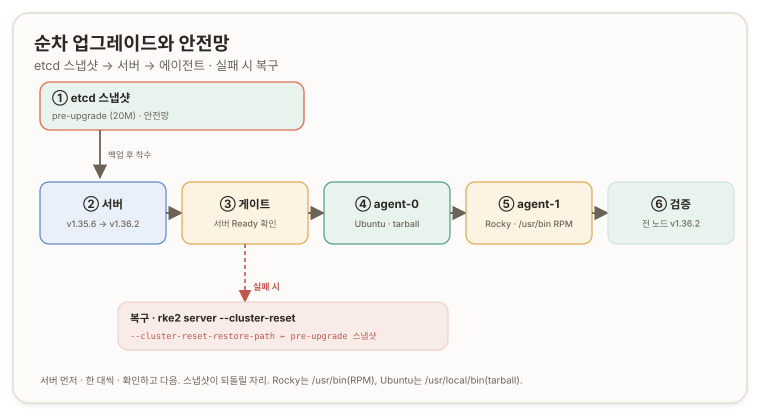

# 업그레이드와 etcd 백업 {#upgrade-and-backup}

## 개요 {#overview}

이 문서는 트랙 B의 Day-2 구간이자 빌드의 마지막이다. [검증과 스모크](./b3-verify-smoke)로 일하는 것을 확인한 클러스터를, 이제 운영한다. etcd 스냅샷으로 안전망을 박고, 버전을 순차로 올리고, 실패 시 되돌리는 길을 확인한다. 이 흐름이 제품 RKE2UpgradeSvc의 뼈대다. 노드 정보 조회와 순서 지정, 사전준비의 etcd 백업, 설치의 재설치·재시작, 실패 시 전체 복구가 여기 하나씩 대응한다.

대상은 `v1.35.6+rke2r1`에서 `v1.36.2+rke2r1`로다(Kubernetes 1.36.2, etcd `v3.6.12-k3s1`). 마이너 한 칸 위이고, 확인 하나가 붙는다. v1.36은 신규 클러스터만 기본 인그레스가 Traefik으로 바뀌고, 기존 클러스터는 업그레이드해도 ingress-nginx를 유지한다. 우리 클러스터는 안 깨진다. ([RKE2 v1.36.X Release Notes](https://docs.rke2.io/release-notes/v1.36.X))



## 업그레이드 순서 {#upgrade-order}

공식이 순서를 못 박는다. 서버 노드를 먼저, 한 대씩 올린다. 서버가 다 오른 뒤 에이전트로 넘어간다. 우리는 서버 하나라 서버 → agent-0 → agent-1이다. ([RKE2 Manual Upgrade](https://docs.rke2.io/upgrade/manual_upgrade))

이 순서가 안전의 핵심이다. 서버가 새 버전으로 오르는 동안 에이전트는 이전 버전으로 남는데, 이 버전 스큐(version skew)는 롤아웃 중 정상이다. 컨트롤 플레인이 워커보다 한 발 앞서는 방향(서버가 최신, 에이전트가 이전)은 쿠버네티스가 허용하는 방향이라, 한 대씩 확인하며 올리면 클러스터가 내내 살아 있다.

## etcd 스냅샷 {#etcd-snapshot}

업그레이드 전에 백업을 박는다. 이것이 실패 시 되돌릴 유일한 생명선이다. [a3](./a3-etcd-bootstrap#verification-and-snapshot)에서 "단일 노드 etcd는 스냅샷이 유일한 안전망"이라 한 그 명제가, RKE2에선 내장 명령 한 줄로 접힌다.

```bash
sudo rke2 etcd-snapshot save --name pre-upgrade
sudo ls -lh /var/lib/rancher/rke2/server/db/snapshots/
```

```text
-rw------- 1 root root 20M Jul 12 16:41 pre-upgrade-rke2-server-1783842081
```

스냅샷이 `/var/lib/rancher/rke2/server/db/snapshots/`에 파일 하나로 떨어진다. 트랙 A에서 `etcdctl snapshot save`로 손수 뜬 그 백업이, 여기선 `rke2 etcd-snapshot save`로 접힌다. 게다가 온디맨드만이 아니라 예약도 기본으로 돈다. `etcd-snapshot-schedule-cron`의 기본값은 `0 */12 * * *`(12시간마다)이고, `etcd-snapshot-retention`의 기본은 5개다. a3에서 홀로 뜬 스냅샷이, RKE2에선 예약·보존까지 자동인 것이다. ([RKE2 Backup and Restore](https://docs.rke2.io/backup_restore))

## 순차 업그레이드 {#rolling-upgrade}

업그레이드는 새 버전으로 재설치하고 서비스를 재시작하는 두 조작이다. 재설치는 바이너리만 갈고, 재시작이 새 바이너리를 물린다. 서버부터다.

```bash
# rke2-server 에서
curl -sfL https://get.rke2.io -o /tmp/rke2-install.sh
sudo INSTALL_RKE2_VERSION="v1.36.2+rke2r1" sh /tmp/rke2-install.sh
sudo systemctl restart rke2-server
```

서버 재시작 동안 apiserver가 잠깐 내려간다. 끊긴 게 아니라 재시작이므로 기다린다. 올라온 뒤 게이트에서 확인했다.

```text
NAME           STATUS   ROLES                VERSION
rke2-agent-0   Ready    <none>               v1.35.6+rke2r1
rke2-agent-1   Ready    <none>               v1.35.6+rke2r1
rke2-server    Ready    control-plane,etcd   v1.36.2+rke2r1
```

서버만 `v1.36.2`, 에이전트 둘은 아직 `v1.35.6`이다. 이 스큐가 롤아웃 중 정상이다. 서버가 `Ready`이고 `kubectl get pods -A`가 정상인 것을 확인한 뒤에야 에이전트로 넘어간다. 서버가 안 뜨면 에이전트를 건드리지 않고 스냅샷으로 되돌리는 게 순서다.

에이전트는 명령이 같되 `INSTALL_RKE2_TYPE="agent"`다.

```bash
# agent-0 (Ubuntu) 와 agent-1 (Rocky) 각각에서
curl -sfL https://get.rke2.io -o /tmp/rke2-install.sh
sudo INSTALL_RKE2_VERSION="v1.36.2+rke2r1" INSTALL_RKE2_TYPE="agent" sh /tmp/rke2-install.sh
sudo systemctl restart rke2-agent
```

여기서 RedHat 분기가 마지막으로 한 번 더 갈린다. agent-0(Ubuntu)은 tarball을 풀어 바이너리를 `/usr/local/bin/rke2`에 두고, agent-1(Rocky)은 dnf(RPM) 경로라 `/usr/bin/rke2`에 둔다. 같은 업그레이드 명령이 OS에 따라 다른 경로로 접히는 지점이다. 세 노드를 다 올린 최종 검증이다.

```text
NAME           STATUS   ROLES                VERSION
rke2-agent-0   Ready    <none>               v1.36.2+rke2r1
rke2-agent-1   Ready    <none>               v1.36.2+rke2r1
rke2-server    Ready    control-plane,etcd   v1.36.2+rke2r1
```

세 노드가 다 `v1.36.2+rke2r1`이다. 그리고 `kubectl get pods -A | grep ingress`에 `rke2-ingress-nginx-controller`가 그대로 살아 있고, 업그레이드 중 인그레스 차트를 재조정한 helm-install 잡이 `Completed`로 떴다. 기존 클러스터가 인그레스를 유지한다는 것이 실물로 확인됐다.

## 복구 경로 {#restore-path}

업그레이드가 깨졌다면 스냅샷으로 되돌린다. 제품 UpgradeSvc의 "실패 시 전체 etcd 복구"가 이것이다. 우리 업그레이드는 통과했으므로 실행하지 않았지만, 이 길이 존재하고 아까 백업에 걸려 있다는 것이 안전망의 실체다. ([RKE2 Backup and Restore](https://docs.rke2.io/backup_restore))

```bash
# 전 서버에서 먼저 정지
sudo systemctl stop rke2-server
# 첫 서버에서만 복구
sudo rke2 server --cluster-reset \
  --cluster-reset-restore-path=/var/lib/rancher/rke2/server/db/snapshots/pre-upgrade-rke2-server-<타임스탬프>
sudo systemctl start rke2-server
# (HA면) 다른 서버: rm -rf /var/lib/rancher/rke2/server/db 후 systemctl start rke2-server
```

`--cluster-reset`이 클러스터를 단일 멤버로 리셋하고 `--cluster-reset-restore-path`의 스냅샷으로 etcd를 되살린다. 복구된 클러스터는 처음에 단일 멤버로 돌다가 다른 서버가 다시 합류한다. a3에서 "복제는 노드 죽음만 막고 논리 손상·업그레이드 사고는 스냅샷만 막는다"고 한 그 절반이, 여기서 실제 복구 명령으로 손에 잡힌다.

> **제품 관찰 노트.** v1.36부터 air-gap 코어 tarball에 ingress-nginx 대신 Traefik이 들어가고, ingress-nginx를 계속 쓰려면 `rke2-images-ingress-nginx` tarball을 별도로 받아야 한다. 게다가 ingress-nginx는 v1.37에서 커뮤니티용으로 완전 제거된다. [b0의 버전 좌표](./b0-what-rke2-folds#version-coordinates)에서 예고한 그 전환이, b4에서 업그레이드 대상의 실제 제약으로 확인됐다. 제품의 번들 생성 로직이 v1.36을 기점으로 인그레스 선택(Traefik 기본, ingress-nginx 옵트인 tarball)을 다뤄야 하는 근거가 여기다.

> **제품으로 접히는 지점.** UpgradeSvc의 흐름이 이 구간 전체다. 노드 정보 조회로 현재 버전과 업그레이드 순서를 잡고, 사전준비로 etcd를 백업하고, 설치로 `install.sh`를 새 버전으로 실행해 서비스를 재시작하고, 점검으로 노드 상태를 확인하며, 실패 시 스냅샷으로 전체 복구한다. 서버 먼저·한 대씩·확인하고 다음이라는 순서가 콘솔의 업그레이드 로직에 그대로 대응한다.

---

## 부록 A. 핵심 어휘 빠른 참조 {#appendix-a-glossary}

| 용어 | 한 줄 정의 |
| --- | --- |
| **업그레이드 순서** | 서버 먼저(한 대씩) → 에이전트. 컨트롤 플레인이 워커보다 앞서는 방향 |
| **버전 스큐(version skew)** | 서버 최신·에이전트 이전의 롤아웃 중 상태. 쿠버네티스 허용 방향 |
| **`rke2 etcd-snapshot save`** | 온디맨드 etcd 스냅샷. `/var/lib/rancher/rke2/server/db/snapshots/`에 저장 |
| **`etcd-snapshot-schedule-cron`** | 예약 스냅샷 주기(기본 `0 */12 * * *`). `etcd-snapshot-retention` 기본 5 |
| **재설치+재시작** | `INSTALL_RKE2_VERSION`로 재설치 후 `systemctl restart`. 바이너리 갈고 물림 |
| **RPM vs tarball 경로** | Rocky `/usr/bin/rke2`, Ubuntu `/usr/local/bin/rke2` |
| **`--cluster-reset`** | 클러스터를 단일 멤버로 리셋. `--cluster-reset-restore-path`로 스냅샷 복구 |
| **인그레스 전환** | v1.36 신규 기본 Traefik. 기존 클러스터는 ingress-nginx 유지. v1.37 커뮤니티 제거 |

---

## 부록 B. 명령어 빠른 참조 {#appendix-b-commands}

```bash
# === 사전점검: 현재 버전 ===
kubectl get nodes                            # 셋 다 v1.35.6+rke2r1

# === 사전준비: etcd 스냅샷 (서버) ===
sudo rke2 etcd-snapshot save --name pre-upgrade
sudo ls -lh /var/lib/rancher/rke2/server/db/snapshots/

# === 설치: 서버 먼저 ===
curl -sfL https://get.rke2.io -o /tmp/rke2-install.sh
sudo INSTALL_RKE2_VERSION="v1.36.2+rke2r1" sh /tmp/rke2-install.sh
sudo systemctl restart rke2-server
kubectl get nodes                            # 서버만 v1.36.2 (에이전트 스큐 정상) → 게이트

# === 설치: 에이전트 (서버 확인 후, agent-0 그다음 agent-1) ===
curl -sfL https://get.rke2.io -o /tmp/rke2-install.sh
sudo INSTALL_RKE2_VERSION="v1.36.2+rke2r1" INSTALL_RKE2_TYPE="agent" sh /tmp/rke2-install.sh
sudo systemctl restart rke2-agent

# === 검증 ===
kubectl get nodes                            # 셋 다 v1.36.2+rke2r1
kubectl get pods -A | grep ingress           # rke2-ingress-nginx 유지

# === 복구 (실패 시에만, 전 서버 정지 후 첫 서버에서) ===
sudo systemctl stop rke2-server
sudo rke2 server --cluster-reset \
  --cluster-reset-restore-path=/var/lib/rancher/rke2/server/db/snapshots/pre-upgrade-rke2-server-<타임스탬프>
sudo systemctl start rke2-server
```

---

## 개인 노트 {#personal-notes}

### 손때 검증 상태 {#hands-on-status}

이 구간은 실습으로 닫혔다. etcd 온디맨드 스냅샷(20M)을 뜨고, 서버를 `v1.36.2`로 올려 게이트에서 확인하고(에이전트 스큐 상태), 에이전트 둘을 올려 세 노드가 다 `v1.36.2+rke2r1` `Ready`인 것을 확인했다. ingress-nginx가 업그레이드에도 유지되는 것을 `grep`으로 봤고, 복구 경로를 명령으로 정리했다(실행하지 않음).

가장 값이 나가는 자산은 순서와 안전망이다. 서버 먼저·한 대씩·확인하고 다음이라는 순서를 지켰고, 그 앞에 스냅샷을 박아 실패해도 되돌릴 자리를 만들었다. a3에서 "스냅샷이 유일한 생명선"이라 배운 것이, 업그레이드라는 실제 위험 앞에서 값을 했다.

### 심화로 가는 길 {#deeper}

- **system-upgrade-controller**: 수동 재설치 대신 SUC로 업그레이드를 선언적으로 롤아웃하는 방식과, `Plan` CR.
- **cluster-reset의 내부**: 단일 멤버 리셋이 Raft 멤버십을 어떻게 재구성하는가, HA에서 다른 서버의 재합류.
- **스냅샷 대상 저장소**: 로컬 디스크 외 S3 등 외부 저장소로 스냅샷을 두는 설정과, 참조 배포(NFS·Rancher Backups)와의 대응.
- **인그레스 마이그레이션**: ingress-nginx→Traefik 4단계 마이그레이션의 실제와, v1.37 제거 전 전환 계획.

### 자기 점검 {#self-check}

각 절이 왜 성립하는지를 한 줄로 재구성한다.

1. **왜 서버를 먼저 올리나** → 컨트롤 플레인이 워커보다 앞서는 방향이 쿠버네티스 허용 스큐라, 한 대씩 확인하며 올리면 클러스터가 살아 있기 때문 (→ 업그레이드 순서).
2. **왜 업그레이드 전에 스냅샷을 뜨나** → 복제는 노드 죽음만 막고 업그레이드 사고는 스냅샷만 막으므로, 되돌릴 유일한 안전망이기 때문 (→ etcd 스냅샷).
3. **왜 같은 업그레이드가 Rocky에서 경로가 다른가** → RPM 설치는 바이너리를 `/usr/bin`에, tarball은 `/usr/local/bin`에 두기 때문 (→ 순차 업그레이드).
4. **왜 우리 클러스터는 인그레스가 안 바뀌나** → v1.36 Traefik 기본은 신규 클러스터에만 적용되고, 기존은 ingress-nginx를 유지하기 때문 (→ 복구 경로 · 제품 관찰 노트).

이로써 **트랙 B 빌드를 완주했다**. b0 대조 앵커부터 b1 랩·사전준비, b2 설치, b3 검증, b4 Day-2까지, Hard Way로 손수 세운 모든 층을 RKE2가 어떻게 접는지 혼종 클러스터로 세우고 검증하고 운영했다. 남은 것은 `z-mapping`의 RKE2 열을 실측으로 승격하는 일과, 트랙 C(Cilium eBPF)에서 오버레이를 eBPF 데이터플레인으로 라이브 마이그레이션하는 캡스톤이다. 트랙 A에서 판 골수가 트랙 B에서 각 설정의 근거가 됐듯, 트랙 B의 오버레이 이해가 트랙 C의 출발점이 된다.
