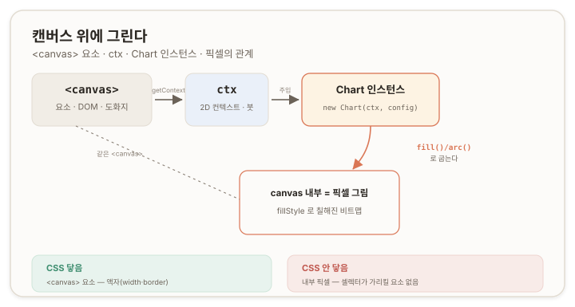
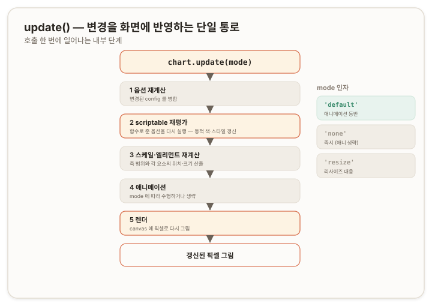
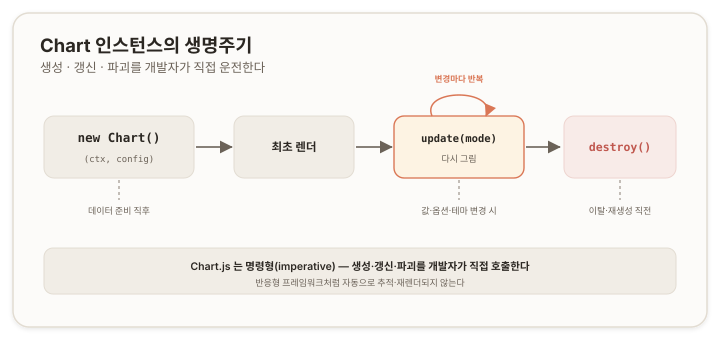

# Chart.js 핵심 개념 — 캔버스 · 골격 · 생명주기 {#top}

> **문서 범위 (Layer 1 · 보편 원리).**
>
> Chart.js를 어떤 프레임워크·어떤 환경에서 쓰든 통용되는 동작 원리만 다룬다. 프레임워크 통합(예: Vue·React) 패턴과 특정 프로젝트의 테마·환경 사정은 나중에 따로 공부하겠다 ^0^.

Chart.js의 모든 동작은 하나의 전제를 깔고 들어간다. **차트는 DOM이 아니라 캔버스(canvas)의 픽셀 위에 그려진다.** 이 사실에서 "왜 스타일을 CSS가 아닌 JavaScript로 지정하는가", "왜 데이터를 바꿔도 화면이 자동으로 갱신되지 않는가", "왜 인스턴스를 직접 파괴해야 하는가"가 모두 파생된다. 아래 여섯 섹션은 그 인과를 순서대로 따라간다.

| 섹션 | 주제 | 답하는 질문 |
|---|---|---|
| 1 | 캔버스라는 그리기 표면 | 차트는 무엇 위에, 어떻게 그려지는가 |
| 2 | 설정의 3층 구조 | 무엇을 넘겨서 그리게 하는가 |
| 3 | 정적 값과 scriptable 옵션 | 스타일을 어떻게 동적으로 계산하는가 |
| 4 | `update()` 파이프라인 | 변경은 어떻게 화면에 반영되는가 |
| 5 | 인스턴스 생명주기 | 생성·갱신·파괴를 누가 운전하는가 |
| 6 | 오답노트 | 위 원리를 어길 때 무엇이 깨지는가 |

---

## 1. 캔버스라는 그리기 표면 {#canvas-surface}

### 1.1 두 객체 — `<canvas>` 요소와 Chart 인스턴스 {#canvas-vs-instance}

차트 하나는 성격이 다른 두 객체의 협업으로 화면에 나타난다.

- **`<canvas>` 요소** — HTML 문서 객체 모델(Document Object Model, DOM)에 속한 요소. 그림이 그려질 표면이며, 그 자체는 아무것도 그려지지 않은 픽셀 영역(비트맵, bitmap)이다.
- **Chart 인스턴스** — `new Chart(...)`로 생성되는 JavaScript 객체. 표면 위에 무엇을 어떻게 그릴지 결정하고 실행한다.

두 객체는 **1:1로 결합한다.** 하나의 `<canvas>`에는 하나의 Chart 인스턴스만 존재할 수 있으며, 같은 표면에 새 인스턴스를 올리려면 기존 인스턴스를 먼저 파괴해야 한다(상세: [5.3](#why-destroy)).

### 1.2 컨텍스트(ctx)와 생성 절차 {#context-and-creation}

두 객체를 잇는 매개가 **렌더링 컨텍스트(rendering context)**다. `<canvas>` 요소에서 `getContext('2d')`로 얻는 객체이며, 관례상 `ctx`로 부른다. 그리기 명령은 모두 이 컨텍스트를 통해 표면에 전달된다.

```js
const el  = document.getElementById('myChart'); // 1) DOM의 <canvas> 요소
const ctx = el.getContext('2d');                // 2) 2D 렌더링 컨텍스트 획득
new Chart(ctx, config);                         // 3) 인스턴스가 ctx로 그림
```

네 객체(`<canvas>` 요소 · `ctx` · Chart 인스턴스 · 결과 픽셀)의 관계와, 뒤에서 다룰 CSS 적용 범위를 함께 정리하면 다음과 같다.



### 1.3 CSS가 적용되지 않는 이유 {#why-css-fails}

"캔버스에는 CSS가 적용되지 않는다"는 명제는 두 층위로 나누어야 정확하다.

- **`<canvas>` 요소 자체** — DOM 요소이므로 CSS가 적용된다. `width`, `height`, `border`, `box-shadow` 등 표면의 외곽 속성은 CSS가 제어한다.
- **표면 내부에 그려진 그림** — CSS가 적용되지 않는다. 막대, 도넛 조각, 축 라벨은 각각 독립된 DOM 노드가 아니라, 표면의 특정 좌표에 칠해진 픽셀이다.

CSS 선택자(selector)는 DOM 노드를 대상으로 동작한다. `.bar { background: red }`가 색을 적용하려면 `.bar`에 해당하는 요소가 존재해야 하지만, 캔버스 내부에는 그런 요소가 없다. 막대는 "요소"가 아니라 좌표에 구워진 색의 집합이므로, 선택자가 가리킬 대상 자체가 존재하지 않는다. 개발자 도구로 `<canvas>`를 펼쳐도 자식 노드 없이 단일 요소만 나타나는 것이 이 구조의 직접적 증거다.

이 구분은 HTML 기반 시각 요소(예: `<div>`로 구성한 진행 바)와의 차이를 가른다. HTML 요소는 실제 DOM 노드이므로 CSS가 적용되지만, Chart.js의 출력은 픽셀이므로 적용되지 않는다. 동일한 "막대 색 변경"이라도 두 방식의 메커니즘이 반대인 근거가 여기에 있다.

> 참고: [MDN — Canvas API](https://developer.mozilla.org/en-US/docs/Web/API/Canvas_API), [HTMLCanvasElement.getContext()](https://developer.mozilla.org/en-US/docs/Web/API/HTMLCanvasElement/getContext)

### 1.4 canvas 2D 컨텍스트의 그리기 명령 {#canvas-2d-commands}

CSS가 적용되지 않으므로, 스타일은 그리는 시점에 JavaScript가 컨텍스트에 직접 지정한다. 컨텍스트는 **상태 기반(stateful)** 도구로, "붓 색을 설정한다 → 모양을 정의한다 → 칠한다"는 순서로 동작한다. 차트 렌더링에 등장하는 주요 명령은 다음과 같다.

| 명령 | 분류 | 동작 |
|---|---|---|
| `el.getContext('2d')` | 획득 | `<canvas>`에서 2D 그리기 도구를 반환한다. 이후 모든 명령의 주체. |
| `ctx.fillStyle` | 상태 속성 | 이후 *채움*에 사용할 색을 설정한다. 변경 전까지 유지된다. |
| `ctx.strokeStyle` | 상태 속성 | 이후 *외곽선*에 사용할 색을 설정한다. |
| `ctx.beginPath()` | 경로 | 새 경로(path)의 시작을 선언한다. |
| `ctx.arc(x, y, r, s, e)` | 경로 | 원·호 경로를 정의한다. 도넛·파이 조각의 형태. |
| `ctx.moveTo(x, y)` / `ctx.lineTo(x, y)` | 경로 | 펜을 옮기고(`moveTo`) 직선을 잇는다(`lineTo`). 꺾은선의 구성 단위. |
| `ctx.fill()` | 실행 | 정의된 경로 내부를 현재 `fillStyle`로 채운다. |
| `ctx.stroke()` | 실행 | 정의된 경로를 현재 `strokeStyle`로 그린다. |
| `ctx.fillRect(x, y, w, h)` | 실행 | 경로 없이 사각형을 즉시 `fillStyle`로 채운다. 막대의 형태. |

`fillStyle`이 변경 전까지 유지되는 상태값이라는 점이 핵심이다. CSS가 요소에 속성을 부착하는 선언적(declarative) 방식이라면, 캔버스는 붓 상태를 설정하고 명령으로 칠하는 명령형(imperative) 방식이다. 이 명령형 성격은 [5장](#lifecycle)에서 다시 나타난다.

> 전체 명령 목록은 [MDN — CanvasRenderingContext2D](https://developer.mozilla.org/en-US/docs/Web/API/CanvasRenderingContext2D)에 정의되어 있다. 위 표는 차트 렌더링에 등장하는 명령으로 한정했다.

### 1.5 색이 픽셀로 입혀지는 절차 {#color-to-pixel}

Chart.js가 설정의 색을 픽셀로 변환하는 과정은 다음 순서를 따른다.

1. **설정 정의** — `type`/`data`/`options`에 색(`backgroundColor`, `borderColor` 등)을 값으로 담는다. 이 시점에는 렌더링이 일어나지 않으며, 색은 데이터처럼 메모리에 보관된 값이다.
2. **인스턴스 생성** — `new Chart(ctx, config)`.
3. **레이아웃 계산** — 데이터·축·범례를 바탕으로 각 요소의 좌표와 크기를 산출한다.
4. **렌더링** — 요소마다 `ctx.fillStyle`에 설정의 색을 지정한 뒤 `ctx.fill()`·`ctx.arc()` 등으로 픽셀을 칠한다. 이 시점에 색이 표면에 고정된다.
5. **결과** — 화면에는 픽셀만 남고, DOM에는 `<canvas>` 단일 요소만 존재한다.

이 절차에서 두 가지 성질이 따라 나오며, 둘 다 이후 섹션의 전제가 된다.

- **고정성** — 칠해진 픽셀은 그 자리에 고정된다. 색을 바꾸려면 해당 영역을 다시 그려야(redraw) 하며, 속성 변경만으로 반영되지 않는다. 이 성질이 [4장 `update()`](#update-method)의 존재 이유다.
- **계산 가능성** — 색이 그리는 시점에 읽히는 값이므로, 고정 상수 대신 함수로 계산해 전달할 수 있다. 이 가능성이 [3장 scriptable 옵션](#scriptable-options)의 토대다.

---

## 2. 설정의 3층 구조 — `type` / `data` / `options` {#config-three-layers}

### 2.1 공통 골격 {#common-skeleton}

Chart.js에 전달하는 설정 객체(config)는 차트 종류와 무관하게 세 칸으로 구성된다.

```js
new Chart(ctx, {
  type: 'line',                       // (1) 차트 종류
  data: {                             // (2) 그릴 값
    labels: ['1월', '2월', '3월'],
    datasets: [
      { label: '계열 A', data: [10, 20, 15] }
    ]
  },
  options: {                          // (3) 그 외 모든 설정
    plugins: { legend: { display: true } },
    scales:  { y: { beginAtZero: true } }
  }
});
```

- **`type`** — 차트 종류를 지정하는 문자열. 기본 제공 타입은 `line`, `bar`, `doughnut`, `pie`, `radar`, `polarArea`, `bubble`, `scatter`이다.
- **`data`** — `labels`와 `datasets`로 구성된다. `datasets`는 *배열*이며, 각 원소가 하나의 계열(데이터 묶음)에 대응한다. 한 차트에 여러 계열을 겹쳐 그릴 수 있다.
- **`options`** — 축(`scales`), 범례(`legend`), 툴팁(`tooltip`), 상호작용, 색, 애니메이션 등 나머지 설정 전부가 위치한다.

> 참고: [Chart.js — Configuration](https://www.chartjs.org/docs/latest/configuration/), [Data structures](https://www.chartjs.org/docs/latest/general/data-structures.html)

### 2.2 `type`이 결정하는 유효 범위 {#type-validity}

`type`은 차트의 외형만 선택하는 값이 아니라, **해당 차트에서 어떤 `data` 형태와 어떤 `options`가 유효한지를 함께 규정한다.**

대표적 예가 축이다. `line`·`bar`에는 `scales`(x·y축)가 존재하지만, `doughnut`·`pie`에는 존재하지 않는다. 도넛 계열은 직교 좌표축을 사용하지 않기 때문이다. `doughnut` 설정에 `scales`를 작성해도 적용될 자리가 없어 무시된다.

따라서 `type`을 변경하면 `data`의 형태와 `options`의 유효 범위가 함께 바뀐다. `type`은 외형을 정하는 동시에 나머지 두 칸의 유효성을 지배하는 값이다.

### 2.3 데이터 형태의 네 갈래 {#data-shapes}

타입은 8종이지만, `data.datasets[].data`가 취하는 *형태*는 네 갈래로 수렴한다.

| 분류 | 타입 | `data` 형태 | 설명 |
|---|---|---|---|
| 카테고리–값 | `line`, `bar` | `[10, 20, 15]` | `labels`와 1:1 대응하는 숫자 배열 |
| 비율 | `doughnut`, `pie` | `[30, 50, 20]` | 각 값이 부분, 합이 전체 |
| 좌표–점 | `scatter`, `bubble` | `[{x, y}, …]` (bubble은 `r` 포함) | 2차원 평면 위의 점 |
| 방사 | `radar`, `polarArea` | 축 기준으로 펼친 값 | 여러 축을 방사형으로 비교 |

동일한 `[10, 20, 15]`라도 `type`이 `line`이면 꺾은선의 높이, `bar`면 막대의 높이가 되고, `doughnut`이면 비율 조각으로 해석된다. **데이터의 의미는 값 자체가 아니라 `type`이 부여한다.** 타입별 세부 옵션(도넛의 `cutout`·`circumference`, 라인의 축 구성 등)은 **Chart.js Types** 카테고리에서 개별로 다룬다.

### 2.4 골격 위의 두 접근 — 응용과 정공법 {#applied-vs-direct}

동일한 3층 구조 위에서도 차트를 다루는 방향은 둘로 구분된다.

- **응용 — 기본 타입의 변형.** 게이지(gauge) 형태가 해당한다. 게이지는 Chart.js의 기본 `type`이 아니며, `doughnut`에 시작·회전 각과 중심 구멍 크기를 조절하는 옵션(`circumference`, `rotation`, `cutout`)을 적용해 반원 형태로 변형한 것이다. 기본 인스턴스를 목적에 맞게 변형한 사례다.
- **정공법 — 기본 타입의 심화.** 라인(line) 차트가 해당한다. `type`은 기본값을 유지하면서 `options`의 축·툴팁·동적 색 등을 깊이 활용하는 방향이다. 기본 인스턴스를 변형 없이 심화한 사례다.

두 접근의 공통점은 출발점이 동일한 `type`/`data`/`options`라는 데 있다. 3층 골격은 고정되며, 그 위에서 "타입을 변형하는 방향"과 "타입을 심화하는 방향"이 갈린다.

### 2.5 정적 옵션에서 동적 옵션으로 {#static-to-dynamic}

위 예시에서 `options`의 값은 모두 고정 값이었다. Chart.js는 이 값들의 상당수를 **함수로도 받는다.** 색이나 스타일을 고정 상수 대신 함수로 전달하면, 그 함수가 렌더링 시점마다 실행되어 값을 계산한다. 이 지점에서 `options`는 정적 설정을 넘어 동적 계산의 영역으로 확장되며, 다음 섹션의 주제가 된다.

---

## 3. 정적 값과 scriptable 옵션 {#scriptable-options}

### 3.1 값으로 주기와 함수로 주기 {#value-vs-function}

Chart.js의 다수 옵션은 고정 값 또는 함수 중 하나로 지정할 수 있다. 함수로 지정한 옵션을 **scriptable 옵션**이라 한다.

```js
// 정적: 모든 요소에 동일 적용
borderColor: '#da7756'

// scriptable: 렌더링 시점에 요소별로 계산
borderColor: (ctx) => ctx.datasetIndex === 0 ? '#da7756' : '#5b86c4'
```

함수는 각 요소를 그릴 때 호출되며, 반환값이 그 요소의 옵션 값으로 사용된다. 이를 통해 계열·데이터 위치·값에 따라 스타일을 분기할 수 있다.

### 3.2 scriptable 컨텍스트 객체 {#scriptable-context}

scriptable 함수에 전달되는 인자는 **scriptable 컨텍스트(scriptable context)** 객체다. 주요 필드는 아래와 같다.

| 필드 | 내용 |
|---|---|
| `chart` | 차트 인스턴스 |
| `datasetIndex` | 계열(dataset)의 인덱스 |
| `dataIndex` | 계열 내 데이터 항목의 인덱스 |
| `dataset` | 해당 계열 객체 |
| `raw` | 해당 항목의 원본 값 |
| `parsed` | 파싱된 값(좌표 등) |

> **이름 충돌 주의.** 이 컨텍스트 객체는 [1.2](#context-and-creation)의 캔버스 렌더링 컨텍스트(`getContext('2d')`로 얻는 `ctx`)와 **다른 객체다.** 둘 다 관례적으로 `ctx`로 표기되는 경우가 많아 혼동하기 쉽다. scriptable 함수의 `ctx`는 "어떤 요소를 그리는 중인가"에 대한 정보(인덱스 등)이고, 캔버스의 `ctx`는 "표면에 어떻게 칠하는가"에 대한 도구다.

### 3.3 indexable 옵션 — 배열로 주기 {#indexable-options}

옵션을 *배열*로 지정하는 방식도 있으며, 이를 **indexable 옵션**이라 한다. 배열의 각 원소가 데이터 인덱스에 순서대로 대응한다.

```js
// indexable: 데이터 0·1·2에 각 색을 순서대로 적용
backgroundColor: ['#da7756', '#5b86c4', '#4a9d7f']
```

scriptable(함수)과 indexable(배열)은 동작 메커니즘이 다르다. 함수는 호출되어 값을 계산하고, 배열은 인덱스로 조회된다. 동일한 "요소별 다른 색"을 두 방식으로 구현할 수 있으나, 조건 분기가 필요하면 scriptable이, 고정 순서면 indexable이 적합하다.

> 참고: [Chart.js — Scriptable Options](https://www.chartjs.org/docs/latest/general/options.html#scriptable-options), [Indexable Options](https://www.chartjs.org/docs/latest/general/options.html#indexable-options)

### 3.4 재평가 시점 {#reevaluation-timing}

scriptable 함수는 차트가 그려질 때마다 실행된다. 즉 **최초 렌더링 시점과 이후 매 갱신 시점**에 재실행된다. 갱신은 `update()` 호출로 발생하므로(4장), `update()`를 호출하면 scriptable 함수가 다시 평가되고 그 반환값이 새로 반영된다. 이 재평가가 동적 스타일의 핵심 동작이다. 반대로 `update()`가 호출되지 않으면 함수는 재평가되지 않으며, 이로 인한 오류는 [6장](#pitfalls)에서 다룬다.

---

## 4. update() — 변경을 화면에 반영하는 단일 통로 {#update-method}

### 4.1 명령형 갱신과 비반응성 {#imperative-non-reactive}

Chart.js는 반응형(reactive) 시스템이 아니다. `chart.data`나 `chart.options`를 변경해도 화면은 자동으로 갱신되지 않으며, 변경을 반영하려면 `chart.update()`를 명시적으로 호출해야 한다. 데이터·옵션·스타일의 모든 변경은 이 단일 통로를 거쳐 화면에 반영된다.

### 4.2 호출 시 일어나는 내부 단계 {#update-internal-steps}

`update()` 호출 한 번에 다음 단계가 순서대로 실행된다.



1. **옵션 재계산** — 변경된 설정을 병합한다.
2. **scriptable 재평가** — 함수로 지정된 옵션을 다시 실행해 값을 갱신한다([3.4](#reevaluation-timing)).
3. **스케일·엘리먼트 재계산** — 축의 범위와 각 요소의 위치·크기를 산출한다.
4. **애니메이션** — `mode`에 따라 수행하거나 생략한다.
5. **렌더링** — 캔버스에 픽셀로 다시 그린다.

scriptable 재평가(2단계)가 이 파이프라인에 포함되어 있다는 점이 동적 스타일이 작동하는 근거다. 함수형 옵션은 `update()`의 2단계에서 재실행되어 최신 반환값으로 교체된다.

### 4.3 mode 인자 {#update-mode}

`update(mode)`의 인자로 갱신 방식을 제어한다.

- `update()` 또는 `update('default')` — 애니메이션을 동반한다.
- `update('none')` — 애니메이션 없이 즉시 갱신한다.
- `update('resize')` — 크기 변경에 대응한다.

빈번한 갱신(예: 주기적 폴링)에서 애니메이션이 불필요하거나 성능에 부담이 되면 `'none'`을 사용한다.

### 4.4 데이터 갱신 절차 {#data-update-procedure}

데이터를 교체하는 표준 절차는 다음과 같다. 배열 참조를 교체하거나 내용을 변경한 뒤, `update()`로 반영한다.

```js
chart.data.datasets[0].data = nextValues; // 1) 값 변경
chart.update();                            // 2) 화면에 반영
```

`labels`를 변경하는 경우에도 동일하게 변경 후 `update()`를 호출한다. 변경만 수행하고 `update()`를 누락하면 화면은 이전 상태로 유지된다([6.3](#pitfall-missing-update)).

> 참고: [Chart.js — Updating Charts](https://www.chartjs.org/docs/latest/developers/updates.html)

---

## 5. 인스턴스 생명주기 — 생성 · 갱신 · 파괴 {#lifecycle}

### 5.1 3 Phases {#three-phases}

Chart 인스턴스는 생성·갱신·파괴의 세 Phases를 거친다. 각 Phases는 개발자의 명시적 호출로 전환된다.



- **생성** — `new Chart(ctx, config)`로 인스턴스를 만들고 최초 렌더링한다.
- **갱신** — `update()`로 변경을 반영한다. 데이터가 바뀔 때마다 반복 호출된다.
- **파괴** — `destroy()`로 인스턴스를 해제한다.

### 5.2 개발자 개입 시점 {#developer-touchpoints}

Chart.js는 명령형 라이브러리이므로, 생명주기 전환을 개발자가 직접 호출한다. 반응형 프레임워크처럼 상태 변화를 자동 추적하지 않는다.

| 시점 | 호출 | 상황 |
|---|---|---|
| 생성 | `new Chart()` | 데이터가 준비된 직후 |
| 갱신 | `update()` | 값·옵션·스타일이 변경될 때 |
| 리사이즈 | `resize()` | 컨테이너 크기가 변경될 때 |
| 파괴 | `destroy()` | 화면 이탈 또는 재생성 직전 |

### 5.3 파괴가 필요한 이유 {#why-destroy}

[1.1](#canvas-vs-instance)에서 `<canvas>`와 인스턴스는 1:1로 결합한다고 정리했다. 인스턴스를 파괴하지 않은 채 같은 `<canvas>`에 새 인스턴스를 생성하면 두 가지 문제가 발생한다.

- **충돌** — 기존 인스턴스가 표면을 점유한 상태에서 새 인스턴스가 그려져, 잔상이나 이벤트 중복이 나타난다.
- **메모리 누수** — 해제되지 않은 인스턴스가 이벤트 리스너·애니메이션 루프 등을 유지하며 누적된다.

따라서 재생성 또는 화면 이탈 전에는 `destroy()`로 기존 인스턴스를 해제해야 한다. 생성과 파괴는 대칭을 이루어야 한다.

> 참고: [Chart.js — API (destroy 등)](https://www.chartjs.org/docs/latest/developers/api.html)

---

## 6. 오답노트 {#pitfalls}

코드는 도메인을 제거한 최소 재현 형태(Minimal Reproducible Example)다.

### 6.1 재생성 시 화면이 깨지거나 느려진다 — destroy 누락 {#pitfall-missing-destroy}

**증상.** 같은 `<canvas>`에 차트를 다시 생성하면 잔상이 남거나, 반복할수록 느려진다.

**오답.**

```js
function rebuild(config) {
  myChart = new Chart(ctx, config); // 기존 인스턴스를 해제하지 않음
}
```

**원인.** `<canvas>`와 인스턴스의 1:1 결합을 위반한다. 기존 인스턴스가 해제되지 않은 채 남아 표면 점유 충돌과 메모리 누수가 발생한다([5.3](#why-destroy)).

**생명주기상 위치.** [생명주기](#lifecycle)의 *파괴(destroy())* Phases가 누락된 경우다. 생성과 파괴의 대칭이 깨졌다.

**개선.** 재생성 전에 기존 인스턴스를 파괴한다.

```js
function rebuild(config) {
  myChart?.destroy();
  myChart = new Chart(ctx, config);
}
```

### 6.2 데이터를 바꿔도 화면이 그대로다 — update 누락 {#pitfall-missing-update}

**증상.** `chart.data`를 갱신했으나 화면에 변화가 없다.

**오답.**

```js
chart.data.datasets[0].data = nextValues; // 변경만 수행
```

**원인.** Chart.js는 비반응형이므로 데이터 변경만으로는 재렌더링이 일어나지 않는다([4.1](#imperative-non-reactive)). 변경을 화면에 반영하는 단일 통로인 `update()`가 호출되지 않았다.

**생명주기상 위치.** [`update()` 파이프라인](#update-internal-steps) 자체가 실행되지 않은 경우다. 값은 메모리에서 바뀌었으나 렌더링 단계로 진입하지 못했다.

**개선.** 변경 후 `update()`를 호출한다.

```js
chart.data.datasets[0].data = nextValues;
chart.update();
```

