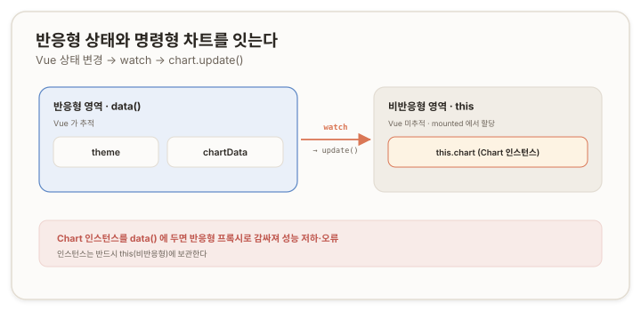
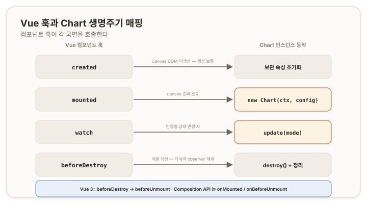

# Chart.js × Vue 통합 — 반응형 시스템에 명령형 차트 얹기 {#top}

> **문서 범위 (Layer 2 · 프레임워크 통합).**
>
> [L1(보편 원리)](./01-chartjs-core-concepts)을 전제로 한다. Vue(주로 Vue 2) 환경에서 Chart.js를 다루는 통합 패턴을 다룬다.

Chart.js는 **명령형(imperative)** 이며 **비반응형(non-reactive)** 이다. 즉 데이터를 바꿔도 화면이 자동으로 갱신되지 않고, 생성·갱신·파괴를 **개발자가 직접 호출** 해야 한다.

반면 Vue는 **반응형(reactive)** 이며 **선언형(declarative)** 이다. 상태가 바뀌면 화면이 자동으로 갱신된다. 두 모델은 동작 방식이 반대이며, 이 차이를 메우는 것이 Vue 통합의 핵심 과제다.

| 섹션 | 주제 | 통합 과제 |
|---|---|---|
| 1 | 임피던스 불일치 | 두 모델의 차이가 만드는 문제는 무엇인가 |
| 2 | 인스턴스 보관 위치 | 차트 인스턴스를 어디에 두는가 |
| 3 | 생명주기 매핑 | Vue 훅이 Chart Phase를 어떻게 호출하는가 |
| 4 | watch 기반 갱신 | 반응형 상태 변화를 어떻게 차트에 반영하는가 |
| 5 | mixin과 옵션 병합 | 공통 로직을 어떻게 공유하는가 |
| 6 | 오답노트 | 통합 패턴을 어길 때 무엇이 깨지는가 |

---

## 1. 임피던스 불일치 — 반응형과 명령형의 만남 {#impedance-mismatch}

### 1.1 L1에서 확정한 전제 {#l1-premise}

Chart.js의 인스턴스는 명령형으로 운전된다. 데이터 변경은 메모리에만 반영되며, 화면에 적용하려면 `update()`를, 인스턴스를 해제하려면 `destroy()`를 명시적으로 호출해야 한다. 자동 추적은 없다.

### 1.2 Vue의 반응형 {#vue-reactivity}

Vue는 컴포넌트의 `data`·`props`·`computed`를 반응형으로 관리한다. Vue 2는 `Object.defineProperty`로, Vue 3은 `Proxy`로 객체의 속성에 접근 감지를 설치하고, 상태가 바뀌면 의존하는 화면을 자동으로 다시 그린다. 개발자는 "무엇을 보여줄지"만 선언하고, "언제 갱신할지"는 Vue가 결정한다.

### 1.3 통합의 세 과제 {#three-challenges}

동작 모델이 반대인 두 시스템을 결합할 때 해결해야 할 과제는 세 가지로 나뉜다. 이후 섹션이 각각에 대응한다.

- **보관** — 명령형 객체를 Vue의 반응형 시스템 안에 두면 부작용이 발생한다. 어디에 둘 것인가. [(2장)](#instance-storage)
- **생명주기** — 인스턴스의 생성·파괴를 Vue 컴포넌트의 생명주기 어느 시점에 연결할 것인가. [(3장)](#lifecycle-mapping)
- **갱신** — Vue의 반응형 상태 변화를 어떻게 명령형 `update()` 호출로 전달할 것인가. [(4장)](#watch-update)

---

## 2. 인스턴스 보관 위치 — 반응형 밖 {#instance-storage}

### 2.1 `data()`에 두면 안 되는 이유 {#why-not-data}

Vue는 `data()`가 반환한 객체의 모든 속성을 반응형으로 변환한다. 이 변환은 객체를 깊이 순회하며 각 속성에 접근 감지를 설치한다. 그런데 Chart 인스턴스는 내부에 스케일·엘리먼트·애니메이션·이벤트 등 거대하고 상호 참조가 많은 구조를 가진다. 이 구조를 반응형으로 변환하면 두 가지 문제가 발생한다.

- **성능 저하** — 방대한 내부 속성마다 접근 감지가 설치되어, 생성·변경 비용이 크게 증가한다.
- **순회 오류** — 내부의 깊거나 순환적인 참조를 따라가다 호출 스택이 초과되어 `RangeError`가 발생할 수 있다.

즉 차트 인스턴스는 반응형으로 추적할 대상이 아니며, Vue의 반응형 시스템 밖에 두어야 한다.

### 2.2 `this`에 직접 보관 {#store-on-this}

해결책은 인스턴스를 `data()`가 아니라 **컴포넌트 인스턴스(`this`)의 일반 속성으로 보관하는 것이다.** Vue는 `data()` 반환 객체만 반응형으로 변환하므로, `this`에 직접 할당한 속성은 추적 대상이 되지 않는다.

```js
mounted() {
  this.chart = new Chart(ctx, config); // data()에 선언하지 않음 → 비반응형
}
```

Vue 3에서 인스턴스를 반응형 참조로 다뤄야 하는 경우에는 깊은 변환을 피하는 `shallowRef`를 사용한다. `ref`는 값을 깊이 반응형화(reactive化)하지만, `shallowRef`는 최상위 참조만 추적하므로 인스턴스 내부를 변환하지 않는다.

### 2.3 여러 차트의 묶음 관리 {#managing-multiple}

한 컴포넌트가 여러 차트를 다루는 경우에도 동일하게 `this`에 보관한다. 객체나 배열로 묶어 관리하면 일괄 처리가 편하다.

```js
created() {
  this.charts = {}; // 비반응형 보관소 (data()가 아님)
}
```

생성·갱신·파괴 시 `Object.values(this.charts).forEach(...)`로 전체를 순회한다. 이때도 `this.charts`는 `data()` 밖이므로 반응형 변환의 대상이 아니다.



---

## 3. 생명주기 매핑 — Vue Hook과 Chart Phase {#lifecycle-mapping}

### 3.1 생성 시점은 왜 `mounted`인가 {#why-mounted}

Chart 인스턴스 생성에는 `<canvas>` 요소가 실제 DOM에 존재해야 한다. `getContext('2d')`가 DOM 요소를 필요로 하기 때문이다. Vue 컴포넌트의 생명주기에서 템플릿이 DOM에 마운트되는 시점은 `mounted`이며, 그 이전인 `created` 시점에는 `<canvas>`가 아직 존재하지 않는다. 따라서 `new Chart(...)`는 `mounted`에서 호출한다.

### 3.2 Hook과 Phase의 대응 {#hook-phase-mapping}

Vue 컴포넌트 Hook과 Chart 생명주기 Phase(L1 5장)은 다음과 같이 대응한다.



- **`created`** — 보관용 속성(`this.charts` 등)을 초기화한다. `<canvas>`가 없으므로 인스턴스 생성은 보류한다.
- **`mounted`** — `<canvas>`가 준비되었으므로 `new Chart(...)`로 생성하고 최초 렌더링한다.
- **`watch`** — 반응형 상태가 변경되면 `update()`를 호출한다([4장](#watch-update)).
- **`beforeDestroy`** — 컴포넌트 해제 직전에 `destroy()`와 부수 자원 정리를 수행한다.

### 3.3 정리 — `beforeDestroy` {#cleanup-beforedestroy}

컴포넌트가 화면에서 제거될 때, Chart 인스턴스와 함께 생성된 부수 자원을 해제해야 한다. L1 5.3에서 다룬 인스턴스 파괴에 더해, Vue 컴포넌트에서는 폴링 타이머나 `ResizeObserver` 같은 자원이 함께 생성되는 경우가 많다. 이들을 모두 정리한다.

```js
beforeDestroy() {
  this.chart?.destroy();        // Chart 인스턴스 해제
  clearInterval(this.timer);    // 폴링 타이머 해제
  this.observer?.disconnect();  // ResizeObserver 해제
}
```

정리를 누락하면 컴포넌트가 사라진 뒤에도 타이머와 인스턴스가 살아남아 메모리 누수와 불필요한 갱신이 발생한다([6.2](#pitfall-missing-cleanup)).

### 3.4 Vue 3의 차이 {#vue3-differences}

Vue 3에서는 명칭과 작성 방식이 일부 달라진다.

- 옵션 API의 `beforeDestroy`는 `beforeUnmount`로 개명되었다.
- 컴포지션 API(Composition API)에서는 `onMounted`·`onBeforeUnmount`로 같은 시점을 다룬다.

대응 관계 자체(생성은 마운트 시점, 정리는 해제 시점)는 동일하다.

---

## 4. watch 기반 갱신 — 반응형을 명령형으로 {#watch-update}

### 4.1 watch가 두 모델을 잇는 다리 {#watch-as-bridge}

L1에서 데이터 변경 후 `update()`를 수동으로 호출했다. Vue에서는 이 수동 호출을 `watch`가 대신 촉발한다. 반응형 상태(`data`·`props`)를 `watch`로 관찰하고, 변경이 감지되면 콜백에서 `update()`를 호출한다. 이 구조가 반응형 변화를 명령형 호출로 전달하는 다리다.

```js
watch: {
  chartData(next) {
    this.chart.data.datasets[0].data = next;
    this.chart.update();
  }
}
```

### 4.2 데이터 갱신 절차 {#data-update-procedure}

차트의 데이터를 교체한 뒤 `update()`를 호출한다. L1 문서에서와의 차이는 호출 시점을 `watch`가 자동으로 결정한다는 점뿐이다. 빈번한 갱신에서 애니메이션이 부담되면 `update('none')`을 사용한다(L1 4.3).

### 4.3 deep watch 주의 {#deep-watch}

배열이나 객체의 *내부*를 변경하면 참조가 그대로 유지되어 기본 `watch`가 변경을 감지하지 못한다. 두 가지 대응이 있다.

- `watch`에 `deep: true`를 지정한다. 단 깊은 비교는 비용이 있으므로 큰 구조에서는 주의한다.
- 내부를 변경하는 대신 새 배열·객체로 교체한다. 참조가 바뀌므로 기본 `watch`가 감지한다.

후자가 일반적으로 더 예측 가능하다. 불변 교체는 변경 추적을 단순하게 만든다.

### 4.4 scriptable 옵션과의 결합 {#scriptable-combination}

L1 3장의 scriptable 옵션이 Vue 통합에서 작동하는 방식은 다음과 같다. 스타일을 결정하는 상태(예: 표시 모드)를 컴포넌트의 반응형 데이터로 두고, 그 상태를 `watch`하여 `update()`만 호출하면 된다. `update()`의 파이프라인에서 scriptable 함수가 재평가되므로(L1 4.2), 함수가 최신 상태를 읽어 새 스타일을 반환한다.

```js
// 옵션(L1): borderColor 를 함수로 지정 → 상태를 읽어 색 결정
// 컴포넌트:
watch: {
  mode() {
    this.chart.update(); // scriptable 재평가 → 색 갱신
  }
}
```

즉 "상태를 watch하고 `update()`만 호출"하는 단순한 구조로 동적 스타일이 반영된다. 스타일 값을 직접 다시 계산해 대입할 필요가 없다. 구체적인 스타일 체계(테마 구성 등)는 L3에서 다룬다.

---

## 5. mixin과 옵션 병합 (Vue 2) {#mixin-option-merge}

### 5.1 `Vue.extend`는 생성자다 {#vue-extend-constructor}

`Vue.extend(options)`는 인스턴스가 아니라, 전달한 옵션을 내장한 **컴포넌트 생성자(서브클래스)**를 반환한다. 공통 옵션을 한 번 정의해 여러 화면이 그 생성자를 인스턴스화하는 방식으로 재사용한다. 각 화면의 `new`가 실제 인스턴스이며, 생성자는 화면들이 공유하는 틀이다.

### 5.2 옵션 병합 규칙 {#merge-rules}

하나의 인스턴스가 만들어질 때 옵션은 세 출처에서 모인다. 생성자(`Vue.extend`)의 옵션, `mixins`의 옵션, 인스턴스(`new`)의 옵션이다. Vue는 이들을 **덮어쓰지 않고 병합**한다. 병합 전략은 옵션 종류마다 다르다.

- **`data`·`methods`·`computed`** — Key 단위로 병합된다. Key가 겹치지 않으면 모두 공존한다.
- **생명주기 훅(`created`·`mounted` 등)** — 배열로 누적되어 *모두* 실행된다. 실행 순서는 생성자 → mixin → 인스턴스다.

따라서 mixin의 `created`와 컴포넌트의 `created`는 충돌하지 않고 순서대로 모두 실행된다. mixin이 공통 동작을 "끼워 넣을" 수 있는 근거가 이 병합 규칙이다.

### 5.3 같은 키의 우선순위 {#key-priority}

`data`나 `methods`에서 *같은 키*가 여러 출처에 존재하면, 그때는 우선순위에 따라 덮어쓴다. 우선순위는 **instance > mixin > constructor** 이다. 이 규칙 때문에, mixin이 제공하는 상태를 컴포넌트의 `data`에도 같은 이름으로 선언하면 컴포넌트 값이 mixin 값을 덮어써 mixin의 동작이 무력화된다. [(6.4)](#pitfall-duplicate-mixin-state)

> 참고: [Vue 2 — Mixins (Option Merging)](https://v2.vuejs.org/v2/guide/mixins.html#Option-Merging), [Vue.extend](https://v2.vuejs.org/v2/api/#Vue-extend)

---

## 6. 오답노트 {#pitfalls}

코드는 도메인을 제거한 최소 재현 형태다.

### 6.1 인스턴스를 `data()`에 보관 — RangeError·성능 저하 {#pitfall-instance-in-data}

**증상.** 차트가 큰 경우 생성이 느리거나, `RangeError`(스택 초과)가 발생한다.

**오답.**

```js
data() {
  return { chart: null }; // 인스턴스를 반응형 데이터로 선언
},
mounted() {
  this.chart = new Chart(ctx, config); // data()의 chart 가 반응형 프록시로 감싸짐
}
```

**원인.** `data()` 반환 객체는 반응형으로 변환된다. Chart 인스턴스의 거대·순환 구조가 깊이 순회되며 접근 감지가 설치되어 성능 저하와 순회 오류가 발생한다([2.1](#why-not-data)).

**위치.** 인스턴스 보관 위치 오류.

**개선.** `data()`에서 제거하고 `this`에 직접 보관한다(Vue 3에서 반응형이 필요하면 `shallowRef`).

```js
mounted() {
  this.chart = new Chart(ctx, config); // data()에 선언하지 않음
}
```

### 6.2 정리 누락 — 메모리 누수 {#pitfall-missing-cleanup}

**증상.** 컴포넌트를 떠난 뒤에도 갱신이 계속되거나 메모리 사용량이 누적된다.

**오답.**

```js
mounted() {
  this.chart = new Chart(ctx, config);
  this.timer = setInterval(this.poll, 5000);
}
// beforeDestroy 없음
```

**원인.** 컴포넌트 해제 시 인스턴스와 타이머가 해제되지 않아 살아남는다. 생명주기의 파괴(destroy) Phase가 누락되었다([3.3](#cleanup-beforedestroy)).

**위치.** 생명주기 정리 누락.

**개선.** 해제 훅에서 인스턴스와 부수 자원을 모두 정리한다.

```js
beforeDestroy() {
  this.chart?.destroy();
  clearInterval(this.timer);
  this.observer?.disconnect();
}
```

### 6.3 훅을 `methods` 안에 정의 — 호출되지 않음 {#pitfall-hook-in-methods}

**증상.** 정리 코드를 작성했는데도 컴포넌트 해제 시 실행되지 않는다.

**오답.**

```js
methods: {
  beforeDestroy() {       // 생명주기 훅이 아니라 일반 메서드
    this.chart?.destroy();
  }
}
```

**원인.** `beforeDestroy`는 생명주기 훅으로, 컴포넌트 옵션의 *최상위*에 위치해야 Vue가 호출한다. `methods` 안에 두면 이름만 같은 일반 메서드가 되어 자동으로 호출되지 않는다.

**위치.** 옵션 구조 오류(훅의 위치).

**개선.** 훅을 옵션 최상위로 옮긴다.

```js
beforeDestroy() {         // 옵션 최상위
  this.chart?.destroy();
},
methods: { /* ... */ }
```

### 6.4 mixin 상태를 `data()`에 중복 선언 {#pitfall-duplicate-mixin-state}

**증상.** mixin이 제공하는 공통 동작(예: 특정 상태에 따른 갱신)이 작동하지 않는다.

**오답.**

```js
// mixin: data() { return { mode: 'default' }; }  + 관련 watch
// 컴포넌트:
data() {
  return { mode: 'default', /* ... */ }; // mixin 의 mode 를 덮어씀
}
```

**원인.** 같은 키의 `data`는 인스턴스가 우선하므로, 컴포넌트의 `mode`가 mixin의 `mode`를 덮어쓴다. mixin이 그 상태에 걸어둔 로직이 무력화된다([5.3](#key-priority)).

**위치.** 옵션 병합 우선순위.

**개선.** mixin이 관리하는 상태는 컴포넌트 `data()`에서 선언하지 않고 mixin에 위임한다.

```js
data() {
  return { /* mode 제외 — mixin 에 위임 */ };
}
```
