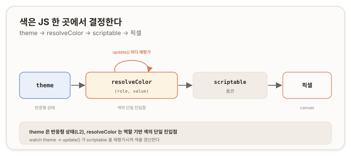
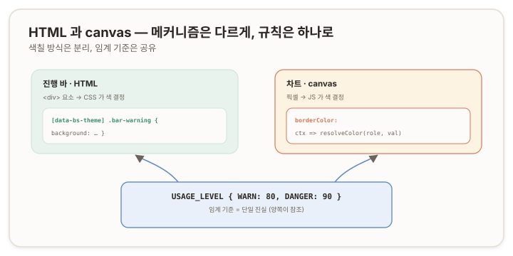

# Chart.js 실무 적용 — 템플릿 엔진 · 테마 체계 · 색 경계 {#top}

> **문서 범위 (Layer 3 · 프로젝트 환경 사정).** [L1(보편 원리)](./01-chartjs-core-concepts)·[L2(Vue 통합)](./02-chartjs-with-vue)를 전제로 한다. 개별 프로젝트의 환경(서버 템플릿 엔진, 테마 체계, 외부 스타일과의 경계)에서 발생하는 사정과 대응을 다룬다.
>
> **마스킹 적용.** 본 문서는 실무 작업에서 도출했으며, 회사 도메인과 내부 식별자(파일명·접두사 등)는 중립 예제로 치환하고 기술 구조와 인사이트만 보존했다. Thymeleaf·Bootstrap·Vue 등 공개 기술명은 문제 재현을 위해 유지한다.

L1·L2는 환경과 무관한 원리였다. 이 문서는 특정 환경이 부과하는 제약을 다룬다. 동일한 Chart.js 작업이라도 어떤 템플릿 엔진 위에서, 어떤 테마 체계와 함께, 어떤 다른 시각 요소와 섞여 동작하는지에 따라 추가로 해결해야 할 사정이 생긴다.

| 섹션 | 주제 | 환경 사정 |
|---|---|---|
| 1 | 환경이 부과하는 제약 | 보편 원리 위에 무엇이 더해지는가 |
| 2 | 템플릿 엔진과 JS 리터럴 충돌 | 서버 렌더 구문이 JS 배열과 부딪힌다 |
| 3 | 색의 단일 진입점 | 색을 JS 어디에서 결정하는가 |
| 4 | 테마 체계 교체 | 기존 테마와 새 테마가 충돌할 때 |
| 5 | HTML과 canvas의 색 경계 | 서로 다른 매체의 색을 어떻게 다루는가 |
| 6 | 오답노트 | 환경 사정을 간과할 때 무엇이 깨지는가 |

<DocEmbed
  src="notes/javascript/chart.js/_embeds/00-dev-note.md"
  anchor="dev-note-line-vue2"
  title="개발노트 ─ 테마 전환 메뉴얼 (Line Charts && Vue 2)"
/>

<none/>
<DocEmbed
  src="notes/javascript/chart.js/_embeds/00-dev-note.md"
  anchor="dev-note-gauge-vue2"
  title="개발노트 ─ 테마 전환 메뉴얼 (Gauge Charts && Vue 2)"
/>
---

## 1. 환경이 부과하는 제약 {#environment-constraints}

L1에서 "캔버스는 픽셀이므로 색을 JS로 지정한다", L2에서 "반응형 상태를 watch로 update()에 잇는다"를 확립했다. 실무에서는 그 위에 환경 고유의 제약이 더해진다. 이 문서가 다루는 제약은 네 가지다.

- **템플릿 엔진** — 차트 설정을 서버 사이드 템플릿(Thymeleaf)으로 렌더할 때, 템플릿 구문이 JavaScript 배열 리터럴과 충돌한다([2장](#template-literal-clash)).
- **색 결정 위치** — canvas 특성상 색을 JS로 지정하되, 흩어진 색 지정을 어떻게 한 곳으로 모으는가([3장](#color-entry-point)).
- **테마 체계** — 기존의 명암 전환(light/dark)과 새 다중 테마가 같은 저장소·속성을 공유하며 충돌한다([4장](#theme-replacement)).
- **색 경계** — 차트(canvas)와 진행 바(HTML)가 한 화면에 섞일 때, 두 매체의 색을 어떻게 다루는가([5장](#html-canvas-boundary)).

---

## 2. 템플릿 엔진과 JS 리터럴 충돌 {#template-literal-clash}

### 2.1 충돌의 구조 {#clash-structure}

서버 사이드 템플릿 엔진 Thymeleaf는 JavaScript 인라인(inlining) 구문으로 `[[...]]`를 사용한다. 템플릿 안의 `[[${expr}]]`는 서버에서 표현식 결과로 치환된다.

문제는 차트 데이터에 **중첩 배열 리터럴**이 등장할 때다. 예컨대 색을 RGB 배열의 배열로 표현하면 `[[255, 0, 0], [0, 128, 0]]`처럼 `[[`로 시작한다. Thymeleaf는 이 `[[`를 자신의 인라인 시작 토큰으로 해석하려 시도하고, 그 결과 의도한 JS 배열이 깨지거나 잘못 치환된다.

### 2.2 회피 {#clash-workaround}

토큰 충돌을 피하려면 `[[`가 연속되지 않게 공백을 삽입한다.

```js
// 충돌: [[ 가 Thymeleaf 인라인 토큰과 겹친다
data: [[255, 0, 0], [0, 128, 0]]

// 회피: 사이에 공백을 두어 토큰 연속을 끊는다
data: [ [255, 0, 0], [0, 128, 0] ]
```

이 제약은 Thymeleaf를 사용하는 환경 전반에 해당하는 일반적 함정이다. 특정 프로젝트만의 문제가 아니라, 서버 템플릿 위에 JS를 작성할 때 반복적으로 마주치는 사항이므로 별도로 기록한다.

> 참고: [Thymeleaf — JavaScript inlining](https://www.thymeleaf.org/doc/tutorials/3.1/usingthymeleaf.html#javascript-inlining)

---

## 3. 색의 단일 진입점 {#color-entry-point}

### 3.1 색을 한 곳에서 결정해야 하는 이유 {#why-single-source}

L1에서 정리했듯 캔버스의 색은 그리는 시점에 JS가 지정한다. 차트가 여러 개이고 각각 배경·라벨·값에 따라 다른 색을 쓰면, 색 지정이 컴포넌트 곳곳에 흩어진다. 흩어진 색은 테마를 추가하거나 기준을 바꿀 때 일관성이 깨지는 원인이 된다. 따라서 색 결정을 **하나의 함수로 모은다.**

### 3.2 역할 기반 결정 — resolveColor {#role-based-resolve}

색을 결정하는 단일 함수는 *역할(role)*과 *값(value)*을 입력받아 색을 반환한다. 역할은 "배경인가 라벨인가 값 표시인가"를, 값은 "현재 수치가 얼마인가"를 의미한다. 테마별 색 묶음(팔레트)은 함수 내부에서 현재 테마에 따라 선택한다.

```js
const PALETTE = {
  A: { background: ['#…', '#…', '#…'], label: '#…' },
  B: { /* … */ }, C: { /* … */ }, D: { /* … */ }
};

function resolveColor(role, value) {
  const p = PALETTE[currentTheme()];
  if (role === 'background') return p.background[levelIndex(value)];
  if (role === 'label')      return p.label;
  // 그 외 역할…
}
```

각 역할 분기는 즉시 반환한다. 분기를 `switch`로 작성할 경우 `break` 누락에 의한 fall-through에 유의한다(L1 6.1). 색 묶음을 객체로 두고 역할로 조회하는 구조가 더 안전하다.

### 3.3 scriptable과 watch로 잇기 {#scriptable-watch-bridge}

이 단일 함수를 L1의 scriptable 옵션으로 연결하면, 색이 그리는 시점에 결정된다. 그리고 테마 상태를 L2의 watch로 관찰해 `update()`만 호출하면, scriptable이 재평가되며 함수가 새 테마의 색을 반환한다.



```js
// 옵션: 색을 함수(scriptable)로 지정 → resolveColor 가 결정
borderColor: (ctx) => rgbaOf(resolveColor('background', valueOf(ctx)))

// 컴포넌트: 테마 변경을 watch → update() 로 재평가
watch: { theme() { this.chart.update(); } }
```

세 층이 여기서 합류한다. 캔버스의 색 결정(L1) → 반응형 상태와의 연결(L2) → 역할 기반 단일 진입점(L3)이 한 흐름을 이룬다.

---

## 4. 테마 체계 교체 {#theme-replacement}

### 4.1 두 체계의 충돌 {#theme-conflict}

기존 화면에 명암 전환(light/dark) 기능이 있고, 여기에 다중 테마(예: A·B·C·D)를 추가하는 상황을 가정한다. 두 체계가 **같은 저장소와 같은 속성을 공유**하면 충돌한다.

- 두 체계 모두 테마 상태를 `localStorage`의 동일 키(예: `theme`)에 저장한다.
- 두 체계 모두 Bootstrap의 `data-bs-theme` 속성으로 화면에 적용한다.

결과적으로 한 체계가 쓴 값을 다른 체계가 덮어쓰며, 어느 쪽도 안정적으로 동작하지 않는다.

### 4.2 병존이 아니라 교체 {#replace-not-coexist}

두 체계를 동시에 유지하려는 시도는 충돌을 구조적으로 남긴다. 해결은 **교체**다. 명암 전환을 다중 테마로 흡수한다. 즉 A·B·C·D 안에 명암(밝은 테마·어두운 테마)을 포함시키면, 별도의 light/dark 체계가 필요 없어지고 충돌 대상 자체가 사라진다.

| 구분 | 병존 (충돌) | 교체 (해소) |
|---|---|---|
| 저장 키 | light/dark 와 A·B·C·D 가 같은 키 경합 | A·B·C·D 단일 체계만 사용 |
| 명암 처리 | 별도 토글 | 테마에 명암 포함(예: D=어두운 테마) |
| 적용 속성 | 양쪽이 `data-bs-theme` 경합 | 단일 체계가 `data-bs-theme` 관리 |

### 4.3 구성 요소 {#theme-components}

교체 후 테마는 세 부분으로 구성된다.

- **초기 적용** — 페이지 로드 시점에 저장된 테마를 즉시 `data-bs-theme`에 적용한다. 프레임워크 부팅 이전에 적용해야 화면 깜빡임(Flash of Unstyled Content, FOUC)을 막는다.
- **반응형 연결** — 테마 상태를 반응형으로 관리하고, 변경 시 저장소와 속성에 반영하며 차트를 갱신한다(L2의 mixin·watch).
- **선택 UI** — 사용자가 테마를 고르는 입력을 반응형 상태에 바인딩한다.

### 4.4 구 저장값 폴백 {#legacy-value-fallback}

교체 시 기존 사용자의 `localStorage`에는 이전 체계의 값(`'dark'`·`'light'`)이 남아 있다. 이 값이 그대로 `data-bs-theme`에 적용되면 새 테마 규칙과 매칭되지 않아 화면이 깨진다. 초기 적용 시 유효한 테마 목록으로 걸러 기본값으로 대체한다.

```js
const VALID = ['A', 'B', 'C', 'D'];

function resolveTheme() {
  const saved = localStorage.getItem('theme');
  return VALID.includes(saved) ? saved : 'A'; // 구 값('dark' 등)은 기본값으로
}

document.documentElement.setAttribute('data-bs-theme', resolveTheme());
```

---

## 5. HTML 과 canvas 의 색 경계 {#html-canvas-boundary}

### 5.1 두 매체의 색 메커니즘 차이 {#two-color-mechanisms}

한 화면에 차트(canvas)와 진행 바(HTML `<div>`)가 함께 있는 경우, 둘의 색 결정 방식은 L1에서 본 대로 정반대다.

- **진행 바(HTML)** — 실제 DOM 요소이므로 **CSS가 색을 결정한다.** 테마별로 `[data-bs-theme="A"] .bar-warning { … }`처럼 정의하면, `data-bs-theme`이 바뀔 때 색이 자동으로 따라간다.
- **차트(canvas)** — 픽셀이므로 **JS가 색을 결정한다.** [3장](#color-entry-point)의 `resolveColor`로 지정한다.

### 5.2 통일하지 않는다 — 매체에 맞는 도구 {#tool-per-medium}

두 색을 한 방식으로 통일하려는 시도는 손해다. 특히 진행 바의 색을 JS 인라인 스타일로 지정하면, 인라인 스타일이 CSS 클래스를 우선하므로 외부에서 제공되는 테마 CSS가 무력화된다. canvas의 제약(CSS 불가) 때문에 JS를 택한 것이지, HTML에까지 JS를 끌어올 이유는 없다. 각 매체는 자신에게 맞는 도구를 쓴다 — HTML은 CSS, canvas는 JS.

### 5.3 규칙은 공유한다 — 단일 임계 {#shared-threshold}

색칠 방식은 분리하되, *판단 기준*은 한 곳에서 정의해 공유한다. 사용률의 주의·위험 임계가 진행 바와 차트에서 따로 하드코딩되면, 한쪽만 바뀌어 기준이 어긋난다. 임계를 단일 상수로 두고 양쪽이 참조한다.



```js
const USAGE_LEVEL = { WARN: 80, DANGER: 90 };

// 차트(JS): 임계로 색 인덱스 결정
function levelIndex(v) {
  return v < USAGE_LEVEL.WARN ? 0 : v < USAGE_LEVEL.DANGER ? 1 : 2;
}

// 진행 바(JS): 임계로 CSS 클래스 결정 → 실제 색은 CSS 가
function barClass(v) {
  if (v >= USAGE_LEVEL.DANGER) return 'bar-danger';
  if (v >= USAGE_LEVEL.WARN)   return 'bar-warning';
  return 'bar-info';
}
```

색 메커니즘은 매체별로 다르지만(CSS / JS), "주의 80·위험 90"이라는 의미는 `USAGE_LEVEL` 한 곳에서만 정의된다. 두 시스템이 조화되는 방식은 색칠을 통일하는 것이 아니라 판단 기준을 단일 진실(single source of truth)로 두는 것이다.

---

## 6. 오답노트 {#pitfalls}

각 항목은 *증상 → 오답 → 원인 → 위치 → 개선* 순으로 정리한다. 코드는 도메인을 제거한 최소 재현 형태다.

### 6.1 템플릿 토큰 충돌 — 중첩 배열이 깨진다 {#pitfall-template-token}

**증상.** 차트 데이터의 중첩 배열이 렌더 후 깨지거나 엉뚱하게 치환된다.

**오답.**

```js
data: [[255, 0, 0], [0, 128, 0]] // [[ 가 Thymeleaf 인라인 토큰과 충돌
```

**원인.** Thymeleaf가 `[[`를 인라인 시작 토큰으로 해석한다([2.1](#clash-structure)).

**위치.** 서버 렌더 단계 — JS가 브라우저에 도달하기 전에 변형된다. 브라우저 디버깅으로는 원인이 드러나지 않아 추적이 까다롭다.

**개선.** `[[` 연속을 공백으로 끊는다.

```js
data: [ [255, 0, 0], [0, 128, 0] ]
```

### 6.2 테마 충돌 — 구 저장값이 남는다 {#pitfall-theme-legacy}

**증상.** 테마를 선택해도 색이 바뀌지 않거나 깨진다. 특히 기존 사용자에게서 나타난다.

**오답.**

```js
// 유효성 검사 없이 저장값을 그대로 적용
const saved = localStorage.getItem('theme'); // 'dark' 가 남아 있을 수 있음
document.documentElement.setAttribute('data-bs-theme', saved);
```

**원인.** 교체 전 체계의 값(`'dark'`·`'light'`)이 새 테마 규칙과 매칭되지 않는다([4.4](#legacy-value-fallback)).

**위치.** 테마 초기 적용 단계.

**개선.** 유효한 테마 목록으로 걸러 기본값으로 대체한다.

```js
const VALID = ['A', 'B', 'C', 'D'];
const saved = localStorage.getItem('theme');
const theme = VALID.includes(saved) ? saved : 'A';
document.documentElement.setAttribute('data-bs-theme', theme);
```

### 6.3 진행 바 색을 JS 인라인으로 — 외부 테마가 무력화된다 {#pitfall-inline-bar-color}

**증상.** 외부에서 제공된 테마 CSS가 진행 바에 적용되지 않는다.

**오답.**

```js
// HTML 진행 바의 색을 인라인 스타일로 직접 지정
bar.style.backgroundColor = pickColor(value);
```

**원인.** 인라인 스타일이 CSS 클래스보다 우선하므로, 테마 CSS가 적용될 자리를 인라인이 차지한다([5.2](#tool-per-medium)). HTML 요소의 색은 CSS가 결정하는 것이 정석이다.

**위치.** 색 메커니즘 선택의 오류.

**개선.** 인라인 색을 제거하고 클래스로 위임한다. JS는 임계로 클래스만 결정하고, 색은 CSS가 정의한다.

```js
bar.className = barClass(value); // 색이 아니라 클래스를 결정
// 색은 [data-bs-theme] .bar-* { … } 에서 정의
```

### 6.4 인라인 스크립트의 식별자 오타 — 런타임까지 숨는다 {#pitfall-inline-typo}

**증상.** 특정 시점에 `undefined` 참조 오류가 발생한다(예: 존재하지 않는 속성에 `forEach` 호출).

**오답.**

```html
<script>
  // 템플릿에 인라인으로 작성된 스크립트
  Object.values(this.chrts).forEach(c => c.update()); // charts 오타: chrts
</script>
```

**원인.** 템플릿에 인라인으로 작성한 스크립트는 정적 분석(린터·타입 검사)의 대상이 되지 않아, 식별자 오타가 빌드 시점에 잡히지 않고 런타임까지 숨는다.

**위치.** 빌드 검증의 사각지대.

**개선.** 로직을 외부 `.js` 파일로 분리해 정적 분석을 받는다. 템플릿 인라인은 최소한의 연결 코드로 제한한다.

---

> **시리즈 정리.** 세 문서는 동일한 작업을 세 층위로 나눠 기록했다. **L1**은 Chart.js 자체의 보편 원리(캔버스·골격·scriptable·`update()`·생명주기), **L2**는 Vue와의 통합 패턴(보관 위치·생명주기 매핑·watch·mixin), **L3**는 이 환경의 사정(템플릿 충돌·색 단일 진입점·테마 교체·색 경계)이다. 한 인사이트(예: scriptable 색 결정)가 L1에서 원리로, L2에서 반응형 연결로, L3에서 역할 기반 단일 진입점으로 이어지며 세 층을 관통한다. 차트 타입별 세부 옵션은 별도 문서에서 다룬다.
