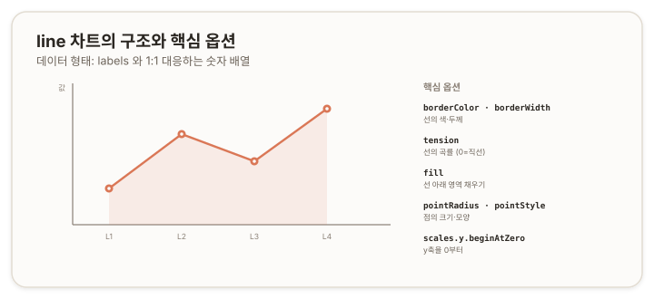

# line 차트 — 꺾은선 {#top}

> **타입 시리즈.** [L1(보편 원리)](../01-chartjs-core-concepts)·[L2(Vue 통합)](../02-chartjs-with-vue)·[L3(환경 사정)](../03-chartjs-in-practice)을 전제로 한다. 이 문서는 `line` 타입의 골격부터 세부 옵션과 how-to까지 다룬다.

## 1. 개요 {#overview}

`line`은 연속적인 값의 변화와 추세를 표현하는 차트다. 시간이나 순서를 따라가는 데이터, 즉 항목 간 *연결*에 의미가 있는 경우에 적합하다. 범주(또는 시간)를 나타내는 `labels`와 값이 1:1로 대응하며, 점을 선으로 이어 흐름을 보여준다.

## 2. 기본 골격 {#skeleton}

```js
new Chart(ctx, {
  type: 'line',
  data: {
    labels: ['1월', '2월', '3월', '4월'],
    datasets: [{
      label: '계열 A',
      data: [10, 20, 15, 25],
      borderColor: '#da7756'
    }]
  },
  options: {
    scales: { y: { beginAtZero: true } }
  }
});
```

`type`을 제외하면 L1의 3층 구조와 동일하다. `line`의 특징은 대부분 `options`와 데이터셋(dataset) 속성에서 드러난다.

## 3. 데이터 구조 {#data-structure}

`line`의 `data.datasets[].data`는 두 형태를 취한다.

- **숫자 배열** — `[10, 20, 15, 25]`. `labels`와 인덱스로 1:1 대응한다. 가장 일반적인 형태다.
- **좌표 객체 배열** — `[{x: 0, y: 10}, {x: 5, y: 20}]`. x를 명시적 수치로 다룰 때 사용한다. 이 경우 `labels` 없이 x값이 위치를 정한다.

여러 계열은 `datasets` 배열에 항목을 추가해 겹쳐 그린다. 각 항목이 하나의 선이 된다.



## 4. 핵심 옵션 {#core-options}

`line`의 옵션은 선·점·축으로 나누어 본다. 선과 점 속성은 데이터셋에 직접 지정하거나 `options.elements`에서 전역 기본값으로 둘 수 있다.

### 4.1 선 {#line-element}

| 속성 | 역할 |
|---|---|
| `borderColor` · `borderWidth` | 선의 색·두께 |
| `tension` | 곡률. `0`이면 직선, `0.3~0.4`면 부드러운 곡선 |
| `fill` | 선 아래 영역 채우기(`true` / `'origin'` / `'-1'` 등) |
| `borderDash` | 점선 패턴(예: `[5, 5]`) |
| `stepped` | 계단형 연결 |

### 4.2 점 {#point-element}

| 속성 | 역할 |
|---|---|
| `pointRadius` | 점 크기. `0`이면 점 숨김 |
| `pointStyle` | 점 모양(`'circle'`, `'rect'`, `'triangle'` 등) |
| `pointBackgroundColor` · `pointBorderColor` | 점 색 |
| `pointHoverRadius` | 호버 시 점 크기 |

### 4.3 축 (scales) {#scales}

`line`은 직교 좌표축을 사용한다(L1 2.2). x축은 `category`(기본)·`linear`·`time` 등으로, y축은 보통 `linear`로 동작한다.

| 속성 | 역할 |
|---|---|
| `scales.x.type` | x축 종류(`'category'` / `'linear'` / `'time'`) |
| `scales.y.beginAtZero` | y축을 0부터 시작 |
| `scales.y.min` · `max` | 범위 고정 |
| `scales.*.ticks` · `grid` | 눈금·격자 설정 |

### 4.4 결측과 성능 {#gaps-performance}

| 속성 | 역할 |
|---|---|
| `spanGaps` | `null` 값을 건너뛰어 선을 이을지 여부 |
| `options.plugins.decimation` | 대용량 데이터 솎아내기(점 수 축소) |

> 참고: [Chart.js — Line Chart](https://www.chartjs.org/docs/latest/charts/line.html), [Elements](https://www.chartjs.org/docs/latest/configuration/elements.html), [Axes](https://www.chartjs.org/docs/latest/axes/)

## 5. How-to {#how-to}

**곡선으로 부드럽게.**
```js
datasets: [{ data, tension: 0.35 }]
```

**선 아래 영역 채우기.**
```js
datasets: [{ data, fill: true }] // 'origin' = 0 기준, '-1' = 아래 데이터셋 기준
```

**점 숨기기(선만 표시).**
```js
datasets: [{ data, pointRadius: 0 }]
```

**계단형·점선.**
```js
datasets: [{ data, stepped: true }]            // 계단
datasets: [{ data, borderDash: [5, 5] }]       // 점선
```

**다중 y축.** 단위가 다른 두 계열을 한 차트에 그릴 때, y축을 두 개 두고 각 데이터셋이 어느 축을 쓸지 `yAxisID`로 지정한다.
```js
options: {
  scales: {
    y:  { position: 'left' },
    y1: { position: 'right', grid: { drawOnChartArea: false } }
  }
},
data: {
  datasets: [
    { data: a, yAxisID: 'y' },
    { data: b, yAxisID: 'y1' }
  ]
}
```

**시간축.** x를 날짜로 다룰 때 `type: 'time'`을 쓴다. 이 경우 날짜 어댑터(date adapter) 라이브러리가 별도로 필요하다.
```js
options: { scales: { x: { type: 'time' } } }
```

**대용량 데이터.** 점이 수천 개를 넘으면 `decimation` 플러그인으로 솎아내고 `pointRadius: 0`으로 점 렌더링 비용을 줄인다.

> 참고: [Time Cartesian Axis](https://www.chartjs.org/docs/latest/axes/cartesian/time.html), [Data Decimation](https://www.chartjs.org/docs/latest/configuration/decimation.html)

## 6. 주의 {#caveats}

- **`null` 처리.** 기본적으로 `null` 위치에서 선이 끊긴다. 의도적으로 이으려면 `spanGaps: true`를, 끊김을 유지하려면 기본값을 둔다.
- **`tension` 과용.** 곡률을 높이면 실제로 존재하지 않는 중간 변화를 암시할 수 있다. 데이터 정확도가 중요한 경우 낮게 둔다.
- **점 과다.** 점이 많은 대용량 데이터에서 점을 모두 렌더링하면 성능이 떨어진다. `pointRadius: 0`과 `decimation`을 함께 고려한다.
