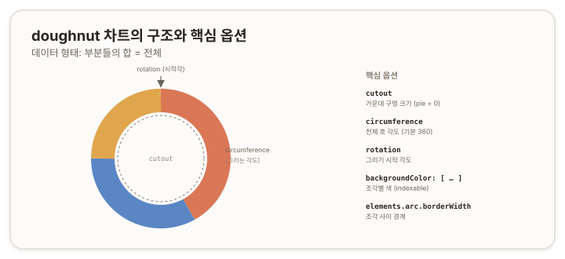

# doughnut 차트 — 도넛 {#top}

> **타입 시리즈.** [L1(보편 원리)](../01-chartjs-core-concepts)·[L2(Vue 통합)](../02-chartjs-with-vue)·[L3(환경 사정)](../03-chartjs-in-practice)을 전제로 한다. 이 문서는 `doughnut` 타입의 골격부터 세부 옵션과 how-to까지 다룬다.

## 1. 개요 {#overview}

`doughnut`은 부분과 전체의 비율을 표현하는 차트다. 각 조각이 *부분*, 전체 원이 *합*을 나타낸다(L1 2.3의 비율 분류). 범주 수가 적을 때(대략 2~5개) 구성 비율을 직관적으로 보여준다. `pie`와 거의 동일하며, 가운데 구멍의 유무로만 갈린다.

## 2. 기본 골격 {#skeleton}

```js
new Chart(ctx, {
  type: 'doughnut',
  data: {
    labels: ['A', 'B', 'C'],
    datasets: [{
      data: [40, 35, 25],
      backgroundColor: ['#da7756', '#5b86c4', '#e0a64e']
    }]
  }
});
```

`doughnut`은 직교 좌표축이 없으므로 `scales`를 사용하지 않는다(L1 2.2). 설정은 데이터셋과 도넛 형태 옵션에 집중된다.

## 3. 데이터 구조 {#data-structure}

- **`data`** — 숫자 배열. 각 값이 부분이며, 합이 전체를 이룬다. 값 자체가 곧 비율의 분자가 된다.
- **`backgroundColor`** — 조각별 색을 *배열*로 지정한다. 인덱스로 데이터에 대응하는 indexable 옵션이다(L1 3.3).
- **`labels`** — 각 조각의 이름. 범례·툴팁에 표시된다.



## 4. 핵심 옵션 {#core-options}

### 4.1 도넛 형태 {#doughnut-shape}

`doughnut`의 정체성을 결정하는 옵션이다. 이 셋의 조합이 `gauge` 같은 응용의 토대가 된다(L1 2.4).

| 속성 | 역할 |
|---|---|
| `cutout` | 가운데 구멍 크기(`'70%'` 또는 px). `0`이면 `pie`와 같아진다 |
| `circumference` | 그리는 전체 각도(기본 `360`). `180`이면 반원 |
| `rotation` | 그리기 시작 각도 |

### 4.2 조각 (elements.arc) {#arc-element}

| 속성 | 역할 |
|---|---|
| `borderWidth` · `borderColor` | 조각 경계의 두께·색 |
| `borderRadius` | 조각 모서리 둥글기 |
| `spacing` | 조각 사이 간격 |
| `offset` · `hoverOffset` | 조각을 중심에서 밀어내기(강조) |

### 4.3 범례·툴팁 (plugins) {#legend-tooltip}

조각 차트는 축이 없으므로 범례와 툴팁이 값을 읽는 주된 통로다.

| 속성 | 역할 |
|---|---|
| `plugins.legend.position` | 범례 위치(`'top'`, `'right'` 등) |
| `plugins.tooltip` | 툴팁 표시·서식 |

> 참고: [Chart.js — Doughnut and Pie Charts](https://www.chartjs.org/docs/latest/charts/doughnut.html), [Arc Element](https://www.chartjs.org/docs/latest/configuration/elements.html#arc-configuration)

## 5. How-to {#how-to}

**파이로 만들기.** 가운데 구멍을 없앤다.
```js
options: { cutout: 0 } // 또는 type: 'pie'
```

**구멍 크기 조절.**
```js
options: { cutout: '70%' } // 클수록 얇은 링
```

**반원 형태(게이지의 기초).** 전체 각도를 절반으로 줄이고 시작각을 돌려 아래가 평평한 반원을 만든다. 게이지의 세부는 별도 문서에서 다룬다.
```js
options: { circumference: 180, rotation: 270 }
```

**조각 사이 간격.** `spacing`을 주거나, 배경색과 같은 색의 `borderWidth`로 시각적 간격을 만든다.
```js
options: { elements: { arc: { spacing: 4 } } }
```

**조각 강조.** 특정 조각을 바깥으로 밀어낸다.
```js
datasets: [{ data, offset: [0, 20, 0] }] // 두 번째 조각만 밀어냄
```

**가운데 텍스트.** 도넛 중앙에 합계나 라벨을 그리려면 커스텀 플러그인의 `afterDraw`에서 캔버스에 직접 텍스트를 그린다(L1의 `ctx.fillText` 계열). 도넛 자체 옵션으로는 제공되지 않는다.

## 6. 주의 {#caveats}

- **`pie`와의 관계.** `pie`는 `doughnut`에서 `cutout`을 `0`으로 둔 것과 같다. 두 타입은 사실상 한 차트의 변형이다.
- **데이터 값.** `0`인 항목은 조각이 그려지지 않는다. 음수 값은 비율 표현에 적합하지 않으므로 사용하지 않는다.
- **조각 과다.** 조각이 많아지면(대략 6개 이상) 비율 구분이 어려워진다. 이 경우 `bar` 등 다른 표현을 고려한다.
- **gauge로의 확장.** 4.1의 `cutout`·`circumference`·`rotation`을 조합하면 반원 게이지를 만들 수 있다. 그 구체적 구성은 응용 타입 문서에서 이어진다.
