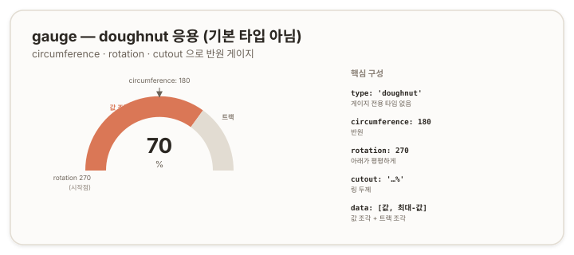

# gauge — 도넛 응용 반원 게이지 {#top}

> **타입 시리즈.** [L1(보편 원리)](../01-chartjs-core-concepts)·[L2(Vue 통합)](../02-chartjs-with-vue)·[L3(환경 사정)](../03-chartjs-in-practice)을 전제로 한다. `gauge`는 Chart.js의 **기본 제공 타입이 아니라** `doughnut`의 응용이다([doughnut 문서](./02-doughnut) 4.1이 토대다).

## 1. 개요 {#overview}

`gauge`는 0부터 최대까지의 범위에서 *단일 수치*를 반원 호로 표현한다. 사용률·점수·진행도처럼 "전체 중 현재 값"을 한눈에 보여줄 때 쓴다. 앞서 강조했듯 Chart.js에는 `gauge` 타입이 없다. `doughnut`을 반원으로 변형하고 데이터를 값/나머지 두 조각으로 구성해 게이지처럼 보이게 만든다.

## 2. 기본 골격 {#skeleton}

```js
new Chart(ctx, {
  type: 'doughnut',
  data: {
    datasets: [{
      data: [70, 30],                       // [값, 최대-값]
      backgroundColor: ['#da7756', '#e2dcd2'] // [값 색, 트랙 색]
    }]
  },
  options: {
    circumference: 180,  // 반원
    rotation: 270,       // 아래가 평평하게
    cutout: '75%',       // 링 두께
    plugins: { legend: { display: false }, tooltip: { enabled: false } }
  }
});
```



## 3. 데이터 구조 {#data-structure}

게이지는 `doughnut`의 비율 구조를 두 조각으로 고정해 사용한다.

- **`data: [값, 최대-값]`** — 첫 조각이 현재 값, 둘째 조각이 남은 트랙(track)이다. 합이 항상 최대값이 되도록 둘째를 `최대-값`으로 둔다.
- **`backgroundColor: [값 색, 트랙 색]`** — 값 조각은 강조색, 트랙 조각은 흐린 배경색을 준다.

값이 100점 만점에 70이면 `data: [70, 30]`이 된다. 갱신할 때 두 조각을 함께 다시 계산한다.

## 4. 핵심 옵션 {#core-options}

게이지의 형태는 `doughnut` 형태 옵션의 특정 조합으로 결정된다(doughnut 4.1).

| 속성 | 게이지에서의 값 | 역할 |
|---|---|---|
| `circumference` | `180` | 전체를 반원으로 |
| `rotation` | `270` | 시작각을 돌려 아래를 평평하게 |
| `cutout` | `'70%'~'80%'` | 링 두께(클수록 얇음) |
| `plugins.legend` | `display: false` | 게이지엔 범례 불필요 |
| `plugins.tooltip` | `enabled: false` | 트랙 조각의 툴팁 노출 방지 |

## 5. How-to {#how-to}

**반원 만들기.** 전체 각도를 절반으로, 시작각을 돌린다.
```js
options: { circumference: 180, rotation: 270 }
```

**값 갱신.** 두 조각을 함께 갱신하고 `update()`를 호출한다(L1 4장).
```js
chart.data.datasets[0].data = [value, max - value];
chart.update();
```

**임계에 따른 값 색.** 값에 따라 값 조각의 색을 바꾼다. L3의 `resolveColor`·`USAGE_LEVEL`을 그대로 적용한다 — 값 조각 색을 임계로 결정하고, 테마 변경은 watch로 잇는다.
```js
backgroundColor: (ctx) =>
  ctx.dataIndex === 0 ? colorByLevel(value) : TRACK_COLOR
```

**가운데 값 텍스트.** 도넛 중앙에 수치를 표시하는 옵션은 없다. 커스텀 플러그인의 `afterDraw`에서 캔버스에 직접 그린다(L1의 `ctx.fillText`).
```js
const centerText = {
  id: 'centerText',
  afterDraw(chart) {
    const { ctx, chartArea } = chart;
    // chartArea 중심에 ctx.fillText 로 값 그리기
  }
};
```

**트랙 숨기기.** 트랙 조각 색을 배경색과 같게 두면 값 조각만 떠 보인다.

**눈금·바늘 게이지.** 눈금 라벨이나 바늘(needle)이 필요한 본격 게이지는 도넛 변형만으로는 한계가 있다. 이 경우 게이지 전용 플러그인(예: `chartjs-gauge` 계열)이나 커스텀 플러그인을 검토한다.

## 6. 주의 {#caveats}

- **기본 타입이 아니다.** 코드만 보면 `type: 'doughnut'`이므로, 게이지 의도를 주석이나 컴포넌트 이름으로 명시해야 유지보수 시 혼동이 없다.
- **트랙 조각은 필수.** 둘째 조각(`최대-값`)을 빼면 값이 반원 전체를 채워 비율이 보이지 않는다.
- Gauge는 반원이라 기본적으로 종횡비는 **2 : 1** 이다. 반응형 CSS를 작업할 때 `aspect-ratio: 2 / 1`로 두거나, cqi 기준을 width에 맞춘다.
- **가운데 텍스트는 플러그인 의존.** 도넛 옵션에는 중앙 텍스트가 없다.
- **복잡한 게이지는 전용 도구.** 눈금·바늘·구간 색 등이 필요하면 도넛 변형을 고집하기보다 전용 플러그인이 효율적이다.
