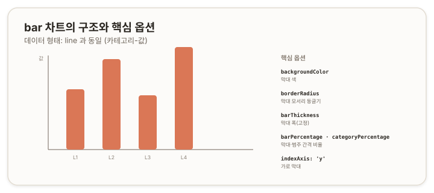

# bar 차트 — 막대 {#top}

> **타입 시리즈.** [L1(보편 원리)](../01-chartjs-core-concepts)·[L2(Vue 통합)](../02-chartjs-with-vue)·[L3(환경 사정)](../03-chartjs-in-practice)을 전제로 한다. 이 문서는 `bar` 타입의 골격부터 세부 옵션과 how-to까지 다룬다.

## 1. 개요 {#overview}

`bar`는 범주별 값의 크기를 막대로 비교하는 차트다. 항목 간 *연결*이 아니라 개별 크기의 *비교*에 초점이 있다는 점에서 `line`과 용도가 갈린다. 데이터 형태는 `line`과 동일한 카테고리–값(L1 2.3)이며, 표현 방식만 다르다.

## 2. 기본 골격 {#skeleton}

```js
new Chart(ctx, {
  type: 'bar',
  data: {
    labels: ['A', 'B', 'C', 'D'],
    datasets: [{
      label: '계열 A',
      data: [10, 20, 15, 25],
      backgroundColor: '#da7756'
    }]
  },
  options: {
    scales: { y: { beginAtZero: true } }
  }
});
```

`type`만 `'bar'`로 두면 `line`과 같은 데이터로 막대 차트가 된다. 두 타입이 데이터 구조를 공유한다는 점이 여기서 드러난다.



## 3. 데이터 구조 {#data-structure}

`line`과 동일하다(L1 2.3, [line 문서](./01-line) 3장).

- **숫자 배열** — `[10, 20, 15, 25]`. `labels`와 1:1 대응.
- **좌표 객체 배열** — `[{x, y}, …]`.
- **여러 계열** — `datasets`에 항목을 추가하면 범주마다 막대가 그룹으로 묶인다.

## 4. 핵심 옵션 {#core-options}

### 4.1 막대 {#bar-element}

| 속성 | 역할 |
|---|---|
| `backgroundColor` | 막대 색 |
| `borderColor` · `borderWidth` | 막대 테두리 |
| `borderRadius` | 막대 모서리 둥글기 |
| `borderSkipped` | 테두리를 생략할 변(예: `'bottom'`) |

### 4.2 폭과 간격 {#width-spacing}

| 속성 | 역할 |
|---|---|
| `barThickness` | 막대 폭을 고정값(px)으로 |
| `maxBarThickness` | 막대 폭 상한 |
| `barPercentage` | 한 범주 공간 안에서 막대가 차지하는 비율(0~1) |
| `categoryPercentage` | 전체 폭에서 한 범주가 차지하는 비율(0~1) |

### 4.3 방향 {#orientation}

| 속성 | 역할 |
|---|---|
| `indexAxis` | `'x'`(세로 막대, 기본) / `'y'`(가로 막대) |

### 4.4 축과 누적 {#scales-stacking}

`bar`는 `line`과 같은 직교 좌표축을 쓴다([line 문서](./01-line) 4.3). 누적 막대는 양 축의 `stacked` 옵션으로 만든다(세부는 stacked 문서에서 다룬다).

> 참고: [Chart.js — Bar Chart](https://www.chartjs.org/docs/latest/charts/bar.html), [Bar dataset properties](https://www.chartjs.org/docs/latest/charts/bar.html#dataset-properties)

## 5. How-to {#how-to}

**가로 막대.**
```js
options: { indexAxis: 'y' }
```

**막대 폭 고정.**
```js
datasets: [{ data, barThickness: 30 }]
```

**막대·범주 간격.** 두 비율이 곱해져 실제 막대 폭이 정해진다. 막대를 굵게 하려면 두 값을 키운다.
```js
datasets: [{ data, barPercentage: 0.9, categoryPercentage: 0.8 }]
```

**둥근 모서리.**
```js
datasets: [{ data, borderRadius: 6 }]
```

**그룹 막대.** 데이터셋을 여러 개 두면 범주마다 막대가 나란히 묶인다.
```js
datasets: [
  { label: 'A', data: a },
  { label: 'B', data: b }
]
```

**누적 막대(기초).** 양 축에 `stacked: true`를 주면 막대가 쌓인다. 구체적 구성은 stacked 문서에서 이어진다.
```js
options: { scales: { x: { stacked: true }, y: { stacked: true } } }
```

## 6. 주의 {#caveats}

- **`barPercentage`와 `categoryPercentage` 구분.** 둘 다 0~1이며, 곱해져 막대 폭을 정한다. 간격이 의도와 다르면 두 값을 함께 점검한다.
- **`line`과의 관계.** 데이터 구조가 같아 `type`만 바꿔도 전환된다. 두 표현을 비교하거나 혼합(mixed)할 때 이 공통점이 바탕이 된다.
- **누적 세부는 별도.** 누적의 축 설정·순서·색 처리는 stacked 문서에서 다룬다.
- **막대 과다.** 막대가 매우 많으면 폭이 자동으로 줄어 가독성이 떨어진다. `barThickness`나 범주 수 조정을 고려한다.
