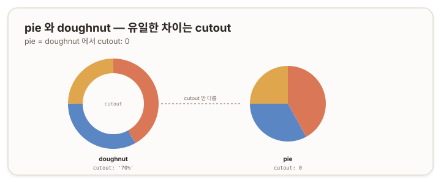

# pie 차트 — 파이 {#top}

> **타입 시리즈.** [L1(보편 원리)](../01-chartjs-core-concepts)·[L2(Vue 통합)](../02-chartjs-with-vue)·[L3(환경 사정)](../03-chartjs-in-practice)을 전제로 한다. `pie`는 [`doughnut`](./02-doughnut)과 거의 동일하므로, 이 문서는 차이와 관계를 중심으로 정리한다.

## 1. 개요 {#overview}

`pie`는 부분과 전체의 비율을 표현하는 차트다. 각 조각이 부분, 전체 원이 합을 나타낸다. `doughnut`과 표현·데이터·옵션이 사실상 같으며, **가운데 구멍의 유무로만 갈린다.** `pie`는 구멍 없이 원을 꽉 채우고, `doughnut`은 가운데를 비운다.



## 2. 기본 골격 {#skeleton}

```js
new Chart(ctx, {
  type: 'pie',
  data: {
    labels: ['A', 'B', 'C'],
    datasets: [{
      data: [40, 35, 25],
      backgroundColor: ['#da7756', '#5b86c4', '#e0a64e']
    }]
  }
});
```

`doughnut`의 골격에서 `type`만 `'pie'`로 바꾼 형태다. 내부적으로 `pie`는 `cutout: 0`인 `doughnut`과 같다.

## 3. 데이터 구조 {#data-structure}

[`doughnut` 문서](./02-doughnut) 3장과 동일하다.

- **`data`** — 숫자 배열. 각 값이 부분, 합이 전체.
- **`backgroundColor`** — 조각별 색을 배열로(indexable).
- **`labels`** — 조각 이름.

## 4. 핵심 옵션 {#core-options}

`doughnut`과 옵션을 공유한다([doughnut 문서](./02-doughnut) 4장). 한 가지 차이는 `cutout`의 기본값이다.

| 속성 | `pie`에서 |
|---|---|
| `cutout` | 기본 `0`(구멍 없음). 값을 주면 도넛처럼 된다 |
| `circumference` · `rotation` | `doughnut`과 동일하게 동작 |
| `elements.arc.*` | `doughnut`과 동일(`borderWidth`·`spacing`·`offset` 등) |
| `plugins.legend` · `tooltip` | `doughnut`과 동일 |

> 참고: [Chart.js — Doughnut and Pie Charts](https://www.chartjs.org/docs/latest/charts/doughnut.html)

## 5. How-to {#how-to}

`doughnut`의 how-to가 그대로 적용된다([doughnut 문서](./02-doughnut) 5장). `pie` 특유의 항목만 적는다.

**도넛으로 전환.** 가운데 구멍을 준다.
```js
options: { cutout: '50%' } // pie 에 cutout 을 주면 도넛이 된다
```

**조각 강조·간격·반원** 등은 모두 `doughnut`과 같으므로 해당 문서를 참조한다.

## 6. 주의 {#caveats}

- **`doughnut`과의 관계.** `pie`와 `doughnut`은 `cutout` 하나로 갈리는 한 차트의 변형이다. 둘 중 선택은 가운데 공간 활용(예: 중앙 텍스트) 여부로 판단한다.
- **데이터 값.** `0`인 항목은 조각이 그려지지 않으며, 음수는 비율 표현에 적합하지 않다.
- **조각 과다.** 조각이 많아지면 비율 구분이 어렵다. 이 경우 `bar` 등을 고려한다.
