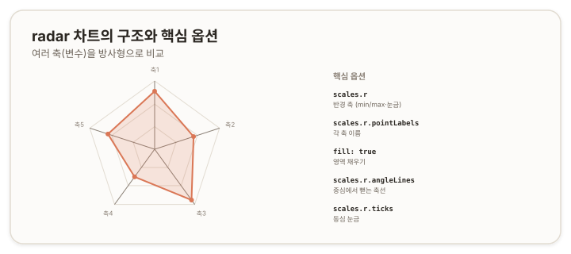

# radar 차트 — 방사형 {#top}

> **타입 시리즈.** [L1(보편 원리)](../01-chartjs-core-concepts)·[L2(Vue 통합)](../02-chartjs-with-vue)·[L3(환경 사정)](../03-chartjs-in-practice)을 전제로 한다. 이 문서는 `radar` 타입의 골격부터 세부 옵션과 how-to까지 다룬다.

## 1. 개요 {#overview}

`radar`는 여러 변수(축)의 값을 하나의 방사형 도형으로 표현하는 차트다. 한 대상의 여러 지표를 동시에 보여주는 *프로파일* 비교에 적합하다. 각 축이 하나의 변수이고, 중심에서 멀수록 값이 크다. 여러 대상을 겹쳐 그려 프로파일의 모양을 비교한다.

## 2. 기본 골격 {#skeleton}

```js
new Chart(ctx, {
  type: 'radar',
  data: {
    labels: ['속도', '힘', '정확도', '지구력', '기술'], // 각 축
    datasets: [{
      label: '대상 A',
      data: [85, 60, 92, 50, 72],   // 축마다 값
      fill: true
    }]
  },
  options: {
    scales: { r: { beginAtZero: true } }
  }
});
```



## 3. 데이터 구조 {#data-structure}

- **`labels`** — 각 축(변수)의 이름. 축의 개수를 정한다.
- **`data`** — 숫자 배열. `labels`와 1:1로, 각 축의 값이다.
- **여러 계열** — `datasets`에 항목을 추가하면 프로파일이 겹쳐 그려진다. 각 항목이 하나의 다각형이 된다.

축의 *순서*가 도형의 모양을 결정한다. 같은 값이라도 `labels` 순서를 바꾸면 다른 형태가 된다.

## 4. 핵심 옵션 {#core-options}

`radar`는 직교 x·y축이 아니라 **단일 방사 축(radial axis) `r` 하나**를 사용한다. 축 관련 설정은 모두 `scales.r` 아래에 모인다.

### 4.1 방사 축 (scales.r) {#radial-axis}

| 속성 | 역할 |
|---|---|
| `scales.r.beginAtZero` · `min` · `max` | 반경 값 범위 |
| `scales.r.ticks` | 동심 눈금(중심에서 바깥으로) |
| `scales.r.pointLabels` | 각 축 끝의 이름 라벨 |
| `scales.r.angleLines` | 중심에서 각 꼭지점으로 뻗는 축선 |
| `scales.r.grid` | 동심 격자 |

### 4.2 선·점·채움 (dataset / elements) {#line-point-fill}

| 속성 | 역할 |
|---|---|
| `borderColor` · `borderWidth` | 다각형 외곽선 |
| `fill` | 다각형 내부 채우기 |
| `tension` | 꼭지점 사이 곡률 |
| `pointRadius` · `pointStyle` | 꼭지점 점 표시 |

> 참고: [Chart.js — Radar Chart](https://www.chartjs.org/docs/latest/charts/radar.html), [Linear Radial Axis](https://www.chartjs.org/docs/latest/axes/radial/linear.html)

## 5. How-to {#how-to}

**축 범위 고정.** 모든 축에 같은 범위를 적용한다.
```js
options: { scales: { r: { min: 0, max: 100 } } }
```

**영역 채우기.**
```js
datasets: [{ data, fill: true }]
```

**축 이름 스타일.**
```js
options: { scales: { r: { pointLabels: { font: { size: 13 } } } } }
```

**격자·축선 조절.**
```js
options: {
  scales: {
    r: {
      angleLines: { color: '#e2dcd2' }, // 중심에서 뻗는 선
      grid:       { color: '#eee' }      // 동심 격자
    }
  }
}
```

**여러 프로파일 비교.** 데이터셋을 여러 개 두고 반투명 채움으로 겹친다.
```js
datasets: [
  { label: 'A', data: a, fill: true },
  { label: 'B', data: b, fill: true }
]
```

## 6. 주의 {#caveats}

- **단일 방사 축.** `radar`는 `scales.x`/`scales.y`가 아니라 `scales.r` 하나를 쓴다. x·y축 설정을 적으면 적용되지 않는다.
- **축 순서가 모양을 정한다.** `labels` 순서를 바꾸면 같은 데이터도 다른 도형이 된다. 비교 대상 간 축 순서를 통일한다.
- **축 개수.** 축이 3개 미만이면 도형이 성립하지 않고, 너무 많으면(대략 8개 초과) 라벨이 겹치고 모양을 읽기 어렵다.
- **값 범위 불일치.** 축마다 값의 척도가 다르면(예: 0~1과 0~1000) 한 축이 도형을 지배한다. 정규화하거나 축 범위를 맞춘다.
