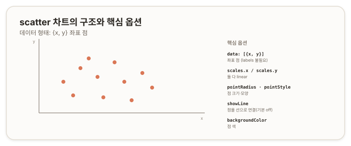

# scatter 차트 — 산점도 {#top}

> **타입 시리즈.** [L1(보편 원리)](../01-chartjs-core-concepts)·[L2(Vue 통합)](../02-chartjs-with-vue)·[L3(환경 사정)](../03-chartjs-in-practice)을 전제로 한다. 이 문서는 `scatter` 타입의 골격부터 세부 옵션과 how-to까지 다룬다.

## 1. 개요 {#overview}

`scatter`는 두 연속 변수의 관계를 점의 분포로 표현하는 차트다. 각 점이 `(x, y)` 한 쌍이며, 점들의 흩어진 모양으로 상관이나 군집을 읽는다. `line`과 달리 x를 *범주*가 아니라 *수치*로 다루는 것이 핵심 차이다.



## 2. 기본 골격 {#skeleton}

```js
new Chart(ctx, {
  type: 'scatter',
  data: {
    datasets: [{
      label: '관측',
      data: [
        { x: 1, y: 3 },
        { x: 2.5, y: 5 },
        { x: 4, y: 2 }
      ]
    }]
  },
  options: {
    scales: { x: { type: 'linear' }, y: { type: 'linear' } }
  }
});
```

`labels`가 없고 `data`가 좌표 객체 배열인 점이 특징이다. x값이 점의 가로 위치를 직접 정한다.

## 3. 데이터 구조 {#data-structure}

- **`data: [{x, y}, …]`** — 좌표 객체 배열. x·y 모두 수치다.
- **`labels` 불필요** — x가 위치를 정하므로 `labels`를 쓰지 않는다.
- **여러 그룹** — `datasets`를 여러 개 두고 색을 달리해 군집을 구분한다.

## 4. 핵심 옵션 {#core-options}

### 4.1 축 (scales) {#scales}

`scatter`는 **x축도 `linear`가 기본**이다. 이 점이 x축이 `category`인 `line`·`bar`와 다르다(L1 2.2와 타입별 차이).

| 속성 | 역할 |
|---|---|
| `scales.x.type` | 기본 `'linear'`(수치 축). `line`과 다른 지점 |
| `scales.x.min` · `max` / `scales.y.min` · `max` | 양 축 범위 |

### 4.2 점·선 (dataset / elements) {#point-line}

| 속성 | 역할 |
|---|---|
| `pointRadius` · `pointStyle` | 점 크기·모양 |
| `backgroundColor` · `borderColor` | 점 색 |
| `showLine` | 점을 선으로 이을지(기본 `false`) |

> 참고: [Chart.js — Scatter Chart](https://www.chartjs.org/docs/latest/charts/scatter.html)

## 5. How-to {#how-to}

**점 크기·모양.**
```js
datasets: [{ data, pointRadius: 5, pointStyle: 'triangle' }]
```

**축 범위 고정.**
```js
options: { scales: { x: { min: 0, max: 10 }, y: { min: 0, max: 10 } } }
```

**점을 선으로 연결.** 정렬된 데이터를 선으로 잇고 싶을 때만 켠다.
```js
datasets: [{ data, showLine: true }]
```

**여러 군집 구분.**
```js
datasets: [
  { label: 'A', data: a, backgroundColor: '#da7756' },
  { label: 'B', data: b, backgroundColor: '#5b86c4' }
]
```

## 6. 주의 {#caveats}

- **x축이 `linear`.** `line`·`bar`는 x가 `category`이지만 `scatter`는 `linear`다. x를 범주처럼 다루면 의도와 다르게 배치된다.
- **`line`과의 관계.** `line`에 `{x, y}` 데이터를 주고 `showLine`을 끄면 `scatter`와 유사해진다. 두 타입은 x축 해석과 기본 `showLine` 값에서 갈린다.
- **대용량 성능.** 점이 매우 많으면 렌더링 비용이 커진다. 필요시 `pointRadius`를 줄이고 데이터를 솎는다.
