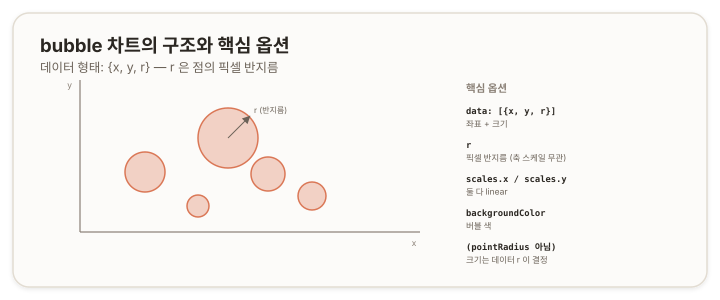

# bubble 차트 — 버블 {#top}

> **타입 시리즈.** [L1(보편 원리)](../01-chartjs-core-concepts)·[L2(Vue 통합)](../02-chartjs-with-vue)·[L3(환경 사정)](../03-chartjs-in-practice)을 전제로 한다. 이 문서는 `bubble` 타입의 골격부터 세부 옵션과 how-to까지 다룬다.

## 1. 개요 {#overview}

`bubble`은 `scatter`에 *크기* 차원을 더한 차트다. 각 점이 `(x, y)` 위치에 더해 반지름 `r`을 가지며, 점의 크기로 세 번째 변수를 표현한다. 즉 한 점에 세 개의 값을 담는다([scatter 문서](./07-scatter)의 2차원에서 한 차원 확장).



## 2. 기본 골격 {#skeleton}

```js
new Chart(ctx, {
  type: 'bubble',
  data: {
    datasets: [{
      label: '관측',
      data: [
        { x: 1, y: 3, r: 10 },
        { x: 2.5, y: 5, r: 20 },
        { x: 4, y: 2, r: 6 }
      ]
    }]
  },
  options: {
    scales: { x: { type: 'linear' }, y: { type: 'linear' } }
  }
});
```

`scatter`와 같은 좌표 구조에 `r`이 추가된 형태다.

## 3. 데이터 구조 {#data-structure}

- **`data: [{x, y, r}, …]`** — 좌표에 반지름이 더해진 객체 배열.
- **`r`은 픽셀 반지름** — `r`은 화면상 점의 반지름을 *픽셀*로 지정한다. 데이터 값의 척도(scale)와 무관하다. 이 점이 가장 흔한 오해의 원인이다(6장).

## 4. 핵심 옵션 {#core-options}

### 4.1 축 (scales) {#scales}

`scatter`와 동일하게 x·y 모두 `linear`다([scatter 문서](./07-scatter) 4.1).

### 4.2 크기와 색 {#size-color}

| 속성 | 역할 |
|---|---|
| `r` (데이터 속성) | 점의 픽셀 반지름. 축 스케일과 무관 |
| `backgroundColor` · `borderColor` | 버블 색 |

크기는 `pointRadius` 같은 *옵션*이 아니라 **데이터의 `r` 속성**으로 정해진다. 이 구분이 `bubble`의 특징이다.

> 참고: [Chart.js — Bubble Chart](https://www.chartjs.org/docs/latest/charts/bubble.html)

## 5. How-to {#how-to}

**값을 크기로 매핑.** `r`은 픽셀이므로, 원 데이터 값을 그대로 `r`에 넣으면 너무 크거나 작아진다. 값을 적절한 픽셀 범위로 *변환*해서 넣는다.
```js
// value 를 5~30px 반지름으로 선형 변환
const r = 5 + (value - min) / (max - min) * 25;
data.push({ x, y, r });
```

**버블 색.**
```js
datasets: [{ data, backgroundColor: 'rgba(218,119,86,0.4)' }]
```

**여러 그룹.** `scatter`처럼 데이터셋을 나눠 색으로 구분한다.

## 6. 주의 {#caveats}

- **`r`은 픽셀, 데이터 척도가 아니다.** `r`은 화면 픽셀 반지름이므로 축을 확대·축소해도 크기가 변하지 않는다. 데이터 값을 직접 `r`로 쓰면 의도와 다른 크기가 된다 — 반드시 변환한다.
- **면적 vs 반지름.** 사람은 원의 *면적*으로 크기를 인지하는데 `r`은 *반지름*이다. 값에 비례하게 보이려면 면적이 값에 비례하도록, 즉 반지름을 값의 제곱근에 비례시키는 편이 정확하다.
- **`scatter`와의 관계.** `bubble`은 `scatter`에 `r`을 더한 것이다. 크기 차원이 필요 없으면 `scatter`로 충분하다.
- **버블 과다·겹침.** 버블이 많고 크면 서로 겹쳐 가독성이 떨어진다. 투명도(`rgba`)나 개수 조정을 고려한다.
