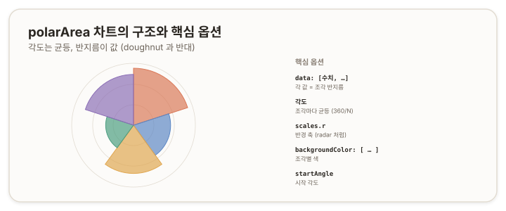

# polarArea 차트 — 극영역 {#top}

> **타입 시리즈.** [L1(보편 원리)](../01-chartjs-core-concepts)·[L2(Vue 통합)](../02-chartjs-with-vue)·[L3(환경 사정)](../03-chartjs-in-practice)을 전제로 한다. 이 문서는 `polarArea` 타입의 골격부터 세부 옵션과 how-to까지 다룬다.

## 1. 개요 {#overview}

`polarArea`(극영역)는 원형 차트이지만 값을 표현하는 방식이 `doughnut`과 반대다. **모든 조각의 각도가 균등하고(`360 / 조각 수`), 값은 조각의 반지름으로 나타낸다.** `doughnut`이 *각도*로 값을 표현하는 것과 대비된다. 형태상 `doughnut`의 원형 배치와 `radar`의 반경 축(radial axis)을 절반씩 닮았다.



## 2. 기본 골격 {#skeleton}

```js
new Chart(ctx, {
  type: 'polarArea',
  data: {
    labels: ['A', 'B', 'C', 'D', 'E'],
    datasets: [{
      data: [11, 16, 7, 14, 10],   // 각 값 = 조각 반지름
      backgroundColor: ['#da7756', '#5b86c4', '#e0a64e', '#4a9d7f', '#8a6db5']
    }]
  }
});
```

데이터 형태는 `doughnut`과 같은 숫자 배열이지만, 그 값이 반지름으로 쓰인다는 점이 다르다.

## 3. 데이터 구조 {#data-structure}

- **`data`** — 숫자 배열. 각 값이 해당 조각의 반지름을 정한다.
- **`backgroundColor`** — 조각별 색(indexable).
- **`labels`** — 조각 이름. 조각 수가 곧 균등 분할 각도를 정한다.

## 4. 핵심 옵션 {#core-options}

`polarArea`는 `radar`처럼 **반경 축 `scales.r`**를 사용한다(반지름이 값이므로).

| 속성 | 역할 |
|---|---|
| `scales.r.min` · `max` · `ticks` | 반경 값 범위와 눈금 |
| `scales.r.grid` · `angleLines` | 동심 격자·각도선 |
| `startAngle` | 그리기 시작 각도 |
| `elements.arc.*` | 조각 경계·테두리(`doughnut`과 공유) |
| `backgroundColor` | 조각 색 |

> 참고: [Chart.js — Polar Area Chart](https://www.chartjs.org/docs/latest/charts/polar.html)

## 5. How-to {#how-to}

**반경 범위 고정.**
```js
options: { scales: { r: { min: 0, max: 20 } } }
```

**시작 각도 조정.**
```js
options: { startAngle: -90 }
```

**조각 색·투명도.**
```js
datasets: [{ data, backgroundColor: ['rgba(218,119,86,0.6)', /* … */] }]
```

## 6. 주의 {#caveats}

- **`doughnut`과 반대.** `doughnut`은 각도로, `polarArea`는 반지름으로 값을 표현한다. 같은 데이터를 두 타입에 넣으면 전혀 다른 의미가 된다.
- **반경 축 사용.** 값이 반지름이므로 `scales.r`로 범위를 다룬다. `doughnut`에는 없는 축이다.
- **값 차이가 작을 때.** 반지름 차이가 작으면 조각 크기가 비슷해 구분이 어렵다. 이 경우 다른 표현을 고려한다.
- **면적 인지.** 반지름이 값에 비례하면 *면적*은 값의 제곱에 비례해 차이가 과장돼 보일 수 있다. 해석 시 유의한다.
