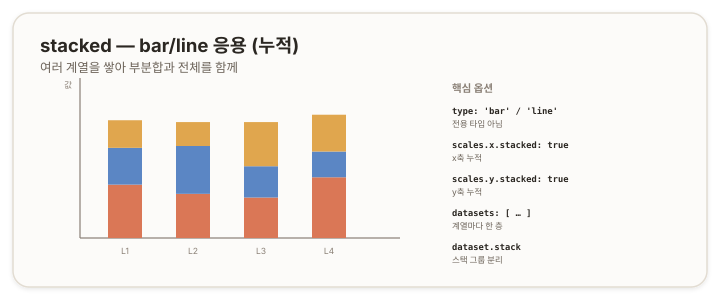

# stacked — 누적 (bar/line 응용) {#top}

> **타입 시리즈.** [L1(보편 원리)](../01-chartjs-core-concepts)·[L2(Vue 통합)](../02-chartjs-with-vue)·[L3(환경 사정)](../03-chartjs-in-practice)을 전제로 한다. `stacked`는 Chart.js의 **전용 타입이 아니라** `bar`/`line`에 누적 옵션을 적용한 응용이다([bar 문서](./04-bar) 4.4의 예고를 잇는다).

## 1. 개요 {#overview}

`stacked`(누적)는 여러 계열을 한 위치에 *쌓아* 부분합과 전체를 함께 보여주는 방식이다. 각 범주에서 계열들이 겹겹이 누적되어, 막대(또는 영역)의 전체 높이가 합계가 된다. 별도 차트 타입이 아니라 `bar`/`line`에 축의 `stacked` 옵션을 켜서 만든다.



## 2. 기본 골격 {#skeleton}

```js
new Chart(ctx, {
  type: 'bar',
  data: {
    labels: ['1월', '2월', '3월'],
    datasets: [
      { label: 'A', data: [10, 20, 15] },
      { label: 'B', data: [5, 10, 8] },
      { label: 'C', data: [8, 6, 12] }
    ]
  },
  options: {
    scales: {
      x: { stacked: true },
      y: { stacked: true }
    }
  }
});
```

데이터는 일반 `bar`(여러 데이터셋)와 같다. `scales.x.stacked`·`scales.y.stacked`를 켜면 데이터셋이 그룹으로 나란히 놓이는 대신 *쌓인다.*

## 3. 데이터 구조 {#data-structure}

- 일반 `bar`/`line`과 동일하다([bar 문서](./04-bar) 3장). 여러 `datasets`를 둔다.
- 누적은 데이터 형태가 아니라 *옵션*으로 결정된다. 같은 데이터라도 `stacked`를 끄면 그룹 막대, 켜면 누적 막대가 된다.
- 데이터셋의 *순서*가 쌓이는 순서다. 배열 앞쪽이 아래층이 된다.

## 4. 핵심 옵션 {#core-options}

| 속성 | 역할 |
|---|---|
| `scales.x.stacked` | x축 방향 누적 |
| `scales.y.stacked` | y축 방향 누적 |
| `dataset.stack` | 스택 그룹 식별자. 같은 값끼리 한 더미로 쌓인다 |

세로 막대 누적은 보통 양 축의 `stacked`를 모두 켠다. 한쪽만 켜면 의도와 다르게 동작할 수 있다.

> 참고: [Chart.js — Stacked Bar Chart](https://www.chartjs.org/docs/latest/charts/bar.html#stacked-bar-chart)

## 5. How-to {#how-to}

**누적 막대.**
```js
type: 'bar',
options: { scales: { x: { stacked: true }, y: { stacked: true } } }
```

**누적 영역(line).** `line`을 누적하려면 축 `stacked`에 더해 영역을 채운다(`fill`). 채우지 않으면 선만 쌓여 전체가 잘 읽히지 않는다.
```js
type: 'line',
data: { datasets: [{ data: a, fill: true }, { data: b, fill: true }] },
options: { scales: { y: { stacked: true } } }
```

**스택 그룹 분리.** 데이터셋을 여러 더미로 나눠 쌓는다. 같은 `stack` 값끼리 한 더미가 된다.
```js
datasets: [
  { label: 'A1', data: a1, stack: 'g1' },
  { label: 'A2', data: a2, stack: 'g1' }, // g1 더미에 누적
  { label: 'B1', data: b1, stack: 'g2' }  // 별도 더미
]
```

**100% 누적.** Chart.js에 비율 누적 기본 옵션은 없다. 각 범주 합이 100이 되도록 데이터를 미리 정규화하거나, 플러그인을 사용한다.

## 6. 주의 {#caveats}

- **양 축 설정.** 세로 누적 막대는 보통 `x.stacked`와 `y.stacked`를 모두 켠다. 한쪽만 켜면 누적이 제대로 적용되지 않는다.
- **`line` 누적은 `fill` 필요.** 누적 영역은 채우지 않으면 의미가 흐려진다.
- **음수 값.** 음수가 섞이면 위·아래로 나뉘어 쌓여 해석이 복잡해진다. 양수 데이터에 적합하다.
- **쌓는 순서.** 데이터셋 배열 순서가 곧 층 순서다. 의도한 위·아래를 배열 순서로 맞춘다.
- **100% 누적 미지원.** 비율 누적은 기본 제공되지 않으므로 정규화나 플러그인으로 처리한다.
