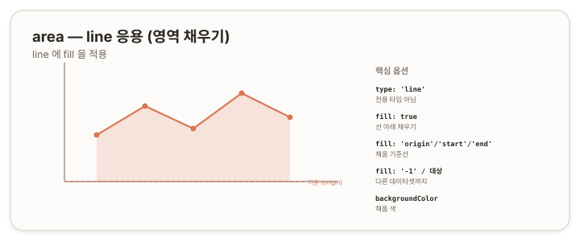

# area — 영역 (line 응용) {#top}

> **타입 시리즈.** [L1(보편 원리)](../01-chartjs-core-concepts)·[L2(Vue 통합)](../02-chartjs-with-vue)·[L3(환경 사정)](../03-chartjs-in-practice)을 전제로 한다. `area`는 Chart.js의 **전용 타입이 아니라** `line`에 `fill`을 적용한 응용이다([line 문서](./01-line)의 `fill`을 확장한다).

## 1. 개요 {#overview}

`area`(영역)는 `line`의 선 아래(또는 지정한 경계까지)를 채워 누적된 양이나 추세의 크기를 강조하는 방식이다. 별도 타입이 아니라 `line`에 `fill` 옵션을 켜서 만든다. 채움의 *기준선*을 어디로 잡느냐가 `area`의 핵심이다.



## 2. 기본 골격 {#skeleton}

```js
new Chart(ctx, {
  type: 'line',
  data: {
    labels: ['1월', '2월', '3월', '4월'],
    datasets: [{
      data: [10, 20, 15, 25],
      fill: true,
      backgroundColor: 'rgba(218,119,86,0.2)'
    }]
  }
});
```

`line`의 골격에 `fill: true`를 더한 형태다. 채움 색은 `backgroundColor`로 지정한다.

## 3. 데이터 구조 {#data-structure}

`line`과 동일하다([line 문서](./01-line) 3장). 채움은 데이터 형태가 아니라 `fill` 옵션으로 결정된다.

## 4. 핵심 옵션 {#core-options}

`area`의 형태는 `fill`의 *기준*에 따라 달라진다.

| `fill` 값 | 채움 기준 |
|---|---|
| `true` / `'origin'` | 0(축 원점)까지 |
| `'start'` | 축의 시작(최소)까지 |
| `'end'` | 축의 끝(최대)까지 |
| `'-1'` / `'+1'` | 인접한 아래/위 데이터셋까지 |
| `{ value: n }` | 특정 y값까지 |
| 데이터셋 인덱스 | 해당 데이터셋까지 |

| 그 외 속성 | 역할 |
|---|---|
| `backgroundColor` | 채움 색(투명도 포함) |
| `tension` | 선·영역 경계의 곡률([line 문서](./01-line) 4.1) |

> 참고: [Chart.js — Area Charts](https://www.chartjs.org/docs/latest/charts/area.html)

## 5. How-to {#how-to}

**기본 영역(0 기준).**
```js
datasets: [{ data, fill: 'origin' }]
```

**기준선 바꾸기.**
```js
datasets: [{ data, fill: 'start' }] // 축 최소까지
datasets: [{ data, fill: { value: 50 } }] // y=50 까지
```

**두 선 사이 채우기.** 한 데이터셋의 채움 경계를 다른 데이터셋으로 지정한다.
```js
datasets: [
  { data: upper, fill: '+1' }, // 아래(다음) 데이터셋까지
  { data: lower }
]
```

**그라데이션.** 채움 색을 캔버스 그라데이션으로 준다(L1의 캔버스 2D API). `backgroundColor`를 함수로 두고 `ctx.createLinearGradient`로 만든다.
```js
backgroundColor: (ctx) => {
  const g = ctx.chart.ctx.createLinearGradient(0, 0, 0, 200);
  // g.addColorStop(...) 으로 그라데이션 구성
  return g;
}
```

**누적 영역.** 여러 영역을 쌓으려면 축 `stacked`와 `fill`을 함께 쓴다. 세부는 [stacked 문서](./10-stacked) 5장을 참조한다.

## 6. 주의 {#caveats}

- **채움 기준 확인.** `'origin'`(0)·`'start'`(축 최소)·`'end'`(축 최대)는 결과가 다르다. 데이터에 음수가 있으면 기준에 따라 채움 방향이 달라진다.
- **투명도.** 영역을 겹쳐 그릴 때 불투명한 색은 아래 영역을 가린다. `rgba`로 투명도를 준다.
- **`line` 응용임.** 코드상 `type: 'line'`이므로 영역 의도를 명시하면 유지보수에 좋다.
- **누적은 별도.** 누적 영역의 축 설정은 [stacked 문서](./10-stacked)에서 다룬다.
