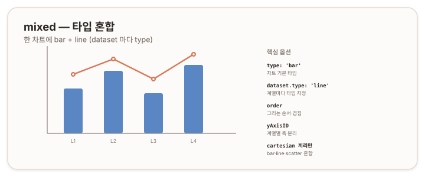

# mixed — 타입 혼합 {#top}

> **타입 시리즈.** [L1(보편 원리)](../01-chartjs-core-concepts)·[L2(Vue 통합)](../02-chartjs-with-vue)·[L3(환경 사정)](../03-chartjs-in-practice)을 전제로 한다. `mixed`는 전용 타입이 아니라 한 차트에 여러 타입을 섞는 구성 방식이다.

## 1. 개요 {#overview}

`mixed`(혼합)는 한 차트에서 데이터셋마다 다른 타입을 지정해 함께 그리는 방식이다. 대표적으로 실적은 막대(`bar`)로, 추세나 평균은 선(`line`)으로 겹쳐 보여준다. 차트 전체의 `type`이 기본값이 되고, 각 데이터셋이 `type`으로 자신의 표현을 덮어쓴다.



## 2. 기본 골격 {#skeleton}

```js
new Chart(ctx, {
  type: 'bar',                 // 차트 기본 타입
  data: {
    labels: ['1월', '2월', '3월'],
    datasets: [
      { type: 'bar',  label: '실적', data: [10, 20, 15] },
      { type: 'line', label: '추세', data: [12, 18, 16] }  // 이 계열만 line
    ]
  }
});
```

차트의 `type: 'bar'`가 기본이고, 둘째 데이터셋이 `type: 'line'`으로 자신만 선으로 그려진다.

## 3. 데이터 구조 {#data-structure}

- 각 데이터셋은 자신의 타입에 맞는 일반 데이터를 갖는다([line](./01-line)·[bar](./04-bar) 문서 3장).
- 핵심은 **데이터셋의 `type` 속성**이다. 이 속성이 해당 계열의 표현을 개별 결정한다.

## 4. 핵심 옵션 {#core-options}

| 속성 | 역할 |
|---|---|
| `dataset.type` | 데이터셋별 타입(`'bar'`·`'line'`·`'scatter'`) |
| `dataset.order` | 그리는 순서. 낮을수록 먼저(아래) 그려진다 |
| `dataset.yAxisID` | 데이터셋이 사용할 y축([line 문서](./01-line) 5장의 다중 축) |

`order`는 겹침을 제어한다. 선을 막대 위에 얹으려면 선 데이터셋의 `order`를 작게 둔다(또는 막대를 크게).

> 참고: [Chart.js — Mixed Chart Types](https://www.chartjs.org/docs/latest/charts/mixed.html)

## 5. How-to {#how-to}

**막대 + 선.**
```js
datasets: [
  { type: 'bar',  data: a },
  { type: 'line', data: b }
]
```

**선을 막대 위로.** 그리는 순서를 조정한다.
```js
datasets: [
  { type: 'bar',  data: a, order: 2 }, // 나중(위)? order 큰 쪽이 뒤
  { type: 'line', data: b, order: 1 }  // 먼저 그려 막대 위에 보이게
]
```

**다른 축에 매핑.** 단위가 다른 두 계열을 각자의 축에 둔다([line 문서](./01-line) 5장).
```js
options: {
  scales: { y: { position: 'left' }, y1: { position: 'right' } }
},
datasets: [
  { type: 'bar',  data: a, yAxisID: 'y' },
  { type: 'line', data: b, yAxisID: 'y1' }
]
```

## 6. 주의 {#caveats}

- **차트 `type` vs 데이터셋 `type`.** 차트 전체 `type`은 기본값이고, 데이터셋 `type`이 계열별로 덮어쓴다. 둘의 역할을 구분한다.
- **혼합 가능한 타입.** 같은 좌표계(cartesian)인 `bar`·`line`·`scatter`끼리만 한 차트에 섞을 수 있다. `doughnut`·`radar`·`polarArea`처럼 축 체계가 다른 타입은 함께 섞이지 않는다.
- **겹침 순서.** `order`로 어느 계열이 위에 오는지 정한다. 선이 막대에 가려지면 `order`를 점검한다.
- **축 정렬.** 다중 축을 쓸 때 두 축의 범위가 다르면 시각적 비교가 왜곡될 수 있다. 필요시 범위를 맞춘다.

---

> **타입 시리즈 마무리.** 기본 제공 8종(`line`·`bar`·`doughnut`·`pie`·`radar`·`polarArea`·`bubble`·`scatter`)과 응용 4종(`gauge`·`stacked`·`area`·`mixed`)을 한 문서씩 정리했다. 응용 타입은 모두 기본 타입의 옵션 조합이다 — `gauge`는 `doughnut`을, `stacked`·`mixed`는 `bar`/`line`을, `area`는 `line`을 토대로 한다. 데이터 형태(L1 2.3)와 타입–옵션의 관계(L1 3장)를 기준으로 보면, 12종은 네 갈래(직교 좌표의 추세·비교 / 원형의 비율 / 방사의 다변량 / 좌표 평면의 분포)로 묶인다.
