## getComputedStyle과 CSSStyleDeclaration

<DocEmbed
  src="notes/javascript/chart.js/_embeds/00-dev-note.md"
  anchor="dev-note-gauge-vue2"
  title="개발노트 ─ 테마 전환 메뉴얼 (Gauge Charts && Vue 2)"
/>

created()에서 색상값을 const Variable로 선언했던 걸 가벼운 함수로 고칠 수 있다. [(Window.getComputedStyle())](https://developer.mozilla.org/ko/docs/Web/API/Window/getComputedStyle)

<br/>

### getComputedStyle() 메서드

```javascript
var style = window.getComputedStyle(element[, pseudoElement]);

// element: 속성값을 얻으려하는 HTML Element (e.g., body, div, input, ...)
// pseudoElement: 가상 요소 (e.g., ::before, ::after, ::first-line, ...)
```

`getComputedStyle()` 메서드는 `CSSStyleDeclaration`이라는 *특수 객체( **Host Object** )의 읽기 전용으로 만들어진 computed 버전을 반환한다.* 이 객체는 CSS를 JavaScript 객체로 노출하는 표준 계층(CSSOM; CSS Object Model) 중 하나이며, `console.debug(style);`을 찍어 콘솔로 확인하면 이 객체를 JSON으로 펼쳐서 Plain Object와 같이 생긴 것처럼 보이게 만든 결과를 볼 수 있다.

```javascript
const style = getComputedStyle(document.body);
console.debug(style);
```

**computed(계산된) 스타일** 이라는 말처럼, `getComputedStyle(element)` 메서드는 최종 결정이 끝난 스타일을 갖고 있으며, 이는 브라우저가 지닌 표준 CSS 속성과 그 위에 얹은 커스텀 CSS를 모두 포함하고 있다.

### CSSStyleDeclaration

이 객체가 지닌 데이터는 크게 세 가지로 분류할 수 있다.



<br/>

**1. 색인 접근자(Indexed Getter):**<br/>
이 객체는 배열처럼 생겨서 `style[0]`, `style[20]`, `style.length` 처럼 접근할 수 있다. 이 색인 접근자는 Index로 Key를 찾고, 그 값(Value)으로 **"속성의 이름"**을 kebab-case를 갖는다. `{..., 28: 'background-color', 29: '', ..., 457: '--bs-orange', ...}` 처럼 생긴 것이다.

**2. IDL 속성 접근자 (IDL Attribute):**<br/>
[IDL(Interface Definition Language)는 브라우저가 객체 인터페이스를 정의하는 규약](https://developer.mozilla.org/ko/docs/Glossary/IDL)이며, 이 덕분에 표준 CSS 속성 하나하나마다 camelCase 접근자가 자동으로 생성된다. 속성 접근자는 `style.backgroundColor`, `style.accentColor`처럼 접근할 수 있다. 하지만 개발자가 새롭게 만든 커스텀 CSS 속성들까지 접근자를 자동으로 만들어주진 못한다.

**3. CSS 변수(Custom Property):**<br/>
`--bs-orange` 류는 흔히 CSS 변수라고 불리는 커스텀 속성(custom property)으로, 이들은 표준 속성이 아니기 때문에 IDL 접근자를 안 만들어준다. (`style.bsOrange` 처럼 쓸 수 없다.) *CSSSytleDeclaration 객체를 잘 뜯어보면, 색인 접근자 구역에는 드러나있는 커스텀 속성들이 IDL 접근자 구역에서는 찾아볼 수 없다는 걸 알 수 있다 ─ 난 안 살펴본다.*

<br/>

### CSS 값을 읽어오는 법 ─ getPropertyValue

IDL 접근자든, CSS 변수 이름이든, `style.getPropertyValues('...')` 메서드를 통해 속성값을 읽어들일 수 있다.

```javascript
const bgColor = getPropertyValues('backgroundColor');
const bgOrange = getPropertyValues('--bs-orange');
```

커스텀 속성은 [**CSS Type**](/)이 부여되지 않은 채 그저 문자(token stream)으로 존재한다.<br/>
예를 들어 '#0d6efd'라는 값이 --bs-primary로 지정되었다면, `getPropertyValue('--bs-primary')`의 반환값은 {string} 타입의 **'#0d6efd'**이지, 다른 표준 속성들처럼 **'rgb(13, 110, 253)'으로 나오지 않는다.**

커스텀 속성을 **라벨 안 붙은 봉투**로 비유하겠다. 브라우저는 이 불명의 봉투들을 이해하려 들지 않고 그냥 들어있는 값 그대로 전달만 한다(`getPropertyValue('--bs-primary')`). 실제 DOM을 렌더링할 때에만 이 커스텀 속성들을 표준 속성으로 흡수하는데, 그때 `color: var('--bs-primary')`와 같이 **타입을 지정하고 그 속성값을 정규화한다.**

이러면 css 파일을 작성할 때 검증하기가 까다로울텐데, 방법이 있다. 라벨을 억지로 붙여놓는 셈으로, `@property --bs-primary { syntax: '\<color>''; ... }`로 등록하면 그때부턴 브라우저도 이 커스텀 변수를 색으로 인지하고, getPropertyValue의 결과값도 정규화된 rgb 꼴로 반환된다.
