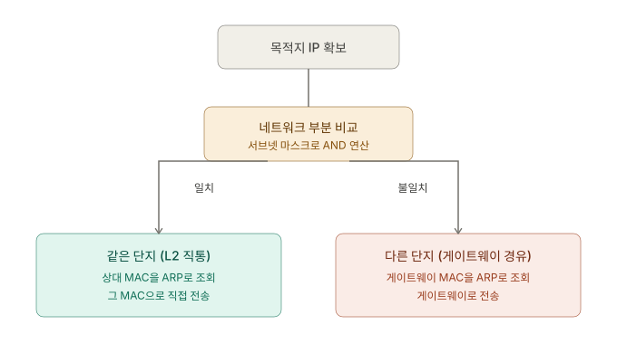
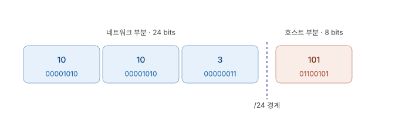

## 개요 ─ Stage 0 {#overview}

네트워크 학습은 *계층 모델*에서 시작한다. 패킷이 어떻게 흐르는지, 그 흐름이 왜 계층으로 나뉘는지를 잡지 못하면 후속 학습은 모두 표류한다. Stage 0은 가장 기본적인 개념 세 가지 — **주소(Address)**, **데이터 단위(Data Unit)**, **계층 책임(Layer Responsibility)** — 을 다룬다.

비유는 아파트 단지로 잡았다. *같은 단지 안 입주민끼리의 통신*과 *다른 단지로 향하는 통신*이 서로 다르게 일어난다는 사실이 이 stage 전체의 줄기다.

---

## 진단 질문 {#diagnostic-questions}

> **질문 1.<br/>**
> **MAC 주소(MAC Address)와 IP 주소(IP Address)의 차이**를 어떻게 설명할래? 둘 다 "주소"인데, 왜 두 개가 필요한 건지, 한쪽만 있으면 안 되나?

<none/>

> **질문 2.<br/>**
> 네 환경에서* 시나리오 하나 줄게.
>
>> `vmbr2`에 Debian VM이 두 대 붙어 있다고 치자. **VM-A는 10.10.3.101, VM-B는 10.10.3.102.** VM-A가 VM-B에게 `ping 10.10.3.102` 한 방을 쏜다.
>
> 이 ping 패킷은 **pfSense(10.10.3.15)를 거칠까, 안 꺼칠까?** 그리고 **왜 그렇게 생각해?**

<none/>

> **질문 3.<br/>**
> "vmbr2에 붙은 VM-A가 vmbr2에 붙은 VM-B에게 ping을 보낼 때, 패킷이 어떤 순서로 무슨 일이 일어나는가"를 네 말로 적어봐. 위의 단지 비유를 빌려도 좋고, 아예 네트워크 용어(MAC, IP, ARP)로 적어도 좋아.<br/>
> **VM-A는 처음에 VM-B의 MAC을 알고 있을까, 모르고 있을까?** 까지 답해주면 만점.

<none/>

> **질문 4.<br/>**
> 가벼운 응용 질문 하나. 너의 환경에서 Debian VM(10.10.3.101)이 google.com에 ping을 보내는 첫 패킷을 상상해봐. 그 패킷이 Debian VM의 NIC를 떠나는 순간, 그 프레임의 destination MAC은 누구의 MAC일까? google.com 서버의 MAC일까, 아니면 다른 누군가의 MAC일까? 그리고 그 이유는?

<none/>

> **질문 5.<br/>**
> VM-A(10.10.3.101)가 패킷을 보낼 때, **VM-B(10.10.3.102)는 같은 단지(직접 통신)** 이고 **google(예: 142.250.207.78)은 다른 단지(경비실 경유)** 라고 판단했잖아.<br/>
> VM-A는 대체 **무엇을 보고** 이 둘을 구분한 걸까? VM-A의 머릿속에서 어떤 비교 연산이 일어났길래, "얘는 같은 단지, 쟤는 다른 단지"라고 갈라낸 거야?

<none/>

> **질문 6.<br/>**
> (워밍업) `10.10.3.101/24`인 VM이 `10.10.4.101`에게 패킷을 보낸다. **같은 단지일까, 다른 단지일까?** <br/>
> (핵심) 이번엔 같은 VM의 마스크를 `/24`에서 `/16`으로 바꾸었다고 치자. 즉 `10.10.3.101/16`. 이제 같은 상대 `10.10.3.101`에게 보낸다. **이번엔 같은 단지일까, 다른 단지일까?** 그리고 **왜 /24일 때랑 판정이 달라지는지** 설명해봐.

<none/>

> **질문 7.<br/>**
> 무작위 모드가 왜 L2 이슈고, NAT가 왜 L3 이슈인가?

## 01. 계층 모델 ─ OSI와 TCP/IP {#layer-models-osi-tcpip}

네트워크의 모든 동작은 *계층(Layer)*으로 나뉜다. 각 계층은 *자기 책임만* 진다.

| 계층 | OSI 7-Layer  | TCP/IP 4-Layer       | 책임                             |
| ---- | ------------ | -------------------- | -------------------------------- |
| L7   | Application  | Application          | 사용자 프로토콜 (HTTP, SSH, DNS) |
| L6   | Presentation | (Application에 통합) | 암호화·인코딩                    |
| L5   | Session      | (Application에 통합) | 세션 관리                        |
| L4   | Transport    | Transport            | 종단 간 신뢰성, 포트 (TCP/UDP)   |
| L3   | Network      | Internet             | 라우팅, IP 주소                  |
| L2   | Data Link    | Link                 | 이웃 간 전달, MAC 주소           |
| L1   | Physical     | Link                 | 비트·전기·광신호                 |

OSI는 *학습용 지도*이고, TCP/IP는 *실제 인터넷의 모델*이다. Stage 0~4의 무게중심은 **L2~L4**에 있다.

각 계층은 *자기 책임만* 진다 — *각 계층이 서로 다른 문제를 푼다*는 것. 이웃 식별(L2), 끝점 식별(L3), 서비스 식별(L4)은 본질적으로 다른 문제이므로 *서로 다른 주소 체계*가 필요하다.

## 02. 아파트 단지 비유 {#apartment-complex-analogy}

> 서울에 아파트 단지 두 개가 있다고 치자. "강남단지"와 "성북단지".
> 강남단지 안엔 101동, 102동, 103동, … 여러 동이 있다. 각 동에는 입주민이 한 명씩 산다. 단지 입구에는 경비실이 있고, 단지 밖으로 나가거나 들어오는 모든 사람/택배는 경비실을 거친다.

| 비유                       | 네트워크                                                 |
| -------------------------- | -------------------------------------------------------- |
| 강남단지/성북단지          | 서로 다른 서브넷(Subnet) — 다른 L2 브로드캐스트 도메인   |
| 강남단지 안의 101동, 102동 | 같은 서브넷 안의 호스트들 (예: 10.10.3.101, 10.10.3.102) |
| 동 호수 (101동 101호)      | **IP 주소** — 단지 안에서의 *논리적 위치*                |
| 입주민의 얼굴/지문         | **MAC 주소** — 그 사람 _자체_를 식별하는 영구 ID         |
| 단지 입구 경비실           | **게이트웨이(Gateway)** = 라우터(Router)                 |

<br/>

---

**시나리오 ①: 강남단지 101동 사람이 같은 단지 102동 사람에게 빵을 전달한다.**

> _너는 102동 사람에게 빵을 주고 싶어. 너는 "102동"이라는 **주소(IP)** 만 알지, 그 집에 누가 사는지 **얼굴(MAC)** 은 몰라. 그럼 어떻게 해? 단지 방송으로 외친다. "102동에 사는 사람 누구야? 손 들어봐!" 그러면 102동 사람이 "나야"라고 손을 든다. 그제서야 너는 그 사람의 얼굴을 인식하고, 직접 그 사람에게 빵을 건넨다._

"102동 누구야?"의 방송이 바로 **ARP(Address Resolution Protocol)** 다. 비유를 떼고 생각하면, IP 주소를 MAC 주소로 변환해주는 단지 방송 시스템. 한 번 누구인지 확인했으면 그걸 메모 **(ARP 캐시)** 해두고 다음번엔 방송 안 하고 바로 전달할 수 있다.

**핵심** — 같은 단지 안에서의 전달은 경비실(게이트웨이)을 거치지 않는다.

<br/>

**시나리오 ②: 강남단지 101동 사람이 성북단지 어딘가의 사람에게 빵을 보낸다.**

> _이번엔 다르다. 너는 성북단지가 어디 있는지조차 몰라. 너의 인지 범위는 강남단지뿐이거든. 그럼 어떻게 해? 무조건 경비실(게이트웨이)에 갖다 맡긴다. "이거 성북단지 ○○동 사람한테 전해주세요." 경비실이 알아서 처리해. 경비실은 다른 단지로 가는 길을 알거든._

빵은 경비실 아저씨의 얼굴(MAC) 보고 건네지만, 빵 위에 적힌 최종 목적지(IP)는 성북단지 ○○동 그대로다. 경비실 아저씨도 그 빵을 직접 들고 가는 게 아니고, 다음 단지의 경비실에 또 넘긴다. 즉 — 빵에 적힌 최종 IP 주소는 끝까지 안 바뀌지만, 빵을 직접 손에 든 사람의 얼굴(MAC)은 매 단지마다 바뀐다.

**핵심** — IP는 패킷의 "최종 목적지"를 가리키고 끝까지 보존된다. MAC는 "지금 바로 다음 홉(next hop)을 가리키고 매 홉마다 새로 쓰인다."

>> **개인 노트:** pfSense로 라우터를 구성해 구동해도 네트워크 주소가 같은 VM끼리의 통신에서는 pfSense를 거치지 않는다. **이유는 "같은 L2 도메인에 붙어 있어서"** 다. 같은 L2 도메인에 붙어 있으니까 Gateway(경비실)를 거칠 일도 없고, ARP로 직접 통신 가능하고, 결과적으로 Gateway 설정도 공유되는 것이다.

## 03. 주소의 세 가지 — MAC, IP, Port {#three-addresses-mac-ip-port}

세 가지 주소가 *서로 다른 계층에서 서로 다른 일*을 한다.

| 주소                           | 계층 | 역할              | 특성                      |
| ------------------------------ | ---- | ----------------- | ------------------------- |
| **MAC (Media Access Control)** | L2   | *이웃 간\** 식별  | \*\*매 홉마다 바뀜        |
| **IP**                         | L3   | *끝점\*\*\** 식별 | 송신자~수신자 끝까지 유지 |
| **Port**                       | L4   | *서비스* 식별     | 22=SSH, 443=HTTPS         |

- \***MAC = L2(Data Link Layer)** ─ 같은 케이블/같은 스위치/같은 브리지로 연결된 "물리적 이웃" 사이의 통신<br/>
- \*\***각 기기의 MAC 자체**는 영구·고유하다. 매 홉마다 바뀌는 것은 **프레임의 `dst MAC` 필드에 적히는 값**이다.
- \*\*\***IP = L3(Network Layer)** ─ 라우터를 넘어가는 "논리적 목적지"까지의 통신

<br/>

비유로 정리하면 —

> **편지를 보낼 때:**
>
>> - **IP** = 받는 사람의 *호실 주소* (집 주소)
>> - **MAC** = 편지를 넘겨줄 다음 사람의 정보가 적힌 봉투의 *운송 라벨* (홉마다 갈아붙임)
>> - **Port** = 현관은 하나인데 안에 여러 창구를 구분

세 주소가 동시에 필요한 이유는 **서로의 레이어에서 각자의 제 역할이 필요** 하기 때문이다.

## 04. 데이터 단위 ─ Frame, Packet, Segment {#data-units-frame-packet-segment}

**캡슐화(Encapsulation)** ─ 데이터는 각 계층을 내려가며 _겉봉투가 한 겹씩 **덧씌워진다**_. 올라갈 때는 한 겹씩 벗긴다(**Decapsulation**).

| 계층           | 데이터 단위                            | 헤더 핵심 정보            |
| -------------- | -------------------------------------- | ------------------------- |
| L7 Application | 메시지 (Message)                       | URL, 메서드 등            |
| L4 Transport   | **Segment** (TCP) / **Datagram** (UDP) | src/dst Port, 시퀀스 번호 |
| L3 Network     | **Packet**                             | src/dst IP, TTL           |
| L2 Data Link   | **Frame**                              | src/dst MAC, EtherType    |
| L1 Physical    | 비트 (Bit)                             | —                         |

**같은 데이터가 계층마다 다른 이름으로 불린다.** 이름이 바뀌는 게 아니라, *그 계층의 헤더가 추가됐기 때문에 그 계층의 단위로 부르는* 것이다.

<br/>

### 캡슐화의 흐름 (송신 측) {#encapsulation-flow}

```markdown
[Application 데이터]
       ↓ L4 헤더 추가 (TCP/UDP)
[TCP Header | Application 데이터]                      ← Segment
       ↓ L3 헤더 추가 (IP)
[IP Header | TCP Header | Application 데이터]          ← Packet
       ↓ L2 헤더 추가 (Ethernet)
[Ethernet Header | IP Header | TCP | Data | CRC]      ← Frame
       ↓ L1 (NIC가 전기 신호로 변환)
[비트 스트림]
```

수신 측에서는 반대 방향으로 한 겹씩 벗기며 위로 올라간다. 이 *대칭성*이 네트워크 통신의 우아함이다.

## 05. ARP ─ IP와 MAC를 잇는 다리 {#arp-ip-to-mac}

같은 단지 안에서 통신할 때, 송신자는 *받는 사람의 IP*는 알지만 *MAC*은 모를 수 있다. 이때 **ARP(Address Resolution Protocol)**가 IP → MAC을 알려준다.

### ARP 동작 순서 {#arp-sequence}

```markdown
[1] VM-A (10.10.3.101) → 단지 전체에 브로드캐스트
    "10.10.3.102의 MAC이 누구야?"
    (dst MAC = ff:ff:ff:ff:ff:ff)

[2] VM-B (10.10.3.102) → VM-A에게 유니캐스트로 응답
    "내 MAC은 bb:bb:bb:bb:bb:bb야"

[3] VM-A → ARP 캐시에 저장
    (10.10.3.102 → bb:bb:bb:bb:bb:bb)
```

### ARP 특성 {#arp-characteristics}

- **요청**: 브로드캐스트로 단지 전체에 묻는다.
- **응답**: 유니캐스트로 질문자에게만 답한다.
- **캐시**: 한 번 알아낸 매핑은 일정 시간 저장된다. 리눅스에서는 `ip neigh`로 확인.

- 하나의 브리지(서브넷 - 단지)로 묶인 VM(입주민)끼리라 해도 **처음엔 서로의 MAC를 모른다.** 그래서 VM-A가 'dst\n IP 이거 누구야? MAC 알려줘'라고 단지 방송(ARP)을 때리면, 그때 VM-B가 나와서 MAC를 알려준다. VM-A는 VM-B의 MAC를 받아적고(ARP 캐시) 그제서야 프레임을 만들어 보낸다.
  \* **dst IP:** destination IP, 목적지 IP
- **ARP 브로드캐스트는 단지 경계를 못 넘는다.** 다른 단지의 IP 주소를 갖고 ARP를 직접 쓸 수 없으며, 해당 데이터는 Gateway를 통해 패킷으로써 다른 단지로 전달된다.

## 06. 단지 판별 ─ 서브넷 마스크와 AND 연산 {#subnet-decision-mask-and}

송신자가 통신을 시작할 때 *가장 먼저 하는 판단*은 *"받는 사람이 같은 단지인가, 다른 단지인가"*이다. 이 판단은 **서브넷 마스크(Subnet Mask)**와의 **비트 AND 연산**으로 이루어진다.



> 이 한 장이 Stage 0의 전부다. 패킷을 보낼 때 호스트는 항상 이 순서로 판단해.
>
> ① 서브넷 마스크로 "같은 단지인가?"를 따지고<br/> → ② 같으면 상대 MAC을, 다르면 게이트웨이 MAC을 ARP로 찾아<br/> → ③ 던진다. 그리고 이 와중에 패킷에 적힌 최종 IP는 끝까지 안 변하고, 손에 쥔 MAC만 매 홉마다 바뀐다.

<br/>

### /24 예시 {#subnet-example-24}



```bash
내 IP:          10.10.3.101
서브넷 마스크:  255.255.255.0   (/24)
내 네트워크:    10.10.3.0       (IP AND Mask)
```

상대 IP에도 같은 마스크를 씌워 AND한 결과를 비교한다.

```bash
상대 IP: 10.10.3.102  →  AND 10.10.3.0  →  같은 단지 ✓
상대 IP: 10.10.4.101  →  AND 10.10.4.0  →  다른 단지 ✗
```

<br/>

### /24 vs /16 — 마스크가 달라지면 판정도 달라진다 {#mask-comparison-24-vs-16}

같은 IP라도 *마스크가 다르면 단지가 달라진다*.

```markdown
10.10.3.101/24    →  네트워크: 10.10.3.0       (좁은 단지, 254개 호스트)
10.10.3.101/16    →  네트워크: 10.10.0.0       (넓은 단지, 65,534개 호스트)

상대 10.10.4.101에 대한 판정:
  - /24의 입장: 다른 단지 (10.10.4.0 ≠ 10.10.3.0)
  - /16의 입장: 같은 단지 (10.10.0.0 = 10.10.0.0)
```

**마스크는 "내가 어디까지를 이웃으로 볼 것인가"를 정의한다.** 같은 물리 환경에서도 마스크 설정만 다르게 하면 *통신 경로가 완전히 바뀐다*.

<br/>

### 호스트 부분 — 사용 가능한 IP 범위 {#host-range-usable-ips}

서브넷에서 두 IP는 *호스트로 쓸 수 없다*.

| 주소                                  | 의미                    |
| ------------------------------------- | ----------------------- |
| 네트워크 주소 (호스트부가 전부 0)     | 단지 자체를 가리킴      |
| 브로드캐스트 주소 (호스트부가 전부 1) | 단지 전체에 보내는 주소 |

`10.10.3.0/24`의 경우 — `.0`은 네트워크 주소, `.255`는 브로드캐스트 주소이므로, 실제로 호스트로 쓸 수 있는 IP는 `.1`~`.254`까지 254개다.

<br/>

### 마스크가 /25일 때 {#subnet-split-25}

대부분의 리눅스 실습 환경을 따라 마스크가 `/24`인 경우를 중점으로 작성했다. 만약 CIDR이 `/25`가 되면, 사용 가능한 IP 호스트 부분이 **줄어드는 게 아니라 둘로 쪼개는** 결과를 낳는다.



IP의 각 옥텟은 총 8비트로 구성된다. 그래서 8 * 3 = `/24`일 때 앞쪽 세 옥텟이 네트워크 부분으로 사용되는 것이다. `/25`에서는 세 옥텟 + 마지막 옥텟의 첫 번째 1bit까지 네트워크 부분으로 끌어간다는 뜻이다. 그리고 **그 한 비트가 `0`니야 `1`이냐에 따라 입주하게 될 단지가 구분된다.**

- 4옥텟 첫 비트 = `0` → `0xxxxxxx` → 십진수 `0~127` → 아래쪽 단지 (`10.10.3.0/25`)
- 4옥텟 첫 비트 = `1` → `1xxxxxxx` → 십진수 `128~255` → 위쪽 단지 (`10.10.3.128/25`)

<br/>

**그리고 쪼개진 각각의 단지에도 간판과 확성기가 새로 생긴다.**

| 마스크        | 단지 간판     | 전체 범위     | 네트워크(**`.0`**) | 브로드캐스트(`.255`) | 줄 수 있는 호스트     |
| ------------- | ------------- | ------------- | ------------------ | -------------------- | --------------------- |
| `/24`         | `10.10.3.0`   | `.0 - .255`   | `.0`               | `.255`               | `.1 - .254`(254개)    |
| `/25` 아래    | `10.10.3.0`   | `.0 - .127`   | `.0`               | `.127`               | `.1 - .126` (126개)   |
| `/25` 위      | `10.10.3.128` | `.128 - .255` | `.128`             | `.255`               | `.129 - .254` (126개) |
| `/26` 첫 구역 | `10.10.3.0`   | `.0 - .63`    | `.0`               | `.63`                | `.1 - .62` (62개)     |

## 07. 게이트웨이 ─ 단지를 떠나는 출구 {#gateway-exit-to-other-subnet}

다른 단지로 가야 한다고 판단되면, 송신자는 *자기 단지의 게이트웨이*에게 패킷을 맡긴다. 게이트웨이는 단지의 똑같은 한 명의 입주민(호실)이자, *다른 단지로 패킷을 라우팅*하는 장비(라우터)다.

<br/>

### 라우팅 테이블의 모습 {#routing-table-anatomy}

```bash
$ ip route
10.10.3.0/24 dev vmbr2 proto kernel scope link src 10.10.3.101
default via 10.10.3.15 dev vmbr2
```

- 첫 줄: *같은 단지*는 vmbr2로 직접 보낸다.
- 둘째 줄: *그 외 모든 경우(default)*는 게이트웨이 `10.10.3.15`를 거친다.

<br/>

### 다른 단지로 갈 때의 프레임 — dst MAC이 누구인가 {#cross-subnet-frame-dst-mac}

> 예시: VM-A(10.10.3.101)가 google.com(142.250.207.78)에 ping을 보낸다.

VM-A의 머릿속:

1. **목적지 IP를 본다**: `142.250.207.78`
2. **내 단지(/24)와 비교**: 다른 단지 → 게이트웨이 경유 결정
3. **게이트웨이의 MAC을 ARP로 알아낸다**: `10.10.3.15` → pfSense의 MAC
4. **프레임을 만든다**:
   - `dst MAC` = **pfSense의 MAC** (다음 홉)
   - `dst IP` = `142.250.207.78` (최종 목적지)

<br/>

> **VM-A가 결정한 dst MAC은 google.com 서버의 MAC이 아니라 pfSense(게이트웨이)의 MAC이다.**

패킷이 pfSense를 거치고 외부 라우터들을 거치며 결국 google.com 서버에 도착하는 동안 —

- **dst MAC은 매 홉마다 바뀐다** (그 다음 홉의 MAC으로 교체)
- **dst IP는 처음부터 끝까지 `142.250.207.78`로 유지된다**

이게 *L2와 L3의 책임 분리*가 만들어내는 결과다. MAC은 이웃의 식별, IP는 끝점의 식별. 매 홉마다 다른 책임이 다른 방식으로 갱신된다.

## 08. Broadcast Domain vs Collision Domain {#broadcast-vs-collision-domain}

이 두 개념은 *L2 네트워크의 도달 범위*와 *충돌 영역*을 정의한다. *왜 스위치가 허브를 대체했는가*, *왜 라우터가 단지 경계가 되는가*를 이해하는 토대다.

### Collision Domain (충돌 영역) {#collision-domain}

여러 기기가 *같은 물리 매체*를 공유할 때, 동시에 데이터를 보내면 **충돌(collision)**이 발생한다. 충돌이 일어날 수 있는 범위가 **Collision Domain**이다.

- **허브(Hub, L1)**: 받은 신호를 *모든 포트로 단순 복사*. 모든 포트가 한 collision domain.
- **스위치(Switch, L2)**: 포트마다 별개 collision domain. 동시 통신 가능.

현대 네트워크는 거의 모두 스위치 기반이라 collision domain은 *포트 단위*로 분리되어 있다. 허브 시절의 유물 개념에 가깝지만, **왜 스위치가 우월한가**의 핵심 답이 여기에 있다.

### Broadcast Domain (브로드캐스트 영역) {#broadcast-domain}

브로드캐스트 프레임(`dst MAC = ff:ff:ff:ff:ff:ff`)이 *도달하는 범위*가 **Broadcast Domain**이다. ARP 요청, DHCP 요청 같은 브로드캐스트가 *어디까지 흘러가느냐*를 결정한다.

- **허브**: 전체가 한 broadcast domain
- **스위치**: 한 broadcast domain (스위치도 브로드캐스트는 모든 포트로 flood)
- **라우터(Router, L3)**: broadcast domain을 *분리*. 라우터는 브로드캐스트를 다른 망으로 전달하지 않는다.
- **VLAN**: 한 스위치 안에서 broadcast domain을 *논리적으로* 분리 (Stage 3 영역)

## 09. 패킷의 생애주기 ─ 아파트 단지 비유 {#packet-lifecycle-walkthrough}

### 시나리오 A — 같은 단지 통신 (VM-A → VM-B) {#scenario-a-same-subnet}

> VM-A(10.10.3.101)가 VM-B(10.10.3.102)에게 `ping`을 보낸다. 둘 다 vmbr2에 붙어 있다.

```markdown
[1] VM-A: 단지 판별
    10.10.3.102 AND /24 = 10.10.3.0 → 내 단지와 같음 → 직접 통신

[2] VM-A: ARP 캐시 확인
    10.10.3.102의 MAC 없음 → ARP 브로드캐스트

[3] vmbr2의 모든 노드: ARP 요청 수신
    VM-B만 응답 → VM-A의 ARP 캐시에 저장

[4] VM-A: 프레임 생성
    src MAC = VM-A의 MAC
    dst MAC = VM-B의 MAC  ← 직접 받는 사람
    src IP  = 10.10.3.101
    dst IP  = 10.10.3.102

[5] vmbr2 (L2 스위치): FDB 조회 → VM-B 포트로 전달

[6] VM-B: 프레임 수신 → 응답 (echo reply) 전송
```

**핵심**: pfSense(게이트웨이)는 거치지 *않는다*. 게이트웨이는 *다른 단지로 갈 때만* 필요하다.

### 시나리오 B — 다른 단지 통신 (VM-A → google.com) {#scenario-b-cross-subnet}

> VM-A(10.10.3.101)가 google.com(142.250.207.78)에 `ping`을 보낸다.

```markdown
[1] VM-A: 단지 판별
    142.250.207.78 AND /24 = 142.250.207.0
    내 단지(10.10.3.0)와 다름 → 게이트웨이 경유

[2] VM-A: 게이트웨이의 MAC 확인
    라우팅 테이블 → default via 10.10.3.15
    ARP 캐시에서 10.10.3.15의 MAC 확인 (없으면 ARP)

[3] VM-A: 프레임 생성
    src MAC = VM-A의 MAC
    dst MAC = pfSense의 MAC      ← 다음 홉의 MAC!
    src IP  = 10.10.3.101
    dst IP  = 142.250.207.78     ← 최종 목적지 IP 유지

[4] pfSense: 프레임 수신
    L2 헤더 벗김 → L3 헤더 확인 → 자기 라우팅 테이블 조회
    NAT 적용 (Stage 2 영역): src IP를 공인 IP로 변환

[5] pfSense: 새 L2 헤더로 다음 홉(ISP 라우터)에 전달
    src MAC = pfSense WAN MAC
    dst MAC = ISP 라우터 MAC     ← 또 다시 바뀜
    src IP  = (NAT된 공인 IP)
    dst IP  = 142.250.207.78     ← 여전히 유지

[6] ... 외부 라우터들 ... 매 홉마다 dst MAC만 갱신, dst IP는 유지

[7] google.com 서버: 마지막 홉에서 도착 → 응답
```

### 두 시나리오의 대비 {#scenario-comparison}

| 측면            | 시나리오 A (같은 단지) | 시나리오 B (다른 단지)  |
| --------------- | ---------------------- | ----------------------- |
| 단지 판별 결과  | 같은 단지              | 다른 단지               |
| ARP 대상        | 상대 자체              | 게이트웨이              |
| dst MAC         | 상대의 MAC             | *게이트웨이*의 MAC      |
| dst IP          | 상대의 IP              | 상대의 IP (변하지 않음) |
| 게이트웨이 경유 | ✗ (직통)               | ✓                       |
| 매 홉 처리      | 단일 홉                | 매 홉마다 L2 갱신       |

> **MAC은 매 홉마다 갈아신는 운송 신발, IP는 끝까지 들고 가는 여권.**

## 10. 무작위 모드와 NAT {#promiscuous-mode-and-nat}

윈도우에서 하이퍼바이저로 중첩 가상화 환경을 구현할 때, [네트워크] > 어댑터의 [무작위 모드]가 뭐 하는 녀석인지 간단하게 정리해보았다.

### 무작위 모드 - L2 이슈 {#promiscuous-mode-l2}

무작위 모드(Promiscuous Mode)는 **NIC가 자기 MAC 아닌 프레임도 받을지**를 결정한다. *MAC 필터*의 on/off 스위치이므로 명백한 **L2 영역**.

- **정상 NIC**: `dst MAC = 내 MAC / 브로드캐스트 / 멀티캐스트`만 수신, 나머지는 NIC 하드웨어 단계에서 폐기
- **무작위 모드 NIC**: MAC 필터를 끔. 모든 프레임을 OS로 올림

가상화 환경에서 *NIC 하나 뒤에 여러 VM의 MAC*이 있는 상황을 처리하기 위해 켠다.

만약 무작위 모드가 '거부'인 상황에서, ISO로 구동한 Proxmox로 VM-A를 만들면 해당 NIC가 인지한 MAC은 Proxmox의 것이다. 중첩 VM-B를 만들고 여기서 외부로 통신을 시도하면, 이 프레임의 src MAC는 VM-B의 것이고 NIC는 자기가 인지한 MAC과 다르다며 프레임을 조용히 막아버린다.

### NAT ─ L3 이슈 {#nat-l3}

NAT(Network Address Translation)은 **IP 주소를 변환**한다. IP는 L3에 있으므로 명백한 **L3 영역.**

- 사설 IP(10.x, 192.168.x) ↔ 공인 IP 변환
- SNAT, DNAT, MASQUERADE
- conntrack이 5-tuple로 변환 매핑을 기억 (자세한 내용은 Stage 2에서)

---

## 부록 A. 핵심 어휘 빠른 참조 {#appendix-glossary}

| 용어                 | 한 줄 정의                                        |
| -------------------- | ------------------------------------------------- |
| **MAC Address**      | L2 식별자. 이웃 간 식별, 홉마다 바뀜              |
| **IP Address**       | L3 식별자. 끝점 식별, 송신자~수신자 끝까지 유지   |
| **Port**             | L4 식별자. 서비스 식별                            |
| **Frame**            | L2 데이터 단위. MAC 헤더 포함                     |
| **Packet**           | L3 데이터 단위. IP 헤더 포함                      |
| **Segment**          | L4 데이터 단위. TCP 헤더 포함 (UDP는 Datagram)    |
| **ARP**              | IP → MAC 해석 프로토콜 (L2)                       |
| **Subnet Mask**      | 단지 범위를 정의하는 비트 마스크                  |
| **Gateway**          | 다른 단지로 나가는 출구 (라우터)                  |
| **Broadcast Domain** | 브로드캐스트가 도달하는 범위                      |
| **Collision Domain** | 물리 충돌이 발생할 수 있는 범위                   |
| **Encapsulation**    | 상위 계층 데이터에 하위 계층 헤더를 덧씌우는 과정 |
| **Promiscuous Mode** | NIC가 자기 MAC 아닌 프레임도 받는 모드 (L2)       |
| **NAT**              | IP 주소 변환 (L3)                                 |

---

## 부록 B. 명령어 빠른 참조 {#appendix-commands}

```bash
# 인터페이스와 IP 확인
ip addr show
ip link show

# 라우팅 테이블 확인
ip route show

# ARP 캐시 확인
ip neigh show

# 같은 단지 통신 테스트
ping 10.10.3.102

# 다른 단지 통신 테스트
ping 142.250.207.78        # google
ping -c 4 google.com       # DNS 포함

# 경로 추적 (각 홉마다의 IP 보기)
traceroute google.com
mtr google.com             # 더 풍부한 정보
```

---

## 개인 노트 {#personal-notes}

### 미완·심화로 가는 길 {#further-study}

Stage 0에서 다루지 않거나 짧게만 지나간 영역. 언제든 돌아와 보강할 자리.

- **IPv6** — 이 노트는 IPv4 중심. IPv6의 NDP(Neighbor Discovery, ARP의 IPv6 대응), SLAAC, 주소 체계는 별도 학습.
- **ICMP 본격** — ping과 traceroute가 어떻게 동작하는지 (TTL 활용, type/code 등)
- **TCP/UDP 본격** — handshake, congestion control, window는 별도 stage
- **DNS / DHCP** — Application layer plumbing
- **Multicast** — 1대다 통신
- **MTU와 fragmentation** — 프레임 최대 크기와 분할

다음 [Stage 1: 리눅스 네트워크 스택의 도구들](./02-stage-1)에서 이 토대 위에 *실제 도구·명령*을 얹는다.

### 자기 점검 — 진단 질문 재방문 {#self-check-revisit}

이 노트를 다 읽고 나서 다시 진단 질문으로 돌아가 *답변을 정리해보면* 학습 완성도를 측정할 수 있다. 각 질문이 다루는 절을 옆에 표시한다.

1. **MAC vs IP의 차이** — 두 주소가 왜 둘 다 필요한가 → [MAC, IP, Port](#three-addresses-mac-ip-port)
2. **같은 단지 ping이 게이트웨이를 거치는가** → [시나리오 A](#scenario-a-same-subnet)
3. **VM-A → VM-B ping의 단계별 흐름** → [시나리오 A](#scenario-a-same-subnet)
4. **VM이 google.com에 ping할 때 첫 프레임의 dst MAC** → [게이트웨이](#gateway-exit-to-other-subnet)
5. **같은 단지 vs 다른 단지의 판별 메커니즘** → [단지 판별 ─ 서브넷 마스크와 AND 연산](#subnet-decision-mask-and)
6. **서브넷 마스크가 바뀌면 판정이 달라지는 이유** → [/24 vs /16 ─ 마스크가 달라지면 판정도 달라진다](#mask-comparison-24-vs-16)
7. **무작위 모드와 NAT가 각자 어느 계층의 일인가** → [무작위 모드와 NAT](#promiscuous-mode-l2)
