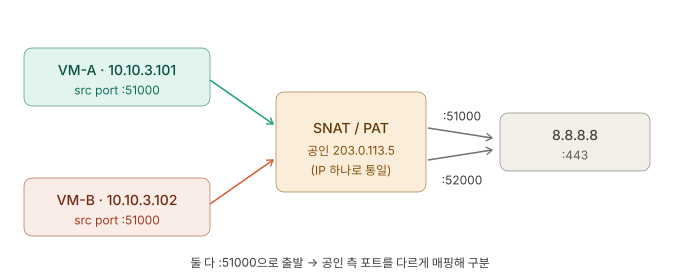

## 개요 ─ Stage 2 {#overview}

Stage 1이 *패킷을 보내는 도구*(`ip`, 라우팅 테이블, 브리지)였다면, Stage 2는 그 패킷을 **거르고(filter) 변환하는(NAT)** 계층이다. 리눅스 커널 안에서 패킷이 지나가는 검문소들 — **netfilter** — 과, 그 위에 세워진 **방화벽(Firewall)** 의 원리를 다룬다.

그리고 이 stage는 네 환경의 *두 얼굴*을 나란히 본다. 리눅스 Proxmox의 `iptables`와 FreeBSD pfSense의 `pf`. **같은 개념(필터·변환·연결 추적)을 두 OS가 어떻게 다르게 구현하는지**가 Stage 2의 숨은 축이다.

---

## 진단 질문 {#diagnostic-questions}

> **질문 1.**<br/>
> Proxmox 노드에서 `iptables -L -v`를 쳤더니, `filter` 테이블의 **INPUT·FORWARD·OUTPUT 세 체인이 모두 정책 `ACCEPT`에 규칙이 하나도 없다.** 카운터는 INPUT 226K, OUTPUT 219K, **FORWARD 0**.<br/>
> (a) 이게 Proxmox가 방화벽을 *안 한다*는 뜻일까?<br/>
> (b) 그렇다면 이 환경에서 방화벽은 *누가* 하나?

<br/>

> **질문 2.**<br/>
> 위에서 **FORWARD만 0**이고, INPUT(226K)·OUTPUT(219K)은 값이 크다.<br/>
> (a) INPUT / OUTPUT / FORWARD 세 체인은 각각 *어떤 패킷*을 세는 걸까?<br/>
> (b) `FORWARD = 0`이라는 사실이 이 Proxmox 노드의 *역할*에 대해 말해주는 게 뭐야? (힌트: Stage 1의 `ip_forward`, 스위칭 vs 라우팅)

<br/>

> **질문 3.**<br/>
> pfSense 셸에서 `conntrack -L`을 쳤더니 **command not found**가 떴다.<br/>
> (a) pfSense가 연결 추적(connection tracking)을 *안 해서* 그런 걸까?<br/>
> (b) 아니라면, 왜 그 명령이 없는 거고, pfSense에선 *무엇으로* 같은 것을 보지?

<br/>

> **질문 4.**<br/>
> 방화벽이 패킷을 막는 방법은 둘이다 — *조용히 버리기*(`Block`/`DROP`)와 *거부를 통보하기*(`Reject`/`REJECT`).<br/>
> (a) **외부(WAN)에서 들어오는** 트래픽을 막을 때, 둘 중 보안상 어느 게 유리할까?<br/>
> (b) 그 이유는? (힌트: 포트 스캐너에게 무엇을 알려주는가)

<br/>

> **질문 5.**<br/>
> 너는 MGMT 망(OPT1)에 `Action: Pass / Protocol: Any / Source: Any / Destination: Any` 룰을 박아뒀잖아.<br/>
> (a) 이 룰 하나가 그 인터페이스의 방화벽을 *사실상 무엇*으로 만들어버렸나?<br/>
> (b) MGMT 망에 침입자(또는 감염된 관리 단말)가 들어오면, 이 룰 아래서 *어디까지* 닿을 수 있을까?<br/>
> (c) 최소 권한(least privilege)으로 좁힌다면, *어떤 목적지·포트*만 열겠어?

<br/>

> **질문 6.**<br/>
> NAT의 두 방향을 가르자.<br/>
> (a) 내부 VM(`10.10.3.x`)이 외부로 나갈 때 *출발지 IP*를 공인 IP로 바꾸는 건 **SNAT일까 DNAT일까?** 그리고 **어느 체인**(PREROUTING / POSTROUTING)에서 일어나?<br/>
> (b) 반대로, 외부에서 내부 웹서버(`10.10.3.50:80`)로 들어오게 *포트포워딩*하는 건 어느 쪽이고, 어느 체인이야?

---

## 01. netfilter ─ 패킷이 지나는 검문소들 {#netfilter-overview}

**netfilter**는 리눅스 커널의 *패킷 처리 프레임워크*다. 패킷이 커널을 지날 때 *정해진 지점*에서 멈춰 검사받는데, 그 지점을 **hook(훅)**이라 한다. `iptables`(또는 현대의 `nftables`)는 이 hook에 *규칙을 거는 사용자 도구*일 뿐 — 실제로 패킷을 처리하는 엔진은 커널 안의 netfilter다.

핵심은 **2차원**이다. 패킷은 *언제(어느 hook)* × *무슨 일(어느 table)*의 교차점에서 처리된다.

<br/>

### 5개 hook ─ 패킷 흐름의 검문소 {#netfilter-five-hooks}

패킷이 커널을 지나는 경로에 다섯 개의 검문소가 있다.

```markdown
                     ┌─────────────┐
  들어온 패킷  ───→  │ PREROUTING  │  ← 막 도착, 라우팅 결정 전
                     └──────┬──────┘
                            │  [라우팅 결정]
              목적지가 나? ─┴─  목적지가 남?
                   │                  │
             ┌─────▼─────┐      ┌─────▼─────┐
             │   INPUT   │      │  FORWARD  │  ← 통과(경유) 패킷
             └─────┬─────┘      └─────┬─────┘
             로컬 프로세스            │
             ┌─────▼─────┐            │
             │  OUTPUT   │            │
             └─────┬─────┘            │
                   │                  │
             ┌─────▼──────────────────▼──────┐
             │          POSTROUTING          │  ← 막 나가기 직전
             └───────────────┬───────────────┘
                             ▼
                         나가는 패킷
```

| hook            | 시점                             | 핵심 쓰임                           |
| --------------- | -------------------------------- | ----------------------------------- |
| **PREROUTING**  | 도착 직후, 라우팅 결정 *전*      | 목적지 변환 (**DNAT**)              |
| **INPUT**       | 라우팅 후 — *목적지가 나 자신*   | 로컬 수신 트래픽 필터               |
| **FORWARD**     | 라우팅 후 — *목적지가 남* (통과) | 경유 트래픽 필터 (라우터 역할)      |
| **OUTPUT**      | 로컬 프로세스가 *내보내는* 패킷  | 로컬 송신 트래픽 필터               |
| **POSTROUTING** | 나가기 *직전*                    | 출발지 변환 (**SNAT / MASQUERADE**) |

**라우팅 결정**에서 목적지를 결정하는 지점이 중요하다. 패킷의 *목적지가 나 자신*이면 INPUT으로, *남(통과)*이면 FORWARD로 갈린다.

### 4개 table ─ 검문소에서 *하는 일* {#netfilter-four-tables}

같은 hook에서도 *무슨 일*을 하느냐에 따라 table이 갈린다.

| table      | 하는 일                      | 주로 쓰는 hook          |
| ---------- | ---------------------------- | ----------------------- |
| **filter** | 통과/차단 결정 (방화벽)      | INPUT, FORWARD, OUTPUT  |
| **nat**    | 주소 변환 (SNAT/DNAT)        | PREROUTING, POSTROUTING |
| **mangle** | 패킷 헤더 수정 (TOS, TTL 등) | (모든 hook)             |
| **raw**    | conntrack 추적 예외 처리     | PREROUTING, OUTPUT      |

일반적으로 알아둘 테이블은 **filter**(방화벽)와 **nat**(변환) 둘이다. mangle / raw는 특수 용도라 *존재만* 알아두면 된다.

---

## 02. filter 테이블 ─ 방화벽의 자리 {#filter-table}

`filter`는 *패킷을 통과시킬지 막을지* 결정하는 방화벽 테이블이다. 체인이라고 부를 세 훅에서는 *목적지에 따라 검문하는 패킷이 각자 다르다.*

| 체인        | 보는 패킷                         | "누구의 트래픽인가"                    |
| ----------- | --------------------------------- | -------------------------------------- |
| **INPUT**   | 목적지가 *이 머신 자신*           | 내게 들어오는 것 (SSH 접속, 웹 GUI 등) |
| **OUTPUT**  | 이 머신이 *내보내는* 것           | 내가 보내는 것 (응답, `apt` 등)        |
| **FORWARD** | 이 머신을 *통과*해 남에게 가는 것 | 내가 *라우터로서* 중계하는 것          |

<br/>

### 진단 질문 1·2 ─ Proxmox의 텅 빈 filter 테이블 {#empty-filter-table-proxmox}

예제 환경 속 Proxmox에서 `iptables -L -v`를 쳤을 때 — 세 체인 모두 정책 `ACCEPT`에 규칙 0개, 카운터는 **INPUT 226K / OUTPUT 219K / FORWARD 0**이었다. 이걸 해석하면:

- **(질문 1) Proxmox는 방화벽을 *안 한다*** — 규칙이 없고 정책이 ACCEPT니, 모든 패킷을 그냥 통과시킨다. 이는 *하이퍼바이저는 방화벽을 두지 않고, 방화벽은 pfSense가 전담한다*는 구조와 **정확히 일치**한다. Proxmox는 순수 하이퍼바이저 + L2 스위치로 남고, *모든 필터링은 pfSense가* 한다.
- **(질문 2) `FORWARD = 0`의 의미** — INPUT(226K)은 *Proxmox 자신에게 온* 패킷(SSH, 8006 웹 GUI)이며, OUTPUT(219K)은 *Proxmox가 보낸* 응답이다. 그런데 **FORWARD가 0** — 즉, ***이 노드를 통과해 다른 곳으로 라우팅된 패킷이 거의 없다.*** <br/>이건 Stage 1의 결론과 맞물린다: **Proxmox는 L2 스위칭만 하고 L3 라우팅을 하지 않는다.** VM에서 프레임이 외부로 나갈 때는 _Proxmox가 받아 넘기는(forward) 것이 아니라, **pfSense를 거쳐 VirtualBox vNIC로 나가기 때문에**_ FORWARD 카운터가 0인 것이다.

> **요약** — 텅 빈 filter 테이블 + `FORWARD=0`은 설계에 의한 네트워크 구성의 결과다. "방화벽도, 라우팅도 pfSense에 위임한 순수 하이퍼바이저"라는 결정이 데이터로 찍혀 나온 것

## 03. nat 테이블 ─ 주소 변환 {#nat-table}

`nat` 테이블은 패킷의 *IP·포트를 변환*한다. 방향에 따라 두 종류로 갈린다.

| 종류                       | 무엇을 바꾸나    | hook        | 쓰임                              |
| -------------------------- | ---------------- | ----------- | --------------------------------- |
| **SNAT** (Source NAT)      | *출발지* IP      | POSTROUTING | 내부 → 외부 (사설 IP를 공인 IP로) |
| **DNAT** (Destination NAT) | *목적지* IP      | PREROUTING  | 외부 → 내부 (포트포워딩)          |
| **MASQUERADE**             | 출발지 IP (동적) | POSTROUTING | SNAT의 동적 버전 (DHCP 환경)      |

<br/>

### 왜 SNAT은 POSTROUTING, DNAT은 PREROUTING인가 {#snat-postrouting-dnat-prerouting}

- **DNAT**은 *라우팅 결정 전*(PREROUTING)에 해야 한다. 목적지를 바꿔야 *그 바뀐 목적지로 라우팅*되니까. 외부에서 온 패킷의 목적지를 내부 서버로 바꾸는 포트포워딩이 여기서 이루어진다.
- **SNAT**은 *라우팅 결정 후 나가기 직전*(POSTROUTING)에 한다. 어느 인터페이스로 나갈지 정해진 뒤에 출발지 IP를 갈아끼우는 게 자연스럽다.

<br/>

### MASQUERADE vs SNAT {#masquerade-vs-snat}

**MASQUERADE는 *나가는 인터페이스의 현재 IP*를 자동으로 출발지로 쓰는 동적 SNAT**이다. SNAT은 `--to-source`로 공인 IP를 *직접 박지만*, MASQUERADE는 자동이라 *DHCP처럼 IP가 바뀌는 환경*에 적합하다. 대신 매 패킷마다 인터페이스 IP를 조회해 *아주 약간* 느리다.

특기할 동작 하나 — **MASQUERADE는 인터페이스가 *다운되면* 그 인터페이스를 통하던 conntrack 엔트리를 폐기한다(stale 연결 정리)**. IP가 바뀌면 옛 매핑이 무의미(stale)해지기 때문. SNAT은 이 청소를 하지 않는다.

<br/>

### 진단 질문 6의 답 {#nat-direction-answer}

- (a) 내부 VM이 외부로 나갈 때 출발지 IP를 바꾸는 건 **SNAT**(또는 동적이면 MASQUERADE), **POSTROUTING** 체인.
- (b) 외부에서 내부 웹서버로 들어오게 하는 포트포워딩은 **DNAT**, **PREROUTING** 체인.

## 04. conntrack ─ stateful의 심장 {#conntrack-stateful-core}

초기 방화벽은 *각 패킷을 독립적으로* 봤다. 문제는 — *나가는 요청*은 허용했는데 *돌아오는 응답*은 별도 규칙이 없으면 막힌다는 것. 그래서 현대 방화벽은 _연결의 상태를 기억한다(**stateful**)._ 그 기억 장치가 **conntrack(connection tracking)** 이다.



- **나갈 때(위):** **출발지(src)를 위조한다 ─** `10.10.3.101` **→** `10.0.2.15`
- **올 때(아래):** **목적지(dst)를 되돌린다 ─** `10.0.2.15` **→** `10.10.3.101`

<br/>

conntrack은 각 연결을 **5-tuple**로 식별한다.

```markdown
(protocol,  src IP,  src port,  dst IP,  dst port)
```

그리고 각 연결에 *상태*를 붙인다. conntrack은 **진행 중인 연결의 상태 전체를 추적**한다.

| 상태            | 의미                                               |
| --------------- | -------------------------------------------------- |
| **NEW**         | 새로 시작하는 연결의 첫 패킷                       |
| **ESTABLISHED** | 이미 양방향 통신이 확인된 연결                     |
| **RELATED**     | 기존 연결이 파생시킨 새 연결 (예: FTP 데이터 채널) |
| **INVALID**     | 어느 연결에도 속하지 않는 비정상 패킷              |

이 덕분에 방화벽은 *"나가는 연결 하나만 허용"*해두면, **그 응답(ESTABLISHED)은 규칙 없이도 자동 통과**시킨다. Stage 1에서 본 `conntrack -L`이 바로 이 연결 테이블을 들여다보는 명령이다.

<br/>

### PAT의 개념과 conntrack 이해 {#pat-and-conntrack}

이런 상황을 가정할 때 의아할 수 있다.

내부망의 VM이 *여러 대*일 때 ─ 가령 VM-A와 VM-B가 각자 IP를 가진 채 동시에 외부로 나가는 상황이 닥치면 ─ **두 VM의 src IP는 모두 *동일한* Windows IP(공인) 하나로 통합되듯 바뀐다.** 그러면 외부에서 보기엔 둘 다 **같은 곳**에서 온 패킷이다.

**두 응답이 하나의 공인 IP로 돌아올 때, 그걸 _어느 VM에게_ 돌려주어야 하는지** 어떻게 아나?

<br/>



NAT는 두 요청을 같은 공인 IP로 고치면서, **출발지 포트(src Port)**를 서로 다르게 재매핑한다. 그래서 외부에서 보면 ─ **같은 IP, 다른 포트**의 두 연결 요청으로 깔끔히 구분되며, 응답 패킷도 NAT의 의도대로 포장되어 돌아온다.

이 변환을 *기억*하는 게 **conntrack**(BSD에서는 state table)이다.

| 원래 (사설)         | 변환 후 (공인)      | 목적지        |
| ------------------- | ------------------- | ------------- |
| `10.10.3.101:51000` | `203.0.113.5:51000` | `8.8.8.8:443` |
| `10.10.3.102:51000` | `203.0.113.5:52000` | `8.8.8.8:443` |

응답이 돌아오면, *역방향으로* 이 표를 조회해 받아야 할 VM에게 알맞게 돌려준다.

```markdown
# 역방향 응답 NAT
8.8.8.8:443 → 203.0.113.5:51000   ⟹ 조회 ⟹   10.10.3.101:51000  (VM-A)
8.8.8.8:443 → 203.0.113.5:52000   ⟹ 조회 ⟹   10.10.3.102:51000  (VM-B)
```

<br/>

### 핵심 ─ 포트가 *식별 꼬리표*가 된다 {#port-as-identifier}

> **출발지 IP는 하나로 합쳐지지만, 출발지 포트가 각 연결(=각 VM)을 구분하는 꼬리표 역할을 한다.**

Stage 2 앞에서 본 conntrack의 **5-tuple**(protocol, src IP, src port, dst IP, dst port)을 떠올리자. PAT에서 *src port*가 바로 이 구분의 핵심 축이다. IP를 하나로 합쳐 *공인 IP를 절약*하면서도, 포트로 *수만 개의 연결을 동시에 구분*할 수 있다 (포트는 16비트 = 65,536개).

이 기법을 **PAT(Port Address Translation)** 또는 **NAPT(Network Address Port Translation)** 라 부른다. 리눅스의 **MASQUERADE**가 하는 일이 정확히 이것이고, 가정용 공유기가 *공인 IP 하나로 집 안의 수십 대 기기를 동시에* 인터넷에 내보내는 원리도 같다.

> **핵심** — '*출발지 IP가 다 같아지면 응답은 어떻게 제 주인을 찾지?*'라는 의문이 풀리는 순간, NAT이 *단순한 IP 치환*이 아니라 **IP + 포트의 정교한 매핑 시스템**임이 보인다. 그리고 *왜 conntrack(상태 기억)이 NAT의 필수 짝인지*도 분명해진다 ─ 이 매핑표가 없으면 응답은 길을 잃는다.

([RFC 2663 ─ NAT Terminology](https://www.rfc-editor.org/rfc/rfc2663) · [RFC 3022 ─ Traditional IP NAT](https://www.rfc-editor.org/rfc/rfc3022))

<br/>

### 더블 NAT ─ VirtualBox와 중첩 VM pfSense {#double-nat-nested}

나는 호스트 Windows 위에 VirtualBox 하이퍼바이저로 Proxmox를 구동하고, 그 위에 pfSense VM을 설치했다. 이 환경에서 NAT를 수행하는 놈은 둘이다: **pfSense**(1차)와 **VirtualBox**(2차).

8.8.8.8로 나가는 패킷의 출발지(src)가 어떻게 _두 번_ 갈아치워지는지 그림으로 보면:

.svg)

**출발지 IP가 두 번 ─ `10.10.3.101` → `10.0.2.5` → Windows IP(공인) ─ 갈아치워진다.** 그리고 여기서 **1차 NAT 장부 (pfSense)와 2차 NAT 장부 (VirtualBox)는 완전히 따로 논다.**

- **pfSense**는 **자기 장부①**에 '*10.10.3.101을 10.0.2.5로 바꿨다*'만 적는다. VirtualBox가 그 뒤에서 또 NAT한다는 건 모른다.
- **VirtualBox**는 **자기 장부②**에 '*10.0.2.5(pfSense 얼굴)를 Windows IP로 바꿨다*'만 적는다. 그게 원래 10.10.3.101이었다는 건 전혀 모른다.

두 NAT는 **서로의 존재를 모른 채, 각자 자기 앞 한 칸만 책임지는 변환기**인 셈이다.

## 05. pf ─ pfSense의 FreeBSD 방화벽 {#pf-pfsense-firewall}

### 진단 질문 3 ─ `conntrack`이 없는 이유 {#why-no-conntrack-pf}

pfSense에서 `conntrack -L`이 *command not found*인 건 — **pfSense가 연결 추적을 안 해서가 아니다.** pfSense는 *FreeBSD* 기반이고, `conntrack`은 *리눅스 netfilter 전용* 도구다. FreeBSD는 netfilter 대신 **packet filter(`pf`)** 라는 *다른 방화벽 프레임워크*를 쓴다.

- 연결 추적이라는 *개념*은 동일하다.
- 다만 리눅스는 conntrack, FreeBSD는 **state table**로 부르고, 서로 명령어 체계도 다르다.

```sh
# pfSense (FreeBSD)에서 연결 상태 보기
pfctl -s state
# 또는 Web GUI: Diagnostics → States
```

`conntrack`이 리눅스 전용이듯, *이름과 도구는 OS마다 다르고 개념은 같다*. **개념은 보편적, 구현은 플랫폼마다 다르다.**

<br/>

### pf의 동작 ─ Pass / Block / Reject {#pf-pass-block-reject}

pfSense Web GUI의 `Firewall → Rules`가 만드는 규칙이 곧 `pf` 룰이다. 동작은 리눅스 `filter`와 *하는 일이 똑같다*.

| pfSense (`pf`) | iptables (`filter`) | 동작                                         |
| -------------- | ------------------- | -------------------------------------------- |
| **Pass**       | ACCEPT              | 통과시킨다                                   |
| **Block**      | DROP                | *조용히* 버린다 (응답 없음)                  |
| **Reject**     | REJECT              | 거부하고 *통보한다* (RST / ICMP unreachable) |

<br/>

### 진단 질문 4 ─ Block vs Reject {#block-vs-reject}

핵심 차이는 **Block(침묵) vs Reject(통보)**다.

- **Block(DROP)**: 패킷을 말없이 삼킨다. 송신자는 *영문도 모른 채* 타임아웃을 기다린다. 포트 스캐너에게 *"여기 뭔가 있다"*는 힌트조차 안 준다.
- **Reject(REJECT)**: 즉시 "거부됨"을 회신한다. 송신자는 *바로* 안다.

> **외부(WAN)를 향해선 Block(침묵)이 보안상 유리하다.** Reject는 '**여기 막힌 포트가 있다 = 여기 호스트가 살아있다**'를 스캐너에게 알려주는 셈이다. 침묵(Block)은 그 정보조차 주지 않아 *공격 표면 정찰을 어렵게* 만든다. (반대로 Reject를 사용해 즉시 실패시키면 *내부 디버깅*엔 편하다.)

## 06. 방화벽 아키텍처 ─ 원칙 {#firewall-architecture-principles}

도구(`iptables`/`pf`)를 넘어, *방화벽을 어떻게 설계하는가*의 원칙이다.

### ① 기본 거부, 예외 허용 (Default Deny) {#default-deny}

> **명시적으로 허용하지 않은 것은 전부 막는다.**

모든 방화벽의 황금률. pfSense는 인터페이스마다 이 규칙을 *비대칭*으로 적용한다.

- **WAN** (외부 향함): 기본 **deny**. 보이지 않는 마지막 룰이 *"그 외 전부 Block"*. 외부 → 내부는 *명시적으로 뚫은 것만* 들어온다.
- **LAN** (내부 향함): 기본적으로 *"LAN net → any"* Pass 룰이 깔려, 내부 → 외부는 막힘없이 나간다.

*나가는 건 자유, 들어오는 건 허가제* — 집 현관문이 안에서 밖으론 그냥 열리는데 밖에서 안으론 열쇠가 필요한 것과 같다.

<br/>

### ② 위에서 아래로, 첫 매치에서 멈춤 (First-Match) {#first-match-evaluation}

pf 룰은 *위에서 아래로* 검사되고, **첫 매치에서 동작을 적용하고 멈춘다**. 그래서 **룰 순서가 결정적**이다 — 넓은 허용 룰을 위에 두면 아래의 세밀한 차단 룰이 *무의미*해진다.

<br/>

### ③ 진단 질문 5 ─ Pass/Any/Any의 위험과 최소 권한 {#any-any-risk-least-privilege}

MGMT 망(OPT1)에 박은 `Pass / Any / Any / Any` 룰을 평가하면:

- **(a)** 이 룰 하나가 해당 인터페이스의 방화벽을 *사실상 비활성화*했다. 모든 트래픽을 무조건 통과시키니, default deny 원칙은 그 인터페이스에서 전혀 지켜지지 않는다.
- **(b)** MGMT 망에 침입자나 감염된 관리 단말이 들어오면 — 그 룰 아래선 **Proxmox 관리 포트(8006), pfSense 관리(443), SSH(22), 그리고 그 망에서 닿는 다른 VM까지** 무제한으로 닿을 수 있다. *관리망은 가장 강한 권한이 모인 곳*이라, 여기가 뚫리면 피해가 가장 크다.
- **(c)** **최소 권한**으로 좁힌다면 — *관리에 실제로 필요한 목적지·포트만* 연다. 예: 관리 단말 IP → Proxmox `8006`, pfSense `443`, 노드 `SSH 22` 정도. *그 외 전부 deny.* 이렇게 하면 침입자가 그 망을 잡아도 *열린 포트 밖으론* 움직이지 못한다.

<br/>

### ④ 방화벽만으로는 부족하다 {#firewall-not-enough}

방화벽(접근 제어)은 보안의 *한 기둥*일 뿐이다. Stage 2가 도달한 결론은 *세 기둥*이다.

1. **최소 권한(least privilege)** — 필요한 포트·소스만 연다. (③)
2. **암호화(encryption)** — 관리 트래픽은 평문 프로토콜(Telnet·FTP·HTTP)이 아니라 *암호화된 것*(SSH·SFTP·HTTPS)으로. 방화벽이 통과시킨 트래픽도 *내용이 평문이면* 도청에 노출된다.
3. **관리/워크로드 분리(separation)** — 관리망과 서비스망을 나눠, 한쪽이 뚫려도 다른 쪽으로 *번지지 않게*. (Stage 4 zone 설계로 이어짐)

> 방화벽은 *문지기*일 뿐이다. 문지기가 통과시킨 손님이 **무슨 언어로 말하는지(암호화), 어느 방까지 들어갈 수 있는지(분리)** 는 또 다른 문제다.

---

## 부록 A. 핵심 어휘 빠른 참조 {#appendix-glossary}

| 용어                         | 한 줄 정의                                                |
| ---------------------------- | --------------------------------------------------------- |
| **netfilter**                | 리눅스 커널의 패킷 처리 프레임워크 (iptables의 실제 엔진) |
| **hook**                     | 패킷이 커널에서 멈춰 검사받는 지점 (5개)                  |
| **PREROUTING / POSTROUTING** | 라우팅 결정 직전 / 나가기 직전의 hook (NAT의 자리)        |
| **INPUT / FORWARD / OUTPUT** | 내게 옴 / 통과함 / 내가 보냄 (filter의 자리)              |
| **filter table**             | 통과·차단 결정 (방화벽)                                   |
| **nat table**                | 주소 변환                                                 |
| **SNAT / DNAT**              | 출발지 변환(POSTROUTING) / 목적지 변환(PREROUTING)        |
| **MASQUERADE**               | 동적 SNAT (인터페이스 현재 IP 자동 사용, stale 연결 정리) |
| **conntrack**                | 리눅스의 연결 추적 (5-tuple, NEW/ESTABLISHED/RELATED)     |
| **stateful**                 | 연결 상태를 기억해 응답을 자동 허용하는 방화벽            |
| **pf**                       | FreeBSD의 방화벽 프레임워크 (pfSense가 사용)              |
| **state table**              | pf의 연결 추적 테이블 (conntrack의 FreeBSD 사촌)          |
| **Block vs Reject**          | 침묵 차단(DROP) vs 거부 통보(REJECT)                      |
| **Default Deny**             | 명시적으로 허용하지 않은 건 전부 차단                     |
| **First-Match**              | 룰을 위에서 아래로, 첫 매치에서 멈춤                      |

---

## 부록 B. 명령어 빠른 참조 {#appendix-commands}

```bash
# === 리눅스 (iptables) ===
iptables -L -v -n                       # filter 테이블 규칙·카운터 보기
iptables -t nat -L -v -n                # nat 테이블 보기
iptables -L FORWARD -v -n               # 특정 체인만
conntrack -L                            # 연결 추적 테이블 (conntrack-tools 필요)
conntrack -L | wc -l                    # 추적 중인 연결 수

# === 현대 리눅스 (nftables) ===
nft list ruleset                        # 전체 규칙

# === FreeBSD / pfSense (pf) ===
pfctl -s rules                          # 규칙 보기
pfctl -s state                          # 연결 상태 테이블 (= conntrack 대응)
# 또는 Web GUI: Firewall → Rules, Diagnostics → States
```

---

## 개인 노트 {#personal-notes}

### 미완·심화로 가는 길 {#further-study}

- **`nftables`** — `iptables`의 후계자. 단일 프레임워크로 테이블·체인 통합. 현대 배포판 기본
- **포트 노킹 / fail2ban** — 동적 방화벽 규칙
- **IDS/IPS** — 침입 탐지·차단 (Suricata, Snort) — 방화벽 *그 다음* 층
- **VLAN과 zone 설계** — 망 분리는 Stage 3·4의 주제 (여기선 "세 기둥" 중 *분리*로만 언급)
- **conntrack helper / NAT traversal** — 복잡한 프로토콜(SIP, FTP)의 RELATED 처리

다음 [Stage 3: 가상 네트워킹 심화](./04-stage-3)에서 *무작위 모드·broadcast storm·VLAN*으로, L2 가상 네트워크의 깊은 곳으로 들어간다.

### 자기 점검 — 진단 질문 재방문 {#self-check-revisit}

> **앵커 주의** — 아래 링크의 `#...`는 VitePress가 한글 헤더에서 *자동 생성*하는 ID에 의존한다. 빌드 후 실제 ID를 확인하거나, 각 헤더에 수동 앵커 `{#id}`를 박아 안정화할 것. (stage-0·1과 동일 이슈)

1. **Proxmox filter가 텅 빈 게 방화벽을 안 한다는 뜻인가 / 그럼 누가 하나** → [02. filter 테이블 ─ 방화벽의 자리](#filter-table)
2. **INPUT/OUTPUT/FORWARD가 세는 패킷과 `FORWARD=0`의 의미** → [진단 질문 1·2](#empty-filter-table-proxmox)
3. **pfSense에 `conntrack`이 없는 이유와 대체 명령** → [05. pf ─ pfSense의 FreeBSD 방화벽](#pf-pfsense-firewall)
4. **WAN을 향해 Block과 Reject 중 무엇이 유리한가** → [진단 질문 4](#block-vs-reject)
5. **Pass/Any/Any의 위험과 최소 권한으로 좁히는 법** → [진단 질문 5](#any-any-risk-least-privilege)
6. **SNAT/DNAT의 방향과 체인** → [03. nat 테이블 ─ 주소 변환](#nat-table)

각 질문에 *네 환경(Proxmox·pfSense)의 실제 동작*으로 답할 수 있다면 Stage 2는 졸업이다.
