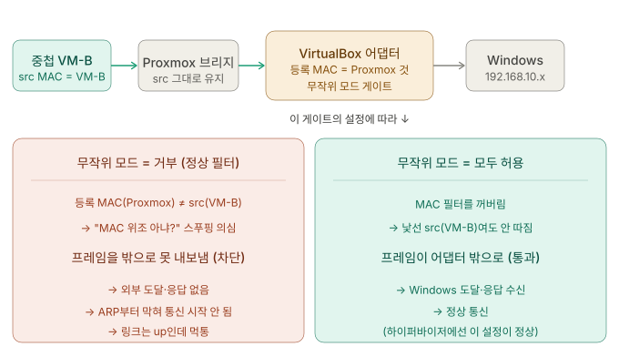
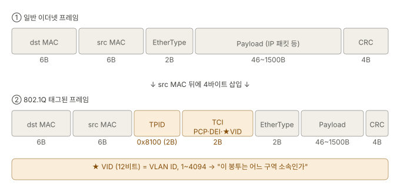

## 개요 ─ Stage 3 {#overview}

Stage 1에서 브리지를 *항상 스위칭하는 L2 장치*로 한 줄 요약했다. Stage 3은 **L2(Data Link Layer)의 밑바닥**으로 내려간다.

브리지는 *어떻게* 스위칭하는가? 프레임이 들어오면 *어느 포트로* 내보낼지 어떻게 아는가? 그리고 그 단순한 메커니즘이 가상 환경에서 *왜* 무작위 모드(promiscuous mode)·broadcast storm 같은 골치 아픈 문제를 낳는가?

Stage 0에서 "프레임에 dst MAC이 있다"고 했다면, 여기선 *그 MAC을 보고 스위치와 NIC가 실제로 무슨 판단을 내리는지*를 본다. 그리고 그 위에 **VLAN**이라는 *논리적 분리*가 어떻게 얹히는지, 마지막으로 *클러스터를 설계할 때 어느 포트를 Access로 두고 어느 포트를 Trunk로 둘지*까지 올라간다.

---

## 진단 질문 {#diagnostic-questions}

> **질문 1.**<br/>
> 시나리오 줄게. 추론해봐.
>
>> `vmbr2`(브리지)에 VM 네 대 **— A·B·C·D —** 가 각각 포트에 붙어 있어. **VM-A가 VM-B에게** 프레임을 보내. (Stage 0에서 배운 대로, ARP로 VM-B의 MAC은 이미 알아냈다고 치자. 그러니 프레임의 `dst MAC`엔 VM-B의 MAC이 정확히 적혀 있어.)
>> 이 프레임이 브리지에 도착했다.
>
> 브리지는 이 프레임을:
>
> - (a) VM-B가 붙은 포트로만 콕 집어 보낸다?
> - (b) A를 뺀 B·C·D 모든 포트로 뿌린다?

<none/>

> **질문 2.**<br/>
> 만약 정답이 (a)라면 — 브리지는 '**VM-B가 4번 포트에 있다**'는 걸 어떻게 알아낸 거야? 누가 등록해준 것도 아니고, 설정 파일에 적은 것도 아닌데. 브리지가 스스로 알아냈다면, 무엇을 보고 배웠을까?
>
> <br/>
>
> **힌트 하나 —** 모든 프레임엔 **dst MAC**만 있는 게 아니라 **src MAC** 도 적혀 있지. 그리고 브리지는 프레임이 어느 포트로 들어왔는지를 알아.

<none/>

> **질문 3.**<br/>
> **flooding**은 브리지가 같은 네트워크의 호스트 모두에게 Broadcast로 프레임을 뿌리는 것을 말한다. 같은 네트워크 안에서 MAC를 알기 위해 ARP 통신을 보내는 것과 비슷하면서 반대되는 개념.
>
> <br/>
>
> 질문이다. 브리지가 FDB로 학습 전에 Flooding을 하면, "VM-B를 향한 응답 프레임"이 다른 VM **─ A·C·D ─** 의 랜카드에도 도착한다. **VM-C의 NIC는 그 프레임(`dst MAC` = VM-B)을 어떻게 처리할까?**
>
> - (a) "내 MAC이 아니네" 하고 버린다?
> - (b) 일단 받아서 위로(OS로) 올린다?
>
> 만약 (a)라고 답한다면, **그 '버리는' 판단을 _누가, 어느 단계에서_ 한다고** 생각하는 거야?

<none/>

> **질문 4.**<br/>
> **무작위 모드 = VM-C의 NIC에게 "받는 사람이 내가 아니어도 _일단 전부 받아서_ OS로 올려라"라고 시키는 것.** <br/>
> 이제 추론해봐.
> <br/>
>
>> Proxmox 호스트의 물리 NIC 하나에, MAC이 제각각 다른 VM 여러 대가 (브리지를 통해) 매달려 있어. 외부에서 VM-B에게 가는 프레임이 그 물리 NIC에 도착했어. 그런데 물리 NIC 자신의 MAC은 VM-B의 MAC과 다르지.
>
> 이때 물리 NIC가 **정상 필터**(내 MAC 아니면 버림)로 동작하면 — 그 "VM-B께" 프레임은 어떻게 될까? 그리고 그게 **왜 가상화에서 문제**가 되겠어?

<none/>

> **질문 5.**
>
> - 만약 무작위 모드를 _켜지 않은_ 채로, 중첩 VM이 **외부로 나가는 트래픽(VM-B → Windows 방향)은 어떻게 될까?**
> - 중첩 VM-B가 외부로 보낸 프레임(src MAC = VM-B)이 VirtualBox NIC에서 **막히면, VM-B 입장에서 통신은 어떤 증상으로 나타날까?**

<none/>

> **질문 6.**<br/>
> 복습이다.
>
> 1. 스위치(브리지)가 **브로드캐스트 프레임(dst MAC = ff:ff:ff:ff:ff:ff)** 을 받으면 어느 포트로 보내지?
> 2. 이제 상상해봐. 스위치 A의 한 포트가 스위치 B로 연결되고, **스위치 B의 포트가 다시 스위치 A로 연결되는 — 고리(loop) 모양**의 배선이 있다고 치자. 이 고리 안에 브로드캐스트 프레임 한 장이 풀려나면 — 질문 1의 동작(브로드캐스트는 모든 포트로) 때문에 그 프레임은 어떻게 될까? **A는 B로, B는 A로, A는 다시 B로...** 이 프레임은 언제 멈출까?
> 3. 너 Stage 1에서 Proxmox 브리지 설정 보면서 bridge-stp off라는 줄을 봤지 — STP가 꺼져 있었어. 그리고 그 브리지가 물고 있는 VirtualBox 가상 스위치도 STP 같은 보호 장치가 제대로 동작하지 않아. **그렇다면 — 네 환경에서 어쩌다 L2 고리가 하나라도 생기면, 그걸 끊어줄 장치가 있을까, 없을까?** 그리고 한 발 더 — **무작위 모드를 "모두 허용"으로 켜는 게, 이 상황에서 왜 기름을 붓는 짓이 되는 걸까?** (힌트: 정상 NIC라면 storm 프레임을 그래도 일부는 "내 거 아니네" 하고 버리잖아. 무작위 모드는 그 프레임들을 어떻게 처리하지?)

<none/>

> **질문 7.**<br/>
> 보통 VM(우분투 데스크탑 같은 거)은 VLAN을 모르고 그냥 평범한 이더넷 프레임을 보내. 태그 안 붙인 맨몸 프레임이지. 그런데 한편 — 스위치끼리 연결되는 구간에서는, 받는 쪽 스위치도 이 프레임이 어느 VLAN 소속인지 알아야 같은 VLAN 포트로 보낼 거 아냐. **그러면 태그는 누가 붙이고 누가 떼느냐, 그리고 어느 구간에선 태그가 있고 어느 구간에선 없냐?**
>
> <br/>
> 힌트로 두 가지 상황을 그려봐.
>
>> - **VM이 브리지에 꽂힌 구간 —** VM은 맨몸 프레임을 내보내. 그런데 브리지는 그 VM이 "VLAN 10 소속"이라는 걸 설정으로 알고 있어. → 누가 태그를 붙여줘야 할까? 그리고 반대 방향(브리지가 VM에게 보낼 때) 태그는 떼야 할까 안 떼야 할까?
>> - **브리지 ↔ 외부 스위치 구간 (또는 노드 ↔ 노드 구간) —** 이 케이블 한 가닥에 VLAN 10, 20, 30이 모두 흘러야 해. 받는 쪽이 어느 VLAN인지 알아야 하니, 이 구간엔 태그가 있어야 할까 없어야 할까?
>

<none/>

> **질문 8.**<br/>
> 너가 클러스터를 구축한다고 가정해봐 — Proxmox 노드 A와 노드 B를 잇는 케이블 한 가닥에 MGMT·VMNET·Storage VLAN을 모두 통합해서 흘리고 싶다고 치자. **그 케이블의 양 끝(노드 A의 NIC, 노드 B의 NIC) 포트**는 — Access일까 Trunk일까? 그리고 **그 옆에서, 노드 안의 VM이 vmbr0에 꽂힌 포트**는 — Access일까 Trunk일까?

<none/>

> **질문 9.**<br/>
>
>> pfSense는 그동안 여러 망 사이를 라우팅하는 게이트웨이 역할을 해왔지(WAN ↔ LAN ↔ OPT1). 이제 multi-bridge 대신 vlan-aware bridge 단 하나(예: vmbr0)로 모든 망을 통합한다고 치자. pfSense는 그 vmbr0 위에서 MGMT·VMNET·Storage 등 여러 VLAN 사이를 라우팅해야 해.
>
> 1. pfSense의 net device를 단 하나로 모든 VLAN을 처리하려면 — 그 NIC를 **Access**로 만들 수 있을까, 아니면 **Trunk**로 만들어야 할까? (힌트: Access는 단 하나의 VLAN에만 속한다는 제약을 떠올려.)
> 2. 더 근본적인 거. 우리 비유에서 '**VM은 종단 장치 → Access 포트**'라고 말했지. 그런데 pfSense는 VM이긴 하지만 역할은 종단 장치가 아니라 스위치/라우터잖아. 그러면 **"VM이라고 무조건 Access여야 한다"는 법칙이 절대적일까, 아니면 역할에 따라 달라질까?**

---

## 01. Linux Bridge ─ 커널 속 L2 스위치 {#linux-bridge-l2-switch}

Proxmox의 `vmbr0`, `vmbr1`, `vmbr2`는 물리 장비가 아니라 **리눅스 커널 안에서 동작하는 소프트웨어 L2 스위치(software switch)** 다. 기능적으로는 물리 스위치와 동일하다. 브리지에 연결된 NIC·VM을 하나의 브로드캐스트 도메인(broadcast domain)으로 묶는다.

- **브리지는 언제나 스위칭(L2)만 한다.** 같은 브리지에 붙은 장치끼리는 MAC 기반으로 직접 전달하며, 커널이 라우팅(L3)에 개입하는 것은 *다른 서브넷으로 넘어갈 때뿐*이다.
- **브리지에 부여한 IP는 게이트웨이가 아니라 "관리용 발판(foothold)"** 이다. `vmbr0`의 IP는 호스트가 그 망에 한 발 걸치기 위한 것이지, 브리지가 라우터로 승격되는 것이 아니다.

<br/>

`vmbr2`에 VM-A·B·C·D가 각각 포트 1~4에 붙어 있다고 하자. VM-A가 VM-B에게 프레임을 보낼 때, 프레임의 `dst MAC`에는 VM-B의 MAC이 정확히 적혀 있다. 그런데도 브리지는 한 가지를 더 알아야 한다 — **그 MAC이 *물리적으로 어느 포트*에 연결되어 있는가.**

여기서 흔한 혼동이 생긴다. "같은 서브넷이면 MAC만 알면 직통 아닌가? 포트는 왜 필요한가?" 사실 **포트는 바로 그 "같은 단지 안에서" 가장 필요하다.** 게이트웨이나 NAT는 *다른 서브넷으로 나갈 때*(L3)의 문제이고, 같은 서브넷 안의 물리 배송(L2)은 전적으로 "어느 포트(케이블)로 내보내느냐"의 문제다.

> **두 층위(L2 / L3)를 구분한다:**
>
> - **포트 / MAC / 스위치 /FDB** → L2, 같은 단지 안에서 "어느 케이블로 물리 배송하나". 게이트웨이 없이 끝나는 일.
> - **게이트웨이 / IP / 라우팅 / NAT** → L3, 다른 단지로 나갈 때 "어느 단지로 넘기나, 주소를 어떻게 바꾸나". 포트랑 무관.

## 02. MAC 주소 학습(MAC Learning)과 FDB {#mac-learning-and-fdb}

### src MAC과 입력 포트 {#src-mac-ingress-port}

브리지는 **수신하는 모든 프레임의 `src MAC`(출발지)과 *그 프레임이 들어온 포트 번호*를 짝지어** 기록한다. VM-A가 포트 1로 프레임을 보내면, 브리지는 그 안의 `src MAC = VM-A`를 보고 추론한다 — *"출발지 MAC이 VM-A인 프레임이 포트 1로 들어왔다 → VM-A는 포트 1에 있다."*

이 짝지음을 저장하는 표가 **FDB(Forwarding Database)**, 즉 MAC 테이블이다.

- **MAC 주소:** '누구에게 보낼 것인가?' → VM-B라는 대상을 특정
- **Port:** '그 누구에게 닿으려면 어느 케이블로 내보내야 하나' → VM-B로 가는 물리적 통로

| 학습된 MAC | 포트 |
| ---------- | ---- |
| VM-A의 MAC | 1    |
| VM-B의 MAC | 2    |
| …          | …    |

이후 *목적지(dst)* 가 VM-B인 프레임이 오면, 브리지는 FDB를 조회해 **포트 2로만 콕 집어 전달**한다.

브리지는 "누가 어디 있는지 *말하는 것*을 엿듣고" 스스로 지도를 그려나간다. 이 FDB 엔트리는 영구적이지 않고, 일정 시간(보통 300초) 동안 그 MAC의 트래픽이 없으면 *만료(aging)* 되어 지워진다. 기기가 다른 포트로 옮겨가도 따라잡기 위해서다. ARP 캐시랑 비슷하게 작동하는 것 같다.

<br/>

### Unknown Unicast Flooding {#unknown-unicast-flooding}

스위치(브리지)는 *미리 채워진 설정 지도*를 들고 태어나지 않는다. 갓 부팅한 브리지의 **FDB(Forwarding Database, MAC 주소 테이블)** 는 **텅 비어 있다.** 어느 MAC이 어느 포트에 있는지 *전혀 모른다*.

브리지가 아직 목적지 MAC의 위치를 *모르면*(FDB에 없으면), 출발지 포트를 제외한 **모든 포트로 프레임을 뿌린다.** 이것이 **unknown unicast flooding**이다. "어디 있는지 모르니 일단 다 뿌려서, 본인이 응답하면 그때 위치를 학습하자"는 전략이다.

이는 L2에서의 ARP와 비슷해보이지만, **완전히 별개의 동작이다.**

- **VM-A가 VM-B의 MAC을 안다** → 이건 **ARP**(Stage 0). 송신자가 "VM-B의 MAC이 뭐지?"를 IP로 알아낸 것. (IP → MAC)
- **브리지가 VM-B가 어느 포트에 있는지 안다** → 이건 **MAC 학습**(지금 Stage 3). 스위치가 "그 MAC이 몇 번 포트지?"를 아는 것. (MAC → 포트)

|      | ARP                   | MAC 학습                 |
| ---- | --------------------- | ------------------------ |
| 주체 | *송신 호스트*         | *스위치/브리지*          |
| 매핑 | IP → MAC              | MAC → 포트               |
| 질문 | "이 IP의 MAC이 뭐지?" | "이 MAC은 몇 번 포트지?" |

_VM-A가 ARP로 VM-B의 MAC를 완벽히 알아도,_ 브리지가 VM-B의 위치(포트)를 모르면 VM-A와 VM-B가 직통으로 프레임을 송수신할 수 없다. Stage 0에서 비유한 **(L2)같은 단지는 직통**이라는 말은 정확히는 **브리지가 위치를 학습한 후**의 이야기다.

> "직통"이 되려면 **VM-A의 ARP 캐시(IP→MAC) *그리고* 브리지의 FDB(MAC→포트)** 가 둘 다 갖춰져야 한다.

<none/>

> 개인 노트: Unknown Unicast Flooding이라고 했는데, 사실상 ARP나 Flooding이나 Broadcast 요청을 보내는 거 아닌가?
>
>> - 둘 다 전달 행위는 같다: 모든 포트로 나간다.
>> - 그런데 프레임의 **dst MAC**이 다르다. Broadcast는 처음부터 dst MAC = ff:ff:ff:ff:ff:ff — 발신자가 "모두에게"라고 의도한 프레임이야. Unknown unicast flooding은 dst MAC = VM-B(특정 한 명)인데, **브리지가 VM-B 위치를 몰라서 어쩔 수 없이 전 포트로 뿌리는 거야.** 발신자 의도는 "VM-B 한 명에게"였지.
>> - 결정적 차이: **수신 NIC**의 반응. Broadcast(ff:ff...)는 모든 NIC의 하드웨어 필터가 "이건 받아야 할 것"으로 통과시켜 전원이 OS로 올린다. Unknown unicast flooding된 프레임(dst MAC=VM-B)은 VM-C·D의 NIC가 "내 MAC 아니네" 하고 조용히 버린다 — 오직 VM-B만 받아들여. 즉 "모두에게 도달"하지만 "모두가 처리"하진 않아.
>
> 그래서 flooding은 브리지의 어쩔 수 없는 임시 행동이고 Broadcast는 프레임의 본래 목적지 지정이야. 둘을 가르는 건 dst MAC 한 칸이다.

<br/>

### **모르면 뿌리고(flood), 알면 집어준다(forward)** {#flood-vs-forward}

- **첫 통신(FDB가 비었을 때)**: VM-A가 VM-B에게 보낸 프레임이 도착해도, 브리지는 *VM-B가 어느 포트인지 모른다*. 그래서 **(b) ─ "들어온 포트(A)"를 뺀 나머지 전 포트(B·C·D)로 뿌린다.** 이게 **flooding**이다.
- **학습 이후(FDB에 VM-B가 등록된 뒤)**: 브리지는 "VM-B는 4번 포트"임을 안다. 그러면 **(a) ─ VM-B 포트로만 콕 집어 보낸다.** 이게 **unicast forwarding**이다.

<br/>

### 시나리오 ─ 학습 안 된 브리지와 VM-A·B {#scenario-unlearned-bridge}

_질문 2의 답이 이 stage의 첫 핵심이다._ <br/> 브리지는 **프레임이 들어올 때마다 그 `src MAC`과 *들어온 포트*를 짝지어 FDB에 적는다.**

예를 들어, **VM-A가 VM-B에게 첫 프레임을 보내면:**

- 브리지는 `src MAC = VM-A`가 *1번 포트*로 들어온 걸 보고 **"VM-A는 1번 포트"를 학습**한다.
- 하지만 `dst MAC = VM-B`는 아직 FDB에 없으니 **flooding**한다. <br/> "어디 있는지 모르니 일단 다 뿌려서 본인이 응답하면 그때 위치를 학습하자"는 태도.
- 이후 VM-B가 *응답*을 보내면, 그때 `src MAC = VM-B`가 *2번 포트*로 들어온 걸 보고 **"VM-B는 2번 포트"를 학습**한다.
- 그다음부터 A↔B 통신은 *flooding 없이 콕 집어* 오간다.



> 프레임 하나가 들어오면 브리지는 두 가지를 동시에 한다.
>
> 1. **학습(learning)** — <br/>"이 프레임의 `src MAC`이 *이 포트*로 들어왔구나" → FDB에 `(src MAC → 입력 포트)` 등록.
> 2. **전달(forwarding)** — <br/>`dst MAC`을 FDB에서 찾아, 있으면 그 포트로, 없으면 flooding.

## 03. 무작위 모드 {#promiscuous-mode}

### 정상 NIC의 하드웨어 MAC 필터 {#nic-hardware-mac-filter}

학습 전 브리지는 flooding을 한다. Flooding이 일어나면, *VM-B에게 가는 프레임*이 VM-C / VM-D의 NIC에도 도착한다.

진단 질문 3에서 VM-C가 이 프레임을 어떻게 처리할지 물었고, 그 답은 **(a) "내 MAC이 아니네" 하고 버린다.** 그런데 *중요한 건 그 판단의 주체와 시점*이다.

> **그 판단은 *NIC 하드웨어*가, *OS로 올리기 전에* 한다.**

<br/>

정상적인 NIC(랜카드)는 프레임을 받자마자 `dst MAC`을 *하드웨어(NIC 칩) 차원에서* 검사한다.

- **내 MAC 주소**
- **_브로드캐스트 (ff:ff:ff:ff:ff:ff)_**
- **_내가 가입한 멀티캐스트 그룹_**

셋 중 하나면 위로(OS로) 올리고, **셋 다 아니면 그 자리에서 버린다.** 중요한 점은 *거르는 기준이 IP가 아니라 MAC*이라는 것이다. IP는 봉투(프레임) *안*에 들어 있어서, NIC 필터를 통과한 *후에야* OS가 봉투를 열어 확인한다. 버려진 프레임의 IP는 아무도 열어보지 않는다.

VM-C가 남의 프레임을 버리는 이유는 "IP가 달라서"가 아니라 — **MAC이 내 게 아니라서, 열어 볼 필요도 없다.**

> 진단 질문 3 ─ 오답과 해설
>
>> **Answer.** <br/>
>> VM-C는 이걸 버리겠지.. 패킷 안에는 목적지 IP가 적혀있을 테고, 내부망으로 연결된 VM이라면 자기만의 호스트 IP를 갖고 있을 테니까. 이걸 걸러내는 건.... 네트워크 디바이스로 사용 중인 그 브릿지인가?
>
>> **Review.** <br/>
>> **너 또 L3(IP)로 한 칸 올라갔어.** 우리 지금 L2(MAC) 무대에 있는데.<br/>
>> VM-C의 NIC가 프레임을 받자마자 거르는 기준은 — **봉투 겉면의 dst MAC**이야. IP가 아니라. NIC는 0.001초 만에 봉투 겉만 훑어: "받는 사람 MAC이 ① 내 MAC인가? ② 브로드캐스트인가? ③ 멀티캐스트인가? 셋 다 아니면 버린다." **목적지 IP는 봉투 안에 들어있어서, NIC 필터를 통과한 후에야 OS가 봉투를 열어 확인하는 거야.** 버려진 프레임의 IP는 아무도 안 열어봐. 그러니 "IP가 달라서 버린다"가 아니라 — '**MAC이 내 게 아니라서, 열어보기도 전에 버린다**'가 정확해.
>>
>> 그리고 브리지는 거르는 쪽이 아니라 뿌리는 쪽이야. 생각해봐, 브리지가 방금 뭘 했지? VM-B 위치를 몰라서 **모든 포트로 뿌렸어(flooding).** 거르긴커녕 VM-C한테 배달해버린 장본인이지.<br/>
>> 그 뿌려진 프레임이 VM-C의 NIC에 도착하고 **— 그걸 받아 든 VM-C의 NIC(랜카드) 자신이** "이 봉투 받는 사람이 VM-B네, 내 거 아냐" 하고 버리는 거야.
>>
>><br/>
>> 비유로 박자.
>>
>>>집배원(브리지)이 VM-B 주소를 몰라서, 단지 전체에 "VM-B께" 전단지를 죄다 꽂았어(flooding). VM-C 집 **우편함(NIC)**에도 그게 들어왔지. VM-C가 우편함을 보고 "받는 사람이 VM-B잖아, 내 거 아니네" 하고 버려. **— 거른 건 VM-C(NIC)지 집배원(브리지)이 아니고,** VM-C는 봉투 *겉면 이름(MAC)*만 보고 버렸지 *편지 내용(IP)*은 펼쳐보지도 않았어.
>>

<br/>

### 무작위 모드 ─ MAC 필터를 끄는 스위치 {#promiscuous-disables-filter}

**무작위 모드(Promiscuous mode)** 는 바로 이 NIC 하드웨어 MAC 필터를 *꺼버리는* 설정이다. NIC에게 '*`dst MAC`이 내 것이 아니어도, 도착한 건 전부 OS로 올려라*' 라고 지시하는 셈. (`tcpdump`·Wireshark로 남의 트래픽까지 들여다볼 때 켜는 게 바로 이 모드다.)

|                        | 정상 NIC                                     | 무작위 모드 NIC        |
| ---------------------- | -------------------------------------------- | ---------------------- |
| 받는 프레임            | dst MAC = 내 MAC / 브로드캐스트 / 멀티캐스트 | dst MAC 안 따짐 — 전부 |
| 내 MAC 아닌 유니캐스트 | 버림                                         | 받음                   |

거르는 *주체*가 브리지가 아니라 **받는 쪽 NIC 자신**이라는 점도 기억해야 한다. 브리지는 위치를 모를 때 flooding으로 *뿌리는* 쪽이고, 받은 프레임을 자기 것이 아니라며 거르는 것은 수신 NIC의 몫이다. 무작위 모드는 그 수신 NIC의 거름망을 여는 것이다.

> 평소엔 **비효율**이고 보안상 위험하지만 — **가상화에선 *필수*가 되는 역설**

<br/>

### 가상화의 딜레마 ─ 중첩 가상화 환경 {#nested-virtualization-dilemma}

무작위 모드가 *필요해지는* 유일한 이유는 가상화의 구조적 특성에 있다.

> **NIC를 *통과하는* 프레임의 MAC이, 그 NIC 자신의 MAC과 다를 때.**<br/>
> **무작위 모드를 켠다 = "이 NIC 뒤에 숨은 여러 MAC을 위해, 내 것이 아닌 프레임도 다 받아 넘겨라"**

하이퍼바이저(또는 그 위 계층)의 입장에서, **하나의 (가상) NIC 뒤에 서로 다른 MAC을 가진 VM이 여러 대 매달린다.** 예를 들어 중첩 구조에서 상위 가상화 계층은 그 아래 하이퍼바이저를 "VM 한 대"로 보고 가상 NIC를 *하나* 할당하지만, 실제로는 그 안의 브리지 뒤에 각자 다른 MAC을 가진 중첩 VM들이 숨어 있다.

무작위 모드가 필요한 것은 *하이퍼바이저 자신*의 통신 때문이 아니다. 하이퍼바이저 자신은 자기 NIC의 MAC을 쓰므로 필터에 걸리지 않는다. 무작위 모드가 구해주는 것은 *그 NIC 뒤에 숨은 VM들*의 트래픽이다. 정상 필터(내 MAC 아니면 버림)로 동작하면 그 NIC은 "이건 내 것이 아니다" 하고 **열어보기도 전에 버린다.** 결과는 조용한 통신 실패다.

<br/>

### 조용한 실패 ─ MAC 필터 차단은 Drop이다 {#silent-drop-failure}

MAC 필터 차단은 **거의 항상 조용한 Drop**이다. Reject를 *만들려면* 장비가 프레임을 *열어서* L3/L4 정보(IP·포트)를 읽고 거부 응답을 *작성*해야 하는데, MAC 필터는 L2 차원에서 동작하므로 그 정보를 읽을 권한도, 거부 응답을 만들 주체도 없다. 그래서 프레임은 그냥 증발한다.

그 결과 증상은 다음과 같이 나타난다.

> ping이나 ARP(브로드캐스트라 필터를 통과)는 나가는 것처럼 보이고, 설정도 다 맞아 보이는데, 정작 통신은 안 된다. 송신 측은 영문도 모른 채 응답을 기다리며 timeout 된다.

**"분명 다 맞는데 왜 안 되지"** — 이 silent failure가 가상 네트워킹 트러블슈팅을 가장 어렵게 만드는 함정이다. *에러가 안 나는 것이 가장 무서운 에러*라는 격언이 정확히 이 상황을 가리킨다.

## 04. **시나리오 ─** 중첩 가상화 환경 {#scenario-nested-virtualization}

왜 가상화에서, 특히 *중첩 가상화* 환경에서 이게 문제가 되는지를 *나가는 방향*으로 따라가 보자. (들어오는 방향이 아니다 — 그 이유는 바로 아래에서 짚는다.)

실습한 예시 환경은 `Windows → VirtualBox → Proxmox → 중첩 VM`의 4중 구조다. 여기서 **중첩 VM-B가 외부로 프레임을 내보내면, 그 프레임의 `src MAC`은 _VM-B의 MAC_ 이다** — Proxmox NIC의 MAC도, VirtualBox 어댑터의 MAC도 아니다. Stage 0에서 잡았듯 `src MAC`은 *그 프레임을 최초로 띄운 장치*의 것이기 때문이다.

이 프레임이 Proxmox 브리지를 거쳐 **VirtualBox 가상 어댑터**로 빠져나갈 때 문제가 생긴다. VirtualBox는 그 어댑터에 *자기가 Proxmox에게 부여한 MAC* 하나만 등록해 두고 있다. 그런데 정작 통과하려는 프레임의 `src MAC`은 *낯선 VM-B의 MAC*이다. VirtualBox 입장에선 이렇게 의심한다.

> "이 어댑터에 등록된 MAC은 Proxmox 건데, 웬 낯선 VM-B MAC이 출발지로 찍혀 나가지? MAC 위조(spoofing) 아냐?"

그래서 무작위 모드(MAC 필터)가 *꺼져 있으면* VirtualBox는 **이 프레임을 막아버린다.** VM-B가 바깥으로 보낸 트래픽이 어댑터 관문을 넘지 못하는 것이다.



<br/>

### 왜 "들어오는 dst MAC" 예시는 내 환경에 안 맞나 {#inbound-dst-mac-mismatch}

흔히 무작위 모드를 *"외부에서 VM-B로 오는 프레임의 `dst MAC`이 VM-B라, 물리 NIC가 자기 것 아니라며 버린다"*로 설명한다. 그런데 그 그림은 **송신자와 VM-B가 *같은 L2 단지*에 있을 때만 성립한다.** 내 환경은 그렇지 않다.

- **Windows(192.168.10.x)와 중첩 VM(10.10.3.x)은 *다른 단지*다.** (중첩 VM은 pfSense 뒤의 별도 망에 있다.)
- Stage 0의 규칙대로, Windows는 '*10.10.3.x는 내 단지가 아니네 → 게이트웨이로 넘긴다*'가 된다. 그래서 Windows가 띄우는 프레임의 `dst MAC`은 **VM-B의 MAC이 아니라 *게이트웨이의 MAC*이다.**
- **Windows는 VM-B의 MAC을 알지도 못하고, 알 필요도 없다.** ARP 브로드캐스트는 단지 경계(게이트웨이)를 못 넘으니 *알아낼 방법조차 없다*. Windows가 아는 건 오직 *자기 게이트웨이의 MAC* 하나뿐이다.

그러니 "`dst MAC` = VM-B"라는 그림은 내 중첩 환경엔 들어맞지 않는다. 대신 *나가는 방향의 `src MAC`* 이 무작위 모드의 가장 깔끔하고 정확한 예시다.

> **무작위 모드 "모두 허용"의 정확한 의미** — **"이 NIC를 지나는 src / dst MAC이 내 것과 달라도, 따지지 말고 통과시켜라."** 그래서 **나가든 들어오든**, NIC 뒤에 숨은 VM들의 **낯선 MAC** 프레임이 그 관문을 넘을 수 있게 된다.

<none/>

> **핵심** — 무작위 모드는 **일반 호스트에선 위험 신호**(남의 트래픽까지 엿보겠다는 뜻)지만, **하이퍼바이저에선 정상 동작**이다. NIC 뒤에 **자기 것이 아닌 MAC을 가진 VM들**을 매달고 있는 한, 그 낯선 MAC을 통과시켜 줄 길이 반드시 필요하기 때문이다. 같은 기능도 **맥락(누가, 왜 켜는가)**에 따라 의미가 정반대가 된다.

<br/>

### 나가는 트래픽이 막히면 ─ 그 증상 {#outbound-block-symptoms}

진단 질문 5의 답이 여기서 나온다. 무작위 모드를 *안 켠* 채 중첩 VM-B가 외부로 트래픽을 보내면, 위에서 봤듯 그 프레임은 VirtualBox 어댑터에서 *스푸핑 의심*으로 막힌다. VM-B 입장에서 **증상**은 이렇게 나타난다.

- VM-B는 패킷을 ***보냈다고 생각***한다. 자기 OS의 송신 큐에선 정상적으로 나갔으니까.
- 하지만 그 프레임은 ***VirtualBox 어댑터 밖으로 나가지 못했다.*** 외부엔 도달조차 안 했다.
- 당연히 *응답도 오지 않는다*.
- 심지어 **ARP 요청부터 막힌다.** VM-B가 게이트웨이의 MAC을 알아내려 ARP를 띄워도 그게 못 나가니, *상대의 MAC을 못 알아내* 통신 자체가 *시작도 안 된다*.
- 겉으로는 **"링크는 분명 up인데 아무것도 안 되는"** 먹통 — ping도 안 나가고, 타임아웃만 반복되는 증상이다.

> 이 **"요청은 (보낸 줄 알고) 나갔는데 아무 반응이 없는"** 패턴이, 가상 네트워크에서 무작위 모드/MAC 필터를 가장 먼저 의심해야 하는 신호다. **링크는 살아 있는데 통신이 안 될 때** — 특히 중첩 VM에서 — 어댑터의 Promiscuous Mode 설정(`Deny` / `Allow VMs` / `Allow All`)부터 확인하는 게 정석이다.

## 05. Broadcast Storm - L2의 재앙 {#broadcast-storm}

무작위 모드의 *그림자*는 broadcast storm이다.

브로드캐스트 프레임(`dst MAC = ff:ff:ff:ff:ff:ff`)은 학습된 유니캐스트와 달리 **언제나 모든 포트로** 전달된다. FDB 조회를 선행하는 프레임 전달이 아니다. ARP 요청이 대표적인 브로드캐스트다.

### Broadcast 메커니즘 ─ 순환 + 증식 {#storm-loop-amplification}

*물리적·논리적으로 **고리(loop)** 가 있는 토폴로지를 상상하자.*<br/>스위치 A의 포트가 스위치 B로, B의 다른 포트가 다시 A로 연결된 형태다. 이 고리에 브로드캐스트 프레임 *한 장*이 풀려나면:

1. A는 브로드캐스트를 모든 포트로 뿌린다 → B로 간다.
2. B도 브로드캐스트를 모든 포트로 뿌린다 → A로 돌아온다.
3. A가 또 모든 포트로... → 다시 B로… **A→B→A→B…**

여기에 *새로운* 브로드캐스트(ARP 등)가 계속 합류하고, 스위치가 매번 여러 포트로 복제하면서 **기하급수적으로 증식**한다.



<br/>

언제 멈추나? — **멈추지 않는다.**<br/>**이더넷 프레임에는 TTL(Time To Live)이 없다.**

**L3 IP 패킷에는 TTL(Time To Live) 필드가 있다.** 패킷이 라우터를 거칠 때마다 1씩 줄고, 0이 되면 패킷은 폐기된다. 라우팅 루프가 생겨도 패킷은 *결국 죽는다.*<br/>
그런데 **이더넷 프레임(L2)에는 그런 필드가 아예 없다.** 프레임은 자기가 몇 번 돌았는지 셀 방법이 없으니 **한 번 루프에 갇히면 스스로 멈추지 못하고 영원히 순환한다.** 게다가 고리를 도는 동안 *각 스위치에서 또 다른 포트로 복제*되면서 프레임 수가 **기하급수적으로 폭증**한다.

이것이 **Broadcast Storm**이다. 순식간에 대역폭과 CPU를 모두 잡아먹어 정상 트래픽이 끼어들 틈이 사라진다..

> **L3엔 TTL이 있어 루프가 스스로 죽지만, L2엔 TTL이 없어 루프가 스스로 죽지 못한다.**

<br/>

### STP ─ 고리를 끊는 장치 {#stp-breaks-loops}

L2에는 자체 폐기 메커니즘(TTL)이 없으므로, 루프를 *예방*할 별도 장치가 필요하다. 그 표준 장치가 **STP (Spanning Tree Protocol)** 이다.

STP는 스위치들이 서로 정보를 교환해 *물리적 고리를 탐지*하고, 고리를 만드는 포트를 *논리적으로 차단(blocking)* 해서 고리를 끊는다. 물리 배선은 고리 구조여도 *논리적으로는 트리(loop-free) 구조*가 되도록 만드는 것이다.

문제는 **가상 환경**이다.

- 데스크탑 가상화의 가상 스위치는 STP가 *없거나 약한* 경우가 많다.
- Linux 브리지에서 `bridge-stp off`로 STP를 꺼두면 보호가 사라진다.

이 둘이 겹치면 **루프가 생겨도 끊어줄 장치가 전혀 없는** 무방비 상태가 된다. 물리 스위치는 보통 STP가 켜져 있어 L2 루프 자체가 잘 생기지 않지만, STP 없는 가상 스위치 + 다중 인터페이스 VM 조합에서는 고리가 만들어지기 쉽고, 그 위에 무작위 모드까지 켜지면 storm을 막을 모든 방어선이 무너진다.

진단 질문 6-3의 답: Stage 1에서 봤듯 Proxmox 브리지는 `bridge-stp off`였고, 그 위의 VirtualBox 가상 스위치도 STP가 제대로 돌지 않는다. **즉, L2 고리가 하나라도 생기면 그걸 끊어줄 장치가 없다.** 실수로 브리지를 잘못 엮거나 케이블을 잘못 연결해 고리가 생기면 — *storm을 막을 안전장치가 없는* 상태다.

<br/>

### 무작위 모드가 *기름을 붓는* 이유 {#promiscuous-fuels-storm}

진단 질문 6-3의 마지막 — 왜 무작위 모드가 storm을 악화시키나?

**무작위 모드는 루프를 *생성*하지 않는다.** 단방향 통신(VM이 호스트로 프레임을 보내는 것)만으로는 루프가 생기지 않는다. 루프는 **토폴로지에 실제 고리가 있어야** 생긴다.

가상 환경에서 고리가 만들어지는 대표적 경로는 두 가지다.

- **Echo-back** — 가상 스위치(예: 호스트 전용 어댑터)의 무작위 모드를 "모두 허용(Allow All)"으로 두면, 가상 스위치가 *받은 프레임을 송신했던 NIC로 되돌려 보내는* 동작이 생길 수 있다. VM이 보낸 프레임이 같은 가상 스위치를 통해 자신에게 되돌아오는 미니 루프가 형성된다.
- **다중 인터페이스 경유** — 한 인터페이스로 들어온 프레임이 다른 인터페이스로 나갔다가, 외부 경로를 거쳐 다시 돌아오는 고리. 라우터/방화벽 역할로 여러 인터페이스를 가진 VM이 잘못 설정되면 이런 경로가 만들어질 수 있다.

<br/>

 무작위 모드는 *이미 형성된* 루프와 storm을 *증폭*시켜서, NDIS 드라이버를 과부화시킨다.

- **정상 NIC**라면, storm으로 쏟아지는 프레임 중 *`dst MAC`이 내 것이 아닌 것*은 하드웨어 필터가 버린다. OS(CPU)는 *자기 것만* 처리하면 되니, storm 중에도 *일부* 부담만 진다.
- **무작위 모드 NIC**는 *그 필터를 꺼버렸다*. storm의 *모든 프레임*을 OS로 올린다. CPU가 폭증하는 프레임을 전부 처리하려다 *완전히 마비*된다.

> **우편함 비유**
>
> 정상 NIC는 **자동 분류기가 켜진** 우편함이다. 내 이름 아닌 편지는 입구에서 즉시 폐기되므로, 폭우처럼 편지가 쏟아져도 집주인(OS/CPU)은 무사하다.
>
> 무작위 모드 NIC는 **자동 분류기를 끈** 우편함이다. 단지에 돌아다니는 **모든** 편지가 내 책상으로 쏟아진다. 평소엔 양이 적어 괜찮지만, storm이 터지면 집주인이 손수 분류하다 쓰러진다.

Windows 호스트에서 가상 NIC은 **NDIS(Network Driver Interface Specification)** — 네트워크 어댑터를 다루는 드라이버 계층 — 위에서 동작한다. 무작위 모드 NIC가 storm 프레임을 전부 OS로 올리면, NDIS가 초당 수만 프레임을 처리하려다 **과부하로 뻗고**, 이는 호스트 전체의 네트워크 처리 장애로 번진다.

## 06. VLAN 802.1Q {#vlan-802-1q}

### VLAN이란 ─ 물리 하나를 논리로 쪼개기 {#vlan-logical-segmentation}

> 하나의 물리 인프라 위에 *논리적으로 분리된 여러 브로드캐스트 도메인*을 만드는 기술.

**VLAN(Virtual LAN)** 은 *하나의 물리 스위치/케이블을 여러 개의 논리적 L2 네트워크로 분할*한다. 물리적으로는 같은 스위치에 꽂혀 있어도, VLAN 10과 VLAN 20에 속한 포트는 *서로 다른 브로드캐스트 도메인*이 되어 — 마치 *물리적으로 분리된 별개의 스위치*처럼 동작한다.

이를 위해 이더넷 프레임에 **4바이트짜리 VLAN 태그(802.1Q tag)** 를 삽입한다.



태그는 src MAC 다음 자리에 4바이트(TPID 2바이트 + TCI 2바이트)가 끼어 들어간다. 진짜 알맹이는 TCI 안의 **VID**(**VLAN ID**, 12비트) ─ 이 프레임이 어느 구역 소속인지 말하는 라벨로, 같은 케이블을 흐르는 프레임이라도 서로 다른 논리 망으로 격리한다.
<br/>VLAN ID는 1~4094 사이 값을 갖는다.(0과 4095는 예약.)
<br/>PCP=우선순위, DEI=폐기 가능 표시, TPID=이 프레임이 VLAN 태그를 가졌음을 알리는 고정값 0x8100

스위치/브리지는 프레임을 받으면 제일 먼저 VID를 확인하고, 같은 VID의 포트로만 전달한다. 이게 VLAN 격리의 전부.

<br/>

### Access와 Trunk {#access-and-trunk-ports}

대충 설명하면, 브리지에 VM을 연결하는 포트를 Access/Trunk 둘 중 하나로 구분할 수 있다.

|                        | Access 포트         | Trunk 포트                        |
| ---------------------- | ------------------- | --------------------------------- |
| 다루는 VLAN            | 하나(PVID)          | 여러 개                           |
| 무엇이 붙나            | VM·PC같은 종단 장치 | 스위치↔스위치, 호스트↔스위치 간선 |
| 포트로 들어오는 프레임 | 태그 없음           | 태그된 채 도착                    |
| 포트로 나가는 프레임   | 태그 없음           | 태그된 채 출발                    |

<br/>

**Access 포트 ─ 맨몸 프레임, 단일 VLAN:**

- 종단 장치(일반 VM, PC)가 꽂히는 포트.
- 종단 장치는 *VLAN을 모른다*. 그냥 *태그 없는 맨몸 프레임*을 보낸다.
- 대신 **스위치가 그 포트에 "VLAN 10"이라는 딱지를 설정**해둔다.
- **VM → 브리지 방향**: 맨몸 프레임이 들어오면 *스위치가 VLAN 10 태그를 붙인다*.
- **브리지 → VM 방향**: 나가기 직전 *스위치가 태그를 떼고* 맨몸으로 전달한다. (VM은 태그를 모르니까.)
- 즉 *VM은 평생 태그를 본 적이 없다*. 태그 작업은 전부 스위치가 *조용히* 해준다.

**Trunk 포트 ─ 태그 달린 프레임, 여러 VLAN:**

- 스위치끼리, 또는 스위치와 라우터를 잇는 포트.
- 이 한 가닥에 *여러 VLAN(10·20·30…)이 섞여* 흐른다.
- 받는 쪽이 *어느 VLAN인지 알아야* 하므로, **모든 프레임에 VLAN 태그가 붙어 있다.** (태그를 떼지 않는다.)
- 태그가 곧 '*이 프레임은 VLAN 몇 행*'이라는 행선지 표다.

비유하자면 — **Access는 단일 노선만 서는 정류장**이다. 노선이 하나뿐이니 버스에 노선 번호를 안 붙여도 된다. **Trunk는 여러 노선이 지나는 환승 통로**다. 어느 노선 버스인지 *번호(태그)를 반드시 표시*해야 승객이 갈아탈 수 있다.

> - **Access 포트** — 특정 VLAN 하나에 소속. 단말이 보낸 태그 없는 프레임에 들어올 때 태그를 붙이고, 나갈 때 떼어낸다. 단말은 자기가 VLAN에 속한 줄 모른다.
> - **Trunk 포트** — 여러 VLAN의 태그된 프레임을 그대로 운반하는 간선. 허용할 VLAN 목록을 지정한다.

<br/>

**Access와 Trunk**는 **브리지가 그 가상 포트를 어떻게 다루는지를 분류한 것이지, *내부에서 어떻게 다루는지가 아니다.***

- **Access(`tag=10`):** 브리지가 PVID로 태그를 알아서 부착·제거 → VM은 맨몸 프레임만 봄 → VM 내부엔 **VLAN 설정이 일절 필요 없음.** NIC 그대로 평범하게 사용.
- **Trunk(`trunks=10;20;30`):** 브리지가 *대그된 프레임을 그대로* VM에 전달 → VM 내부에서 **VLAN 서브인터페이스를 만들어야** 각 VLAN을 별개 인터페이스로 다룰 수 있다.

**VLAN 서브인터페이스는 같은 (가상) 물리 NIC를 논리적으로 여러 개로 쪼개는 것**이다. `vtnet0` 하나로 시작해서 `vtnet0.10`, `vtnet0.20`, `vtnet0.30` 세 개의 독립된 인터페이스가 파생되고, 각자 별도의 IP·라우팅·별도 방화벽 규칙을 가질 수 있다. pfSense가 한 NIC로 여러 망의 게이트웨이 노릇을 하는 게 이래서 가능하다. OS 입장에서는 세 개의 별개 NIC나 다름 없음.

<br/>

그러니 이건 두 층위(하이퍼바이저·VM)가 짝을 이루어야 한다:

```bash
하이퍼바이저: trunks=10;20;30  ⇄  VM 내부: vtnet0.10, vtnet0.20, vtnet0.30
하이퍼바이저: tag=10            ⇄  VM 내부: (아무것도 안 함, vtnet0 그대로)
```

Proxmox에서 **네트워크 디바이스**를 Trunk로 줘놓고 VM에서 서브인터페이스를 안 만들면 ─ VM이 태그된 프레임을 받지만 _해석을 할 줄 모르니 몽땅 버린다._ Access로 줘놓고 VM에서 굳이 `vtnet0.10`를 만들면 ─ 들어오는 프레임에는 VLAN 태그가 없으니 _만들어놓고 일을 안 시키는 서브인터페이스가 됨._<br/>두 층위는 항상 **같은 그림을 보고 있어야 한다.**

### vlan-aware bridge와 multi-bridge {#vlan-aware-vs-multi-bridge}

Proxmox에서 VLAN을 구현하는 두 방식이 있다.

- **multi-bridge** — VLAN/망마다 별도 브리지(`vmbr0`/`vmbr1`/`vmbr2`)를 둔다. 구조가 직관적이고 망 사이가 물리적으로 분리된다.
- **vlan-aware bridge** — 하나의 브리지가 802.1Q 태그를 인식해 여러 VLAN을 처리한다. VM마다 VLAN ID를 지정하는 방식으로, 망이 많아질수록 관리가 간결해진다.

> 두 방식의 우열은 규모에 따라 갈린다. 망 수가 적으면 multi-bridge가 명확하고, 많아지면 vlan-aware bridge 한 개로 모으는 편이 운영상 유리할 수 있다. 어느 쪽이든 "하나의 브로드캐스트 도메인 = 하나의 VLAN"이라는 원칙은 동일하다.

## 07. 방화벽(Firewall) ─ pfSense의 역할이 포트를 결정 {#firewall-defines-port-role}

가상 네트워킹 설계에서는 책임 분리 원칙이 어긋나기 십상이다. vlan-aware bridge 하나로 모든 망을 통합하고 pfSense가 그 위에서 VLAN 간 라우팅을 전담하는 구조에서 — *방화벽을 어디에 둘 것인가*라는 설계 질문을 해볼 수 있다.

답은 **방화벽(필터·라우팅)은 pfSense에 집중하고, 하이퍼바이저(Proxmox)는 순수한 L2 운반자로 남겨야 한다**는 것이다. 만약 Proxmox(하이퍼바이저)에 방화벽을 끼워 *라우터 어플라이언스(pfSense)보다 앞단(상류)*에 두면:

- 트래픽이 *pfSense의 룰을 거치기 전에* Proxmox에서 먼저 필터링·변형된다.
- pfSense는 *불완전하거나 이미 손질된 입력*을 받게 되어, 자신의 라우팅·방화벽 로직이 *설계 의도대로 동작하지 못한다*.
- "누가 방화벽인가"의 **책임 경계가 흐려진다.** 문제가 생겼을 때 *Proxmox 필터인지 pfSense 룰인지* 추적하기 어려워진다.
- VLAN 통합 구조에선 *모든 망의 트래픽이 한 브리지를 지나므로*, 하이퍼바이저가 잘못 끼어들면 *전 VLAN에 동시에* 영향을 준다.

이 문제를 아래와 같이 정리할 수 있다:

1. **계층 위반** — L2 장치에 L3/L4 정책 판단을 떠넘기는 셈이 되어, 트래픽이 라우팅·NAT를 거치기 *전에* 필터링되는 모순이 생긴다.
2. **단일 책임 붕괴** — 스위칭과 보안 정책이 한 지점에 섞여, 어느 계층에서 막혔는지 진단이 어려워진다. 앞서 본 *조용한 Drop*과 결합하면 트러블슈팅이 악몽이 된다.
3. **트러스트 경계 모호** — 망 분리의 마지막 방어선이어야 할 정책 지점이 분산되어, "어디가 신뢰 경계인가"가 흐려진다.

> **필터링(방화벽)을 하이퍼바이저 브리지 레벨에 두면 안 되고, 라우터 어플라이언스에 둬야 한다.** *L2 운반(하이퍼바이저)*과 *L3 라우팅·필터(라우터 어플라이언스)*의 책임을 분리하고, 방화벽은 *트래픽이 모이는 단일 지점(pfSense)*에 집중하는 것.

근거는 지금까지 정리한 계층 분리에 있다.

- **하이퍼바이저 브리지 = 순수 L2 스위치.** 그 역할은 프레임을 *어느 포트로 물리 배송하느냐*다. 라우팅·NAT·필터링은 브리지의 책임이 아니다. (실제로 Proxmox 노드의 `nat`·`filter` 테이블은 비어 있고 `FORWARD` 정책도 트래픽을 통과시키도록 두는 것이 정상 구성이다.)
- **라우터 어플라이언스(예: pfSense) = L3 라우터 + NAT + 방화벽.** 망 경계에서 라우팅하고, 주소를 변환하고, 정책에 따라 통과를 허용/차단하는 *문지기*다.

이는 Defense in Depth와 책임 분리의 기본형이며, 다음 [Stage 4: 망 분리 설계](./05-stage-4)에서 *zone(신뢰 구역) 설계*로 본격 확장된다.

---

## 부록 A. 핵심 어휘 빠른 참조 {#appendix-glossary}

| 용어                               | 한 줄 정의                                                |
| ---------------------------------- | --------------------------------------------------------- |
| **FDB** (Forwarding Database)      | 브리지의 MAC 주소 테이블 (`MAC → 포트`)                   |
| **MAC learning**                   | `src MAC`+입력 포트로 FDB를 채우는 자동 학습              |
| **flooding**                       | FDB에 없는 목적지를 위해 전 포트로 뿌리는 동작            |
| **unicast forwarding**             | FDB에 있는 목적지를 콕 집어 보내는 동작                   |
| **aging**                          | 일정 시간 트래픽 없는 FDB 엔트리를 만료시키는 것          |
| **하드웨어 MAC 필터**              | NIC가 `dst MAC`을 보고 OS 이전에 거르는 칩 레벨 동작      |
| **promiscuous mode** (무작위 모드) | NIC가 `dst MAC` 무관하게 전부 OS로 올리는 모드            |
| **broadcast storm**                | L2 loop에서 브로드캐스트가 무한 증폭하는 재앙             |
| **STP** (Spanning Tree Protocol)   | 물리 loop를 탐지해 논리적으로 차단하는 프로토콜           |
| **VLAN**                           | 물리 하나를 여러 논리 L2망으로 나누는 기법                |
| **802.1Q**                         | 이더넷 프레임에 VLAN 태그를 넣는 표준                     |
| **VID** (VLAN ID)                  | 태그 안의 VLAN 식별 번호 (1~4094)                         |
| **Access 포트**                    | 맨몸 프레임 + 단일 VLAN (종단 장치용)                     |
| **Trunk 포트**                     | 태그 프레임 + 다중 VLAN (스위치/라우터 간)                |
| **VLAN 서브인터페이스**            | Trunk 위에서 VLAN별로 만드는 가상 인터페이스 (`vmbr0.10`) |

---

## 부록 B. 명령어 빠른 참조 {#appendix-commands}

```bash
# === 브리지 / FDB ===
bridge fdb show                          # FDB(MAC 학습 테이블) 보기
bridge fdb show br vmbr0                  # 특정 브리지의 FDB
ip -d link show vmbr0                     # 브리지 상세 (STP 상태 등)

# === 무작위 모드 ===
ip link show ens18 | grep -i promisc      # 무작위 모드 여부 확인
ip link set ens18 promisc on              # 무작위 모드 켜기 (임시)

# === VLAN ===
ip link add link ens18 name ens18.10 type vlan id 10   # VLAN 10 서브인터페이스
bridge vlan show                          # vlan-aware bridge의 VLAN 매핑

# === STP ===
ip -d link show vmbr0 | grep -i stp       # STP 활성 여부
# /etc/network/interfaces 에서: bridge-stp on  (켜기)
```

---

## 개인 노트 {#personal-notes}

### 미완·심화로 가는 길 {#further-study}

- **RSTP / MSTP** — STP의 현대적 개선판(빠른 수렴, VLAN별 트리)
- **vlan-aware bridge** — Proxmox의 단일 브리지 다중 VLAN 방식 (multi-bridge 대안)
- **MAC spoofing 방지** — VirtualBox/Proxmox의 nic 보안 옵션
- **zone 기반 망 분리** — Trunk·VLAN 위에 *신뢰 구역*을 설계하는 것 (Stage 4)
- **PVID / native VLAN** — Trunk에서 태그 없는 프레임을 처리하는 규칙
- **IGMP snooping** — 멀티캐스트를 flooding 없이 효율 전달

다음 [Stage 4: 망 분리 설계](./05-stage-4)에서, 여기서 익힌 VLAN·Trunk·Access를 *신뢰 구역(zone)*과 *defense-in-depth*로 끌어올린다.

### 자기 점검 ─ 진단 질문 재방문 {#self-check-revisit}

1. **브리지의 flooding vs unicast 전달** → [Unknown Unicast Flooding](#unknown-unicast-flooding)
2. **`src MAC`+입력 포트로 학습하는 원리** → [02. MAC 주소 학습(MAC Learning)과 FDB](#mac-learning-and-fdb)
3. **flooding된 프레임을 남의 NIC가 버리는 판단의 주체·시점** → [모르면 뿌리고(flood), 알면 집어준다(forward)](#flood-vs-forward)
4. **가상화에서 무작위 모드가 필요한 이유** → [가상화의 딜레마 ─ 중첩 가상화 환경](#nested-virtualization-dilemma)
5. **무작위 모드 미설정 시 나가는/들어오는 비대칭과 증상** → [무작위 모드 ─ MAC 필터를 끄는 스위치](#promiscuous-disables-filter)
6. **L2 loop가 멈추지 않는 이유(TTL 부재)와 무작위 모드가 storm을 키우는 이유** → [05. Broadcast Storm - L2의 재앙](#broadcast-storm)
7. **VLAN 태그를 누가 붙이고 떼나, Access vs Trunk** → [06. VLAN 802.1Q](#vlan-802-1q)
8. **클러스터 노드 간 Trunk / 종단 VM Access** → [06. VLAN 802.1Q](#vlan-802-1q)
9. **pfSense가 Trunk여야 하는 이유, "VM=Access" 법칙의 상대성** → [07. 방화벽(Firewall) ─ pfSense의 역할이 포트를 결정](#firewall-defines-port-role)

<span style="display: none;">
각 질문에 *네 환경(Proxmox 브리지·VirtualBox·pfSense·클러스터 설계)의 맥락*으로 답할 수 있다면 Stage 3은 졸업이다. 그리고 여기서 익힌 *Access/Trunk·역할 기반 판단*이 — 곧 네가 직접 할 **클러스터 네트워크 재설계**의 핵심 도구가 된다.
</span>
