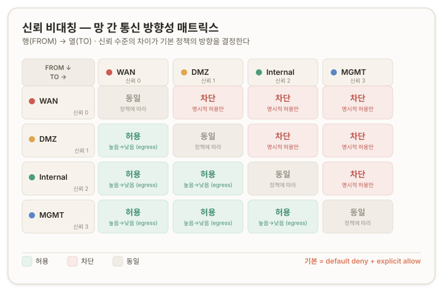
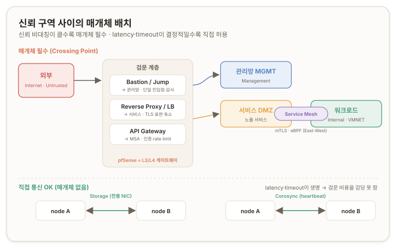
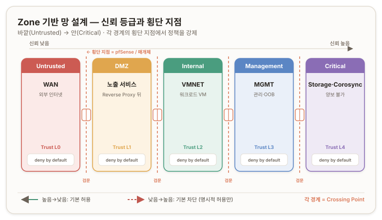

## 개요 ─ Stage 4 {#overview}

Stage 3 마지막에서 *"필터링은 라우터 어플라이언스(pfSense)에, L2 운반은 하이퍼바이저(Proxmox)에"* 라는 **책임 분리(separation of responsibility)** 의 기본형을 잡았다. Stage 4는 그 위에 올라선다 — '*어디에* 경계를 긋고, *왜* 그렇게 긋고, 경계를 넘는 통신을 *어떻게* 통제하는가.'

이 단계의 목표는 단 하나다. **네 4개 망(MGMT·VMNET·WAN·Storage, 그리고 Corosync)을 직접 설계할 수 있는 상태가 되는 것.** 그래서 여기서는 설계 결정을 내릴 때 *무엇을 봐야 하는가* — 그 *기준*을 세운다.

Stage 4는 두 개의 큰 축으로 나뉜다.

- **분리(separation)** — *왜* 분리하고, *얼마나* 분리하고, *어떻게*(물리 vs 논리) 분리하는가.
- **연결(connection)** — 분리한 망들 사이의 *허용된 통신*을 어떤 *방향성*으로, 어떤 *매개체*를 거쳐 설계하는가.

분리는 *고립*이 아니다. 분리한 망 사이에는 반드시 *허용된 통신*이 있어야 시스템이 굴러가고, 그 허용을 통제하는 언어가 **Zone 기반 설계(zone-based design)** 다. 그리고 그 zone 위에 — *주소(RFC 1918)*, *이름(DNS)*, *경계 강제(pfSense 규칙)* 라는 골조가 얹힌다.

---

## 진단 질문 {#diagnostic-questions}

> **질문 1.**<br/>
> 분리하지 않으면 무엇이 위험·불편·비효율적이 되는가? 한두 가지가 아니야. 최소 서너 갈래는 나와야 정상. 너 이미 그동안 학습하면서 그 답의 조각들을 직간접적으로 다 봤거든. 예를 들어 —
>
> - Stage 2 방화벽에서 MGMT 망에 Pass/Any/Any 박았을 때 무엇이 위험했지?
> - 같은 단지에 있을 때 broadcast storm이나 unknown unicast flooding이 다른 망까지 마비시키면 어떨까?
> - Storage 트래픽이 대역폭을 다 잡아먹어 일반 서비스 latency가 치솟으면?
> - 외부에서 들어오는 트래픽(WAN)과 내부 신뢰 망이 같은 단지에 있으면 어떤 정책 충돌이 생기지?
>
> 이 힌트들을 그대로 답으로 베끼지 말고, 네 머리에서 분류해봐. 같은 분리라도 동기가 다른 분리들이 있어. 보안적 동기와 성능적 동기와 운영적 동기는 각자 다른 설계 결정을 요구하거든.

<none/>

> **질문 2.**<br/>
> 그 분리의 동기들을 몇 갈래의 범주로 묶을 수 있을까? (정해진 정답 개수는 없어. 네가 짚어내는 갈래가 곧 너의 설계 기준의 축이 돼.)

<none/>

> **질문 3.**<br/>
> 망을 지나치게 많이 분리하면 — 어떤 비용들이 발생할까? 여러 각도가 있어. 떠올려봐.<br/>
> 힌트 두 개 줄게.
>
>> 너 Stage 3에서 multi-bridge vs VLAN을 비교할 때, multi-bridge의 한계가 뭐였지? NIC 개수, 케이블, 관리 부담 — 이게 첫 번째 비용 갈래.<br/>
>> 그리고 역설적인 비용 하나 — 망이 너무 많아지면, 장애가 났을 때 어느 망에서 막혔는지 추적하는 게 오히려 더 어려워져. 분리는 격리도 주지만, 경로 복잡도도 같이 늘어.

<none/>

> **질문 4.**<br/>
> 그러면 적정 분리도는 어떻게 결정해? 무엇을 기준으로 "여기까지 분리, 그 이상은 통합"이라고 선을 그어야 할까?

<none/>

> **질문 5.**<br/>
> 자, 너 분리한다는 결정을 내렸다고 치자. 그런데 분리의 방법은 여전히 두 갈래야.
>
>> 두 갈래는:<br/>
>>
>> - **물리 분리** — 별개 NIC, 별개 케이블, 별개 스위치(또는 별개 브리지). 너 지금 vmbr0/1/2처럼.
>> - **논리 분리(VLAN)** — 같은 NIC·같은 케이블 위에 802.1Q 태깅으로 격리. Stage 3에서 본 vlan-aware bridge.
>
> 둘 다 분리긴 하지만 격리 강도도 비용도 trade-off도 달라. 너 결정 기준을 세워봐 —
>
> (a) 격리 강도(security/isolation strength) 면에서, 둘 중 어느 게 더 강할까? 그리고 왜 그렇게 생각해?
> (b) 비용·복잡도·확장성 면에서, 어느 게 더 유리할까? Stage 3에서 multi-bridge의 한계 얘기했던 거 떠올려.
> (c) 그러면 — 어떤 망은 물리 분리가 정답이고, 어떤 망은 *논리 분리(VLAN)*가 정답일까? **모든 망에 같은 방법을 쓸 필요가 있을까, 아니면 망마다 다른 방법을 쓸 수 있을까?**

<none/>

> **질문 6.**<br/>
> 분리한 망들 사이의 통신을 설계할 때, **모든 망이 서로 대등하게 통신해도 될까, 아니면 방향성(directionality)이 있어야 할까?**

<none/>

> **질문 7.**<br/>
> 그리고 — **모든 망이 직접 서로 통신해야 할까, 아니면 중간 매개체(예: Bastion host, jump server, proxy, 게이트웨이)를 거쳐야 할까?** 어떤 망 쌍에선 직접이 OK이고, 어떤 쌍에선 매개체가 필수일까?

---

## 01. 왜 분리하는가 ─ 분리의 동기 {#why-separate-networks}

**분리는 *수단*이지 *목적*이 아니다.** 분리하지 않아도 통신은 기술적으로 잘 돈다 — 모든 장치를 한 단지(하나의 브로드캐스트 도메인)에 묶어도 동작한다. 그러니 분리에는 *반드시 어떤 목적*이 깔려 있고, 그 목적이 명확해야 *얼마나·어떻게* 분리할지가 결정된다. 목적을 명시하지 않고 토폴로지부터 그리면 — *왜 그렇게 그렸는지 설명할 수 없는* 설계가 나온다.

분리하지 않을 때 망가지는 것들을 동기별로 분류하면 네 갈래로 떨어진다.

| 동기 | 분리하지 않으면 | 근거 |
| --- | --- | --- |
| **장애 격리 (blast radius)** | 한 망의 장애가 전체로 번진다. broadcast storm·unknown unicast flooding이 다른 망까지 마비시키고, 물리 포트·케이블 고장이 전 서비스를 끊는다. | Stage 3 ─ storm·flooding |
| **성능 (대역폭·지연)** | Storage·Backup 같은 대용량 트래픽이 대역폭을 잠식해, 일반 서비스의 latency가 치솟고 지터(jitter)가 커진다. | Stage 3 ─ storm의 대역폭·CPU 잠식 /<br/> Stage 4 ─ 물리 분리 vs 논리 분리 |
| **보안·정책** | 외부(WAN)와 내부 신뢰 망이 한 단지에 있으면 정책이 충돌한다. 망별 권한·프로토콜 세분화가 불가능해진다. | Stage 2 ─ `Pass/Any/Any`의 위험 |
| **운영 (트러블슈팅)** | 관리 대역이 다른 트래픽과 엉켜, 장애 시 *어디서 막혔는지* 진단·복구할 발판이 사라진다. | Stage 1 ─ 관리용 발판 IP |

핵심은 **"같은 분리라도 동기가 다르면 설계 결정이 달라진다"** 는 것이다. 예를 들어 MGMT는 *보안+운영+장애격리* 세 동기가 겹쳐 *최대한 격리*가 정답이지만, Storage는 *주로 성능 동기*라 (내부 신뢰 망이라면) *반드시 보안 격리까지 강하게*는 아닐 수 있다. 동기를 명확히 짚지 않으면 — 분리는 했는데 *왜 그렇게* 분리했는지 설명 못 하는 설계가 된다.

## 02. 분리 동기 ─ ***왜***, 그리고 ***무엇*** {#separation-why-and-what}

분리를 설계할 때는 두 축이 *짝*을 이뤄야 한다. *왜 분리하는가(동기)* 와 *무엇을 분리하는가(유형)* 는 별개의 질문이고, 둘이 맞닿을 때 "이 망은 이렇게 분리한다"는 결정이 떨어진다.

**축 ① ─ 분리의 동기 (왜?)** : 장애 격리 / 성능 / 보안·정책 / 운영

**축 ② ─ 분리할 유형 (무엇?)** : MGMT(관리) / Storage(저장소) / VMNET(VM↔VM) / WAN(외부) / 사용자 트래픽 ↔ 운영 트래픽(apt·git·CI/CD) / Corosync(클러스터 하트비트)

둘이 만나면 다음 매트릭스가 그려진다.

| 동기 | 주로 매핑되는 유형 |
| --- | --- |
| 보안·정책 | MGMT, WAN, 사용자↔운영 분리 |
| 장애 격리 | MGMT(최후 보루), **Corosync**(timeout 민감), Backup |
| 성능 | Storage, Backup, 사용자 트래픽 |
| 운영(트러블슈팅) | MGMT, OOB(out-of-band), Corosync |

<br/>

### 관리망은 최후의 보루 ─ Out-of-Band Management {#out-of-band-management}

**다른 모든 망이 죽어도 관리망(MGMT)은 살아 있어야 한다.** 그래야 진단·복구·재기동이 가능하다. 운영 망이 죽었는데 관리 망까지 같이 죽으면 — *고객은 끊겼고 운영자는 손도 못 댄다*. 이것이 **out-of-band(OOB) management** 원칙이다. 관리 채널을 데이터 경로와 *물리적으로 분리*해, 데이터 경로 장애가 관리 능력을 앗아가지 못하게 한다. ([Cisco ─ Out-of-Band Management](https://www.cisco.com/c/en/us/td/docs/solutions/Enterprise/Data_Center/DC_Infra2_5/DCInfra_4a.html))

### Corosync는 클러스터의 생명선 {#corosync-cluster-lifeline}

Proxmox 클러스터에서 Corosync가 노드 간 하트비트를 못 받으면 *split-brain* 판단으로 노드 분리 → fence → VM 강제 종료까지 이어질 수 있다. 그래서 *Corosync 트래픽이 다른 트래픽과 경합*하면 가짜 timeout이 클러스터를 통째로 뒤흔든다. Proxmox 공식 문서가 **전용 Corosync 망 + 백업 망(redundancy)** 을 강력히 권장하는 이유다. ([Proxmox VE ─ Cluster Network](https://pve.proxmox.com/wiki/Cluster_Manager#_cluster_network)) — Corosync와 fence·split-brain의 동작 원리는 [Stage 5](./06-stage-5)에서 본격적으로 파고든다.

### 환경에 따라 고려할 사안 {#environment-considerations}

- **Backup 망** — 백업 트래픽은 *주기적·대용량*이라 운영 트래픽과 분리하는 게 일반적. 동기는 *성능*.
- **Compliance 망** — PCI DSS·HIPAA 등 일부 규제는 *법적으로* 망 분리를 요구한다. 동기는 *준수(compliance)*. SI 환경에서 금융권·의료권 프로젝트를 만나면 마주칠 수 있다.
- **IPMI/BMC (하드웨어 OOB)** — 서버의 *전원·콘솔*에 접근하는 하드웨어 관리 채널. 베어메탈에선 별도 망으로 빼는 게 표준. 호스트 OS가 통째로 죽어도 BMC는 살아 있어 원격 재기동이 가능하다.

## 03. 분리 비용 {#separation-costs}

분리가 좋다면, 왜 모든 항목을 다 분리하지 않을까? 카탈로그를 죄다 가져가면 MGMT/VMNET/WAN/Storage/Corosync/Backup/IPMI… 한 노드에 *7~8개 망*이 된다. 이것이 정답이 아닌 이유 — **분리에는 비용이 따르기 때문이다.**

- **인프라 비용** — 물리 분리는 망마다 NIC·케이블·스위치 포트가 필요하다. Stage 3에서 본 *multi-bridge의 한계*가 그대로 비용으로 돌아온다.
- **운영·문서 부담** — 망이 많아질수록 IP 대역·라우팅·방화벽 규칙·관리자 매뉴얼 분량이 늘고, 유지보수 비용이 증가한다.
- **진단 복잡도 (역설적 비용)** — 망이 너무 많아지면, 장애가 났을 때 *어느 망에서* 막혔는지 추적하는 게 *오히려 더 어려워진다*. **분리는 격리도 주지만 경로 복잡도도 같이 늘린다.**
- **인지 부하** — 운영자가 머릿속에 담아야 할 토폴로지의 복잡도가 커진다.

즉 분리는 **격리(이득)와 복잡도(비용)의 trade-off** 다. *최대한 분리*가 늘 최선은 아니다.

## 04. 적정 분리도의 다섯 원칙 {#five-principles-of-separation}

그렇다면 "여기까지 분리, 그 이상은 통합"의 선은 무엇을 기준으로 긋는가? 적정 분리도를 결정하는 다섯 가지 원칙은 *서로 다른 차원*이다.

1. **목적-규모 매칭 (Right-Sizing)** — 설계는 *추상적 모범답*이 아니라 *그 환경의 실제 위협·규모·예산*에 맞춰야 한다. 대기업의 정답이 5인 팀의 정답일 수 없다. 사내 시스템만을 위한 환경이라면 외부 인터넷 망을 둘로 쪼갤 필요가 없을 수 있다.
2. **통제 메커니즘의 교환 가능성** — 같은 목표(격리)를 *다른 계층*으로 달성할 수 있다. 망 분리를 줄이는 대신 방화벽 규칙을 두껍게 거는 식. 단, 이것은 *대체*가 아니라 *양보*다 (→ 05 Defense in Depth).
3. **시간 분리로 공간 분리 대체 (temporal vs spatial separation)** — 자원이 부족하면 *시간축에서 격리*한다. Backup의 *진짜 동기*가 "성능 경합 방지"임을 알면, 백업 주기를 야간(서비스 트래픽이 없는 시간대)으로 옮겨 *물리 분리 없이도* 경합을 피할 수 있다. "둘이 부딪힐 시간대가 안 겹치면 같은 길로 다녀도 된다."
4. **환경 성숙도에 따른 조정 (Maturity-Phased Design)** — 초기엔 *경계를 넉넉히* 두고, 운영이 안정되어 *실제 트래픽 패턴이 보이면* 통합·조정한다. 처음부터 완벽히 분리하려다 *과설계(over-engineering)* 하지 않는다. stable production으로 넘어가면 OOB를 MGMT에 합치는 판단도 가능하다.
5. **우선순위와 fallback** — 모든 망이 *동등하게 반드시*가 아니다. *절대 양보 못 하는 망*(Corosync main)과 *형편에 따라 양보 가능한 망*(Corosync 백업 링크 → 다른 대역 공유)을 가른다. 공유라도 두는 게 *안 두는 것보다* 낫다.

> 진단 질문 4 ─ 오답과 해설
>
>> **Answer.** <br/>
>> (②) …직원을 제외한 접근을 막는다는 목적만 있다면 방화벽 규칙을 강하게 걸면서 보안 차원의 망 분리를 줄일 수 있겠고.
>
>> **Review.** <br/>
>> 결론은 옳은데, 안에 깔린 모델이 *완전 대체*면 약간 위험해. 보안 설계의 표준 원리는 **Defense in Depth(다층 방어)** 야 — 망 격리·방화벽·인증·암호화·모니터링·최소 권한이 *겹쳐 쌓이는* 층이지 *서로를 대체*하는 게 아냐. 그러니 현실의 자원 제약에서는 "대체"가 아니라 **"어느 층을 *얼마나* 양보할 것인가"의 trade-off**야.<br/>
>> 네 ②번이 한 일이 사실 그거였어 — *"방화벽 층을 더 두껍게 깔 테니, 망 분리 층은 덜 두어도 감내할 수 있는 잔여 위험(residual risk)이 되는가?"* 망 분리 *없이* 방화벽만 의존하면, 방화벽이 misconfigure되는 순간 *전체가 노출*돼. 망 분리가 있으면 룰 실수해도 *다른 망엔 못 닿아* — 한 층 더 있으니까. 이걸 *대체*로 보면 trade-off의 위험 비용이 안 보이고, *양보*로 보면 *내가 무엇과 무엇을 바꿔치우는지*가 보여.

## 05. Defense in Depth ─ 대체가 아닌 양보 {#defense-in-depth}

**Defense in Depth(다층 방어)** 는 보안을 *여러 독립적 계층의 누적*으로 설계하는 원리다. 망 격리, 방화벽, 인증, 암호화, 모니터링, 최소 권한 — 이 층들은 *서로를 대체*하지 않고 *겹쳐 쌓인다*. 한 층이 뚫려도 다음 층이 막는 것이 본질이다. ([NIST SP 800-53 ─ Defense in Depth](https://csrc.nist.gov/glossary/term/defense_in_depth))

이 원리는 **04.** 의 ②번 원칙(통제 메커니즘의 교환 가능성)을 *정밀화*한다. 자원 제약으로 한 층(예: 망 분리)을 줄일 때, 그것은 *대체*가 아니라 **양보(trade-off)** 다 — 줄인 층만큼 *잔여 위험*이 늘고, 그 위험을 다른 층(예: 더 두꺼운 방화벽)으로 *얼마나* 상쇄할 수 있는지를 따지는 것이다.

이것은 Stage 3에서 본 *책임 분리*와 결합한다. 방화벽이라는 한 층이 *어디에* 놓이는가(하이퍼바이저 vs 라우터 어플라이언스)도 Defense in Depth의 일부였다. Stage 4의 zone 설계는 이 *층의 누적*을 망 경계 전체로 확장한 것이다.

## 06. 물리 분리 vs 논리 분리(VLAN) {#physical-vs-logical-separation}

분리하기로 결정했다면, 방법은 두 갈래다.

- **물리 분리** — 별개 NIC·케이블·스위치(또는 별개 브리지). 현재의 vmbr0/1/2 구조.
- **논리 분리(VLAN)** — 같은 NIC·케이블 위에 802.1Q 태깅으로 격리. Stage 3에서 본 vlan-aware bridge.

<br/>

### 격리를 *누가/무엇이* 보장하는가 {#who-guarantees-isolation}

두 방식의 본질적 차이는 *격리의 보장 주체*에 있다.

> **물리 분리: 격리를 *물리적 사실*이 보장한다.**<br/>
> **논리 분리(VLAN): 격리를 *소프트웨어 로직*이 보장한다.**

VLAN 격리는 스위치/브리지의 *소프트웨어*가 *"이 프레임은 VLAN 10이니 VLAN 20 포트로 안 보낸다"* 를 *결정해서* 지킨다. 그 결정 로직이 잘 동작하는 *한* 격리는 완벽하지만, *깨질 수 있는 시나리오*가 알려져 있다. ([Cisco ─ VLAN Security White Paper](https://www.cisco.com/c/en/us/products/collateral/switches/catalyst-6500-series-switches/white_paper_c11_413135.html))

- **VLAN Hopping** ─ *Double Tagging*: 공격자가 프레임에 802.1Q 태그를 *두 개* 끼운다. 첫 태그가 trunk에서 벗겨지면 두 번째 태그로 다른 VLAN에 진입한다. *Switch Spoofing*: 공격자 포트가 trunk로 자동 협상되면 모든 VLAN에 접근한다.
- **Native VLAN 오설정** ─ Trunk의 *native VLAN*(태그 없이 통과하는 기본 VLAN)이 다른 VLAN과 겹치면 격리가 깨진다.
- **펌웨어 버그·misconfiguration** ─ 드물지만 스위치 펌웨어 결함으로 VLAN 처리가 잘못되는 사례가 보고된다.

본질은 **trust boundary(신뢰 경계)가 *하드웨어*에 있느냐 *소프트웨어*에 있느냐** 의 차이다.<br/> 하드웨어 trust boundary는 *부서지지 않지만 비싸고*, 소프트웨어 trust boundary는 *잘 관리하면 충분히 안전하지만 인적 실수에 노출*된다. 현대의 잘 구성된 환경에선 VLAN 격리가 *실무적으로 충분*해 대부분이 VLAN으로 가지만, *최고 보안 등급*(금융 결제망, 군·정부망, 규제 준수)에선 여전히 *물리 분리*를 요구하는 경우가 있다.

> 진단 질문 5 ─ 오답과 해설
>
>> **Answer.** <br/>
>> a. 물리 분리의 격리 강도가 강해. 통신 프레임의 이동 경로가 겹칠 수가 없으니까. 음… 사실 명확한 이유를 설명하진 못하겠어.
>
>> **Review.** <br/>
>> 네 직감 *"경로가 겹칠 수 없다"* 는 결론은 맞아. 그 밑에 깔린 진짜 원리는 ─ **물리 분리는 격리를 *물리적 사실*이, VLAN은 *소프트웨어 로직*이 보장한다**는 거야. 두 케이블이 전기적으로 끊어져 있다는 사실은 *물리 법칙* 차원에서 부정될 수 없지만, VLAN은 소프트웨어가 *결정해서* 지키는 거라 VLAN Hopping·native VLAN 오설정·펌웨어 버그로 *깨질 수 있어*. 그래서 trust boundary가 *하드웨어냐 소프트웨어냐*가 본질이야.

<br/>

### Latency 관점 ─ 큐와 인터럽트의 경합 {#latency-queue-interrupt}

성능(latency)이 결정적인 망에서 물리 분리가 유리한 이유도 명료화할 수 있다. 같은 NIC를 여러 망(VLAN)이 공유하면, 프레임이 NIC의 *송신/수신 큐*에서 *경합(queueing contention)* 한다. Storage 트래픽이 대용량으로 쏟아질 때 그 큐에 일반 트래픽까지 끼면 *대기 시간이 들쭉날쭉(jitter)* 해지고, NIC 인터럽트도 공유돼 CPU 부담이 통합된다.

물리 NIC를 분리하면 *큐가 분리*되고 *인터럽트도 분리*된다. Storage가 폭주해도 다른 망의 latency는 영향을 받지 않는다. 그래서 NVMe over Fabric·iSCSI 같은 고성능 스토리지에선 *전용 물리 NIC + 전용 스위치*가 표준이고, 가능하면 *RDMA*(RoCE/InfiniBand)까지 간다.

<br/>

### 하이브리드는 표준이다 {#hybrid-is-standard}

모든 망에 같은 방법을 쓸 필요는 없다. **실무 현장은 거의 항상 하이브리드** 다 — *양보 불가능한 핵심 인프라는 물리, 유연성·확장성이 중요한 나머지는 VLAN.* (지역·규모마다 다르지만 일반적 기준점)

| 망 | 일반적 선택 | 주된 이유 |
| --- | --- | --- |
| Storage | **물리 분리** (또는 전용 trunk) | latency·대역폭 경합 회피 |
| Corosync (heartbeat) | **물리 분리** (+ 백업 링크) | timeout 민감, 절대 양보 불가 |
| Backup (대용량) | 물리 분리 *또는* 시간 분리 | 트래픽 폭증 대비 |
| OOB / IPMI | **물리 분리** | 호스트 OS가 죽어도 살아 있어야 |
| MGMT | 소규모 **VLAN** / 대규모·규제 **물리** | 보안 vs 비용 trade-off |
| VMNET (East-West) | **VLAN** | 다양한 VM·잦은 변경, 유연성 |
| WAN (North-South) | **VLAN** (보통 trunk의 일부) | 외부 경계는 방화벽이 주 통제 |
| 사용자 ↔ 운영 트래픽 | **VLAN** | 정책 분리, 비용 낮음 |

## 07. 통신의 방향성 ─ 신뢰 비대칭(Trust Asymmetry) {#trust-asymmetry-direction}

분리한 망 사이의 통신을 설계할 때, **모든 망이 대등하게 통신해서는 안 된다.** 통신에는 *방향성(directionality)* 이 있어야 하고, 그 방향성을 결정하는 것이 **신뢰 비대칭(Trust Asymmetry)** 이다.

> **모든 망은 *신뢰 수준(trust level)* 이 다르다. 그 차이가 *통신의 방향성*을 결정한다.**

각 망에는 *얼마나 신뢰할 수 있는가*라는 등급이 매겨진다. WAN은 *신뢰 0*(누가 들어올지 모른다), MGMT는 *신뢰 최고*(관리자의 영역), 그 사이에 VMNET·Storage 등이 위치한다. 기본 통신 정책은 이 신뢰 수준 차이에서 *비대칭하게* 떨어진다.

| 방향 | 기본 정책 | 이유 |
| --- | --- | --- |
| **신뢰 높음 → 신뢰 낮음** | 기본 *허용* | 관리자가 워크로드에 접근, 내부에서 외부로(egress) — 안전 |
| **신뢰 낮음 → 신뢰 높음** | 기본 *차단*, 명시적 예외만 | 외부가 내부로, 워크로드가 관리망으로 — 위험 |
| **같은 신뢰 수준끼리** | 정책에 따라 | 두 워크로드 망 사이, 두 보조 망 사이 등 |



Stage 2에서 본 *"LAN 기본 허용 → 외부 / WAN 기본 차단 → 내부"* 는 이 일반 원리의 *단 두 신뢰 수준만 있을 때의 특수 사례*였다. 신뢰 수준이 *세 개 이상*인 환경에선 그 모든 쌍에 같은 비대칭 원리를 적용한다 — *N개 망 = N×(N-1) 쌍*에 각각 방향별 default policy를 매긴다.

이것이 보안 황금률 **default deny + explicit allow** 를 망 차원에 적용한 형태다. 기본은 모두 차단, *명시적으로 허용한 통신만* 통과시킨다.

## 08. 매개체 ─ 직접 통신과 중간 경유 {#direct-vs-mediated-communication}

모든 망이 *직접* 통신해야 하는 것은 아니다. 신뢰 비대칭이 큰 쌍, 감사(audit)가 필요한 쌍에서는 **중간 매개체(mediator)** 를 거치게 한다. 매개체는 *공격 표면을 좁히고*, *감사 가능하게* 하고, *정책 일관성*을 부여하지만 — *latency 비용*과 *복잡도*를 더한다.

| 매개체 | 어디에 두나 | 주된 역할 |
| --- | --- | --- |
| **Bastion Host / Jump Server** | 외부 ↔ 관리망 사이 | 관리 접근의 *단일 진입점*. SSH 트래픽을 한 곳으로 모아 감사, 직접 노출 금지 |
| **Reverse Proxy / Load Balancer** | 외부 ↔ 서비스 사이 | TLS 종료, 부하 분산, *공격 표면 축소*(서비스 IP 직접 노출 안 함) |
| **API Gateway** | 외부 ↔ MSA 사이 | 인증, rate limit, 라우팅 — MSA 환경의 경계 매개체 |
| **Service Mesh** (Cilium, Istio, Linkerd) | 서비스 간(East-West) | mTLS·정책·관측을 *애플리케이션 코드 변경 없이* 사이드카/eBPF로 |
| **방화벽/라우터 게이트웨이** (pfSense) | 망과 망 사이 | 모든 횡단 트래픽이 거치는 *L3/L4 검문소* |

**Cilium** 은 *eBPF*(extended Berkeley Packet Filter)로 커널 차원에서 동작하는 service mesh로, Kubernetes 환경에서 *서비스 간 통신*을 L3~L7까지 통제·관측한다. *East-West 매개체*의 현대적 구현이다. ([Cilium ─ Network Policy](https://docs.cilium.io/en/stable/security/policy/))



매개체가 *필수*인 지점과 *직접 통신이 OK*인 지점을 가르는 규칙은 두 변수로 떨어진다.

| 매개체 *필수* | 직접 통신 OK |
| --- | --- |
| 외부 ↔ 내부 (신뢰 비대칭 큼) | Storage 트래픽 (latency 생명) |
| 관리망 → 워크로드 (감사 필요) | Corosync (timeout 민감) |
| 서비스 ↔ 서비스 (정책 필요한 경우) | 같은 신뢰 수준 망 내부 |
| 규제망 ↔ 일반망 (compliance) | 단순 송수신, 정책 무관 |

규칙성 — **신뢰 비대칭이 클수록 매개체 필요, latency가 결정적일수록 직접 허용.** Storage·Corosync를 매개체 뒤에 두면 통제는 강해지지만 그 latency 비용이 *기능 자체*를 망가뜨린다.

## 09. Zone 기반 설계 {#zone-based-design}

지금까지의 *분리(왜·얼마나·어떻게)* 와 *연결(방향성·매개체)* 을 하나의 언어로 묶는 것이 **Zone 기반 설계(zone-based design)** 다. 이 어휘가 설계를 *논증하는 언어* 다.

- **Zone (망 영역)** — 같은 신뢰 수준·같은 정책을 공유하는 *논리적 묶음*. 한 zone에 여러 망이 들어갈 수도, 한 망이 한 zone일 수도 있다.
- **Trust Level (신뢰 등급)** — 각 zone의 신뢰도. 보통 *Untrusted < DMZ < Internal < Management < Critical* 식으로 위계를 매긴다.
- **Default Policy** — zone 쌍 사이의 기본 통신 정책. *deny by default + explicit allow* 가 표준.
- **Crossing Point (횡단 지점)** — zone과 zone이 만나는 통제점. 방화벽·매개체·게이트웨이가 여기 배치된다.
- **DMZ (Demilitarized Zone)** — *외부에 노출되는 서비스*가 들어가는 중간 신뢰 zone. 외부와 직접 닿지만 내부와는 또 격리된다.



[NIST SP 800-41 ─ Guidelines on Firewalls and Firewall Policy](https://nvlpubs.nist.gov/nistpubs/Legacy/SP/nistspecialpublication800-41r1.pdf)에 zone 기반 설계의 표준이 정리돼 있다.

> **재설계 역량의 도착점** — 이 도구(분리 동기·비용·적정도·Defense in Depth·물리 vs 논리·신뢰 비대칭·매개체·zone 어휘)만으로, 4개 망의 zone diagram을 *논증 가능하게* 직접 그릴 수 있다. 어느 망이 어느 zone에 속하고, trust level이 어떻게 매겨지고, 어느 쌍에 어떤 default policy가 박히고, 어디에 매개체가 들어가야 하는지 — 전부 설계자의 손에 있다.

## 10. pfSense 규칙 평가 순서 ─ top-down, first-match {#pfsense-rule-evaluation-order}

zone의 *default policy*(09)를 실제로 강제하는 것이 방화벽 규칙이다. pfSense는 OpenBSD에서 유래한 **pf(Packet Filter)** 를 사용한다. 규칙이 *어떤 순서로 평가되는가*를 모르면, 의도와 다르게 동작하는 규칙을 만들게 된다. ([Netgate ─ Firewall Rule Methodology](https://docs.netgate.com/pfsense/en/latest/firewall/rule-methodology.html), [Rule Processing Order](https://docs.netgate.com/pfsense/en/latest/firewall/rule-processing-order.html))

- **인터페이스 단위, 인바운드(inbound) 방향 평가** — 규칙은 트래픽이 *그 인터페이스로 들어오는* 시점에 평가된다. WAN 탭의 규칙은 *WAN으로 들어오는* 트래픽에, LAN 탭의 규칙은 *LAN으로 들어오는* 트래픽에 적용된다.
- **카테고리 순서** — Floating rules → Interface Group rules → Interface(탭) rules 순으로 처리된다.
- **top-down, first-match** — 각 묶음 안에서 규칙은 *위에서 아래로* 평가되고, **첫 번째로 매칭되는 규칙이 적용되며 평가가 멈춘다.** pfSense GUI는 인터페이스 탭 규칙에 자동으로 `quick` 키워드를 붙이기 때문에 *first-match* 로 동작한다. (참고 ─ 순수 pf의 기본 동작은 `quick` 없이는 *last-match-wins* 이고, Floating 규칙은 `quick` 없이 만들 수 있어 last-match가 될 수 있다.)
- **암묵적 default deny** — 어떤 pass 규칙에도 매칭되지 않은 트래픽은 *차단*된다. WAN은 기본적으로 인바운드 전체 차단이고, LAN은 기본 *"LAN → any 허용"* 규칙이 함께 출고된다 (제거 가능).

first-match의 핵심 함정 — **넓은 허용 규칙을 좁은 차단 규칙 *위에* 두면, 차단 규칙은 영원히 실행되지 않는다.** 그래서 규칙은 *구체적인 것을 위로, 일반적인 것을 아래로* 배치한다. 이것이 07~09의 *신뢰 비대칭 + default deny*를 pfSense 위에서 구현하는 방식이다. 각 zone을 인터페이스(또는 VLAN 서브인터페이스)로 두고, 그 인터페이스 규칙에 *"낮은 신뢰 → 높은 신뢰 차단, 명시적 허용만 통과"* 를 인코딩한다.

## 11. IP 대역 설계 ─ RFC 1918 {#ip-addressing-rfc1918}

zone을 그렸다면 각 zone에 *주소*를 부여해야 한다. 사설망은 **RFC 1918** 이 정의한 사설 주소 대역(private address space)을 쓴다 — 공용 인터넷에 라우팅되지 않는 대역으로, 경계 라우터에서 NAT(Stage 2의 SNAT/MASQUERADE)로 공인 IP로 변환된다. ([RFC 1918 ─ Address Allocation for Private Internets](https://datatracker.ietf.org/doc/html/rfc1918))

| 대역 | CIDR | 범위 | 크기 |
| --- | --- | --- | --- |
| 24-bit block | `10.0.0.0/8` | 10.0.0.0 – 10.255.255.255 | 약 1,677만 |
| 20-bit block | `172.16.0.0/12` | 172.16.0.0 – 172.31.255.255 | 약 104만 |
| 16-bit block | `192.168.0.0/16` | 192.168.0.0 – 192.168.255.255 | 65,536 |

현재 환경은 이미 전부 RFC 1918 안에 있다 — `192.168.10.0/24`(Windows 호스트 단지), `10.10.3.0/24`(중첩 VM 내부망), `10.0.2.0/24`(VirtualBox NAT WAN).

대역 설계 원칙:

- **zone당 비중첩(non-overlapping) 대역** — 대역이 겹치면 라우팅·VPN·피어링이 깨진다. zone마다 명확히 분리된 대역을 할당한다.
- **읽히는 체계** — `10.10.<zone>.0/24` 처럼 *세 번째 옥텟이 zone 번호*가 되도록 규칙을 세우면, IP만 봐도 어느 zone인지 읽힌다.
- **성장 여유** — zone당 `/24`(254 호스트)는 소규모 홈랩·SI 환경에 충분하고 명료하다. 향후 zone 추가를 위한 번호 공간을 비워둔다.
- **문서화** — 대역 ↔ zone ↔ VLAN ID ↔ 게이트웨이 매핑 표를 유지한다.

> *논리적 추론에 따른 예시* — 4개 망 + Corosync를 zone 체계로 매핑한다면: MGMT `10.10.0.0/24`, VMNET `10.10.3.0/24`(현행 유지), Storage `10.10.4.0/24`, Corosync `10.10.5.0/24`. 세 번째 옥텟이 곧 zone 식별자가 된다. (실제 번호는 기존 토폴로지·VLAN ID와 충돌하지 않게 직접 조정.)

## 12. Unbound DNS Resolver ─ 내부 도메인 {#unbound-internal-dns}

zone 안의 서비스에 *이름*을 부여하는 것이 DNS다. **Unbound** 는 검증(validating)·재귀(recursive)·캐싱(caching) DNS resolver로, pfSense의 기본 *DNS Resolver* 서비스다. ([Unbound ─ NLnet Labs](https://nlnetlabs.nl/projects/unbound/about/), [Netgate ─ DNS Resolver](https://docs.netgate.com/pfsense/en/latest/services/dns/resolver.html))

- **재귀 해석(recursive resolution)** — 공용 도메인은 DNS 계층을 직접 거슬러 올라가 해석하고, 결과를 캐싱한다.
- **내부 도메인** — *Host Override*(단일 호스트명 → 내부 IP)와 *Domain Override*(도메인을 내부 권한 서버로 위임)로, 내부 서비스가 IP 대신 *안정적인 이름*을 쓰게 한다. 예: `pve-nd05.lab.internal` → `10.10.0.x`.
- **Split-horizon (split DNS)** — *같은 이름이 질의 출처에 따라 다르게 해석*된다. 내부 클라이언트에는 내부 IP를, 외부에는 공인 IP(또는 무응답)를 반환한다. 내부 토폴로지를 공용 DNS에 노출하지 않는 효과.

zone 설계 관점에서 DNS는 그 자체로 *zone을 횡단하는 서비스*다. resolver는 신뢰 zone 안에 두고, 그에 대한 접근은 09의 default policy를 동일하게 따른다. IP가 아닌 *이름*으로 서비스를 참조하면, 대역 재설계(11)나 매개체 추가(08) 시에도 이름은 유지되어 *결합도(coupling)* 가 낮아진다.

---

## 부록 A. 핵심 어휘 빠른 참조 {#appendix-glossary}

| 용어 | 한 줄 정의 |
| --- | --- |
| **blast radius** | 한 장애가 번지는 범위. 분리는 이 반경을 줄인다 |
| **OOB management** (out-of-band) | 관리 채널을 데이터 경로와 분리해 두는 것. "관리망은 최후의 보루" |
| **Right-Sizing** | 환경의 실제 위협·규모·예산에 맞춘 분리도 |
| **temporal separation** | 공간 대신 *시간축*에서 격리 (예: 야간 백업) |
| **Maturity-Phased Design** | 환경 성숙도에 따라 분리를 조정 (과설계 방지) |
| **Defense in Depth** | 독립적 보안 층의 *누적*. 대체가 아닌 양보 |
| **residual risk** | 한 층을 양보했을 때 남는 잔여 위험 |
| **trust boundary** | 신뢰가 갈리는 경계. 하드웨어(물리) vs 소프트웨어(VLAN) |
| **VLAN Hopping** | Double Tagging·Switch Spoofing으로 VLAN 격리를 깨는 공격 |
| **Trust Asymmetry** | 신뢰 수준 차이가 통신 방향을 결정하는 원리 |
| **default deny + explicit allow** | 기본 차단, 명시적 허용만 통과 (보안 황금률) |
| **Bastion / Jump Server** | 관리 접근의 단일 진입점 (감사·노출 최소화) |
| **Reverse Proxy** | 외부↔서비스 매개. TLS 종료·부하 분산·표면 축소 |
| **API Gateway** | 외부↔MSA 매개. 인증·rate limit·라우팅 |
| **Service Mesh** | 서비스 간 mTLS·정책·관측 (Cilium=eBPF) |
| **Zone** | 같은 신뢰 수준·정책을 공유하는 논리적 묶음 |
| **Crossing Point** | zone 간 통제점 (방화벽·매개체·게이트웨이) |
| **DMZ** | 외부 노출 서비스가 들어가는 중간 신뢰 zone |
| **first-match** | 첫 매칭 규칙이 적용되고 평가가 멈춤 (pfSense `quick`) |
| **RFC 1918** | 사설 주소 대역 표준 (10/8, 172.16/12, 192.168/16) |
| **split-horizon DNS** | 질의 출처에 따라 같은 이름을 다르게 해석 |

---

## 부록 B. 명령어 빠른 참조 {#appendix-commands}

```bash
# === pfSense / pf 방화벽 (pfSense shell) ===
pfctl -sr                       # 현재 로드된 규칙(ruleset) 보기
pfctl -sr -vv                   # 규칙별 매칭 카운터까지 (어느 규칙이 실제로 맞았나)
pfctl -ss                       # state table (conntrack 상당) 보기
pfctl -si                       # 필터 통계 요약

# === VLAN / 브리지 (Proxmox 노드) ===
bridge vlan show                # vlan-aware bridge의 포트↔VLAN 매핑
ip -d link show vmbr0           # 브리지 상세 (vlan_filtering 여부 등)

# === IP 대역 / 라우팅 확인 ===
ip route                        # 라우팅 테이블 (어느 대역이 어디로)
ip -br addr                     # 인터페이스별 IP 대역 요약

# === DNS (Unbound) ===
dig @<resolver-ip> pve-nd05.lab.internal   # 내부 도메인 해석 확인
dig +trace example.com          # 재귀 해석 경로 추적
unbound-control list_local_data            # 등록된 로컬(내부) 레코드
unbound-control reload          # 설정 리로드
```

---

## 개인 노트 {#personal-notes}

### 미완·심화로 가는 길 {#further-study}

- **Zone diagram 직접 그리기** — 4개 망(+Corosync)을 trust level·default policy·crossing point·매개체까지 한 장에. *재설계 역량의 산출물*.
- **VLAN Hopping 실습** — Double Tagging·Switch Spoofing을 안전한 랩에서 재현해, *소프트웨어 trust boundary가 깨지는* 순간을 직접 본다.
- **pfSense Floating Rules** — `quick` 없는 last-match 동작과 인터페이스 규칙(first-match)의 상호작용.
- **Service Mesh (Cilium)** — eBPF 기반 East-West 정책·관측. CMP/Kubernetes 맥락과 직접 연결.
- **NAT Reflection / split-horizon의 함정** — 내부에서 공인 도메인으로 자기 서비스를 칠 때의 해석 경로.
- **Compliance 망 설계** — 규제(PCI DSS 등)가 요구하는 물리 분리 기준.

### 자기 점검 ─ 진단 질문 재방문 {#self-check-revisit}

1. **분리의 동기 네 갈래** → [01. 왜 분리하는가 ─ 분리의 동기](#why-separate-networks)
2. **동기 × 유형 매트릭스, OOB·Corosync 황금률** → [02. 분리 동기 ─ 왜, 그리고 무엇](#separation-why-and-what)
3. **과분리의 비용(인프라·운영·진단 복잡도)** → [03. 분리 비용](#separation-costs)
4. **적정 분리도의 다섯 원칙 + 대체가 아닌 양보** → [04. 적정 분리도의 다섯 원칙](#five-principles-of-separation) &nbsp;~&nbsp; [05. Defense in Depth ─ 대체가 아닌 양보](#defense-in-depth)
5. **물리 vs 논리, trust boundary가 하드웨어냐 소프트웨어냐, 하이브리드** → [06. 물리 분리 vs 논리 분리(VLAN)](#physical-vs-logical-separation)
6. **신뢰 비대칭과 default deny + explicit allow** → [07. 통신의 방향성 ─ 신뢰 비대칭(Trust Asymmetry)](#trust-asymmetry-direction)
7. **매개체 카탈로그와 언제 필요한가** → [08. 매개체 ─ 직접 통신과 중간 경유](#direct-vs-mediated-communication)

각 질문에 *네 환경(4개 망·Corosync·pfSense·클러스터 설계)의 맥락*으로 답할 수 있고, 그것을 *zone diagram 한 장*으로 그려낼 수 있다면 Stage 4는 졸업이다. 여기서 익힌 *분리·연결의 설계 언어*가 — 곧 [Stage 5](./06-stage-5)에서 다룰 **클러스터링·분산 스토리지**가 *네트워크와 어떻게 맞물리는가*의 토대가 된다.
