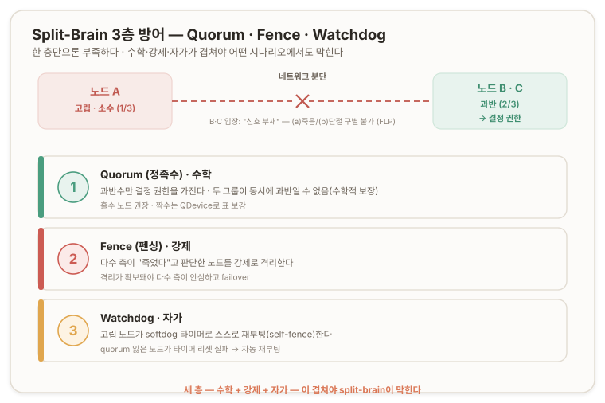
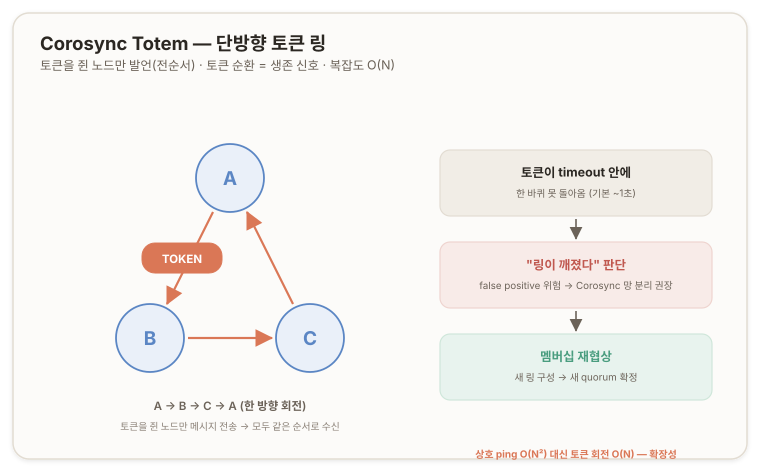
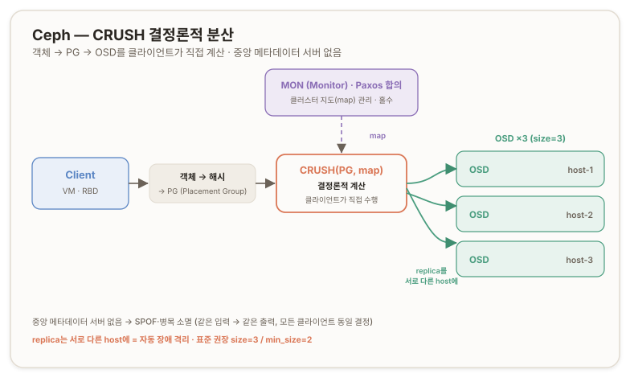

## 개요 ─ Stage 5 {#overview}

Stage 4까지가 *"패킷이 어떻게 흐르는가"* 였다면, Stage 5는 **"여러 노드가 어떻게 *한 시스템처럼* 움직이는가"** 다. 그리고 그 한가운데에 **합의(consensus)** 라는 분산 시스템의 심장이 있다.

이 단계는 두 개의 큰 주제로 나뉜다.

- **클러스터링 (합의와 고가용성)** : 불완전한 네트워크 위에서 여러 노드가 *동일한 결정*에 도달하는 문제. FLP 불가능성·CAP·split-brain이 *왜 본질적*인지, Corosync·Quorum·Fence·HA Manager가 *무엇을 막으려고* 그 자리에 있는지.
- **분산 스토리지 (failover가 환원되는 곳)** : HA failover의 마지막 단계는 결국 *디스크에 손이 닿는가*로 끝난다. 그래서 클러스터링은 *분산 스토리지 문제로 환원*되고, ZFS replication과 Ceph가 *왜 존재하는지*가 그 끝에 있다.

---

## 진단 질문 {#diagnostic-questions}

> **질문 1.**<br/>
> 3노드 Proxmox 클러스터(A·B·C)에서 어느 순간 **노드 A가 B·C의 신호에 응답을 멈췄다.** B·C는 서로 잘 통신한다. B·C 입장에서 *"A가 응답을 안 한다"*는 사실이 — 다음 중 **어느 시나리오 때문인지 외부 관측만으로 구별 가능**할까?
>
> - **(a)** A가 정말 *전원 차단·커널 패닉*으로 죽었다.
> - **(b)** A는 *살아 있는데* B·C와의 *네트워크가 끊어진* 것뿐이다. A는 자기 입장에선 *"B·C가 죽었다"*고 본다.
>
> 힌트 — 둘 다 B·C에겐 *신호의 부재*로 나타난다. *동일한 관찰*이다.

<none/>

> **질문 2.**<br/>
> B·C가 (a)라고 *잘못 판단*해 *A 위의 VM들을 자기 쪽에서 재시작*했다고 치자. 그런데 실제로는 (b)였고, A는 살아서 그 VM들을 *계속 돌리고* 있다. 같은 VM이 *두 노드에서 동시에 돈다*는 것이 — 특히 *공유 스토리지*에 쓰고 있다면 — 어떤 결과를 부를까?

<none/>

> **질문 3.**<br/>
> 그래서 *합의 알고리즘 그 자체*는 **어떻게** 동작할까? 다수 측이 *"A가 죽었다"*는 결정에 어떻게 *모두 함께* 도달하지? *누가 결정을 시작*하고, *언제 확정*되고, *늦게 합류한 노드는 어떻게 따라잡지*? (Corosync가 *정확히 어떻게* 노드 상태를 판단하고 합의에 이르는지, 아는 만큼 추론해봐.)

<none/>

> **질문 4.**<br/>
> 토큰 timeout으로 **링이 깨졌다**고 판단되는 순간, 살아있는 노드들이 *새 멤버십을 협상*한다. 그 협상에도 시간이 걸린다. **그 동안 클러스터는 정상 동작을 멈출까, 계속할까?** 그리고 그 위에서 돌고 있는 **VM은 어떻게 되어야 안전할까?**<br/>
> 힌트 — split-brain 방지가 최우선이므로, 새 멤버십이 확정되지 *않은 상태*에서 *결정을 내리는 건* 위험하다. 협상 중엔 클러스터가 *어떤 상태*에 머물러야 할까?

<none/>

> **질문 5.**<br/>
> Failover의 마지막 단계에서, destination 노드가 VM을 시작하려면 *그 VM의 디스크에 접근*할 수 있어야 한다. 세 시나리오를 추론해봐.
>
>> - **(가)** VM 디스크가 *죽은 노드 A의 로컬 SSD*에만 있다. 다른 노드는 접근 불가.
>> - **(나)** VM 디스크가 *외부 공유 스토리지*(NAS·SAN·Ceph 등)에 있어, 살아있는 모든 노드가 *동시 접근* 가능.
>> - **(다)** VM 디스크는 각 노드 *로컬 SSD*에 있지만 *주기적으로 다른 노드에 복제*된다. A가 죽었을 때 가장 최근 복제본이 B에 있다.
>
> 각 시나리오에서 — **(Q-1)** Failover가 가능한가? **(Q-2)** 가능하다면 어떤 *trade-off*(데이터 손실·성능·비용·복잡도)가 있나? **(Q-3)** **네 환경(VirtualBox 위 nested Proxmox)** 의 제약에서 어느 시나리오가 현실적인가?

<none/>

---

## 01. 클러스터란 무엇인가 {#what-is-a-cluster}

*클러스터(cluster)* 는 흔히 쓰여 오히려 흐릿한 단어다. 정확히는 *목적*에 따라 여러 종류로 갈린다.

| 종류 | 목적 |
| --- | --- |
| **HA 클러스터** (High Availability) | 한 노드가 죽어도 *서비스가 살아남게* |
| **HPC 클러스터** (High Performance Computing) | 계산을 *여러 노드에 분산해 빠르게* |
| **Load Balancing 클러스터** | 트래픽을 *여러 노드에 분산* |
| **Storage 클러스터** (분산 스토리지) | 데이터를 *여러 노드에 분산·복제* |

Proxmox VE 클러스터는 주로 **HA + 관리 통합** 의 성격이다. 여러 노드를 *하나의 관리 평면*으로 묶고, VM이 *어느 노드에서든 살아남게* 한다 — 한 노드가 죽으면 그 위 VM이 다른 노드에서 자동 재시작된다. 말은 간단하지만, *실제로 구현*하려 들면 **분산 시스템의 가장 깊은 난제**가 즉시 떠오른다.

## 02. 분산 시스템의 본질적 난제 ─ FLP 불가능성 {#flp-impossibility}

분산 시스템은 *불완전한 네트워크*(packet loss·latency jitter·MTU 불일치 — Stage 0~4에서 본 그 모든 것) 위에서 여러 노드가 *동일한 결정*에 도달해야 동작한다. 진단 질문 1의 시나리오 — *"A가 응답을 안 한다"* — 에서 *(a) 죽음* 과 *(b) 네트워크 단절* 은 B·C에게 **완전히 동일한 관찰**(신호의 부재)로 나타난다. 둘을 외부에서 구별할 방법이 있는가?

없다. 그리고 이것은 *실무적 어려움*이 아니라 **수학적으로 증명된 불가능성**이다.

> **FLP Impossibility Theorem** (Fischer, Lynch, Paterson, 1985)<br/>
> 비동기 네트워크(메시지 지연이 무한할 수 있는 환경)에서 단 하나의 노드라도 실패할 수 있다면 — *결정론적 합의(consensus) 알고리즘은 존재할 수 없다.*

*이 노드가 죽었는가, 그저 응답이 늦는가*를 **유한한 시간 안에 확실히 구별하는 알고리즘은 만들 수 없다.** ([Fischer·Lynch·Paterson ─ Impossibility of Distributed Consensus with One Faulty Process, 1985](https://groups.csail.mit.edu/tds/papers/Lynch/jacm85.pdf))

현실의 분산 시스템은 **결정론을 포기**한다. 대신 *"충분한 시간 동안 응답이 없으면 죽은 것으로 *간주*한다"* 는 **타임아웃 기반의 비결정론적 추론**으로 간다. 100% 정답을 포기하는 대가로 *대부분의 경우 합리적인 결정*을 빠르게 내린다. Raft·Paxos·Corosync Totem 등 모든 실용 합의 알고리즘이 이러한 방식을 따른다.

## 03. Split-Brain과 CAP Theorem {#split-brain-and-cap}

진단 질문 2가 묘사한 상황 — *같은 VM이 두 노드에서 동시에 돌며 디스크 I/O가 충돌, 데이터 손상, RDB 트랜잭션 깨짐* — 이것이 분산 시스템의 가장 무서운 실패 모드, **Split-Brain**(뇌가 두 쪽으로 갈라진 상태)이다. ([Wikipedia ─ Split-brain (computing)](https://en.wikipedia.org/wiki/Split-brain_(computing)))

이 상황의 본질을 짚는 것이 **CAP Theorem**(Eric Brewer, 2000)이다. 분산 시스템에서 *Consistency(일관성)·Availability(가용성)·Partition tolerance(분단 내성)* 셋을 *동시에* 만족할 수 없다. **네트워크 분단이 일어나면 일관성과 가용성 중 하나를 포기해야 한다.** ([Wikipedia ─ CAP theorem](https://en.wikipedia.org/wiki/CAP_theorem))

| 진영 | 분단 시 동작 | 대표 시스템 |
| --- | --- | --- |
| **CP** (Consistency 우선) | 소수 측을 *차단·읽기 전용* 전환. 일관성 사수, 일부 가용성 희생 | **Proxmox HA**, etcd, ZooKeeper |
| **AP** (Availability 우선) | 양쪽 다 계속 동작 후 *나중에 화해(reconciliation)*. 가용성 사수, 일관성 일시 손실 허용 | Cassandra, DynamoDB |

**Proxmox 클러스터는 CP 진영** 이다 — *데이터 일관성 > 일시적 가용성*. 그래서 *분단의 소수 측*은 *스스로 동작을 멈추도록* 설계된다. "노드 A가 합류하면 사라지는 VM"이 그 결과의 한 단면이다.

## 04. Split-Brain을 막는 세 층위 ─ Quorum · Fence · Watchdog {#quorum-fence-watchdog}

합의의 불가능성(**02.**)과 split-brain(**03.**)을 *우회*하기 위해, Proxmox HA(와 대부분의 HA 클러스터)는 **세 층의 안전망**을 겹쳐 깐다. 한 층만으로는 *모든 장애 시나리오*를 막을 수 없기 때문이다.

| 층 | 무엇 | 누가 책임지나 |
| --- | --- | --- |
| **Quorum (정족수)** | ***수학*** — 과반수만 결정 권한을 가진다 | 클러스터 전체의 투표 |
| **Fence (펜싱)** | ***강제*** — 죽었다고 판단된 노드를 강제 격리 | 다수 측 |
| **Watchdog** | ***자가*** — 고립된 노드가 *스스로* 죽어준다 | 고립된 노드 자신 |

<br/>



**Quorum** 의 핵심은 *과반수 원칙*이다. 두 그룹이 *동시에* 과반수가 될 수는 없다는 *수학적 보장* — 이것이 split-brain의 1차 방어선이다. **홀수 노드를 권장**하는 이유도 여기 있다. 짝수면 50:50 분단 시 양쪽 모두 *소수파*가 되어 클러스터 전체가 마비된다. 짝수 구성에서는 **QDevice**(외부 정족수 장치)를 추가해 표를 홀수로 만든다.

**Fence** 는 *"죽었다고 판단한 노드가 진짜로 아무 일도 못 하게"* 강제로 격리하는 것이다. 격리가 확보되어야 다수 측이 *안심하고* failover할 수 있다. Proxmox는 주로 **Watchdog** 으로 이를 구현한다 — `softdog`(소프트웨어) 또는 하드웨어 watchdog 타이머가, *quorum을 잃은 노드*가 정해진 시간 안에 타이머를 리셋하지 못하면 그 노드를 *자동 재부팅(self-fence)* 시킨다. 고립된 노드가 *스스로 죽어주니까* 다수 측이 데이터 충돌 걱정 없이 VM을 가져올 수 있다. ([Proxmox VE ─ High Availability: Fencing](https://pve.proxmox.com/wiki/High_Availability#ha_manager_fencing))

<br/>



세 층 — **수학(quorum) + 강제(fence) + 자가(watchdog)** — 이 겹쳐 있어야 *어떤 시나리오에서도* split-brain이 막힌다.

## 05. Corosync Totem 프로토콜 {#corosync-totem-protocol}

세 층 안전망의 1차 방어선인 quorum은 *합의*를 전제로 한다. 그렇다면 *합의 알고리즘 그 자체*는 어떻게 동작하는가(진단 질문 3)? Proxmox 클러스터의 합의 엔진이 **Corosync** 이고, 그 핵심 프로토콜이 **Totem Single Ring Ordering and Membership Protocol**(줄여 *Totem*)이다.

흔히 떠올리는 *"각 노드가 서로에게 양방향 heartbeat를 보내 응답 없으면 죽었다 판단"* 은 *일반적인 heartbeat 모델*이지 Corosync의 방식이 아니다. Totem은 더 정교하다.



> **핵심 메커니즘 ─ Token Passing** : 모든 노드가 **virtual ring** 으로 묶이고, **토큰(token) 하나가 그 링을 *한 방향으로* 순환**한다. A → B → C → A → … *양방향 ping이 아니라 단방향 회전 막대기*다.

이 단방향 토큰 구조가 두 가지를 동시에 해결한다.

- **전순서(total ordering)** — 토큰을 *쥔 노드만* 메시지를 보낼 수 있어, 모든 노드가 메시지를 *같은 순서로* 받는다(reliable ordered multicast). 분산 결정의 일관성이 여기서 나온다.
- **멤버십 감지** — 토큰 순환이 곧 *생존 신호*다. 토큰이 정해진 시간(token timeout) 안에 한 바퀴 돌아오지 못하면 **링이 깨졌다**고 보고 **멤버십 재협상**(새 링 구성)을 시작한다. 메시지 복잡도가 전노드 상호 ping의 *O(N²)* 가 아니라 토큰 회전의 *O(N)* 이라 확장성도 좋다.

**Proxmox 기본 token timeout은 약 1초** 수준이다. Storage 트래픽 폭주나 NIC 인터럽트 폭증으로 *ms 단위 지연*만 누적돼도 토큰이 한 바퀴를 못 돌 수 있다. 짧게 잡으면 *false positive*(멀쩡한 노드를 죽었다 판단)가 잦고, 길게 잡으면 *진짜 장애 감지가 늦어*진다 — 02의 FLP가 가리킨 그 딜레마다. **그래서 Corosync 망은 전용 분리가 그토록 강력히 권장된다.** 다른 트래픽과 경합하면 가짜 timeout → 가짜 장애 감지 → 가짜 failover → split-brain 위험. ([Proxmox VE ─ Cluster Network](https://pve.proxmox.com/wiki/Cluster_Manager#_cluster_network))



## 06. Control Plane vs Data Plane {#control-plane-vs-data-plane}

진단 질문 4의 답에 분산 시스템 설계의 *황금 패턴* 하나가 들어 있다. 멤버십 협상 중 클러스터는 *quorum 미확정(inquorate) 상태*에 들어가 **새로운 결정을 내릴 권한이 정지**된다. 그런데 그 동안에도 *VM은 멈추지 않는다*. 모순처럼 보이는 이 둘이 양립하는 이유 —

> **Control Plane(제어 평면) vs Data Plane(데이터 평면) 분리**

| | **Control Plane** | **Data Plane** |
| --- | --- | --- |
| 누가 일하나 | Corosync, HA Manager, pmxcfs | VM 자체, 디스크 I/O, 사용자 트래픽 |
| 어떤 결정? | 멤버십 변경, HA failover 시작, 마이그레이션 시작, 설정 변경 | 사용자 요청, 디스크 읽기/쓰기, 네트워크 응답 |
| 멤버십 협상 중 | **일시 정지** (새 결정 못 내림) | **계속 동작** (VM 영향 없음) |
| 주기 | *큰 결정* — 가끔 | *일상 운영* — 매 순간 |

같은 클러스터 안에서 *두 종류의 일이 독립적으로* 흐른다. *임원 회의(Control)가 한 시간 멈춰 있어도 공장 라인(Data)은 멈추지 않는* 것과 같다. Corosync 멤버십 협상 = 임원 회의, VM 운영 = 공장 라인. 두 layer가 분리되어 있으니 한쪽이 멈춰도 다른 쪽은 멈추지 않는다.

이 분리는 Proxmox 운영에서 *눈에 보이게* 나타난다.

- **`/etc/pve`(pmxcfs)가 *읽기 전용*으로 마운트됨** — quorum 잃은 노드에서 `touch /etc/pve/test` 하면 *Read-only file system* 에러. Control Plane이 멈춘 흔적. 새 VM 생성·설정 변경 같은 *큰 결정*이 막힌다.
- **VM은 계속 돈다** — `qm list`에 status running 그대로. 사용자는 SSH·웹 서비스를 계속 쓴다. Data Plane이 살아 있다.
- **HA Manager는 failover를 시작하지 않는다** — quorum이 없으면 HA 결정 자체가 동결. 죽은 노드가 있어도 *멤버십 확정 전엔* VM을 옮기지 않는다 (CP 진영의 안전 우선).

## 07. HA Manager ─ 결정과 실행의 분리 {#ha-manager-decision-execution}

Proxmox의 HA Manager는 Control Plane 안에서 *또 한 번 layer를 분리*한다 — 이 패턴이 분산 시스템에 얼마나 깊이 박혀 있는지 보여주는 대목이다.

| 데몬 | 어디서 도나 | 역할 |
| --- | --- | --- |
| **`pve-ha-crm`** (Cluster Resource Manager) | 클러스터의 **master 노드 한 곳**에서만 | *"무엇을 해야 하나"* 결정 (judgement) |
| **`pve-ha-lrm`** (Local Resource Manager) | **모든 노드**에서 각자 | CRM의 결정을 자기 노드에서 *실행* (execution) |

**CRM은 결정하고, LRM은 실행한다.** *Decision plane* 과 *Execution plane* 을 또 한 번 가른 것이다. CRM이 도는 master 노드가 죽으면, 살아남은 노드 중 하나가 새 CRM master로 *선출(elect)* 되는데, 이 선출도 Corosync 합의 위에서 일어난다 — **합의 위에 합의가 얹힌 구조**다. ([Proxmox VE ─ High Availability](https://pve.proxmox.com/wiki/High_Availability))

### Failover의 전체 흐름 {#failover-flow}

노드 A 장애 시 클러스터 안에서 차례로 일어나는 일 —

```markdown
1. Corosync token timeout 발생              ← 05 Totem
2. 멤버십 재협상 시작                       ← 06 Control Plane 일시 정지
3. 새 quorum 확정 (다수 측, 2/3)            ← 04 결정 권한 부여
4. Fence — A가 진짜 격리됐는지 확보         ← 04 watchdog / 외부 fence
5. HA CRM이 A의 리소스 목록 확인            ← pmxcfs에서 읽음
6. 각 리소스의 destination 노드 선정        ← HA Group·priority·부하 고려
7. 결정을 pmxcfs에 기록                     ← 모든 노드 동기화
8. destination 노드의 LRM이 명령 수신       ← Execution plane 작동
9. LRM이 VM 시작 → 디스크 접근 필요         ★ 결정적 지점
```

1~7은 *합의·결정*(Control Plane), 8~9는 *실행*(Execution)이다. 그리고 9번 — **VM을 시작하려면 그 VM의 디스크에 접근해야 한다.** 여기가 모든 흐름이 *물리적 현실*과 만나는 지점이며, 다른 모든 게 완벽해도 *디스크에 손이 안 닿으면* failover는 거기서 끝난다. 이 지점이 B부로 가는 다리다.

### Destination 노드 선정 기준 {#destination-node-selection}

CRM이 6번에서 destination을 고르는 기준 — 이것은 *원리*이고, 실제 설정은 학습자의 영역이다.

- **HA Group** — 리소스를 *어느 노드들에* 둘 수 있는지의 제약. (예: *"VM 100은 노드 A·B 중에서만"*)
- **Priority** — 그룹 내 어느 노드를 *우선*할지. 평소엔 priority 높은 노드, 죽으면 다음.
- **Restricted** — 그룹 외 노드로의 failover *금지* 여부. true면 그룹 노드가 다 죽었을 때 VM이 *재시작되지 않음*.
- **Nofailback** — 원래 노드 복귀 시 *자동으로 다시 옮겨갈지*. true면 안 돌아옴 (안정성 우선).

## 08. 디스크는 어디 있어야 하는가 ─ 세 시나리오와 RPO {#disk-placement-and-rpo}

Failover의 9번 단계(VM 디스크 접근)는 *디스크가 어디 있는가*로 결과가 갈린다. 핵심 축은 **"디스크 데이터가 *복제되어 있는가*"** 다. (\*가,나,다는 진단 질문 5의 분류)

| 시나리오 | 디스크 위치 | Failover | RPO (데이터 손실 한계) | 핵심 Trade-off |
| --- | --- | --- | --- | --- |
| **(가) 로컬 *비복제*** | 단일 노드 (LVM-thick, Directory, *복제 안 한 ZFS*) | **불가능** | — | 복제 없음 = 단일 장애점 |
| **(다) 로컬 *주기 복제*** | 각 노드 로컬, 주기 복제 (ZFS replication) | 가능 | *복제 주기만큼* (예: 15분) | 단순·빠름, 다만 RPO ≠ 0 |
| **(나) 외부 공유 스토리지** | NFS·iSCSI·SAN 등 외부 | 가능 | **0 (실시간)** | latency, 네트워크 의존, *스토리지 자체가 SPOF* |
| **(추가) 분산 스토리지 (Ceph)** | 모든 노드에 분산·복제 | 가능 | **0 (실시간)** | 복잡도, 자원 요구 |

핵심 구분 — **ZFS 자체가 (가)/(다)를 결정하는 게 아니라, *복제 설정 여부*가 결정한다.** 같은 ZFS 풀이라도 복제를 안 걸면 (가), 걸면 (다)다. "ZFS면 failover 가능"은 정확히는 *replication 설정 시*에만 참이다.

### RPO ─ Recovery Point Objective {#rpo-definition}

> **RPO(복구 시점 목표)** = *"장애 시 얼마만큼 옛날 데이터까지 복구 가능한가"* = *"얼마만큼의 최근 변경분을 잃을 각오가 되어 있는가"*

ZFS replication의 RPO = 복제 주기. 15분마다 복제하면 RPO는 *최대 15분* — 노드가 1분 전에 죽으면 14분치 손실 가능. **RPO 0(무손실)** 은 *실시간 동기 복제*가 필요하고, 그것은 (나) 공유 스토리지나 Ceph의 영역이다. ZFS replication의 강점은 *단순함·외부 의존 없음·노드 자원만 사용*, 약점은 *RPO ≠ 0* — 분 단위 손실을 감수할 수 있는 워크로드에 어울린다. ([Proxmox VE ─ Storage Replication](https://pve.proxmox.com/wiki/Storage_Replication))

### (나)의 숨은 함정 ─ 공유 스토리지가 SPOF {#shared-storage-spof}

외부 공유 스토리지는 RPO 0이지만, **그 스토리지 자체가 단일 장애점(SPOF)** 이 될 수 있다. Proxmox 노드를 아무리 다중화해도 *NFS 서버 한 대가 죽으면* 모든 노드가 디스크를 잃는다. 그래서 실무에선 *공유 스토리지 자체도 다중화*(SAN multi-controller, NAS HA pair)하거나, **스토리지 자체가 분산된 시스템**(Ceph)으로 간다.

### 세 한계가 모이는 곳 ─ 분산 스토리지 {#toward-distributed-storage}

세 시나리오의 한계를 모으면: *(가) 단순하나 failover 불가*, *(다) 단순하나 RPO ≠ 0*, *(나) RPO 0이나 스토리지가 SPOF*. 셋의 장점을 다 갖고 싶다는 욕심이 **분산 스토리지(distributed storage)** 로, 그 대표가 **Ceph** 다.

## 09. Ceph ─ RADOS · CRUSH · HCI {#ceph-rados-crush-hci}

Ceph가 약속하는 것 — *데이터를 작은 단위로 쪼개 클러스터의 모든 노드에 분산 복제하고, 모든 노드가 동시에 접근하게 한다. 노드 하나가 죽어도 다른 노드에 복사본이 이미 있어 failover 시 데이터 이동조차 필요 없다.* 외부 SAN/NAS 없이 *클러스터 노드 자체가 Compute + Storage 두 역할*을 동시에 하는 것 — 이것이 **HCI(Hyper-Converged Infrastructure)** 이고, *노드만 늘리면 컴퓨팅과 스토리지가 함께 는다*. ([Proxmox VE ─ Deploy Hyper-Converged Ceph Cluster](https://pve.proxmox.com/wiki/Deploy_Hyper-Converged_Ceph_Cluster))

### RADOS 위의 세 인터페이스 {#rados-three-interfaces}

Ceph의 핵심은 **RADOS**(*Reliable Autonomic Distributed Object Store*)라는 분산 오브젝트 저장소이고, 그 위에 세 인터페이스가 얹힌다.

- **Object** (S3 호환) — RadosGW. AWS S3 같은 API.
- **Block** (RBD, *Rados Block Device*) — 가상 디스크용. **Proxmox VM 디스크는 여기 얹힌다.**
- **File** (CephFS) — POSIX 파일시스템.

VM 디스크가 RBD 위에 놓이는 순간, 그것은 *어느 한 노드의 SSD에 묶이지 않고* 클러스터 전체에 *분산·복제된 채로* 존재한다.

### Ceph의 데몬들 ─ 또 한 번의 layer 분리 {#ceph-daemons}

| 데몬 | 역할 | 개수 |
| --- | --- | --- |
| **OSD** (Object Storage Daemon) | *디스크 한 개당 하나*. 실제 데이터 저장 + 복제 + 복구 | 디스크 수만큼 (예: 3노드 × 4디스크 = 12) |
| **MON** (Monitor) | 클러스터 *지도(map)* 관리. **Paxos 합의**로 동기화 | **홀수 권장** — 3 또는 5 |
| **MGR** (Manager) | 모니터링·대시보드·통계 | 2 이상 (active + standby) |
| **MDS** (Metadata Server) | CephFS 쓸 때만. POSIX 메타데이터 | RBD만 쓰면 불필요 |

**결정적 관찰** — MON이 *Paxos 합의*로 동기화된다. 05에서 본 *Corosync Totem 합의*가, **Ceph layer에서 또 한 번 반복**되는 것이다. Proxmox 클러스터 합의 → Ceph 클러스터 합의 — 두 합의가 *층층이 쌓여* 한 시스템을 이룬다. ([Ceph 공식 문서 ─ Architecture](https://docs.ceph.com/en/latest/architecture/))

### CRUSH ─ 중앙 메타데이터 서버 없는 분산 {#crush-decentralized-placement}

핵심 질문 — *"데이터 한 조각이 어느 OSD에 저장돼야 하는가?"* 일반적 분산 시스템은 *중앙 메타데이터 서버*에 묻지만, 그 서버 자체가 SPOF이자 병목이다. Ceph는 그걸 안 한다. **CRUSH**(*Controlled Replication Under Scalable Hashing*) 알고리즘이 *클라이언트가 직접 계산*하게 만든다.

1. **객체 ID를 해시 → PG(Placement Group)** — PG는 객체와 OSD 사이의 *논리적 그룹*. 객체 수십억 개를 일일이 추적하지 않고 PG 단위로 묶어 추적한다.
2. **CRUSH(PG, 클러스터 지도) → OSD 여러 곳** — *결정론적*이다. 같은 입력이면 항상 같은 출력 → *모든 클라이언트가 독립적으로 같은 결정*에 도달 → *"어디 있어?"*를 물어볼 *중앙 서버가 아예 필요 없다*. SPOF·병목 소멸.
3. **토폴로지 인식** — CRUSH는 클러스터의 *물리 구조*(host·rack·datacenter)를 안다. 룰을 *"replica는 서로 다른 host에"* 로 주면 **자동으로 장애 격리**가 일어난다.



<br/>

*해시 함수가 메타데이터 서버를 대체*하는 것 — 이것이 *분산 메타데이터 서버 없이 분산 저장*이라는 모순적 목표를 푸는 방식이다. ([Sage Weil ─ CRUSH 논문, 2006](https://ceph.io/assets/pdfs/weil-crush-sc06.pdf))



### Replication vs Erasure Coding {#replication-vs-erasure-coding}

| | **Replication** | **Erasure Coding** |
| --- | --- | --- |
| 방식 | 데이터 N개 *그대로* 복제 (보통 3) | K조각 + M패리티 (RAID 5/6 개념) |
| 공간 효율 | **33%** (3-replica) | **60~80%** (8+2) |
| 쓰기 성능 | 빠름 | CPU 부담 (인코딩) |
| 복구 | 단순 복사 | 재계산 |
| 적합 | VM 디스크, 자주 읽고 쓰는 데이터 | Backup·archive·cold storage |

Proxmox에서 VM 디스크 보호엔 **`size=3, min_size=2` Replication** 이 표준 권장이다 — *3개 복사본 유지, 최소 2개 살아있어야 쓰기 허용*. ([Ceph ─ Pool Configuration](https://docs.ceph.com/en/latest/rados/operations/pools/))

### Ceph가 네트워크에 까다로운 이유 {#ceph-network-demands}

Ceph의 운명은 *네트워크가 결정*한다 — 이것이 우리 학습의 *닫힘점*이다.

- **Public Network** — 클라이언트(VM·외부) ↔ Ceph 통신.
- **Cluster Network** — OSD 간 *복제 트래픽* 전용. **별도 분리 강력 권장.**

데이터 한 번 쓸 때 **세 OSD에 동기 복제**돼야 primary OSD가 클라이언트에 *"쓰기 완료"* 를 응답한다. OSD 간 통신이 조금만 느려져도 모든 쓰기가 늦어진다. **Ceph cluster network 분리는 Stage 4의 *망 분리*가 *가장 strict하게* 적용되는 사례** 다 (10GbE 이상, latency <1ms 권장). 그리고 MON 간 Paxos 합의도 네트워크 위에서 일어나므로, 05의 *Corosync timeout 민감성*과 같은 이유로 MON 망의 안정성도 결정적이다.

## 10. Ceph에 Stage 적용 {#applying-stages-to-ceph}

Ceph 안에 지나온 모든 봉우리가 다시 등장한다.

| Stage | 개념 | Ceph에서의 재등장 |
| --- | --- | --- |
| 0 | L2/L3 | Ceph 노드 간 통신의 기반 |
| 1 | 라우팅·브리지 | Public/Cluster 네트워크 구성 |
| 2 | 방화벽 | Ceph 포트(MON 3300/6789, OSD 6800–7300) 정책 |
| 3 | VLAN | Cluster network 격리 시 trunk 활용 |
| 4 | 망 분리 | *가장 엄격한 적용 사례* — Public/Cluster·Corosync 분리 |
| 4 | 신뢰 비대칭 | Ceph Cluster 망은 *내부 신뢰만* 통과 |
| 5 | 합의 | MON Paxos = Corosync Totem과 *같은 자리에서 다시* |
| 5 | Control/Data Plane | MON(Control) vs OSD(Data) 분리 |

**같은 문제(분산 합의·네트워크 신뢰성·격리)가 layer마다 같은 패턴으로 반복**된다 — 이것이 분산 시스템 사고의 *진짜 통일성*이다. 그래서 Ceph라는 *낯선 시스템*도 *낯설지 않게* 읽힌다. Stage 0의 *아파트 단지*가 *데이터센터 분산 우주*로 확장됐을 뿐, **원리는 같다.**

---

## 부록 A. 핵심 어휘 빠른 참조 {#appendix-glossary}

| 용어 | 한 줄 정의 |
| --- | --- |
| **consensus** (합의) | 불완전한 네트워크 위 여러 노드가 동일한 결정에 도달하는 것 |
| **FLP Impossibility** | 비동기망+1실패 시 결정론적 합의는 불가능 (1985) |
| **split-brain** | 분단된 양쪽이 각자 결정·실행해 데이터가 충돌하는 재앙 |
| **CAP Theorem** | 분단 시 일관성(C)과 가용성(A) 중 하나를 포기 (Brewer) |
| **CP / AP** | 일관성 우선(Proxmox·etcd) / 가용성 우선(Cassandra) |
| **Quorum** (정족수) | 과반수만 결정 권한. 홀수 노드 권장 |
| **QDevice** | 짝수 클러스터에 표를 더하는 외부 정족수 장치 |
| **Fence** (펜싱) | 죽은 노드를 강제 격리해 충돌 차단 |
| **Watchdog / softdog** | 고립 노드가 스스로 재부팅(self-fence)하는 타이머 |
| **Corosync** | Proxmox 클러스터의 합의·멤버십 엔진 |
| **Totem** | 단방향 토큰 링 합의 프로토콜 (전순서·멤버십) |
| **token timeout** | 토큰 한 바퀴 허용 시간 (Proxmox 기본 ~1초) |
| **Control / Data Plane** | 결정(Corosync·HA) vs 운영(VM·I/O)의 분리 |
| **pmxcfs** (`/etc/pve`) | quorum 없으면 read-only가 되는 클러스터 설정 FS |
| **CRM / LRM** | 결정(master 한 곳) / 실행(전 노드) 데몬 |
| **HA Group·Priority·Restricted·Nofailback** | destination 노드 선정·복귀 제어 옵션 |
| **RPO** | 복구 시점 목표 — 감수 가능한 데이터 손실 한계 |
| **ZFS replication** | 로컬 디스크를 주기적으로 타 노드에 복제 (RPO≠0) |
| **SPOF** | 단일 장애점 — 한 점이 죽으면 전체가 멈춤 |
| **Ceph / RADOS** | 분산 스토리지 / 그 핵심 오브젝트 저장소 |
| **OSD / MON / MGR / MDS** | 저장 / 지도·Paxos / 모니터링 / CephFS 메타데이터 |
| **CRUSH** | 클라이언트가 직접 계산하는 결정론적 데이터 배치 |
| **PG** (Placement Group) | 객체와 OSD 사이의 논리적 그룹 |
| **Replication / Erasure Coding** | 그대로 복제 / K+M 패리티 |
| **`size=3, min_size=2`** | 3복제·최소 2개 생존 시 쓰기 허용 (VM 표준) |
| **HCI** | Compute + Storage를 노드에 합친 하이퍼컨버지드 |

---

## 부록 B. 명령어 빠른 참조 {#appendix-commands}

```bash
# === 클러스터 / Quorum (Proxmox 노드) ===
pvecm status                    # 클러스터·quorum 상태 (Expected/Total votes)
pvecm nodes                     # 멤버 노드 목록
corosync-quorumtool -s          # quorum 상세 (Quorate 여부)
corosync-cfgtool -s             # Totem 링 상태 (ring id, faulty 여부)

# === HA Manager ===
ha-manager status               # HA 리소스·상태·current node
ha-manager config               # HA 리소스 설정
journalctl -u pve-ha-crm        # CRM 로그 (결정)
journalctl -u pve-ha-lrm        # LRM 로그 (실행)

# === pmxcfs (Control Plane 흔적) ===
touch /etc/pve/_t && rm /etc/pve/_t   # quorum 없으면 Read-only file system

# === ZFS Replication ===
pvesr status                    # 복제 작업 상태·마지막 동기 시각 (RPO 확인)

# === Ceph ===
ceph -s                         # 클러스터 health·OSD·MON·PG 요약
ceph osd tree                   # OSD ↔ host ↔ CRUSH 토폴로지
ceph osd pool ls detail         # 풀의 size/min_size 확인
crushtool -d <map> -o out.txt   # CRUSH 맵 디컴파일 (룰 확인)
```

---

## 개인 노트 {#personal-notes}

### 미완·심화로 가는 길 {#further-study}

- **Raft vs Paxos** — Corosync Totem·Ceph MON이 기대는 합의 알고리즘 계열. etcd(Raft)와의 비교.
- **QDevice / QNetd** — 2노드 클러스터의 정족수 보강. nested 환경에서 실습 가능.
- **softdog vs 하드웨어 watchdog** — self-fence 신뢰성 차이. nested 환경의 한계.
- **Ceph Erasure Coding 프로파일** — K+M 설계, 최소 노드 수, 복구 비용.
- **CephFS / RadosGW** — RBD 외 인터페이스. MDS의 역할.
- **Ceph 포트·방화벽** — MON 3300/6789, OSD 6800–7300 (Stage 2와 직결).
- **실습 시나리오** — ① nested VM에 `nfs-kernel-server`로 (나) 공유 스토리지 구성 → failover 체감, ② ZFS replication 주기를 바꿔가며 RPO를 `pvesr status`로 관측, ③ 한 노드를 일부러 격리해 watchdog self-fence 확인.

### 자기 점검 ─ 진단 질문 재방문 {#self-check-revisit}

1. **(a)/(b) 구별 불가 = FLP 불가능성, 결정론 포기** → [02. 분산 시스템의 본질적 난제 ─ FLP 불가능성](#flp-impossibility)
2. **양쪽 동시 실행 = split-brain, CAP의 CP 선택** → [03. Split-Brain과 CAP Theorem](#split-brain-and-cap)
3. **합의 메커니즘 = Corosync Totem 단방향 토큰 링** → [04. Split-Brain을 막는 세 층위](#quorum-fence-watchdog) &nbsp;~&nbsp; [05. Corosync Totem 프로토콜](#corosync-totem-protocol)
4. **멤버십 협상 중 VM = Control/Data Plane 분리** → [06. Control Plane vs Data Plane](#control-plane-vs-data-plane) &nbsp;~&nbsp; [07 HA Manager](#ha-manager-decision-execution)
5. **디스크 위치 세 시나리오 = 복제 여부·RPO·SPOF, Ceph로 환원** → [08. 디스크는 어디 있어야 하는가](#disk-placement-and-rpo) &nbsp;~&nbsp; [09. Ceph ─ RADOS · CRUSH · HCI](#ceph-rados-crush-hci)

각 질문에 *네 환경(3노드 nested 클러스터·Corosync·ZFS·Ceph 가능성)의 맥락*으로 답할 수 있고, 그것이 *클러스터·스토리지 설계*로 이어진다면 Stage 5는 졸업이다.
