## Proxmox VE 9.2 ISO Installation

- 설치 디스크 선택

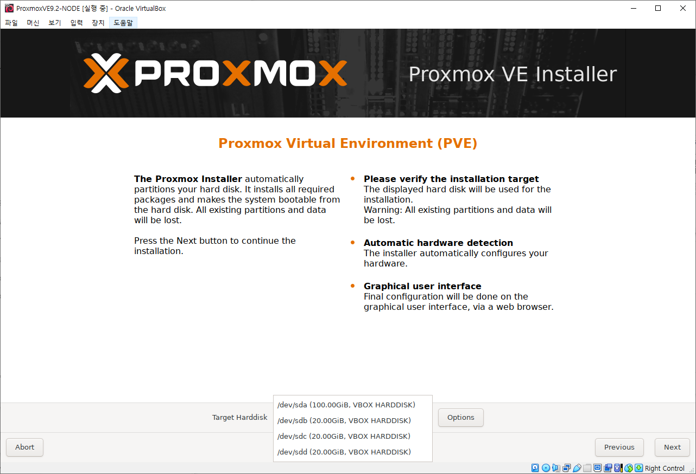

<br/>

- 네트워크 지정

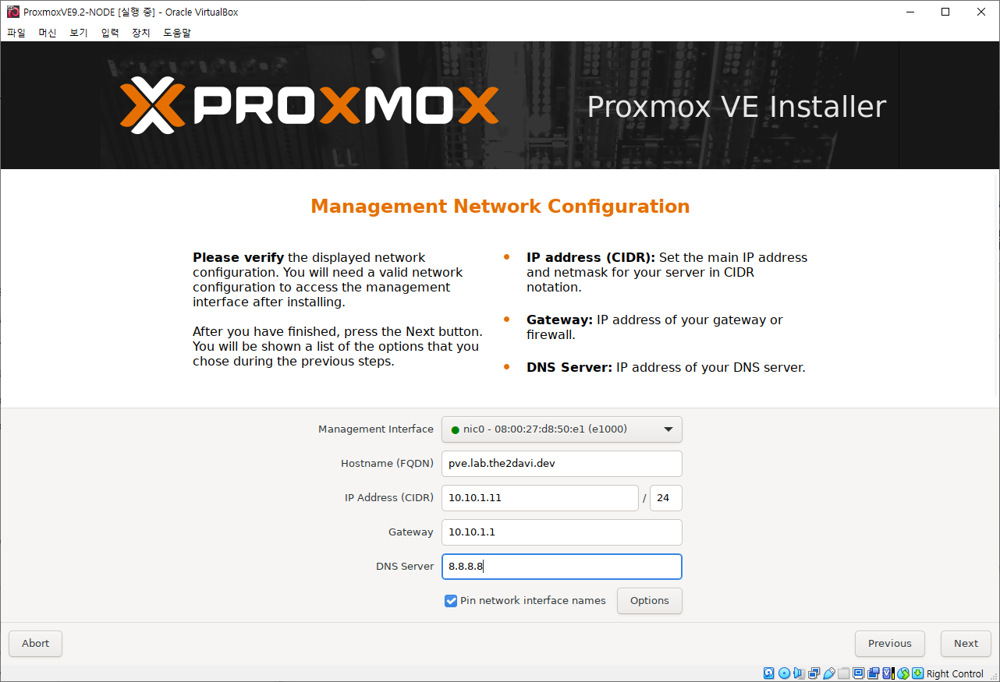

<br/>

- OS(PVE) 설치 정보

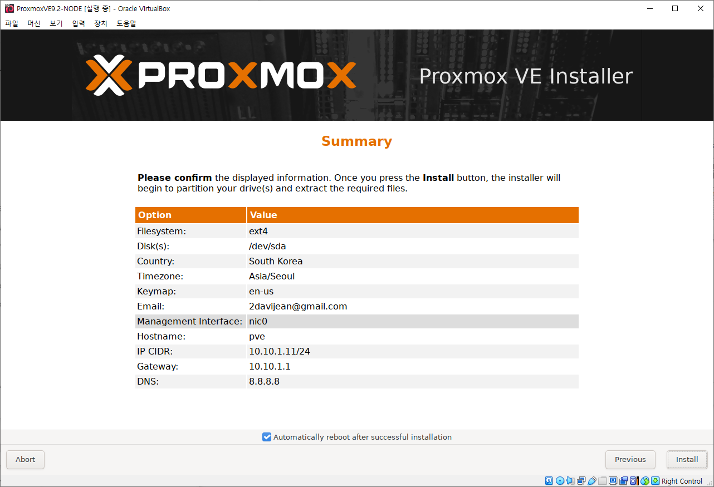

<br/>

- 설치 진행

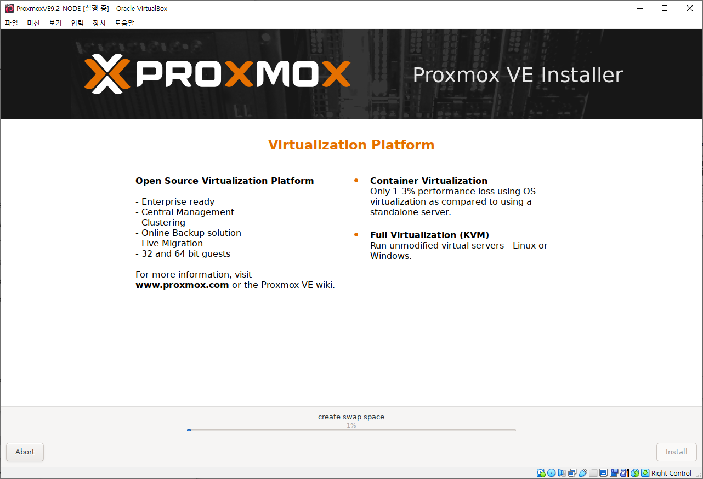

<br/>

- 설치 완료 후: PVE VM 종료 → ISO 이미지 제거

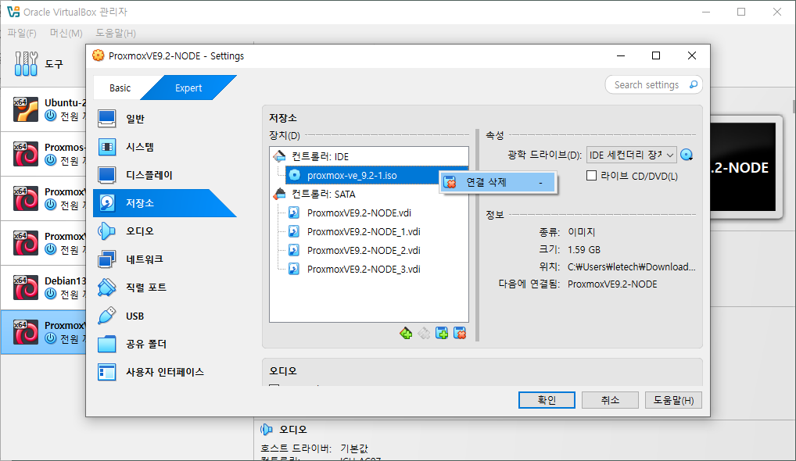

<br/>

- PVE VM 부팅

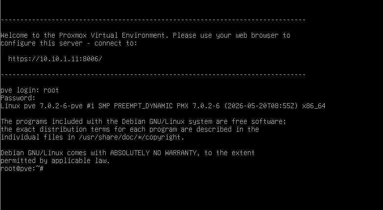

<br/>

## Proxmox VE 9.2 초기 환경 세팅

### 외부 인터넷 연결

- Proxmox의 인터넷 연결을 확인한다.

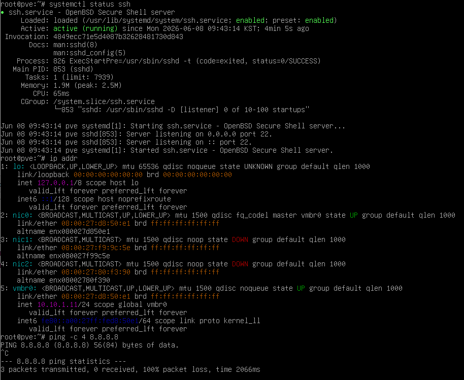

<br/>

- `/etc/network/interfaces` → NAT Network 어댑터로 브리지 생성, gateway 지정

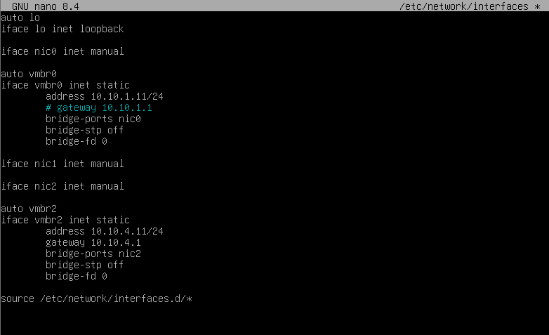

<br/>

- `systemctl restart networking` → 외부 인터넷과 NAT 연결 확인

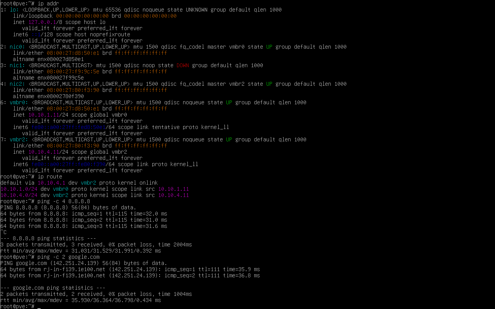

<br/>

### SSH 연결

- PowerShell: Host-Only Adapter(10.10.1.1/24)를 통한 연결이 정상적인지 확인

`ping <PVE MGMT IP>`의 TTL이 Linux 계열 기본값인 64 이어야 한다.
Test-NetConnection 명령을 통해 22번 포트와의 연결(SSH)이 성공적인지 체크할 수 있다.

```powershell
PS C:\Users\letech> ping 10.10.1.11

Ping 10.10.1.11 32바이트 데이터 사용:
10.10.1.11의 응답: 바이트=32 시간<1ms TTL=64
10.10.1.11의 응답: 바이트=32 시간<1ms TTL=64
10.10.1.11의 응답: 바이트=32 시간<1ms TTL=64
10.10.1.11의 응답: 바이트=32 시간<1ms TTL=64

10.10.1.11에 대한 Ping 통계:
    패킷: 보냄 = 4, 받음 = 4, 손실 = 0 (0% 손실),
왕복 시간(밀리초):
    최소 = 0ms, 최대 = 0ms, 평균 = 0ms


PS C:\Users\letech> Test-NetConnection 10.10.1.11 -Port 22

ComputerName     : 10.10.1.11
RemoteAddress    : 10.10.1.11
RemotePort       : 22
InterfaceAlias   : 이더넷 2
SourceAddress    : 10.10.1.1
TcpTestSucceeded : True
```

<br/>

- MobaXTerm을 통한 SSH 세션 시작

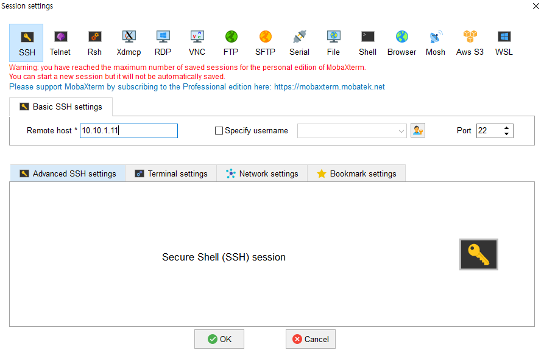

```bash
    ┌──────────────────────────────────────────────────────────────────────┐
    │                 • MobaXterm Personal Edition v25.4 •                 │
    │               (SSH client, X server and network tools)               │
    │                                                                      │
    │ ⮞ SSH session to root@10.10.1.11                                     │
    │   • Direct SSH      :  ✓                                             │
    │   • SSH compression :  ✓                                             │
    │   • SSH-browser     :  ✓                                             │
    │   • X11-forwarding  :  ✗  (disabled or not supported by server)      │
    │                                                                      │
    │ ⮞ For more info, ctrl+click on help or visit our website.            │
    └──────────────────────────────────────────────────────────────────────┘

Linux pve 7.0.2-6-pve #1 SMP PREEMPT_DYNAMIC PMX 7.0.2-6 (2026-05-20T08:55Z) x86_64

The programs included with the Debian GNU/Linux system are free software;
the exact distribution terms for each program are described in the
individual files in /usr/share/doc/*/copyright.

Debian GNU/Linux comes with ABSOLUTELY NO WARRANTY, to the extent
permitted by applicable law.
root@pve:~#
```

<br/>

### APT 저장소 전환

Proxmox 기본 설치 시 Enterprise 구독 저장소(`pve-enterprise`)가 활성화된다. 구독 키가 없는 상태에서 `apt update`를 실행하면 `401 Unauthorized` 에러가 발생한다. No-Subscription 저장소로 교체해야 한다.

> No-Subscription 빌드는 공식 릴리스보다 약간 앞선 스테이징(Staging) 채널이다.
>
> 많은 검색 결과나 AI를 통한 설정 방법에서 옛날 방식인 .list를 다룬다. deb822 대로라면 source 파일만 있을 것이다.

```bash
# Enterprise repo 비활성화
sed -i '1i Enabled: no' /etc/apt/sources.list.d/pve-enterprise.sources
sed -i '1i Enabled: no' /etc/apt/sources.list.d/ceph.sources

# (deb822 방식) No-subscription repo 추가
## 예전 방식인 .list 가이드가 인터넷에 많은데, 이렇게 섞어쓰면 pveversion GUI에서 경고 아이콘이 뜬다.
cat > /etc/apt/sources.list.d/pve-no-subscription.sources << 'EOF'
Types: deb
URIs: http://download.proxmox.com/debian/pve
Suites: trixie
Components: pve-no-subscription
Signed-By: /usr/share/keyrings/proxmox-archive-keyring.gpg
EOF

# APT 업그레이드
apt upgrade && apt full-upgrade -y
```

<br/>

### Subscription Nag 제거

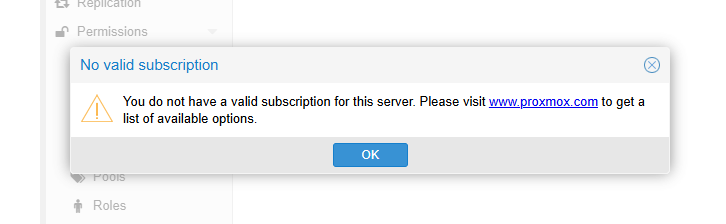

<br/>

Subscription Nag 팝업은 `/usr/share/javascript/proxmox-widget-toolkit/proxmoxlib.js` 내부의 구독 상태 체크 코드에서 발발한다. 사용자가 수동으로 해당 코드를 비활성화해두어도, `apt upgrade`로 패키지 자체가 갱신될 때마다 원본이 되살아난다. 그래서 단발 sed로 작업하는 과정을 apt 작업이 끝날 때마다 자동으로 재적용하는 **DPkg::Post-Invoke** Hook으로 영속화한다.

```bash
# hook 작성 전 sed 명령어 효용성 확인
sed -i "/.*res\.data\.status.*/{s/\!//;s/active/NoMoreNagging/}" \
  /usr/share/javascript/proxmox-widget-toolkit/proxmoxlib.js

systemctl restart pveproxy.service
```

<br/>

- Proxmox Web GUI를 강력 새로고침 후 다시 로그인을 진행하면, 위의 이미지와 같은 팝업이 뜨지 않는다.

> 만약 proxmox-widget-toolkit의 새 버전이 레포에 올라오면, apt upgrade 과정에서 sed로 작업한 수정 사항이 날아간다. 지금 PVE 노드는 APT 저장소 전환하고 full-upgrade까지 때린 직후이니, reinstall 옵션으로 재설치를 하여 '롤백'을 확인할 수 있다.
>
>> ```bash
>> apt install --reinstall proxmox-widget-toolkit
>> systemctl restart pveproxy.service
>> ```

<br/>

- DPkg Hook 생성

```bash
cat > /etc/apt/apt.conf.d/no-nag-script << 'EOF'
DPkg::Post-Invoke { "dpkg -V proxmox-widget-toolkit | grep -q '/proxmoxlib\.js$'; if [ $? -eq 1 ]; then { echo 'Removing subscription nag from UI...'; sed -i '/.*res\.data\.status.*/{s/\!//;s/active/NoMoreNagging/}' /usr/share/javascript/proxmox-widget-toolkit/proxmoxlib.js; }; fi"; };
EOF
```

> `proxmoxlib.js` 파일이 바뀌었으면 hook을 실행하고, 아니면 아무것도 안 한다. `dpkg -V proxmox-widget-toolkit` 은 **패키지 메니페스트** 와 어긋난(=수정된) 파일만 체크하는데, 이와 같은 메커니즘으로 파일의 수정 여부를 판단하고 hook을 실행시킨다.
>
>> `dpkg -V`의 출력 결과에서 `proxmoxlib.js`를 grep한다<br/>
>> &nbsp;&nbsp;&nbsp;&nbsp;&nbsp;&nbsp;→ `if [ $? -eq 1 ]` 조건으로 판단한다<br/>
>> &nbsp;&nbsp;&nbsp;&nbsp;&nbsp;&nbsp;→ `$? = 0`(거짓): 해당 파일의 업데이트 사실이 메니페스트에 없다<br/>
>> &nbsp;&nbsp;&nbsp;&nbsp;&nbsp;&nbsp;→ (sed 패치가 유지되는 중이니까) hook을 실행하지 않는다.

<br/>

- Hook 동작 검증

```bash
apt-get install --reinstall proxmox-widget-toolkit
```

```bash
root@pve:~# apt-get install --reinstall proxmox-widget-toolkit
Reading package lists... Done
Building dependency tree... Done
Reading state information... Done
0 upgraded, 0 newly installed, 1 reinstalled, 0 to remove and 0 not upgraded.
Need to get 230 kB of archives.
After this operation, 0 B of additional disk space will be used.
Get:1 http://download.proxmox.com/debian/pve trixie/pve-no-subscription amd64 proxmox-widget-toolkit all 5.2.3 [230 kB]
Fetched 230 kB in 2s (112 kB/s)
(Reading database ... 60715 files and directories currently installed.)
Preparing to unpack .../proxmox-widget-toolkit_5.2.3_all.deb ...
Unpacking proxmox-widget-toolkit (5.2.3) over (5.2.3) ...
Setting up proxmox-widget-toolkit (5.2.3) ...
Removing subscription nag from UI...  ### ← Subscription Nag를 제거하는 Hook이 실행됐다.

root@pve:~#
```

<br/>

### Nested VT-x/AMD-V 활성화 {#nested-virtualization-disabled}

하이퍼바이저 위에 Proxmox 노드를 띄우는 환경(중첩 가상화 환경; Nested Virtualization)이기 때문에 **`Enabled Nested VT-x/AMD-V`**\* 기능을 켜주어야 한다. 이 기능은 *하드웨어 가상화 기능*을 게스트 VM으로 passthrough해서, VirtualBox 게스트(Proxmox VE) 위에 KVM(Kernel-based Virtual Machine)같은 하이퍼바이저를 설치하고 그 게스트 안에서 다시 VM을 만들어 돌릴 수 있게 한다.

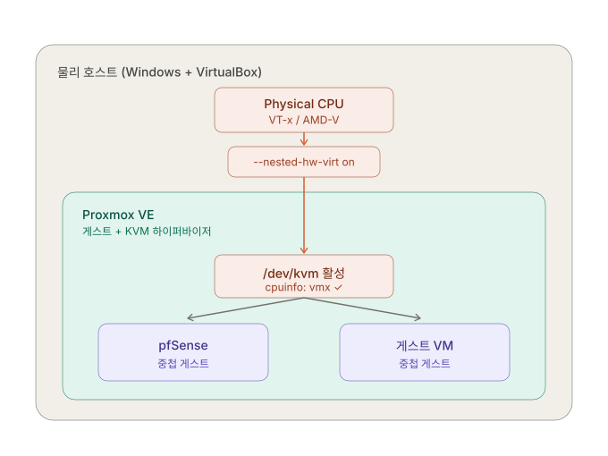

<br/>

Proxmox가 쓰는 KVM은 반드시 CPU의 가상화 확장─Intel이면 VT-x(`vmx`), AMD면 AMD-V(`svm`)─이 _보여야_ 작동한다. 그런데 **VirtualBox는 기본적으로 이 확장을 게스트한테 숨긴다.**

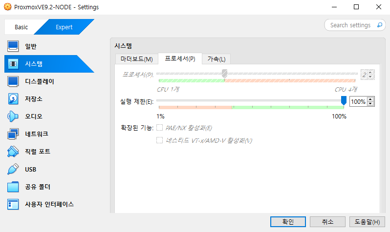

**\*** - 하이퍼바이저가 게스트 VM에게 CPU의 하드웨어 가상화 확장 기능을 넘겨주는(passthrough) 스위치

<br/>

- Proxmox 게스트 안 `/proc/cpuinfo`에서 플래그 확인

```bash
# vmx 혹은 svm 플래그가 존재하지 않으면, Proxmox 위에 nested VM을 실행시킬 수 없다.
grep -E "vmx|svm" /proc/cpuinfo
```

<br/>

- Proxmox 게스트를 완전히 종료시킨 상태에서 `--nested-hw-virt` 옵션 활성화

```powershell
VirtualBox modifyvm "ProxmoxVE9.2-NODE" --nested-hw-virt on

#VirtualBox 가 환경변수로 등록되지 않았다면, 실행파일을 직접 지정하면 된다.
& "C:\Program Files\Oracle\VirtualBox\VBoxManage.exe" modifyvm "ProxmoxVE9.2-NODE" --nested-hw-virt on
```

> 게스트를 종료하지 않고 명령어를 사용하면 **VBoxManage.exe ERROR**가 발생한다.

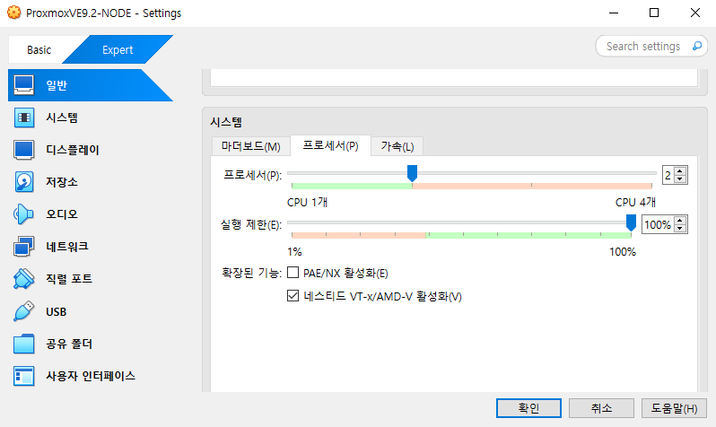

<br/>

- Proxmox 부팅 후 CPU 가상화 플래그 확인

```bash
grep -E "vmx|smx" /proc/cpuinfo
# flags, vmx flags 필드가 출력되어야 한다.

egrep -c "(vmx|svm)" /proc/cpuinfo
# 만약 0이 나온다면 VT-x passthrough가 안 된 것이고, Hyper-V가 가로채서 그렇다.
```

<br/>

### 타임존 및 로케일 확인

```bash
# 타임존 확인
timedatectl

# 로케일 확인
dpkg-reconfigure locales
```

```bash
               Local time: Mon 2026-06-08 11:11:15 KST
           Universal time: Mon 2026-06-08 02:11:15 UTC
                 RTC time: Mon 2026-06-08 02:11:16
                Time zone: Asia/Seoul (KST, +0900)
System clock synchronized: yes
              NTP service: active
          RTC in local TZ: no
```

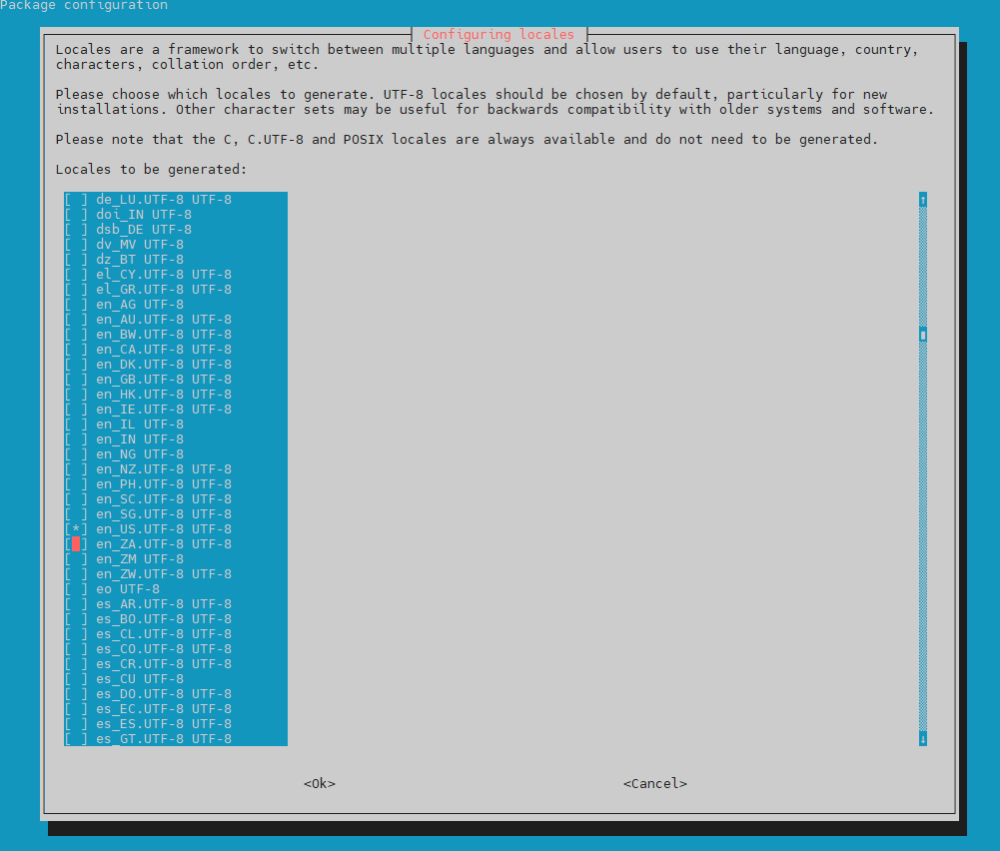

> 만약 OS 설치 과정에서 설정이 잘못되었다면 변경해준다.
>
>> ```bash
>> # 타임존 설정 변경
>> timedatectl set-timezone Asia/Seoul
>>
>> # dpkg locale 변경
>> ## 방향키와 SPACE 키로 원하는 로케일에만 [*] 표시를 남기고 OK
>> ```

### Debian 13.4 ISO Installation

VM `ProxmoxVE9.2-NODE`에서 사용하는 NAT Network 어댑터를 VM `Debian13.4-NFS`에도 연결(`10.10.4.21`)해서 설치를 진행한다.

<br/>

- OS 설치 디스크 (VM 생성한 시점에서 아직 Virtual 디스크 이미지를 추가하지 않아 /dev/sda 하나만 등록되어 있었다.)

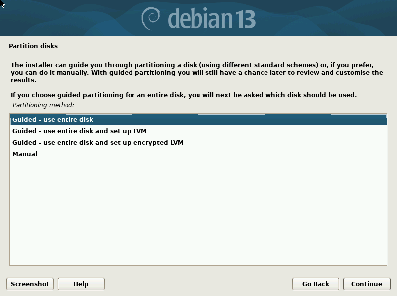

<br/>

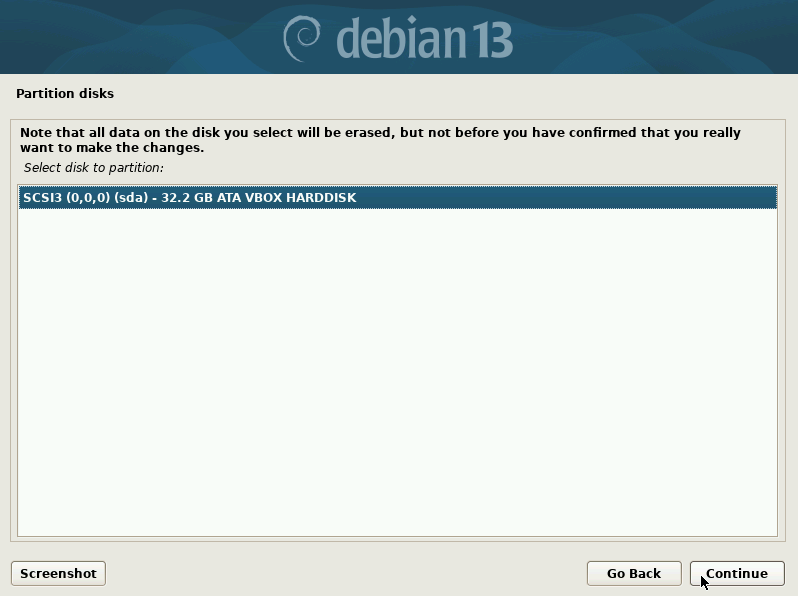

<br/>

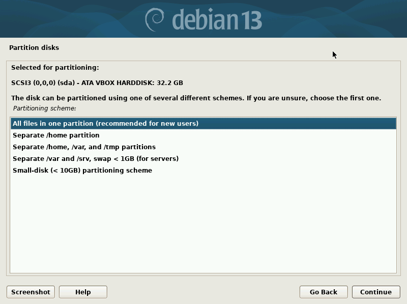

<br/>

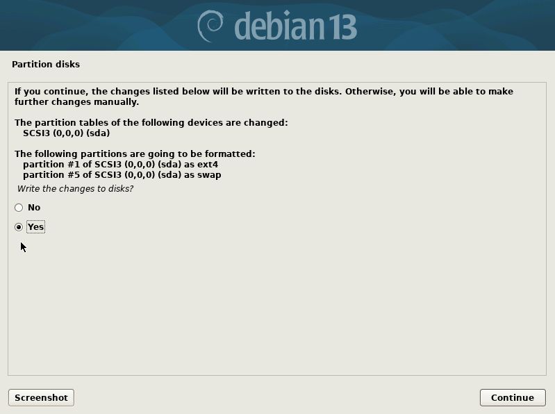

<br/>

- Network (NAT Network 어댑터 하나만 추가해놓았기 때문에 NIC 인식은 자동으로 진행된다. 미리 다른 어댑터를 함께 연결한 경우 인터페이스 이름을 확인하여 선택한다.)

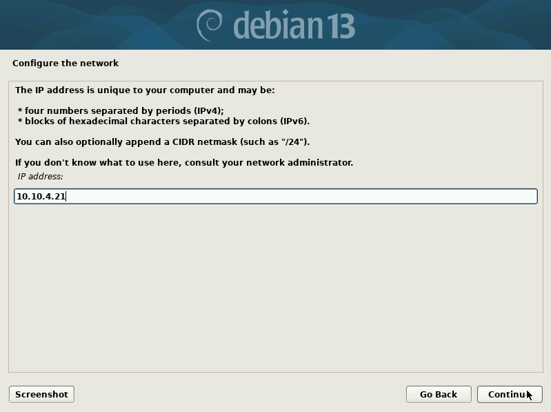

<br/>

- Software (standard system utilities와 SSH server 두 개만 체크한다. Desktop GUI는 사용하지 않는다.)

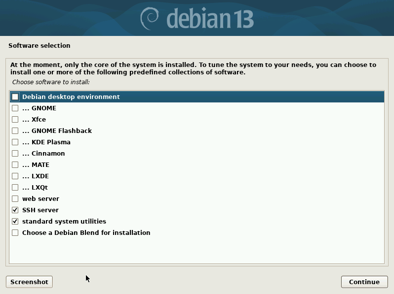

## Debian 13.4 NFS 서버 초기 환경 세팅

### 네트워크 어댑터 연결 (Storage Appliance)

MGMT, STOR 네트워크를 위한 Host-Only Adapter 2개와 INET NAT Network Adapter 하나를 추가한다.

```bash
ip addr

kcy0122@nfs-lab:~$ ip addr
1: lo: <LOOPBACK,UP,LOWER_UP> mtu 65536 qdisc noqueue state UNKNOWN group default qlen 1000
    link/loopback 00:00:00:00:00:00 brd 00:00:00:00:00:00
    inet 127.0.0.1/8 scope host lo
       valid_lft forever preferred_lft forever
    inet6 ::1/128 scope host noprefixroute
       valid_lft forever preferred_lft forever
2: enp0s3: <BROADCAST,MULTICAST,UP,LOWER_UP> mtu 1500 qdisc fq_codel state UP group default qlen 1000
    link/ether 08:00:27:64:65:6b brd ff:ff:ff:ff:ff:ff
    altname enx08002764656b
    inet 10.10.1.21/24 brd 10.10.1.255 scope global enp0s3
       valid_lft forever preferred_lft forever
    inet6 fe80::a00:27ff:fe64:656b/64 scope link proto kernel_ll
       valid_lft forever preferred_lft forever
3: enp0s8: <BROADCAST,MULTICAST,UP,LOWER_UP> mtu 1500 qdisc fq_codel state UP group default qlen 1000
    link/ether 08:00:27:39:37:ae brd ff:ff:ff:ff:ff:ff
    altname enx0800273937ae
    inet 10.10.3.21/24 brd 10.10.3.255 scope global enp0s8
       valid_lft forever preferred_lft forever
    inet6 fe80::a00:27ff:fe39:37ae/64 scope link proto kernel_ll
       valid_lft forever preferred_lft forever
4: enp0s9: <BROADCAST,MULTICAST,UP,LOWER_UP> mtu 1500 qdisc fq_codel state UP group default qlen 1000
    link/ether 08:00:27:cc:1e:92 brd ff:ff:ff:ff:ff:ff
    altname enx080027cc1e92
    inet 10.10.4.21/24 brd 10.10.4.255 scope global enp0s9
       valid_lft forever preferred_lft forever
    inet6 fe80::a00:27ff:fecc:1e92/64 scope link proto kernel_ll
       valid_lft forever preferred_lft forever
```

<br/>

### 외부 인터넷 연결 (Storage Appliance)

- `/etc/network/interfaces`  → NAT Network 어댑터에 IP 부여, gateway 지정

```ini
# This file describes the network interfaces available on your system
# and how to activate them. For more information, see interfaces(5).

source /etc/network/interfaces.d/*

auto lo
iface lo inet loopback

# MGMT Network Interface Card
auto enp0s3
iface enp0s3 inet static
        address 10.10.1.21/24

# STOR Network Interface Card
auto enp0s8
iface enp0s8 inet static
        address 10.10.3.21/24

# INET Network Interface Card
auto enp0s9
iface enp0s9 inet static
        address 10.10.4.21/24
        gateway 10.10.4.1
        dns-nameservers 8.8.8.8
        dns-search nfs.lab.the2davi.dev
```

```bash
systemctl restart networking
```

<br/>

### 데이터 디스크 준비 (Storage Appliance)

- 디스크 이미지 추가

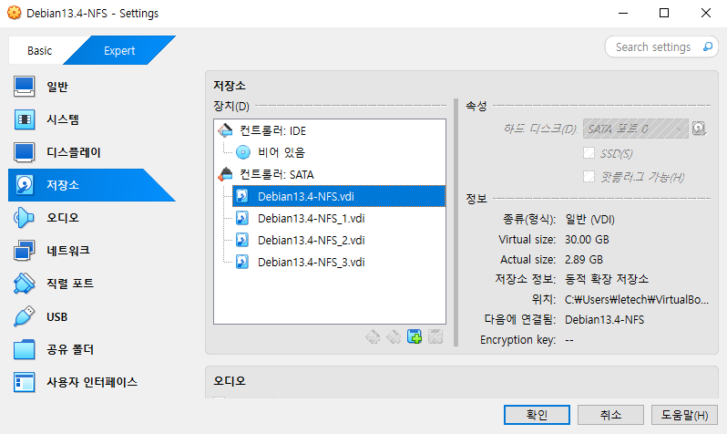

각 20GiB 크기의 디스크 이미지를 세 개 추가한다. 각각 NFS, SMB, iSCSI 스토리지 용도로 사용한다.

<br/>

```bash
lsblk

NAME   MAJ:MIN RM  SIZE RO TYPE MOUNTPOINTS
sda      8:0    0   30G  0 disk
├─sda1   8:1    0   29G  0 part /
├─sda2   8:2    0    1K  0 part
└─sda5   8:5    0 1022M  0 part [SWAP]
sdb      8:16   0   20G  0 disk  # Debian13.4-NFS_1.vdi
sdc      8:32   0   20G  0 disk  # Debian13.4-NFS_2.vdi
sdd      8:48   0   20G  0 disk  # Debian13.4-NFS_3.vdi
sr0     11:0    1 1024M  0 rom
```

<br/>

### NFS 디스크 준비 및 서버 export

- 데이터 디스크 준비

```bash
su -

# 데이터 디스크에 파일시스템 얹고 마운트
mkfs.ext4 /dev/sdb
mkdir -p /srv/nfs/pve
mount /dev/sdb /srv/nfs/pve

# fstab을 등록하면 재부팅을 해도 자동 마운트
blkid /dev/sdb
# /dev/sdb: UUID="00ab531b-d86e-4807-9132-0cdd976a7820" BLOCK_SIZE="4096" TYPE="ext4"
nano /etc/fstab
```

<br/>

```ini
# 파일 마지막에 ENTER치고 새로 한 줄 추가 (사이 공백은 아무렇게나 사용)

# NFS Data Disk
UUID=00ab531b-d86e-4807-9132-0cdd976a7820       /srv/nfs/pve    ext4    defaults,nofail 0       2
```

<br/>

```bash
# 데몬 재실행
systemctl daemon-reload

# 오류 없이 마운트되는지 확인 (마운트를 뗐다가 다시 붙여서 fstab의 by-UUID 마운트의 정상 작동을 확인한다.)
# (출력이 없으면(`stderr = 1`) 성공)
umount /srv/nfs/pve
mount /srv/nfs/pve

## 어느 디바이스로 마운트가 되었는지 확인
findmnt /srv/nfs/pve
## sdb가 /srv/nfs/pve에 붙어 있는지 확인
lsblk
## 별도 파일시스템으로 잘 잡혀 있는지 확인
df -h /srv/nfs/pve
```

> fstab의 nofail 옵션은 **UUID가 틀려서 디바이스(sdb)를 못 찾아도 에러 없이 그냥 건너뛴다.** 그러면 `mount -a`는 멀쩡하게 침묵하면서 정작 재부팅하면 마운트에 실패하는 지점이 발생한다. 그렇기때문에, `umount` & `mount`로 동일 경로를 다시 붙여보면서 fstab에 추가한 한 줄이 정상적으로 작동하는지 확인한다.

<br/>

- NFS 서버 설치

```bash
# nfs-kernel-server 패키지 설치
apt install -y nfs-kernel-server

# export 디렉터리 권한 (추가 학습 필요 지점)
chown nobody:nogroup /srv/nfs/pve

nano /etc/exports
```

```ini
# 파일 마지막에 ENTER치고 새로 한 줄 추가 (사이 공백은 아무렇게나 사용)

# NFS Storage (추가 학습 필요 지점)
/srv/nfs/pve  10.10.10.20(rw,sync,no_subtree_check,no_root_squash)
```

```bash
exportfs -ra    # /etc/exports 다시 읽기
exportfs -v     # 내보낸 항목 확인하기

# nfs 서버 재시작
systemctl enable --now nfs-kernel-server

# NFS 서버가 내보내고 있는 export 목록 확인
showmount -e localhost
```
