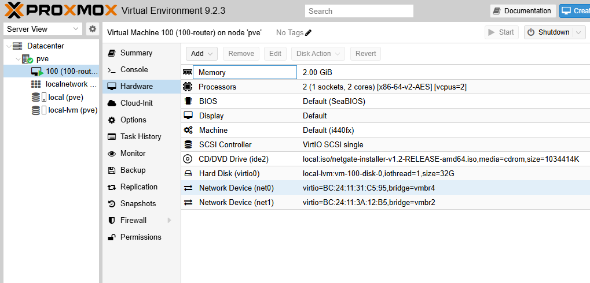

## Proxmox Network Interface 정리

```bash
su -
nano /etc/network/interfaces
```

```ini
root@pve:~# cat /etc/network/interfaces
auto lo
iface lo inet loopback

# MGMT Network Interface Card
iface nic0 inet manual
# STOR Network Interface Card
iface nic1 inet manual
# INET Network Interface Card
iface nic2 inet manual

# MGMT Bridge (L2-nic0)
auto vmbr1
iface vmbr1 inet static
        address 10.10.1.11/24
        bridge-ports nic0
        bridge-stp off
        bridge-fd 0

# VMNT Bridge (L2-NO NIC)
auto vmbr2
iface vmbr2 inet static
        address 10.10.2.11/24
        bridge-ports none
        bridge-stp off
        bridge-fd 0

# STOR Bridge (L2-nic1)
auto vmbr3
iface vmbr3 inet static
        address 10.10.3.11/24
        bridge-ports nic1
        bridge-stp off
        bridge-fd 0

# INET Bridge (L2-nic2)
auto vmbr4
iface vmbr4 inet static
        address 10.10.4.11/24
        gateway 10.10.4.1
        bridge-ports nic2
        bridge-stp off
        bridge-fd 0

source /etc/network/interfaces.d/*
```

## pfSense ─ Network Router

## VM 100(100-router) 생성

- VM Create


- VM Hardware



## VM 100 실행 ─ pfSense OS(FreeBSD) Installation

- WAN vtnet을 고른 뒤 IP 설정을 시작한다.

화면에 보여지는 설정값으로 WAN 네트워크를 만들겠다는 뜻이다. NAT Network에 dhcp 활성화가 되어있다면 이대로 Proceed해도 좋으나, 설치 과정에서부터 static으로 진행하려면 **`M Interface Mode`**에 포인터를 두고 \<ENTER> 키를 한 번 누른다. DHCP/Static/PPPoE 세 모드를 전환할 수 있다.


