## Proxmox Network Interface 정리

```bash
su -
nano /etc/network/interfaces
```

```ini
root@pve:~# cat /etc/network/interfaces
auto lo
iface lo inet loopback

# MGMT Network Interface Card
iface nic0 inet manual
# STOR Network Interface Card
iface nic1 inet manual
# INET Network Interface Card
iface nic2 inet manual

# MGMT Bridge (L2-nic0)
auto vmbr1
iface vmbr1 inet static
        address 10.10.1.11/24
        bridge-ports nic0
        bridge-stp off
        bridge-fd 0

# VMNT Bridge (L2-NO NIC)
auto vmbr2
iface vmbr2 inet static
        address 10.10.2.11/24
        bridge-ports none
        bridge-stp off
        bridge-fd 0

# STOR Bridge (L2-nic1)
auto vmbr3
iface vmbr3 inet static
        address 10.10.3.11/24
        bridge-ports nic1
        bridge-stp off
        bridge-fd 0

# INET Bridge (L2-nic2)
auto vmbr4
iface vmbr4 inet static
        address 10.10.4.11/24
        gateway 10.10.4.1
        bridge-ports nic2
        bridge-stp off
        bridge-fd 0

source /etc/network/interfaces.d/*
```

## VM 100(100-router) 생성

- VM Create

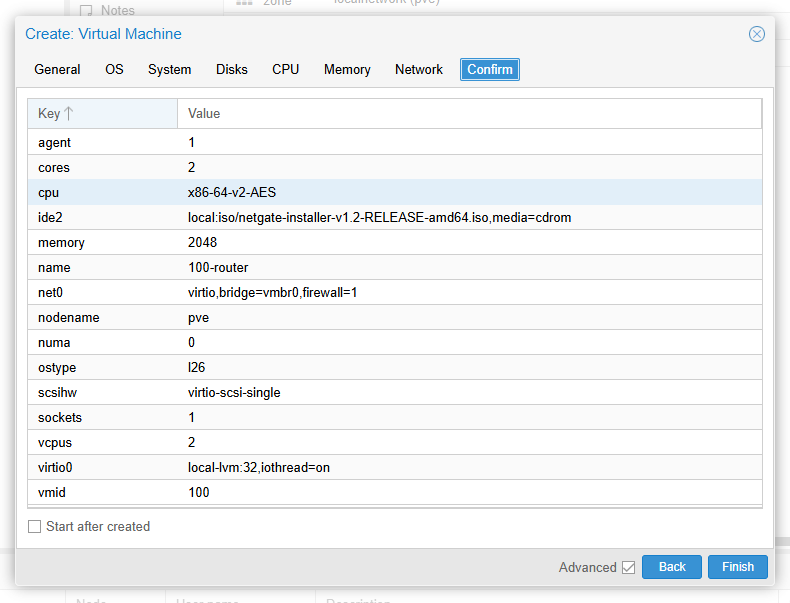

- VM Hardware

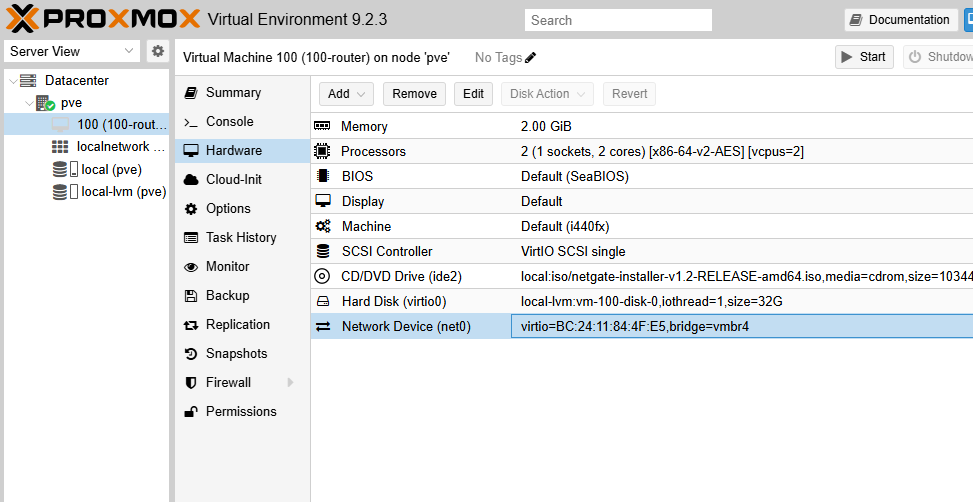

## VM 100 실행 ─ pfSense OS(FreeBSD) Installation

- WAN vtnet을 고른 뒤 IP 설정을 시작한다.

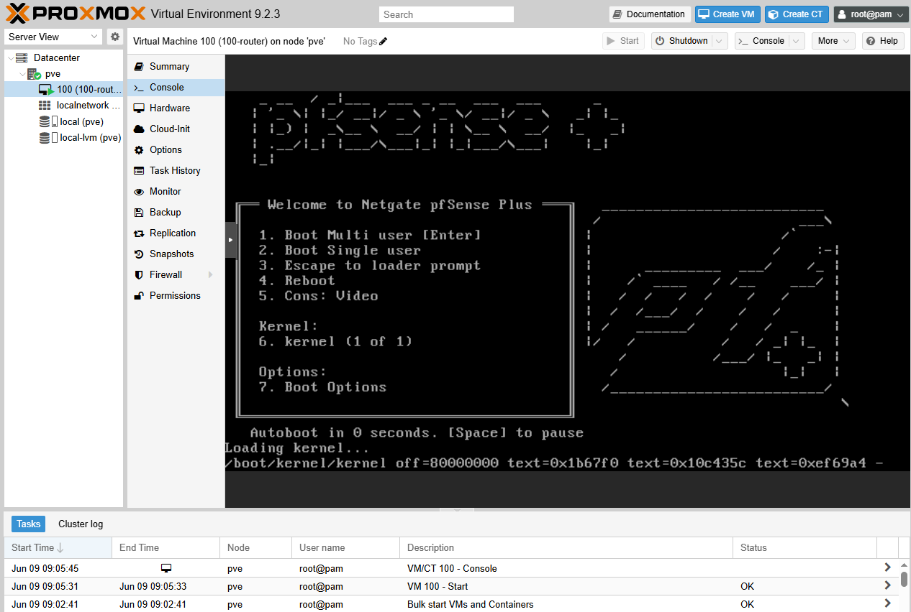

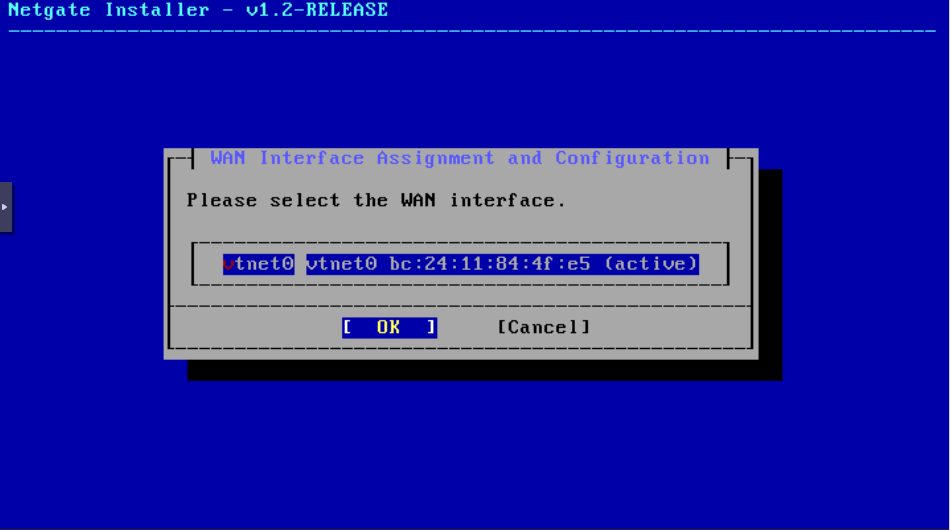

<br/>

화면에 보여지는 설정값으로 WAN 네트워크를 만들겠다는 뜻이다. NAT Network에 dhcp 활성화가 되어있다면 이대로 Proceed해도 좋으나, 설치 과정에서부터 static으로 진행하려면 **`M Interface Mode`**에 포인터를 두고 \<ENTER> 키를 한 번 누른다. DHCP/Static/PPPoE 세 모드를 전환할 수 있다.

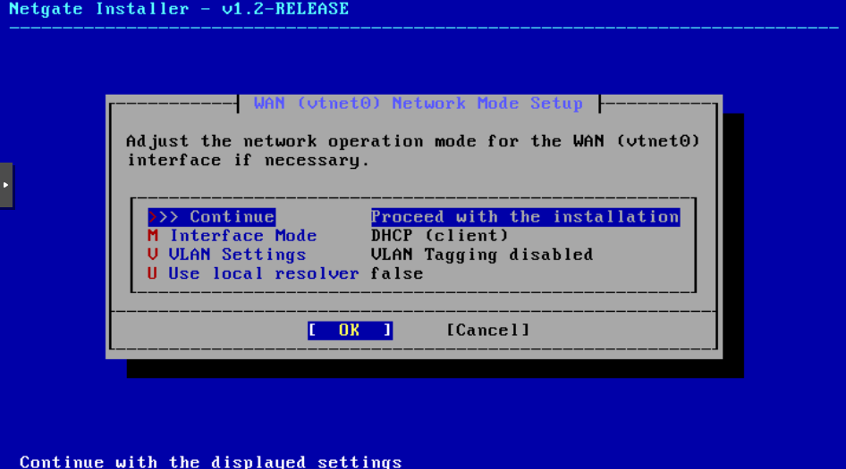

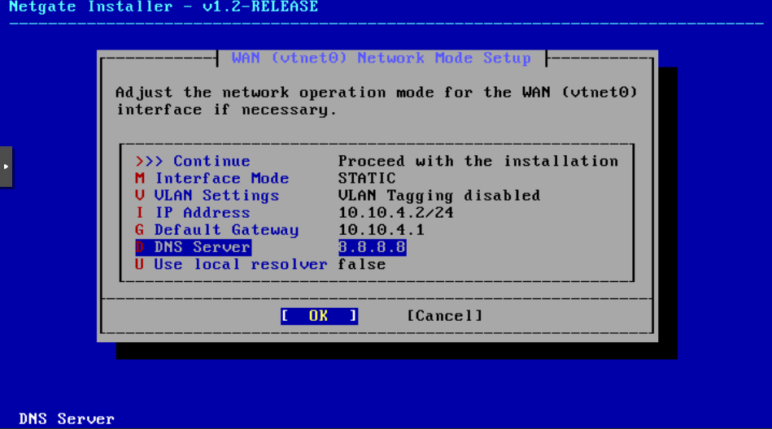

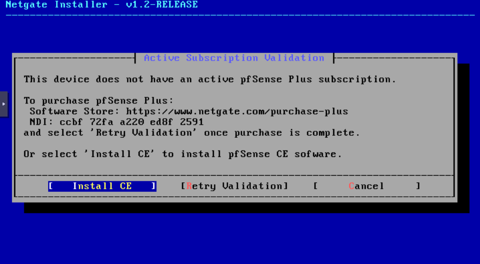

<br/>

- OS 설치 절차 참고

```markdown
- Copyright and Distribution Notice: Accept
- Welcome: Install - Install pfSense → OK
- Network Installation: OK
- WAN Interface Assignment and Configuration: vtnet0 → OK
- WAN (vtnet0) Network Mode Setup:
  - /* Static 모드로 전환해서 IP, Gateway, Nameserver를 입력한다. */
  - >>> Continue - Proceed with the installation → OK
- /* 만약 미리 vtnet1(vmbr2) 네트워크 디바이스(net1)를 추가했다면 */
  - LAN Interface Assignment and Configuration: vtnet1 → OK
  - LAN (vtnet1) Network Node Setup: >>> Continue - Proceed with the installation → OK
- Interface Assignment and Configuration: vtnet1 → Continue
  - Connectivity Check (Verifying the Internet connection... Trying to reach the Netgate Servers, please wait (this can take a while)...)
  - Warning! (Cannot reach the Netgate Servers, please verify your network settings!)
    - VirtualBox NAT Network Adapter의 '무작위 모드'가 `거부`는 아닌지.
    - NAT Network의 dhcp 활성화 여부와 pfSense의 vtnet0 네트워크 인터페이스 설정과 Proxmox 브리지(/etc/network/interfaces) 설정이 일관되는지.
- Active Subscription Validation: Install CE
- Installation Options: >>> Continue - Proceed with the installation
- ZFS Virtual Device Type Configuration: Stripe - No Redundancy → OK
- Disk Selection: [X] vtbd0 32G \<vtbd0\> → Ok
- Confirmation: Yes
- Software Version to install: Current Stable Version (2.8.1) → OK
- Installation Details: (logging...)
- → OK → Halt → \<STOP>
```

## 네트워크 디바이스(net1) 추가 ─ MGMT, VMNT 브리지

MGMT와 VMNT 브리지를 pfSense에 물려주어야 한다. VMNT 네트워크는 중첩 VM의 통신을 라우팅하기 위해 필요하며 LAN 인터페이스로 추가 등록할 것이다. MGMT 네트워크는 pfSense의 Web GUI 조작을 위해 OPT1 인터페이스로 등록하여 준다. OOBM(Out-of-Band Management) 관점─업무 트래픽 경로와 분리된 별도 관리 채널─으로 보아도 필요하다. pfSense는 중첩 VM으로 존재하지만 단일 노드(추후 클러스터로 확장된다고 하더라도)의 인프라 관리 리소스이기 때문이다.

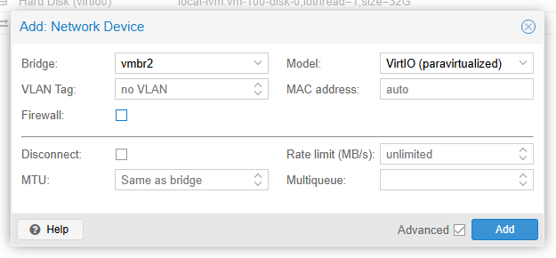

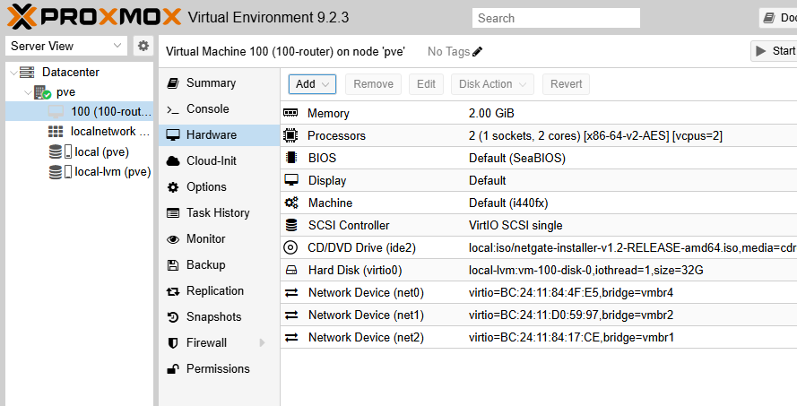

## Router Network Interface 설정 ─ VM 100 Start

pfSense가 정상 구동되면 아래와 같은 화면을 출력하며 입력을 기다린다.

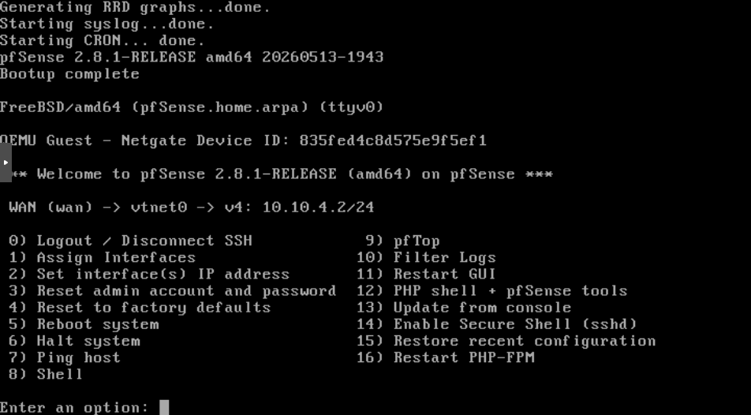

<br/>

- Interface 등록 참고

```markdown
- Enter an option: **1** (Assign Interfaces)
- Should VLANs be set up now?: **n**
- Enter the WAN interface name: **vtnet0**
- Enter the LAN interface name: **vtnet1**
- Enter the Optional 1 interface name (or nothing if finished): **vtnet2**
- The interfaces will be assigned as follows:
  WAN  -> vtnet0
  LAN  -> vtnet1
  OPT1 -> vtnet2
  Do you want to proceed?: **y**
- _Waiting configuration...done._
  _One moment while the settings are reloading... done!_
```

<br/>

- Interface IP 설정 참고

**LAN:**

```markdown
- Enter an option: **2**
- Available interfaces:
  1 - WAN (vtnet0 - static)
  2 - LAN (vtnet1)
  3 - OPT1 (vtnet2)
  Enter the number of the interface you wish to configure: **2**

- Configure IPv4 address LAN interface via DHCP? **n**
- Enter the new LAN IPv4 address. Press \<ENTER> for none: **10.10.2.2**
- Enter the new LAN IPv4 subnet bit count: **24**
- For a WAN, enter the new LAN IPv4 upsteram gateway address.
  For a LAN, press \<ENTER> for none: **\<ENTER>**
- Configure IPv6 address LAN interface via DHCP6?: **n**
- Enter the new LAN IPv6 address. Press \<ENTER> for none: **\<ENTER>**
- Do you wnat to enable the DHCP server on LAN?: **y**
- Enter the start address of the IPv4 client address range: **10.10.2.101**
- Enter the end address of the IPv4 client address range: **10.10.2.200**
```

<br/>

**OPT1:**

```markdown
- Enter an option: **2**
- Available interfaces:
  1 - WAN (vtnet0 - static)
  2 - LAN (vtnet1)
  3 - OPT1 (vtnet2)
  Enter the number of the interface you wish to configure: **3**

- Enter the new OPT1 IPv4 address. Press \<ENTER> for none: **10.10.1.2**
- Enter the new OPT1 IPv4 subnet bit count: **24**
- For a WAN, enter the new OPT1 IPv4 upsteram gateway address.
  For a LAN, press \<ENTER> for none: **\<ENTER>**
- Configure IPv6 address OPT1 interface via DHCP6?: **n**
- Enter the new OPT1 IPv6 address. Press \<ENTER> for none: **\<ENTER>**
- Do you want to enable the DHCP server on OPT1?: **n**
```

<br/>

**만약, 잘못 입력해서 WAN 인터페이스 설정이 맛탱이 갔다면:**

```markdown
- Configure IPv4 address WAN interface via DHCP? **n**
- Enter the new WAN IPv4 address. Press \<Enter> for none: **10.10.4.2**
- Enter the new WAN IPv4 subnet bit count: **24**
- For a WAN, enter the new WAN IPv4 upstream gateway address.
  For a LAN, press \<ENTER> for none: **\<ENTER>**
- Configure IPv6 address WAN interface via DHCP6?: **n**
- Enter the new WAN IPv6 address. Press \<ENTER> for none: **\<ENTER>**
- Do you want to enable the DHCP server on WAN? : **n**

- Do you want to revert to HTTP as the webConfigurator protocol?: **y**
- _Please wait while the changes are saved to WAN..._
- _..._
- _Press \<ENTER> to continue._
```

- **`easyrule`** 등록

현재 OPT1 인터페이스는 MGMT와 직접 연결되어 있지만, 이대로는 pfSense Web GUI에 Windows에서 접속하지 못한다. pfSense에는 [**Anti-Lockout**](https://docs.netgate.com/pfsense/en/latest/config/advanced-admin.html#anti-lockout) 규칙이 있는데, 이는 pfSense의 GUI(80, 443)와 SSH(22) 포트를 허용할 인터페이스를 결정한다. 둘 이상의 인터페이스가 있을 때(현재는 3개 존재) 오직 LAN 네트워크 인터페이스에만 포트를 열어두도록 한다.

하지만 VM 100의 경우, LAN은 VMNT 네트워크로 Proxmox가 생성한 브리지로 연결되는 순수 내부망으로 구성되었다. Windows에서 LAN IP(`10.10.2.2:80` 또는 `10.10.2.2:443`)로 접속할 방법은 없고, 인프라 관리는 MGMT 네트워크로 역할 분리를 하려 했으니, OPT1이 연결된 MGMT 네트워크에 대한 예외 규칙을 지정하여 문제를 해결하려 한다.

가장 중요한 GUI 포트는 열어주어야 한다. `sockstat` 명령어로 nginx가 노출 중인 포트를 확인한다.

```bash
sockstat -4 -l | grep nginx
```

_아래 코드블럭의 세 줄을 다 칠 필요는 없다. 괜히 궁금해서(처음 해보니까) 80과 443 두 줄만 입력함._

```bash
# pfSense Console Menu에서 **8** (tcsh Shell) 진입

easyrule pass opt1 tcp 10.10.1.1 10.10.1.2 22
easyrule pass opt1 tcp 10.10.1.1 10.10.1.2 80
easyrule pass opt1 tcp 10.10.1.1 10.10.1.2 443

> Successfully added pass rule!
```

_`exit` 입력하면 pfSense Console Menu로 돌아간다._

<br/>

> 차라리 LAN에 MGMT를 놓고 VMNT를 OPT1으로 두면 되지 않나? 번거롭게 고민할 필요도 없고 깔끔하게 연결되는 것 아닌가?
>
>> VMNT 네트워크를 분리한 목적은 중첩 VM을 외부 공격자로부터 보호하면서 VM과 VM간/외부와의 트래픽을 보장하기 위함이었다. 여기서 pfSense가 등장하여, 방화벽을 세우고 인터넷과의 연결 통로를 열어주는 내부망의 역할을 해주길 기대했다. LAN은 anti-lockout(All Subnet에 대해 방화벽/포트 설정) + default-allow(`Any` 기본 허용 등) 규칙이 기본으로 적용된다. LAN에 기대하는 역할이 VMNT의 망 분리 목적과 부합한다.
>>
>> MGMT는 Management Plane으로 접근하기 위해 필요한 네트워크로, pfSense에서는 관리자 호스트 하나만 22/80/443 포트를 열어주고 나머지 접근은 `Deny` 처리하는 것이 맞다. 권한을 최소한으로 두는 것(Least Privilege)이 원칙인 이 네트워크를 LAN으로 등록하는 것은, pfSense의 컨벤션과도 맞지 않고 인프라 운용 측면에서도 불합리하다. VMNT가 Optional interface로 설정될 경우, OPT1 인터페이스에 대한 방화벽 규칙을 굳이굳이 LAN을 따라 맞춰주어야 하기 때문이다. 차라리 MGMT를 OPT1로 두고 *명시적 허용 목록을 짜는 것*이 훨씬 싸게 먹힌다.

## pfSense Web GUI 접속

<br/>

## Setup Wizard

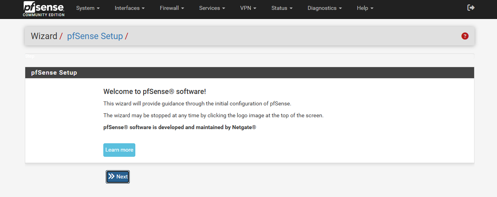

```markdown
- General Information:
  - Hostname: 100-router
  - Domain: router.lab.the2davi.dev
  - Primary DNS Server: 8.8.8.8
  - Secondary DNS Server: 8.8.4.4
  - Override DNS: enabled
  - /** 언급하지 않은 항목(e.g., MAC Address, MTU 등)은 건드리지 않고 넘어간다. */
- Configure WAN Interface:
  - Configuration Type: Static
  - IP Address: 10.10.4.2
  - Subnet Mask: 24
  - Upstream Gateway: 10.10.4.1
- Configure LAN Interface:
  - /** VM 100 Console에서 설정한 IP가 적혀있을 것이다. */
  - LAN IP Address: 10.10.2.2
  - Subnet Mask: 24
- Change admin Account Password:
  - /** 비밀번호는 알아서. (GUI admin 비밀번호) */
- Reload Configuration:
  - "Reload" 버튼 클릭.
- Wizard Completed:
  - "Finish" 버튼 클릭.
```

<br/>

## Web GUI(webConfigurator)의 프로토콜(HTTP/HTTPS) 전환

- `System > Advanced > [TAB] Admin Access` 에서 설정 변경.
- 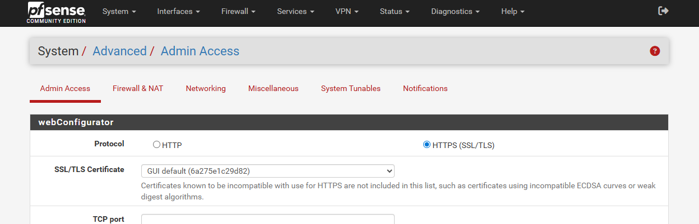

## pfSense의 Network Interface 설정

- `Interface > Assignments > [TAB] Interface Assignments`
  여기서 pfSense Console Menu의 1, 2번 작업을 GUI로 진행할 수 있다.
- 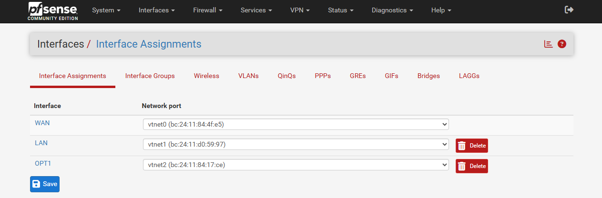

- "Interface" 컬럼의 항목(e.g., WAN, LAN, OPT1) 링크를 클릭하면 세부 설정으로 넘어간다.

<br/>

## pfSense의 방화벽 설정

- WAN, LAN 인터페이스는 Proxmox 환경 설계 과정에서도 별도의 요구사항이 없으므로(머가리가 지긋지긋하대서) 건드리지 않는다.
- OPT1(MGMT)는 최소 권한(**Least Privilege**)으로 운용하겠다.

- `Firewall > Aliases` **Alias**를 만들어두어서 방화벽 규칙/포트포워드/outbound NAT 등에 참조시키면 설정이 간편해지고 관리가 용이하다. MGMT IP((Windows) 10.10.1.1)를 매번 숫자로 적는 게 아니라 Java에서 final 상수로 빼놓고 참조해 쓰는 느낌.
- 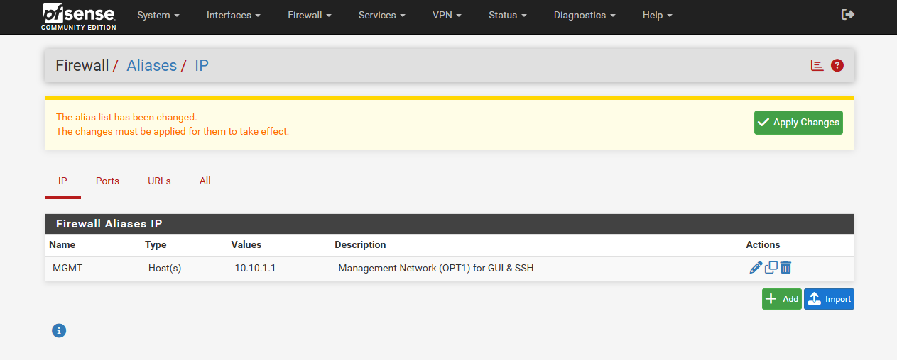
- 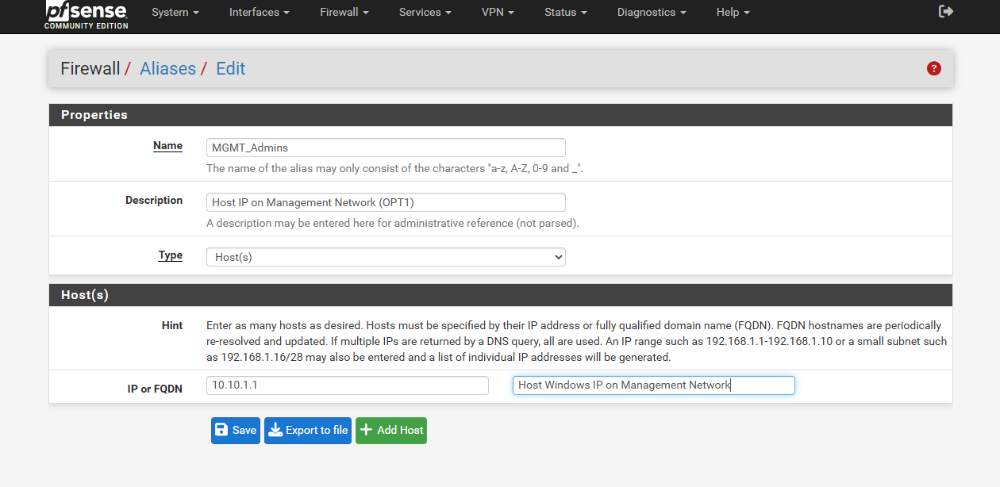

```markdown
- IP Alias:
  - Name: MGMT_Admins
    /** 처음엔 MGMT라 지었는데, IP Alias 치고 쓸데없이 대표적인 뉘앙스로 느껴져서 변경함. */
  - Description: Host IP on Management Network (OPT1)
  - Type: Host(s)
  - IP or FQDN: 10.10.1.1 / (Description) Host Windows IP on Management Network
```

> Port Alias도 지정할 수 있다. 별 것 없다.
> 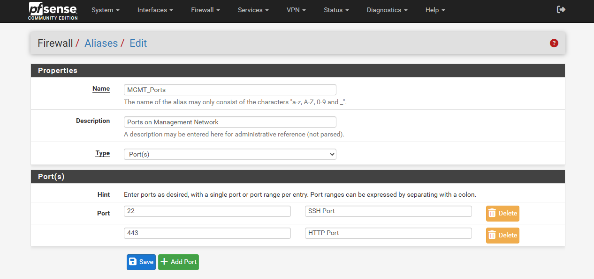

<none/>

> Alias는 이런 식으로 사용한다. (방화벽 규칙 설정 중)
>
>> 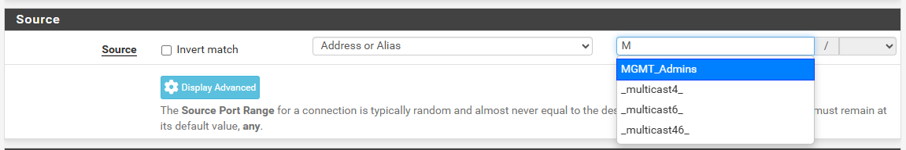
>>
>> 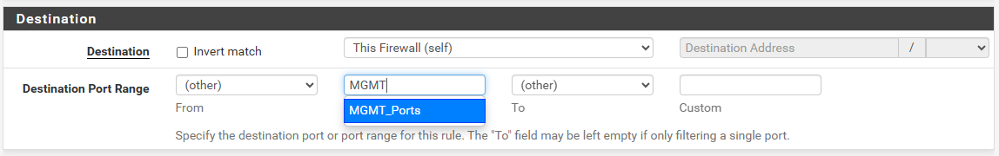

<br/>

- `Firewall > Rules > [TAB] OPT1` 만약 easyrule을 따라서 등록했다면, Rules 테이블에 뭔가 Rows가 있을 것이다.
- ![Firewall > Rules > [TAB] OPT1](./_embeds/img/03-pfsense-network-router/20260609_026.png)
- ![Firewall > Rules > [TAB] OPT1 re.](./_embeds/img/03-pfsense-network-router/20260609_029.png)

> Rules 적용 순서\*는 **한 패킷을 pfSense가 받을 때마다 위에서부터 순차대로** 라고 생각하면 된다.
>
>> 외부에서 **`MGMT_Admins` IP와 `MGMT_Ports` Port로부터 패킷이 들어왔다면,** 제일 먼저 맨 위의 Rule부터 적용시켜본다─ Pass Rule에 부합하는 패킷이니까 무사 통과한다.
>
>> 즉 `MGMT_Admins`, `MGMT_Ports` (IP와 Port)를 둘 다 만족하는 패킷이 아니라면, 첫 번째 규칙(Pass Rule)에 부합하지 않으니 다음 순번의 규칙(Reject Rule)을 적용시켜본다. Reject Rule은 Any, Any로 지정해놨기 때문에, OPT1의 방화벽은 **"MGMT IP와 Port가 아닌 요청은 모두 거부한다"고** 볼 수 있다.
>
> **\*** UI가 헷갈릴 수 있다. 표의 우측 하단 버튼들 중 "Save"로 변경한 순서를 저장한다. 표의 각 행에 커서를 올리고 클릭 앤 드래그로 순서를 변경한다. 방화벽 변경사항은 [TAB] 헤더 상단의 노란 박스에서 "Apply Changes"를 클릭해야 비로소 실제로 적용된다.

## SSHD 활성화 ─ SSH 연결

pfSense는 SSH 데몬을 기본적으로 꺼둔다. 방화벽 포트(`:22`)를 열어주었으니, SSHD를 실행시키도록 설정한다.

- GUI: `System > Advanced > Admin Access > [SECTION] Secure Shell` Enable Secure Shell 체크 후 "Save" 클릭
- Console: pfSense Console Menu **14**
  - SSHD is currentry disabled. Would you like to enable?: **y**

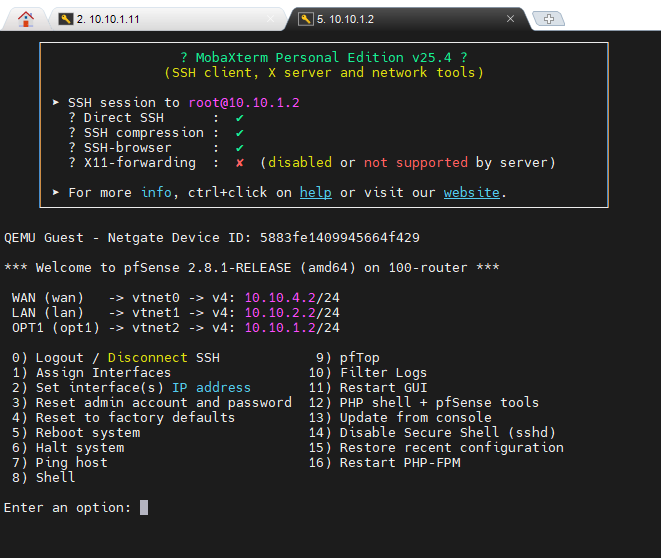

> USERNAME: root
>
> PASSWORD: \<webConfigurator Login Password>

## QEMU Guest Agent 설치

실질적으로 필요하지도, 쓸모 있지도 않다. Proxmox noVNC로 들어가면 pfSense Console Menu 상단에 IP가 이미 뜰 뿐더러, 이젠 SSH 접속도 가능하기 때문이다. 그래도 Summary Dashboard에 IP Address 정보가 혼자 안 뜨는 건 아쉽다는 생각으로 번거로운 작업을 수행해본다.

pfSense는 Linux가 아닌 FreeBSD 기반이다. 그리고 (다행히도) pfSense 2.6.0 버전부터 pkg 레포에 qemu-guest-agent가 존재해서 설치 자체는 간단하다.

하지만 pfSense에는 종료 후 다시 부팅한 뒤에 QEMU Guest Agent가 알아서 실행되지 않는다는 문제가 있다.

<br/>

**부팅 후 자동 기동이 안 된다:**

QEMU Guest Agent 패키지는 FreeBSD rc 서비스를 함께 설치하면서, `/etc/rc.conf.local` 파일에 `qemu_guest_agent_enable="YES"`를 입력한다. 그렇기에 FreeBSD OS라면 문제가 없었겠지만, pfSense는 FreeBSD의 rc(8) 부팅 절차를 그대로 따르지 않고, _자체 부팅 시퀀스로 **자신이 관리하는 서비스 목록만** 띄운다._ 사용자가 `rc.conf.local`에 추가한 외부 패키지 서비스는 **관리하는 서비스 목록 바깥의 것**으로 취급해 부팅 시퀀스에서 제외되는 것이다. 그러니 별다른 조치를 취하지 않으면 매번 pfSense를 재부팅할 때마다 QEMU Guest Agent를 수동으로 실행시키는 유지 비용이 발생한다.

이를 해결하기 위해 Shellcmd 패키지의 earlyshellcmd에 `service qemu-guest-agent start`를 등록하거나(1), `/usr/local/etc/rc.d/` 디렉토리에 QEMU Guest Agent를 기동하는 Wrapper Script를 두어, pfSense의 부팅 흐름에 기동 명령을 직접 끼워넣는 방식(2)을 사용할 수 있다.

여기서는 직접 스크립트를 작성하는 방식을 따랐다.

```console
======= pfSense Console Menu =======
Enter an option: **8**
```

```shell
=============== tcsh ================
# 표준 `sh` Shell로 진입
sh

# ...하거나,
# sh로 넘어가지 않고 아래 명령을 tcsh 문법에 맞춰 작성한다.
# 크게 다를 것 없이, `<< 'EOF'`에서 따옴표만 제거하고 복붙하면 된다.
```

```bash
================ sh =================
pkg install -y qemu-guest-agent

# rc.conf.local에 활성화 (없으면 생성)
cat >> /etc/rc.conf.local << 'EOF'
qemu_guest_agent_enable="YES"
qemu_guest_agent_flags="-d -v -l /var/log/qemu-ga.log"
EOF

# 부팅 시 자동 기동 래퍼 (pfSense는 이걸 안 깔면 재부팅 후 안 뜸)
cat > /usr/local/etc/rc.d/qemu-agent.sh << 'EOF'
#!/bin/sh
sleep 5
service qemu-guest-agent start
EOF
chmod +x /usr/local/etc/rc.d/qemu-agent.sh

service qemu-guest-agent start
```

<br/>

**QEMU Guest Agent 토글을 켠다:**

- VM > Options 패널에서 QEMU Guest Agent 항목이 `Enabled`인지 확인

Disabled라면 체크박스 활성화 해주고 pfSense VM을 \<STOP> & \<START>로 재부팅한다. 왜 SHUTDOWN이 아니라 STOP이냐 하면, QEMU 채널이 연결되어있지 않은 상태이기 때문이다.

Proxmox의 QEMU Guest Agent 설정은, Proxmox가 VM에 가상 직렬 채널(virtio-serial)을 새 가상장치로 추가하는 것으로 활성화된다. 이 채널이 Proxmox의 qemu-ga 소켓과 게스트 내부의 QEMU Guest Agent를 잇는 통로가 되어준다.

여기서 SHUTDOWN과 STOP이 다른 점은, SHUTDOWN의 메커니즘이 ACPI 이벤트를 게스트에게 보내 스스로 종료하기를 '요청하는' 것이기 때문이다. 채널이 없는 상태에서 SHUTDOWN 요청을 보내면, 해당 Task(VM Shutdown)가 타임아웃으로 실패한다고 한다. _흠?_

**아무튼, 이렇게만 하면 QEMU Guest Agent 설치 & 세팅 끝 ^0^:**

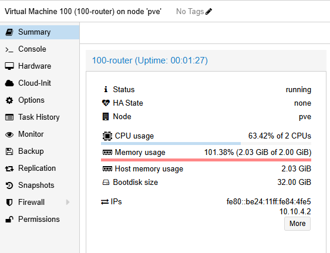
