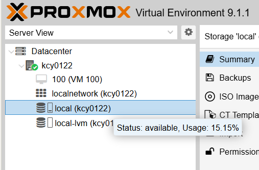
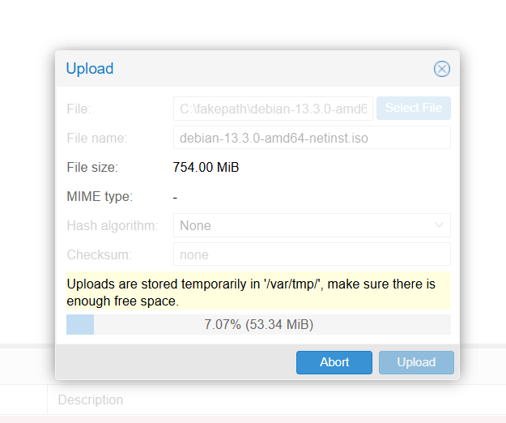
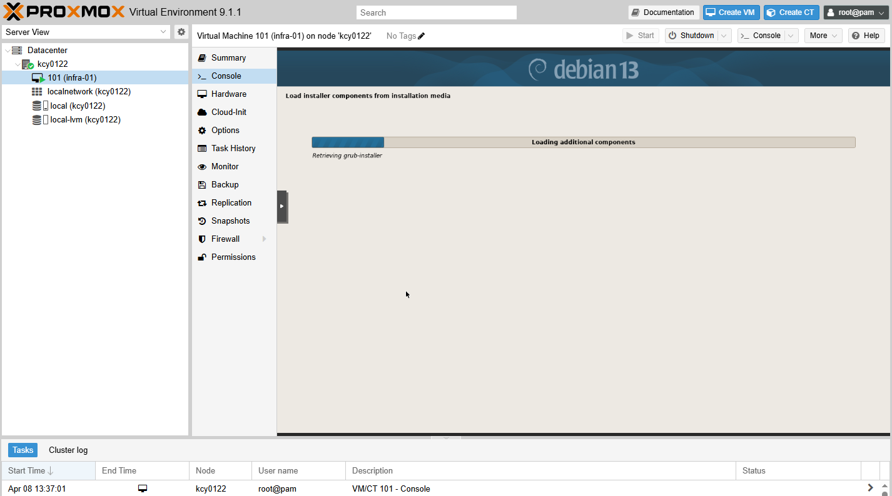

> 이 문서는 지난한 시행착오를 담고 있습니다.
> 정제된 결과를 보고 싶으시면 [다음 문서](./92-nic-architecture-and-nested-virt-postmortem.md)를 확인하세요.

<br/>

## 환경 정보

| 항목            | 내용                         |
| --------------- | ---------------------------- |
| Proxmox VE      | 9.1-1 (Debian Bookworm 기반) |
| 선행 문서       | `01-proxmox-installation.md` |
| 관리 인터페이스 | `https://127.0.0.1:8006`     |
| 노드명          | kcy0122                      |

> 이 문서는 `01-proxmox-installation.md`에서 초기 설정이 완료된 상태를 전제로 한다.

---

## 1. VM 라이프사이클 (Lifecycle) 개요

Proxmox에서 QEMU/KVM 가상 머신은 다음 라이프사이클을 따른다.

```markdown
생성(Create) → 실행(Start) → 스냅샷(Snapshot) → 복제(Clone) → 백업(Backup)
     ↑                              ↓
  복구(Restore)  ←  삭제(Destroy)  ←  복원(Rollback)
```

모든 조작은 Web UI, CLI(`qm`, `vzdump`, `qmrestore`), 그리고 REST API(`/api2/json/`)를 통해 수행할 수 있다. Web UI에서 버튼 하나 누르는 행위도, 내부적으로는 REST API 호출이다. 이 사실을 항상 염두에 둬라. CMP(Cloud Management Platform)를 만든다는 건, 결국 이 API를 프로그래밍적으로 호출하는 것이다.

> [**공식 API 레퍼런스 |**](https://pve.proxmox.com/pve-docs/api-viewer/index.html)
> [**공식 CLI 매뉴얼**](https://pve.proxmox.com/pve-docs/qm.1.html)

---

## 2. VM 생성 (Create)

### 2.1 CLI 기본

```bash
qm create <VMID> [OPTIONS]
```

`qm create`는 VM의 설정 파일(`/etc/pve/qemu-server/<VMID>.conf`)을 생성한다. 디스크를 붙이지 않으면 빈 껍데기만 만들어지는 것이며, 이후 `qm set`으로 디스크, NIC, CPU 등을 추가한다.

### 2.2 VMID 체계 설계

VMID는 클러스터 전체에서 고유한 정수값(100 이상)이다. 아무렇게나 쓰면 나중에 수백 개의 VM이 쌓였을 때 관리가 불가능해진다. 실무에서는 일반적으로 다음과 같은 체계를 설계한다.

| 대역      | 용도              | 예시                        |
| --------- | ----------------- | --------------------------- |
| 100–199   | 인프라/관리용 VM  | DNS, DHCP, 모니터링         |
| 200–299   | 개발/테스트 환경  | dev-api-server, test-db     |
| 300–399   | 스테이징(Staging) | staging-web, staging-worker |
| 500–599   | 운영(Production)  | prod-app-01, prod-db-master |
| 9000–9099 | 템플릿(Template)  | ubuntu-cloud-template       |

VMID 체계는 팀과 프로젝트 규모에 따라 달라지지만, 핵심 원칙은 **"VMID만 보고도 용도를 유추할 수 있어야 한다"**는 것이다. CMP를 개발할 때 이 체계는 자동 VMID 할당 로직의 기반이 된다.

### 2.3 CPU/RAM 오버커밋 (Overcommit)

오버커밋이란, 물리 호스트가 보유한 것보다 더 많은 자원을 VM에 "약속"하는 것이다.

**CPU 오버커밋:** 가능하고 일반적이다. vCPU는 시분할(Time-Sharing)로 물리 코어를 공유하기 때문에, 물리 코어 4개인 호스트에 vCPU 합계 16개를 할당하는 것도 가능하다. 단, 모든 VM이 동시에 CPU를 100% 사용하면 경합(Contention)이 발생한다.

**RAM 오버커밋:** 메모리 풍선(Memory Ballooning, `balloon` 장치)을 사용하면 가능하지만, CPU 오버커밋보다 훨씬 위험하다. 물리 메모리가 고갈되면 OOM Killer가 프로세스를 죽이거나 호스트 전체가 멈출 수 있다. 운영 환경에서는 RAM 오버커밋을 권장하지 않는다.

**실무 가이드라인:**

- CPU: 물리 코어 대비 2~4배까지는 보편적으로 허용
- RAM: 1:1 또는 최대 1.2배 수준을 유지. Ballooning은 개발/테스트 환경에서만

### 2.4 QEMU Machine Type

`qm create` 시 `--machine` 옵션으로 QEMU 머신 타입(Machine Type)을 지정할 수 있다. 이것은 VM에게 "너는 어떤 하드웨어 보드 위에서 돌아가고 있다"고 알려주는 가상 칩셋 사양이다.

| 타입              | 설명                                                                                                                 |
| ----------------- | -------------------------------------------------------------------------------------------------------------------- |
| `i440fx` (기본값) | 전통적인 PC 칩셋 에뮬레이션. 호환성이 높고 안정적                                                                    |
| `q35`             | PCIe(PCI Express) 네이티브 지원, UEFI/OVMF 부팅과 궁합이 좋음. GPU 패스스루(Passthrough), NVMe 디바이스 사용 시 권장 |

`q35`는 최신 OS에서 더 나은 성능을 보이지만, 레거시(Legacy) OS에서는 호환성 이슈가 있을 수 있다. 특별한 이유가 없다면 Proxmox 기본값(`i440fx`)을 따르되, UEFI 부팅이나 PCIe 패스스루가 필요하면 `q35`를 선택하라.

> **공식 문서:** https://pve.proxmox.com/pve-docs/pve-admin-guide.html#qm_virtual_machines_settings

---

## 3. VM 생성 실습

### 3.1 생각 없이 생성

> `qm create 100`이 실제로 하는 일은, `100.conf`라는 텍스트 파일 하나를 만드는 것. 디스크도, NIC도, OS도 없다.

```bash
qm create 100
cat /etc/pve/qemu-server/100.conf
```

```bash
boot:
meta: creation-qemu=10.1.2,ctime=1775548839
smbios1: uuid=5e4cc988-e5a2-4557-a09d-0f8311a0e455
vmgenid: d4ef9356-c095-49a9-aeb3-d300f8ce7f3e
```

**Proxmox**에서 **"VM"**이라는 건 **QEMU 프로세스 하나**를 가리킨다. **Proxmox**가 생성된 `.conf` 파일을 읽고 적혀있는 사양대로 `qemu-system-x86_64` 프로세스를 띄우는 것. `.conf` 파일은 QEMU한테 "너는 CPU 몇 개짜리고, RAM 얼마짜리고, 디스크는 여기 달려있고, NIC는 이거"라고 알려주는 **레시피**인 셈이다.

1. **디스크:** OS가 설치될 가상 하드디스크
2. **부팅 매체:** ISO 이미지든 네트워크 부팅이든, 설치를 시작할 무언가
3. **CPU/RAM 사양:** 얼마만큼의 자원을 할당할건지

아래와 같이 `[OPTIONS]`를 때려넣어서 선언하면 된다.

```bash
qm create 101 --name test-vm --memory 2048 --cores 2 \
  --net0 virtio,bridge=vmbr0 \
  --scsi0 local-lvm:32 \
  --ide2 local:iso/debian-13.3.0-amd64-netinst.iso,media=cdrom \
  --boot order=ide2 \
  --scsihw virtio-scsi-single
```

- **`--scsi0 local-lvm:32`:** **LVM-thin** Storage(local-lvm)에 **32GB** 가상 디스크를 생성하고, **SCSI** 컨트롤러의 **0**번 슬롯에 연결
- **`--ide2 local:iso/debian-12.iso,media=cdrom`:** ISO 파일을 가상 **CD-ROM** 드라이브로 마운트
- **`--boot order=ide2`:** CD-ROM에서 먼저 부팅(OS 설치를 위해)
- **` --scsihw virtio-scsi-single`:** **SCSI** 컨트롤러 타입을 지정. **VirtIO SCSI**가 성능이 가장 좋다.

> ISO 파일은 **Proxmox Web UI**에서 `local` 스토리지에 미리 올려놓으면 된다.




```bash
boot: order=ide2
cores: 2
ide2: local:iso/debian-13.3.0-amd64-netinst.iso,media=cdrom,size=754M
memory: 2048
meta: creation-qemu=10.1.2,ctime=1775550070
name: test-vm
net0: virtio=BC:24:11:BD:56:51,bridge=vmbr0
scsi0: local-lvm:vm-101-disk-0,size=32G
scsihw: virtio-scsi-single
smbios1: uuid=a07e80f9-9f3e-4fa8-ad4d-72d83c2244c5
vmgenid: f4d29804-ab1a-47cb-90ab-0d50dd55ebf8
```

자세한 내용은 [Proxmox VE VM 설정 파일(qm.conf) 심화 레퍼런스](./91-proxmox-qm-conf-reference.md)을 확인.

### 3.2 생성한 VM 실행

**ISSUE:** **VirtualBox 위에 Proxmox를 올린 환경**이기에 중첩 가상화(Nested Virtualization) 문제에 걸린다.

```bash
qm start 101

> KVM virtualisation configured, but not available. Either disable in VM configuration or enable in BIOS.
```

- **Proxmox**가 **VM**을 띄우려고 **KVM**(하드웨어 가상화)를 쓰려는데, Proxmox 자체가 VIrtualBox 안에서 구동되고 있기 때문에 호스트 CPU의 VT-x/AMD-V 명령어에 접근하지 못하는 것.
- VirtualBox가 "가상머신 안에서 또 가상머신을 만드는 것"을 허용하지 않도록 설정된 탓.

**RESOLVE:** **VirtualBox에서 Nested VT-x 활성화**

- Proxmox VM을 **완전히 종료**한 상태에서 Windows 호스트의 **PowerShell** 또는 **CMD**:
  1. `VBoxManage list vms` - Proxmox 이름 확인
     PATH 등록이 안 되어있으면, `& "C:\Program Files\Oracle\VirtualBox\VBoxManage.exe" list vms`
  2. `VBoxManage modifyvm "<Proxmox-VM-이름>" --nested-hw-virt on` - Nested VT-x 활성화
     또는, `& "C:\Program Files\Oracle\VirtualBox\VBoxManage.exe" modifyvm "Proxmos-9.1-1" --nested-hw-virt on`

만약 Windows 호스트에서 **Hyper-V가 활성화되어 있으면** VirtualBox의 Nested VT-x가 제대로 작동하지 못할 수 있다.
VirtualBox Nested VT-x와 Hyper-V는 서로 공존할 수 없는 존재.

> WLS2를 구동하려면 Hyper-V가 필수적으로 활성화되어야 한다. WLS2나 Docker Desktop을 사용 중이라면, 감안해서 알아 해야 한다.

- **확인:** PowerShell 관리자 권한:
  1. `Get-WindowsOptionalFeature -Online -FeatureName Microsoft-Hyper-V` - 출력값이 없으면 Microsoft-Hyper-V가 설치되지 않았다는 뜻(무시해도 OK), `State: Enabled`면 활성화된 상태.
  2. `bcdedit /enum | findstr hypervisorlaunchtype` - `hypervisorlaunchtype Auto`면 활성화된 상태.
- **끄기:** PowerShell 관리자 권한:
  1. `Disable-WindowsOptionalFeature -Online -FeatureName Microsoft-Hyper-V-All`
  2. `bcdedit /set hypervisorlaunchtype off` - 성공 시 `작업을 완료했습니다.` 출력.
  3. **Windows Host를 재부팅한다.**


### 3.3 VM 옵션 조작하기

VM의 자원 할당을 조절하여 `102.conf`를 생성하기를 시도한다. 하지만 여러 차례, 옵션 끝에 역슬래시 `\`를 빠뜨리면서 삭제, 재생성을 반복하였다.

```bash
# 최종.
qm create 102 \
  --cores 1 \
  --memory 1024 \
  --balloon 0 \
  --cpu host \
  --ostype l26 \
  --agent enabled=1,fstrim_cloned_disks=1 \
  --scsi0 local-lvm:32,discard=on,iothread=1 \
  --scsihw virtio-scsi-single \
  --net0 virtio,bridge=vmbr0,firewall=1 \
  --serial0 socket
```

```bash
# 결과
root@kcy0122:/etc/pve/qemu-server# cat 102.conf
agent: enabled=1,fstrim_cloned_disks=1
balloon: 0
boot: order=scsi0;net0
cores: 1
cpu: host
memory: 1024
meta: creation-qemu=10.1.2,ctime=1775607323
net0: virtio=BC:24:11:81:4D:55,bridge=vmbr0,firewall=1
ostype: l26
scsi0: local-lvm:vm-102-disk-3,discard=on,iothread=1,size=32G
scsihw: virtio-scsi-single
serial0: socket
smbios1: uuid=bff67b48-32ca-4823-a07d-652f801b4a31
vmgenid: 4726b5d3-c64c-47ce-be18-16db6c39b81b
```

<br/>

> 이 과정에서, 시퀀스가 증가한 디스크가 쌓였다. `scsi0` 필드의 값을 보면 `vm-102-disk-3`을 가리키고 있다.

```bash
root@kcy0122:/etc/pve/qemu-server# lvs | grep 102
  vm-102-disk-0 pve Vwi-a-tz--  32.00g data        0.00
  vm-102-disk-1 pve Vwi-a-tz--  32.00g data        0.00
  vm-102-disk-2 pve Vwi-a-tz--  32.00g data        0.00
  vm-102-disk-3 pve Vwi-a-tz--  32.00g data        0.00
```

<br/>

> 모두 삭제해주고 `102.conf`까지 새로 만들어주었다.

```bash
root@kcy0122:/etc/pve/qemu-server# lvremove /dev/pve/rm--102--disk--0
  Failed to find logical volume "pve/rm--102--disk--0"
root@kcy0122:/etc/pve/qemu-server# lvremove /dev/pve/vm--102--disk--0
  Failed to find logical volume "pve/vm--102--disk--0"
root@kcy0122:/etc/pve/qemu-server# lvremove /dev/pve/vm-102-disk-0
Do you really want to remove active logical volume pve/vm-102-disk-0? [y/n]: y
  Logical volume "vm-102-disk-0" successfully removed.
root@kcy0122:/etc/pve/qemu-server# lvremove /dev/pve/vm-102-disk-1
Do you really want to remove active logical volume pve/vm-102-disk-1? [y/n]: y
  Logical volume "vm-102-disk-1" successfully removed.
root@kcy0122:/etc/pve/qemu-server# lvremove /dev/pve/vm-102-disk-2
Do you really want to remove active logical volume pve/vm-102-disk-2? [y/n]: y
  Logical volume "vm-102-disk-2" successfully removed.
root@kcy0122:/etc/pve/qemu-server# lvremove /dev/pve/vm-102-disk-3
Do you really want to remove active logical volume pve/vm-102-disk-3? [y/n]: y
  Logical volume "vm-102-disk-3" successfully removed.
root@kcy0122:/etc/pve/qemu-server# rm 102.conf
root@kcy0122:/etc/pve/qemu-server# qm create 102 \
  # ...
```

### 3.4 또 뻗었다

Proxmox VM의 RAM과 CPU를 아래와 같이 늘려주었다.
Windows 호스트의 RAM이 15.8GB, CPU는 2코어에 논리 프로세서 4개. Proxmox에 여유를 더 주고 `102.conf`를 재실행한다.

- **RAM:** 6144MB → 8192MB
- **CPU:** 2개 → 4개

<br/>

> 그런데도 또 터졌다.

진단을 위해, PowerShell을 열고 아래와 같이 로그를 살펴본다.

```powershell
# 여기서 VM 폴더 이름 확인하고
Get-ChildItem "$env:USERPROFILE\VirtualBox VMs"

# 여기에 적어넣었다.
Get-Content "$env:USERPROFILE\VirtualBox VMs\Proxmos-9.1-1\Logs\VBox.log" -Tail 30
```

<br/>

> 하지만 정상 종료 로그만 남아있었다. Tail을 더 늘려 `Pattern`을 주고 찔러보았지만 아무 기록도 없었다.

```powershell
Get-Content "$env:USERPROFILE\VirtualBox VMs\Proxmos-9.1-1\Logs\VBox.log" -Tail 200 | Select-String -Pattern "error|guru|fatal|oom|kill|abort|panic"
```

```powershell
PS C:\Users\letech> Get-Content "$env:USERPROFILE\VirtualBox VMs\Proxmos-9.1-1\Logs\VBox.log" -Tail 30
00:05:08.941773 E1000#0: Interrupts by TXQE: 0
00:05:08.941780 E1000#0: TX int delay asked: 0
00:05:08.941786 E1000#0: TX delayed:         0
00:05:08.941792 E1000#0: TX delay expired:   0
00:05:08.941798 E1000#0: TX no report asked: 4155
00:05:08.941804 E1000#0: TX abs timer expd : 0
00:05:08.941810 E1000#0: TX int timer expd : 0
00:05:08.941816 E1000#0: RX abs timer expd : 0
00:05:08.941822 E1000#0: RX int timer expd : 0
00:05:08.941828 E1000#0: TX CTX descriptors: 2042
00:05:08.941834 E1000#0: TX DAT descriptors: 4155
00:05:08.941840 E1000#0: TX LEG descriptors: 74
00:05:08.941845 E1000#0: Received frames   : 4103
00:05:08.941851 E1000#0: Transmitted frames: 2116
00:05:08.941857 E1000#0: TX frames up to 1514: 1825
00:05:08.941862 E1000#0: TX frames up to 2962: 28
00:05:08.941868 E1000#0: TX frames up to 4410: 147
00:05:08.941874 E1000#0: TX frames up to 5858: 4
00:05:08.941880 E1000#0: TX frames up to 7306: 11
00:05:08.941885 E1000#0: TX frames up to 8754: 19
00:05:08.941891 E1000#0: TX frames up to 16384: 51
00:05:08.941902 E1000#0: TX frames up to 32768: 31
00:05:08.941911 E1000#0: Larger TX frames    : 0
00:05:08.941917 E1000#0: Max TX Delay        : 0
00:05:08.943403 GIM: KVM: Resetting MSRs
00:05:08.951132 vmmR3LogFlusher: Terminating (VERR_OBJECT_DESTROYED)
00:05:08.951281 Changing the VM state from 'DESTROYING' to 'TERMINATED'
00:05:08.951310 Console: Machine state changed to 'PoweredOff'
00:05:08.951444 VBoxHeadless: processEventQueue: VERR_INTERRUPTED, termination requested
00:05:09.086910 VBoxHeadless: exiting
```

<br/>

> 이번엔 Proxmox VM이 실제로 RAM을 얼마나 사용하는지, OOM Killer가 작동한 것인지 확인한다.

```bash
# 현재 메모리 상태 확인
free -h
               total        used        free      shared  buff/cache   available
Mem:           7.8Gi       1.4Gi       6.2Gi        28Mi       396Mi       6.3Gi
Swap:          5.8Gi          0B       5.8Gi

# dmesg에 OOM 기록이 있는지 확인
dmesg | grep -i "oom\|out of memory\|killed"
# ...아무것도 안 뜸
```

<br/>

> 이번엔 `vmstat`으로 실시간 리소스 모니터링 로그를 출력해서 진단한다.

```bash
# 터미널 1: 리소스 모니터링 (1초 간격)
vmstat 1

# 터미널 2: VM 시작
qm start 101
```

```bash
root@kcy0122:~# vmstat 1
procs -----------memory---------- ---swap-- -----io---- -system-- -------cpu-------
 r  b   swpd   free   buff  cache   si   so    bi    bo   in   cs us sy id wa st gu
 1  0      0 6517644  20096 386924    0    0  1043    42  712    0  2  2 96  0  0  0
 1  0      0 6517828  20096 386988    0    0     0    48  862  363  0  1 98  0  0  0
 1  0      0 6517828  20096 386988    0    0     0     0  539  180  0  0 100  0  0  0
 1  0      0 6514568  20108 386988    0    0   512    72  974  429  2  3 96  0  0  0
 2  0      0 6510632  20108 386988    0    0     0     0 1024  463  0  2 97  0  0  0
 2  0      0 6511280  20108 386988    0    0     0     0  385  183  0  1 99  0  0  0
 3  0      0 6511352  20108 386988    0    0     0     0  644  271  0  1 99  0  0  0
 3  0      0 6510560  20108 386988    0    0     0     0  429  226  0  1 99  0  0  0
 0  0      0 6510812  20108 386988    0    0     0     0  458  206  0  0 100  0  0  0
 1  0      0 6511396  20108 386988    0    0    36     0  461  193  1  1 98  0  0  0
 1  0      0 6417748  20140 387628    0    0   632     0 2367  352 23  3 75  0  0  0
 1  0      0 6361380  20152 393920    0    0  2080    16 2151  709 12  4 84  0  0  0
 2  0      0 6297568  20156 394076    0    0    52     0 1738  803  8  5 87  0  0  0
 2  0      0 6345920  20168 389024    0    0  1500     4 3405 2501 10 10 77  0  0  3
 0  0      0 6353912  20168 389048    0    0     0     0 2077 1475  1  5 88  0  0  5
 0  0      0 6364088  20168 389048    0    0     0     0  547  240  0  1 99  0  0  0
 4  0      0 6377760  20176 389048    0    0     0    64  718  281  0  1 99  0  0  0
 0  0      0 6385056  20176 389048    0    0     1   184 2626  926  2  5 86  0  0  7
 2  0      0 6396980  20176 389048    0    0     0     0  440  240  0  1 99  0  0  0
 0  0      0 6406956  20176 389048    0    0     0     0  597  287  0  1 99  0  0  0
 1  0      0 6415936  20176 389048    0    0     0     0 1512  479  0  3 94  0  0  3
 # 여기서 터미널이 딱 정지한 상태로 묵묵부답
```

1초 간격으로 로그가 찍히다가, 터미널 2에서 중첩 VM을 실행시키면 수 초 이내에 터미널 1이 뻗어버린다.
한 줄씩 찍히던 로그가 묵묵부답이 되고, 그 상태로 터미널 화면이 굳는다.

### 3.5 VirtualBox Nested VT-x 버그 의심

메모리 충분하고, OOM 없고, `qm start` 치자마자 호스트 째로 얼어붙는다.
VirtualBox가 Nested VMX 명령어를 처리하려다가 뻗는 것이 원인.
VirtualBox의 Nested VT-x는 공식적으로도 "실험적 기능"이며, VirtualBox 7.1.14 내에서 알려진 불안정성이다.

### 3.6 KVM을 끄고 소프트웨어 에뮬레이션으로 실행해본다

> 가상화 하드웨어(KVM)을 사용하지 않고, Windows 호스트 OS를 직접 사용하도록 레시피를 고친다.
> QEMU가 TCG(Tiny Code Generator)로 CPU를 직접 사용해 **소프트웨어 에뮬레이션**한다.
> 체감 속도는 많이 느려지지만, Debian CLI 서버 하나 설치하기에는 충분하다.

```bash
qm set 102 --kvm 0 --cpu kvm64
qm start 102
```

> `--kvm` 사용을 취소하면 `--cpu` 설정을 **`kvm64`**로 고쳐주어야 한다. KVM 없이도 동작하는 범용 가상 CPU를 가리킨다.

```bash
root@kcy0122:~# qm start 102
kvm: CPU model 'host' requires KVM or HVF
start failed: QEMU exited with code 1
```

<br/>

> 그럼에도 Proxmox가 뻗길래, 아예 재구동하면서 Nested VT-x를 비활성화 해버린다.

```bash
procs -----------memory---------- ---swap-- -----io---- -system-- -------cpu-------
 r  b   swpd   free   buff  cache   si   so    bi    bo   in   cs us sy id wa st gu
 1  0      0 6296796  19576 397736    0    0   260    64 1320  445  7  3 90  0  0  0
 2  0      0 6289720  19576 397784    0    0   256     0 1193  424  3  2 94  0  0  0
 5  0      0 6270480  19576 397804    0    0     4     0 2160  536 20  3 77  0  0  0
 2  0      0 6279192  19584 391992    0    0   240     4 4114 2013 17  8 76  0  0  0
 2  0      0 6301304  19584 391920    0    0     0     0  843  292  1  1 98  0  0  0
 2  0      0 6322436  19592 391944    0    0   512    60 1138  590  2  2 95  0  0  0
 1  0      0 6332092  19592 391940    0    0     1     0 1884  561  5  3 91  0  0  0
 0  0      0 6351692  19592 391940    0    0     0     0  915  288  2  1 97  0  0  0
 1  0      0 6366276  19592 391940    0    0     0     0  813  277  1  1 98  0  0  0
 2  0      0 6380292  19592 391940    0    0     0     0  512  241  1  1 97  0  0  0
 1  0      0 6392692  19592 391944    0    0     0     0 1367  371  8  1 91  0  0  0
 # 여기서 SSH 터미널이 멈춘다.
```

PowerShell로 nestedHwVirt 설정을 `off`:

```powershell
& "C:\Program Files\Oracle\VirtualBox\VBoxManage.exe" modifyvm "<VM_NAME>" --nested-hw-virt off
```

<br/>

> 여전히 뻗는다. ^0^
> Nested VT-x 문제가 아닌 것으로 보여, 처음으로 돌아가는 마음으로 **`VMState`** 상태를 살펴보았다.

```powershell
& "C:\Program Files\Oracle\VirtualBox\VBoxManage.exe" showvminfo "Proxmos-9.1-1" --machinereadable | Select-String "VMState="
```

```powershell
PS C:\Users\letech> & "C:\Program Files\Oracle\VirtualBox\VBoxManage.exe" showvminfo "Proxmos-9.1-1" --machinereadable | Select-String "VMState="

VMState="running"  # ????
```

<br/>

> _`VMState="running"`_

이건 VirtualBox VM이 살아있다는 뜻이다. 즉, Proxmox가 죽은 게 아니라 멈춘(**Hang**)\* 것이다.

VirtualBox GUI에서 목록의 VM을 더블클릭하면 콘솔 창이 열리는데, 이때 보이는 콘솔은 로그인도 잘 되고 정상적으로 구동되는 것처럼 보인다.\*\*

<br/>

> 깡통 VM으로 테스트

Proxmox 차원의 문제가 아니라는 생각이 들어, 최소 설정의 깡통 VM으로 다시 테스트한다.
메모리와 CPU만 할당해 부팅조차 실패할 VM.
하지만 이를 통해 **QEMU 프로세스가 뜨는 순간에 뻗는지 아닌지**를 확인할 수 있다.

```bash
qm create 999 --name bare-test --memory 256 --kvm 0 --cpu kvm64
qm start 999
```

_**정상 작동한다**_

<br/>

### 3.7 102.conf 디버깅 작업

Proxmox가 관리할 중첩 VM의 `[OPTIONS]`에서 문제가 있는 것이라 판단 --
VM 102에서 옵션 하나씩 벗겨서 **뭘 넣는 순간 뻗는지** 확인한다.

> 실행 중인 모든 VM을 종료한 뒤 시작한다.

```bash
qm stop 999
```

- **1. memory 최소화**

```bash
qm set 102 --memory 256
qm start 102
# 뻗는다.
```

<br/>

- **2. disk 최소화**

**Thin Pool** 용량을 먼저 확인한다.

```bash
lvs -o lv_name,lv_size,pool_lv,data_percent

root@kcy0122:~# lvs -o lv_name,lv_size,pool_lv,data_percent
  LV            LSize   Pool Data%
  data          <29.29g      0.00
  root          <26.43g
  swap           <5.79g
  vm-101-disk-0  32.00g data
  vm-102-disk-0  32.00g data
  vm-999-disk-0   1.00g data
```

101, 102 VM이 각각 64GB를 할당받았지만 실제 데이터는 0.00%이므로 큰 문제가 아니다.
102 VM 디스크 설정: `scsi0: 32G,discard=on,iothread=1`
`iothread`와 `discard`를 제거한다.

```bash
qm set 102 --scsi0 local-lvm:vm-102-disk-0,size=32G
qm start 102
# 뻗는다.
```

이번엔 디스크 크기가 문제 원인인지 확인하기 위해, 앞선 설정을 되돌리고 32GB에서 4GB로 축소한다.
이러면 기존 32GB는 `unused`로 빠지고 새로운 4GB disk가 붙는다.

```bash
qm set 102 --scsi0 local-lvm:4
qm start 102
# 뻗는다.
```

<br/>

- **3. 깡통 VM에 디스크 옵션 붙이기**

자꾸 안 되니까 빡치니까, 깡통 VM 998에 디스크 옵션을 덕지덕지 붙이고 테스트한다.

```bash
qm create 998 --name disk-test --memory 256 --kvm 0 --cpu kvm64 \
  --scsi0 local-lvm:4 --scsihw virtio-scsi-single
qm start 998
# 잘만 된다.
```

> _로그 비교_

```bash
root@kcy0122:~# qm set 102 --scsi0 local-lvm:4
update VM 102: -scsi0 local-lvm:4
  WARNING: You have not turned on protection against thin pools running out of space.
  WARNING: Set activation/thin_pool_autoextend_threshold below 100 to trigger automatic extension of thin pools before they get full.
  Logical volume "vm-102-disk-1" created.
  WARNING: Sum of all thin volume sizes (69.00 GiB) exceeds the size of thin pool pve/data and the size of whole volume group (<63.50 GiB).
  Logical volume pve/vm-102-disk-1 changed.
scsi0: successfully created disk 'local-lvm:vm-102-disk-1,size=4G'
root@kcy0122:~# qm start 102
root@kcy0122:~#
# 뻗는다.
```

```bash
root@kcy0122:~# qm create 998 --name disk-test --memory 256 --kvm 0 --cpu kvm64 --scsi0 local-lvm:4 --scsihw virtio-scsi-single
  WARNING: You have not turned on protection against thin pools running out of space.
  WARNING: Set activation/thin_pool_autoextend_threshold below 100 to trigger automatic extension of thin pools before they get full.
  Logical volume "vm-998-disk-0" created.
  WARNING: Sum of all thin volume sizes (73.00 GiB) exceeds the size of thin pool pve/data and the size of whole volume group (<63.50 GiB).
  Logical volume pve/vm-998-disk-0 changed.
scsi0: successfully created disk 'local-lvm:vm-998-disk-0,size=4G'
root@kcy0122:~# qm start 998
root@kcy0122:~#
# 살아있다!! ^0^
```

<br/>

- **4. net0 제거**

이번엔 네트워크 설정을 제거한다.

```bash
qm set 102 --delete net0
qm start 102
# 살아있다!! ^~^???
```

### 4. VirtIO NIC가 범인이다

VirtualBox 안에서 QEMU가 VirtIO 네트워크를 에뮬레이션할 때, 이중 가상화 환경에서 충돌이 발생한 것이다.

> NIC 모델을 `e1000`\***으로 고쳐서 시도한다.

```bash
qm set 102 --net0 e1000,bridge=vmbr0,firewall=1
qm start 102
# 잘 된다 ^0^
```

---

`\*`, `\**`, `\***` 주석에 관한 자세한 사항은 [다음 문서](./92-nic-architecture-and-nested-virt-postmortem.md)에서 확인할 수 있습니다.

---

### 5. Web UI에서 실행한 VM 확인하기



#### 5.1 설치 중 WebUI 및 SSH 터미널 튕김 현상

> OS를 설치하는 과정에서 **QEMU TCG 에뮬레이션이 CPU를 순간적으로 독점**할 수 있다.
> 이 경우, Proxmox Host 자체가 일시적으로 응답 불능에 빠지는 것.

TCG 모드는 모든 Guest CPU 명령어를 소프트웨어로 번역한다. 그렇기에 Debian 설치 중 패키지 압축 해제나 디스크 I/O가 몰리는 구간에서 호스트 CPU를 꽉 잡아먹는다. 그 순간 noVNC WebSocket 연결이 타임아웃 걸려서 끊기고, CPU 부하가 빠지면 다시 연결이 되는 패턴으로 볼 수 있겠다.

_VM 자체가 죽은 것이 아니라 콘솔과의 연결이 잠깐 끊기는 것. 수십 초 이내에 다시 시도하면 연결된다._

#### 5.2 설치 완료 후

> Proxmox Web UI로 작업할 땐 이런 문제가 없다. 애초 "설치 완료 후 CD 제거 하시겠습니까?" 같은 안내가 뜨기 때문.
> 하지만 나는 CLI로 작업했기에, ...

설치가 완료되고 나면 **Reboot**를 시키는데, 재부팅한 중첩 VM 화면은 최초 설치 메뉴를 보여주고 있다.

이건 부팅 순서(Boot Order) 때문으로, ISO(CD-ROM)가 1순위 우선 부팅 설정을 걸어두었기 때문에 발생한다.

```bash
qm create 101 \
  # ... \
  --boot order=ide2 # CD-ROM 우선 부팅 선언
  # ...
```

**CLI에서 두 가지 작업을 진행한다.**

1. ISO를 분리(Unmount): `qm set 101 --delete ide2` - 가상 CD-ROM 드라이브 자체가 `.conf`에서 빠진다.
2. 부팅 순서를 디스크 우선으로 변경: `qm set 101 --boot order=scsi0` - 설치된 디스크에서 부팅하도록 명시적 지정

### 6. 새 VM 생성 및 설치 (완전판)

#### 6.1 `.conf` 생성 명령어

```bash
qm create 201 \
  --name dev-api-01 \
  --cores 1 \
  --cpu host \
  --memory 1024 \
  --balloon 0 \
  --ostype l26 \
  --agent enabled=1,fstrim_cloned_disks=1 \
  --scsihw virtio-scsi-single \
  --scsi0 local-lvm:32,discard=on,iothread=1 \
  --net0 e1000,bridge=vmbr0,firewall=1 \
  --serial0 socket \
  --ide2 local:iso/ubuntu-24.04.4-live-server-amd64.iso,media=cdrom \
  --boot order=ide2
```

#### 6.2 재부팅 후 ISO 제거 & 부팅 순서 변경 명령어

```bash
qm stop 201
qm set 201 --delete ide2
qm set 201 --boot order=scsi0
qm start 201
```
