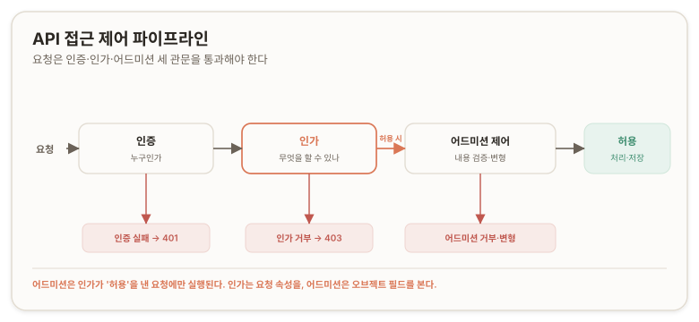
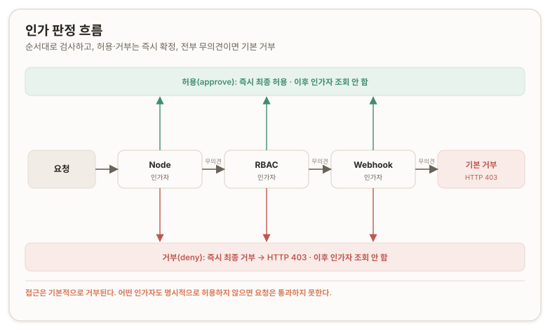
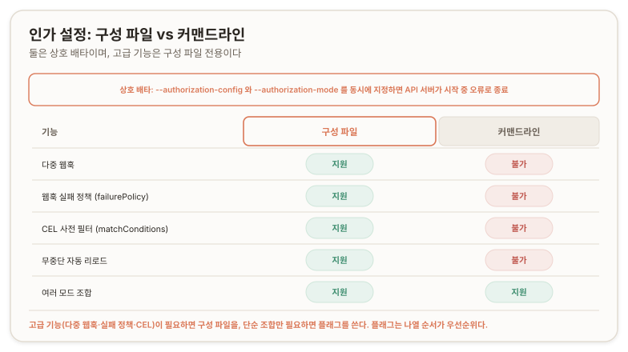
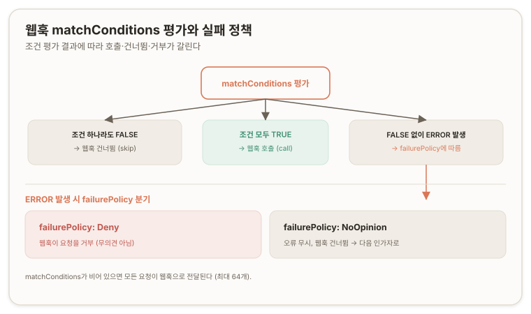

# 인가(Authorization) {#authorization}

> **원문:** [Authorization](https://kubernetes.io/docs/reference/access-authn-authz/authorization/) · The Kubernetes Authors · [CC BY 4.0](https://creativecommons.org/licenses/by/4.0/)
> 이 문서는 원문을 한국어로 옮기며 두괄식으로 재구성하고 역자 주를 더한 것이다. 원문 코드 샘플은 원문 저장소 기준 [Apache License 2.0](https://github.com/kubernetes/website/blob/main/LICENSE)이다.
> 원문 시점 2026-04-07 · 번역 2026-07-13

## 결론 {#conclusion}

쿠버네티스(Kubernetes) 인가(Authorization)는 인증(Authentication) 다음에 오는 단계로, 인증된 요청이 무엇을 할 수 있는지를 API 서버 안에서 결정한다. 작동 원리는 네 가지로 압축된다.

첫째, 기본 거부(deny by default). 요청의 모든 부분이 어떤 인가 메커니즘엔가 명시적으로 허용되어야 통과한다. 아무것도 허용하지 않으면 거부된다.

둘째, 순차 평가와 즉시 확정. 여러 인가 모듈(module)을 구성하면 순서대로 검사하고, 어느 하나가 허용(approve) 또는 거부(deny)를 내면 그 즉시 결정이 확정되어 나머지 모듈은 보지 않는다. 모든 모듈이 무의견(no opinion)이면 요청은 거부되고 API 서버는 HTTP 403(Forbidden)을 반환한다.

셋째, 요청 속성만 평가한다. 인가 판단은 사용자(user)·그룹(group)·동사(verb)·리소스(resource)·네임스페이스(namespace) 같은 요청 속성만 본다. 오브젝트의 특정 필드 값에 따른 통제는 인가 이후 단계인 어드미션 컨트롤러(admission controller)의 몫이다.

넷째, 모드(mode) 선택. RBAC·Node·Webhook·ABAC와 테스트용 AlwaysAllow·AlwaysDeny 중에서 고른다. v1.32부터 정식(stable)인 인가 구성 파일(AuthorizationConfiguration)을 쓰면 다중 웹훅(webhook), CEL 사전 필터(pre-filter), 실패 시 명시적 거부까지 세밀하게 제어할 수 있다.

인가는 인증 다음에 일어난다. 보통 요청을 보내는 클라이언트는 요청이 허용되기 전에 인증(로그인)을 거쳐야 하지만, 쿠버네티스는 일부 상황에서 익명(anonymous) 요청도 허용한다. 인가가 API 접근 제어 전반에서 어디에 위치하는지에 대한 개관은 [쿠버네티스 API 접근 제어](https://kubernetes.io/docs/concepts/security/controlling-access/)를 참고한다.

<figure>
  
  <figcaption>API 접근 제어 파이프라인. 요청은 인증·인가·어드미션 세 관문을 통과하며, 어드미션은 인가가 허용을 낸 요청에만 실행된다.</figcaption>
</figure>

## 인가 판정 {#authorization-verdicts}

쿠버네티스의 API 요청 인가는 API 서버 안에서 일어난다. API 서버는 요청의 모든 속성을 모든 정책(policy)과 대조해 평가하고, 필요하면 외부 서비스까지 조회한 뒤 요청을 허용하거나 거부한다.

요청이 진행되려면 API 요청의 모든 부분이 어떤 인가 메커니즘엔가 허용되어야 한다. 다시 말해, 접근은 기본적으로 거부된다.

> **참고**
> 특정 종류 오브젝트의 특정 필드에 의존하는 접근 제어와 정책은 [어드미션 컨트롤러(admission controller)](https://kubernetes.io/docs/reference/access-authn-authz/admission-controllers/)가 처리한다. 쿠버네티스 어드미션 제어는 인가가 끝난 뒤에(따라서 인가 결정이 허용이었을 때만) 일어난다.

여러 [인가 모듈](#authorization-modes)을 구성하면 각 모듈이 순서대로 검사된다. 어느 인가자(authorizer)가 요청을 *허용*하거나 *거부*하면 그 결정이 즉시 반환되고 다른 인가자는 조회되지 않는다. 모든 모듈이 요청에 대해 *무의견*이면 요청은 거부된다. 전체 결과가 거부이면 API 서버는 요청을 기각하고 HTTP 403(Forbidden) 상태로 응답한다.

<figure>
  
  <figcaption>인가 판정 흐름. 인가자를 순서대로 검사하며 허용·거부는 즉시 확정되고, 모든 인가자가 무의견이면 기본 거부로 HTTP 403이 반환된다.</figcaption>
</figure>

## 인가에 사용되는 요청 속성 {#request-attributes}

쿠버네티스는 다음 API 요청 속성만 검토한다.

- **user**: 인증 과정에서 제공된 `user` 문자열.
- **group**: 인증된 사용자가 속한 그룹 이름의 목록.
- **extra**: 인증 계층이 제공하는, 임의의 문자열 키를 문자열 값으로 매핑한 맵(map).
- **API**: 요청이 API 리소스에 대한 것인지 여부.
- **요청 경로(Request path)**: `/api`나 `/healthz` 같은 기타 비리소스(non-resource) 엔드포인트의 경로.
- **API 요청 동사(API request verb)**: `get`, `list`, `create`, `update`, `patch`, `watch`, `delete`, `deletecollection` 같은 API 동사. 리소스 요청에 쓰인다. 리소스 API 엔드포인트의 요청 동사를 판별하는 방법은 [요청 동사와 인가](#request-verbs)를 참고한다.
- **HTTP 요청 동사(HTTP request verb)**: `get`, `post`, `put`, `delete` 같은 소문자 HTTP 메서드. 비리소스 요청에 쓰인다.
- **리소스(Resource)**: 접근 대상 리소스의 ID 또는 이름(리소스 요청에 한함). `get`, `update`, `patch`, `delete` 동사를 쓰는 리소스 요청에는 리소스 이름을 제공해야 한다.
- **하위 리소스(Subresource)**: 접근 대상 하위 리소스(리소스 요청에 한함). `status`나 `scale` 같은 표준 하위 리소스일 수도, 세밀한 인가에 쓰는 합성(synthetic) 하위 리소스일 수도 있다.
- **네임스페이스(Namespace)**: 접근 대상 오브젝트의 네임스페이스(네임스페이스 범위 리소스 요청에 한함).
- **API 그룹(API group)**: 접근 대상 [API 그룹](https://kubernetes.io/docs/concepts/overview/kubernetes-api/#api-groups-and-versioning)(리소스 요청에 한함). 빈 문자열은 *코어(core)* [API 그룹](https://kubernetes.io/docs/reference/using-api/#api-groups)을 가리킨다.

### 요청 동사와 인가 {#request-verbs}

#### 비리소스 요청 {#non-resource-requests}

`/api/v1/...`이나 `/apis/<group>/<version>/...` 외의 엔드포인트로 가는 요청은 *비리소스 요청*으로 간주되며, 요청의 소문자 HTTP 메서드를 동사로 쓴다. 예를 들어 `/api`나 `/healthz` 같은 엔드포인트에 HTTP로 `GET` 요청을 보내면 **get**을 동사로 쓴다.

#### 리소스 요청 {#resource-requests}

리소스 API 엔드포인트의 요청 동사를 판별할 때, 쿠버네티스는 사용된 HTTP 동사를 매핑하고 요청이 개별 리소스에 작용하는지 리소스 컬렉션(collection)에 작용하는지를 함께 고려한다.

| HTTP 동사 | 요청 동사 |
| --- | --- |
| `POST` | **create** |
| `GET`, `HEAD` | **get**(개별 리소스), **list**(컬렉션, 전체 오브젝트 내용 포함), **watch**(개별 리소스 또는 리소스 컬렉션 감시) |
| `PUT` | **update** |
| `PATCH` | **patch** |
| `DELETE` | **delete**(개별 리소스), **deletecollection**(컬렉션) |

> **주의**
> **get**, **list**, **watch** 동사는 모두 리소스의 전체 상세를 반환할 수 있다. 반환되는 데이터에 대한 접근이라는 관점에서 이 셋은 동등하다. 예를 들어 `secrets`에 대한 **list**는 반환되는 모든 리소스의 **data** 속성을 드러낸다.

쿠버네티스는 특수 동사로 추가 권한의 인가를 검사하기도 한다. 예를 들면 다음과 같다.

- [인증](https://kubernetes.io/docs/reference/access-authn-authz/authentication/)의 특수 사례
  - 코어 API 그룹의 `users`, `groups`, `serviceaccounts`에 대한 **impersonate** 동사, 그리고 `authentication.k8s.io` API 그룹의 `userextras`.
- [CertificateSigningRequest의 인가](https://kubernetes.io/docs/reference/access-authn-authz/certificate-signing-requests/#authorization)
  - CertificateSigningRequest에 대한 **approve** 동사, 기존 승인의 개정(revision)에는 **update**.
- [RBAC](https://kubernetes.io/docs/reference/access-authn-authz/rbac/#privilege-escalation-prevention-and-bootstrapping)
  - `rbac.authorization.k8s.io` API 그룹의 `roles`, `clusterroles` 리소스에 대한 **bind**, **escalate** 동사.
- [동적 리소스 할당(DRA, Dynamic Resource Allocation)](https://kubernetes.io/docs/concepts/scheduling-eviction/dynamic-resource-allocation/)
  - `resource.k8s.io` API 그룹의 `resourceclaims/binding`, `resourceclaims/driver` 같은 합성 하위 리소스.
  - DRA 드라이버의 `resourceclaims/status` 갱신을 위한 `associated-node:update`, `associated-node:patch`, `arbitrary-node:update`, `arbitrary-node:patch` 같은 노드 인식(node-aware) 동사.

## 인가 컨텍스트 {#authorization-context}

쿠버네티스는 REST API 요청에 공통되는 속성을 기대한다. 즉 쿠버네티스 인가는 쿠버네티스 API 외의 다른 API도 다루는 기존의 조직 전반(organization-wide) 또는 클라우드 제공자 전반(cloud-provider-wide) 접근 제어 시스템과 함께 동작한다.

## 인가 모드 {#authorization-modes}

쿠버네티스 API 서버는 다음 여러 인가 모드 중 하나로 요청을 인가할 수 있다.

- **`AlwaysAllow`**: 모든 요청을 허용하며, [보안 위험](#always-allow-warning)을 수반한다. API 요청에 인가가 필요 없을 때만(예: 테스트) 이 모드를 쓴다.
- **`AlwaysDeny`**: 모든 요청을 차단한다. 테스트 용도로만 쓴다.
- **`ABAC`**([속성 기반 접근 제어](https://kubernetes.io/docs/reference/access-authn-authz/abac/), attribute-based access control): 속성을 조합한 정책을 통해 사용자에게 접근 권한을 부여하는 접근 제어 패러다임을 정의한다. 정책은 어떤 종류의 속성(사용자 속성, 리소스 속성, 오브젝트, 환경 속성 등)이든 쓸 수 있다.
- **`RBAC`**([역할 기반 접근 제어](https://kubernetes.io/docs/reference/access-authn-authz/rbac/), role-based access control): 기업 내 개별 사용자의 역할에 따라 컴퓨터나 네트워크 리소스에 대한 접근을 규제하는 방식이다. 여기서 접근이란 개별 사용자가 파일을 보거나 만들거나 수정하는 것 같은 특정 작업을 수행할 수 있는 능력을 말한다. 이 모드에서 쿠버네티스는 `rbac.authorization.k8s.io` API 그룹으로 인가 결정을 구동하며, 권한 정책을 쿠버네티스 API를 통해 동적으로 구성할 수 있게 한다.
- **`Node`**: kubelet에 그것이 실행하도록 스케줄된 파드(Pod)를 기준으로 권한을 부여하는 특수 목적 인가 모드다. 자세한 내용은 [Node 인가](https://kubernetes.io/docs/reference/access-authn-authz/node/)를 참고한다.
- **`Webhook`**: 쿠버네티스 [웹훅 모드](https://kubernetes.io/docs/reference/access-authn-authz/webhook/)의 인가는 동기(synchronous) HTTP 콜아웃(callout)을 수행하며, 원격 HTTP 서비스가 질의에 응답할 때까지 요청을 막는다. 콜아웃을 처리하는 소프트웨어를 직접 작성하거나 생태계의 솔루션을 쓸 수 있다.

> **경고** {#always-allow-warning}
> `AlwaysAllow` 모드를 켜면 인가가 우회된다. 실행하는 워크로드(workload)를 포함해 모든 잠재적 API 클라이언트를 신뢰하지 않는 클러스터에서는 쓰지 않는다.
>
> 인가 메커니즘은 보통 *거부* 또는 *무의견* 결과를 반환한다(자세한 내용은 [인가 판정](#authorization-verdicts) 참고). `AlwaysAllow`를 활성화한다는 것은 다른 모든 인가자가 "무의견"을 반환하면 요청이 허용된다는 뜻이다. 예를 들어 `--authorization-mode=AlwaysAllow,RBAC`는 `--authorization-mode=AlwaysAllow`와 같은 효과를 낸다. 쿠버네티스 RBAC는 부정(거부) 접근 규칙을 제공하지 않기 때문이다.
>
> API 서버가 공개 인터넷에서 접근 가능한 쿠버네티스 클러스터에서는 `AlwaysAllow` 모드를 쓰지 않아야 한다.

### system:masters 그룹 {#system-masters-group}

`system:masters` 그룹은 API 서버에 대한 무제한 접근을 부여하는 내장(built-in) 쿠버네티스 그룹이다. 이 그룹에 배정된 사용자는 RBAC나 웹훅 메커니즘이 부과하는 어떤 인가 제한도 우회하는 완전한 클러스터 관리자(cluster administrator) 권한을 갖는다. [이 그룹에 사용자를 추가하지 않는다](https://kubernetes.io/docs/concepts/security/rbac-good-practices/#least-privilege). 사용자에게 cluster-admin 권한을 부여해야 한다면, 내장 `cluster-admin` ClusterRole에 대한 [ClusterRoleBinding](https://kubernetes.io/docs/reference/access-authn-authz/rbac/#user-facing-roles)을 만들 수 있다.

### 인가 모드 구성 {#authorization-config-choice}

쿠버네티스 API 서버의 인가자 체인(chain)은 [구성 파일](#authorization-config-file)만으로 구성하거나 [커맨드라인 인자](#command-line-config)로 구성할 수 있다.

두 방식 중 하나를 골라야 한다. `--authorization-config` 경로를 지정하는 동시에 `--authorization-mode`와 `--authorization-webhook-*` 커맨드라인 인자로 인가 웹훅을 구성하는 것은 허용되지 않는다. 이렇게 시도하면 API 서버는 시작 중 오류 메시지를 보고하고 즉시 종료한다.

<figure>
  
  <figcaption>인가 설정 방식 비교. 구성 파일과 커맨드라인은 상호 배타이며, 다중 웹훅·실패 정책·CEL 사전 필터는 구성 파일 전용이다.</figcaption>
</figure>

### 인가 구성 파일 사용 {#authorization-config-file}

> **기능 상태(FEATURE STATE):** Kubernetes v1.32 [stable](기본 활성화)

쿠버네티스에서는 여러 웹훅을 포함할 수 있는 인가 체인을 구성할 수 있다. 그 체인의 인가 항목들은 특정 순서로 요청을 검증하는 잘 정의된 매개변수를 가질 수 있어, 실패 시 명시적 거부(explicit Deny) 같은 세밀한 제어를 제공한다.

구성 파일 방식은 요청이 웹훅으로 디스패치되기 전에 미리 걸러 내는 [CEL](https://kubernetes.io/docs/reference/using-api/cel/) 규칙까지 지정할 수 있어, 불필요한 호출을 막는 데 도움이 된다. 또한 API 서버는 구성 파일이 수정되면 인가자 체인을 자동으로 다시 로드한다.

인가 구성의 경로는 `--authorization-config` 커맨드라인 인자로 지정한다.

구성 파일 대신 커맨드라인 인자를 쓰고 싶다면 그것도 유효하고 지원되는 방식이다. 다만 일부 인가 기능(예: 다중 웹훅, 웹훅 실패 정책, 사전 필터 규칙)은 인가 구성 파일을 써야만 쓸 수 있다.

> **역자 주 · 검증**
> 원문의 기능 상태 표기는 정확하다. 인가 구성 파일 기능(StructuredAuthorizationConfiguration)은 v1.29에서 알파(alpha)로 도입되어 베타를 거쳐 [v1.32에서 GA(정식)로 승격](https://github.com/kubernetes/enhancements/issues/3221)되었고 기본 활성화 상태다([KEP-3221](https://github.com/kubernetes/enhancements/tree/master/keps/sig-auth/3221-structured-authorization-configuration)). 2026년 7월 기준 [쿠버네티스 안정 버전](https://kubernetes.io/releases/)은 v1.36이므로, 원문 본문의 `1.35 → 1.36` 업그레이드 예시도 현행 버전 기준이다.

#### 구성 예시 {#config-example}

```yaml
---
#
# DO NOT USE THE CONFIG AS IS. THIS IS AN EXAMPLE.
#
apiVersion: apiserver.config.k8s.io/v1
kind: AuthorizationConfiguration
authorizers:
  - type: Webhook
    # Name used to describe the authorizer
    # This is explicitly used in monitoring machinery for metrics
    # Note:
    #   - Validation for this field is similar to how K8s labels are validated today.
    # Required, with no default
    name: webhook
    webhook:
      # The duration to cache 'authorized' responses from the webhook
      # authorizer.
      # Same as setting `--authorization-webhook-cache-authorized-ttl` flag
      # Default: 5m0s
      authorizedTTL: 30s
      # If set to false, 'authorized' responses from the webhook are not cached
      # and the specified authorizedTTL is ignored/has no effect.
      # Same as setting `--authorization-webhook-cache-authorized-ttl` flag to `0`.
      # Note: Setting authorizedTTL to `0` results in its default value being used.
      # Default: true
      cacheAuthorizedRequests: true
      # The duration to cache 'unauthorized' responses from the webhook
      # authorizer.
      # Same as setting `--authorization-webhook-cache-unauthorized-ttl` flag
      # Default: 30s
      unauthorizedTTL: 30s
      # If set to false, 'unauthorized' responses from the webhook are not cached
      # and the specified unauthorizedTTL is ignored/has no effect.
      # Same as setting `--authorization-webhook-cache-unauthorized-ttl` flag to `0`.
      # Note: Setting unauthorizedTTL to `0` results in its default value being used.
      # Default: true
      cacheUnauthorizedRequests: true
      # Timeout for the webhook request
      # Maximum allowed is 30s.
      # Required, with no default.
      timeout: 3s
      # The API version of the authorization.k8s.io SubjectAccessReview to
      # send to and expect from the webhook.
      # Same as setting `--authorization-webhook-version` flag
      # Required, with no default
      # Valid values: v1beta1, v1
      subjectAccessReviewVersion: v1
      # MatchConditionSubjectAccessReviewVersion specifies the SubjectAccessReview
      # version the CEL expressions are evaluated against
      # Valid values: v1
      # Required, no default value
      matchConditionSubjectAccessReviewVersion: v1
      # Controls the authorization decision when a webhook request fails to
      # complete or returns a malformed response or errors evaluating
      # matchConditions.
      # Valid values:
      #   - NoOpinion: continue to subsequent authorizers to see if one of
      #     them allows the request
      #   - Deny: reject the request without consulting subsequent authorizers
      # Required, with no default.
      failurePolicy: Deny
      connectionInfo:
        # Controls how the webhook should communicate with the server.
        # Valid values:
        # - KubeConfigFile: use the file specified in kubeConfigFile to locate the
        #   server.
        # - InClusterConfig: use the in-cluster configuration to call the
        #   SubjectAccessReview API hosted by kube-apiserver. This mode is not
        #   allowed for kube-apiserver.
        type: KubeConfigFile
        # Path to KubeConfigFile for connection info
        # Required, if connectionInfo.Type is KubeConfigFile
        kubeConfigFile: /kube-system-authz-webhook.yaml
        # matchConditions is a list of conditions that must be met for a request to be sent to this
        # webhook. An empty list of matchConditions matches all requests.
        # There are a maximum of 64 match conditions allowed.
        #
        # The exact matching logic is (in order):
        #   1. If at least one matchCondition evaluates to FALSE, then the webhook is skipped.
        #   2. If ALL matchConditions evaluate to TRUE, then the webhook is called.
        #   3. If at least one matchCondition evaluates to an error (but none are FALSE):
        #      - If failurePolicy=Deny, then the webhook rejects the request
        #      - If failurePolicy=NoOpinion, then the error is ignored and the webhook is skipped
      matchConditions:
      # expression represents the expression which will be evaluated by CEL. Must evaluate to bool.
      # CEL expressions have access to the contents of the SubjectAccessReview in v1 version.
      # If version specified by subjectAccessReviewVersion in the request variable is v1beta1,
      # the contents would be converted to the v1 version before evaluating the CEL expression.
      #
      # Documentation on CEL: https://kubernetes.io/docs/reference/using-api/cel/
      #
      # only send resource requests to the webhook
      - expression: has(request.resourceAttributes)
      # only intercept requests to kube-system
      - expression: request.resourceAttributes.namespace == 'kube-system'
      # don't intercept requests from kube-system service accounts
      - expression: "!('system:serviceaccounts:kube-system' in request.groups)"
  - type: Node
    name: node
  - type: RBAC
    name: rbac
  - type: Webhook
    name: in-cluster-authorizer
    webhook:
      authorizedTTL: 5m
      unauthorizedTTL: 30s
      timeout: 3s
      subjectAccessReviewVersion: v1
      failurePolicy: NoOpinion
      connectionInfo:
        type: InClusterConfig
```

<figure>
  
  <figcaption>웹훅 matchConditions 평가와 failurePolicy 분기. 조건 평가 결과에 따라 웹훅 호출·건너뜀이 갈리고, 오류 시 failurePolicy가 거부와 무시를 가른다.</figcaption>
</figure>

인가자 체인을 구성 파일로 구성할 때는 모든 컨트롤 플레인(control plane) 노드의 파일 내용이 동일한지 확인한다. 클러스터를 업그레이드/다운그레이드할 때는 API 서버 구성을 유념한다. 예를 들어 쿠버네티스 1.35에서 1.36으로 업그레이드한다면, 클러스터를 업그레이드하기 전에 구성 파일이 1.36이 이해할 수 있는 형식인지 확인해야 한다. 1.35로 다운그레이드한다면 구성을 그에 맞게 설정해야 한다.

#### 인가 구성과 리로드 {#config-reload}

쿠버네티스는 API 서버가 파일 변경을 관측하면 인가 구성 파일을 다시 로드하고, 변경 이벤트가 관측되지 않아도 60초 주기로 다시 로드한다.

> **참고**
> 리로드 시 파일 안의 모든 비웹훅(non-webhook) 인가자 유형이 그대로 유지되도록 해야 한다. 리로드는 Node나 RBAC 인가자를 추가하거나 제거해서는 **안 된다**(순서 변경은 가능하지만 추가·제거는 불가).

### 커맨드라인 인가 모드 구성 {#command-line-config}

다음 모드를 쓸 수 있다.

- `--authorization-mode=ABAC`(속성 기반 접근 제어 모드)
- `--authorization-mode=RBAC`(역할 기반 접근 제어 모드)
- `--authorization-mode=Node`(Node 인가자)
- `--authorization-mode=Webhook`(웹훅 인가 모드)
- `--authorization-mode=AlwaysAllow`(항상 요청 허용, [보안 위험](#always-allow-warning) 수반)
- `--authorization-mode=AlwaysDeny`(항상 요청 거부)

둘 이상의 인가 모드를 고를 수 있다. 예: `--authorization-mode=Node,RBAC,Webhook`

쿠버네티스는 API 서버 커맨드라인에 지정한 순서를 기준으로 인가 모듈을 검사하므로, 앞선 모듈이 요청을 허용하거나 거부하는 우선순위가 더 높다.

`--authorization-mode` 커맨드라인 인자는 [로컬 파일로 인가를 구성](#authorization-config-file)하는 데 쓰는 `--authorization-config` 커맨드라인 인자와 함께 쓸 수 없다.

API 서버의 커맨드라인 인자에 대한 자세한 내용은 [`kube-apiserver` 레퍼런스](https://kubernetes.io/docs/reference/command-line-tools-reference/kube-apiserver/)를 참고한다.

## 워크로드 생성·수정을 통한 권한 상승 {#privilege-escalation}

어떤 네임스페이스에서 파드를 생성/수정할 수 있는 사용자는, 직접이든 간접 [워크로드 관리](https://kubernetes.io/docs/concepts/architecture/controller/)를 가능케 하는 오브젝트를 통해서든, 그 네임스페이스에서 자신의 권한을 상승시킬 수 있다. 권한 상승의 잠재적 경로에는 쿠버네티스 [API 확장(API extension)](https://kubernetes.io/docs/concepts/extend-kubernetes/#api-extensions)과 그에 연관된 [컨트롤러(controller)](https://kubernetes.io/docs/concepts/architecture/controller/)가 포함된다.

> **주의**
> 클러스터 관리자로서, 워크로드를 생성하거나 수정할 권한을 부여할 때는 주의한다. 이것이 악용될 수 있는 일부 방식은 [권한 상승 경로](#escalation-paths)에 문서화되어 있다.

### 권한 상승 경로 {#escalation-paths}

어떤 네임스페이스에서 임의의 파드를 실행하도록 허용하면, 공격자나 신뢰할 수 없는 사용자가 그 네임스페이스 안에서 추가 권한을 얻을 수 있는 여러 경로가 있다.

- 그 네임스페이스에서 임의의 Secret 마운트
  - 다른 워크로드용 기밀 정보에 접근하는 데 쓰일 수 있다.
  - 더 높은 권한을 가진 ServiceAccount의 서비스 어카운트 토큰(service account token)을 얻는 데 쓰일 수 있다.
- 그 네임스페이스에서 임의의 ServiceAccount 사용
  - 다른 워크로드로 가장(impersonation)해 쿠버네티스 API 작업을 수행할 수 있다.
  - 그 ServiceAccount가 가진 어떤 특권 작업이든 수행할 수 있다.
- 그 네임스페이스에서 다른 워크로드용 ConfigMap을 마운트하거나 사용
  - 데이터베이스 호스트 이름 같은 다른 워크로드용 정보를 얻는 데 쓰일 수 있다.
- 그 네임스페이스에서 다른 워크로드용 볼륨(volume) 마운트
  - 다른 워크로드용 정보를 얻고 변경하는 데 쓰일 수 있다.

> **주의**
> 시스템 관리자로서, 위 영역을 사용자가 변경할 수 있게 하는 CustomResourceDefinition을 배포할 때는 주의한다. 그런 것이 권한 상승 경로를 열 수 있다. 인가 통제를 정할 때 이런 종류의 변경이 어떤 결과를 낳을지 고려한다.

## API 접근 권한 확인 {#checking-access}

`kubectl`은 인가 계층을 빠르게 질의하는 `auth can-i` 하위 명령을 제공한다. 이 명령은 `SelfSubjectAccessReview` API를 써서 현재 사용자가 주어진 작업을 수행할 수 있는지 판별하며, 사용된 인가 모드와 무관하게 동작한다.

```bash
kubectl auth can-i create deployments --namespace dev
```

출력은 다음과 비슷하다.

```
yes
```

```shell
kubectl auth can-i create deployments --namespace prod
```

출력은 다음과 비슷하다.

```
no
```

관리자는 이를 [사용자 가장(user impersonation)](https://kubernetes.io/docs/reference/access-authn-authz/authentication/#user-impersonation)과 결합해 다른 사용자가 어떤 작업을 수행할 수 있는지 판별할 수 있다.

```bash
kubectl auth can-i list secrets --namespace dev --as dave
```

출력은 다음과 비슷하다.

```
no
```

비슷하게, `dev` 네임스페이스의 `dev-sa`라는 ServiceAccount가 `target` 네임스페이스에서 파드를 나열할 수 있는지 확인하려면 다음과 같이 한다.

```bash
kubectl auth can-i list pods \
    --namespace target \
    --as system:serviceaccount:dev:dev-sa
```

출력은 다음과 비슷하다.

```
yes
```

SelfSubjectAccessReview는 `authorization.k8s.io` API 그룹의 일부로, API 서버의 인가를 외부 서비스에 노출한다. 이 그룹의 다른 리소스로는 다음이 있다.

- **SubjectAccessReview**: 현재 사용자뿐 아니라 임의의 사용자에 대한 접근 검토. 인가 결정을 API 서버에 위임하는 데 유용하다. 예를 들어 kubelet과 확장 API 서버(extension API server)는 자신의 API에 대한 사용자 접근을 판별하는 데 이것을 쓴다.
- **LocalSubjectAccessReview**: SubjectAccessReview와 같지만 특정 네임스페이스로 제한된다.
- **SelfSubjectRulesReview**: 사용자가 어떤 네임스페이스 안에서 수행할 수 있는 작업의 집합을 반환하는 검토. 사용자가 자신의 접근 권한을 빠르게 요약하거나, UI가 작업을 숨기거나 보이게 하는 데 유용하다.

이 API들은 일반 쿠버네티스 리소스를 생성하는 방식으로 질의할 수 있으며, 반환된 오브젝트의 응답 `status` 필드가 질의 결과다. 예를 들면 다음과 같다.

```bash
kubectl create -f - -o yaml << EOF
apiVersion: authorization.k8s.io/v1
kind: SelfSubjectAccessReview
spec:
  resourceAttributes:
    group: apps
    resource: deployments
    verb: create
    namespace: dev
EOF
```

생성되는 SelfSubjectAccessReview는 다음과 비슷하다.

```yaml
apiVersion: authorization.k8s.io/v1
kind: SelfSubjectAccessReview
metadata:
  creationTimestamp: null
spec:
  resourceAttributes:
    group: apps
    resource: deployments
    namespace: dev
    verb: create
status:
  allowed: true
  denied: false
```

## 역자 주 · 적용 {#translator-notes-application}

이 문서의 개념을 실무에 적용할 때 일반적으로 성립하는 지침이다.

권한 설계를 확인하는 첫 도구는 `kubectl auth can-i`다. RBAC 롤(Role)이나 롤바인딩(RoleBinding)을 배포한 뒤, 의도한 사용자와 ServiceAccount 관점에서 `--as`로 가장해 허용/거부가 설계대로 나오는지 검증한다. 이 명령은 인가 모드와 무관하게 동작하므로 RBAC든 웹훅이든 동일하게 쓸 수 있다.

기본 거부 원칙 때문에 커맨드라인 모드에서는 순서가 곧 우선순위다. `--authorization-mode`에 나열한 순서대로 검사되고 먼저 결론을 낸 모듈이 이긴다. `AlwaysAllow`를 어느 위치에든 넣으면 나머지의 거부 규칙이 무력화되므로, 격리된 테스트 클러스터가 아니면 넣지 않는다. 특히 공개 인터넷에서 API 서버에 닿을 수 있는 환경에서는 금물이다.

인가 구성 파일을 쓰면 무중단 리로드가 되지만 제약이 있다. 리로드로 Node나 RBAC 인가자를 추가하거나 제거할 수 없고 순서 변경만 가능하다. 웹훅 항목만 자유롭게 바꿀 수 있다고 이해하면 된다. 다중 컨트롤 플레인에서는 모든 노드의 구성 파일이 동일해야 하며, 버전 업그레이드 전에 대상 버전이 이해하는 형식인지 먼저 확인한다.

권한 상승 경로는 대부분 "임의 파드 실행 권한"에서 출발한다. 특정 네임스페이스에서 파드 생성·수정 권한을 부여하는 것은 그 네임스페이스의 Secret·ServiceAccount·ConfigMap·볼륨에 대한 간접 접근을 함께 여는 것과 같다는 전제 아래 통제를 설계한다. 사용자가 이 영역을 건드릴 수 있게 하는 CustomResourceDefinition 배포도 같은 관점에서 검토한다.

<!-- REVIEW-REQUIRED: 아래 경험 슬롯을 실제 실습 결과로 채우거나 블록째 삭제할 것.
     채우지 않은 채 draft를 해제하지 않는다. -->
> **역자 주 · 적용(경험)**
> (직접 실습·검증한 결과가 있을 때만 1인칭으로 기록)

## 참고 출처 {#references}

원문이 링크한 출처:

- [인증(Authentication)](https://kubernetes.io/docs/reference/access-authn-authz/authentication/) · 쿠버네티스 공식 문서
- [쿠버네티스 API 접근 제어](https://kubernetes.io/docs/concepts/security/controlling-access/) · 쿠버네티스 공식 문서
- [어드미션 컨트롤러 사용](https://kubernetes.io/docs/reference/access-authn-authz/admission-controllers/) · 쿠버네티스 공식 문서
- [RBAC](https://kubernetes.io/docs/reference/access-authn-authz/rbac/) · 쿠버네티스 공식 문서
- [ABAC](https://kubernetes.io/docs/reference/access-authn-authz/abac/) · 쿠버네티스 공식 문서
- [Node 인가](https://kubernetes.io/docs/reference/access-authn-authz/node/) · 쿠버네티스 공식 문서
- [웹훅 모드](https://kubernetes.io/docs/reference/access-authn-authz/webhook/) · 쿠버네티스 공식 문서
- [동적 리소스 할당(DRA)](https://kubernetes.io/docs/concepts/scheduling-eviction/dynamic-resource-allocation/) · 쿠버네티스 공식 문서
- [쿠버네티스의 CEL(Common Expression Language)](https://kubernetes.io/docs/reference/using-api/cel/) · 쿠버네티스 공식 문서
- [`kube-apiserver` 레퍼런스](https://kubernetes.io/docs/reference/command-line-tools-reference/kube-apiserver/) · 쿠버네티스 공식 레퍼런스

역자 검증 출처:

- [KEP-3221 StructuredAuthorizationConfiguration](https://github.com/kubernetes/enhancements/issues/3221) · v1.29 알파 도입, v1.32 GA 승격 확인
- [Kubernetes Releases](https://kubernetes.io/releases/) · 2026-07 기준 안정 버전 v1.36 확인
