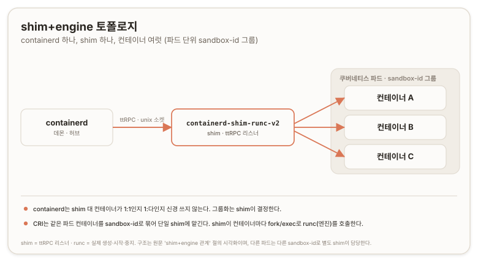
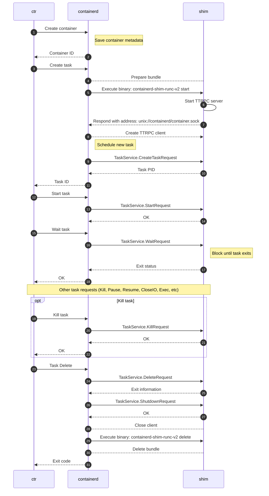

# Containerd Runtime v2 {#runtime-v2}

>> **원문:** [Runtime v2](https://containerd.io/docs/2.3/runtime-v2/) · The containerd Authors · [CC BY 4.0](https://creativecommons.org/licenses/by/4.0/)
>
> 이 문서는 원문을 한국어로 옮기며 두괄식으로 재구성하고 역자 주를 더한 것이다. containerd 저장소의 `docs` 폴더 문서는 [CC BY 4.0](https://creativecommons.org/licenses/by/4.0/)으로 배포되며, 본문에 담긴 코드 예시(proto·Go 등)는 [Apache License 2.0](https://github.com/containerd/containerd/blob/main/LICENSE) 코드베이스에서 유래한다. 변경 사항으로 결론 선행 재배치와 역자 주(검증·보충·적용)가 추가되었으며, 명령·API·proto·표는 원문에서 누락 없이 옮겼다.
>
>> 원문 시점 불명(containerd 2.3 릴리스 브랜치) · 번역 2026-07-09

## 결론 {#conclusion}

Runtime v2는 containerd와 통합하려는 런타임 작성자를 위한 1급(first-class) shim API다. containerd 데몬은 컨테이너를 직접 실행하지 않고, "런타임(runtime)"이라 불리는 하위 프로그램을 조율하는 상위 관리자로 동작한다. 런타임은 소켓(유닉스 계열에서는 유닉스 도메인 소켓, Windows에서는 네임드 파이프)을 열고 그 위에서 ttRPC로 컨테이너 명령을 받아 처리한다.

가장 흔한 구성은 shim+engine 분리다. containerd가 직접 호출하는 것은 shim(예: `containerd-shim-runc-v2`)이며, shim은 ttRPC 리스너를 띄우고 `fork`/`exec`로 실제 런타임 엔진(예: `runc`)을 불러 컨테이너를 생성·시작·중지한다. shim 하나가 여러 컨테이너를 담당할 수 있고, 쿠버네티스에서는 같은 파드의 컨테이너들이 `io.kubernetes.cri.sandbox-id` 레이블로 묶여 단일 shim이 처리한다.

이 문서는 세 부분으로 나뉜다. 컴포넌트와 관계를 다루는 아키텍처, 런타임을 호출·설정하는 방법을 다루는 사용, v2 런타임 shim을 작성하는 방법을 다루는 shim 작성이다. shim 작성부는 `start`·`delete` 서브명령, 부트스트랩 프로토콜, I/O·루트 파일시스템·이벤트 규약, 그리고 MUST/SHOULD 준수 요건을 명세한다.

---

Runtime v2는 런타임 작성자가 containerd와 통합할 수 있도록 1급 shim API를 도입한다.

containerd 데몬은 컨테이너를 직접 실행하지 않는다. 대신 컨테이너와 콘텐츠의 활동을 조율하는 상위 관리자 또는 허브(hub)로 동작하며, "런타임"이라 불리는 하위 프로그램이 실제로 컨테이너(개별 컨테이너 또는 컨테이너 그룹, 예: 쿠버네티스 파드)를 시작·중지·관리한다.

예를 들어 containerd는 컨테이너 이미지 설정과 그 콘텐츠를 레이어로 가져오고, 스냅샷터(snapshotter)로 디스크에 배치하고, 컨테이너의 rootfs와 설정을 구성한 뒤, 컨테이너를 생성/시작/중지할 런타임을 띄운다.

이 문서는 v2 런타임 통합 모델의 주요 컴포넌트, 이들이 containerd 및 v2 런타임과 상호작용하는 방식, 그리고 서로 다른 v2 런타임을 사용·통합하는 방법을 설명한다.

상호작용을 단순화하기 위해 Runtime v2는 런타임 작성자가 containerd와 통합할 1급 v2 API를 도입해 v1 API를 대체했다. v2 API는 최소한으로 설계되었고 컨테이너의 실행 수명주기(execution lifecycle)에 범위를 한정한다.

이 문서는 다음 절로 나뉜다.

- [아키텍처](#architecture): 주요 컴포넌트, 그 목적과 관계
- [사용](#usage): 특정 런타임을 호출하는 방법과 설정하는 방법
- [작성](#shim-authoring): v2 런타임을 작성하는 방법

## 아키텍처 {#architecture}

### containerd-런타임 통신 {#containerd-runtime-communication}

containerd는 런타임이 생성·시작·중지 같은 여러 컨테이너 제어 기능을 구현할 것으로 기대한다.

상위 수준 흐름은 다음과 같다.

1. 클라이언트가 containerd에 컨테이너 생성을 요청한다
2. containerd가 컨테이너의 파일시스템을 배치하고 필요한 설정 정보를 만든다
3. containerd가 API를 통해 런타임을 호출해 컨테이너를 생성/시작/중지한다

그러나 "containerd 자체가 컨테이너를 시작하기 위해" 런타임을 직접 호출하지는 않는다. 대신 런타임을 호출하면, 런타임은 소켓(유닉스 계열 시스템에서는 유닉스 도메인 소켓, Windows에서는 네임드 파이프)을 노출하고 그 소켓 위에서 [ttRPC](https://github.com/containerd/ttrpc)로 컨테이너 명령을 수신 대기한다.

> **역자 주 · 보충**
> ttRPC는 gRPC에서 HTTP 스택을 걷어내 메모리와 바이너리 크기를 줄인 경량 RPC 프로토콜이다. 표준 protobuf와 GRPC 서비스를 그대로 쓰되 와이어 프로토콜만 다르다. shim을 작게 유지하려는 설계 선택이며, 자세한 내용은 하단 [ttrpc](#ttrpc) 절에 있다.

런타임은 그 연산들을 처리할 것으로 기대된다. 어떻게 처리하는지는 전적으로 런타임 구현의 범위 안에 있다. 흔한 두 가지 패턴은 다음과 같다.

- 소켓을 수신 대기하면서 컨테이너를 생성/시작/중지하는 단일 바이너리 런타임
- 소켓을 수신 대기하는 별도 shim 바이너리와, 컨테이너를 생성/시작/중지하는 별도 런타임 엔진을 호출하는 구성

별도의 "shim+engine" 패턴을 쓰는 이유는, [OCI 런타임 명세(OCI runtime spec)](https://github.com/opencontainers/runtime-spec) 같은 특정 런타임 엔진 명세를 구현하는 서로 다른 런타임을 통합하기 쉬워지기 때문이다. ttRPC 프로토콜은 하나의 런타임 shim으로 처리하면서, OCI 런타임 명세를 구현하기만 하면 서로 다른 런타임 엔진 구현을 쓸 수 있다.

가장 흔히 쓰이는 런타임 *엔진*은 [runc](https://github.com/opencontainers/runc)이며, [OCI 런타임 명세](https://github.com/opencontainers/runtime-spec)를 구현한다. 이것은 런타임 *엔진*이므로 containerd가 직접 호출하지 않고, 소켓을 수신 대기하며 런타임 엔진을 호출하는 shim이 호출한다.

#### shim+engine 아키텍처 {#shim-engine-architecture}

##### 런타임 shim {#runtime-shim}

런타임 shim은 실제로 containerd가 호출하는 대상이다. 시작 시 옵션은 containerd와의 통신 포트와 일부 설정 정보를 제공받는 것 외에는 최소한이다.

런타임 shim은 소켓에서 containerd의 ttRPC 명령을 수신 대기하다가, `fork`/`exec`로 별도 프로그램인 런타임 엔진을 호출해 컨테이너를 실행한다. 예를 들어 `io.containerd.runc.v2` shim은 `runc` 같은 OCI 호환 런타임 엔진을 호출한다.

containerd는 ttRPC 연결로 shim에 옵션을 전달하며, 여기에는 호출할 런타임 엔진 바이너리가 포함될 수 있다. 이것이 [`CreateTaskRequest`](#container-level-shim-configuration)의 `options`다.

예를 들어 `io.containerd.runc.v2` shim은 런타임 엔진 바이너리 경로를 포함하는 것을 지원한다.

##### 런타임 엔진 {#runtime-engine}

런타임 엔진 자체가 실제로 컨테이너를 시작하고 중지한다.

예를 들어 [runc](https://github.com/opencontainers/runc)의 경우, containerd 프로젝트는 shim을 실행 파일 `containerd-shim-runc-v2`로 제공한다. 이것을 containerd가 호출하면 ttRPC 리스너가 시작된다.

그다음 shim은 실제 `runc` 바이너리를 호출하며 컨테이너 설정을 넘기고, `runc` 바이너리는 보통 `libcontainer`→시스템 API를 통해 컨테이너를 생성/시작/중지한다.

#### shim+engine 관계 {#shim-engine-relationship}

각 shim 인스턴스는 데몬인 containerd와 통신하는 한편 독립적인 런타임을 호출해 컨테이너를 부모로서 거느리므로, 하나의 shim이 여러 컨테이너와 호출을 담당할 수 있다. 예를 들어 하나의 `containerd-shim-runc-v2`가 하나의 containerd와 통신하면서 서로 다른 열 개의 컨테이너를 호출할 수 있다.

앞서 설명했듯 런타임 바이너리가 `CreateTaskRequest`의 옵션 중 하나로 전달되므로, 하나의 shim이 각자 자신의 실제 런타임을 가진 여러 컨테이너를 담당하는 것도 가능하다.

containerd는 shim 대 컨테이너 관계가 1:1인지 1:다(多)인지 알지도, 신경 쓰지도 않는다. 전적으로 shim이 결정할 몫이다. 예를 들어 `io.containerd.runc.v2` shim은 [레이블(label)](https://github.com/containerd/containerd/blob/b30e0163ac36c1a193604e5eca031053d62019c5/runtime/v2/runc/manager/manager_linux.go#L54-L60)의 존재를 기준으로 자동으로 그룹화한다. 실무에서 이는, 쿠버네티스가 실행한 컨테이너들 중 같은 쿠버네티스 파드에 속한 것들이 CRI 플러그인이 설정한 `io.kubernetes.cri.sandbox-id` 레이블로 그룹화되어 단일 shim이 처리한다는 뜻이다.



*이 그림은 원문의 shim+engine 관계 서술을 구조 관점에서 시각화한 것이다(논리적 추론에 따른 배치). 아래 [흐름](#flow)의 mermaid 시퀀스가 시간축을, 이 그림이 공간 구조를 담는다.*

그러면 흐름은 다음과 같다.

1. containerd가 컨테이너 생성 요청을 받는다
2. containerd가 컨테이너의 파일시스템을 배치하고 필요한 [컨테이너 설정(container config)](https://github.com/opencontainers/image-spec/blob/main/config.md) 정보를 만든다
3. containerd가 컨테이너 설정을 포함해 shim을 호출하고, shim은 그 정보를 바탕으로 새 소켓 리스너를 띄울지(1:1 shim 대 컨테이너) 기존 것을 쓸지(1:다) 결정한다
   - 기존 것이면, 기존 소켓의 주소를 반환하고 종료한다
   - 새 것이면, shim은 다음을 한다:
     1. containerd의 ttRPC 명령을 수신 대기할 새 프로세스를 만든다
     2. 그 소켓의 주소를 containerd에 반환한다
     3. 종료한다
4. containerd가 shim에 컨테이너 시작 명령을 보낸다
5. shim이 `runc`를 호출해 컨테이너를 생성/시작/중지한다

훌륭한 흐름 다이어그램이 이 문서 뒤쪽 [흐름](#flow) 절에 있다.

## 사용 {#usage}

### 런타임 호출 {#invoking-runtimes}

런타임(단일 인스턴스 또는 shim+engine)과 그 옵션은, 노출된 containerd 서비스(containerd 클라이언트, CRI API 등) 중 하나를 통해 컨테이너를 생성할 때 선택하거나, containerd가 제공하는 서비스를 호출하는 클라이언트를 통해 선택할 수 있다. containerd 클라이언트의 예로는 `ctr`, `nerdctl`, 쿠버네티스, docker/moby, rancher 등이 있다.

런타임은 컨테이너 업데이트로도 바꿀 수 있다.

전달되는 런타임 이름은 런타임을 containerd에 식별시키는 문자열이다. 별도 shim+engine의 경우 이것은 런타임 *shim*이 된다. 어느 쪽이든 이것은 containerd가 실행하고 ttRPC 리스너를 시작할 것으로 기대하는 바이너리다. 런타임 이름은 URI 유사(URI-like) 문자열이거나, containerd 1.6.0부터는 실행 파일의 실제 경로일 수 있다.

1. 런타임 이름이 경로이면, 그것을 호출할 런타임의 실제 경로로 사용한다.
2. 런타임 이름이 URI 유사이면, 아래 로직으로 런타임 이름으로 변환한다.

런타임 이름이 URI 유사이면, containerd는 다음 로직으로 전달된 런타임을 URI 유사 이름에서 바이너리 이름으로 변환한다.

1. 모든 `.`을 `-`로 치환한다
2. 마지막 두 요소를 취한다(예: `runc.v2`)
3. `containerd-shim`을 앞에 붙인다

예를 들어 런타임 이름이 `io.containerd.runc.v2`이면, containerd는 shim을 `containerd-shim-runc-v2`로 호출한다. 이 바이너리를 통상의 `PATH`에서 찾을 것으로 기대한다.

`containerd-shim-*` 접두 덕분에 사용자는 `ps aux | grep containerd-shim`으로 시스템에서 실행 중인 shim을 볼 수 있다.

예를 들어:

```bash
$ ctr --runtime io.containerd.runc.v2 run --rm docker.io/library/alpine:latest alpine
```

이는 `containerd-shim-runc-v2`를 호출한다.

다른 이름을 시도해 이를 테스트해 볼 수 있다.

```bash
$ ctr run --runtime=io.foo.bar.runc2.v2.baz --rm docker.io/library/hello-world:latest hello-world /hello
ctr: failed to start shim: failed to resolve runtime path: runtime "io.foo.bar.runc2.v2.baz" binary not installed "containerd-shim-v2-baz": file does not exist: unknown
```

`io.foo.bar.runc2.v2.baz`를 받아 `containerd-shim-v2-baz`를 찾은 것이다.

또한 shim에 `--runc-binary` 옵션을 넘겨 기본 설정된 런타임을 재정의할 수 있다. 예를 들어:

```
ctr --runtime io.containerd.runc.v2 --runc-binary /usr/local/bin/runc-custom run --rm docker.io/library/alpine:latest alpine
```

### 런타임 설정 {#configuring-runtimes}

containerd의 `config.toml` 설정 파일에서 다음 섹션을 수정해 하나 이상의 런타임을 설정할 수 있다.

```toml
[plugins."io.containerd.grpc.v1.cri".containerd.runtimes]
```

자세한 내용과 예시는 [config.toml man 페이지](https://containerd.io/docs/2.3/runtime-v2/man/containerd-config.toml.5)를 참조한다.

설정 파일의 이 "이름 붙은 런타임(named runtimes)"은 [`runtime_handler` 필드](https://github.com/kubernetes/cri-api/blob/de5f1318aede866435308f39cb432618a15f104e/pkg/apis/runtime/v1/api.proto#L476)를 가진 CRI를 통해 호출될 때에만 사용된다.

## shim 작성 {#shim-authoring}

이 절은 shim을 만들려는 런타임 작성자를 위한 것이다. API가 어떻게 동작하는지, shim을 만들 때의 여러 고려 사항을 상세히 다룬다.

### 명령 {#commands}

컨테이너 정보는 두 가지 방식으로 shim에 제공된다. OCI 런타임 번들(OCI Runtime Bundle)과 `Create` rpc 요청이다.

#### `start` {#start}

각 shim은 `start` 서브명령을 반드시(MUST) 구현해야 한다. 이 명령은 새 shim을 실행한다. `start` 명령을 포함해 shim에 대한 모든 바이너리 호출은 컨테이너의 번들을 `cwd`로 설정한 상태로 이뤄진다.

##### 부트스트랩 프로토콜 (2.3+) {#bootstrap-protocol}

containerd 2.3부터, `start` 명령은 stdin으로 전달되는 단일 protobuf 직렬화 [`BootstrapParams`](https://containerd.io/docs/2.3/api/runtime/bootstrap/v1/bootstrap.proto) 메시지로 모든 설정을 받는다. 이는 이전의 흩어진 메커니즘(CLI 플래그, 환경 변수, stdin protobuf 옵션)을 단일하고 버전이 매겨진 확장 가능한 프로토콜로 대체한다.

shim은 stdin에서 `BootstrapParams` 메시지를 읽고 stdout에 `BootstrapResult` 메시지를 반드시(MUST) 써야 한다. 두 메시지는 모두 [`bootstrap.proto`](https://containerd.io/docs/2.3/api/runtime/bootstrap/v1/bootstrap.proto)에 정의되어 있으며 protobuf 바이너리 인코딩으로 직렬화된다.

`BootstrapParams`는 shim이 초기화에 필요한 모든 정보를 담는다. 컨테이너/샌드박스 ID, 네임스페이스, 로그 레벨, containerd 버전과 API 주소 등이다.

containerd는 `extensions` 필드(즉 `google.protobuf.Any` 메시지의 목록)를 통해 shim 고유의 추가 설정을 전달할 수 있다. 덕분에 코어 프로토콜을 바꾸지 않고도 새 설정 타입(예: 런타임 옵션, CRI 설정, 샌드박스 설정)을 도입할 수 있다.

`BootstrapResult`는 shim의 수신 주소와 프로토콜(`ttrpc` 또는 `grpc`), 그리고 선택적 `capabilities` 필드를 담는다. `capabilities` 필드는 containerd와 shim이 지원 동작을 협상할 수 있도록 미래 사용을 위해 예약되어 있다. 예를 들어 containerd가 shim이 광고하는 capability에 따라 상호작용을 조정할 수 있다.

`pkg/shim` 패키지가 부트스트랩 프로토콜을 자동으로 처리한다. 새 프로토콜을 먼저 시도하고, 마이그레이션을 쉽게 하기 위해 (아래에 설명된) 레거시 메커니즘으로 폴백한다. containerd 2.3은 하위 호환을 위해 새 프로토콜과 함께 레거시 CLI 플래그와 환경 변수를 여전히 제공하지만, 레거시 메커니즘은 deprecated이며 향후 릴리스에서 제거될 예정이다.

> **역자 주 · 검증**
> 원문은 containerd 2.3 릴리스 브랜치 기준이다. 번역 시점(2026-07-09) 확인 결과 containerd 2.3.0은 2026-04-30에 릴리스된 첫 연간 LTS(Long Term Stable)이며 최신 패치는 v2.3.2(2026-06-18)다. 따라서 "2.3+" 부트스트랩 프로토콜과 "2.2 이하" 레거시 구분은 현재 유효한 버전 경계이고, 레거시 메커니즘은 2.3 시점에 아직 제거되지 않은 deprecated 상태다. 2.3부터 containerd는 쿠버네티스 일정에 맞춘 약 4개월 주기 릴리스로 전환했다. 출처: [containerd 2.3.0 릴리스 노트](https://github.com/containerd/containerd/releases/tag/v2.3.0), [containerd Releases](https://containerd.io/releases/).

##### 레거시 프로토콜 (2.2 이하) {#legacy-protocol}

containerd 2.2 이하 버전에서 `start` 명령은 CLI 플래그, 환경 변수, 그리고 stdin으로 전달되는 protobuf 직렬화 런타임 옵션으로 설정을 받는다.

`start` 명령은 다음 플래그를 반드시(MUST) 받아들여야 한다.

- `-namespace` 컨테이너의 네임스페이스
- `-address` containerd 메인 grpc 소켓의 주소
- `-publish-binary` containerd로 이벤트를 되돌려 발행하는 바이너리 경로
- `-id` 컨테이너의 id

`start` 명령에는 다음 containerd 고유 환경 변수가 설정되어 있을 수 있다.

- `TTRPC_ADDRESS` containerd ttrpc API 소켓의 주소
- `GRPC_ADDRESS` containerd grpc API 소켓의 주소 (1.7+)
- `MAX_SHIM_VERSION` 클라이언트가 지원하는 최대 shim 버전, shim v2에서는 항상 `2` (1.7+)
- `SCHED_CORE` 가능하면 코어 스케줄링 활성화 (1.6+)
- `NAMESPACE` shim이 동작 중이거나 상속하는 선택적 네임스페이스 (1.7+)

`start` 명령은 shim이 API를 서빙하는 ttrpc 주소를, 또는 다음 형식의 JSON 구조(protocol은 "ttrpc" 또는 "grpc")를 stdout에 반드시(MUST) 써야 한다.

```json
{
	"version": 2,
	"address": "/address/of/task/service",
	"protocol": "grpc"
}
```

이 주소는 containerd가 컨테이너 연산에 대한 API 요청을 보내는 데 사용된다.

`start` 명령은 shim의 로직에 따라 새 shim을 시작하거나 기존 shim의 주소를 반환할 수 있다.

#### `delete` {#delete}

각 shim은 `delete` 서브명령을 반드시(MUST) 구현해야 한다. 이 명령은 containerd가 더 이상 rpc로 통신할 수 없을 때, shim이 생성·마운트·실행한 컨테이너 리소스를 containerd가 삭제할 수 있게 한다. 이는 실행 중인 컨테이너를 가진 shim이 SIGKILL됐을 때 발생한다. containerd가 shim과의 연결을 잃으면 이 리소스들을 정리해야 한다. 이 명령은 containerd가 부팅해 shim에 다시 연결할 때에도 쓰인다. 번들이 디스크에 여전히 있으나 containerd가 shim에 연결할 수 없으면 `delete` 명령이 호출된다.

`delete` 명령은 다음 플래그를 반드시(MUST) 받아들여야 한다.

- `-namespace` 컨테이너의 네임스페이스
- `-address` containerd 메인 소켓의 주소
- `-publish-binary` containerd로 이벤트를 되돌려 발행하는 바이너리 경로
- `-id` 컨테이너의 id
- `-bundle` 삭제할 번들의 경로. non-Windows·non-FreeBSD 플랫폼에서는 `cwd`와 일치한다

`delete` 명령은 Windows와 FreeBSD 플랫폼을 제외하고 컨테이너의 번들을 `cwd`로 하여 실행된다.

### 명령형 플래그 {#command-like-flags}

#### `-v` {#flag-v}

각 shim은 `-v` 플래그를 구현하는 것이 좋다(SHOULD). 이 명령형 플래그는 shim 구현 버전을 출력하고 종료한다. 출력은 기계 파싱용이 아니다.

#### `-info` {#flag-info}

각 shim은 `-info` 플래그를 구현하는 것이 좋다(SHOULD). 이 명령형 플래그는 stdin에서 옵션 protobuf를 받아, shim 정보 protobuf(아래 참조)를 stdout에 출력하고 종료한다.

```proto
message RuntimeInfo {
       string name = 1;
       RuntimeVersion version = 2;
       // Options from stdin
       google.protobuf.Any options = 3;
       // OCI-compatible runtimes should use https://github.com/opencontainers/runtime-spec/blob/main/features.md
       google.protobuf.Any features = 4;
       // Annotations of the shim. Irrelevant to features.Annotations.
       map<string, string> annotations = 5;
}
```

### 호스트 수준 shim 설정 {#host-level-shim-configuration}

containerd는 API를 통한 어떤 호스트 수준 shim 설정도 제공하지 않는다. shim이 모든 인스턴스에 걸친 호스트 수준 정보를 사용자로부터 받아야 한다면, shim 고유의 설정 파일을 마련할 수 있다.

### 컨테이너 수준 shim 설정 {#container-level-shim-configuration}

생성 요청에는, 사용자가 shim에 대한 컨테이너 수준 설정을 지정할 수 있게 하는 범용 `*protobuf.Any`가 있다.

```proto
message CreateTaskRequest {
	string id = 1;
	...
	google.protobuf.Any options = 10;
}
```

shim 작성자는 설정을 위한 자신만의 protobuf 메시지를 만들 수 있고, 클라이언트는 필요하면 이를 임포트해 제공할 수 있다.

### I/O {#io}

컨테이너의 I/O는 클라이언트가 shim에 fifo(Linux), 네임드 파이프(Windows), 또는 디스크의 로그 파일을 통해 제공한다. 이 파일들의 경로는 최초 생성 시 `Create` rpc로, 추가 프로세스는 `Exec` rpc로 제공된다.

```proto
message CreateTaskRequest {
	string id = 1;
	bool terminal = 4;
	string stdin = 5;
	string stdout = 6;
	string stderr = 7;
}
```

```proto
message ExecProcessRequest {
	string id = 1;
	string exec_id = 2;
	bool terminal = 3;
	string stdin = 4;
	string stdout = 5;
	string stderr = 6;
}
```

대화형 터미널로 실행할 컨테이너는 `terminal` 필드가 `true`로 설정되며, 데이터는 비대화형 컨테이너와 같은 방식으로 파일(fifo, 파이프)을 통해 복사된다.

### 루트 파일시스템 {#root-filesystems}

컨테이너의 루트 파일시스템은 `Create` rpc로 제공된다. shim은 컨테이너 수명주기 동안 파일시스템 마운트의 수명주기를 관리할 책임이 있다.

```proto
message CreateTaskRequest {
	string id = 1;
	string bundle = 2;
	repeated containerd.types.Mount rootfs = 3;
	...
}
```

mount protobuf 메시지는 다음과 같다.

```proto
message Mount {
	// Type defines the nature of the mount.
	string type = 1;
	// Source specifies the name of the mount. Depending on mount type, this
	// may be a volume name or a host path, or even ignored.
	string source = 2;
	// Target path in container
	string target = 3;
	// Options specifies zero or more fstab style mount options.
	repeated string options = 4;
}
```

shim은 파일시스템을 번들의 `rootfs/` 디렉터리에 마운트할 책임이 있다. shim은 파일시스템 언마운트에도 책임이 있다. `delete` 바이너리 호출 동안 shim은 파일시스템이 언마운트되도록 반드시(MUST) 보장해야 한다. 파일시스템은 containerd 스냅샷터가 제공한다.

### 이벤트 {#events}

Runtime v2는 비동기 이벤트 모델을 지원한다. 상위 호출자(예: Docker)가 이 이벤트들을 올바른 순서로 받으려면, Runtime v2 shim은 `Compliance=MUST`인 다음 이벤트들을 반드시 구현해야 한다. 이는 shim과 shim 클라이언트 사이의 경쟁 조건(race condition)을 피하기 위한 것으로, 예컨대 `Start` 호출이 그 결과를 반환하기도 전에 `TaskExitEventTopic`을 신호할 수 있는 상황을 막는다. Runtime v2 shim의 이 보장 덕분에, `Start` 호출은 shim이 `TaskExitEventTopic`을 발행하기 전에 비동기 이벤트 `TaskStartEventTopic`을 먼저 발행하도록 요구된다.

#### 태스크 {#tasks}

| Topic | Compliance | 설명 |
| --- | --- | --- |
| `runtime.TaskCreateEventTopic` | MUST | 태스크가 성공적으로 생성됐을 때 |
| `runtime.TaskStartEventTopic` | MUST (`TaskCreateEventTopic` 뒤) | 태스크가 성공적으로 시작됐을 때 |
| `runtime.TaskExitEventTopic` | MUST (`TaskStartEventTopic` 뒤) | 태스크가 예상대로 또는 예상치 못하게 종료됐을 때 |
| `runtime.TaskDeleteEventTopic` | MUST (`TaskExitEventTopic` 뒤, 시작된 적 없으면 `TaskCreateEventTopic` 뒤) | 태스크가 shim에서 제거됐을 때 |
| `runtime.TaskPausedEventTopic` | SHOULD | 태스크가 성공적으로 일시정지됐을 때 |
| `runtime.TaskResumedEventTopic` | SHOULD (`TaskPausedEventTopic` 뒤) | 태스크가 성공적으로 재개됐을 때 |
| `runtime.TaskCheckpointedEventTopic` | SHOULD | 태스크가 체크포인트됐을 때 |
| `runtime.TaskOOMEventTopic` | SHOULD | shim이 OOM(Out of Memory) 이벤트를 수집하는 경우 |

#### Exec {#execs}

| Topic | Compliance | 설명 |
| --- | --- | --- |
| `runtime.TaskExecAddedEventTopic` | MUST (`TaskCreateEventTopic` 뒤) | exec가 성공적으로 추가됐을 때 |
| `runtime.TaskExecStartedEventTopic` | MUST (`TaskExecAddedEventTopic` 뒤) | exec가 성공적으로 시작됐을 때 |
| `runtime.TaskExitEventTopic` | MUST (`TaskExecStartedEventTopic` 뒤) | (init exec가 아닌) exec가 예상대로 또는 예상치 못하게 종료됐을 때 |
| `runtime.TaskDeleteEventTopic` | SHOULD (`TaskExitEventTopic` 뒤, 시작된 적 없으면 `TaskExecAddedEventTopic` 뒤) | exec가 shim에서 제거됐을 때 |

### 흐름 {#flow}

다음 시퀀스 다이어그램은 `ctr run` 명령이 실행될 때의 동작 흐름을 보여준다.



#### 로깅 {#logging}

shim은 STDIO URI를 통한 플러그형(pluggable) 로깅을 지원할 수 있다. 현재 지원되는 로깅 스킴은 다음과 같다.

- fifo: Linux
- binary: Linux & Windows
- binary-v2 (containerd v2.2부터): Linux & Windows
- file: Linux & Windows
- npipe: Windows

바이너리 로깅은 컨테이너의 STDIO를 외부 바이너리로 전달해 소비하게 할 수 있다. 레거시 `binary://` 스킴은 하위 호환을 위해 `CONTAINER_WAIT`의 EOF를 준비 완료로 취급한다. `binary-v2://` 스킴은 로깅 바이너리가 `CONTAINER_WAIT`에 바이트 하나를 쓴 뒤 닫을 것을 요구한다. Runtime v2 플러그인은 지원하는 로그 URI 스킴을 플러그인 메타데이터 익스포트의 `log-uri-schemes` 키 아래에 쉼표로 구분된 목록으로 노출한다. 컨테이너의 STDOUT과 STDERR을 `journald`로 전달하는 샘플 로깅 드라이버는 다음과 같다.

```go
package main

import (
	"bufio"
	"context"
	"fmt"
	"io"
	"sync"

	"github.com/containerd/containerd/v2/core/runtime/v2/logging"
	"github.com/coreos/go-systemd/journal"
)

func main() {
	logging.Run(log)
}

func log(ctx context.Context, config *logging.Config, ready func() error) error {
	// construct any log metadata for the container
	vars := map[string]string{
		"SYSLOG_IDENTIFIER": fmt.Sprintf("%s:%s", config.Namespace, config.ID),
	}
	var wg sync.WaitGroup
	wg.Add(2)
	// forward both stdout and stderr to the journal
	go copy(&wg, config.Stdout, journal.PriInfo, vars)
	go copy(&wg, config.Stderr, journal.PriErr, vars)

	// signal that we are ready and setup for the container to be started
	if err := ready(); err != nil {
		return err
	}
	wg.Wait()
	return nil
}

func copy(wg *sync.WaitGroup, r io.Reader, pri journal.Priority, vars map[string]string) {
	defer wg.Done()
	s := bufio.NewScanner(r)
	for s.Scan() {
		journal.Send(s.Text(), pri, vars)
	}
}
```

### 기타 {#other}

#### 미지원 rpc {#unsupported-rpcs}

shim이 어떤 rpc 호출을 구현하지 않거나 구현할 수 없다면, `github.com/containerd/containerd/errdefs.ErrNotImplemented` 오류를 반드시(MUST) 반환해야 한다.

#### 디버깅과 shim 로그 {#debugging-and-shim-logs}

유닉스에서는 fifo, Windows에서는 네임드 파이프가 shim에 제공된다. 이것은 shim의 `cwd` 안에서 "log"라는 이름으로 찾을 수 있다. shim은 기존 `github.com/containerd/log` 패키지를 써서 디버그 메시지를 로깅할 수 있다. 메시지는 올바른 필드와 런타임이 설정된 채 containerd 데몬 로그에 자동으로 출력된다.

#### ttrpc {#ttrpc}

[ttrpc](https://github.com/containerd/ttrpc)는 shim이 지원하는 프로토콜 중 하나다. 표준 protobuf 및 GRPC 서비스와 함께 동작하며 클라이언트도 생성한다. grpc와 ttrpc의 유일한 차이는 와이어 프로토콜이다. ttrpc는 메모리와 바이너리 크기를 절약해 shim을 작게 유지하기 위해 http 스택을 제거한다. shim에서는 ttrpc 사용을 권장하지만, grpc 지원은 현재 실험적(experimental) 기능이다.

#### 서브 리퍼(sub-reaper)로서의 containerd-shim-runc-v2 {#sub-reaper}

shim 프로세스는 종료된 컨테이너나 `setns(2)` 프로세스를 정리하는 서브 리퍼(sub-reaper) 책임을 진다. 컨테이너가 새 PID 네임스페이스에서 실행 중이면, 컨테이너는 종료 전에 고아(orphaned) 프로세스를 정리해야 한다. 컨테이너가 shim 프로세스와 같은 PID 네임스페이스를 쓰면, 그 후손(descendant) 프로세스들은 shim 프로세스로 재부모화(reparent)되고 shim 프로세스가 이들이 종료될 때 거둔다(reap). 그러나 [\[PATCH\] exit: fix the setns() && PR_SET_CHILD_SUBREAPER interaction](https://lore.kernel.org/all/20170130181735.GA11285@redhat.com/#r)은 커널에서 네임스페이스 간 재부모화를 막는다. 컨테이너가 X 네임스페이스에 있고, 루트 네임스페이스의 P가 X 네임스페이스로 `setns`한다고 하자. P가 자식 C를 fork한다. 자식 C가 손자 G를 fork하고 종료한다. G는 P의 리퍼가 아니라 X로 재부모화된다. PID 네임스페이스가 shim 프로세스와 다르면, 컨테이너 init 프로세스가 setns 프로세스(exec 연산)가 만든 고아 재부모화 프로세스를 정리해야 한다.

## 역자 주 · 적용 {#translator-notes-application}

원문 정보에서 도출되는, 일반 독자 누구에게나 성립하는 실습·활용 안내다.

- 노드에서 `ps aux | grep containerd-shim`을 실행하면 동작 중인 shim을 볼 수 있다. 쿠버네티스 파드 하나가 `io.kubernetes.cri.sandbox-id` 그룹화로 shim 하나에 묶이므로, 파드·컨테이너·shim의 관계를 노드에서 직접 확인할 수 있다.
- 런타임 이름은 URI 유사(`io.containerd.runc.v2`)이든 실행 파일 경로(1.6.0+)이든 가능하다. URI 유사 이름은 `.`을 `-`로 바꾸고 마지막 두 요소만 취해 `containerd-shim-` 접두를 붙인 바이너리로 해석된다. gVisor(`runsc`)나 Kata 같은 대체 런타임을 CRI `runtime_handler`로 붙일 때 이 규칙이 이름 해석의 근거다.
- shim을 새로 작성한다면 메모리·크기 이점 때문에 기본 ttRPC를 권장하며, grpc는 실험적이다. `Start`가 `TaskExitEventTopic`보다 `TaskStartEventTopic`을 먼저 발행해야 한다는 이벤트 순서 요건은 상위 소비자의 경쟁 조건을 막는 핵심 규약이다.
- 이 문서는 kubelet → CRI(containerd) → shim → runc로 이어지는 하위 계층을 다룬다. 앞서 본 정적 Pod 문서의 "실제 컨테이너(CRI 런타임)"가 바로 이 shim+engine이 띄우는 대상이다.

<!-- REVIEW-REQUIRED: 아래 경험 슬롯을 실제 실습 결과로 채우거나 블록째 삭제할 것.
     채우지 않은 채 draft를 해제하지 않는다. -->
> **역자 주 · 적용(경험)**
> (직접 실습·검증한 결과가 있을 때만 1인칭으로 기록)

## 참고 출처 {#references}

원문이 링크한 출처:

- [ttRPC](https://github.com/containerd/ttrpc)
- [OCI 런타임 명세(runtime-spec)](https://github.com/opencontainers/runtime-spec)
- [runc](https://github.com/opencontainers/runc)
- [OCI 이미지 명세 config.md](https://github.com/opencontainers/image-spec/blob/main/config.md)
- [io.containerd.runc.v2 shim 레이블 그룹화 소스](https://github.com/containerd/containerd/blob/b30e0163ac36c1a193604e5eca031053d62019c5/runtime/v2/runc/manager/manager_linux.go#L54-L60)
- [config.toml man 페이지](https://containerd.io/docs/2.3/runtime-v2/man/containerd-config.toml.5)
- [CRI runtime_handler 필드](https://github.com/kubernetes/cri-api/blob/de5f1318aede866435308f39cb432618a15f104e/pkg/apis/runtime/v1/api.proto#L476)
- [bootstrap.proto](https://containerd.io/docs/2.3/api/runtime/bootstrap/v1/bootstrap.proto)
- [OCI runtime-spec features.md](https://github.com/opencontainers/runtime-spec/blob/main/features.md)
- [\[PATCH\] setns() && PR_SET_CHILD_SUBREAPER interaction](https://lore.kernel.org/all/20170130181735.GA11285@redhat.com/#r)

역자 검증 출처(번역 시점 사실 확인에 사용):

- [containerd 저장소 LICENSE (Apache 2.0, docs는 CC BY 4.0)](https://github.com/containerd/containerd/blob/main/LICENSE)
- [containerd 2.3.0 릴리스 노트](https://github.com/containerd/containerd/releases/tag/v2.3.0)
- [containerd Releases · 버전·릴리스 정책](https://containerd.io/releases/)
