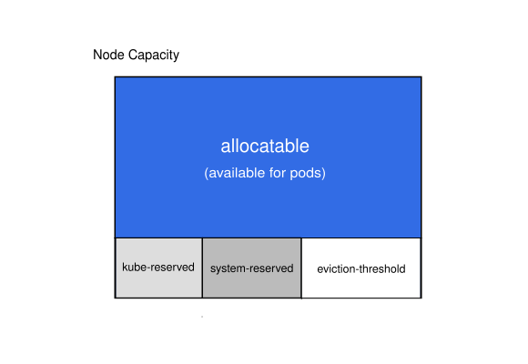

# 시스템 데몬을 위한 컴퓨트 자원 예약 {#k8s-node-allocatable}

>> **원문:** [Reserve Compute Resources for System Daemons](https://kubernetes.io/docs/tasks/administer-cluster/reserve-compute-resources/) · The Kubernetes Authors · [CC BY 4.0](https://creativecommons.org/licenses/by/4.0/)
>
> 이 문서는 원문을 한국어로 옮기며 두괄식으로 재구성하고 역자 주를 더한 것이다. 문서 본문의 라이선스는 CC BY 4.0([kubernetes/website](https://github.com/kubernetes/website))이고, 원문에 수록된 설정 예시의 라이선스는 Apache 2.0이다.
>
>> 원문 시점 2025-12-05 · 번역 2026-07-08

## 결론 {#conclusion}

노드 자원 예약의 [전체 그림](#node-allocatable)은 산식 하나로 요약된다.

**Allocatable = Capacity − kubeReserved − systemReserved − 축출 임계(evictionHard).**

Kubernetes 노드는 기본적으로 Capacity(총용량)까지 스케줄링될 수 있고, pod은 노드의 가용 용량 전부를 소비할 수 있다. 문제는 노드가 OS와 Kubernetes 자체를 구동하는 시스템 데몬(system daemon)을 다수 실행한다는 점이다. 이들을 위한 자원을 따로 떼어두지 않으면 pod과 시스템 데몬이 자원을 두고 경쟁하고, 노드에서 자원 고갈(resource starvation) 문제가 발생한다. kubelet은 시스템 데몬 몫의 컴퓨트 자원을 예약하도록 돕는 'Node Allocatable' 기능을 제공하며, Kubernetes는 클러스터 관리자가 각 노드의 워크로드 밀도(workload density)에 맞춰 Node Allocatable을 설정하기를 권장한다.

> **역자 주 · 주의**
> 예약은 옵트인(opt-in)이다. kubeadm 기본 구성을 포함한 다수의 배포 환경이 kubeReserved·systemReserved를 설정하지 않은 채 운영되며, 이 경우 Capacity와 Allocatable이 사실상 같아져 비(非) pod 컴포넌트의 자원 소요를 스케줄러가 계상하지 못한다. 근거: [kOps 노드 자원 처리 문서](https://github.com/kubernetes/kops/blob/master/docs/node_resource_handling.md).

## 시작하기 전에 {#before-you-begin}

Kubernetes 클러스터와, 그 클러스터와 통신하도록 구성된 kubectl 커맨드라인 도구가 필요하다. 컨트롤 플레인 호스트 역할을 하지 않는 노드가 두 개 이상인 클러스터에서 이 튜토리얼을 실행하기를 권장한다. 클러스터가 없다면 [minikube](https://minikube.sigs.k8s.io/docs/tutorials/multi_node/)로 만들거나 다음 Kubernetes 플레이그라운드 중 하나를 이용할 수 있다: [iximiuz Labs](https://labs.iximiuz.com/playgrounds?category=kubernetes&filter=all), [Killercoda](https://killercoda.com/playgrounds/scenario/kubernetes), [KodeKloud](https://kodekloud.com/public-playgrounds).

아래의 kubelet [설정 항목](https://kubernetes.io/docs/reference/config-api/kubelet-config.v1beta1/)들은 [kubelet 설정 파일](https://kubernetes.io/docs/tasks/administer-cluster/kubelet-config-file/)로 구성할 수 있다.

## Node Allocatable {#node-allocatable}

Kubernetes 노드의 'Allocatable'은 pod이 사용할 수 있는 컴퓨트 자원의 양으로 정의된다. 스케줄러는 Allocatable을 초과 예약(over-subscribe)하지 않는다. 현재 지원되는 자원은 'CPU', 'memory', 'ephemeral-storage' 세 가지다.

Node Allocatable은 API의 `v1.Node` 객체의 일부로, 그리고 CLI의 `kubectl describe node` 출력의 일부로 노출된다.

kubelet에서는 두 부류의 시스템 데몬에 대해 자원을 예약할 수 있다.

<figure>
  
  <figcaption>https://kubernetes.io/images/docs/node-capacity.svg</figcaption>
</figure>

### QoS·pod 레벨 cgroup 활성화 {#enabling-qos-and-pod-level-cgroups}

노드에서 Node Allocatable 제약을 제대로 강제하려면 `cgroupsPerQOS` 설정을 통해 새로운 cgroup(control group, 제어 그룹) 계층을 활성화해야 한다. QoS는 서비스 품질(Quality of Service)을 뜻한다. 이 설정은 기본으로 켜져 있다. 활성화되면 kubelet은 모든 최종 사용자 pod을 kubelet이 관리하는 cgroup 계층 아래에 부모로 묶는다.

### cgroup 드라이버 {#configuring-a-cgroup-driver}

kubelet은 cgroup 드라이버를 사용해 호스트의 cgroup 계층 조작을 지원한다. 드라이버는 `cgroupDriver` 설정으로 구성한다.

지원되는 값은 다음과 같다.

- `cgroupfs`: 기본 드라이버. cgroup 샌드박스를 관리하기 위해 호스트의 cgroup 파일시스템을 직접 조작한다.
- `systemd`: 대안 드라이버. 해당 init 시스템이 지원하는 자원에 대해 임시 슬라이스(transient slice)를 사용해 cgroup 샌드박스를 관리한다.

연계된 컨테이너 런타임의 구성에 따라, 시스템이 올바르게 동작하도록 운영자가 특정 cgroup 드라이버를 선택해야 할 수 있다. 예를 들어 운영자가 containerd 런타임이 제공하는 `systemd` cgroup 드라이버를 사용한다면, kubelet도 `systemd` cgroup 드라이버를 사용하도록 설정해야 한다.

### Kube Reserved {#kube-reserved}

- **KubeletConfiguration 설정**: `kubeReserved: {}`. 예시 값 `{cpu: 100m, memory: 100Mi, ephemeral-storage: 1Gi, pid=1000}`
- **KubeletConfiguration 설정**: `kubeReservedCgroup: ""`

`kubeReserved`는 kubelet, 컨테이너 런타임(container runtime) 등 Kubernetes 시스템 데몬을 위한 자원 예약을 담기 위한 것이다. pod으로 실행되는 시스템 데몬을 위한 자원 예약 용도가 아니다. `kubeReserved`는 통상 노드의 pod 밀도(pod density)의 함수다.

`cpu`, `memory`, `ephemeral-storage`에 더해 `pid`를 지정하면 Kubernetes 시스템 데몬 몫의 프로세스 ID(PID) 개수를 예약할 수 있다.

`kubeReserved`를 Kubernetes 시스템 데몬에 선택적으로 강제하려면, kube 데몬들의 부모 제어 그룹을 `kubeReservedCgroup` 설정 값으로 지정하고 [`enforceNodeAllocatable`에 `kube-reserved`를 추가](#enforcing-node-allocatable)한다.

Kubernetes 시스템 데몬은 최상위 제어 그룹(예: systemd 머신의 `runtime.slice`) 아래에 두기를 권장한다. 이상적으로는 각 시스템 데몬이 자신만의 하위 제어 그룹 안에서 실행되어야 한다. 권장 제어 그룹 계층의 상세는 [설계 제안 문서](https://git.k8s.io/design-proposals-archive/node/node-allocatable.md#recommended-cgroups-setup)를 참고한다.

kubelet은 `kubeReservedCgroup`이 존재하지 않아도 **생성해 주지 않는다**. 유효하지 않은 cgroup을 지정하면 kubelet은 시작에 실패한다. `systemd` cgroup 드라이버를 쓸 때는 정의하는 cgroup 이름이 특정 패턴을 따라야 한다. `kubeReservedCgroup`에 설정한 값 뒤에 `.slice`를 붙인 이름이어야 한다.

### System Reserved {#system-reserved}

- **KubeletConfiguration 설정**: `systemReserved: {}`. 예시 값 `{cpu: 100m, memory: 100Mi, ephemeral-storage: 1Gi, pid=1000}`
- **KubeletConfiguration 설정**: `systemReservedCgroup: ""`

`systemReserved`는 `sshd`, `udev` 같은 OS 시스템 데몬을 위한 자원 예약을 담기 위한 것이다. 현재 Kubernetes에서 커널(kernel) 메모리는 pod에 계상되지 않으므로, `systemReserved`는 커널 몫의 `memory`도 예약해야 한다. 사용자 로그인 세션을 위한 자원 예약도 권장된다(systemd 세계의 `user.slice`).

`cpu`, `memory`, `ephemeral-storage`에 더해 `pid`를 지정하면 OS 시스템 데몬 몫의 프로세스 ID 개수를 예약할 수 있다.

`systemReserved`를 시스템 데몬에 선택적으로 강제하려면, OS 시스템 데몬의 부모 제어 그룹을 `systemReservedCgroup` 설정 값으로 지정하고 [`enforceNodeAllocatable`에 `system-reserved`를 추가](#enforcing-node-allocatable)한다.

OS 시스템 데몬은 최상위 제어 그룹(예: systemd 머신의 `system.slice`) 아래에 두기를 권장한다.

kubelet은 `systemReservedCgroup`이 존재하지 않아도 **생성해 주지 않는다**. 유효하지 않은 cgroup을 지정하면 kubelet은 실패한다. `systemd` cgroup 드라이버를 쓸 때는 정의하는 cgroup 이름이 특정 패턴을 따라야 한다. `systemReservedCgroup`에 설정한 값 뒤에 `.slice`를 붙인 이름이어야 한다.

### 명시적 예약 CPU 목록 {#explicitly-reserved-cpu-list}

`FEATURE STATE: Kubernetes v1.17 [stable]`

**KubeletConfiguration 설정**: `reservedSystemCPUs:`. 예시 값 `0-3`

`reservedSystemCPUs`는 OS 시스템 데몬과 Kubernetes 시스템 데몬을 위한 명시적 CPU 집합(cpuset)을 정의하기 위한 것이다. cpuset 자원에 관해 OS 시스템 데몬용과 Kubernetes 시스템 데몬용 별도 최상위 cgroup을 정의할 의도가 없는 시스템을 위한 옵션이다. kubelet에 `kubeReservedCgroup`과 `systemReservedCgroup`이 **없으면**, `reservedSystemCPUs`가 제공하는 명시적 cpuset이 `kubeReservedCgroup`·`systemReservedCgroup` 옵션으로 정의된 CPU보다 우선한다.

이 옵션은 통제되지 않는 인터럽트(interrupt)·타이머(timer)가 워크로드 성능에 영향을 줄 수 있는 통신(Telco)/NFV(Network Functions Virtualization, 네트워크 기능 가상화) 사례를 위해 특별히 설계됐다. 이 옵션으로 시스템·Kubernetes 데몬과 인터럽트·타이머를 위한 명시적 cpuset을 정의하면, 시스템의 나머지 CPU를 통제되지 않는 인터럽트·타이머의 영향을 덜 받는 워크로드 전용으로 쓸 수 있다. 시스템 데몬, Kubernetes 데몬, 인터럽트·타이머를 이 옵션이 정의한 명시적 cpuset으로 옮기는 일은 Kubernetes 바깥의 다른 메커니즘으로 해야 한다. 예를 들어 CentOS에서는 tuned 툴셋으로 할 수 있다.

### 축출 임계 {#eviction-thresholds}

**KubeletConfiguration 설정**: `evictionHard: {memory.available: "100Mi", nodefs.available: "10%", nodefs.inodesFree: "5%", imagefs.available: "15%"}`. 예시 값: `{memory.available: "<500Mi"}`

노드 수준의 메모리 압박(memory pressure)은 시스템 OOM(Out Of Memory, 메모리 부족)으로 이어져 노드 전체와 그 위에서 실행 중인 모든 pod에 영향을 준다. 메모리가 회수될 때까지 노드가 일시적으로 오프라인이 될 수 있다. 시스템 OOM을 피하기 위해(또는 그 확률을 줄이기 위해) kubelet은 [자원 부족 관리](https://kubernetes.io/docs/concepts/scheduling-eviction/node-pressure-eviction/)를 제공한다. 축출(eviction)은 `memory`와 `ephemeral-storage`에 대해서만 지원된다. `evictionHard` 설정으로 메모리 일부를 예약해 두면, kubelet은 노드의 가용 메모리가 예약값 아래로 떨어질 때마다 pod 축출을 시도한다. 가정하자면 노드에 시스템 데몬이 존재하지 않더라도 pod은 `Capacity − eviction-hard`를 초과해 사용할 수 없다. 이런 이유로, 축출을 위해 예약된 자원은 pod이 사용할 수 없다.

### Node Allocatable 강제 {#enforcing-node-allocatable}

**KubeletConfiguration 설정**: `enforceNodeAllocatable: [pods]`. 예시 값: `[pods,system-reserved,kube-reserved]`

스케줄러는 Allocatable을 pod이 사용할 수 있는 `capacity`로 취급한다.

kubelet은 기본적으로 pod 전체에 대해 Allocatable을 강제한다. 강제는 모든 pod의 총사용량이 Allocatable을 초과할 때마다 pod을 축출하는 방식으로 수행된다. 축출 정책의 상세는 [노드 압박 축출](https://kubernetes.io/docs/concepts/scheduling-eviction/node-pressure-eviction/) 페이지에서 볼 수 있다. 이 강제는 KubeletConfiguration 설정 `enforceNodeAllocatable`에 `pods` 값을 지정하는 것으로 제어된다.

선택적으로, 같은 설정에 `kube-reserved`와 `system-reserved` 값을 지정해 kubelet이 `kubeReserved`와 `systemReserved`를 강제하게 할 수 있다. 나아가 `kube-reserved-compressible`과 `system-reserved-compressible`을 지정하면 압축 가능(compressible) 자원만 강제할 수도 있다. 단, `kubeReserved`나 `systemReserved`를 강제하려면 각각 `kubeReservedCgroup`과 `systemReservedCgroup`이 지정돼 있어야 한다.

> **역자 주 · 보충**
> 원문은 압축 가능(compressible) 자원 개념을 정의 없이 사용한다. 압축 가능 자원은 CPU다. 스로틀링(throttling)으로 제한할 수 있어 부족해도 프로세스가 느려질 뿐 죽지 않는다. 압축 불가(non-compressible) 자원은 memory와 ephemeral-storage다. 스로틀링이 불가능해 회수하려면 프로세스 종료(OOM kill 또는 축출)가 필요하다. 이 구분이 아래 일반 가이드라인의 단계적 권고를 떠받치는 근거다.

<none/>

> **역자 주 · 주의**
> 압축 가능 자원 전용 강제 값(`kube-reserved-compressible`, `system-reserved-compressible`)에는 다른 항목과 달리 FEATURE STATE(도입 버전) 표기가 없다. 원문 최종 수정 커밋(2025-12-05)에서 추가된 내용이므로, 적용 전에 운용 중인 클러스터 버전의 [KubeletConfiguration 레퍼런스](https://kubernetes.io/docs/reference/config-api/kubelet-config.v1beta1/)에서 해당 값의 지원 여부를 확인해야 한다.

<none/>

> **역자 주 · 주의**
> cgroup v1 시스템에서 `enforceNodeAllocatable`에 `system-reserved`를 지정하면 kubelet이 시작에 실패하는 문제가 보고돼 있다([kubernetes#125763](https://github.com/kubernetes/kubernetes/issues/125763)). 적용 전 `stat -fc %T /sys/fs/cgroup/` 출력이 `cgroup2fs`(cgroup v2)인지 확인하는 편이 안전하다.

## 일반 가이드라인 {#general-guidelines}

시스템 데몬은 [Guaranteed pod](https://kubernetes.io/docs/tasks/configure-pod-container/quality-service-pod/#create-a-pod-that-gets-assigned-a-qos-class-of-guaranteed)과 유사하게 취급되어야 한다. 시스템 데몬은 자신을 감싸는 제어 그룹 안에서 버스트(burst)할 수 있고, 이 동작은 Kubernetes 배포의 일부로 관리되어야 한다. 예를 들어 kubelet은 자신의 제어 그룹을 갖고 `kubeReserved` 자원을 컨테이너 런타임과 공유해야 한다. 다만 `kubeReserved`가 강제되면 kubelet은 버스트해서 노드의 가용 자원 전부를 사용할 수 없다.

`systemReserved` 예약을 강제할 때는 각별히 조심해야 한다. 중대한 시스템 서비스가 노드에서 CPU를 굶거나(CPU starved), OOM으로 종료되거나(OOM killed), fork하지 못하는(unable to fork) 상황으로 이어질 수 있기 때문이다. 권장 사항은, 노드를 철저히 프로파일링(profiling)해 정밀한 추정치를 얻었고 그 그룹의 어떤 프로세스가 OOM으로 종료되어도 복구할 수 있다는 확신이 있는 경우에만 `systemReserved`를 강제하는 것이다.

`kubeReserved`와 `systemReserved`에 대해 압축 가능 자원만 강제하면, 경합 시 자원이 적절히 배분되도록 보장하면서도 중단을 유발할 가능성이 낮다.

- 우선 `pods`에 대해 Allocatable을 강제한다.
- kube·시스템 데몬을 추적할 적절한 모니터링과 경보가 갖춰지면, `kubeReserved`와 `systemReserved`에 압축 가능 자원 강제를 시도한다.
- 사용량 휴리스틱(heuristics)에 근거해 압축 불가 `kubeReserved` 자원 강제를 시도한다.
- 절대적으로 필요한 경우에 한해, 시간을 두고 압축 불가 `systemReserved` 자원을 강제한다.

kube 시스템 데몬의 자원 요구량은 기능이 계속 추가되면서 시간이 지남에 따라 커질 수 있다. Kubernetes 프로젝트는 노드 시스템 데몬의 사용률을 낮추려 시도하겠지만 현재로서는 우선순위가 아니다. 따라서 향후 릴리스에서 Allocatable 용량의 감소를 예상해야 한다.

> **역자 주 · 주의**
> 압축 불가 자원의 `systemReserved` 강제가 실패하는 양상은 원격 관리 수단의 상실로 이어질 수 있다. 예약치가 실제 사용량보다 빡빡하면 `sshd`가 fork하지 못하거나 OOM으로 종료되어 해당 노드에 SSH 접속 자체가 불가능해진다. 물리 콘솔이나 하이퍼바이저 콘솔 같은 대체 접속 수단을 확보한 뒤에 시도해야 한다.

## 계산 예시 {#example-scenario}

Node Allocatable 계산을 보여주는 예시다.

- 노드의 `memory`는 `32Gi`, `CPU`는 `16개`, `Storage`는 `100Gi`
- `kubeReserved`는 `{cpu: 1000m, memory: 2Gi, ephemeral-storage: 1Gi}`
- `systemReserved`는 `{cpu: 500m, memory: 1Gi, ephemeral-storage: 1Gi}`
- `evictionHard`는 `{memory.available: "<500Mi", nodefs.available: "<10%"}`

이 시나리오에서 'Allocatable'은 CPU 14.5개, memory 28.5Gi, 로컬 스토리지 88Gi가 된다. 스케줄러는 이 노드의 모든 pod의 memory `requests` 총합이 28.5Gi를 넘지 않고 스토리지가 88Gi를 넘지 않도록 보장한다. kubelet은 pod 전체의 memory 사용량이 28.5Gi를 초과하거나 전체 디스크 사용량이 88Gi를 초과하면 pod을 축출한다. 노드의 모든 프로세스가 가능한 한 CPU를 소비하더라도 pod들이 합쳐서 14.5개를 초과해 사용할 수 없다.

`kubeReserved`나 `systemReserved`가 강제되지 않은 상태에서 시스템 데몬이 자신의 예약을 초과하면, kubelet은 노드 전체 memory 사용량이 31.5Gi보다 높거나 `storage`가 90Gi보다 클 때마다 pod을 축출한다.

> **역자 주 · 보충**
> 산식을 풀면 다음과 같다. CPU는 16 − 1(kube) − 0.5(system) = 14.5개. memory는 32 − 2 − 1 − 0.5(축출) = 28.5Gi. 스토리지는 100 − 1 − 1 − 10(축출 10%) = 88Gi. 미강제 시의 축출 기준 31.5Gi와 90Gi는 Capacity에서 축출 임계만 뺀 값이다(32 − 0.5, 100 − 10). 강제하지 않은 예약분은 시스템 데몬이 초과 사용할 수 있는 여지로 남고, 실질적 바닥은 축출 임계가 지킨다.

## 역자 주 · 적용 {#translator-notes-application}

- 홈랩이나 소규모 클러스터처럼 예약 미설정이 기본인 환경에서는 메모리 압박 시 kubelet과 컨테이너 런타임 자체가 자원을 확보하지 못해 노드 장애로 번질 수 있다. 노드 부트스트랩 단계의 KubeletConfiguration에 최소한의 `kubeReserved`와 `evictionHard` 기본값을 포함해 두면 이 위험이 줄어든다.
- 예약값 산정은 계측이 우선이다. 본문 일반 가이드라인의 단계적 권고(모니터링을 갖춘 뒤 강제)는 Node Exporter, kubelet 내장 cAdvisor 등으로 데몬별 사용량을 관측한 뒤 값을 정하는 순서를 전제한다.
- 이 문서 이해의 자기 점검 기준은 `kubectl describe node` 출력에서 Capacity와 Allocatable의 차이를 위의 산식으로 설명할 수 있는가다.

<!-- REVIEW-REQUIRED: 아래 경험 슬롯을 실제 실습 결과로 채우거나 블록째 삭제할 것.
     채우지 않은 채 draft를 해제하지 않는다. -->
> **역자 주 · 적용(경험)**
> (직접 실습·검증한 결과가 있을 때만 1인칭으로 기록)

## 참고 출처 {#references}

원문 수록 링크:

- [minikube 멀티 노드 튜토리얼](https://minikube.sigs.k8s.io/docs/tutorials/multi_node/)
- 플레이그라운드: [iximiuz Labs](https://labs.iximiuz.com/playgrounds?category=kubernetes&filter=all) · [Killercoda](https://killercoda.com/playgrounds/scenario/kubernetes) · [KodeKloud](https://kodekloud.com/public-playgrounds)
- [KubeletConfiguration v1beta1 레퍼런스](https://kubernetes.io/docs/reference/config-api/kubelet-config.v1beta1/)
- [kubelet 설정 파일로 구성하기](https://kubernetes.io/docs/tasks/administer-cluster/kubelet-config-file/)
- [Node Allocatable 설계 제안(권장 cgroup 계층)](https://git.k8s.io/design-proposals-archive/node/node-allocatable.md#recommended-cgroups-setup)
- [노드 압박 축출](https://kubernetes.io/docs/concepts/scheduling-eviction/node-pressure-eviction/)
- [Guaranteed QoS pod 만들기](https://kubernetes.io/docs/tasks/configure-pod-container/quality-service-pod/#create-a-pod-that-gets-assigned-a-qos-class-of-guaranteed)

역자 검증 출처:

- [kubernetes/kubernetes#125763 · cgroup v1에서 system-reserved 강제 시 kubelet 기동 실패](https://github.com/kubernetes/kubernetes/issues/125763)
- [kOps · Node Resource Handling](https://github.com/kubernetes/kops/blob/master/docs/node_resource_handling.md)
