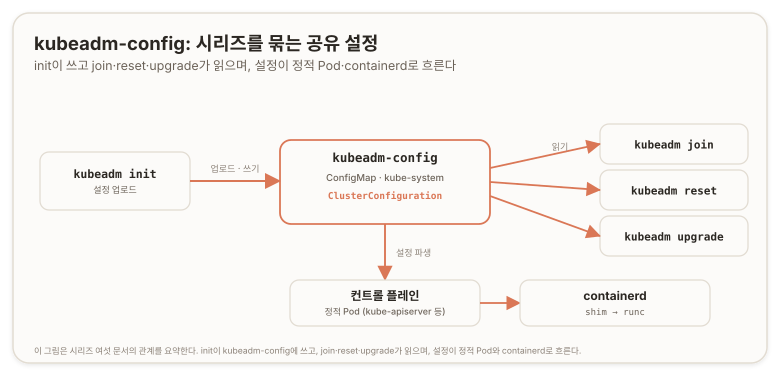

# kubeadm config {#kubeadm-config}

>> **원문:** [kubeadm config](https://kubernetes.io/docs/reference/setup-tools/kubeadm/kubeadm-config/) · The Kubernetes Authors · [CC BY 4.0](https://creativecommons.org/licenses/by/4.0/)
>
> 이 문서는 원문을 한국어로 옮기며 두괄식으로 재구성하고 역자 주를 더한 것이다. 문서 본문은 [CC BY 4.0](https://creativecommons.org/licenses/by/4.0/)을 따른다. 변경 사항으로 결론 선행 재배치와 역자 주(검증·적용)가 추가되었으며, 하위 명령·플래그는 원문에서 누락 없이 옮겼다.
>
>> 원문 시점 2024-08-17 · 번역 2026-07-09

## 결론 {#conclusion}

`kubeadm config`는 kubeadm 설정 API를 다루는 명령 모음이다. `kubeadm init` 때 kubeadm은 `ClusterConfiguration`을 `kube-system` 네임스페이스의 `kubeadm-config` ConfigMap에 업로드하고, 이 설정을 `kubeadm join`·`kubeadm reset`·`kubeadm upgrade`가 읽는다.

하위 명령은 용도별로 나뉜다. `print`는 init·join의 기본 설정을 출력한다(`print init-defaults`·`print join-defaults` 포함). `migrate`는 구버전 API 설정을 최신 지원 버전으로 변환한다. `validate`는 설정 파일을 검증한다. `images list`·`images pull`은 kubeadm이 필요로 하는 이미지를 나열·다운로드한다.

이 kubeadm 버전이 지원하는 설정 API 버전은 `kubeadm.k8s.io/v1beta4`다. kubeadm은 v1beta4로만 출력하되 구버전도 읽을 수 있어, `migrate`로 넘긴 파일을 읽고·역직렬화·기본값 적용·변환·검증한 뒤 재직렬화해 내보낸다.

---

`kubeadm init` 동안 kubeadm은 `ClusterConfiguration` 오브젝트를 `kube-system` 네임스페이스의 `kubeadm-config`라는 ConfigMap에 업로드한다. 이 설정은 이후 `kubeadm join`, `kubeadm reset`, `kubeadm upgrade` 동안 읽힌다.

`kubeadm config print`로 kubeadm이 `kubeadm init`과 `kubeadm join`에 쓰는 기본 정적 설정을 출력할 수 있다.

> **참고:** 이 명령의 출력은 예시로 삼기 위한 것이다. 사용자는 자신의 환경에 맞추기 위해 이 명령의 출력을 직접 수정해야 한다. 확신이 없는 필드는 지우면 kubeadm이 런타임에 호스트를 검사해 기본값을 채우려 시도한다.

`init`과 `join`에 대한 더 자세한 내용은 [설정 파일로 kubeadm init 사용](https://kubernetes.io/docs/reference/setup-tools/kubeadm/kubeadm-init/#config-file)이나 [설정 파일로 kubeadm join 사용](https://kubernetes.io/docs/reference/setup-tools/kubeadm/kubeadm-join/#config-file)으로 이동한다.

kubeadm 설정 API 사용에 대한 더 자세한 내용은 [kubeadm API로 컴포넌트 커스터마이징](https://kubernetes.io/docs/setup/production-environment/tools/kubeadm/control-plane-flags/)으로 이동한다.

`kubeadm config migrate`로 deprecated된 API 버전을 담은 오래된 설정 파일을 더 새롭고 지원되는 API 버전으로 변환할 수 있다.

`kubeadm config validate`는 설정 파일을 검증하는 데 쓸 수 있다.

`kubeadm config images list`와 `kubeadm config images pull`은 kubeadm이 필요로 하는 이미지를 나열하고 받는 데 쓸 수 있다.

## kubeadm config print {#cmd-print}

설정을 출력한다.

### 개요 {#print-synopsis}

이 명령은 제공된 하위 명령에 대한 설정을 출력한다. 자세한 내용은 [pkg.go.dev의 kubeadm apis 디렉터리](https://pkg.go.dev/k8s.io/kubernetes/cmd/kubeadm/app/apis/kubeadm#section-directories)를 참조한다.

```
kubeadm config print [flags]
```

### 플래그 {#print-options}

| 플래그 | 설명 |
| --- | --- |
| `-h, --help` | print 도움말. |

### 상위 명령 상속 플래그 {#print-inherited}

| 플래그 | 기본값 | 설명 |
| --- | --- | --- |
| `--kubeconfig string` | `/etc/kubernetes/admin.conf` | 클러스터와 통신할 때 쓸 kubeconfig 파일. 미설정 시 기존 kubeconfig 파일을 표준 위치들에서 탐색할 수 있다. |
| `--rootfs string` | | '실제' 호스트 루트 파일시스템 경로. kubeadm이 지정한 경로로 chroot하게 만든다. |

## kubeadm config print init-defaults {#cmd-print-init}

`kubeadm init`에 쓸 수 있는 기본 init 설정을 출력한다.

### 개요 {#print-init-synopsis}

이 명령은 `kubeadm init`에 쓰이는 기본 init 설정 같은 오브젝트를 출력한다.

부트스트랩 토큰 필드처럼 민감한 값은 `abcdef.0123456789abcdef` 같은 플레이스홀더 값으로 대체된다. 검증은 통과하되 토큰 생성을 위한 실제 계산은 수행하지 않기 위함이다.

```
kubeadm config print init-defaults [flags]
```

### 플래그 {#print-init-options}

| 플래그 | 설명 |
| --- | --- |
| `--component-configs strings` | 기본값을 출력할 컴포넌트 설정 API 오브젝트의 쉼표 구분 목록. 사용 가능한 값: `[KubeProxyConfiguration KubeletConfiguration]`. 이 플래그를 설정하지 않으면 컴포넌트 설정은 출력되지 않는다. |
| `-h, --help` | init-defaults 도움말. |

### 상위 명령 상속 플래그 {#print-init-inherited}

| 플래그 | 기본값 | 설명 |
| --- | --- | --- |
| `--kubeconfig string` | `/etc/kubernetes/admin.conf` | 클러스터와 통신할 때 쓸 kubeconfig 파일. 미설정 시 기존 kubeconfig 파일을 표준 위치들에서 탐색할 수 있다. |
| `--rootfs string` | | '실제' 호스트 루트 파일시스템 경로. kubeadm이 지정한 경로로 chroot하게 만든다. |

## kubeadm config print join-defaults {#cmd-print-join}

`kubeadm join`에 쓸 수 있는 기본 join 설정을 출력한다.

### 개요 {#print-join-synopsis}

이 명령은 `kubeadm join`에 쓰이는 기본 join 설정 같은 오브젝트를 출력한다.

부트스트랩 토큰 필드처럼 민감한 값은 `abcdef.0123456789abcdef` 같은 플레이스홀더 값으로 대체된다. 검증은 통과하되 토큰 생성을 위한 실제 계산은 수행하지 않기 위함이다.

```
kubeadm config print join-defaults [flags]
```

### 플래그 {#print-join-options}

| 플래그 | 설명 |
| --- | --- |
| `-h, --help` | join-defaults 도움말. |

### 상위 명령 상속 플래그 {#print-join-inherited}

| 플래그 | 기본값 | 설명 |
| --- | --- | --- |
| `--kubeconfig string` | `/etc/kubernetes/admin.conf` | 클러스터와 통신할 때 쓸 kubeconfig 파일. 미설정 시 기존 kubeconfig 파일을 표준 위치들에서 탐색할 수 있다. |
| `--rootfs string` | | '실제' 호스트 루트 파일시스템 경로. kubeadm이 지정한 경로로 chroot하게 만든다. |

> **역자 주 · 검증**
> 원문은 `print init-defaults`와 `print join-defaults`만 다루지만, 번역 시점(2026-07-09) 현행 kubeadm에는 `kubeadm config print reset-defaults`와 `kubeadm config print upgrade-defaults`도 있다. v1beta4가 `ResetConfiguration`·`UpgradeConfiguration` API 타입을 지원하면서 추가된 것이다. 원문은 2024-08-17 스냅숏이라 이 둘이 빠져 있다. 출처: [kubeadm v1beta4 패키지 문서](https://pkg.go.dev/k8s.io/kubernetes/cmd/kubeadm/app/apis/kubeadm/v1beta4).

## kubeadm config migrate {#cmd-migrate}

파일에서 구버전 kubeadm 설정 API 타입을 읽어, 더 새로운 버전에 해당하는 유사 설정 오브젝트를 출력한다.

### 개요 {#migrate-synopsis}

이 명령은 구버전 설정 오브젝트를, 클러스터의 어떤 것도 건드리지 않고 CLI 도구 안에서 로컬로 최신 지원 버전으로 변환하게 해준다. 이 버전의 kubeadm에서 지원하는 API 버전은 다음과 같다.

- `kubeadm.k8s.io/v1beta4`

또한 kubeadm은 `kubeadm.k8s.io/v1beta4` 버전의 설정만 출력할 수 있으나 두 타입 모두 읽을 수 있다. 따라서 여기 `--old-config` 파라미터에 어떤 버전을 넘기든, API 오브젝트는 읽히고, 역직렬화되고, 기본값이 적용되고, 변환되고, 검증되고, stdout(또는 지정 시 `--new-config`)에 쓰일 때 재직렬화된다.

다시 말해, 이 명령의 출력은 이 파일을 `kubeadm init`에 제출했을 때 kubeadm이 내부적으로 실제로 읽게 될 내용이다.

```
kubeadm config migrate [flags]
```

> **역자 주 · 검증**
> `kubeadm.k8s.io/v1beta4`는 번역 시점에도 현행 유일 설정 API 버전이다. [v1beta4 설정 레퍼런스](https://kubernetes.io/docs/reference/config-api/kubeadm-config.v1beta4/)는 v1.36.0용으로 2026-04-24에 갱신되었고, v1beta5는 아직 없다. 원문의 "두 타입 모두 읽을 수 있다"에서 두 타입은 v1beta3(deprecated)와 v1beta4를 가리킨다. v1beta3는 v1.31부터 deprecated이나 v1.36 시점에도 아직 읽을 수 있어 migrate의 입력으로 유효하다. 출처: [v1beta4 설정 API](https://kubernetes.io/docs/reference/config-api/kubeadm-config.v1beta4/), [Kubernetes v1.31: kubeadm v1beta4](https://kubernetes.io/blog/2024/08/23/kubernetes-1-31-kubeadm-v1beta4/).

### 플래그 {#migrate-options}

| 플래그 | 설명 |
| --- | --- |
| `--allow-experimental-api` | 실험적이고 미출시된 API로의 마이그레이션을 허용한다. |
| `-h, --help` | migrate 도움말. |
| `--new-config string` | 새 API 버전을 쓰는, 결과로 나올 동등한 kubeadm 설정 파일의 경로. 선택 사항이며, 지정하지 않으면 출력은 STDOUT으로 전송된다. |
| `--old-config string` | 구버전 API를 쓰고 있어 변환해야 할 kubeadm 설정 파일의 경로. 이 플래그는 필수다. |

### 상위 명령 상속 플래그 {#migrate-inherited}

| 플래그 | 기본값 | 설명 |
| --- | --- | --- |
| `--kubeconfig string` | `/etc/kubernetes/admin.conf` | 클러스터와 통신할 때 쓸 kubeconfig 파일. 미설정 시 기존 kubeconfig 파일을 표준 위치들에서 탐색할 수 있다. |
| `--rootfs string` | | '실제' 호스트 루트 파일시스템 경로. kubeadm이 지정한 경로로 chroot하게 만든다. |

## kubeadm config validate {#cmd-validate}

kubeadm 설정 API를 담은 파일을 읽어 검증 문제를 보고한다.

### 개요 {#validate-synopsis}

이 명령은 kubeadm 설정 API 파일을 검증하고 모든 경고와 오류를 보고하게 해준다. 오류가 없으면 종료 상태는 0이고, 그렇지 않으면 0이 아니다. 알 수 없는 API 필드 같은 역직렬화 문제는 오류를 일으킨다. 알 수 없는 API 버전과 유효하지 않은 값을 가진 필드도 오류를 일으킨다. 그 밖의 오류나 경고는 입력 파일 내용에 따라 보고될 수 있다.

이 버전의 kubeadm에서 지원하는 API 버전은 다음과 같다.

- `kubeadm.k8s.io/v1beta4`

```
kubeadm config validate [flags]
```

### 플래그 {#validate-options}

| 플래그 | 설명 |
| --- | --- |
| `--allow-deprecated-api` | deprecated된 API의 검증을 허용한다. |
| `--allow-experimental-api` | 실험적이고 미출시된 API의 검증을 허용한다. |
| `--config string` | kubeadm 설정 파일 경로. |
| `-h, --help` | validate 도움말. |

### 상위 명령 상속 플래그 {#validate-inherited}

| 플래그 | 기본값 | 설명 |
| --- | --- | --- |
| `--kubeconfig string` | `/etc/kubernetes/admin.conf` | 클러스터와 통신할 때 쓸 kubeconfig 파일. 미설정 시 기존 kubeconfig 파일을 표준 위치들에서 탐색할 수 있다. |
| `--rootfs string` | | '실제' 호스트 루트 파일시스템 경로. kubeadm이 지정한 경로로 chroot하게 만든다. |

## kubeadm config images list {#cmd-images-list}

### 개요 {#images-list-synopsis}

kubeadm이 사용할 이미지 목록을 출력한다. 이미지나 이미지 저장소를 커스터마이징한 경우 설정 파일이 사용된다.

```
kubeadm config images list [flags]
```

### 플래그 {#images-list-options}

| 플래그 | 기본값 | 설명 |
| --- | --- | --- |
| `--allow-missing-template-keys` | `true` | true면 템플릿에서 필드나 맵 키가 없을 때 오류를 무시한다. golang과 jsonpath 출력 형식에만 적용된다. |
| `--config string` | | kubeadm 설정 파일 경로. |
| `--feature-gates string` | | 각종 기능의 피처 게이트를 기술하는 `key=value` 쌍 집합. 옵션: `NodeLocalCRISocket=true\|false`(기본 true), `PublicKeysECDSA=true\|false`(DEPRECATED, 기본 false), `RootlessControlPlane=true\|false`(ALPHA, 기본 false). |
| `-h, --help` | | list 도움말. |
| `--image-repository string` | `registry.k8s.io` | 컨트롤 플레인 이미지를 받아올 컨테이너 레지스트리를 선택한다. |
| `--kubernetes-version string` | `stable-1` | 컨트롤 플레인에 쓸 특정 Kubernetes 버전을 선택한다. |
| `-o, --output string` | `text` | 출력 형식. `text\|json\|yaml\|kyaml\|go-template\|go-template-file\|template\|templatefile\|jsonpath\|jsonpath-as-json\|jsonpath-file` 중 하나. |
| `--show-managed-fields` | | true면 JSON 또는 YAML 형식으로 오브젝트를 출력할 때 `managedFields`를 유지한다. |

### 상위 명령 상속 플래그 {#images-list-inherited}

| 플래그 | 기본값 | 설명 |
| --- | --- | --- |
| `--kubeconfig string` | `/etc/kubernetes/admin.conf` | 클러스터와 통신할 때 쓸 kubeconfig 파일. 미설정 시 기존 kubeconfig 파일을 표준 위치들에서 탐색할 수 있다. |
| `--rootfs string` | | '실제' 호스트 루트 파일시스템 경로. kubeadm이 지정한 경로로 chroot하게 만든다. |

## kubeadm config images pull {#cmd-images-pull}

### 개요 {#images-pull-synopsis}

kubeadm이 사용하는 이미지를 받는다.

```
kubeadm config images pull [flags]
```

### 플래그 {#images-pull-options}

| 플래그 | 기본값 | 설명 |
| --- | --- | --- |
| `--config string` | | kubeadm 설정 파일 경로. |
| `--cri-socket string` | | 접속할 CRI 소켓 경로. 비우면 kubeadm이 자동 감지를 시도한다. CRI를 둘 이상 설치했거나 비표준 소켓일 때만 사용한다. |
| `--feature-gates string` | | 각종 기능의 피처 게이트를 기술하는 `key=value` 쌍 집합. 옵션: `NodeLocalCRISocket=true\|false`(기본 true), `PublicKeysECDSA=true\|false`(DEPRECATED, 기본 false), `RootlessControlPlane=true\|false`(ALPHA, 기본 false). |
| `-h, --help` | | pull 도움말. |
| `--image-repository string` | `registry.k8s.io` | 컨트롤 플레인 이미지를 받아올 컨테이너 레지스트리를 선택한다. |
| `--kubernetes-version string` | `stable-1` | 컨트롤 플레인에 쓸 특정 Kubernetes 버전을 선택한다. |

### 상위 명령 상속 플래그 {#images-pull-inherited}

| 플래그 | 기본값 | 설명 |
| --- | --- | --- |
| `--kubeconfig string` | `/etc/kubernetes/admin.conf` | 클러스터와 통신할 때 쓸 kubeconfig 파일. 미설정 시 기존 kubeconfig 파일을 표준 위치들에서 탐색할 수 있다. |
| `--rootfs string` | | '실제' 호스트 루트 파일시스템 경로. kubeadm이 지정한 경로로 chroot하게 만든다. |

## 역자 주 · 적용 {#translator-notes-application}

원문 정보에서 도출되는, 일반 독자 누구에게나 성립하는 실습·활용 안내다.



*이 그림은 시리즈 여섯 문서(init·join·upgrade·config·정적 Pod·containerd Runtime v2)의 관계를 한 장으로 요약한 캡스톤이자, 개별 도형(init 페이즈 파이프라인, join 양방향 신뢰, upgrade apply·node/클러스터 순서, 정적 Pod 생명주기, containerd 시퀀스·토폴로지)의 인덱스다(논리적 추론에 따른 배치).*

- `kubeadm-config` ConfigMap이 이 시리즈를 묶는 공유 상태다. init이 `ClusterConfiguration`을 `kube-system`의 이 ConfigMap에 올리고, join·reset·upgrade가 이를 읽어 동작한다. 즉 클러스터 설정의 단일 소스(SSOT, Single Source of Truth)다. `kubectl -n kube-system get cm kubeadm-config -o yaml`로 실제 업로드된 설정을 볼 수 있다.
- 설정 파일을 손으로 관리한다면 `kubeadm config print init-defaults`로 골격을 뽑되, 원문 주의대로 확신 없는 필드는 지우고 kubeadm이 런타임에 호스트를 검사해 기본값을 채우게 둔다.
- 구버전(v1beta3) 설정 파일이 있으면 `kubeadm config migrate --old-config <파일> --new-config <파일>`로 v1beta4로 변환하고, 적용 전에 `kubeadm config validate`로 검증한다.
- 오프라인·사설 레지스트리 환경은 `kubeadm config images list`로 필요한 이미지를 확인하고 `kubeadm config images pull`로 미리 받아둔다. 정적 Pod 문서의 이미지 프리풀과 같은 맥락이다.
- 다섯 문서가 한 줄로 꿰인다. init(부트스트랩)이 이 ConfigMap을 쓰고, join(합류)·upgrade(업그레이드)가 읽으며, 그 안의 `ClusterConfiguration`이 컨트롤 플레인 정적 Pod와 containerd 런타임 설정으로 이어진다.

<!-- REVIEW-REQUIRED: 아래 경험 슬롯을 실제 실습 결과로 채우거나 블록째 삭제할 것.
     채우지 않은 채 draft를 해제하지 않는다. -->
> **역자 주 · 적용(경험)**
> (직접 실습·검증한 결과가 있을 때만 1인칭으로 기록)

## 참고 출처 {#references}

원문이 링크한 출처:

- [설정 파일로 kubeadm init 사용](https://kubernetes.io/docs/reference/setup-tools/kubeadm/kubeadm-init/#config-file)
- [설정 파일로 kubeadm join 사용](https://kubernetes.io/docs/reference/setup-tools/kubeadm/kubeadm-join/#config-file)
- [kubeadm API로 컴포넌트 커스터마이징](https://kubernetes.io/docs/setup/production-environment/tools/kubeadm/control-plane-flags/)
- [pkg.go.dev · kubeadm apis 디렉터리](https://pkg.go.dev/k8s.io/kubernetes/cmd/kubeadm/app/apis/kubeadm#section-directories)

역자 검증 출처(번역 시점 사실 확인에 사용):

- [kubeadm Configuration (v1beta4)](https://kubernetes.io/docs/reference/config-api/kubeadm-config.v1beta4/)
- [kubeadm v1beta4 패키지 문서 (print 하위 명령 목록)](https://pkg.go.dev/k8s.io/kubernetes/cmd/kubeadm/app/apis/kubeadm/v1beta4)
- [Kubernetes v1.31: kubeadm v1beta4](https://kubernetes.io/blog/2024/08/23/kubernetes-1-31-kubeadm-v1beta4/)

## 다음 단계 {#whats-next}

- [kubeadm upgrade](https://kubernetes.io/docs/reference/setup-tools/kubeadm/kubeadm-upgrade/): Kubernetes 클러스터를 새 버전으로 업그레이드
