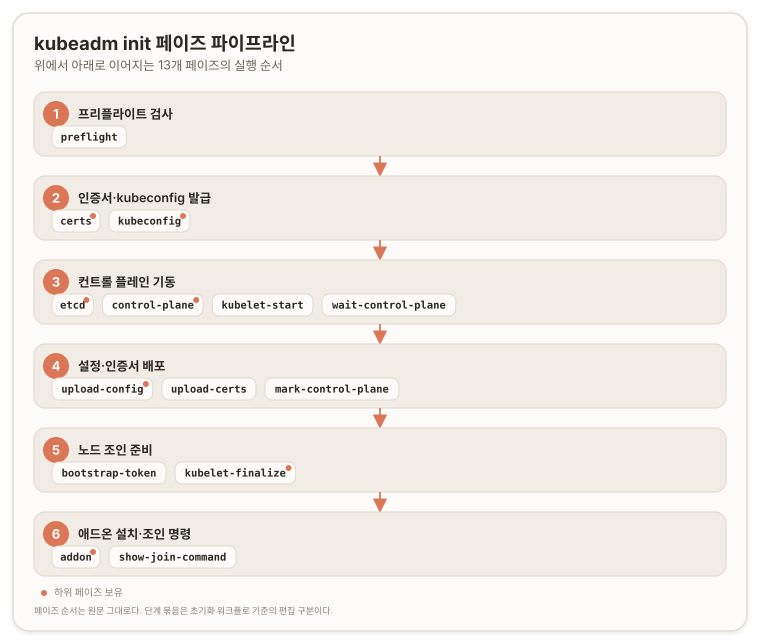

# kubeadm init {#kubeadm-init}

>> **원문:** [kubeadm init](https://kubernetes.io/docs/reference/setup-tools/kubeadm/kubeadm-init/) · The Kubernetes Authors · [CC BY 4.0](https://creativecommons.org/licenses/by/4.0/)
>
> 이 문서는 원문을 한국어로 옮기며 두괄식으로 재구성하고 역자 주를 더한 것이다. 문서 본문은 [CC BY 4.0](https://creativecommons.org/licenses/by/4.0/)을 따른다. 변경 사항으로 결론 선행 재배치와 5유형 역자 주가 추가되었으며, 명령·플래그·피처 게이트 정보는 원문에서 누락 없이 옮겼다.
>
>> 원문 시점 2025-12-16 · 번역 2026-07-09

## 결론 {#conclusion}

`kubeadm init`은 단일 컨트롤 플레인(Control Plane) 노드를 부트스트랩하는 명령이다. 정해진 순서의 페이즈(Phase) 시퀀스를 실행해 프리플라이트(Preflight) 검사부터 인증서 생성, kubeconfig 발급, etcd·컨트롤 플레인 정적 Pod 매니페스트 작성, kubelet 기동, 애드온 설치까지를 한 번에 처리한다.

운용의 핵심 레버는 네 가지다. 고급 설정은 `--config` 설정 파일로 다루고, 세밀한 제어는 `kubeadm init phase`와 `--skip-phases`로 페이즈를 쪼개 다룬다. 오프라인·사설 레지스트리 환경은 이미지 프리풀(pre-pull)과 `--image-repository`로 대응하고, 다중 컨트롤 플레인 조인은 `--upload-certs`로 인증서를 배포한다. 표준 플래그와 kubeadm 전용 피처 게이트(Feature Gate)가 이 명령의 조작 표면을 이룬다.

## 명령 개요 {#synopsis}

이 명령은 Kubernetes 컨트롤 플레인 노드를 초기화한다. Kubernetes 컨트롤 플레인을 구성하려면 이 명령을 실행한다.

`init` 명령은 다음 페이즈를 순서대로 실행한다. `kubeadm init`을 그냥 호출하면 아래 모든 페이즈와 하위 페이즈가 이 순서 그대로 실행된다.



*페이즈 순서는 원문 그대로다. 6단계 묶음은 아래 [초기화 워크플로](#init-workflow)에 대응하는 편집상 구분이며(논리적 추론에 따른 배치), 원문은 페이즈를 평면 목록으로 나열한다.*

- `preflight`: 프리플라이트 검사 실행
- `certs`: 인증서 생성
  - `/ca`: 다른 Kubernetes 컴포넌트의 신원을 발급할 자체 서명 Kubernetes CA(Certificate Authority, 인증 기관) 생성
  - `/apiserver`: Kubernetes API 서빙용 인증서 생성
  - `/apiserver-kubelet-client`: API 서버가 kubelet에 접속할 때 쓸 인증서 생성
  - `/front-proxy-ca`: 프런트 프록시(front proxy)용 신원을 발급할 자체 서명 CA 생성
  - `/front-proxy-client`: 프런트 프록시 클라이언트 인증서 생성
  - `/etcd-ca`: etcd용 신원을 발급할 자체 서명 CA 생성
  - `/etcd-server`: etcd 서빙용 인증서 생성
  - `/etcd-peer`: etcd 노드 간 통신용 인증서 생성
  - `/etcd-healthcheck-client`: etcd 헬스체크(liveness probe)용 인증서 생성
  - `/apiserver-etcd-client`: apiserver가 etcd 접근에 쓰는 인증서 생성
  - `/sa`: 서비스 어카운트(Service Account) 토큰 서명용 개인 키와 그 공개 키 생성
- `kubeconfig`: 컨트롤 플레인 구성과 admin kubeconfig 파일에 필요한 모든 kubeconfig 파일 생성
  - `/admin`: admin과 kubeadm 자신이 쓸 kubeconfig 파일 생성
  - `/super-admin`: super-admin용 kubeconfig 파일 생성
  - `/kubelet`: 클러스터 부트스트랩 용도로만 kubelet이 쓸 kubeconfig 파일 생성
  - `/controller-manager`: 컨트롤러 매니저(controller manager)가 쓸 kubeconfig 파일 생성
  - `/scheduler`: 스케줄러(scheduler)가 쓸 kubeconfig 파일 생성
- `etcd`: 로컬 etcd용 정적 Pod 매니페스트 파일 생성
  - `/local`: 단일 노드 로컬 etcd 인스턴스용 정적 Pod 매니페스트 파일 생성
- `control-plane`: 컨트롤 플레인 구성에 필요한 모든 정적 Pod 매니페스트 파일 생성
  - `/apiserver`: `kube-apiserver` 정적 Pod 매니페스트 생성
  - `/controller-manager`: `kube-controller-manager` 정적 Pod 매니페스트 생성
  - `/scheduler`: `kube-scheduler` 정적 Pod 매니페스트 생성
- `kubelet-start`: kubelet 설정을 기록하고 kubelet을 (재)시작
- `wait-control-plane`: 컨트롤 플레인 기동 대기
- `upload-config`: kubeadm과 kubelet 설정을 ConfigMap에 업로드
  - `/kubeadm`: kubeadm `ClusterConfiguration`을 ConfigMap에 업로드
  - `/kubelet`: kubelet 컴포넌트 설정을 ConfigMap에 업로드
- `upload-certs`: 인증서를 `kubeadm-certs`에 업로드
- `mark-control-plane`: 노드를 컨트롤 플레인으로 표시
- `bootstrap-token`: 노드를 클러스터에 조인할 때 쓰는 부트스트랩 토큰(Bootstrap Token) 생성
- `kubelet-finalize`: TLS 부트스트랩 이후 kubelet 관련 설정 업데이트
  - `/enable-client-cert-rotation`: kubelet 클라이언트 인증서 회전(rotation) 활성화
- `addon`: 적합성 테스트(conformance test) 통과에 필요한 애드온 설치
  - `/coredns`: CoreDNS 애드온을 Kubernetes 클러스터에 설치
  - `/kube-proxy`: kube-proxy 애드온을 Kubernetes 클러스터에 설치
- `show-join-command`: 컨트롤 플레인·워커 노드용 조인 명령 출력

```
kubeadm init [flags]
```

## 플래그 {#options}

| 플래그 | 기본값 | 설명 |
| --- | --- | --- |
| `--apiserver-advertise-address string` | | API 서버가 수신 대기(listen) 중임을 알릴 IP 주소. 미설정 시 기본 네트워크 인터페이스를 사용한다. |
| `--apiserver-bind-port int32` | `6443` | API 서버가 바인딩할 포트. |
| `--apiserver-cert-extra-sans strings` | | API 서버 서빙 인증서에 추가할 SAN(Subject Alternative Name, 주체 대체 이름). IP 주소와 DNS 이름 모두 가능하다. |
| `--cert-dir string` | `/etc/kubernetes/pki` | 인증서를 저장·보관할 경로. |
| `--certificate-key string` | | `kubeadm-certs` Secret 내 컨트롤 플레인 인증서를 암호화하는 키. 크기 32바이트의 AES 키를 16진수로 인코딩한 문자열이다. |
| `--config string` | | kubeadm 설정 파일 경로. |
| `--control-plane-endpoint string` | | 컨트롤 플레인용 안정적 IP 주소 또는 DNS 이름을 지정한다. |
| `--cri-socket string` | | 접속할 CRI(Container Runtime Interface, 컨테이너 런타임 인터페이스) 소켓 경로. 비우면 kubeadm이 자동 감지를 시도한다. CRI를 둘 이상 설치했거나 비표준 소켓일 때만 사용한다. |
| `--dry-run` | | 변경을 적용하지 않고 수행될 작업만 출력한다. |
| `--feature-gates string` | | 각종 기능의 피처 게이트를 기술하는 `key=value` 쌍 집합. 옵션: `NodeLocalCRISocket=true\|false`(기본 true), `PublicKeysECDSA=true\|false`(DEPRECATED, 기본 false), `RootlessControlPlane=true\|false`(ALPHA, 기본 false). |
| `-h, --help` | | init 도움말. |
| `--ignore-preflight-errors strings` | | 오류를 경고로 표시할 검사 목록. 예: `IsPrivilegedUser,Swap`. 값이 `all`이면 모든 검사의 오류를 무시한다. |
| `--image-repository string` | `registry.k8s.io` | 컨트롤 플레인 이미지를 받아올 컨테이너 레지스트리를 선택한다. |
| `--kubernetes-version string` | `stable-1` | 컨트롤 플레인에 쓸 특정 Kubernetes 버전을 선택한다. |
| `--node-name string` | | 노드 이름을 지정한다. |
| `--patches string` | | `target[suffix][+patchtype].extension` 형식의 파일을 담은 디렉터리 경로. 예: `kube-apiserver0+merge.yaml` 또는 단순히 `etcd.json`. `target`은 `kube-apiserver`, `kube-controller-manager`, `kube-scheduler`, `etcd`, `kubeletconfiguration`, `corednsdeployment` 중 하나다. `patchtype`은 `strategic`, `merge`, `json` 중 하나이며 kubectl이 지원하는 패치 포맷과 대응한다. 기본 `patchtype`은 `strategic`이다. `extension`은 `json` 또는 `yaml`이어야 한다. `suffix`는 패치 적용 순서를 알파벳·숫자순으로 정하는 선택적 문자열이다. |
| `--pod-network-cidr string` | | Pod 네트워크용 IP 주소 범위를 지정한다. 설정하면 컨트롤 플레인이 노드마다 CIDR(Classless Inter-Domain Routing)를 자동 할당한다. |
| `--service-cidr string` | `10.96.0.0/12` | 서비스 VIP(Virtual IP, 가상 IP)용 대체 IP 주소 범위를 사용한다. |
| `--service-dns-domain string` | `cluster.local` | 서비스용 대체 도메인을 사용한다. 예: `myorg.internal`. |
| `--skip-certificate-key-print` | | 컨트롤 플레인 인증서 암호화 키를 출력하지 않는다. |
| `--skip-phases strings` | | 건너뛸 페이즈 목록. |
| `--skip-token-print` | | `kubeadm init`가 생성한 기본 부트스트랩 토큰의 출력을 생략한다. |
| `--token string` | | 노드와 컨트롤 플레인 노드 간 양방향 신뢰를 확립하는 토큰. 형식은 `[a-z0-9]{6}.[a-z0-9]{16}`이다. 예: `abcdef.0123456789abcdef`. |
| `--token-ttl duration` | `24h0m0s` | 토큰이 자동 삭제되기까지의 시간(예: `1s`, `2m`, `3h`). `0`이면 토큰이 만료되지 않는다. |
| `--upload-certs` | | 컨트롤 플레인 인증서를 `kubeadm-certs` Secret에 업로드한다. |

## 상위 명령 상속 플래그 {#inherited-options}

| 플래그 | 설명 |
| --- | --- |
| `--rootfs string` | '실제' 호스트 루트 파일시스템(root filesystem) 경로. kubeadm이 지정한 경로로 chroot하게 만든다. |

## 초기화 워크플로 {#init-workflow}

`kubeadm init`은 다음 단계를 실행해 Kubernetes 컨트롤 플레인 노드를 부트스트랩한다.

1. 변경을 가하기 전에 시스템 상태를 검증하는 일련의 프리플라이트 검사를 실행한다. 일부 검사는 경고만 내지만, 일부는 오류로 간주되어 문제가 해결되거나 사용자가 `--ignore-preflight-errors=<오류 목록>`을 지정할 때까지 kubeadm을 종료시킨다.
2. 클러스터의 각 컴포넌트에 대한 신원을 세우기 위해 자체 서명 CA를 생성한다. 사용자는 `--cert-dir`(기본값 `/etc/kubernetes/pki`)로 지정한 인증서 디렉터리에 자신의 CA 인증서와 키를 넣어 제공할 수 있다. API 서버 인증서는 `--apiserver-cert-extra-sans` 인자로 넘긴 값마다 추가 SAN 항목을 갖는다(필요 시 소문자로 변환된다).
3. kubelet, 컨트롤러 매니저, 스케줄러가 API 서버에 접속하도록 `/etc/kubernetes/`에 각각 고유한 신원을 가진 kubeconfig 파일을 기록한다. 이와 함께 관리 주체로서의 kubeadm용 kubeconfig(`admin.conf`)와 RBAC(Role-Based Access Control, 역할 기반 접근 제어)를 우회할 수 있는 super admin 사용자용 kubeconfig(`super-admin.conf`)도 추가로 기록한다.
4. API 서버, 컨트롤러 매니저, 스케줄러용 정적 Pod(static Pod) 매니페스트를 생성한다. 외부 etcd를 제공하지 않은 경우 etcd용 정적 Pod 매니페스트도 추가로 생성한다. 정적 Pod 매니페스트는 `/etc/kubernetes/manifests`에 기록되며, kubelet이 기동 시 이 디렉터리를 감시해 Pod를 생성한다. 컨트롤 플레인 Pod가 기동·실행되면 `kubeadm init` 순서가 이어진다.
5. 컨트롤 플레인 노드에 레이블(label)과 테인트(taint)를 적용해 추가 워크로드가 그 노드에서 실행되지 않게 한다.
6. 이후 추가 노드가 스스로를 컨트롤 플레인에 등록할 때 쓸 토큰을 생성한다. 선택적으로 사용자는 [kubeadm token](https://kubernetes.io/docs/reference/setup-tools/kubeadm/kubeadm-token/) 문서 설명대로 `--token`으로 토큰을 제공할 수 있다.
7. [부트스트랩 토큰](https://kubernetes.io/docs/reference/access-authn-authz/bootstrap-tokens/)과 [TLS 부트스트랩](https://kubernetes.io/docs/reference/access-authn-authz/kubelet-tls-bootstrapping/) 메커니즘으로 노드 조인을 허용하기 위한 모든 설정을 한다.
   - 조인에 필요한 모든 정보를 담은 ConfigMap을 기록하고 관련 RBAC 접근 규칙을 설정한다.
   - 부트스트랩 토큰이 CSR(Certificate Signing Request, 인증서 서명 요청) 서명 API에 접근하도록 허용한다.
   - 신규 CSR 요청에 대한 자동 승인을 구성한다.

   추가 정보는 [kubeadm join](https://kubernetes.io/docs/reference/setup-tools/kubeadm/kubeadm-join/) 문서를 참조한다.
8. API 서버를 통해 DNS 서버(CoreDNS)와 kube-proxy 애드온 컴포넌트를 설치한다. Kubernetes 1.11 이상에서 CoreDNS가 기본 DNS 서버다. DNS 서버가 배포되더라도 CNI가 설치되기 전에는 스케줄링되지 않는다.

> **역자 주 · 주의**
> kubeadm에서 kube-dns 사용은 v1.18부터 deprecated이며 v1.21에서 제거되었다(원문 경고 보존). 현행 버전에서는 DNS 애드온으로 CoreDNS만 고려하면 된다.

## 페이즈 단위 실행 {#init-phases}

kubeadm은 `kubeadm init phase` 명령으로 컨트롤 플레인 노드를 페이즈 단위로 나누어 생성할 수 있게 한다.

정렬된 페이즈·하위 페이즈 목록은 `kubeadm init --help`로 확인할 수 있다. 목록은 도움말 화면 상단에 위치하며 각 페이즈에는 설명이 붙는다. `kubeadm init`을 그냥 호출하면 모든 페이즈와 하위 페이즈가 이 순서 그대로 실행된다는 점에 유의한다.

일부 페이즈는 고유한 플래그를 가진다. 사용 가능한 옵션 목록을 보려면 `--help`를 붙인다. 예:

```shell
sudo kubeadm init phase control-plane controller-manager --help
```

특정 상위 페이즈의 하위 페이즈 목록도 `--help`로 볼 수 있다.

```shell
sudo kubeadm init phase control-plane --help
```

`kubeadm init`은 특정 페이즈를 건너뛰는 데 쓸 수 있는 `--skip-phases` 플래그도 노출한다. 이 플래그는 페이즈 이름 목록을 받으며, 이름은 위의 정렬된 목록에서 가져올 수 있다.

예:

```shell
sudo kubeadm init phase control-plane all --config=configfile.yaml
sudo kubeadm init phase etcd local --config=configfile.yaml
# 이제 컨트롤 플레인과 etcd 매니페스트 파일을 수정할 수 있다
sudo kubeadm init --skip-phases=control-plane,etcd --config=configfile.yaml
```

이 예시가 하는 일은 `configfile.yaml`의 설정을 바탕으로 컨트롤 플레인과 etcd의 매니페스트 파일을 `/etc/kubernetes/manifests`에 기록하는 것이다. 덕분에 파일을 수정한 뒤 `--skip-phases`로 해당 페이즈를 건너뛸 수 있다. 마지막 명령을 호출하면 커스텀 매니페스트 파일로 컨트롤 플레인 노드를 생성하게 된다.

> **기능 상태:** Kubernetes v1.22 [beta]

또는 `InitConfiguration` 아래의 `skipPhases` 필드를 사용할 수도 있다.

## 설정 파일 사용 {#config-file}

> **주의:** 설정 파일은 아직 beta로 간주되며 향후 버전에서 바뀔 수 있다.

`kubeadm init`은 명령행 플래그 대신 설정 파일로 구성할 수 있으며, 일부 고급 기능은 설정 파일 옵션으로만 제공된다. 이 파일은 `--config` 플래그로 전달하고, `ClusterConfiguration` 구조체를 반드시 포함해야 하며 선택적으로 `---\n`으로 구분된 추가 구조체를 담을 수 있다. `--config`를 다른 플래그와 섞는 것은 일부 경우 허용되지 않을 수 있다.

기본 설정은 [kubeadm config print](https://kubernetes.io/docs/reference/setup-tools/kubeadm/kubeadm-config/) 명령으로 출력할 수 있다.

최신 버전을 쓰고 있지 않다면 [kubeadm config migrate](https://kubernetes.io/docs/reference/setup-tools/kubeadm/kubeadm-config/) 명령으로 마이그레이션할 것을 **권장**한다.

설정 필드와 사용법에 대한 더 자세한 정보는 [API 레퍼런스 페이지](https://kubernetes.io/docs/reference/config-api/kubeadm-config.v1beta4/)에서 확인할 수 있다.

## 피처 게이트 {#feature-gates}

kubeadm은 kubeadm에 고유하고 `kubeadm init` 시의 클러스터 생성 때만 적용할 수 있는 피처 게이트 집합을 지원한다. 이 기능들은 클러스터의 동작을 제어할 수 있다. 피처 게이트는 기능이 GA(General Availability, 정식 출시)로 승격되면 제거된다.

피처 게이트를 전달하려면 `kubeadm init`에 `--feature-gates` 플래그를 쓰거나, `--config`로 [설정 파일](https://kubernetes.io/docs/reference/config-api/kubeadm-config.v1beta4/#kubeadm-k8s-io-v1beta4-ClusterConfiguration)을 전달할 때 `featureGates` 필드에 항목을 추가한다.

[핵심 Kubernetes 컴포넌트용 피처 게이트](https://kubernetes.io/docs/reference/command-line-tools-reference/feature-gates/)를 kubeadm에 직접 전달하는 것은 지원되지 않는다. 대신 [kubeadm API로 컴포넌트 커스터마이징](https://kubernetes.io/docs/setup/production-environment/tools/kubeadm/control-plane-flags/)을 통해 전달할 수 있다.

피처 게이트 목록:

| 기능 | 기본값 | Alpha | Beta | GA |
| --- | --- | --- | --- | --- |
| `NodeLocalCRISocket` | `true` | 1.32 | 1.34 | 1.36 |

> **참고:** 피처 게이트가 GA에 이르면 기본값이 `true`로 고정(locked)된다.

> **역자 주 · 검증**
> 원문은 v1.36 기준(2025-12-16 최종 수정)이며 위 표는 `NodeLocalCRISocket`의 GA를 v1.36으로 표기한다. 번역 시점(2026-07-09) 확인 결과 v1.36 "Haru"는 2026-04-22에 정식 릴리스되었고 최신 패치는 v1.36.2(2026-06-09)다. 따라서 이 GA 표기는 이미 실현된 상태이며, 게이트 기본값은 `true`로 고정되어 있다. 지원 마이너 버전은 N-2 정책상 1.36·1.35·1.34다(1.33은 2026-06-28 EOL). 출처: [Kubernetes Releases](https://kubernetes.io/releases/), [Kubernetes v1.36 릴리스 블로그](https://kubernetes.io/blog/2026/04/22/kubernetes-v1-36-release/).

피처 게이트 설명:

`NodeLocalCRISocket`
: 이 피처 게이트를 켜면 kubeadm은 각 노드의 CRI 소켓을 Node 오브젝트의 `kubeadm.alpha.kubernetes.io/cri-socket` 어노테이션이 아니라 `/var/lib/kubelet/instance-config.yaml` 파일에서 읽고 쓴다. 이 새 파일은 `--patches` 플래그를 쓸 때 다른 사용자 관리 패치들보다 먼저, 인스턴스 설정 패치로 적용된다. 파일에는 [KubeletConfiguration 파일 포맷](https://kubernetes.io/docs/reference/config-api/kubelet-config.v1beta1/)의 `containerRuntimeEndpoint` 단일 필드가 들어간다. 업그레이드 중 피처 게이트가 켜져 있으나 `/var/lib/kubelet/instance-config.yaml` 파일이 아직 없으면, kubeadm은 `/var/lib/kubelet/kubeadm-flags.env` 파일에서 CRI 소켓 값을 읽으려 시도한다.

deprecated 피처 게이트 목록:

| 기능 | 기본값 | Alpha | Beta | GA | Deprecated |
| --- | --- | --- | --- | --- | --- |
| `PublicKeysECDSA` | `false` | 1.19 | - | - | 1.31 |
| `RootlessControlPlane` | `false` | 1.22 | - | - | 1.31 |

피처 게이트 설명:

`PublicKeysECDSA`
: 기본 RSA 알고리즘 대신 ECDSA 인증서를 쓰는 클러스터를 만들 때 사용한다. 기존 ECDSA 인증서 갱신도 `kubeadm certs renew`로 지원되지만, 실행 중이나 업그레이드 중에 RSA와 ECDSA 알고리즘 사이를 전환할 수는 없다. v1.31 이전 Kubernetes에는 `PublicKeysECDSA` 피처 게이트를 켜도 생성된 kubeconfig 파일의 키가 RSA로 설정되던 버그가 있었다. 이 피처 게이트는 kubeadm v1beta4에서 제공되는 `encryptionAlgorithm` 기능으로 대체되어 deprecated되었다.

`RootlessControlPlane`
: 이 플래그를 켜면 kubeadm이 배포하는 컨트롤 플레인 컴포넌트 정적 Pod 컨테이너(`kube-apiserver`, `kube-controller-manager`, `kube-scheduler`, `etcd`)를 비루트(non-root) 사용자로 실행하도록 구성한다. 플래그를 켜지 않으면 이들은 루트로 실행된다. 새 Kubernetes 버전으로 업그레이드하기 전에 이 피처 게이트 값을 바꿀 수 있다.

제거된 피처 게이트 목록:

| 기능 | Alpha | Beta | GA | Removed |
| --- | --- | --- | --- | --- |
| `ControlPlaneKubeletLocalMode` | 1.31 | 1.33 | 1.35 | 1.36 |
| `EtcdLearnerMode` | 1.27 | 1.29 | 1.32 | 1.33 |
| `IPv6DualStack` | 1.16 | 1.21 | 1.23 | 1.24 |
| `UnversionedKubeletConfigMap` | 1.22 | 1.23 | 1.25 | 1.26 |
| `UpgradeAddonsBeforeControlPlane` | 1.28 | - | - | 1.31 |
| `WaitForAllControlPlaneComponents` | 1.30 | 1.33 | 1.34 | 1.35 |

피처 게이트 설명:

`ControlPlaneKubeletLocalMode`
: 이 피처 게이트를 켜면 새 컨트롤 플레인 노드를 조인할 때 kubeadm이 kubelet을 로컬 kube-apiserver에 접속하도록 구성한다. 이로써 롤링 업그레이드 중 버전 스큐(version skew) 정책 위반이 발생하지 않도록 보장한다.

`EtcdLearnerMode`
: 새 컨트롤 플레인 노드를 조인할 때 새 etcd 멤버를 러너(learner)로 생성하고, etcd 데이터가 완전히 정렬된 뒤에야 투표(voting) 멤버로 승격한다.

`IPv6DualStack`
: 이 플래그는 듀얼 스택(dual stack) 기능이 진행 중일 때 컴포넌트를 듀얼 스택으로 구성하는 데 도움을 준다. Kubernetes 듀얼 스택 지원의 상세는 [kubeadm 듀얼 스택 지원](https://kubernetes.io/docs/setup/production-environment/tools/kubeadm/dual-stack-support/) 문서를 참조한다.

`UnversionedKubeletConfigMap`
: 이 플래그는 kubeadm이 kubelet 설정 데이터를 저장하는 [ConfigMap](https://kubernetes.io/docs/concepts/configuration/configmap/)의 이름을 제어한다. 미지정 또는 `true`로 설정하면 ConfigMap 이름은 `kubelet-config`다. `false`로 설정하면 이름에 Kubernetes 메이저·마이너 버전이 붙는다(예: `kubelet-config-1.36`). kubeadm은 설정한 값에 맞춰 해당 ConfigMap의 읽기·쓰기 RBAC 규칙을 적절히 맞춘다. kubeadm이 이 ConfigMap을 기록할 때(`kubeadm init` 또는 `kubeadm upgrade apply` 중)는 `UnversionedKubeletConfigMap` 값을 존중한다. 읽을 때(`kubeadm join`, `kubeadm reset`, `kubeadm upgrade` 등)는 먼저 무버전 ConfigMap 이름을 사용하려 시도하고, 성공하지 못하면 레거시(버전 포함) 이름으로 폴백한다.

`UpgradeAddonsBeforeControlPlane`
: 이 피처 게이트는 제거되었다. v1.28에 deprecated 기능으로 도입되었다가 v1.31에 제거되었다. 구버전 문서는 해당 웹사이트 버전으로 전환해 참조한다.

`WaitForAllControlPlaneComponents`
: 이 피처 게이트를 켜면 kubeadm은 컨트롤 플레인 노드의 모든 컨트롤 플레인 컴포넌트(kube-apiserver, kube-controller-manager, kube-scheduler)가 `/livez` 또는 `/healthz` 엔드포인트에서 상태 200을 보고할 때까지 대기한다. 이 검사들은 `https://ADDRESS:PORT/ENDPOINT`에서 수행된다.
  - `PORT`는 컴포넌트의 `--secure-port`에서 가져온다.
  - `ADDRESS`는 kube-apiserver의 경우 `--advertise-address`, kube-controller-manager와 kube-scheduler의 경우 `--bind-address`다.
  - `ENDPOINT`는 kube-controller-manager가 `/livez`를 지원하기 전까지는 `/healthz`만이다.

  kubeadm 설정에 커스텀 `ADDRESS`나 `PORT`를 지정하면 그 값을 존중한다. 피처 게이트를 켜지 않으면 kubeadm은 컨트롤 플레인 노드의 kube-apiserver만 준비될 때까지 대기한다. 대기 과정은 kubeadm이 호스트의 kubelet을 기동한 직후 시작된다. `kubeadm init` 또는 `kubeadm join` 명령 실행 중 모든 컨트롤 플레인 컴포넌트의 준비 상태를 관찰하고 싶다면 이 피처 게이트를 켜는 것이 좋다.

## kube-proxy 파라미터 {#kube-proxy}

kubeadm 설정 내 kube-proxy 파라미터에 대한 정보는 해당 문서를 참조한다.

kubeadm으로 IPVS 모드를 활성화하는 방법에 대한 정보:

- [IPVS](https://github.com/kubernetes/kubernetes/blob/master/pkg/proxy/ipvs/README.md)

## 컨트롤 플레인 컴포넌트 커스텀 플래그 {#control-plane-flags}

컨트롤 플레인 컴포넌트에 플래그를 전달하는 방법에 대한 정보:

- [control-plane-flags](https://kubernetes.io/docs/setup/production-environment/tools/kubeadm/control-plane-flags/)

## 인터넷 미연결 환경 실행 {#air-gapped}

인터넷 연결 없이 kubeadm을 실행하려면 필요한 컨트롤 플레인 이미지를 미리 받아둬야 한다.

`kubeadm config images` 하위 명령으로 이미지를 나열하고 받을 수 있다.

```shell
kubeadm config images list
kubeadm config images pull
```

위 명령에 [kubeadm 설정 파일](#config-file)과 함께 `--config`를 전달해 `kubernetesVersion`과 `imageRepository` 필드를 제어할 수 있다.

kubeadm이 요구하는 모든 기본 `registry.k8s.io` 이미지는 여러 아키텍처를 지원한다.

## 커스텀 이미지 {#custom-images}

기본적으로 kubeadm은 `registry.k8s.io`에서 이미지를 받는다. 요청한 Kubernetes 버전이 CI 레이블(예: `ci/latest`)이면 `gcr.io/k8s-staging-ci-images`가 사용된다.

이 동작은 [kubeadm 설정 파일](#config-file)로 재정의할 수 있다. 허용되는 커스터마이징은 다음과 같다.

- `kubernetesVersion`을 제공해 이미지 버전에 영향을 준다.
- `registry.k8s.io` 대신 사용할 대체 `imageRepository`를 제공한다.
- etcd 또는 CoreDNS에 대해 특정 `imageRepository`와 `imageTag`를 제공한다.

기본 `registry.k8s.io`와 `imageRepository`로 지정한 커스텀 저장소 사이의 이미지 경로는 하위 호환성을 이유로 다를 수 있다. 예를 들어 어떤 이미지는 `registry.k8s.io/subpath/image`처럼 하위 경로를 갖지만, 커스텀 저장소를 쓸 때는 `my.customrepository.io/image`로 기본 지정될 수 있다.

kubeadm이 소비할 수 있는 경로로 이미지를 커스텀 저장소에 푸시하려면 다음을 해야 한다.

- `kubeadm config images {list|pull}`로 `registry.k8s.io`의 기본 경로에서 이미지를 받는다.
- 커스텀 `imageRepository`와 etcd·CoreDNS용 `imageTag`를 담은 `config.yaml`을 써서 `kubeadm config images list --config=config.yaml`이 반환하는 경로로 이미지를 푸시한다.
- 동일한 `config.yaml`을 `kubeadm init`에 전달한다.

### 커스텀 sandbox(pause) 이미지 {#custom-pause-image}

이 이미지에 커스텀 이미지를 설정하려면 [컨테이너 런타임](https://kubernetes.io/docs/setup/production-environment/container-runtimes)이 그 이미지를 쓰도록 구성해야 한다. 설정 변경 방법은 사용하는 컨테이너 런타임 문서를 참조한다. 선택된 일부 컨테이너 런타임에 대해서는 [컨테이너 런타임](https://kubernetes.io/docs/setup/production-environment/container-runtimes/) 주제 안에서도 안내를 찾을 수 있다.

## 컨트롤 플레인 인증서 업로드 {#upload-certs}

`kubeadm init`에 `--upload-certs` 플래그를 추가하면 컨트롤 플레인 인증서를 클러스터의 Secret에 임시로 업로드할 수 있다. 이 Secret은 2시간 뒤 자동으로 만료된다. 인증서는 `--certificate-key`로 지정할 수 있는 32바이트 키로 암호화된다. 동일한 키를 `kubeadm join`에 `--control-plane`, `--certificate-key`와 함께 전달하면 추가 컨트롤 플레인 노드가 조인할 때 인증서를 내려받는 데 쓸 수 있다.

만료 후 인증서를 다시 업로드하려면 다음 페이즈 명령을 쓸 수 있다.

```shell
kubeadm init phase upload-certs --upload-certs --config=SOME_YAML_FILE
```

> **참고:** [설정 파일](https://kubernetes.io/docs/reference/config-api/kubeadm-config.v1beta4/)을 `--config`로 전달할 때 `InitConfiguration`에 미리 정한 `certificateKey`를 제공할 수 있다.

미리 정한 인증서 키를 `kubeadm init` 및 `kubeadm init phase upload-certs`에 전달하지 않으면 새 키가 자동으로 생성된다.

필요할 때 새 키를 생성하려면 다음 명령을 쓸 수 있다.

```shell
kubeadm certs certificate-key
```

## 인증서 관리 {#certificate-management}

kubeadm의 인증서 관리에 대한 자세한 정보는 [Certificate Management with kubeadm](https://kubernetes.io/docs/tasks/administer-cluster/kubeadm/kubeadm-certs/)을 참조한다. 이 문서에는 외부 CA 사용, 커스텀 인증서, 인증서 갱신에 대한 정보가 담겨 있다.

## kubelet systemd drop-in 파일 관리 {#kubelet-drop-in}

`kubeadm` 패키지에는 `systemd`로 `kubelet`을 실행하기 위한 설정 파일이 포함되어 있다. kubeadm CLI는 이 drop-in 파일을 절대 건드리지 않는다. 이 drop-in 파일은 kubeadm DEB/RPM 패키지의 일부다.

자세한 정보는 [Managing the kubeadm drop-in file for systemd](https://kubernetes.io/docs/setup/production-environment/tools/kubeadm/kubelet-integration/#the-kubelet-drop-in-file-for-systemd)를 참조한다.

## CRI 런타임 사용 {#cri-runtimes}

기본적으로 kubeadm은 컨테이너 런타임을 자동 감지하려 시도한다. 이 감지에 대한 자세한 내용은 [kubeadm CRI 설치 가이드](https://kubernetes.io/docs/setup/production-environment/tools/kubeadm/install-kubeadm/#installing-runtime)를 참조한다.

## 노드 이름 지정 {#node-name}

기본적으로 kubeadm은 머신의 호스트 주소를 바탕으로 노드 이름을 할당한다. `--node-name` 플래그로 이 설정을 재정의할 수 있다. 이 플래그는 적절한 [`--hostname-override`](https://kubernetes.io/docs/reference/command-line-tools-reference/kubelet/#options) 값을 kubelet에 전달한다.

호스트명 재정의가 [클라우드 공급자와 충돌](https://github.com/kubernetes/website/pull/8873)할 수 있다는 점에 유의한다.

## kubeadm 자동화 {#automating-kubeadm}

[기본 kubeadm 튜토리얼](https://kubernetes.io/docs/setup/production-environment/tools/kubeadm/create-cluster-kubeadm/)처럼 `kubeadm init`에서 얻은 토큰을 각 노드에 복사하는 대신, 토큰 배포를 병렬화해 자동화를 쉽게 만들 수 있다. 이 자동화를 구현하려면 컨트롤 플레인 노드가 기동된 뒤 갖게 될 IP 주소를 미리 알거나, DNS 이름 또는 로드 밸런서 주소를 사용해야 한다.

1. 토큰을 생성한다. 이 토큰은 `<6자 문자열>.<16자 문자열>` 형식이어야 한다. 더 정확히는 정규식 `[a-z0-9]{6}\.[a-z0-9]{16}`과 일치해야 한다.

   kubeadm이 토큰을 생성해 줄 수 있다.

   ```shell
   kubeadm token generate
   ```

2. 컨트롤 플레인 노드와 워커 노드를 이 토큰으로 동시에 기동한다. 노드들이 올라오면서 서로를 찾아 클러스터를 구성해야 한다. 동일한 `--token` 인자를 `kubeadm init`과 `kubeadm join` 양쪽에 쓸 수 있다.

3. 추가 컨트롤 플레인 노드를 조인할 때의 `--certificate-key`에도 동일한 방식을 적용할 수 있다. 키는 다음으로 생성할 수 있다.

   ```shell
   kubeadm certs certificate-key
   ```

클러스터가 올라오면 컨트롤 플레인 노드의 `/etc/kubernetes/admin.conf` 파일로 관리자 자격 증명을 써서 클러스터와 통신하거나, [추가 사용자용 kubeconfig 파일 생성](https://kubernetes.io/docs/tasks/administer-cluster/kubeadm/kubeadm-certs/#kubeconfig-additional-users)을 사용할 수 있다.

이 방식의 부트스트랩은 보안 보장이 다소 느슨하다는 점에 유의한다. 노드가 프로비저닝될 때 루트 CA 해시가 생성되지 않으므로 `--discovery-token-ca-cert-hash`로 루트 CA 해시를 검증하도록 허용하지 않기 때문이다. 자세한 내용은 [kubeadm join](https://kubernetes.io/docs/reference/setup-tools/kubeadm/kubeadm-join/)을 참조한다.

## 역자 주 · 적용 {#translator-notes-application}

원문 정보에서 도출되는, 일반 독자 누구에게나 성립하는 실습·활용 안내다.

- 변경을 적용하기 전에 `--dry-run`으로 수행 계획을 먼저 출력해 확인하면 안전하다. 초기화 과정에서 무엇이 어디에 기록되는지 파악하는 용도로도 유효하다.
- 설정을 명령행 플래그로 흩뿌리는 대신 `--config` 설정 파일 한 곳에 모으면 재현성과 버전 관리에 유리하다. 고급 옵션 일부는 설정 파일로만 제공되기도 한다.
- 컨트롤 플레인 Pod가 기동해도 CNI(Container Network Interface)가 설치되기 전에는 CoreDNS가 스케줄되지 않는다. 따라서 `kubeadm init` 직후의 다음 단계는 CNI 플러그인 설치다.
- 다중 컨트롤 플레인 구성을 염두에 둔다면 `--control-plane-endpoint`로 안정적 엔드포인트를 init 시점에 지정한다.
- 인터넷 미연결 환경에서는 `kubeadm config images pull`로 이미지를 미리 받아둔다.

<!-- REVIEW-REQUIRED: 아래 경험 슬롯을 실제 실습 결과로 채우거나 블록째 삭제할 것.
     채우지 않은 채 draft를 해제하지 않는다. -->
> **역자 주 · 적용(경험)**
> (직접 실습·검증한 결과가 있을 때만 1인칭으로 기록)

## 참고 출처 {#references}

원문이 링크한 출처:

- [kubeadm token](https://kubernetes.io/docs/reference/setup-tools/kubeadm/kubeadm-token/)
- [Bootstrap Tokens](https://kubernetes.io/docs/reference/access-authn-authz/bootstrap-tokens/)
- [TLS Bootstrapping](https://kubernetes.io/docs/reference/access-authn-authz/kubelet-tls-bootstrapping/)
- [kubeadm join](https://kubernetes.io/docs/reference/setup-tools/kubeadm/kubeadm-join/)
- [kubeadm config (print / migrate)](https://kubernetes.io/docs/reference/setup-tools/kubeadm/kubeadm-config/)
- [kubeadm API 레퍼런스 (v1beta4)](https://kubernetes.io/docs/reference/config-api/kubeadm-config.v1beta4/)
- [핵심 컴포넌트용 피처 게이트](https://kubernetes.io/docs/reference/command-line-tools-reference/feature-gates/)
- [kubeadm API로 컨트롤 플레인 플래그 커스터마이징](https://kubernetes.io/docs/setup/production-environment/tools/kubeadm/control-plane-flags/)
- [KubeletConfiguration (v1beta1)](https://kubernetes.io/docs/reference/config-api/kubelet-config.v1beta1/)
- [kubeadm 듀얼 스택 지원](https://kubernetes.io/docs/setup/production-environment/tools/kubeadm/dual-stack-support/)
- [ConfigMap](https://kubernetes.io/docs/concepts/configuration/configmap/)
- [IPVS README](https://github.com/kubernetes/kubernetes/blob/master/pkg/proxy/ipvs/README.md)
- [Certificate Management with kubeadm](https://kubernetes.io/docs/tasks/administer-cluster/kubeadm/kubeadm-certs/)
- [kubelet systemd drop-in 파일 관리](https://kubernetes.io/docs/setup/production-environment/tools/kubeadm/kubelet-integration/#the-kubelet-drop-in-file-for-systemd)
- [kubeadm CRI 설치 가이드](https://kubernetes.io/docs/setup/production-environment/tools/kubeadm/install-kubeadm/#installing-runtime)
- [kubelet 옵션 (--hostname-override)](https://kubernetes.io/docs/reference/command-line-tools-reference/kubelet/#options)
- [기본 kubeadm 튜토리얼](https://kubernetes.io/docs/setup/production-environment/tools/kubeadm/create-cluster-kubeadm/)
- [추가 사용자용 kubeconfig 생성](https://kubernetes.io/docs/tasks/administer-cluster/kubeadm/kubeadm-certs/#kubeconfig-additional-users)
- [컨테이너 런타임](https://kubernetes.io/docs/setup/production-environment/container-runtimes/)
- [kubeadm init phase](https://kubernetes.io/docs/reference/setup-tools/kubeadm/kubeadm-init-phase/)
- [kubeadm upgrade](https://kubernetes.io/docs/reference/setup-tools/kubeadm/kubeadm-upgrade/)
- [kubeadm reset](https://kubernetes.io/docs/reference/setup-tools/kubeadm/kubeadm-reset/)

역자 검증 출처(번역 시점 사실 확인에 사용):

- [Kubernetes Releases](https://kubernetes.io/releases/)
- [Kubernetes Patch Releases](https://kubernetes.io/releases/patch-releases/)
- [Kubernetes v1.36 "Haru" 릴리스 블로그](https://kubernetes.io/blog/2026/04/22/kubernetes-v1-36-release/)

## 다음 단계 {#whats-next}

- [kubeadm init phase](https://kubernetes.io/docs/reference/setup-tools/kubeadm/kubeadm-init-phase/): `kubeadm init` 페이즈에 대한 이해
- [kubeadm join](https://kubernetes.io/docs/reference/setup-tools/kubeadm/kubeadm-join/): Kubernetes 워커 노드를 부트스트랩해 클러스터에 조인
- [kubeadm upgrade](https://kubernetes.io/docs/reference/setup-tools/kubeadm/kubeadm-upgrade/): Kubernetes 클러스터를 새 버전으로 업그레이드
- [kubeadm reset](https://kubernetes.io/docs/reference/setup-tools/kubeadm/kubeadm-reset/): `kubeadm init` 또는 `kubeadm join`이 호스트에 가한 변경 되돌리기
