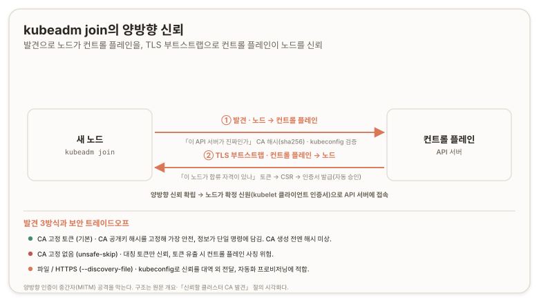

# kubeadm join {#kubeadm-join}

> **원문:** [kubeadm join](https://kubernetes.io/docs/reference/setup-tools/kubeadm/kubeadm-join/) · The Kubernetes Authors · [CC BY 4.0](https://creativecommons.org/licenses/by/4.0/)
>
> 이 문서는 원문의 절 순서와 계층을 보존해 옮기고 역자 주를 더했다. 문서 본문은 [CC BY 4.0](https://creativecommons.org/licenses/by/4.0/)을 따른다. 비공식 번역이며 원저작자와 프로젝트의 공인을 받지 않았다. 원문과 번역이 어긋날 경우 원문이 우선한다.
>
> 원문 시점 2025-04-18 · 번역 2026-07-09

## 결론 {#conclusion}

`kubeadm join`은 새 노드를 초기화해 기존 kubeadm 클러스터에 합류시키는 명령이다. 합류의 핵심은 양방향 신뢰(bidirectional trust) 확립이다. 발견(discovery)으로 노드가 컨트롤 플레인을 신뢰하고, TLS 부트스트랩(TLS bootstrap)으로 컨트롤 플레인이 노드를 신뢰한다.

발견 방식은 세 가지이며 보안 트레이드오프가 다르다. 기본은 CA 공개 키 해시를 고정하는 토큰 기반 발견(`--discovery-token` + `--discovery-token-ca-cert-hash`)이다. 해시를 미리 알 수 없으면 검증을 건너뛰는 방식(`--discovery-token-unsafe-skip-ca-verification`)이 있으나 컨트롤 플레인 사칭(impersonation)에 노출된다. 자동화에는 kubeconfig 형식의 파일·HTTPS 기반 발견이 적합하다.

TLS 부트스트랩은 공유 토큰으로 임시 인증해 CSR(Certificate Signing Request, 인증서 서명 요청)을 제출하고, 기본적으로 컨트롤 플레인이 이를 자동 승인한다. 워커 노드는 발견·TLS 부트스트랩·kubelet 설정을 거치고, 컨트롤 플레인 노드는 인증서 내려받기·매니페스트/인증서/kubeconfig 생성·etcd 멤버 추가가 더해진다. 보안을 더 조이려면 CSR 자동 승인이나 `cluster-info` ConfigMap 공개 접근을 끌 수 있다.

## 개요 {#synopsis}

이 명령은 새 Kubernetes 노드를 초기화해 기존 클러스터에 합류시킨다. 기존 클러스터에 합류시키려는 아무 머신에서나 실행한다.

kubeadm으로 초기화한 클러스터에 합류할 때는 양방향 신뢰를 확립해야 한다. 이는 발견(노드가 Kubernetes 컨트롤 플레인을 신뢰하게 함)과 TLS 부트스트랩(Kubernetes 컨트롤 플레인이 노드를 신뢰하게 함)으로 나뉜다.



*이 그림은 원문 개요와 「신뢰할 클러스터 CA 발견」 절을 구조 관점에서 시각화한 것이다(논리적 추론에 따른 배치). 발견의 입력인 토큰·CA는 앞서 옮긴 kubeadm init의 `bootstrap-token` 페이즈가 만든다.*

발견에는 두 가지 주요 방식이 있다. 첫째는 API 서버의 IP 주소와 함께 공유 토큰을 쓰는 것이다. 둘째는 파일(표준 kubeconfig 파일의 부분집합)을 제공하는 것이다. 발견/kubeconfig 파일은 token, client-go 인증 플러그인("exec"), "tokenFile", "authProvider"를 지원한다. 이 파일은 로컬 파일이거나 HTTPS URL로 내려받을 수 있다. 형식은 `kubeadm join --discovery-token abcdef.1234567890abcdef 1.2.3.4:6443`, `kubeadm join --discovery-file path/to/file.conf`, 또는 `kubeadm join --discovery-file https://url/file.conf`이다. 한 가지 형식만 쓸 수 있다. 발견 정보를 URL에서 로드하는 경우 HTTPS를 반드시 써야 한다. 또한 그 경우 호스트에 설치된 CA 번들로 연결을 검증한다. 둘째는 파일(표준 kubeconfig 파일의 부분집합)을 제공하는 것이다. 발견/kubeconfig 파일은 token, client-go 인증 플러그인("exec"), "tokenFile", "authProvider"를 지원한다. 이 파일은 로컬 파일이거나 HTTPS URL로 내려받을 수 있다. 형식은 `kubeadm join --discovery-token abcdef.1234567890abcdef 1.2.3.4:6443`, `kubeadm join --discovery-file path/to/file.conf`, 또는 `kubeadm join --discovery-file https://url/file.conf`이다. 한 가지 형식만 쓸 수 있다. 발견 정보를 URL에서 로드하는 경우 HTTPS를 반드시 써야 한다. 또한 그 경우 호스트에 설치된 CA 번들로 연결을 검증한다.

발견에 공유 토큰을 쓴다면, Kubernetes 컨트롤 플레인이 제시하는 루트 인증 기관(CA) 공개 키를 검증하도록 `--discovery-token-ca-cert-hash` 플래그도 전달해야 한다. 이 플래그의 값은 `<hash-type>:<hex-encoded-value>`로 지정하며, 지원되는 해시 타입은 "sha256"이다. 해시는 Subject Public Key Info(SPKI) 객체의 바이트에 대해 계산한다([RFC7469](https://tools.ietf.org/html/rfc7469#section-2.4)와 동일). 이 값은 `kubeadm init` 출력에서 얻거나 표준 도구로 계산할 수 있다. `--discovery-token-ca-cert-hash` 플래그는 여러 개의 공개 키를 허용하도록 여러 번 반복할 수 있다.

CA 공개 키 해시를 미리 알 수 없다면, `--discovery-token-unsafe-skip-ca-verification` 플래그를 전달해 이 검증을 비활성화할 수 있다. 다른 노드가 Kubernetes 컨트롤 플레인을 사칭할 수 있게 되므로 이는 kubeadm 보안 모델을 약화시킨다.

TLS 부트스트랩 메커니즘도 공유 토큰으로 구동된다. 이는 로컬에서 생성한 키 쌍에 대한 CSR을 제출하기 위해 Kubernetes 컨트롤 플레인과 임시로 인증하는 데 쓰인다. 기본적으로 kubeadm은 이 서명 요청을 자동 승인하도록 Kubernetes 컨트롤 플레인을 구성한다. 이 토큰은 `--tls-bootstrap-token abcdef.1234567890abcdef` 플래그로 전달한다.

흔히 두 부분에 같은 토큰을 쓴다. 이 경우 각 토큰을 개별 지정하는 대신 `--token` 플래그를 쓸 수 있다.

`join [api-server-endpoint]` 명령은 다음 페이즈를 실행한다.

- `preflight`: 조인 프리플라이트 검사 실행
- `control-plane-prepare`: 컨트롤 플레인 서빙을 위한 머신 준비
  - `/download-certs`: `kubeadm-certs` Secret에서 컨트롤 플레인 노드 간 공유 인증서 내려받기
  - `/certs`: 새 컨트롤 플레인 컴포넌트용 인증서 생성
  - `/kubeconfig`: 새 컨트롤 플레인 컴포넌트용 kubeconfig 생성
  - `/control-plane`: 새 컨트롤 플레인 컴포넌트용 매니페스트 생성
- `kubelet-start`: kubelet 설정·인증서를 기록하고 kubelet을 (재)시작
- `etcd-join`: 컨트롤 플레인 노드를 위해 etcd에 조인
- `kubelet-wait-bootstrap`: kubelet이 스스로 부트스트랩할 때까지 대기
- `control-plane-join`: 머신을 컨트롤 플레인 인스턴스로 조인
  - `/mark-control-plane`: 노드를 컨트롤 플레인으로 표시
- `wait-control-plane`: 컨트롤 플레인 기동 대기

```
kubeadm join [api-server-endpoint] [flags]
```

## 플래그 {#options}

| 플래그 | 기본값 | 설명 |
| --- | --- | --- |
| `--apiserver-advertise-address string` | | 노드가 새 컨트롤 플레인 인스턴스를 호스팅해야 한다면, API 서버가 수신 대기 중임을 알릴 IP 주소. 미설정 시 기본 네트워크 인터페이스를 사용한다. |
| `--apiserver-bind-port int32` | `6443` | 노드가 새 컨트롤 플레인 인스턴스를 호스팅해야 한다면, API 서버가 바인딩할 포트. |
| `--certificate-key string` | | init이 업로드한 인증서 시크릿을 복호화할 키. 인증서 키는 크기 32바이트의 AES 키를 16진수로 인코딩한 문자열이다. |
| `--config string` | | kubeadm 설정 파일 경로. |
| `--control-plane` | | 이 노드에 새 컨트롤 플레인 인스턴스를 생성한다. |
| `--cri-socket string` | | 접속할 CRI(Container Runtime Interface) 소켓 경로. 비우면 kubeadm이 자동 감지를 시도한다. CRI를 둘 이상 설치했거나 비표준 소켓일 때만 사용한다. |
| `--discovery-file string` | | 파일 기반 발견용. 클러스터 정보를 로드할 파일 또는 URL. |
| `--discovery-token string` | | 토큰 기반 발견용. API 서버에서 가져온 클러스터 정보를 검증하는 토큰. |
| `--discovery-token-ca-cert-hash strings` | | 토큰 기반 발견용. 루트 CA 공개 키가 이 해시와 일치하는지 검증한다(형식 `<type>:<value>`). |
| `--discovery-token-unsafe-skip-ca-verification` | | 토큰 기반 발견용. `--discovery-token-ca-cert-hash` 고정 없이 조인을 허용한다. |
| `--dry-run` | | 변경을 적용하지 않고 수행될 작업만 출력한다. |
| `-h, --help` | | join 도움말. |
| `--ignore-preflight-errors strings` | | 오류를 경고로 표시할 검사 목록. 예: `IsPrivilegedUser,Swap`. 값이 `all`이면 모든 검사의 오류를 무시한다. |
| `--node-name string` | | 노드 이름을 지정한다. |
| `--patches string` | | `target[suffix][+patchtype].extension` 형식의 파일을 담은 디렉터리 경로. 예: `kube-apiserver0+merge.yaml` 또는 단순히 `etcd.json`. `target`은 `kube-apiserver`, `kube-controller-manager`, `kube-scheduler`, `etcd`, `kubeletconfiguration`, `corednsdeployment` 중 하나다. `patchtype`은 `strategic`, `merge`, `json` 중 하나이며 kubectl이 지원하는 패치 포맷과 대응한다. 기본 `patchtype`은 `strategic`이다. `extension`은 `json` 또는 `yaml`이어야 한다. `suffix`는 패치 적용 순서를 알파벳·숫자순으로 정하는 선택적 문자열이다. |
| `--skip-phases strings` | | 건너뛸 페이즈 목록. |
| `--tls-bootstrap-token string` | | 노드 조인 중 Kubernetes 컨트롤 플레인과 임시로 인증하는 데 쓸 토큰을 지정한다. |
| `--token string` | | `discovery-token`과 `tls-bootstrap-token` 값이 제공되지 않을 때 둘 다에 이 토큰을 사용한다. |

## 상위 명령 상속 플래그 {#inherited-options}

| 플래그 | 설명 |
| --- | --- |
| `--rootfs string` | '실제' 호스트 루트 파일시스템 경로. kubeadm이 지정한 경로로 chroot하게 만든다. |

## 조인 워크플로 {#join-workflow}

`kubeadm join`은 Kubernetes 워커 노드 또는 컨트롤 플레인 노드를 부트스트랩해 클러스터에 추가한다. 이 작업은 워커 노드의 경우 다음 단계로 구성된다.

1. kubeadm이 API 서버에서 필요한 클러스터 정보를 내려받는다. 기본적으로 부트스트랩 토큰과 CA 키 해시로 그 데이터의 진위를 검증한다. 루트 CA는 파일이나 URL로 직접 발견할 수도 있다.
2. 클러스터 정보가 파악되면 kubelet이 TLS 부트스트랩 과정을 시작할 수 있다.

   TLS 부트스트랩은 공유 토큰으로 Kubernetes API 서버와 임시 인증해 CSR을 제출한다. 기본적으로 컨트롤 플레인이 이 CSR 요청에 자동으로 서명한다.
3. 마지막으로 kubeadm이 노드에 부여된 확정 신원으로 API 서버에 접속하도록 로컬 kubelet을 구성한다.

컨트롤 플레인 노드의 경우 추가 단계가 수행된다.

1. 클러스터에서 컨트롤 플레인 노드 간 공유 인증서 내려받기(사용자가 명시적으로 요청한 경우).
2. 컨트롤 플레인 컴포넌트 매니페스트·인증서·kubeconfig 생성.
3. 새 로컬 etcd 멤버 추가.

## 페이즈 단위 실행 {#join-phases}

Kubeadm은 `kubeadm join phase`로 노드를 페이즈 단위로 클러스터에 합류시킬 수 있게 한다.

정렬된 페이즈·하위 페이즈 목록은 `kubeadm join --help`로 확인할 수 있다. 목록은 도움말 화면 상단에 위치하며 각 페이즈에는 설명이 붙는다. `kubeadm join`을 그냥 호출하면 모든 페이즈와 하위 페이즈가 이 순서 그대로 실행된다는 점에 유의한다.

일부 페이즈는 고유한 플래그를 가진다. 사용 가능한 옵션 목록을 보려면 `--help`를 붙인다. 예:

```shell
kubeadm join phase kubelet-start --help
```

[kubeadm init phase](https://kubernetes.io/docs/reference/setup-tools/kubeadm/kubeadm-init/#init-phases) 명령과 마찬가지로, `kubeadm join phase`는 `--skip-phases` 플래그로 페이즈 목록을 건너뛸 수 있다.

예:

```shell
sudo kubeadm join --skip-phases=preflight --config=config.yaml
```

> **기능 상태:** Kubernetes v1.22 [beta]

또는 `JoinConfiguration`의 `skipPhases` 필드를 쓸 수도 있다.

## 신뢰할 클러스터 CA 발견 {#discovering-ca}

kubeadm 발견에는 여러 옵션이 있고, 각각 보안 트레이드오프가 있다. 환경에 맞는 방법은 노드를 어떻게 프로비저닝하는지, 그리고 네트워크와 노드 수명주기에 대해 어떤 보안 기대치를 갖는지에 달려 있다.

> **역자 주 · 검증**
> 원문 최종 수정은 2025-04-18(오타 수정 커밋)이지만, 발견 방식과 CSR 자동 승인 모델은 번역 시점(2026-07-09)에도 그대로 유효하다. `kubeadm:node-autoapprove-bootstrap` clusterrolebinding, `--discovery-token-ca-cert-hash` 고정, `--discovery-token-unsafe-skip-ca-verification`가 모두 현행 kubeadm 문서와 동일하다(생성 레퍼런스 페이지는 v1.35 반영으로 2025-12-21 갱신). 앞서 확인한 대로 현재 안정 버전은 v1.36이다. 출처: [kubeadm join 공식 문서](https://kubernetes.io/docs/reference/setup-tools/kubeadm/kubeadm-join/), [website 원본 소스](https://github.com/kubernetes/website/blob/main/content/en/docs/reference/setup-tools/kubeadm/kubeadm-join.md).

### CA 고정 토큰 기반 발견 {#token-ca-pinning}

kubeadm의 기본 모드다. 이 모드에서 kubeadm은 클러스터 구성(루트 CA 포함)을 내려받아, 토큰으로 검증하는 동시에 루트 CA 공개 키가 제공된 해시와 일치하는지, 그리고 API 서버 인증서가 그 루트 CA 아래에서 유효한지 검증한다.

CA 키 해시는 `sha256:<hex_encoded_hash>` 형식이다. 기본적으로 해시 값은 `kubeadm init` 명령의 끝이나 `kubeadm token create --print-join-command` 명령의 출력에 인쇄된다. 표준 형식이며([RFC7469](https://tools.ietf.org/html/rfc7469#section-2.4) 참조) 서드파티 도구나 프로비저닝 시스템으로도 계산할 수 있다. 예를 들어 OpenSSL CLI를 쓰면:

```shell
openssl x509 -pubkey -in /etc/kubernetes/pki/ca.crt | openssl rsa -pubin -outform der 2>/dev/null | openssl dgst -sha256 -hex | sed 's/^.* //'
```

**`kubeadm join` 명령 예시:**

워커 노드:

```shell
kubeadm join --discovery-token abcdef.1234567890abcdef --discovery-token-ca-cert-hash sha256:1234..cdef 1.2.3.4:6443
```

컨트롤 플레인 노드:

```shell
kubeadm join --discovery-token abcdef.1234567890abcdef --discovery-token-ca-cert-hash sha256:1234..cdef --control-plane 1.2.3.4:6443
```

`kubeadm init` 명령을 `--upload-certs`로 실행했다면, 컨트롤 플레인 노드에 대해 `--certificate-key`와 함께 `join`을 호출해 이 노드로 인증서를 복사할 수도 있다.

**장점:**

- 다른 워커 노드나 네트워크가 침해되더라도, 부트스트랩 노드가 컨트롤 플레인 노드의 신뢰 루트를 안전하게 발견할 수 있다.
- 필요한 모든 정보가 단일 `kubeadm join` 명령에 담기므로 수동 실행에 편리하다.

**단점:**

- CA 해시는 보통 컨트롤 플레인 노드가 프로비저닝되기 전에는 알 수 없어, kubeadm을 쓰는 자동화 프로비저닝 도구를 만들기가 더 어려울 수 있다. CA를 미리 생성하면 이 제약을 우회할 수 있다.

### CA 고정 없는 토큰 기반 발견 {#token-no-pinning}

이 모드는 컨트롤 플레인의 신뢰 루트를 확립하는 발견 정보에 서명(HMAC-SHA256)하는 대칭 토큰에만 의존한다. 이 모드를 쓰려면 합류하는 노드가 `--discovery-token-unsafe-skip-ca-verification`으로 CA 공개 키 해시 검증을 건너뛰어야 한다. 가능하면 다른 모드를 고려해야 한다.

**`kubeadm join` 명령 예시:**

```shell
kubeadm join --token abcdef.1234567890abcdef --discovery-token-unsafe-skip-ca-verification 1.2.3.4:6443
```

**장점:**

- 여전히 다수의 네트워크 수준 공격을 막아 준다.
- 토큰을 미리 생성해 컨트롤 플레인 노드와 워커 노드에 공유할 수 있어, 조율 없이 병렬로 부트스트랩할 수 있다. 덕분에 다양한 프로비저닝 시나리오에서 쓸 수 있다.

**단점:**

- 공격자가 어떤 취약점으로 부트스트랩 토큰을 훔칠 수 있다면, 그 토큰을(네트워크 수준 접근과 함께) 써서 다른 부트스트랩 노드들에게 컨트롤 플레인 노드를 사칭할 수 있다. 환경에 따라 이 트레이드오프가 적절할 수도, 아닐 수도 있다.

### 파일 또는 HTTPS 기반 발견 {#file-https-discovery}

이는 컨트롤 플레인 노드와 부트스트랩 노드 사이에 신뢰 루트를 확립하는 대역 외(out-of-band) 방법을 제공한다. kubeadm으로 자동화 프로비저닝을 구축한다면 이 모드를 고려한다. 발견 파일 형식은 일반 Kubernetes [kubeconfig](https://kubernetes.io/docs/tasks/access-application-cluster/configure-access-multiple-clusters/) 파일이다.

발견 파일에 자격 증명이 없는 경우 TLS 발견 토큰이 사용된다.

**`kubeadm join` 명령 예시:**

- `kubeadm join --discovery-file path/to/file.conf` (로컬 파일)
- `kubeadm join --discovery-file https://url/file.conf` (원격 HTTPS URL)

**장점:**

- 네트워크나 다른 워커 노드가 침해되더라도, 부트스트랩 노드가 컨트롤 플레인 노드의 신뢰 루트를 안전하게 발견할 수 있다.

**단점:**

- 발견 정보를 컨트롤 플레인 노드에서 부트스트랩 노드로 전달할 수단이 필요하다. 발견 파일에 자격 증명이 담겨 있으면 비밀로 유지하고 안전한 채널로 전송해야 한다. 클라우드 공급자나 프로비저닝 도구로 가능할 수 있다.

### kubeadm join의 커스텀 kubelet 자격 증명 사용 {#custom-kubelet-credentials}

`kubeadm join`이 미리 정의된 kubelet 자격 증명을 쓰고 새 노드에 대한 클라이언트 TLS 부트스트랩과 CSR 승인을 건너뛰게 하려면:

1. `/etc/kubernetes/pki/ca.key`를 가진, 클러스터의 동작 중인 컨트롤 플레인 노드에서 `kubeadm kubeconfig user --org system:nodes --client-name system:node:$NODE > kubelet.conf`를 실행한다. `$NODE`는 새 노드의 이름으로 설정해야 한다.
2. 결과 `kubelet.conf`를 수동으로 수정해 클러스터 이름과 서버 엔드포인트를 조정하거나, `kubeadm kubeconfig user --config`를 실행한다(`InitConfiguration`을 받는다).

클러스터에 `ca.key` 파일이 없으면 `kubelet.conf`에 임베드된 인증서를 외부에서 서명해야 한다. 추가 정보는 [PKI 인증서와 요구 사항](https://kubernetes.io/docs/setup/best-practices/certificates/)과 [kubeadm 인증서 관리](https://kubernetes.io/docs/tasks/administer-cluster/kubeadm/kubeadm-certs/#external-ca-mode)를 참조한다.

3. 결과 `kubelet.conf`를 새 노드의 `/etc/kubernetes/kubelet.conf`로 복사한다.
4. 새 노드에서 `--ignore-preflight-errors=FileAvailable--etc-kubernetes-kubelet.conf` 플래그와 함께 `kubeadm join`을 실행한다.

## 설치 보안 강화 {#securing-more}

kubeadm의 기본값이 모두에게 맞지는 않는다. 이 절은 일부 사용성을 희생하는 대신 kubeadm 설치를 더 조이는 방법을 다룬다.

### 노드 클라이언트 인증서 자동 승인 비활성화 {#disable-auto-approval}

기본적으로, 부트스트랩 토큰으로 인증했을 때 kubelet의 모든 클라이언트 인증서 요청을 사실상 승인하는 CSR 자동 승인기(auto-approver)가 활성화되어 있다. 클러스터가 kubelet 클라이언트 인증서를 자동 승인하지 않게 하려면 다음 명령으로 끌 수 있다.

```shell
kubectl delete clusterrolebinding kubeadm:node-autoapprove-bootstrap
```

그 후 `kubeadm join`은 관리자가 진행 중인 CSR을 수동으로 승인할 때까지 블록된다.

1. `kubectl get csr`로 원래 CSR이 Pending 상태임을 볼 수 있다.

   ```shell
   kubectl get csr
   ```

   출력은 다음과 비슷하다.

   ```
   NAME                                                   AGE       REQUESTOR                 CONDITION
   node-csr-c69HXe7aYcqkS1bKmH4faEnHAWxn6i2bHZ2mD04jZyQ   18s       system:bootstrap:878f07   Pending
   ```

2. `kubectl certificate approve`로 관리자가 CSR을 승인할 수 있다. 이 작업은 인증서 서명 컨트롤러에게, CSR에 요청된 속성으로 요청자에게 인증서를 발급하라고 지시한다.

   ```shell
   kubectl certificate approve node-csr-c69HXe7aYcqkS1bKmH4faEnHAWxn6i2bHZ2mD04jZyQ
   ```

   출력은 다음과 비슷하다.

   ```
   certificatesigningrequest "node-csr-c69HXe7aYcqkS1bKmH4faEnHAWxn6i2bHZ2mD04jZyQ" approved
   ```

3. 이는 CSR 리소스를 Active 상태로 바꾼다.

   ```shell
   kubectl get csr
   ```

   출력은 다음과 비슷하다.

   ```
   NAME                                                   AGE       REQUESTOR                 CONDITION
   node-csr-c69HXe7aYcqkS1bKmH4faEnHAWxn6i2bHZ2mD04jZyQ   1m        system:bootstrap:878f07   Approved,Issued
   ```

이는 `kubectl certificate approve`가 실행된 경우에만 `kubeadm join`이 성공하도록 워크플로를 강제한다.

### cluster-info ConfigMap 공개 접근 차단 {#disable-cluster-info-public}

토큰만을 유일한 검증 정보로 삼아 조인 흐름을 이루기 위해, 컨트롤 플레인 노드의 신원 검증에 필요한 데이터를 담은 ConfigMap이 기본적으로 공개된다. 이 ConfigMap에 비공개 데이터는 없지만, 일부 사용자는 그럼에도 이를 끄고 싶어 할 수 있다. 그렇게 하면 `kubeadm join` 흐름의 `--discovery-token` 플래그를 쓰는 기능이 비활성화된다. 방법은 다음과 같다.

- API 서버에서 `cluster-info` 파일을 가져온다.

```shell
kubectl -n kube-public get cm cluster-info -o jsonpath='{.data.kubeconfig}' | tee cluster-info.yaml
```

출력은 다음과 비슷하다.

```yaml
apiVersion: v1
kind: Config
clusters:
- cluster:
    certificate-authority-data: <ca-cert>
    server: https://<ip>:<port>
  name: ""
contexts: []
current-context: ""
preferences: {}
users: []
```

- `cluster-info.yaml` 파일을 `kubeadm join --discovery-file`의 인자로 쓴다.
- `cluster-info` ConfigMap 공개 접근을 끈다.

```shell
kubectl -n kube-public delete rolebinding kubeadm:bootstrap-signer-clusterinfo
```

이 명령들은 `kubeadm init` 이후, `kubeadm join` 이전에 실행해야 한다.

## 설정 파일 사용 {#config-file}

> **주의:** 설정 파일은 아직 beta로 간주되며 향후 버전에서 바뀔 수 있다.

`kubeadm join`은 명령행 플래그 대신 설정 파일로 구성할 수 있으며, 일부 고급 기능은 설정 파일 옵션으로만 제공된다. 이 파일은 `--config` 플래그로 전달하고 `JoinConfiguration` 구조체를 반드시 포함해야 한다. `--config`를 다른 플래그와 섞는 것은 일부 경우 허용되지 않을 수 있다.

기본 설정은 [kubeadm config print](https://kubernetes.io/docs/reference/setup-tools/kubeadm/kubeadm-config/#cmd-config-print) 명령으로 출력할 수 있다.

최신 버전을 쓰고 있지 않다면 [kubeadm config migrate](https://kubernetes.io/docs/reference/setup-tools/kubeadm/kubeadm-config/#cmd-config-migrate) 명령으로 마이그레이션할 것을 **권장**한다.

설정 필드와 사용법에 대한 더 자세한 정보는 [API 레퍼런스](https://kubernetes.io/docs/reference/config-api/kubeadm-config.v1beta4/)에서 확인할 수 있다.

## 역자 주 · 적용 {#translator-notes-application}

원문 정보에서 도출되는, 일반 독자 누구에게나 성립하는 실습·활용 안내다.

- 기본 모드인 CA 고정 토큰 기반 발견을 쓴다. `--discovery-token-unsafe-skip-ca-verification`는 CA 해시를 미리 알 수 없을 때의 탈출구지만 컨트롤 플레인 사칭에 노출되므로 가능하면 피한다.
- CA 해시와 토큰은 `kubeadm init` 출력에서 얻는다. 토큰이 만료됐거나 조인 명령을 잊었다면 컨트롤 플레인에서 `kubeadm token create --print-join-command`로 새 토큰·해시가 포함된 조인 명령을 통째로 재생성한다.
- 컨트롤 플레인 노드로 조인해 HA를 구성하려면 `--control-plane`과 `--certificate-key`를 함께 쓰되, `kubeadm init`을 `--upload-certs`로 실행했어야 한다. 인증서 업로드 Secret은 2시간 뒤 만료되므로, 만료됐다면 `kubeadm init phase upload-certs --upload-certs`로 재업로드한다.
- 이 문서는 앞서 옮긴 kubeadm init의 짝이다. init이 컨트롤 플레인을 부트스트랩하며 부트스트랩 토큰과 CA를 만들고, join이 그 토큰·CA로 노드를 합류시킨다. 합류한 노드에서 파드는 정적 Pod 메커니즘으로, 컨테이너는 containerd shim으로 뜬다. 네 문서(init·join·정적 Pod·containerd Runtime v2)가 부트스트랩부터 컨테이너 실행까지 한 줄로 이어진다.

<!-- REVIEW-REQUIRED · 경험 슬롯
     직접 실습·검증한 결과가 있으면 아래 블록의 주석을 풀고 1인칭으로 채운다.
     없으면 이 주석 블록째로 삭제한다. 채우지 않은 채 draft를 해제하지 않는다.
> **역자 주 · 적용(경험)**
> <1차 경험을 1인칭으로>
-->

## 참고 출처 {#references}

원문이 링크한 출처:

- [kubeadm init phase](https://kubernetes.io/docs/reference/setup-tools/kubeadm/kubeadm-init/#init-phases)
- [RFC7469 §2.4](https://tools.ietf.org/html/rfc7469#section-2.4)
- [kubeconfig로 여러 클러스터 접근 구성](https://kubernetes.io/docs/tasks/access-application-cluster/configure-access-multiple-clusters/)
- [PKI 인증서와 요구 사항](https://kubernetes.io/docs/setup/best-practices/certificates/)
- [kubeadm 인증서 관리 (external-ca-mode)](https://kubernetes.io/docs/tasks/administer-cluster/kubeadm/kubeadm-certs/#external-ca-mode)
- [kubeadm config print](https://kubernetes.io/docs/reference/setup-tools/kubeadm/kubeadm-config/#cmd-config-print)
- [kubeadm config migrate](https://kubernetes.io/docs/reference/setup-tools/kubeadm/kubeadm-config/#cmd-config-migrate)
- [kubeadm API 레퍼런스 (v1beta4)](https://kubernetes.io/docs/reference/config-api/kubeadm-config.v1beta4/)

역자 검증 출처(번역 시점 사실 확인에 사용):

- [kubeadm join 공식 문서](https://kubernetes.io/docs/reference/setup-tools/kubeadm/kubeadm-join/)
- [website 원본 소스 (kubeadm-join.md)](https://github.com/kubernetes/website/blob/main/content/en/docs/reference/setup-tools/kubeadm/kubeadm-join.md)

## 다음 단계 {#whats-next}

- [kubeadm init](https://kubernetes.io/docs/reference/setup-tools/kubeadm/kubeadm-init/): Kubernetes 컨트롤 플레인 노드 부트스트랩
- [kubeadm token](https://kubernetes.io/docs/reference/setup-tools/kubeadm/kubeadm-token/): `kubeadm join`용 토큰 관리
- [kubeadm reset](https://kubernetes.io/docs/reference/setup-tools/kubeadm/kubeadm-reset/): `kubeadm init` 또는 `kubeadm join`이 호스트에 가한 변경 되돌리기
