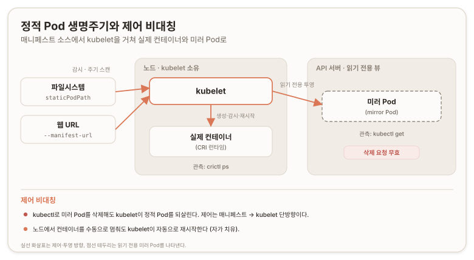

# 정적 Pod 생성 {#create-static-pods}

> **원문:** [Create static Pods](https://kubernetes.io/docs/tasks/configure-pod-container/static-pod/) · The Kubernetes Authors · [CC BY 4.0](https://creativecommons.org/licenses/by/4.0/)
>
> 이 문서는 원문의 절 순서와 계층을 보존해 옮기고 역자 주를 더했다. 문서 본문은 [CC BY 4.0](https://creativecommons.org/licenses/by/4.0/)을 따른다. 비공식 번역이며 원저작자와 프로젝트의 공인을 받지 않았다. 원문과 번역이 어긋날 경우 원문이 우선한다.
>
> 원문 시점 2026-04-16 · 번역 2026-07-09

이 문서는 노드에서 정적 Pod(static Pod)를 만드는 방법을 다룬다. 정적 Pod가 무엇이고 언제 쓰는지에 대한 개요는 [Static Pods](https://kubernetes.io/docs/concepts/workloads/pods/static-pods/) 개념 문서를 참조한다.

## 결론 {#conclusion}

정적 Pod는 노드의 kubelet이 직접 실행하고 감시하는 Pod다. 만드는 방식은 두 가지다. kubelet이 주기적으로 스캔하는 파일시스템 디렉터리에 매니페스트를 두는 방식(`staticPodPath`)과 웹 URL로 매니페스트를 제공하는 방식(`--manifest-url`)이다.

kubelet은 기동 시 정의된 정적 Pod를 모두 자동으로 시작하고, 각 정적 Pod에 대응하는 미러 Pod(mirror Pod)를 API 서버에 만들어 `kubectl`로 조회할 수 있게 한다. 다만 미러 Pod는 `kubectl`로 제어할 수 없어서 삭제해도 kubelet이 실제 정적 Pod를 되살리며, 노드에서 컨테이너를 수동으로 멈춰도 다시 띄운다. 매니페스트 파일을 디렉터리에 넣고 빼는 것만으로 정적 Pod를 동적으로 추가·제거할 수 있다.



*이 그림은 원문이 절차와 출력으로 서술한 동작을 한 장으로 종합한 것이다(논리적 추론에 따른 배치). 대응하는 단일 도형은 원문에 없다.*

## 시작 전 준비 {#before-you-begin}

Kubernetes 클러스터가 있어야 하고, `kubectl` 명령행 도구가 클러스터와 통신하도록 설정되어 있어야 한다. 컨트롤 플레인 호스트로 동작하지 않는 노드가 최소 두 개인 클러스터에서 이 튜토리얼을 실행하기를 권장한다. 클러스터가 없다면 [minikube](https://minikube.sigs.k8s.io/docs/tutorials/multi_node/)로 하나 만들거나 다음 Kubernetes 플레이그라운드 중 하나를 쓸 수 있다.

- [iximiuz Labs](https://labs.iximiuz.com/playgrounds?category=kubernetes&filter=all)
- [Killercoda](https://killercoda.com/playgrounds/scenario/kubernetes)
- [KodeKloud](https://kodekloud.com/public-playgrounds)

버전을 확인하려면 `kubectl version`을 입력한다.

이 문서는 Pod 실행에 [CRI-O](https://cri-o.io/#what-is-cri-o)를 쓰고 노드가 Fedora 운영체제를 실행한다고 가정한다. 다른 배포판이나 다른 Kubernetes 설치 환경에서는 절차가 달라질 수 있다.

## 정적 Pod 구성 방식 {#static-pod-creation}

정적 Pod는 [파일시스템에 호스팅된 설정 파일](#configuration-files) 또는 [웹에 호스팅된 설정 파일](#pods-created-via-http) 중 하나로 구성할 수 있다.

### 파일시스템 호스팅 정적 Pod 매니페스트 {#configuration-files}

매니페스트는 특정 디렉터리에 놓인 JSON 또는 YAML 형식의 표준 Pod 정의다. [kubelet 설정 파일](https://kubernetes.io/docs/reference/config-api/kubelet-config.v1beta1/)의 `staticPodPath: <디렉터리>` 필드를 쓰면, kubelet이 그 디렉터리를 주기적으로 스캔해 YAML/JSON 파일이 나타나거나 사라짐에 따라 정적 Pod를 생성·삭제한다. kubelet은 지정한 디렉터리를 스캔할 때 점(`.`)으로 시작하는 파일은 무시한다.

::: warning 주의
kubelet은 정적 Pod 디렉터리에서 **점으로 시작하지 않는 모든 파일**을 처리하며, 파일 확장자로 걸러내지 않는다. 예를 들어 `cp kube-apiserver.yaml kube-apiserver.yaml.backup`으로 매니페스트 백업을 만들면 kubelet은 **두 파일 모두**를 읽어 각각으로 정적 Pod를 만들려 한다. 두 파일이 같은 이름의 Pod를 정의하면 결과 동작은 정의되어 있지 않으며, 현재 매니페스트 대신 백업의 오래된 스펙이 조용히 적용될 수 있다. 백업을 만든다면 정적 Pod 디렉터리 **바깥**(예: `/etc/kubernetes/backup/`)에 둔다.
:::

예를 들어 간단한 웹 서버를 정적 Pod로 띄우는 방법은 다음과 같다.

1. 정적 Pod를 실행할 노드를 고른다. 이 예시에서는 `my-node1`이다.

   ```shell
   ssh my-node1
   ```

2. 디렉터리를 하나 정하고(예: `/etc/kubernetes/manifests`), 그곳에 웹 서버 Pod 정의를 놓는다. 예를 들어 `/etc/kubernetes/manifests/static-web.yaml`:

   ```shell
   # kubelet이 실행 중인 노드에서 이 명령을 실행한다
   mkdir -p /etc/kubernetes/manifests/
   cat <<EOF >/etc/kubernetes/manifests/static-web.yaml
   apiVersion: v1
   kind: Pod
   metadata:
     name: static-web
     labels:
       role: myrole
   spec:
     containers:
       - name: web
         image: nginx
         ports:
           - name: web
             containerPort: 80
             protocol: TCP
   EOF
   ```

3. 해당 노드의 kubelet이 [kubelet 설정 파일](https://kubernetes.io/docs/reference/config-api/kubelet-config.v1beta1/)에서 `staticPodPath` 값을 갖도록 설정한다. 자세한 내용은 [설정 파일로 kubelet 파라미터 설정](https://kubernetes.io/docs/tasks/administer-cluster/kubelet-config-file/)을 참조한다.

   대안이자 deprecated된 방법은, 명령행 인자로 해당 노드의 kubelet이 로컬에서 정적 Pod 매니페스트를 찾도록 설정하는 것이다. 이 deprecated 방법을 쓰려면 kubelet을 `--pod-manifest-path=/etc/kubernetes/manifests/` 인자와 함께 시작한다.

   > **역자 주 · 검증**
   > `--pod-manifest-path` 명령행 인자가 deprecated라는 서술은 번역 시점(2026-07-09)에도 유효하다. 이 플래그는 kubelet의 `--config`가 가리키는 설정 파일의 `staticPodPath` 필드로 대체되었고, 플래그 자체는 아직 동작하되 사용 시 deprecation 경고를 낸다([kubernetes/kubernetes#70745](https://github.com/kubernetes/kubernetes/issues/70745)). 반면 웹 호스팅 방식의 `--manifest-url`은 현행 문서(2026-04-16 기준)에서 deprecated로 표시되지 않은 정식 방법이다. 대체 필드 근거: [설정 파일로 kubelet 파라미터 설정](https://kubernetes.io/docs/tasks/administer-cluster/kubelet-config-file/).

4. kubelet을 재시작한다. Fedora에서는 다음을 실행한다.

   ```shell
   # kubelet이 실행 중인 노드에서 이 명령을 실행한다
   systemctl restart kubelet
   ```

### 웹 호스팅 정적 Pod 매니페스트 {#pods-created-via-http}

kubelet은 `--manifest-url=<URL>` 인자로 지정된 파일을 주기적으로 내려받아 Pod 정의를 담은 JSON/YAML 파일로 해석한다. [파일시스템 호스팅 매니페스트](#configuration-files)와 마찬가지로 kubelet이 일정에 따라 매니페스트를 다시 가져온다. 정적 Pod 목록에 변경이 있으면 kubelet이 이를 적용한다.

이 방법을 쓰려면 다음과 같이 한다.

1. YAML 파일을 만들어 웹 서버에 올리고, 그 파일의 URL을 kubelet에 전달할 수 있게 한다.

   ```yaml
   apiVersion: v1
   kind: Pod
   metadata:
     name: static-web
     labels:
       role: myrole
   spec:
     containers:
       - name: web
         image: nginx
         ports:
           - name: web
             containerPort: 80
             protocol: TCP
   ```

2. 선택한 노드의 kubelet이 이 웹 매니페스트를 쓰도록, kubelet을 `--manifest-url=<manifest-url>`과 함께 실행하도록 설정한다. Fedora에서는 `/etc/kubernetes/kubelet`을 편집해 다음 줄을 넣는다.

   ```shell
   KUBELET_ARGS="--cluster-dns=10.254.0.10 --cluster-domain=kube.local --manifest-url=<manifest-url>"
   ```

3. kubelet을 재시작한다. Fedora에서는 다음을 실행한다.

   ```shell
   # kubelet이 실행 중인 노드에서 이 명령을 실행한다
   systemctl restart kubelet
   ```

## 정적 Pod 동작 관찰 {#behavior-of-static-pods}

kubelet이 시작되면 정의된 정적 Pod를 모두 자동으로 시작한다. 정적 Pod를 정의하고 kubelet을 재시작했으므로, 새 정적 Pod는 이미 실행 중이어야 한다.

실행 중인 컨테이너(정적 Pod 포함)는 노드에서 다음을 실행해 볼 수 있다.

```shell
# kubelet이 실행 중인 노드에서 이 명령을 실행한다
crictl ps
```

출력은 다음과 비슷할 수 있다.

```console
CONTAINER       IMAGE                                 CREATED           STATE      NAME    ATTEMPT    POD ID
129fd7d382018   docker.io/library/nginx@sha256:...    11 minutes ago    Running    web     0          34533c6729106
```

::: info 참고
`crictl`은 이미지 URI와 SHA-256 체크섬을 출력한다. `NAME`은 다음과 더 비슷하게 보인다: `docker.io/library/nginx@sha256:0d17b565c37bcbd895e9d92315a05c1c3c9a29f762b011a10c54a66cd53c9b31`.
:::

API 서버에서 미러 Pod를 볼 수 있다.

```shell
kubectl get pods
```

```console
NAME                  READY   STATUS    RESTARTS        AGE
static-web-my-node1   1/1     Running   0               2m
```

> **역자 주 · 보충**
> 미러 Pod(mirror Pod)는 kubelet이 각 정적 Pod에 대응해 API 서버에 만드는 읽기 전용 투영이다. 정적 Pod를 클러스터 API로 조회할 수 있게 해주지만 소유권은 노드의 kubelet에 있어서, API 서버 쪽에서 삭제·수정을 시도해도 실제 Pod에는 반영되지 않는다. 출처: [Static Pods](https://kubernetes.io/docs/concepts/workloads/pods/static-pods/).

::: info 참고
kubelet이 API 서버에 미러 Pod를 만들 권한이 있는지 확인한다. 권한이 없으면 생성 요청이 API 서버에 의해 거부된다.
:::

정적 Pod의 [레이블](https://kubernetes.io/docs/concepts/overview/working-with-objects/labels)은 미러 Pod로 전파된다. 이 레이블을 [셀렉터](https://kubernetes.io/docs/concepts/overview/working-with-objects/labels/) 등으로 평소처럼 쓸 수 있다.

`kubectl`로 API 서버에서 미러 Pod를 삭제해도 kubelet은 정적 Pod를 제거하지 *않는다*.

```shell
kubectl delete pod static-web-my-node1
```

```console
pod "static-web-my-node1" deleted
```

Pod가 여전히 실행 중임을 볼 수 있다.

```shell
kubectl get pods
```

```console
NAME                  READY   STATUS    RESTARTS   AGE
static-web-my-node1   1/1     Running   0          4s
```

kubelet이 실행 중인 노드로 돌아가 컨테이너를 수동으로 멈춰 볼 수 있다. 얼마 뒤 kubelet이 이를 알아채고 Pod를 자동으로 재시작하는 것을 볼 수 있다.

```shell
# kubelet이 실행 중인 노드에서 이 명령들을 실행한다
crictl stop 129fd7d382018 # 사용 중인 컨테이너 ID로 바꾼다
sleep 20
crictl ps
```

```console
CONTAINER       IMAGE                                 CREATED           STATE      NAME    ATTEMPT    POD ID
89db4553e1eeb   docker.io/library/nginx@sha256:...    19 seconds ago    Running    web     1          34533c6729106
```

올바른 컨테이너를 찾았으면 `crictl`로 그 컨테이너의 로그를 가져올 수 있다.

```shell
# 컨테이너가 실행 중인 노드에서 이 명령들을 실행한다
crictl logs <container_id>
```

```console
10.240.0.48 - - [16/Nov/2022:12:45:49 +0000] "GET / HTTP/1.1" 200 612 "-" "curl/7.47.0" "-"
10.240.0.48 - - [16/Nov/2022:12:45:50 +0000] "GET / HTTP/1.1" 200 612 "-" "curl/7.47.0" "-"
10.240.0.48 - - [16/Nove/2022:12:45:51 +0000] "GET / HTTP/1.1" 200 612 "-" "curl/7.47.0" "-"
```

`crictl`로 디버깅하는 방법을 더 알아보려면 [crictl로 Kubernetes 노드 디버깅](https://kubernetes.io/docs/tasks/debug/debug-cluster/crictl/)을 참조한다.

## 정적 Pod의 동적 추가·제거 {#dynamic-addition-and-removal-of-static-pods}

실행 중인 kubelet은 설정된 디렉터리(이 예시에서는 `/etc/kubernetes/manifests`)의 변경을 주기적으로 스캔해, 이 디렉터리에 파일이 나타나거나 사라짐에 따라 Pod를 추가·제거한다.

```shell
# 이 예시는 파일시스템 호스팅 정적 Pod 설정을 쓴다고 가정한다
# 컨테이너가 실행 중인 노드에서 이 명령들을 실행한다
#
mv /etc/kubernetes/manifests/static-web.yaml /tmp
sleep 20
crictl ps
# nginx 컨테이너가 실행되고 있지 않음을 볼 수 있다
mv /tmp/static-web.yaml  /etc/kubernetes/manifests/
sleep 20
crictl ps
```

```console
CONTAINER       IMAGE                                 CREATED           STATE      NAME    ATTEMPT    POD ID
f427638871c35   docker.io/library/nginx@sha256:...    19 seconds ago    Running    web     1          34533c6729106
```

## 역자 주 · 적용 {#translator-notes-application}

원문 정보에서 도출되는, 일반 독자 누구에게나 성립하는 실습·활용 안내다.

- 매니페스트 백업은 반드시 정적 Pod 디렉터리 바깥(예: `/etc/kubernetes/backup/`)에 둔다. 디렉터리 안에 두면 kubelet이 확장자와 무관하게 백업 파일까지 읽어 같은 이름의 Pod를 중복 생성하려 하고, 오래된 스펙이 조용히 적용될 수 있다.
- 파일시스템 방식은 명령행 `--pod-manifest-path` 대신 설정 파일의 `staticPodPath`를 쓴다. deprecated 플래그를 피하면 이후 kubelet 변경에 덜 취약하다.
- 노드에서 정적 Pod를 확인할 때는 `kubectl`이 아니라 `crictl ps`로 CRI 수준에서 본다. `kubectl`은 API 서버의 미러 Pod를, `crictl`은 노드의 실제 컨테이너를 보여주므로 둘의 관점이 다르다.
- kubeadm으로 만든 클러스터의 컨트롤 플레인 컴포넌트(kube-apiserver, kube-controller-manager, kube-scheduler, etcd)가 바로 이 정적 Pod 메커니즘으로 `/etc/kubernetes/manifests`에서 뜬다. 이 디렉터리와 `crictl`을 이해하면 컨트롤 플레인 장애를 노드에서 직접 진단할 수 있다.

<!-- REVIEW-REQUIRED · 경험 슬롯
     직접 실습·검증한 결과가 있으면 아래 블록의 주석을 풀고 1인칭으로 채운다.
     없으면 이 주석 블록째로 삭제한다. 채우지 않은 채 draft를 해제하지 않는다.
> **역자 주 · 적용(경험)**
> <1차 경험을 1인칭으로>
-->

## 참고 출처 {#references}

원문이 링크한 출처:

- [Static Pods (개념)](https://kubernetes.io/docs/concepts/workloads/pods/static-pods/)
- [minikube 멀티 노드 튜토리얼](https://minikube.sigs.k8s.io/docs/tutorials/multi_node/)
- [iximiuz Labs](https://labs.iximiuz.com/playgrounds?category=kubernetes&filter=all)
- [Killercoda](https://killercoda.com/playgrounds/scenario/kubernetes)
- [KodeKloud](https://kodekloud.com/public-playgrounds)
- [CRI-O란](https://cri-o.io/#what-is-cri-o)
- [kubelet 설정 파일 (v1beta1)](https://kubernetes.io/docs/reference/config-api/kubelet-config.v1beta1/)
- [설정 파일로 kubelet 파라미터 설정](https://kubernetes.io/docs/tasks/administer-cluster/kubelet-config-file/)
- [레이블(Labels)](https://kubernetes.io/docs/concepts/overview/working-with-objects/labels)
- [crictl로 Kubernetes 노드 디버깅](https://kubernetes.io/docs/tasks/debug/debug-cluster/crictl/)

역자 검증 출처(번역 시점 사실 확인에 사용):

- [kubernetes/kubernetes#70745: --pod-manifest-path deprecation](https://github.com/kubernetes/kubernetes/issues/70745)
- [kubernetes/website#32835: Create static Pods deprecation 반영](https://github.com/kubernetes/website/issues/32835)
