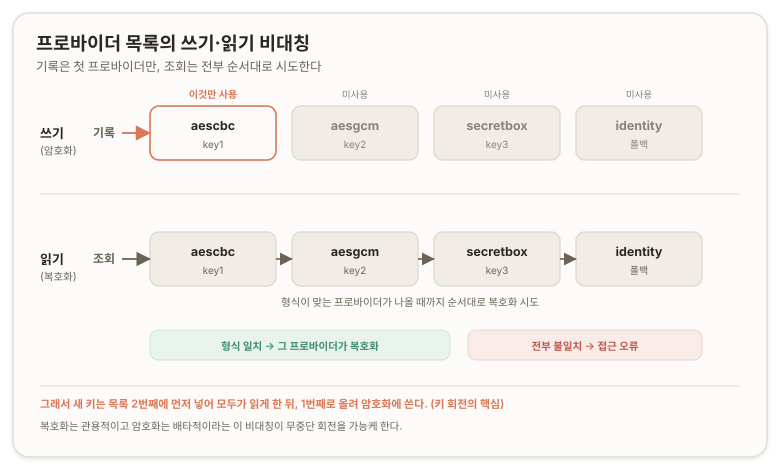
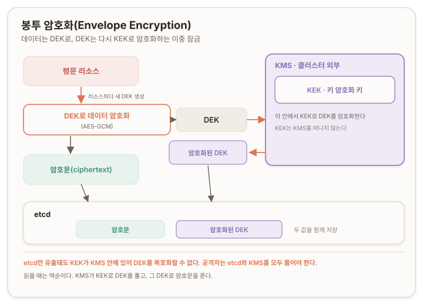
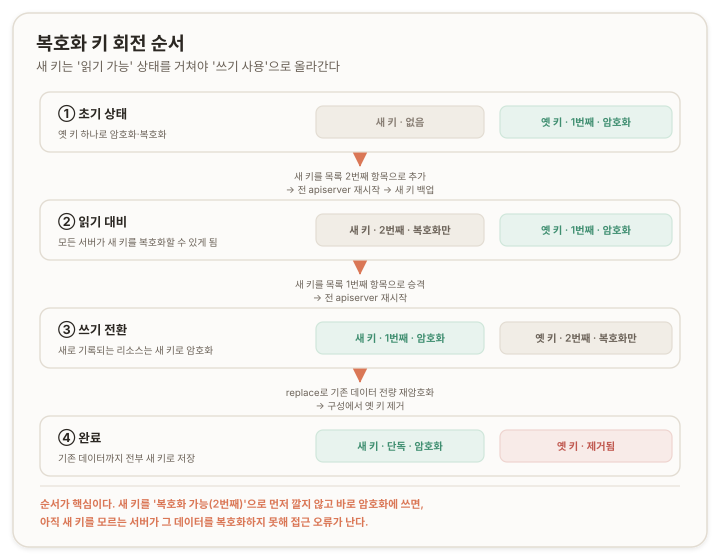

# 저장된 기밀 데이터 암호화 {#data-at-rest-encryption}

> **원문:** [Encrypting Confidential Data at Rest](https://kubernetes.io/docs/tasks/administer-cluster/encrypt-data/) · The Kubernetes Authors · [CC BY 4.0](https://creativecommons.org/licenses/by/4.0/)
>
> 이 문서는 원문의 절 순서와 계층을 보존해 옮기고 역자 주를 더했다. 문서 본문은 [CC BY 4.0](https://creativecommons.org/licenses/by/4.0/)을 따른다. 비공식 번역이며 원저작자와 프로젝트의 공인을 받지 않았다. 원문과 번역이 어긋날 경우 원문이 우선한다.
>
> 원문 시점 2025-05-09 · 번역 2026-07-13

## 결론 {#conclusion}

쿠버네티스(Kubernetes) API 서버는 기본적으로 모든 API 리소스를 etcd에 평문(plain text)으로 저장한다. Secret 같은 민감 리소스를 저장 시점에 암호화하려면 암호화 구성 파일(EncryptionConfiguration)을 작성하고 `kube-apiserver`에 `--encryption-provider-config` 플래그로 연결한다.

실무 판단은 세 축으로 갈린다.

첫째, 프로바이더(provider) 선택이다. 로컬 키 기반(`aescbc`, `aesgcm`, `secretbox`)은 etcd 유출은 막지만 호스트 유출은 막지 못한다. 키가 호스트의 구성 파일에 그대로 있기 때문이다. KMS 기반은 봉투 암호화(envelope encryption)로 키를 클러스터 밖에 둬 방어선을 하나 더 세운다.

둘째, 마이그레이션이다. 설정을 켜도 이후 새로 기록되는 데이터만 암호화된다. 이미 etcd에 들어 있는 기존 데이터는 다시 한 번 써 넣어(replace) 강제로 암호화해야 한다.

셋째, 고가용성(HA, High Availability) 구성의 정합성이다. 컨트롤 플레인(control plane) 노드가 둘 이상이면 모든 노드의 암호화 구성이 동일해야 한다. 한 노드라도 구성이 다르면 복호화가 깨진다.

이 암호화는 대상이 명확하다. **쿠버네티스 API로 저장되는 리소스 데이터**만 다룬다. 컨테이너에 마운트되는 파일시스템 자체의 암호화, 그리고 etcd 클러스터나 호스트 디스크 수준의 시스템 암호화는 이 문서의 범위가 아니다. 저장 시 암호화는 그런 시스템 수준 암호화에 더해지는 별도의 계층이다.

> **참고**
> 이 문서는 쿠버네티스 API로 저장되는 리소스 데이터의 암호화를 다룬다. 예를 들어 Secret 오브젝트를 그 안의 키-값 데이터까지 포함해 암호화할 수 있다. 컨테이너에 마운트된 파일시스템의 데이터를 암호화하려면 대신 다음 중 하나가 필요하다. 암호화된 볼륨(volume)을 제공하는 스토리지 통합을 쓰거나, 애플리케이션 안에서 직접 데이터를 암호화한다.

## 사전 준비 {#prerequisites}

이 작업에는 다음이 필요하다.

쿠버네티스 클러스터와, 그 클러스터와 통신하도록 설정된 `kubectl` 커맨드라인 도구가 있어야 한다. 컨트롤 플레인 호스트로 동작하지 않는 노드가 최소 둘 이상인 클러스터에서 실습하는 것을 권장한다. 클러스터가 없다면 [minikube의 멀티 노드 튜토리얼](https://minikube.sigs.k8s.io/docs/tutorials/multi_node/)로 하나 만들거나, 다음 플레이그라운드 중 하나를 쓸 수 있다: [iximiuz Labs](https://labs.iximiuz.com/playgrounds?category=kubernetes&filter=all), [Killercoda](https://killercoda.com/playgrounds/scenario/kubernetes), [KodeKloud](https://kodekloud.com/public-playgrounds).

이 작업은 각 컨트롤 플레인 노드에서 쿠버네티스 API 서버를 [스태틱 파드(static Pod)](https://kubernetes.io/docs/tasks/configure-pod-container/static-pod/)로 실행한다고 전제한다.

클러스터의 컨트롤 플레인은 반드시 etcd v3.x(메이저 버전 3, 마이너 버전 무관)를 써야 한다.

커스텀 리소스(custom resource)를 암호화하려면 클러스터가 쿠버네티스 v1.26 이상이어야 한다.

리소스를 와일드카드(wildcard)로 매칭하려면 클러스터가 쿠버네티스 v1.27 이상이어야 한다.

버전을 확인하려면 `kubectl version`을 입력한다.

> **역자 주 · 검증**
> 원문의 두 버전 게이트는 지금도 유효하다. 커스텀 리소스 암호화(v1.26+)와 와일드카드 매칭(v1.27+)에 필요한 최소 버전은 그대로이며, 두 기능 모두 오래전 GA(General Availability, 정식 출시)되었다. 2026년 7월 기준 [쿠버네티스가 지원하는 마이너 버전](https://kubernetes.io/releases/)은 N-2 정책에 따라 1.36 · 1.35 · 1.34이므로, 현재 지원 대상 클러스터라면 두 게이트를 모두 만족한다.

## 기존 암호화 활성화 여부 확인 {#check-existing-encryption}

기본값에서 API 서버는 리소스를 etcd에 평문 표현으로 저장하며, 저장 시 암호화를 적용하지 않는다.

`kube-apiserver` 프로세스는 `--encryption-provider-config` 인자를 받는다. 이 인자는 구성 파일의 경로를 지정하고, 그 파일의 내용이 쿠버네티스 API 데이터를 etcd에서 어떻게 암호화할지 결정한다.

판별 기준은 다음과 같다. `--encryption-provider-config` 인자 없이 `kube-apiserver`를 실행 중이라면 저장 시 암호화가 켜져 있지 않다. 이 인자와 함께 실행 중이고 참조하는 파일이 목록의 첫 번째 프로바이더로 `identity`를 지정했다면, 역시 저장 시 암호화가 켜져 있지 않다. 기본 `identity` 프로바이더는 어떤 기밀성(confidentiality) 보호도 제공하지 않기 때문이다.

이 인자와 함께 실행 중이고 참조 파일이 목록의 첫 번째 프로바이더로 `identity`가 아닌 다른 프로바이더를 지정했다면, 이미 저장 시 암호화가 켜져 있는 것이다. 다만 이 확인만으로는 이전에 수행한 암호화 저장소 마이그레이션이 성공했는지까지는 알 수 없다. 확실하지 않다면 아래 [기존 데이터 전량 암호화](#encrypt-existing) 절을 참고한다.

## 암호화 구성의 구조 {#config-structure}

```yaml
---
#
# CAUTION: this is an example configuration.
#          Do not use this for your own cluster!
#
apiVersion: apiserver.config.k8s.io/v1
kind: EncryptionConfiguration
resources:
  - resources:
      - secrets
      - configmaps
      - pandas.awesome.bears.example # a custom resource API
    providers:
      # This configuration does not provide data confidentiality. The first
      # configured provider is specifying the "identity" mechanism, which
      # stores resources as plain text.
      #
      - identity: {} # plain text, in other words NO encryption
      - aesgcm:
          keys:
            - name: key1
              secret: c2VjcmV0IGlzIHNlY3VyZQ==
            - name: key2
              secret: dGhpcyBpcyBwYXNzd29yZA==
      - aescbc:
          keys:
            - name: key1
              secret: c2VjcmV0IGlzIHNlY3VyZQ==
            - name: key2
              secret: dGhpcyBpcyBwYXNzd29yZA==
      - secretbox:
          keys:
            - name: key1
              secret: YWJjZGVmZ2hpamtsbW5vcHFyc3R1dnd4eXoxMjM0NTY=
  - resources:
      - events
    providers:
      - identity: {} # do not encrypt Events even though *.* is specified below
  - resources:
      - '*.apps' # wildcard match requires Kubernetes 1.27 or later
    providers:
      - aescbc:
          keys:
          - name: key2
            secret: c2VjcmV0IGlzIHNlY3VyZSwgb3IgaXMgaXQ/Cg==
  - resources:
      - '*.*' # wildcard match requires Kubernetes 1.27 or later
    providers:
      - aescbc:
          keys:
          - name: key3
            secret: c2VjcmV0IGlzIHNlY3VyZSwgSSB0aGluaw==
```

`resources` 배열의 각 항목은 완전한 구성을 담은 별개의 설정이다. `resources.resources` 필드는 암호화할 쿠버네티스 리소스 이름(`resource` 또는 `resource.group` 형식)의 배열이며, Secret이나 ConfigMap 같은 리소스가 여기에 들어간다.

커스텀 리소스를 `EncryptionConfiguration`에 추가하고 클러스터 버전이 1.26 이상이면, 그 뒤로 새로 생성되는 해당 커스텀 리소스는 암호화된다. 이 버전과 구성이 적용되기 전부터 etcd에 있던 커스텀 리소스는 다음번 저장소에 기록될 때까지 암호화되지 않은 상태로 남는다. 내장 리소스와 동일한 동작이다. [기존 데이터 전량 암호화](#encrypt-existing) 절을 참고한다.

`providers` 배열은 나열한 API에 사용할 암호화 프로바이더의 순서 있는 목록이다. 각 프로바이더는 여러 개의 키를 지원한다. 복호화 시에는 키를 순서대로 시도하고, 해당 프로바이더가 첫 번째 프로바이더라면 첫 번째 키가 암호화에 쓰인다.

한 항목에는 프로바이더 유형을 하나만 지정할 수 있다. `identity`나 `aescbc` 중 하나는 지정할 수 있지만 같은 항목에 둘을 함께 넣을 수는 없다.

목록의 첫 번째 프로바이더가 저장소에 기록되는 리소스를 암호화한다. 저장소에서 리소스를 읽을 때는 저장된 데이터와 형식이 맞는 각 프로바이더가 순서대로 복호화를 시도한다. 형식이나 비밀 키가 맞지 않아 어떤 프로바이더도 저장된 데이터를 읽지 못하면 오류가 반환되고, 클라이언트는 그 리소스에 접근할 수 없게 된다.

<figure>
  
  <figcaption>프로바이더 목록의 쓰기·읽기 비대칭. 기록은 첫 프로바이더만 사용하고, 조회는 형식이 맞을 때까지 전 프로바이더를 순서대로 시도한다.</figcaption>
</figure>

`EncryptionConfiguration`은 암호화 대상 리소스를 지정하는 데 와일드카드를 지원한다. `*.<group>` 형식으로 한 그룹 안의 모든 리소스를 암호화하고(위 예시의 `*.apps`), `*.*`로 모든 리소스를 암호화한다. `*.`은 코어(core) 그룹의 모든 리소스를 암호화하는 데 쓴다. `*.*`는 API 서버 시작 이후 추가되는 커스텀 리소스까지 포함해 모든 리소스를 암호화한다.

> **참고**
> 같은 리소스 목록 안에서, 또는 여러 항목에 걸쳐 겹치는(overlap) 와일드카드는 허용되지 않는다. 구성의 일부가 무효가 되기 때문이다. `resources` 목록의 처리 순서와 우선순위는 구성에 나열된 순서로 결정된다.

와일드카드가 어떤 리소스들을 포괄하는 상황에서 특정 종류의 리소스만 저장 시 암호화에서 제외하고 싶다면, 제외할 리소스 이름을 담은 별개의 `resources` 배열 항목을 만들고 그 항목의 `providers`에 `identity` 프로바이더를 지정한다. 이 항목은 암호화를 지정한 구성(즉 `identity`가 아닌 프로바이더)보다 앞쪽에 오도록 목록에 넣는다.

예를 들어 `*.*`가 켜져 있는 상태에서 Events와 ConfigMap을 암호화에서 제외하려면, `resources`에 더 **앞선** 항목을 새로 추가하고 그 뒤에 `identity`를 프로바이더로 지정한 `providers` 항목을 둔다. 더 구체적인 항목이 와일드카드 항목보다 먼저 와야 한다.

새 항목은 다음과 비슷한 모양이 된다.

```yaml
  ...
  - resources:
      - configmaps. # specifically from the core API group,
                    # because of trailing "."
      - events
    providers:
      - identity: {}
  # and then other entries in resources
```

제외 항목이 와일드카드 `*.*` 항목보다 `resources` 배열에서 **앞서** 나열되도록 해 우선순위를 준다.

`EncryptionConfiguration` 구조체에 대한 더 자세한 내용은 [암호화 구성 API](https://kubernetes.io/docs/reference/config-api/apiserver-config.v1/)를 참고한다.

> **주의**
> 키가 변경되어 어떤 리소스를 암호화 구성으로 읽을 수 없게 되었고 동작하는 구성으로 복구할 수도 없다면, 유일한 수단은 그 항목을 etcd에서 직접 삭제하는 것이다. 삭제되거나 유효한 복호화 키가 제공되기 전까지, 그 리소스를 읽으려는 모든 쿠버네티스 API 호출은 실패한다.

### 사용 가능한 프로바이더 {#providers}

클러스터의 쿠버네티스 API 데이터에 저장 시 암호화를 구성하기 전에, 어떤 프로바이더를 쓸지 먼저 선택해야 한다. 각 프로바이더의 특성은 다음과 같다.

| 프로바이더 | 암호화 방식 | 강도 | 속도 | 키 길이 |
| --- | --- | --- | --- | --- |
| `identity` | 없음(None) | 해당 없음 | 해당 없음 | 해당 없음 |
| `aescbc` | AES-CBC + [PKCS#7](https://datatracker.ietf.org/doc/html/rfc2315) 패딩 | 약함(Weak) | 빠름(Fast) | 16, 24, 32바이트 |
| `aesgcm` | AES-GCM + 랜덤 논스(random nonce) | 20만 회 기록마다 회전 필요 | 가장 빠름(Fastest) | 16, 24, 32바이트 |
| `kms` v1 *(v1.28부터 폐기 예정)* | DEK를 리소스마다 두는 봉투 암호화 | 가장 강함(Strongest) | 느림(*kms v2 대비*) | 32바이트 |
| `kms` v2 | DEK를 API 서버마다 두는 봉투 암호화 | 가장 강함(Strongest) | 빠름(Fast) | 32바이트 |
| `secretbox` | XSalsa20 + Poly1305 | 강함(Strong) | 더 빠름(Faster) | 32바이트 |

프로바이더별 세부 특성은 다음과 같다.

`identity`: 리소스를 암호화 없이 있는 그대로 기록한다. 첫 번째 프로바이더로 설정하면 새 값이 기록될 때 리소스가 복호화된다. 다만 기존에 암호화된 리소스가 자동으로 평문으로 덮어써지지는 **않는다**. 별도로 지정하지 않으면 `identity`가 기본값이다.

`aescbc`: CBC가 패딩 오라클 공격(padding oracle attack)에 취약하므로 권장하지 않는다. 키 자료(key material)는 컨트롤 플레인 호스트에서 접근할 수 있다.

`aesgcm`: 자동 키 회전 체계를 구현한 경우가 아니라면 사용을 권장하지 않는다. 키 자료는 컨트롤 플레인 호스트에서 접근할 수 있다.

`kms` v1 *(쿠버네티스 v1.28부터 폐기 예정)*: 데이터는 데이터 암호화 키(DEK, Data Encryption Key)를 이용해 AES-GCM으로 암호화된다. DEK는 키 관리 서비스(KMS, Key Management Service) 구성에 따라 키 암호화 키(KEK, Key Encryption Key)로 암호화된다. 키 회전이 단순하며, 암호화마다 새 DEK가 생성되고 KEK 회전은 사용자가 제어한다. [KMS V1 프로바이더 구성 방법](https://kubernetes.io/docs/tasks/administer-cluster/kms-provider#configuring-the-kms-provider-kms-v1)을 참고한다.

`kms` v2: 데이터는 DEK를 이용해 AES-GCM으로 암호화된다. DEK는 KMS 구성에 따라 KEK로 암호화된다. 쿠버네티스는 비밀 시드(secret seed)로부터 암호화마다 새 DEK를 생성한다. 이 시드는 KEK가 회전될 때마다 함께 회전된다. 서드파티(third party) 키 관리 도구를 쓴다면 좋은 선택지다. 쿠버네티스 v1.29부터 안정(stable) 상태로 제공된다. [KMS V2 프로바이더 구성 방법](https://kubernetes.io/docs/tasks/administer-cluster/kms-provider#configuring-the-kms-provider-kms-v2)을 참고한다.

`secretbox`: 비교적 새로운 암호화 기술을 사용하므로, 높은 수준의 검토를 요구하는 환경에서는 수용되지 않을 수 있다. 키 자료는 컨트롤 플레인 호스트에서 접근할 수 있다.

`identity`는 별도로 지정하지 않으면 적용되는 기본값이다. **`identity` 프로바이더는 저장된 데이터를 암호화하지 않으며 어떤 기밀성 보호도 추가하지 않는다.**

> **역자 주 · 검증**
> `kms` v1에 대한 원문 서술은 정확하지만 현행 버전 기준으로 불완전하다. [공식 KMS 프로바이더 문서](https://kubernetes.io/docs/tasks/administer-cluster/kms-provider/)에 따르면 `kms` v1은 v1.28부터 폐기 예정(deprecated)일 뿐 아니라 **v1.29부터 기본 비활성화**다. 따라서 v1.29 이상에서 KMS v1을 쓰려면 `--feature-gates=KMSv1=true`로 기능 게이트(feature gate)를 명시적으로 켜야 한다. v1.36까지 KMS v1은 제거되지 않고 게이트 뒤에 남아 있으나, 공식 문서는 성능 이점이 큰 `kms` v2 사용을 권장한다. 신규 구성이라면 KMS v2를 선택하는 편이 맞다.

### 키 저장 {#key-storage}

#### 로컬 키 저장 {#local-key-storage}

로컬에서 관리하는 키로 시크릿 데이터를 암호화하면 etcd 유출은 방어할 수 있지만 호스트 유출은 방어하지 못한다. 암호화 키가 호스트의 `EncryptionConfiguration` YAML 파일에 저장되므로, 숙련된 공격자는 그 파일에 접근해 암호화 키를 추출할 수 있다.

#### 관리형(KMS) 키 저장 {#kms-key-storage}

KMS 프로바이더는 봉투 암호화(envelope encryption)를 쓴다. 쿠버네티스가 데이터 키(data key)로 리소스를 암호화한 다음, 그 데이터 키를 관리형 암호화 서비스로 다시 암호화한다. 쿠버네티스는 리소스마다 고유한 데이터 키를 생성한다. API 서버는 암호화된 데이터 키를 암호문(ciphertext)과 함께 etcd에 저장하고, 리소스를 읽을 때 관리형 암호화 서비스를 호출하며 암호문과 (암호화된) 데이터 키를 함께 넘긴다. 관리형 암호화 서비스 안에서 프로바이더는 키 암호화 키(key encryption key)로 데이터 키를 복호화하고, 최종적으로 평문을 복원한다. 컨트롤 플레인과 KMS 사이의 통신에는 TLS(Transport Layer Security) 같은 전송 중 보호(in-transit protection)가 필요하다.

봉투 암호화를 쓰면 쿠버네티스에 저장되지 않는 키 암호화 키에 대한 의존이 생긴다. KMS의 경우, 평문 값에 무단으로 접근하려는 공격자는 etcd **와** 서드파티 KMS 프로바이더를 **모두** 뚫어야 한다.

### 암호화 키 보호 {#key-protection}

복호화를 가능케 하는 기밀 정보는 로컬 암호화 키든 API 서버가 KMS를 호출하게 해 주는 인증 토큰이든 적절히 보호해야 한다.

주 암호화 키(하나 또는 여럿)의 사용과 수명 주기를 프로바이더에 맡기더라도, 관리형 암호화 서비스의 접근 제어와 그 밖의 보안 조치가 보안 요구에 맞도록 보장할 책임은 여전히 사용자에게 있다.

<figure>
  
  <figcaption>봉투 암호화의 이중 잠금. 데이터는 DEK로, DEK는 KMS의 KEK로 암호화되어 암호문과 함께 etcd에 저장된다. etcd와 KMS를 모두 뚫어야 복호화가 가능하다.</figcaption>
</figure>

## 데이터 암호화 {#encrypt-data}

### 암호화 키 생성 {#generate-key}

이하 단계는 KMS를 쓰지 않는다고 전제하며, 따라서 암호화 키를 직접 생성해야 한다고 가정한다. 이미 암호화 키가 있다면 [암호화 구성 파일 작성](#write-config)으로 건너뛴다.

> **주의**
> 원시 암호화 키를 `EncryptionConfig`에 저장하는 방식은, 암호화를 전혀 하지 않는 경우에 비하면 보안 태세를 완만하게 개선하는 정도에 그친다. 더 강한 비밀 유지가 필요하다면 `kms` 프로바이더 사용을 고려한다. 클러스터 밖에 보관되는 키에 의존하기 때문이다. `kms` 구현은 하드웨어 보안 모듈(HSM, Hardware Security Module)이나 클라우드 제공자가 관리하는 암호화 서비스와 함께 동작할 수 있다. KMS로 저장 시 암호화를 구성하는 방법은 [KMS 프로바이더로 데이터 암호화하기](https://kubernetes.io/docs/tasks/administer-cluster/kms-provider/)를 참고한다. 사용하는 KMS 프로바이더 플러그인에도 별도의 세부 문서가 있을 수 있다.

먼저 새 암호화 키를 생성한 다음 base64로 인코딩한다.

32바이트 랜덤 키를 생성하고 base64로 인코딩한다. 다음 명령을 쓸 수 있다.

```shell
head -c 32 /dev/urandom | base64
```

PC에 내장된 하드웨어 엔트로피 소스를 쓰고 싶다면 `/dev/urandom` 대신 `/dev/hwrng`를 쓸 수 있다. 모든 리눅스(Linux) 장치가 하드웨어 난수 생성기를 제공하지는 않는다.

PowerShell에서는 다음 명령을 쓸 수 있다.

```powershell
# Do not run this in a session where you have set a random number
# generator seed.
[Convert]::ToBase64String((1..32|%{[byte](Get-Random -Max 256)}))
```

> **참고**
> 암호화 키는 생성하는 동안은 물론, 더 이상 적극적으로 사용하지 않게 된 뒤에도 기밀로 유지한다.

### 암호화 키 복제 {#replicate-key}

안전한 파일 전송 방식을 써서 그 암호화 키의 사본을 다른 모든 컨트롤 플레인 호스트에 배포한다. 최소한 전송 중 암호화(예: SSH, Secure Shell)를 쓴다. 더 강한 보안이 필요하면 호스트 간 비대칭 암호화(asymmetric encryption)를 쓰거나, 아예 KMS 암호화에 의존하도록 방식을 바꾼다.

### 암호화 구성 파일 작성 {#write-config}

> **주의**
> 암호화 구성 파일에는 etcd의 내용을 복호화할 수 있는 키가 담길 수 있다. 파일에 키 자료가 들어 있다면, 모든 컨트롤 플레인 호스트에서 권한을 적절히 제한해 `kube-apiserver`를 실행하는 사용자만 이 구성을 읽을 수 있게 해야 한다.

새 암호화 구성 파일을 만든다. 내용은 다음과 비슷해야 한다.

```yaml
---
apiVersion: apiserver.config.k8s.io/v1
kind: EncryptionConfiguration
resources:
  - resources:
      - secrets
      - configmaps
      - pandas.awesome.bears.example
    providers:
      - aescbc:
          keys:
            - name: key1
              # See the following text for more details about the secret value
              secret: <BASE 64 ENCODED SECRET>
      - identity: {} # this fallback allows reading unencrypted secrets;
                     # for example, during initial migration
```

KMS를 쓰지 않는 새 암호화 키를 만들려면 [암호화 키 생성](#generate-key)을 참고한다.

### 암호화 구성 파일 적용 {#apply-config}

새 암호화 구성 파일을 `kube-apiserver` 스태틱 파드에 마운트해야 한다. 방법의 한 예는 다음과 같다.

1. 새 암호화 구성 파일을 컨트롤 플레인 노드의 `/etc/kubernetes/enc/enc.yaml`에 저장한다.

2. `kube-apiserver` 스태틱 파드의 매니페스트 `/etc/kubernetes/manifests/kube-apiserver.yaml`을 다음과 비슷하게 수정한다.

   ```yaml
   ---
   #
   # This is a fragment of a manifest for a static Pod.
   # Check whether this is correct for your cluster and for your API server.
   #
   apiVersion: v1
   kind: Pod
   metadata:
     annotations:
       kubeadm.kubernetes.io/kube-apiserver.advertise-address.endpoint: 10.20.30.40:443
     creationTimestamp: null
     labels:
       app.kubernetes.io/component: kube-apiserver
       tier: control-plane
     name: kube-apiserver
     namespace: kube-system
   spec:
     containers:
     - command:
       - kube-apiserver
       ...
       - --encryption-provider-config=/etc/kubernetes/enc/enc.yaml  # add this line
       volumeMounts:
       ...
       - name: enc                           # add this line
         mountPath: /etc/kubernetes/enc      # add this line
         readOnly: true                      # add this line
       ...
     volumes:
     ...
     - name: enc                            # add this line
       hostPath:                            # add this line
         path: /etc/kubernetes/enc          # add this line
         type: DirectoryOrCreate            # add this line
     ...
   ```

3. API 서버를 재시작한다.

> **주의**
> 구성 파일에는 etcd의 내용을 복호화할 수 있는 키가 담기므로, 컨트롤 플레인 노드에서 권한을 적절히 제한해 `kube-apiserver`를 실행하는 사용자만 읽을 수 있게 해야 한다.

이제 컨트롤 플레인 호스트 **한 대**에 암호화가 적용되었다. 일반적인 쿠버네티스 클러스터에는 컨트롤 플레인 호스트가 여럿 있으므로 할 일이 더 남았다.

### 다른 컨트롤 플레인 호스트 재구성 {#reconfigure-hosts}

클러스터에 API 서버가 여럿이라면, 변경을 각 API 서버에 차례대로 배포해야 한다.

> **주의**
> 컨트롤 플레인 노드가 둘 이상인 클러스터 구성에서는 암호화 구성이 각 컨트롤 플레인 노드에서 동일해야 한다. 컨트롤 플레인 노드 간 암호화 프로바이더 구성에 차이가 있으면, 그 차이로 인해 `kube-apiserver`가 데이터를 복호화하지 못할 수 있다.

클러스터의 암호화 구성을 갱신할 계획이라면, 변경을 롤아웃(rollout)하는 도중에도 컨트롤 플레인의 API 서버들이 저장된 데이터를 항상 복호화할 수 있도록 순서를 짠다.

각 컨트롤 플레인 호스트에서 **동일한** 암호화 구성을 쓰도록 한다.

### 신규 기록 데이터 암호화 확인 {#verify-encryption}

데이터는 etcd에 기록될 때 암호화된다. `kube-apiserver`를 재시작한 뒤에는 새로 생성되거나 갱신되는 Secret(또는 `EncryptionConfiguration`에 구성된 다른 리소스 종류)이 저장될 때 암호화되어야 한다.

이를 확인하려면 `etcdctl` 커맨드라인 프로그램으로 시크릿 데이터의 내용을 가져올 수 있다. 다음 예시는 Secret API 암호화를 확인하는 방법이다.

1. `default` 네임스페이스에 `secret1`이라는 새 Secret을 만든다.

   ```shell
   kubectl create secret generic secret1 -n default --from-literal=mykey=mydata
   ```

2. `etcdctl` 커맨드라인 도구로 그 Secret을 etcd에서 읽는다.

   ```ini
   ETCDCTL_API=3 etcdctl get /registry/secrets/default/secret1 [...] | hexdump -C
   ```

   여기서 `[...]`는 etcd 서버에 연결하기 위한 추가 인자여야 한다. 예를 들면 다음과 같다.

   ```shell
   ETCDCTL_API=3 etcdctl \
      --cacert=/etc/kubernetes/pki/etcd/ca.crt   \
      --cert=/etc/kubernetes/pki/etcd/server.crt \
      --key=/etc/kubernetes/pki/etcd/server.key  \
      get /registry/secrets/default/secret1 | hexdump -C
   ```

   출력은 다음과 비슷하다(축약).

   ```hexdump
   00000000  2f 72 65 67 69 73 74 72  79 2f 73 65 63 72 65 74  |/registry/secret|
   00000010  73 2f 64 65 66 61 75 6c  74 2f 73 65 63 72 65 74  |s/default/secret|
   00000020  31 0a 6b 38 73 3a 65 6e  63 3a 61 65 73 63 62 63  |1.k8s:enc:aescbc|
   00000030  3a 76 31 3a 6b 65 79 31  3a c7 6c e7 d3 09 bc 06  |:v1:key1:.l.....|
   00000040  25 51 91 e4 e0 6c e5 b1  4d 7a 8b 3d b9 c2 7c 6e  |%Q...l..Mz.=..|n|
   00000050  b4 79 df 05 28 ae 0d 8e  5f 35 13 2c c0 18 99 3e  |.y..(..._5.,...>|
   [...]
   00000110  23 3a 0d fc 28 ca 48 2d  6b 2d 46 cc 72 0b 70 4c  |#:..(.H-k-F.r.pL|
   00000120  a5 fc 35 43 12 4e 60 ef  bf 6f fe cf df 0b ad 1f  |..5C.N`..o......|
   00000130  82 c4 88 53 02 da 3e 66  ff 0a                    |...S..>f..|
   0000013a
   ```

3. 저장된 Secret이 `k8s:enc:aescbc:v1:` 접두사로 시작하는지 확인한다. 이 접두사는 `aescbc` 프로바이더가 결과 데이터를 암호화했음을 나타낸다. etcd에 표시된 키 이름이 위 `EncryptionConfiguration`에 지정한 키 이름과 일치하는지도 확인한다. 이 예시에서는 `key1`이라는 암호화 키가 etcd와 `EncryptionConfiguration` 양쪽에서 쓰인 것을 볼 수 있다.

4. API로 조회했을 때 Secret이 올바르게 복호화되는지 확인한다.

   ```shell
   kubectl get secret secret1 -n default -o yaml
   ```

   출력에는 `mydata`를 base64로 인코딩한 `mykey: bXlkYXRh`가 포함되어야 한다. Secret을 완전히 디코딩하는 방법은 [Secret 디코딩](https://kubernetes.io/docs/tasks/configmap-secret/managing-secret-using-kubectl/#decoding-secret)을 참고한다.

### 기존 데이터 전량 암호화 {#encrypt-existing}

새 오브젝트가 암호화되게 하는 것만으로는 대개 충분하지 않다. 이미 저장되어 있는 오브젝트에도 암호화가 적용되기를 원하기 때문이다.

이 예시에서는 Secret이 기록 시 암호화되도록 클러스터를 구성했다. 각 Secret에 대해 replace 작업을 수행하면, 오브젝트 자체는 바뀌지 않은 채로 그 내용이 저장 시 암호화된다.

클러스터의 모든 Secret에 이 변경을 적용할 수 있다.

```shell
# Run this as an administrator that can read and write all Secrets
kubectl get secrets --all-namespaces -o json | kubectl replace -f -
```

위 명령은 모든 Secret을 읽은 뒤 같은 데이터로 갱신해 서버 사이드 암호화(server side encryption)를 적용한다.

> **참고**
> 충돌하는 쓰기(conflicting write)로 오류가 나면 명령을 다시 실행한다. 그 명령은 여러 번 실행해도 안전하다. 규모가 큰 클러스터에서는 Secret을 네임스페이스 단위로 나누거나 갱신을 스크립트로 처리하는 편이 나을 수 있다.

## 평문 조회 차단 {#prevent-plaintext-read}

특정 API 종류에 대한 접근이 오직 암호화를 통해서만 이루어지도록 보장하고 싶다면, API 서버가 해당 API의 백킹 데이터(backing data)를 평문으로 읽는 능력 자체를 제거할 수 있다.

> **경고**
> 이 변경은 저장 시 암호화 대상으로 표시되었지만 실제로는 평문으로 저장된 리소스를 API 서버가 가져오지 못하게 한다. 어떤 API(예: 코어 API 그룹의 `secrets` 리소스를 나타내는 `Secret` 종류)에 저장 시 암호화를 구성했다면, 이 클러스터의 해당 리소스가 **모두** 실제로 저장 시 암호화되어 있는지 반드시 확인해야 한다. 다음 단계로 넘어가기 전에 이를 점검한다.

클러스터의 모든 Secret이 암호화되고 나면, 암호화 구성에서 `identity` 부분을 제거할 수 있다. 예를 들면 다음과 같다.

```yaml
---
apiVersion: apiserver.config.k8s.io/v1
kind: EncryptionConfiguration
resources:
  - resources:
      - secrets
    providers:
      - aescbc:
          keys:
            - name: key1
              secret: <BASE 64 ENCODED SECRET>
      - identity: {} # REMOVE THIS LINE
```

그런 다음 각 API 서버를 차례대로 재시작한다. 이 변경은 실수로라도 API 서버가 평문 Secret에 접근하는 것을 막는다.

## 복호화 키 회전 {#rotate-key}

다운타임(downtime) 없이 쿠버네티스의 암호화 키를 바꾸려면 여러 단계의 작업이 필요하다. 특히 여러 `kube-apiserver` 프로세스가 동작하는 고가용성 배포에서 그렇다.

1. 새 키를 생성하고, 모든 컨트롤 플레인 노드에서 현재 프로바이더의 두 번째 키 항목으로 추가한다.
2. **모든** `kube-apiserver` 프로세스를 재시작해, 각 서버가 새 키로 암호화된 데이터를 복호화할 수 있게 한다.
3. 새 암호화 키를 안전하게 백업한다. 이 키의 사본을 모두 잃으면, 그 잃어버린 키로 암호화된 모든 리소스를 삭제해야 하며, 저장 시 암호화가 깨진 동안에는 워크로드(workload)가 예상대로 동작하지 않을 수 있다.
4. 새 키를 `keys` 배열의 첫 번째 항목으로 만들어, 새로 기록되는 데이터의 저장 시 암호화에 쓰이도록 한다.
5. 모든 `kube-apiserver` 프로세스를 재시작해, 각 컨트롤 플레인 호스트가 이제 새 키로 암호화하도록 한다.
6. 권한 있는 사용자로 `kubectl get secrets --all-namespaces -o json | kubectl replace -f -`를 실행해, 기존의 모든 Secret을 새 키로 암호화한다.
7. 기존의 모든 Secret을 새 키로 갱신하고 새 키를 안전하게 백업한 뒤, 구성에서 예전 복호화 키를 제거한다.

<figure>
  
  <figcaption>복호화 키 회전 순서. 새 키는 복호화 가능(2번째) 상태를 거쳐 암호화(1번째)로 승격되고, 옛 키는 강등 후 제거된다.</figcaption>
</figure>

## 전체 데이터 복호화 {#decrypt-all}

이 예시는 Secret API의 저장 시 암호화를 중단하는 방법을 보여 준다. 다른 API 종류를 암호화하고 있다면 단계를 그에 맞게 조정한다.

저장 시 암호화를 비활성화하려면, 암호화 구성 파일에서 `identity` 프로바이더를 첫 번째 항목으로 둔다.

```yaml
---
apiVersion: apiserver.config.k8s.io/v1
kind: EncryptionConfiguration
resources:
  - resources:
      - secrets
      # list any other resources here that you previously were
      # encrypting at rest
    providers:
      - identity: {} # add this line
      - aescbc:
          keys:
            - name: key1
              secret: <BASE 64 ENCODED SECRET> # keep this in place
                                               # make sure it comes after "identity"
```

그런 다음 다음 명령을 실행해 모든 Secret의 복호화를 강제한다.

```shell
kubectl get secrets --all-namespaces -o json | kubectl replace -f -
```

기존의 암호화된 리소스를 모두 암호화하지 않은 백킹 데이터로 교체하고 나면, `kube-apiserver`에서 암호화 설정을 제거할 수 있다.

## 구성 자동 리로드 설정 {#automatic-reload}

암호화 프로바이더 구성의 자동 리로드(reload)를 설정할 수 있다. 이 설정은 API 서버가 `--encryption-provider-config`로 지정한 파일을 시작 시 한 번만 로드할지, 아니면 그 파일을 변경할 때마다 자동으로 로드할지를 결정한다. 이 옵션을 켜면 API 서버를 재시작하지 않고도 저장 시 암호화 키를 바꿀 수 있다.

자동 리로드를 허용하려면 API 서버를 `--encryption-provider-config-automatic-reload=true`로 실행하도록 구성한다. 이 옵션이 켜지면 파일 변경을 1분마다 폴링(polling)해 수정 사항을 관찰한다. `apiserver_encryption_config_controller_automatic_reload_last_timestamp_seconds` 메트릭(metric)으로 새 구성이 언제 유효해지는지 식별할 수 있다. 이로써 API 서버를 재시작하지 않고 암호화 키를 회전할 수 있다.

## 역자 주 · 적용 {#translator-notes-application}

이 문서의 절차를 실습으로 옮길 때 일반적으로 성립하는 지침이다.

로컬 키 방식은 실습·학습 환경의 진입점으로 적절하다. `head -c 32 /dev/urandom | base64`로 키를 만들고 `aescbc` 대신 `secretbox`(XSalsa20-Poly1305) 또는 `aesgcm`을 첫 프로바이더로 두는 구성이면, 암호화가 실제로 걸리는지를 etcd 헥스덤프(hexdump)의 `k8s:enc:<provider>:v1:<key>:` 접두사로 눈으로 확인할 수 있다. 확인의 핵심은 접두사에 드러나는 프로바이더 이름과 키 이름이 `EncryptionConfiguration`의 값과 일치하는지다.

암호화를 켠 직후에는 신규 기록만 암호화된다는 점을 반드시 별도 단계로 인지한다. `kubectl get secrets --all-namespaces -o json | kubectl replace -f -`로 기존 데이터를 다시 써 넣기 전까지 etcd에는 평문 리소스가 남아 있다. 평문 조회 차단(`identity` 제거)은 이 마이그레이션이 끝난 뒤에만 안전하다. 순서를 뒤집으면 API 서버가 아직 평문인 리소스를 읽지 못해 접근 오류가 난다.

컨트롤 플레인 노드가 둘 이상인 실습이라면, 모든 노드의 구성 파일이 바이트 단위로 동일한지가 복호화 정합성의 전제다. 키 회전과 구성 변경은 롤링(rolling)으로 진행하되, 롤아웃 도중에도 모든 노드가 옛 키와 새 키를 모두 복호화할 수 있는 상태를 거치도록 순서를 짠다.

로컬 키 방식의 한계는 명확하다. 키가 호스트 파일에 그대로 있으므로 호스트 유출을 막지 못한다. 위협 모델에 호스트 침해가 포함된다면 KMS v2 봉투 암호화가 다음 단계다.

<!-- REVIEW-REQUIRED · 경험 슬롯
     직접 실습·검증한 결과가 있으면 아래 블록의 주석을 풀고 1인칭으로 채운다.
     없으면 이 주석 블록째로 삭제한다. 채우지 않은 채 draft를 해제하지 않는다.
> **역자 주 · 적용(경험)**
> <1차 경험을 1인칭으로>
-->

## 참고 출처 {#references}

원문이 링크한 출처:

- [Secret](https://kubernetes.io/docs/concepts/configuration/secret/) · 쿠버네티스 공식 문서
- [쿠버네티스 API](https://kubernetes.io/docs/concepts/overview/kubernetes-api/) · 쿠버네티스 공식 문서
- [볼륨(Volumes)](https://kubernetes.io/docs/concepts/storage/volumes/) · 쿠버네티스 공식 문서
- [스태틱 파드(Static Pods)](https://kubernetes.io/docs/tasks/configure-pod-container/static-pod/) · 쿠버네티스 공식 문서
- [암호화 구성 API(apiserver-config.v1)](https://kubernetes.io/docs/reference/config-api/apiserver-config.v1/) · 쿠버네티스 공식 레퍼런스
- [KMS 프로바이더로 데이터 암호화하기](https://kubernetes.io/docs/tasks/administer-cluster/kms-provider/) · 쿠버네티스 공식 문서
- [Secret 디코딩](https://kubernetes.io/docs/tasks/configmap-secret/managing-secret-using-kubectl/#decoding-secret) · 쿠버네티스 공식 문서
- [PKCS#7 (RFC 2315)](https://datatracker.ietf.org/doc/html/rfc2315) · IETF

역자 검증 출처:

- [KMS 프로바이더로 데이터 암호화하기](https://kubernetes.io/docs/tasks/administer-cluster/kms-provider/) · KMS v1의 v1.29 기본 비활성화와 `--feature-gates=KMSv1=true` 요구, KMS v2 GA 확인
- [Kubernetes Releases](https://kubernetes.io/releases/) · 2026-07 기준 안정 버전 v1.36.2, 지원 마이너 1.36 · 1.35 · 1.34 확인
- [Feature Gates](https://kubernetes.io/docs/reference/command-line-tools-reference/feature-gates/) · `KMSv1` 기능 게이트 상태 확인
